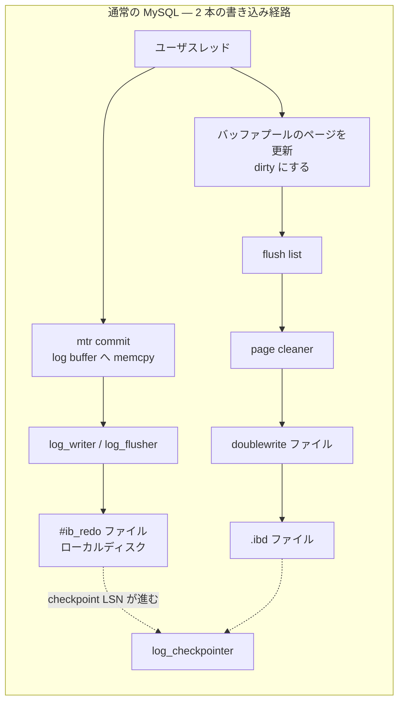
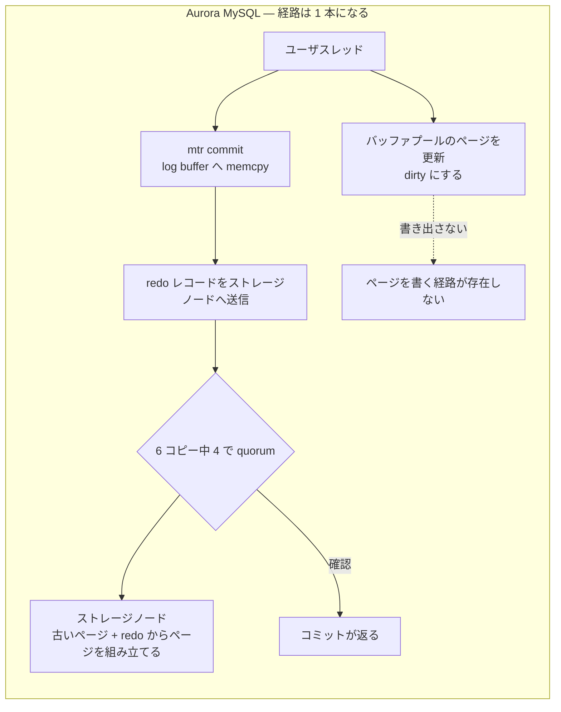

> **前提**: [バッファプール](./buffer-pool-walkthrough/) / [redo ログ](./redo-log-walkthrough/)

## 何を学んだか

Aurora MySQL は「MySQL を書き直したもの」ではない。**置き換わったのは InnoDB のいちばん下、ページをディスクに書く部分だけ**で、その上は驚くほどそのまま残っている。

置き換えの核心は 1 行で言える。

> **The only writes that cross the network are redo log records. No pages are ever written from the database tier.**
> — [Recommendations for MySQL features in Aurora MySQL](https://docs.aws.amazon.com/AmazonRDS/latest/AuroraUserGuide/AuroraMySQL.BestPractices.FeatureRecommendations.html)

[redo ログのページ](./redo-log-walkthrough/)で見たとおり、通常の InnoDB でも「ページより先に redo を書く」のが原則だ (WAL)。Aurora はここから一歩進んで、**ページを書く工程そのものを DB インスタンスから取り除いた**。ページは、必要になったときにストレージノードが「古いページ + それ以降の redo レコード」から組み立てる。

この 1 点の変更が、この章の耐久性の群 (order 67-72) とバッファプールの群の一部を丸ごと無効化する。同時に、redo が**レプリケーションそのもの**になるので、binlog を使ったレプリケーション (order 84-92) の前提もクラスタ内では成立しなくなる。





## 典拠 — Aurora のソースは読めない

この章のほかのページと違って、**ここで引けるソースコードはない**。Aurora のストレージ層も、Aurora が加えた InnoDB への変更も公開されていない。だから見出しを「ソースコードのどこか」ではなく「典拠」にしてある。

根拠にできるのは次の 2 つだけだ。

- **SIGMOD 2017 論文** "Amazon Aurora: Design Considerations for High Throughput Cloud-Native Relational Databases" (Verbitski ほか)。ストレージ層の設計、6 コピー / quorum、redo のみを送るという方針、リカバリの考え方が書かれている
- **SIGMOD 2018 論文** "Amazon Aurora: On Avoiding Distributed Consensus for I/Os, Commits, and Membership Changes"。コミットとメンバシップ変更でコンセンサスを避ける方法を扱う
- **AWS の公式ドキュメント**。パラメータが適用されるかどうか、メトリクス名、バージョンごとの挙動差はここが唯一の正確な情報源になる

以下、断定している箇所はすべてこのどちらかに出典がある。**出典がないことは書かない**。バージョン (Aurora MySQL 2 / 3 / 8.4 系) で挙動が違う項目も多いので、運用に効く値は必ず自分のバージョンのドキュメントで確かめてほしい。

### 対照表 — この章のどのページが読み替えを必要とするか

| この章のページ                                                                                                                                             | 通常の MySQL 8.4                                             | Aurora MySQL                                                                                                                                                                            |
| ---------------------------------------------------------------------------------------------------------------------------------------------------------- | ------------------------------------------------------------ | --------------------------------------------------------------------------------------------------------------------------------------------------------------------------------------- |
| [redo ログ](./redo-log-walkthrough/)                                                                                                                       | mtr → ログバッファ → `#ib_redo` ファイル → `fsync`           | ログバッファの先がローカルファイルではなくストレージノード。**6 コピー中 4 で quorum**。redo がレプリケーションと耐久性を兼ねる                                                         |
| [log writer / flusher](./log-writer-threads/)                                                                                                              | 4 スレッドで書いて `fsync`。`=2` は flusher を起こさない     | `innodb_log_writer_threads` は**適用外**。`innodb_flush_log_at_trx_commit` の意味が変わる (後述)                                                                                        |
| [チェックポイント](./checkpoint/)                                                                                                                          | 3 つの min。進まないと redo が枯渇し全スレッドが止まる       | DB インスタンス側にチェックポイントの概念がない。`innodb_redo_log_capacity` も**適用外**。`Redo log is running out of free space` は出ない                                              |
| [flush list と page cleaner](./flush-list-and-page-cleaner/)                                                                                               | page cleaner が adaptive flushing で dirty page を書く       | **ページを書く工程が存在しない**。`innodb_io_capacity` / `innodb_io_capacity_max` / `innodb_adaptive_flushing` / `innodb_flush_neighbors` / `innodb_max_dirty_pages_pct` はすべて適用外 |
| [doublewrite](./doublewrite/)                                                                                                                              | 2 箇所に書いて torn page に備える                            | `innodb_doublewrite` は**適用外**。ページを書かないので torn page が起きる場所がない                                                                                                    |
| [クラッシュリカバリ](./crash-recovery/)                                                                                                                    | checkpoint LSN から redo をスキャンして当て、undo で巻き戻す | **redo replay を行わない**。バッファキャッシュは DB プロセスの外にあり、再起動をまたいで生き残る                                                                                        |
| [バッファプール](./buffer-pool-walkthrough/) / [LRU](./lru-and-midpoint/)                                                                                  | 残る                                                         | **残る**。ただし `innodb_buffer_pool_instances` / `innodb_buffer_pool_chunk_size` は適用外で、既定サイズはインスタンスメモリの 75%                                                      |
| [adaptive hash index](./adaptive-hash-index/)                                                                                                              | 残る                                                         | writer では残るが、**reader ではサポートされない**                                                                                                                                      |
| [read view と可視性](./read-view-and-visibility/) / [undo](./undo-log/) / [purge](./purge/)                                                                | 残る                                                         | **残る**。ただし History list length は**クラスタ全体**の話になり、reader の長いクエリが writer の purge を止める                                                                       |
| [ロックとデッドロック](./lock-modes-and-types/)                                                                                                            | 残る                                                         | **残る**。`SHOW ENGINE INNODB STATUS` の LATEST DETECTED DEADLOCK も[`data_locks`](./data-locks-and-sys-schema/)もそのまま使える                                                        |
| [B+tree](./btree-operations/) / [ページ](./page-layout/) / [レコード](./record-format/)                                                                    | 残る                                                         | **残る**。ページとレコードのバイト配置は InnoDB のまま。`innodb_page_size` は適用外 (変更できない)                                                                                      |
| [change buffer](./change-buffer/)                                                                                                                          | 8.4 で既定 OFF                                               | `innodb_change_buffering` は**適用外**                                                                                                                                                  |
| [binlog](./binlog-walkthrough/) / [2PC とグループコミット](./two-phase-commit-and-group-commit/)                                                           | コミットの必須経路                                           | クラスタ内レプリケーションには不要。**既定で OFF**。外部レプリケーション / CDC のためだけに有効化する                                                                                   |
| [レプリカ遅延](./replication-lag/)                                                                                                                         | `Seconds_Behind_Source` を receiver / applier から計算       | reader は binlog を適用しないので**この経路がそもそもない**。`AuroraReplicaLag` (ミリ秒) を見る                                                                                         |
| [パーサ](./parser-walkthrough/) / [オプティマイザ](./optimizer-walkthrough/) / [エグゼキュータ](./executor-walkthrough/) / [プロトコル](./packet-framing/) | —                                                            | **そのまま**。この章の order 12-45 はほぼ全部そのまま通用する                                                                                                                           |
| [内部一時表](./materialization-and-temptable/)                                                                                                             | TempTable → mmap → InnoDB へ溢れる                           | reader では **InnoDB へ溢れられない** (共有ストレージが読み取り専用のため)。mmap のみ                                                                                                   |

適用されないパラメータの一覧は [Aurora MySQL configuration parameters](https://docs.aws.amazon.com/AmazonRDS/latest/AuroraUserGuide/AuroraMySQL.Reference.ParameterGroups.html) に "MySQL parameters that don't apply to Aurora MySQL" として載っている。上の表の「適用外」はこのリストに基づく。

### `innodb_flush_log_at_trx_commit` の意味が変わる

[log writer のページ](./log-writer-threads/)で見たとおり、通常の InnoDB でこの変数が制御するのは「コミット時に `fsync` を待つかどうか」だ。Aurora では `fsync` する相手がないので、**「quorum の確認を待つかどうか」に読み替わる**。

しかも**バージョンで値の意味が違う**。[公式ドキュメント](https://docs.aws.amazon.com/AmazonRDS/latest/AuroraUserGuide/AuroraMySQL.BestPractices.FeatureRecommendations.html)によれば、

- **Aurora MySQL 2**: `0` または `2` で待たない、`1` で待つ
- **Aurora MySQL 3**: `0` でのみ待たない、`1` と `2` は待つ

つまり「community MySQL で `2` にしていた設定をそのまま持ち込む」と、Aurora 3 では**何も変わらない**。同じ効果を得たければ `0` にする必要がある。さらに Aurora MySQL 3 では、`1` 以外に変えるのに先立って `innodb_trx_commit_allow_data_loss` を `1` にすることが要求される。データ損失を承知したという明示的な操作を挟ませる作りになっている。

### reader は `innodb_read_only` で、redo を受けて自分のキャッシュを直す

Aurora の reader は binlog を適用しない。ストレージボリュームを writer と共有していて、writer から届いた redo レコードを**自分のバッファキャッシュに載っているページにだけ**適用する (SIGMOD 2017 論文)。載っていないページの redo は捨ててよい。次に読むときはストレージから最新版が来るからだ。

reader かどうかの判定は 1 行で書ける。

```sql
SELECT @@innodb_read_only;   -- 0 なら writer、1 なら reader
```

この変数は reader では変更できない ([mysql.rds_set_read_only の usage notes](https://docs.aws.amazon.com/AmazonRDS/latest/AuroraUserGuide/mysql-stored-proc-replicating.html))。`information_schema.replica_host_status` を `@@aurora_server_id` で引く方法もあり、こちらは全ノードの一覧が取れる。

遅延の見かたも変わる。`SHOW REPLICA STATUS` の `Seconds_Behind_Source` は、[レプリカ遅延のページ](./replication-lag/)で見た `last_master_timestamp` の計算に基づく値で、**Aurora のクラスタ内レプリケーションにはこの経路がない**。見るべきは次の 2 つになる。

- **`AuroraReplicaLag`** — 同一リージョン内の writer と reader の遅延 (ミリ秒)
- **`AuroraBinlogReplicaLag`** — binlog レプリケーションを張っている場合の遅延

([Aurora MySQL の read replica に関する repost 記事](https://repost.aws/knowledge-center/aurora-mysql-read-replicas))

SQL で見るなら `mysql.ro_replica_status` に `replica_lag_in_msec` と、purge の診断に効く `oldest_read_view_trx_id` / `oldest_read_view_lsn` が並んでいる ([slow SELECT の repost 記事](https://repost.aws/knowledge-center/aurora-mysql-slow-select-query))。

### MVCC と purge は残るが、範囲がクラスタ全体になる

[purge のページ](./purge/)の内容は Aurora でもそのまま成り立つ。undo レコードは残り、read view は残り、誰にも見えなくなった版を purge coordinator が消す。

変わるのは**射程**だ。reader も writer と同じストレージボリュームの版を読むので、**reader で長時間走っている `SELECT` が writer の purge を止める**。History list length は 1 インスタンスの指標ではなくクラスタの指標になり、writer に接続して次を打つのが定石になる。

```sql
SELECT server_id,
       IF(session_id = 'master_session_id', 'writer', 'reader') AS role,
       replica_lag_in_msec, oldest_read_view_trx_id, oldest_read_view_lsn
FROM mysql.ro_replica_status;
```

CloudWatch では `RollbackSegmentHistoryListLength` が同じものを指す。Aurora MySQL 8.4.8 以降には `aurora_transaction_timeout` という、長時間トランザクションを打ち切って purge の詰まりを防ぐパラメータが追加されている ([Transaction timeout in Amazon Aurora MySQL](https://docs.aws.amazon.com/AmazonRDS/latest/AuroraUserGuide/AuroraMySQL.TransactionTimeout.html))。community MySQL にはない変数だ。

### binlog は外部のためだけに残る

Aurora のクラスタ内レプリケーションは binlog を使わないので、binlog は**既定で無効**になっている。有効にする理由は 3 つに絞られる。

1. 外部の MySQL / Aurora クラスタへレプリケーションする
2. CDC (Debezium や DMS など) でイベントを拾う
3. リージョン間レプリケーションのうち Global Database を使わない場合

有効にするとコストが 2 箇所に乗る。**コミット経路**に [ordered_commit](./two-phase-commit-and-group-commit/) の 5 段が復活し、**再起動時**に binlog recovery が挟まって復帰が遅くなる ([binary logging を有効にする手順の repost 記事](https://repost.aws/knowledge-center/enable-binary-logging-aurora))。この 2 つ目は、「redo replay をしないので再起動が速い」という Aurora の性質を部分的に打ち消す。

Aurora MySQL 3.03.1 以降には enhanced binlog という、binlog とトランザクションログを並行にストレージへ書くことで commit 時の書き込み量を減らす仕組みがある。

## なぜそうなっているか

**「redo だけを送る」が成立するのは、redo がページの完全な履歴だからだ。** [mini-transaction のページ](./mini-transaction/)で見たとおり、InnoDB の redo レコードは物理論理 (physiological) で、「このページのこのオフセットにこう書く」を記述している。**あるページの初期状態とそれ以降の全 redo があれば、そのページの現在の内容は決定する**。通常の InnoDB はこの性質をクラッシュリカバリでしか使わないが、Aurora は常時使う。ページを組み立てる責務をストレージノードに移せるのは、redo にこの性質があるからだ。

**ネットワークを流れるバイト数が劇的に減るのが、この設計の直接の見返りだ。** 通常の InnoDB を 3 AZ に同期複製しようとすると、redo (小さい) とページ (16KB × 枚数) と doublewrite (同量) の全部を複製することになる。SIGMOD 2017 論文が「write amplification」として問題にしているのがこれだ。redo だけを送るなら、複製されるのは小さいほうだけになる。

**page cleaner とチェックポイントが消えるのは、両者が「いつページを書くか」という 1 つの問題の 2 面だからだ。** [チェックポイントのページ](./checkpoint/)で見た構造を思い出すと、checkpoint LSN は「dirty page の最古の LSN」に律速され、それが進まないと redo 領域を再利用できず、最後に `log_free_check` で全スレッドが止まる。**この因果の連鎖は「redo 領域が有限で、ページを自分で書かなければ解放されない」ことに全部ぶら下がっている。** ページを書くのが別の層になれば、連鎖ごと消える。

**doublewrite が消えるのは、torn page が「ページを書く」ときにしか起きないからだ。** [doublewrite のページ](./doublewrite/)で見た「1 回の `write(2)` が原子的でない」という問題は、`write(2)` を呼ぶ主体がいなくなれば発生しない。

**クラッシュリカバリで redo replay が要らないのは、ページの再構成が常時行われているからだ。** 通常の InnoDB のリカバリは「最後のチェックポイント以降、まだページに反映していない redo」を当てる作業だ。Aurora ではその作業がストレージノードの通常運転そのものなので、DB インスタンスの再起動時に改めてやることがない。**バッファキャッシュが DB プロセスの外に置かれている**のもここに効く。再起動してもキャッシュが空にならないので、復帰直後の brownout が起きない ([Aurora の可用性に関する FAQ](https://docs.aws.amazon.com/rds/latest/auroraextendedcontent/aurora-faq-availability-and-durability.html))。

**逆に、バッファプール・MVCC・ロックが残るのは、それらがストレージの性質と無関係だからだ。** [read view](./read-view-and-visibility/) は `trx_id` の集合と undo ポインタだけで決まり、ディスクの形を知らない。[`lock_sys`](./lock-sys-sharding/) はメモリ上のハッシュで、ページを書くかどうかと関係がない。**「ページを永続化する層」と「トランザクションの意味を決める層」の分離が、InnoDB の中にもともとあった**という事実が、Aurora の実装可能性を支えている。この章で `handler` 境界の話をしてきたが、Aurora が使ったのはもっと下、バッファプールとファイル I/O の間の境界だ。

**binlog が残るのは、binlog がレプリケーションの手段ではなく「論理的な変更ログ」という別の商品だからだ。** [binlog イベントのページ](./binlog-events/)で見たとおり、binlog は行の前後イメージを持つ論理形式で、異なるバージョン・異なる実装のシステムが読める。共有ストレージを持たない相手にデータを届けるには、これしかない。Aurora が binlog を消さなかったのは互換性の惰性ではなく、**用途が別だから**だ。

## どう活かすか

**この章の耐久性の群 (order 67-72) を Aurora の運用に持ち込まない。** `innodb_io_capacity` を調整する、`innodb_redo_log_capacity` を増やす、`innodb_flush_neighbors` を 0 にする、といった community MySQL の定石は**パラメータグループに書いても効かない**。8.0 時代のチューニング記事をそのまま適用しようとして時間を溶かす典型がここにある。

**逆に order 57-66 (トランザクション・MVCC・ロック) は全部そのまま使える。** デッドロックの読み方、next-key lock、[RR と RC の差](./locking-in-rr-vs-rc/)、[`data_locks` の `LOCK_DATA`](./data-locks-and-sys-schema/) の見かた、[`SHOW ENGINE INNODB STATUS` のセクション](./innodb-status-sections/)。ここは Aurora でも InnoDB のままだ。**「Aurora だから違うはず」と疑う前に、まず InnoDB として読む。**

**遅延を見るときに `Seconds_Behind_Source` を探さない。** クラスタ内の reader には出ない。`AuroraReplicaLag` (CloudWatch) か `mysql.ro_replica_status.replica_lag_in_msec` (SQL) を見る。**binlog レプリケーションを別途張っている場合だけ** `Seconds_Behind_Source` と `AuroraBinlogReplicaLag` の話になり、そのときは[レプリカ遅延のページ](./replication-lag/)の内容がそのまま効く。

**History list length が伸びたら、writer だけでなく reader も疑う。** community MySQL の感覚だと「長いトランザクションを持っているのは書き込みセッション」と考えがちだが、Aurora では reader の長い `SELECT` が同じ効果を持つ。`mysql.ro_replica_status` の `oldest_read_view_trx_id` で、どのノードが古い read view を持っているかを特定してから、そのノードに接続して `information_schema.innodb_trx` を見る。

**reader で `The table is full` が出たら、[内部一時表](./materialization-and-temptable/)の溢れ先を疑う。** reader は InnoDB に書けないので、TempTable が mmap を使い切ったところで打ち止めになる。community MySQL なら InnoDB に落ちて続行できたクエリが、reader では落ちる。writer で通って reader で落ちるクエリがあれば、まずこれを疑う。

**`innodb_flush_log_at_trx_commit=2` に「安全な妥協」を期待しない。** Aurora MySQL 3 では `2` は `1` と同じく待つ。待たせたくないなら `0` にする必要があり、そのためには `innodb_trx_commit_allow_data_loss=1` を先に立てることになる。**この二重のゲートは、設定の意味が community MySQL と違うことの警告そのもの**だと読める。

**binlog を「とりあえず ON」にしない。** クラスタ内レプリケーションには不要で、コミットのレイテンシと再起動時間の両方に効く。外部連携が要るときだけ、enhanced binlog が使えるバージョンかを確認したうえで有効化する。

**Aurora のドキュメントに書かれていない挙動を、この章の記述から推測しない。** ページの組み立て、quorum の詳細、reader への redo 配信の頻度といったストレージ層の内部は、論文の記述より細かいところは公開されていない。**この章が保証できるのは「community MySQL 8.4 の InnoDB がどうなっているか」までで、Aurora との差分は上の対照表の粒度が限界**だ。運用の判断に使う値は必ず自分のバージョンのドキュメントで確かめる。
