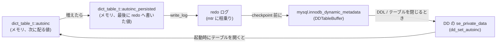

> **前提**: [INSERT のロック — insert intention、重複検査、AUTO_INCREMENT](./insert-and-duplicate-check/) / [データディクショナリ](./data-dictionary/)

このページは**採番値がどこに保存され、どう復元されるか**を扱う。`innodb_autoinc_lock_mode` による採番時のロックは[INSERT のロックのページ](./insert-and-duplicate-check/)にある。

## 何を学んだか

5.7 までの InnoDB は、AUTO_INCREMENT の現在値を**メモリ上の `dict_table_t` にしか持っていなかった**。テーブルを最初に開いたときに `SELECT MAX(id)` 相当を実行して初期化する、という設計だ。

そのため次の順序で古典的な事故が起きた。

1. `id = 100` までの行がある
2. `DELETE FROM t WHERE id = 100`
3. サーバを再起動
4. 次の `INSERT` に **`id = 100` が配られる** (max が 99 なので)

再起動しなければ 101 が配られる。**同じ操作の結果が再起動を挟んだかどうかで変わる**ので、外部システムに ID を渡していると衝突する。

8.0 以降は、採番値の更新を**redo ログに書く**ようになった。

```cpp title="storage/innobase/row/row0ins.cc (L2489)"
      persist_autoinc = dict_table_autoinc_log(index->table, counter, &mtr);
```

```cpp title="storage/innobase/row/row0upd.cc (L2754)"
    persist_autoinc = dict_table_autoinc_log(table, new_counter, mtr);
```

INSERT の経路 ([`row0ins.cc`](https://github.com/mysql/mysql-server/blob/mysql-8.4.11/storage/innobase/row/row0ins.cc#L2489)) と UPDATE の経路 ([`row0upd.cc`](https://github.com/mysql/mysql-server/blob/mysql-8.4.11/storage/innobase/row/row0upd.cc#L2754)) の両方から呼ばれている。**AUTO_INCREMENT 列を明示的に大きな値で `UPDATE` した場合も、カウンタは追随する。**

## なぜそうなっているか

### なぜ「毎回」ではなく「増えたときだけ」書くのか

```cpp title="storage/innobase/dict/dict0dict.cc (L758-L764)"
bool dict_table_autoinc_log(dict_table_t *table, uint64_t value, mtr_t *mtr) {
  bool log = false;

  mutex_enter(table->autoinc_persisted_mutex);

  if (table->autoinc_persisted < value) {
    dict_table_autoinc_persisted_update(table, value);
```

`autoinc_persisted` より大きい値のときだけログを書く。**単調増加なので、途中の値を落としても最終的な最大値さえ残れば復元は正しい。**

そのうえで、ログを書くこと自体は mtr に相乗りするだけで完結させている。

```cpp title="storage/innobase/dict/dict0dict.cc (L796-L803)"
  if (log) {
    PersistentTableMetadata metadata(table->id, table->version);
    metadata.set_autoinc(value);

    Persister *persister = dict_persist->persisters->get(PM_TABLE_AUTO_INC);
    persister->write_log(table->id, metadata, mtr);
    /* No need to flush due to performance reason */
  }
```

**「flush はしない」と明記されている。** 採番値の redo を強制的にディスクへ落とすと、`INSERT` ごとに追加の fsync が必要になってしまう。行そのものの redo と同じタイミングで書かれれば十分だ、という判断になっている ([mini-transaction](./mini-transaction/))。

### 3 段構えの保存先

採番値は 3 か所を経由する。



- **redo** は最速だが、チェックポイントで捨てられる
- **`mysql.innodb_dynamic_metadata`** は「redo を捨ててよくするため」に、チェックポイントの前に書き戻される内部テーブル。破損インデックスのフラグなども同じ仕組みに乗っている
- **DD の `se_private_data`** はテーブル定義の一部として保存される。再起動後の初期値はここから読む (`SHOW CREATE TABLE` に出る `AUTO_INCREMENT=n` は DD ではなく**メモリ上の現在値**で、`ha_innobase::info_low` が `innobase_peek_autoinc` を呼んで返している。[`ha_innodb.cc#L17739`](https://github.com/mysql/mysql-server/blob/mysql-8.4.11/storage/innobase/handler/ha_innodb.cc#L17739))

再起動時は DD から読み、`+1` した値を「次に配る値」に据える。

```cpp title="storage/innobase/dict/dict0dd.cc (L5089-L5097)"
    if (p.get(dd_table_key_strings[DD_TABLE_VERSION], &version) ||
        p.get(dd_table_key_strings[DD_TABLE_AUTOINC], &autoinc)) {
      ut_ad(!"problem setting AUTO_INCREMENT");
      return nullptr;
    }
    m_table->version = version;
    dict_table_autoinc_lock(m_table);
    dict_table_autoinc_initialize(m_table, autoinc + 1);
```

### 索引を読みに行く経路は今も残っている

`SELECT MAX()` 相当の初期化は消えたわけではなく、**復元できなかったときの保険**として残っている。

```cpp title="storage/innobase/handler/ha_innodb.cc (L7815-L7822)"
    if (autoinc == 0 || autoinc == autoinc_persisted) {
      /* If autoinc is 0, it means the counter was never
      used or imported from a tablespace without .cfg file.
      We have to search the index to get proper counter.
      If only the second condition is true, it means it's
      the first time open for the table, we just want to
      calculate the next counter */
      innobase_initialize_autoinc();
    }
```

**`.cfg` なしで IMPORT したテーブル**が典型例だ ([テーブルスペースのファイル](./tablespace-files-and-import-export/))。このとき `innobase_initialize_autoinc` がインデックスの末尾から最大値を読む。

そして `innodb_force_recovery` が高いときは、採番を 0 にして**そのテーブルへの書き込みを実質封じる**。

```cpp title="storage/innobase/handler/ha_innodb.cc (L7321-L7332)"
  if (srv_force_recovery >= SRV_FORCE_NO_IBUF_MERGE) {
    /* If the recovery level is set so high that writes
    are disabled we force the AUTOINC counter to 0
    value effectively disabling writes to the table.
    Secondly, we avoid reading the table in case the read
    results in failure due to a corrupted table/index.

    We will not return an error to the client, so that the
    tables can be dumped with minimal hassle.  If an error
    were returned in this case, the first attempt to read
    the table would fail and subsequent SELECTs would succeed. */
    auto_inc = 0;
```

**壊れたテーブルからのダンプを優先し、エラーを返さず読み出しだけ通す**という設計判断がここに書かれている。

## ソースコードのどこか

### 採番の更新はテーブルごとの mutex

```cpp title="storage/innobase/dict/dict0dict.cc (L715-L718)"
  table->autoinc_persisted_mutex =
...
  mutex_create(LATCH_ID_PERSIST_AUTOINC, table->autoinc_persisted_mutex);
```

採番値そのものを守る `autoinc_mutex` とは別に、**永続化した値を守る mutex** がある。前者は採番のたびに、後者は redo を書くときにだけ取る。取る範囲を分けることで、採番の hot path が永続化の都合で長引かないようにしている。

### TRUNCATE と ALTER でのリセット

`TRUNCATE TABLE` は `.ibd` を作り直すので、採番値も 0 に戻す ([テーブルスペースのファイル](./tablespace-files-and-import-export/))。

```cpp title="storage/innobase/handler/ha_innodb.cc (L14824, L14885)"
    autoinc_persisted = m_table->autoinc_persisted;
...
      m_table->autoinc_persisted = autoinc_persisted;
```

truncate の実装が `m_keep_autoinc` フラグを見て、**パーティションの再構築のように「採番を維持したい truncate」では退避して戻す**。ユーザが打つ `TRUNCATE TABLE` は維持しない側に入る。

`ALTER TABLE ... AUTO_INCREMENT = n` は、`handler0alter.cc` で持ち回った値を反映する。

```cpp title="storage/innobase/handler/handler0alter.cc (L7847)"
      t->autoinc_persisted = ctx->max_autoinc - 1;
```

**指定値より小さくはできない。** 既存の最大値より小さい値を指定しても、その値まで戻ることはない。

## どう活かすか

### 「連番だから欠番がない」という前提は今も成り立たない

8.0 で解決したのは**再起動をまたいだ巻き戻し**だけだ。値が飛ぶ経路はそのまま残っている。

| 飛ぶ場面                                        | 理由                                     |
| ----------------------------------------------- | ---------------------------------------- |
| `INSERT` のロールバック                         | 採番は先に済んでおり、カウンタは戻らない |
| 重複キーで `INSERT` が失敗                      | 同上。`INSERT IGNORE` でも消費する       |
| `innodb_autoinc_lock_mode=2` の一括挿入         | 事前に余分に確保して余りを捨てる         |
| `auto_increment_increment` を使う複数ソース構成 | 意図的に飛ばしている                     |

**ID の連続性に依存した集計や件数推定は、どの MySQL バージョンでも間違い。**

### `.cfg` なしの IMPORT では採番を確認する

`.cfg` を伴わずに `IMPORT TABLESPACE` したテーブルは、開いたときにインデックスから最大値を読み直す。**論理的な最大値と一致するので普通は問題ないが、「削除済みの最大 ID より先」には進まない**。移行前後で採番の連続性を保ちたいなら、移行後に明示的に設定する。

```sql
ALTER TABLE t AUTO_INCREMENT = 1000000;
```

### レプリカ側の採番は独立している

レプリカの `dict_table_t::autoinc` は、レプリカ自身が適用した行の値で更新される。行ベースレプリケーションでは実際の値がイベントに入っているので、**通常は自然にソースと揃う** ([binlog イベント](./binlog-events/))。

ただしフェイルオーバー直後は、**そのレプリカが最後に適用した行までしか反映されていない**。昇格したレプリカで採番が期待より小さくなっていないか、切り替え手順に確認を入れておくと安全だ ([レプリケーション遅延](./replication-lag/))。

### 監視するなら「上限までの余裕」

採番の飛びは正常なので、監視すべきは値そのものではなく**型の上限までどれだけ残っているか**だ。

```sql
SELECT TABLE_SCHEMA, TABLE_NAME, AUTO_INCREMENT
  FROM information_schema.TABLES
 WHERE AUTO_INCREMENT IS NOT NULL
 ORDER BY AUTO_INCREMENT DESC
 LIMIT 20;
```

`INT UNSIGNED` の上限は約 43 億で、飛びが多い運用ではデータ件数よりずっと速く到達する。**`BIGINT` への変更は行フォーマットが変わる `ALTER` になり、大きなテーブルほど高くつく** ([ALTER のアルゴリズム選択](./alter-algorithm-selection/))。到達してからでは選択肢が減るので、余裕のあるうちに測る。
