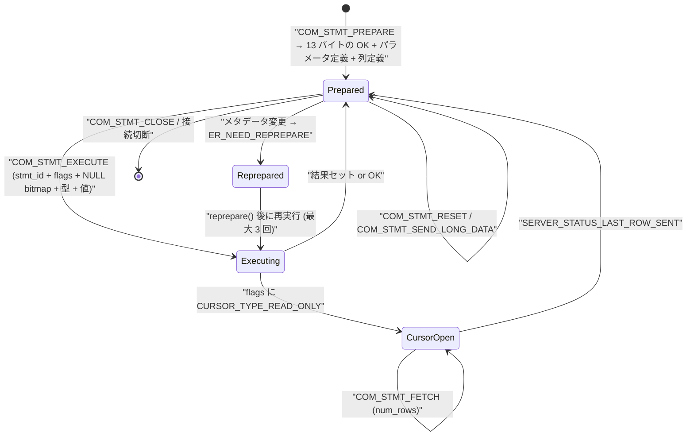

> **前提**: [テキストプロトコル](./text-protocol-and-resultset/)

## 何を学んだか

prepared statement は 2 つの独立した話が重なっている。

1. **ステートメントのライフサイクル** — `COM_STMT_PREPARE` でサーバにパースさせて ID を貰い、`COM_STMT_EXECUTE` でパラメータだけ送って実行する。ID は接続に紐づき、接続が切れれば消える
2. **バイナリプロトコル** — 結果セットの行を文字列ではなく型ごとの生バイトで返す。`Protocol_binary` は `Protocol_text` を**継承**していて、`store_*` メソッドだけ差し替えている

そして 3 つ目の、運用で効く話がある。

3. **prepare した後にテーブル定義が変わると、サーバが黙って再準備する。** `Prepared_statement::execute_loop` が `Reprepare_observer` を仕掛けておき、メタデータのバージョンがずれていたら `reprepare()` してもう一度実行する。上限は 3 回

サーバ側カーソル (`CURSOR_TYPE_READ_ONLY`) は「行を少しずつ取る」ように見えるが、**実体は結果を全部内部一時表に materialize してから読むだけ**だ。メモリ使用量は減らない。



## なぜそうなっているか

**`Protocol_binary` が `Protocol_text` を継承しているのは、メタデータの形が同じだからだ。** 列定義パケットも OK/ERR/EOF もテキストプロトコルと完全に共通で、違うのは行データだけ。継承 + `store_*` の override にすれば差分だけ書けばよく、`send_metadata` フラグで親に委譲する 1 行を各メソッドの先頭に置くことで「メタデータ送信中は親の実装」を実現している。**is-a としてはやや無理があるが、差分が本当に小さい。**

**バイナリプロトコルを作った動機は、パースコストと精度だ。** テキストなら `DOUBLE` を 17 桁の 10 進文字列にして、クライアントが `strtod` で戻す。往復で丸め誤差の心配が出るし、パースのコストもかかる。バイナリなら `float8store` / `float8get` で済む。逆に小さい整数ではテキストのほうが短いので、**「バイナリのほうが常に速い」わけではない。**

**再準備を自動でやるのは、prepared statement を「アプリから見えないキャッシュ」にしたかったからだ。** `ALTER TABLE` が走るたびにアプリがエラーを受け取って作り直す設計だと、全アプリにその処理を書かせることになる。サーバ側で透明にやり直せば、アプリは知らなくてよい。上限 3 回は無限ループ防止で、コメントにそのまま書いてある。列数が変わったときだけ `ER_PS_REBIND` で諦めるのは、**クライアントが確保したバッファのレイアウトが変わってしまい、透明に扱えない**からだ。

**サーバ側カーソルが materialize しかないのは、実行の途中で止められないからだ。** [iterator エグゼキュータ](./executor-walkthrough/)は pull 型で、`Read()` を呼ぶ側が制御を持つ。カーソルを本当に「途中で止める」には、`Read()` を呼ぶループを中断して、次の `COM_STMT_FETCH` まで iterator の木と `handler` の状態を生かしたまま待つ必要がある。そのあいだテーブルの MDL も InnoDB の読み取りビューも握りっぱなしになる。**「fetch と fetch のあいだにクライアントが 10 分黙っていたらどうするか」**という問題を解かずに済ませたのが materialize だ。代わりに結果セット全体分の一時表が要る ([内部一時表のページ](./materialization-and-temptable/))。

**パラメータ定義パケットが中身のない列定義として送られるのは、プロトコルの形を揃えたかったからだ。** 「パラメータの数」を伝えるだけなら 13 バイトの応答で足りている。それでもパケットを送るのは、クライアント側のパーサがメタデータの読み方を 1 種類にできるようにするためだ。無駄な帯域を払って実装を単純にしている。

## ソースコードのどこか

### `COM_STMT_PREPARE` の応答

[`mysqld_stmt_prepare` (`sql/sql_prepare.cc#L1484`)](https://github.com/mysql/mysql-server/blob/mysql-8.4.11/sql/sql_prepare.cc#L1484) が入口。まずやるのがプロトコルの差し替えだ。

```cpp title="sql/sql_prepare.cc"
  const bool switch_protocol = thd->is_classic_protocol();
  if (switch_protocol) {
    // set the current client capabilities before switching the protocol
    thd->protocol_binary->set_client_capabilities(
        thd->get_protocol()->get_client_capabilities());
    thd->push_protocol(thd->protocol_binary);
  }
```

**`THD` はプロトコルのスタックを持っている。** `push_protocol` / `pop_protocol` で一時的に `Protocol_binary` に切り替え、終わったら戻す。capability flag だけは手でコピーしている (握手で交渉した内容は `Protocol_classic` 側が持っているため)。

応答の 1 パケット目は 12 (または 13) バイト固定だ。

```cpp title="sql/protocol_classic.cc"
bool Protocol_classic::store_ps_status(ulong stmt_id, uint column_count,
                                       uint param_count, ulong cond_count) {
  DBUG_TRACE;

  uchar buff[13];
  buff[0] = 0; /* OK packet indicator */
  int4store(buff + 1, stmt_id);
  int2store(buff + 5, column_count);
  int2store(buff + 7, param_count);
  buff[9] = 0;  // Guard against a 4.1 client
  uint16 tmp =
      min(static_cast<uint16>(cond_count), std::numeric_limits<uint16>::max());
  int2store(buff + 10, tmp);
```

[L2937](https://github.com/mysql/mysql-server/blob/mysql-8.4.11/sql/protocol_classic.cc#L2937)。

```
COM_STMT_PREPARE 応答の 1 パケット目
+--------+------+--------------------------------------------+
| offset | size | 内容                                        |
+--------+------+--------------------------------------------+
|      0 | 1    | 0x00 (OK 扱い)                              |
|      1 | 4    | statement_id                                |
|      5 | 2    | 結果セットの列数                             |
|      7 | 2    | パラメータ (?) の数                          |
|      9 | 1    | 0x00 (4.1 クライアント対策のフィラー)        |
|     10 | 2    | warning count                               |
|     12 | 1    | resultset_metadata (OPTIONAL_RESULTSET_METADATA 時のみ) |
+--------+------+--------------------------------------------+
```

そのあとパラメータ定義と列定義が続く。

```cpp title="sql/sql_prepare.cc"
  if (!rc && stmt->m_param_count != 0) {
    // Send the list of parameters
    mem_root_deque<Item *> param_list(thd->mem_root);
    for (Item_param &item : stmt->m_lex->param_list) {
      param_list.push_back(&item);
    }
    rc |= thd->send_result_metadata(param_list, Protocol::SEND_EOF);
    assert(CountVisibleFields(param_list) == stmt->m_param_count);
  }
  if (rc) return true; /* purecov: inspected */

  // Send
  if (types && result &&
      result->send_result_set_metadata(thd, *types, Protocol::SEND_EOF))
    return true; /* purecov: inspected */
```

[`send_statement` (L934)](https://github.com/mysql/mysql-server/blob/mysql-8.4.11/sql/sql_prepare.cc#L934)。**パラメータ定義は「列定義パケットと同じ形」で送られる。** 実際にはどれも `?` で型は未定なので、中身は意味がない。それでも列定義パケット 1 枚ぶんのバイト数を払う。パラメータ 10 個の文なら、prepare の応答だけで 10 枚 + 結果の列数枚のパケットが飛ぶ。

**準備できる文には制限がある。** [`Prepared_statement::prepare_query` (L1192)](https://github.com/mysql/mysql-server/blob/mysql-8.4.11/sql/sql_prepare.cc#L1192) の巨大な `switch` に列挙された `SQLCOM_*` だけが通り、それ以外は `ER_UNSUPPORTED_PS` になる。

```cpp title="sql/sql_prepare.cc"
      if (!(sql_command_flags[sql_command] & CF_STATUS_COMMAND) ||
          (sql_command_flags[sql_command] & CF_DIAGNOSTIC_STMT)) {
        /* All other statements are not supported yet. */
        my_error(ER_UNSUPPORTED_PS, MYF(0));
        return true;
      }
```

`SHOW WARNINGS` / `GET DIAGNOSTICS` (`CF_DIAGNOSTIC_STMT`) は明示的に弾かれる。診断情報を読む文を prepared statement にすると、prepare 自体が診断領域を書き換えてしまうからだ。

### `COM_STMT_EXECUTE` のパース

[`Protocol_classic::parse_packet` (L2743)](https://github.com/mysql/mysql-server/blob/mysql-8.4.11/sql/protocol_classic.cc#L2743) の `COM_STMT_EXECUTE` 分岐。

```cpp title="sql/protocol_classic.cc"
    case COM_STMT_EXECUTE: {
      if (input_packet_length < 9) goto malformed;
      uchar *read_pos = input_raw_packet;
      size_t packet_left = input_packet_length;

      // Get the statement id
      data->com_stmt_execute.stmt_id = uint4korr(read_pos);
      read_pos += 4;
      packet_left -= 4;
      // Get execution flags
      data->com_stmt_execute.open_cursor = *read_pos;
      read_pos += 5;
      packet_left -= 5;
```

`read_pos += 5` で flags 1 バイトと `iteration_count` 4 バイトをまとめて飛ばしている。**`iteration_count` は常に 1 で、読まれることすらない。**

面白いのは、**パラメータのパースにサーバ側の `Prepared_statement` が要る**ことだ。

```cpp title="sql/protocol_classic.cc"
      // Get the statement by id
      Prepared_statement *stmt =
          m_thd->stmt_map.find(data->com_stmt_execute.stmt_id);
      ...
      if (!stmt ||
          (stmt->m_param_count == 0 &&
           (!this->has_client_capability(CLIENT_QUERY_ATTRIBUTES) ||
            !(data->com_stmt_execute.open_cursor & PARAMETER_COUNT_AVAILABLE))))
        break;
```

パケットには NULL bitmap の長さが書かれていないので、`param_count` を知らないとどこまでが bitmap か分からない。**プロトコル層が `THD::stmt_map` を引くという層の破れ**がここにある。ID が見つからないときはパースを諦めて先に進み、`sql_parse.cc` 側でエラーにする。

### `Protocol_binary` は `Protocol_text` の子

```cpp title="sql/protocol_classic.h"
class Protocol_binary final : public Protocol_text {
 private:
  uint bit_fields;

 public:
  Protocol_binary() = default;
  Protocol_binary(THD *thd_arg) : Protocol_text(thd_arg) {}
  void start_row() override;
  bool store_null() override;
  bool store_tiny(longlong from, uint32 zerofill) override;
  ...
  // Decimals are sent as text, also over the binary protocol.
  using Protocol_text::store_decimal;
```

[`protocol_classic.h#L242`](https://github.com/mysql/mysql-server/blob/mysql-8.4.11/sql/protocol_classic.h#L242)。**`DECIMAL` だけはバイナリプロトコルでも文字列で送られる。** `using Protocol_text::store_decimal;` の 1 行がそれを宣言していて、コメントも付いている。10 進固定小数を IEEE754 に落とせない以上、文字列以外に選択肢がない。

各 `store_*` は 2 つのモードを持つ。

```cpp title="sql/protocol_classic.cc"
bool Protocol_binary::store_long(longlong from, uint32 zerofill) {
  if (send_metadata) return Protocol_text::store_long(from, zerofill);
  // field_types check is needed because of the embedded protocol
  assert(field_types == nullptr || field_types[field_pos] == MYSQL_TYPE_INT24 ||
         field_types[field_pos] == MYSQL_TYPE_LONG);
  field_pos++;
  char *to = packet->prep_append(4, PACKET_BUFFER_EXTRA_ALLOC);
  if (!to) return true;
  int4store(to, static_cast<uint32>(from));
  return false;
}
```

[L3723](https://github.com/mysql/mysql-server/blob/mysql-8.4.11/sql/protocol_classic.cc#L3723)。**`send_metadata` が立っている間は親クラス、つまりテキスト形式に委譲する。** メタデータ (列定義パケット) はテキストプロトコルと完全に同じ形で送られるからだ。バイナリになるのは行データだけ。

[テキスト側](./text-protocol-and-resultset/)の同じ関数と比べると差がはっきりする。

```cpp title="sql/protocol_classic.cc"
bool Protocol_text::store_long(longlong from, uint32 zerofill) {
  ...
  field_pos++;
  return store_integer(from, false, zerofill, packet);
}
```

テキストは `longlong10_to_str` で 10 進文字列に直して長さバイトを付ける。バイナリは `int4store` で 4 バイト固定。**`INT` の値 1 は、テキストなら 2 バイト (`01 31`)、バイナリなら 4 バイト (`01 00 00 00`)。** 小さい値ではテキストのほうが短い。

### NULL bitmap のビットが 2 つずれている

```cpp title="sql/protocol_classic.cc"
void Protocol_binary::start_row() {
  if (send_metadata) return Protocol_text::start_row();
  packet->length(bit_fields + 1);
  memset(packet->ptr(), 0, 1 + bit_fields);
  field_pos = 0;
}

bool Protocol_binary::store_null() {
  if (send_metadata) return Protocol_text::store_null();
  const uint offset = (field_pos + 2) / 8 + 1,
             bit = (1 << ((field_pos + 2) & 7));
  /* Room for this as it's allocated in prepare_for_send */
  char *to = packet->ptr() + offset;
  *to = (char)((uchar)*to | (uchar)bit);
  field_pos++;
  return false;
}
```

[L3683](https://github.com/mysql/mysql-server/blob/mysql-8.4.11/sql/protocol_classic.cc#L3683)。`bit_fields` は `start_result_metadata` で `(num_cols + 9) / 8` として計算される。

```
バイナリ行データのレイアウト (列 3 つ、2 番目が NULL の例)
+--------+------------------+---------------------------------+
| 0x00   | NULL bitmap      | NULL でない列の値を型ごとに並べる  |
| 1 byte | (cols+9)/8 bytes |                                 |
+--------+------------------+---------------------------------+

NULL bitmap のビット割り当て (offset 2 ずれ)
 bit:      0    1    2    3    4    5    6    7
         [予約][予約][col0][col1][col2] ...
```

**先頭に 2 ビットの穴があるのは、行データの先頭バイト `0x00` を OK パケット (先頭 `0x00`) と区別するためだ。** 行の 1 バイト目は常に `0x00` なので、bitmap が 2 バイト目から始まる。ビットを 0 番から詰めると、列 0 と列 1 が両方 NULL のとき bitmap の最初のバイトが `0x03` になり、それ自体は問題ないが、**bitmap を 1 バイト目から置くと先頭バイトが `0x00` でなくなり OK/ERR との識別が壊れる**。だから固定の `0x00` を 1 バイト置き、bitmap のビット 0・1 を捨てて位置を揃えている。

### 再準備 — `Reprepare_observer`

```cpp title="sql/sql_prepare.h"
  /// @returns true if prepared statement can (and will) be retried
  bool can_retry() const {
    // Only call for a statement that is invalidated
    assert(is_invalidated());
    return m_attempt <= MAX_REPREPARE_ATTEMPTS &&
           DBUG_EVALUATE_IF("simulate_max_reprepare_attempts_hit_case", false,
                            true);
  }

 private:
  bool m_invalidated{false};
  int m_attempt{0};

  /*
    We take only 3 attempts to reprepare the query, otherwise we might end up
    in endless loop.
  */
  static constexpr int MAX_REPREPARE_ATTEMPTS = 3;
```

[`sql/sql_prepare.h#L82`](https://github.com/mysql/mysql-server/blob/mysql-8.4.11/sql/sql_prepare.h#L82)。仕掛けるのは [`execute_loop` (`sql_prepare.cc#L2855`)](https://github.com/mysql/mysql-server/blob/mysql-8.4.11/sql/sql_prepare.cc#L2855)。

```cpp title="sql/sql_prepare.cc"
  Reprepare_observer *stmt_reprepare_observer = nullptr;

  if (sql_command_flags[m_lex->sql_command] & CF_REEXECUTION_FRAGILE) {
    reprepare_observer.reset_reprepare_observer();
    stmt_reprepare_observer = &reprepare_observer;
  }

  thd->push_reprepare_observer(stmt_reprepare_observer);

  DEBUG_SYNC(thd, "before_statement_execute");
  error = execute(thd, expanded_query, open_cursor) || thd->is_error();

  thd->pop_reprepare_observer();

  // Check if we have a non-fatal error and the statement allows reexecution.
  if ((sql_command_flags[m_lex->sql_command] & CF_REEXECUTION_FRAGILE) &&
      error && !thd->is_fatal_error() && !thd->is_killed()) {
    // If we have an error due to a metadata change, reprepare the
    // statement and execute it again.
    if (reprepare_observer.is_invalidated()) {
      assert(thd->get_stmt_da()->mysql_errno() == ER_NEED_REPREPARE);

      if (reprepare_observer.can_retry()) {
        thd->clear_error();
        error = reprepare(thd);
```

`CF_REEXECUTION_FRAGILE` が立つ文だけが対象。observer は `THD` にスタックとして積まれ、テーブルを open する経路 (`check_and_update_table_version`) がバージョンのずれを見つけたら `report_error` を呼ぶ。

再準備自体は 3 回だけでなく、**無条件に走る経路もある**。

```cpp title="sql/sql_prepare.cc"
  // Reprepare statement unconditionally if it contains UDF references
  if (m_lex->has_udf() && reprepare(thd)) {
    return true;
  }
```

UDF を含む文は毎回作り直される。さらに `reexecute:` ラベルの直後には、パラメータの型が前回と変わったときの再準備がある。

```cpp title="sql/sql_prepare.cc"
  if (!check_parameter_types()) {
    // Only one reprepare is required in case of parameter mismatch
    assert(!reprepared_for_types);
    reprepared_for_types = true;
    if (reprepare(thd)) return true;
    goto reexecute;
  }
```

**同じ文に対して整数を渡したり文字列を渡したりすると、そのたびに再準備が走る。** アプリのバインド値の型を安定させる意味はここにある。

`reprepare()` 本体 ([L3085](https://github.com/mysql/mysql-server/blob/mysql-8.4.11/sql/sql_prepare.cc#L3085)) は、中間の `Prepared_statement copy` を作って中身を丸ごと swap し、失敗したら scope guard で戻す、という作りになっている。

```cpp title="sql/sql_prepare.cc"
  Prepared_statement copy(thd);

  swap_prepared_statement(&copy);
  auto copy_guard =
      create_scope_guard([&]() { swap_prepared_statement(&copy); });

  thd->status_var.com_stmt_reprepare++;
```

`Com_stmt_reprepare` ステータス変数がここでインクリメントされる。**再準備が起きているかどうかは、この 1 個の変数で分かる。**

再準備後に列数が変わっていたら [`validate_metadata` (L3175)](https://github.com/mysql/mysql-server/blob/mysql-8.4.11/sql/sql_prepare.cc#L3175) が `ER_PS_REBIND` を返す。`SELECT *` を prepare した後で `ALTER TABLE ADD COLUMN` すると、これに当たる。

```cpp title="sql/sql_prepare.cc"
  /*
    Clear possible warnings during reprepare, it has to be completely
    transparent to the user. We use reset_condition_info() since
    there were no separate query id issued for re-prepare.
```

**再準備は「利用者から完全に透明」であることが目標**で、警告も消される。

### サーバ側カーソルは materialize だけ

`COM_STMT_EXECUTE` の flags に `CURSOR_TYPE_READ_ONLY` を立てると、[`mysqld_stmt_execute` (L1817)](https://github.com/mysql/mysql-server/blob/mysql-8.4.11/sql/sql_prepare.cc#L1817) が `open_cursor` を渡す。

```cpp title="sql/sql_prepare.cc"
  if (!stmt->set_parameters(thd, &expanded_query, has_new_types, parameters)) {
    const bool open_cursor = execute_flags & (ulong)CURSOR_TYPE_READ_ONLY;
    stmt->execute_loop(thd, &expanded_query, open_cursor);
  }
```

その先で作られるのは [`Materialized_cursor` (`sql/sql_cursor.cc#L77`)](https://github.com/mysql/mysql-server/blob/mysql-8.4.11/sql/sql_cursor.cc#L77) 一択だ。クラスコメントが正直に書いている。

```cpp title="sql/sql_cursor.cc"
/**
  Materialized_cursor -- an insensitive materialized server-side
  cursor. The result set of this cursor is saved in a temporary
  table at open. The cursor itself is simply an interface for the
  handler of the temporary table.
```

**`open` の時点で結果セット全体が一時表に書かれる。** `COM_STMT_FETCH` はその一時表を `ha_rnd_next` で読むだけ。

```cpp title="sql/sql_cursor.cc"
bool Materialized_cursor::fetch(ulong num_rows) {
  THD *thd = current_thd;

  int res = 0;
  for (fetch_limit += num_rows; fetch_count < fetch_limit; fetch_count++) {
    if ((res = m_table->file->ha_rnd_next(m_table->record[0]))) break;
    ...
    if (m_result->send_data(thd, item_list)) return true;
  }

  switch (res) {
    case 0:
      thd->server_status |= SERVER_STATUS_CURSOR_EXISTS;
      m_result->send_eof(thd);
      break;
    case HA_ERR_END_OF_FILE:
      thd->server_status |= SERVER_STATUS_LAST_ROW_SENT;
      m_result->send_eof(thd);
      close();
      break;
```

[L403](https://github.com/mysql/mysql-server/blob/mysql-8.4.11/sql/sql_cursor.cc#L403)。`SERVER_STATUS_CURSOR_EXISTS` (まだ続きがある) と `SERVER_STATUS_LAST_ROW_SENT` (打ち止め) が、[終端パケットのステータスフラグ](./text-protocol-and-resultset/)としてクライアントに届く。

### mysql2 の対比 — `query()` と `execute()`

node-mysql2 では 2 つが別物だ。`query()` はクライアント側で `?` を埋めて `COM_QUERY` を送る。

```js title="lib/base/connection.js"
  query(sql, values, cb) {
    let cmdQuery;
    if (sql.constructor === Commands.Query) {
      cmdQuery = sql;
    } else {
      cmdQuery = BaseConnection.createQuery(sql, values, cb, this.config);
    }
    this._resolveNamedPlaceholders(cmdQuery);
    const rawSql = this.format(
      cmdQuery.sql,
      cmdQuery.values !== undefined ? cmdQuery.values : []
    );
    cmdQuery.sql = rawSql;
```

[`connection.js#L635`](https://github.com/sidorares/node-mysql2/blob/d8932925b237f07b6410263770379998df973502/lib/base/connection.js#L635)。`SqlString.format` がエスケープして SQL 文字列を組み立てる。**サーバから見れば普通の `COM_QUERY` で、prepared statement ではない。**

`execute()` は本物のサーバ側 PS を使う。

```js title="lib/base/connection.js"
    const executeCommand = new Commands.Execute(options, cb);

    const prepareAndExecute = (errorCb) => {
      const prepareCommand = new Commands.Prepare(options, (err, stmt) => {
```

[L798](https://github.com/sidorares/node-mysql2/blob/d8932925b237f07b6410263770379998df973502/lib/base/connection.js#L798)。しかも準備済みの文は接続ごとに LRU でキャッシュされる。

```js title="lib/base/connection.js"
this._statements = createLRU({
  max: this.config.maxPreparedStatements,
  onEviction: function (_, statement) {
    statement.close();
  },
});
```

[L83](https://github.com/sidorares/node-mysql2/blob/d8932925b237f07b6410263770379998df973502/lib/base/connection.js#L83)。**evict されると `COM_STMT_CLOSE` が飛ぶ。** `maxPreparedStatements` (既定 16000) を超えるほど種類の多い SQL を `execute()` で流すと、prepare と close を繰り返すことになる。

`undefined` を明示的に弾く検査も入っている。

```js title="lib/base/connection.js"
if (val === undefined) {
  throw new TypeError(
    "Bind parameters must not contain undefined. To pass SQL NULL specify JS null",
  );
}
```

バイナリプロトコルには「値がない」という表現がなく、NULL bitmap の立っている / いないしかないので、`undefined` をどう扱うか決められない。ライブラリ側で早く落としている。

## どう活かすか

**`Com_stmt_reprepare` が増え続けているなら、prepared statement が毎回作り直されている。** `SHOW GLOBAL STATUS LIKE 'Com_stmt_%'` で `Com_stmt_execute` と比べる。原因の候補は 3 つ。

| 原因                       | 見分け方                                                |
| -------------------------- | ------------------------------------------------------- |
| DDL が頻繁に走っている     | `Com_alter_table` / `Com_create_table` と時間が一致する |
| バインド値の型がぶれている | 同じ SQL に整数と文字列を混ぜて渡していないか           |
| UDF を呼んでいる           | `has_udf()` の経路で無条件に再準備される                |

**`ER_PS_REBIND` (`Prepared statement needs to be re-prepared`) が出たら、列数が変わっている。** 再準備の 3 回上限に当たったときも同じエラーが出るので、`SELECT *` を使っている prepared statement に `ADD COLUMN` した直後を疑う。**`SELECT *` を避けて列を明示すれば、列の追加で壊れなくなる。**

**サーバ側カーソルはメモリを節約しない。** `CURSOR_TYPE_READ_ONLY` で `COM_STMT_EXECUTE` すると、結果セット全体が内部一時表に書かれる。`tmp_table_size` を超えれば InnoDB のディスク一時表に落ちる。「巨大な結果を少しずつ取りたい」なら、カーソルではなく[クライアント側のストリーミング](./client-library-and-streaming/) (`mysql_use_result` / mysql2 の `.stream()`) か、`WHERE id > ?` 方式のページネーションを使う。

**接続をプールで使い回すなら、prepared statement の ID も接続に紐づくことを意識する。** `stmt_map` は `THD` の中にあり、[`THD` は接続ごとに作り直される](./connection-layer/)。プールが接続を張り直せば、その接続で prepare した文は全部消える。ライブラリ側の PS キャッシュ (mysql2 の `_statements`) も接続オブジェクト単位だ。

**`max_prepared_stmt_count` に当たると `Can't create more than max_prepared_stmt_count statements` が出る。** [`sys_vars.cc#L2921`](https://github.com/mysql/mysql-server/blob/mysql-8.4.11/sql/sys_vars.cc#L2921) のとおり `GLOBAL_VAR` で既定 16382、**サーバ全体の上限であって接続ごとではない**。mysql2 の `maxPreparedStatements` は既定 16000 ([`connection_config.js#L194`](https://github.com/sidorares/node-mysql2/blob/d8932925b237f07b6410263770379998df973502/lib/connection_config.js#L194)) なので、**接続 2 本で理論上サーバの上限を超えられる。** 接続数 × 1 接続あたりの PS 数で見積もり、必要ならライブラリ側のキャッシュサイズを下げる。

**`?` はリテラルの位置にしか置けない。** prepare はパースを伴うので、テーブル名や列名やキーワードをパラメータにはできない。動的な識別子が要るなら `query()` 側でエスケープして組み立てるか、識別子をホワイトリストで検証する。mysql2 の `escapeId` はそのための関数だ。

**`COM_STMT_SEND_LONG_DATA` のエラーは、次の `COM_STMT_EXECUTE` まで報告されない。**

```cpp title="sql/sql_prepare.cc"
  /* Check if we got an error when sending long data */
  if (m_arena.get_state() == Query_arena::STMT_ERROR) {
    my_message(m_last_errno, m_last_error, MYF(0));
    return true;
  }
```

`execute_loop` の冒頭 ([L2864](https://github.com/mysql/mysql-server/blob/mysql-8.4.11/sql/sql_prepare.cc#L2864))。`COM_STMT_SEND_LONG_DATA` は応答パケットを返さないコマンドなので、失敗しても即座には伝えられず、`Prepared_statement` に状態として溜めておいて次の実行で吐き出す。**巨大な BLOB を分割送信していて後から意味不明なエラーが出るときは、送信そのものが先に失敗している可能性がある。** `COM_STMT_RESET` を打つとこの状態はクリアされる。
