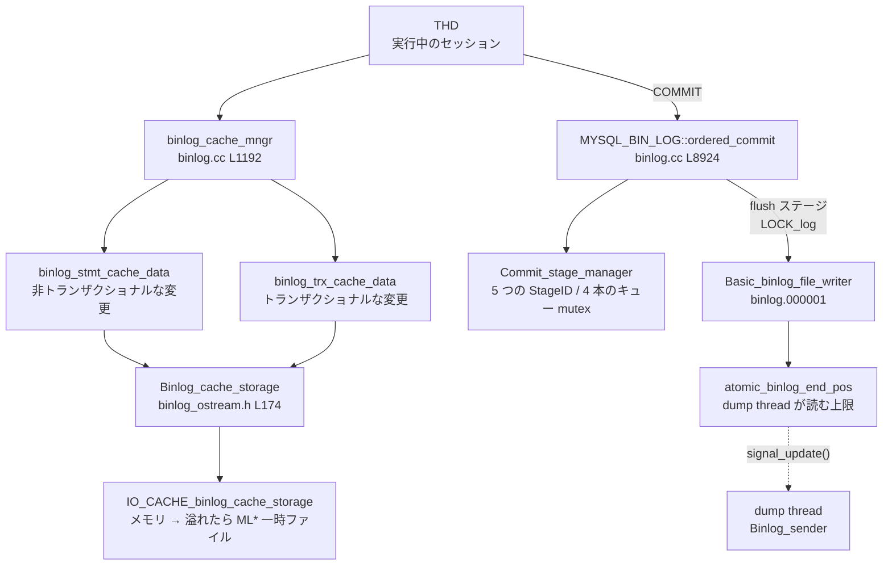
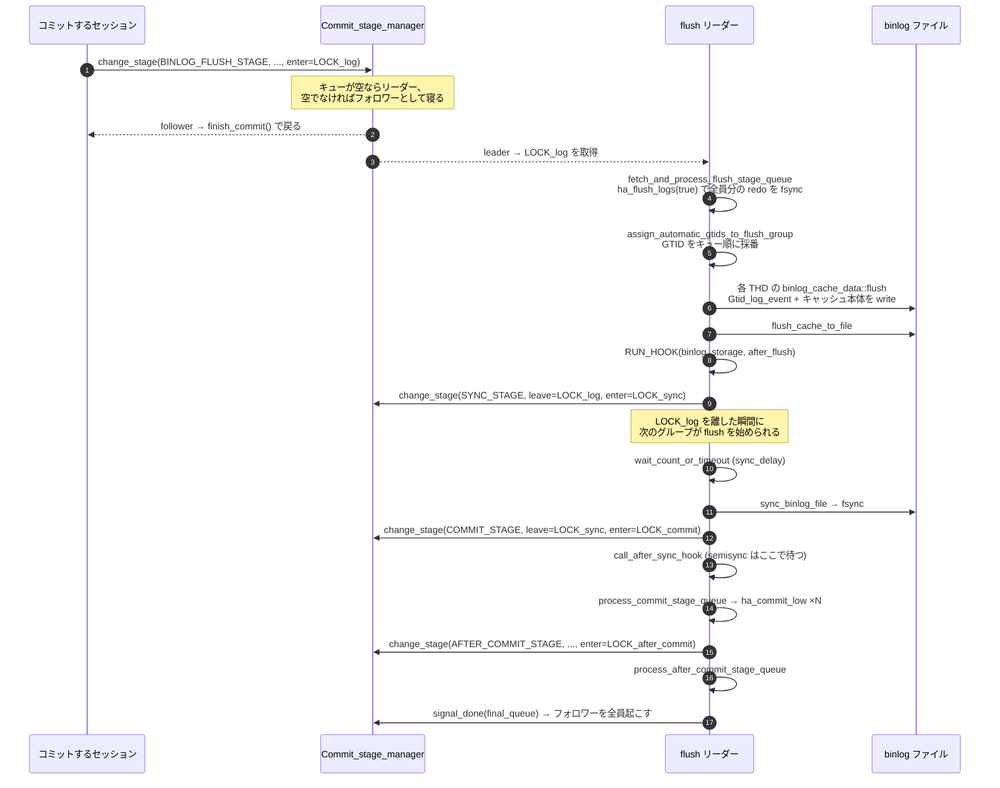

## この層の責務

[UPDATE の一生](./life-of-an-update/)の最後に出てきた `tc_log->prepare` → `ordered_commit` → `ha_commit_low` の 3 段が、この層の全体像だ。`tc_log` の実体は `MYSQL_BIN_LOG` で、binlog は「ログファイル」であると同時に **2 相コミットのトランザクションコーディネータ**でもある。

この層の責務は 3 つある。

1. **文の実行中に生じた変更をイベント列に変え、セッションごとのキャッシュに溜める。** ここではまだファイルに触らない。ロールバックされたらキャッシュを捨てるだけで済むようにする
2. **COMMIT のときに、同時にコミットしようとしている全セッションのキャッシュを 1 本のリーダースレッドがまとめてファイルへ書き、まとめて `fsync` する。** これがグループコミット
3. **binlog への書き込みと InnoDB のコミットの順序を固定する。** binlog が先、InnoDB が後。この順序が壊れるとクラッシュ後に source とレプリカがずれる

3 番目の理由と、5 つある stage の意味は[2PC とグループコミット](./two-phase-commit-and-group-commit/)に分けた。このページは配線と経路だけを固定する。

**この層を読むうえで最初に捨てるべき思い込みは「binlog はトランザクションの進行に合わせて追記されていく」だ。** 実際には、1 トランザクションのイベント列は commit の瞬間に一気に、しかも他のセッションのイベント列と交互に混ざらない形でファイルに現れる。だから binlog を読む側 (レプリカ、mysqlbinlog、CDC ツール) は、トランザクションが完結した形でしか見ない。

## 主要な型とその関係



### `binlog_cache_mngr` — セッションあたり 2 本のキャッシュ

[`binlog.cc#L1192`](https://github.com/mysql/mysql-server/blob/mysql-8.4.11/sql/binlog.cc#L1192)。`THD` の `ha_data` にぶら下がる。中身は `stmt_cache` と `trx_cache` の 2 つだけだ。

```cpp title="sql/binlog.cc"
  bool init() {
    return stmt_cache.open(binlog_stmt_cache_size,
                           max_binlog_stmt_cache_size) ||
           trx_cache.open(binlog_cache_size, max_binlog_cache_size);
  }
```

**2 本ある理由は「ロールバックで消えるもの」と「消えないもの」を分けるため**だ。トランザクショナルなエンジン (InnoDB) への変更は `trx_cache` に入り、ロールバックすれば丸ごと捨てられる。非トランザクショナルなエンジン (MEMORY、一時表) への変更は取り消せないので `stmt_cache` に入り、**文が終わった時点で単独のトランザクションとして binlog に出る**。1 つのトランザクションが両方に書くと、binlog 上では 2 つの別トランザクションになる。

`binlog_trx_cache_data` ([L1112](https://github.com/mysql/mysql-server/blob/mysql-8.4.11/sql/binlog.cc#L1112)) だけが `truncate` を持つ。`SAVEPOINT` / `ROLLBACK TO SAVEPOINT` は、このキャッシュ内のバイト位置を覚えて切り詰めることで実装されている。

### `Binlog_cache_storage` — メモリと一時ファイルの切り替え

[`sql/binlog_ostream.h#L174`](https://github.com/mysql/mysql-server/blob/mysql-8.4.11/sql/binlog_ostream.h#L174)。実体は `IO_CACHE` 1 本のラッパだ。

```cpp title="sql/binlog_ostream.cc"
bool Binlog_cache_storage::open(my_off_t cache_size, my_off_t max_cache_size) {
  const char *LOG_PREFIX = "ML";

  if (m_file.open(mysql_tmpdir, LOG_PREFIX, cache_size, max_cache_size))
    return true;
```

`binlog_cache_size` (既定 32768) はメモリバッファの大きさで、これを超えると `mysql_tmpdir` に `ML` で始まる一時ファイルが作られる ([`binlog_ostream.cc#L253`](https://github.com/mysql/mysql-server/blob/mysql-8.4.11/sql/binlog_ostream.cc#L253))。ファイルは遅延生成なので、超えなければ open すらされない。さらに `max_binlog_cache_size` を超えると `ER_TRANS_CACHE_FULL` でトランザクションが失敗する ([L5545](https://github.com/mysql/mysql-server/blob/mysql-8.4.11/sql/binlog.cc#L5545))。

一時ファイルに落ちた回数は `Binlog_cache_disk_use` / `Binlog_stmt_cache_disk_use` に出る。

### `Commit_stage_manager` — キューと mutex

[`sql/rpl_commit_stage_manager.h#L166`](https://github.com/mysql/mysql-server/blob/mysql-8.4.11/sql/rpl_commit_stage_manager.h#L166) に stage の ID がある。

```cpp title="sql/rpl_commit_stage_manager.h"
  enum StageID {
    BINLOG_FLUSH_STAGE,
    SYNC_STAGE,
    COMMIT_STAGE,
    AFTER_COMMIT_STAGE,
    COMMIT_ORDER_FLUSH_STAGE,
    STAGE_COUNTER
  };
```

**「3 段階のグループコミット」という説明は正確ではない。ID は 5 つある。** キューの mutex は 4 本しかなく、`COMMIT_ORDER_FLUSH_STAGE` は `BINLOG_FLUSH_STAGE` と同じ mutex を共有する ([`.cc#L147`](https://github.com/mysql/mysql-server/blob/mysql-8.4.11/sql/rpl_commit_stage_manager.cc#L147))。

```cpp title="sql/rpl_commit_stage_manager.cc"
  m_queue[COMMIT_ORDER_FLUSH_STAGE].init(&m_queue_lock[BINLOG_FLUSH_STAGE]);
```

キューそのもの (`Mutex_queue`) は `THD::next_to_commit` で繋いだ単方向リストだ ([`.cc#L42`](https://github.com/mysql/mysql-server/blob/mysql-8.4.11/sql/rpl_commit_stage_manager.cc#L42))。キューが空のときに並んだスレッドがそのステージの**リーダー**になり、空でなければ**フォロワー**になって寝る。

### `MYSQL_BIN_LOG` が持つ 5 本の mutex

[`sql/binlog.h#L204`](https://github.com/mysql/mysql-server/blob/mysql-8.4.11/sql/binlog.h#L204)。

| mutex                 | 守るもの                                        | 誰が持って何をするか                                                           |
| --------------------- | ----------------------------------------------- | ------------------------------------------------------------------------------ |
| `LOCK_log`            | ログファイルへの書き込み位置                    | flush ステージのリーダーが全員分のキャッシュをファイルへコピー                 |
| `LOCK_sync`           | `fsync` の直列化                                | sync ステージのリーダーが `fsync` (と `binlog_group_commit_sync_delay` の待ち) |
| `LOCK_commit`         | エンジンへのコミット順序                        | commit ステージのリーダーが全員分の `ha_commit_low`                            |
| `LOCK_after_commit`   | `after_commit` フックの直列化                   | after commit ステージのリーダーがフック呼び出し                                |
| `LOCK_binlog_end_pos` | `atomic_binlog_end_pos` と dump thread への通知 | flush / sync 後に publish する側                                               |

## 処理の流れ

### 1. 文の実行中 — キャッシュへ書く

行ベースなら `THD::binlog_write_row` / `binlog_update_row` / `binlog_delete_row` が `Rows_log_event` を組み立てる。同じテーブルへの連続した行は 1 つの `Rows_log_event` にまとめられ、`binlog_cache_data::m_pending` に保持される。文が終わると [`binlog_cache_data::write_event` (L1566)](https://github.com/mysql/mysql-server/blob/mysql-8.4.11/sql/binlog.cc#L1566) でキャッシュにシリアライズされる。

**この時点で `binlog_row_image` によるカラムの間引きが起きている。** [`binlog_prepare_row_images` (L11329)](https://github.com/mysql/mysql-server/blob/mysql-8.4.11/sql/binlog.cc#L11329) が `table->read_set` から不要な列を落とす。

```cpp title="sql/binlog.cc"
  if (table->s->primary_key < MAX_KEY &&
      (thd->variables.binlog_row_image < BINLOG_ROW_IMAGE_FULL) &&
      !ha_check_storage_engine_flag(table->s->db_type(),
                                    HTON_NO_BINLOG_ROW_OPT)) {
```

**PK がなければこの最適化は丸ごと飛ばされる。** `binlog_row_image=MINIMAL` を設定しても、PK のないテーブルでは全列が before image に入る。詳細は[binlog イベント](./binlog-events/)。

### 2. COMMIT — prepare

`ha_commit_trans` が `rw_ha_count > 1` を見て 2PC に入り、`tc_log->prepare` を呼ぶ ([UPDATE の一生](./life-of-an-update/))。実体は [`MYSQL_BIN_LOG::prepare` (L8083)](https://github.com/mysql/mysql-server/blob/mysql-8.4.11/sql/binlog.cc#L8083) だ。

```cpp title="sql/binlog.cc"
  thd->durability_property = HA_IGNORE_DURABILITY;

  CONDITIONAL_SYNC_POINT_FOR_TIMESTAMP("before_prepare_in_engines");
  int error = ha_prepare_low(thd, all);
```

**`HA_IGNORE_DURABILITY` を立てているのが要点だ。** InnoDB は XA PREPARE のたびに redo を `fsync` するのが本来だが、ここではそれを抑止する。代わりに、flush ステージのリーダーが**グループ全員分の redo をまとめて 1 回 `ha_flush_logs(true)` で落とす**。`fsync` の回数がグループのサイズで割られる。

このとき InnoDB のトランザクションは XA PREPARE 状態になり、redo に prepare レコードと XID が残る。クラッシュリカバリはこの XID を binlog 側の `Xid_log_event` と突き合わせる ([クラッシュリカバリ](./crash-recovery/))。

### 3. COMMIT — `ordered_commit` の 5 ステージ

`tc_log->commit` → [`MYSQL_BIN_LOG::commit` (L8136)](https://github.com/mysql/mysql-server/blob/mysql-8.4.11/sql/binlog.cc#L8136) がキャッシュを finalize (末尾に `Xid_log_event` を足す) してから [`ordered_commit` (L8924)](https://github.com/mysql/mysql-server/blob/mysql-8.4.11/sql/binlog.cc#L8924) に入る。



順に見る。

**flush ステージ** — [`process_flush_stage_queue` (L8519)](https://github.com/mysql/mysql-server/blob/mysql-8.4.11/sql/binlog.cc#L8519) がキューを一度に取り出して空にする。取り出したあとで `ha_flush_logs(true)` を呼ぶ順序に意味がある。**「キューを空にしてから redo を落とす」ことで、その後に並んだセッションが次のグループになることが保証される。**

```cpp title="sql/binlog.cc"
  THD *first_seen = fetch_and_process_flush_stage_queue();
  DBUG_EXECUTE_IF("crash_after_flush_engine_log", DBUG_SUICIDE(););
  CONDITIONAL_SYNC_POINT_FOR_TIMESTAMP("before_write_binlog");
  assign_automatic_gtids_to_flush_group(first_seen);
  // Flush thread caches to binary log.
  for (THD *head = first_seen; head; head = head->next_to_commit) {
```

**GTID の採番がここで起きる** ([`assign_automatic_gtids_to_flush_group` (L1627)](https://github.com/mysql/mysql-server/blob/mysql-8.4.11/sql/binlog.cc#L1627))。キューの順序がそのまま GNO の順序になる。[GTID のページ](./gtid/)。

各 `binlog_cache_data::flush` ([L2444](https://github.com/mysql/mysql-server/blob/mysql-8.4.11/sql/binlog.cc#L2444)) は、MTA 用の論理時刻を確定させてから `write_transaction` を呼ぶ。

```cpp title="sql/binlog.cc"
    trn_ctx->sequence_number = mysql_bin_log.m_dependency_tracker.step();
```

`last_committed` のほうは prepare のタイミングで決まっている ([`binlog_prepare` (L2609)](https://github.com/mysql/mysql-server/blob/mysql-8.4.11/sql/binlog.cc#L2609))。

```cpp title="sql/binlog.cc"
static int binlog_prepare(handlerton *, THD *thd, bool all) {
  DBUG_TRACE;
  if (!all) {
    thd->get_transaction()->store_commit_parent(
        mysql_bin_log.m_dependency_tracker.get_max_committed_timestamp());
  }
  return 0;
}
```

つまり **`last_committed` = 「自分が prepare した時点で既にコミット済みだったトランザクションの最大 sequence_number」**。これがレプリカ側の並列適用の判定材料になる ([applier と並列適用](./applier-and-mta/))。

flush が終わると `after_flush` フックが走り、その直後に `update_binlog_end_pos()` が呼ばれる。**ただし `sync_binlog=1` のときだけは sync のあとに回される。**

```cpp title="sql/binlog.cc"
  update_binlog_end_pos_after_sync = (get_sync_period() == 1);
```

**sync ステージ** — `LOCK_log` を離して `LOCK_sync` を取る。`change_stage` → `enroll_for` の中で「キューに並ぶ → 前のステージの mutex を離す → (リーダーなら) 次のステージの mutex を取る」の順に進むので、**リーダーが sync している間、次のグループは既に flush を始めている**。これがパイプライン化の実体だ。

`sync_binlog` の周期に達していれば `binlog_group_commit_sync_delay` の分だけ待ってからキューを回収する。

```cpp title="sql/binlog.cc"
  if (!flush_error && (sync_counter + 1 >= get_sync_period()))
    Commit_stage_manager::get_instance().wait_count_or_timeout(
        opt_binlog_group_commit_sync_no_delay_count,
        opt_binlog_group_commit_sync_delay, Commit_stage_manager::SYNC_STAGE);
```

**commit ステージ** — `binlog_order_commits` が ON (既定) のときだけ入る。ここで `call_after_sync_hook` (半同期の待ち) が走り、その後に `process_commit_stage_queue` が全員分の `ha_commit_low` を順に呼ぶ。**`LOCK_commit` を持ったままである点が、半同期の挙動を決めている** ([半同期レプリケーション](./semi-sync/))。

**after commit ステージ** — `LOCK_commit` を離して `LOCK_after_commit` を取り、`after_commit` フックを回す。`AFTER_COMMIT_STAGE` はこのフックを別の mutex で回すためだけに存在する。

最後に `signal_done(final_queue)` でフォロワー全員の `tx_commit_pending` を落として起こす。

### 4. dump thread が読む

ファイルに書かれても、それだけでは dump thread は読みに行かない。`atomic_binlog_end_pos` が publish されて初めて読める。

```cpp title="sql/binlog.cc"
void MYSQL_BIN_LOG::update_binlog_end_pos(bool need_lock) {
  if (need_lock)
    lock_binlog_end_pos();
  else
    mysql_mutex_assert_owner(&LOCK_binlog_end_pos);
  atomic_binlog_end_pos = m_binlog_file->position();
  signal_update();
  if (need_lock) unlock_binlog_end_pos();
}
```

`Binlog_sender` はこの値までしか読まない ([`rpl_binlog_sender.cc#L537`](https://github.com/mysql/mysql-server/blob/mysql-8.4.11/sql/rpl_binlog_sender.cc#L537))。**dump thread は `LOCK_log` を取らずにファイルを読む。** 詳しくは[dump thread と receiver](./dump-thread-and-receiver/)。

## 守られている不変条件

**1 トランザクションのイベント列はファイル上で連続している。** flush ステージのリーダーが 1 セッションぶんのキャッシュを丸ごとコピーしてから次のセッションに移るので、`Gtid_log_event` → (`Query_log_event` BEGIN) → `Table_map` → `Rows` → `Xid_log_event` の並びが他のトランザクションに割り込まれない。**この不変条件があるから、レプリカ側は「トランザクションの境界」をイベント種別だけで判定できる。**

**binlog に書かれたトランザクションは、必ず InnoDB でも prepare 済みである。** flush ステージのリーダーは `ha_flush_logs(true)` を済ませてからファイルに書く。逆は成り立たない (prepare 済みだが binlog に出ていないトランザクションはありうる)。これがクラッシュリカバリの判定基準になる。

**`gtid_executed` への追加順序は commit ステージのキュー順序と一致する。** `process_commit_stage_queue` の中で `gtid_state->update_commit_group(first)` がまとめて呼ばれる。コード中のコメントが理由を明記している。

```cpp title="sql/binlog.cc"
      This will be done this way to guarantee that GTIDs are added to
      gtid_executed in order, to avoid creating unnecessary temporary
      gaps and keep gtid_executed as a single interval at all times.
```

順序を保証しないと `Gtid_set` が区間の集合になり、区間の追加削除に mutex が要る。**性能のために順序を守っている**という珍しい種類の不変条件だ。

**ステージの mutex は必ず「離してから取る」。** `enroll_for` は `unlock_queue` → `mysql_mutex_unlock(stage_mutex)` → (リーダーなら) `mysql_mutex_lock(enter_mutex)` の順で動く。2 本を同時に持つ瞬間がないので、mutex 間のデッドロックがそもそも起きない。

## つまずきどころ

**`sync_binlog=1` でも「1 トランザクションあたり 1 回の `fsync`」ではない。** `sync_counter` はグループ単位で増える。100 セッションが同時にコミットすれば `fsync` は 1 回だ。逆に負荷が低いと 1 トランザクション 1 回になる。**`sync_binlog=1` のコストは同時実行数に強く依存する**ので、単発のベンチマークで測ると実運用より悪く出る。

**`binlog_group_commit_sync_delay` は `sync_binlog` の周期に達したグループにしか効かない。** 上の `sync_counter + 1 >= get_sync_period()` がその条件だ。`sync_binlog=1000` にして `sync_delay` も入れると、1000 グループに 1 回しか待たない。ただし `sync_binlog=0` のときは `get_sync_period()` が 0 なので条件が常に真になり、毎グループ待つ。

**`binlog_max_flush_queue_time` は残っているが何もしない。** `sys_vars.cc` の定義は [`DEPRECATED_VAR("")`](https://github.com/mysql/mysql-server/blob/mysql-8.4.11/sql/sys_vars.cc#L1259) で、`opt_binlog_max_flush_queue_time` を読むコードは `binlog.cc` に 1 箇所もない。8.0 以前のチューニング記事にこれが出てきたら無視してよい。

**`binlog_cache_size` はセッションごと・キャッシュごとに確保される。** `binlog_cache_size` と `binlog_stmt_cache_size` の 2 本を全接続分で掛けた量がメモリの上限になりうる。大きくしすぎると接続数に比例して効く。

**キャッシュが一時ファイルに落ちても binlog の内容は変わらない。** 変わるのはコミットのレイテンシだけだ。`Binlog_cache_disk_use` が増えているなら、それは「大きなトランザクションがある」というシグナルであって、そのトランザクションはレプリカ側でも 1 つの worker を長時間占有する ([レプリカ遅延の正体](./replication-lag/))。

**`binlog_order_commits=OFF` にすると commit ステージが丸ごと消える。** 各セッションが自分で `ha_commit_low` を呼ぶようになり、`LOCK_commit` の直列化がなくなる代わりに **InnoDB のコミット順序が binlog の順序と一致しなくなる**。バックアップツールやクローンが順序に依存している場合は使えない (コード上も `Clone_handler::need_commit_order()` が立っていれば強制的に commit ステージに入る)。

**`binlog_error_action` の既定は `ABORT_SERVER`。** flush / sync でエラーが出たら [`handle_binlog_flush_or_sync_error` (L8876)](https://github.com/mysql/mysql-server/blob/mysql-8.4.11/sql/binlog.cc#L8876) がサーバを落とす。「binlog に書けなかったのに commit した」状態を作らないためだが、ディスクフルでプロセスが死ぬという形で現れる。
