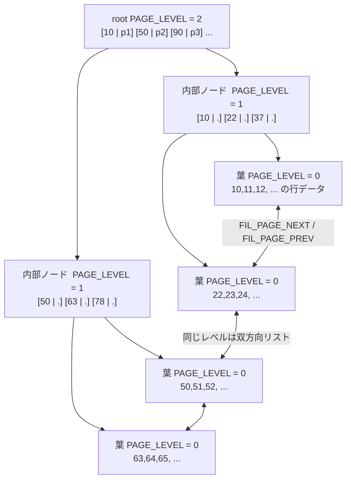

## 何を学んだか

インデックスに求められるものは 2 つある。

- **点検索** — `WHERE id = 42`。1 件をできるだけ少ない I/O で
- **範囲検索** — `WHERE id BETWEEN 100 AND 200`、`ORDER BY id LIMIT 20`。並び順で連続して取り出せること

素直な候補はどちらも片方しか満たさない。ハッシュ表は点検索が O(1) だが順序を持たないので範囲が引けない。ソート済み配列は範囲に強いが、真ん中に 1 件挿入すると後ろを全部ずらすことになる。二分探索木は両方できるが、ノード 1 個が数十バイトなので、1 回の I/O で 16KB 読んでも 1 回しか比較が進まない。

B+tree の答えは 3 つの決断でできている。

1. **ノードをページと同じ大きさにする。** 1 回の I/O で数百回ぶんの比較材料を取る
2. **データは葉にだけ置く。** 内部ノードには「キーと子ページ番号」だけを入れて、分岐数を最大化する
3. **葉を横に連結する。** 範囲スキャンは根に戻らず右へ進める



**「B+」の「+」は葉のリンクのことだと説明されることが多いが、実務上効いてくるのは「データを葉にだけ置く」ほうだ。** 内部ノードに行データが混ざると分岐数が桁で落ちる。

数字を入れてみる。16KB ページで実際に使えるのは 16252 バイト ([ページの構造](./page-layout/))。

| ページの種類                   | 1 件あたり                                     | 1 ページに入る件数 |
| ------------------------------ | ---------------------------------------------- | ------------------ |
| 内部ノード (`BIGINT` の PK)    | キー 8 + 子ページ番号 4 + ヘッダ 5 ≈ 17 バイト | 800 件強           |
| 葉 (1 行 200 バイトのテーブル) | 行 200 + ヘッダ 5 ≈ 205 バイト                 | 約 79 件           |

内部ノードの分岐数を 800 とすると、

- 2 段 (root + 葉) — 800 枚の葉 × 79 行 = **約 6 万行**
- 3 段 — 800 × 800 = 64 万枚の葉 × 79 行 = **約 5000 万行**
- 4 段 — **約 400 億行**

**実在するテーブルの B+tree はほぼ 3 段か 4 段に収まる。** そして上位 2 段は全部合わせても数 MB なので、まず確実にバッファプールに載っている。「インデックスがあれば何億行でも数回の I/O で引ける」と言われるのはこの計算のことだ。

## ソースコードのどこか

### 高さはページに書かれている

```cpp title="storage/innobase/include/page0types.h"
/** level of the node in an index tree; the leaf level is the level 0.
This field should not be written to after page creation. */
constexpr uint32_t PAGE_LEVEL = 26;
```

[`page0types.h#L82`](https://github.com/mysql/mysql-server/blob/mysql-8.4.11/storage/innobase/include/page0types.h#L82)。**葉が 0 で、上に行くほど大きい。** 「ページ作成後に書き換えてはならない」という注記が付いていて、ページは作られた時点でその高さに固定される。木が深くなるときも、既存のページのレベルは動かない ([B+tree の操作](./btree-operations/))。

### 同じレベルは双方向リスト

```cpp title="storage/innobase/include/fil0types.h"
/** if there is a 'natural' successor of the page, its offset. Otherwise
FIL_NULL. B-tree index pages(FIL_PAGE_TYPE contains FIL_PAGE_INDEX) on the
same PAGE_LEVEL are maintained as a doubly linked list via FIL_PAGE_PREV and
FIL_PAGE_NEXT in the collation order of the smallest user record on each
page. */
constexpr uint32_t FIL_PAGE_NEXT = 12;
```

[`fil0types.h#L57`](https://github.com/mysql/mysql-server/blob/mysql-8.4.11/storage/innobase/include/fil0types.h#L57)。コメントが「同じ `PAGE_LEVEL` のページは、各ページの最小レコードの照合順で双方向リストになっている」と明言している。**リンクは葉だけでなく全レベルにある。**

### 木を降りる関数

```cpp title="storage/innobase/include/btr0cur.h"
void btr_cur_search_to_nth_level(
    dict_index_t *index,   /*!< in: index */
    ulint level,           /*!< in: the tree level of search */
    const dtuple_t *tuple, /*!< in: data tuple; ... */
```

[`btr0cur.h#L134`](https://github.com/mysql/mysql-server/blob/mysql-8.4.11/storage/innobase/include/btr0cur.h#L134)。名前のとおり「n 段目まで降りる」関数で、`level = 0` なら葉、`level = 1` なら親を探す。**葉に着くための関数ではなく、任意のレベルで止まれる関数**になっているのは、ページ分割で親に node pointer を挿す処理が同じ関数を使うからだ。

降りた回数はカウンタになっている。

```cpp title="storage/innobase/include/btr0cur.h"
/** Number of searches down the B-tree in btr_cur_search_to_nth_level(). */
extern ulint btr_cur_n_non_sea;
/** Number of successful adaptive hash index lookups in
btr_cur_search_to_nth_level(). */
extern ulint btr_cur_n_sea;
```

[L759](https://github.com/mysql/mysql-server/blob/mysql-8.4.11/storage/innobase/include/btr0cur.h#L759)。`SHOW ENGINE INNODB STATUS` の INSERT BUFFER AND ADAPTIVE HASH INDEX セクションに出る `non-hash searches/s` がこれで、**「木を降りた回数」がそのまま観測できる**。8.4 では adaptive hash index が既定 OFF なので、ほぼ全部が `non_sea` 側に出る ([adaptive hash index](./adaptive-hash-index/))。

### 根は動かない

```cpp title="storage/innobase/include/dict0mem.h"
  /** index tree root page number */
  unsigned page : 32;
```

[`dict0mem.h#L1064`](https://github.com/mysql/mysql-server/blob/mysql-8.4.11/storage/innobase/include/dict0mem.h#L1064)。**インデックスの入口は「root ページ番号」1 つ**で、データディクショナリに記録されている。木が深くなっても、この番号は変わらない。根が分割されるときは新しい根を作るのではなく、根の中身を新しいページへ追い出す ([B+tree の操作](./btree-operations/))。

## なぜそうなっているか

### なぜノード = ページなのか

木の探索コストは「降りた段数 × 1 段あたりの I/O」だ。1 段あたりの I/O はページ 1 枚で固定なので、**段数を減らすことしかできない**。段数は `log(行数) / log(分岐数)` なので、分岐数を上げるのが唯一の手になる。

分岐数の上限を決めるのは「1 回の I/O で読める量 ÷ 1 エントリの大きさ」だから、ノードを I/O 単位いっぱいまで大きくするのが最適になる。二分探索木がデータベースで使われないのは、「1 回の I/O あたり比較 1 回」という最悪の比率になるからだ。

### なぜデータを葉にだけ置くのか

内部ノードに行データを入れると (それが B-tree だ)、1 エントリが 17 バイトではなく行サイズになる。上の例なら分岐数は 800 から 79 に落ちる。`log(5000 万) / log(79)` は 4 段近くになり、しかも内部ノードの合計サイズが増えるのでバッファプールに常駐しなくなる。

もう 1 つ、範囲スキャンの都合がある。データが内部ノードにも散っていると、`10, 11, 12, ...` と順に取り出すのに木を上下しなければならない。全部葉にあって葉が連結されていれば、1 度降りたあとは横に進むだけで済む。**`ORDER BY id LIMIT 20` が速いのはこの性質だけで説明できる。**

### なぜ balanced を保つのか

B+tree は挿入で溢れたページを分割し、削除で痩せたページを併合することで、**どの葉も根から同じ段数**という不変条件を守る。この維持コストは無料ではない (分割は親を書き換え、最悪根まで伝播する) が、代わりに「どの行を引いても最大 4 回の I/O」という上限が保証される。

順序を持たない構造 (ハッシュ) は最悪ケースを保証しやすいが範囲を諦める。順序を持つが平衡を諦めた構造は、挿入パターン次第で木が一直線になる。**予測可能な最悪ケースを保つために、書き込み時に代金を払う**というのが B+tree の選択だ。書き込み側の代金がどう払われるかは[B+tree の操作](./btree-operations/)で見る。

### ページ内はもう 1 段ある

木を降りて葉に着いても、そのページの中に 79 件のレコードがある。ここは B+tree ではなく、ページ末尾から伸びる**ページディレクトリ**を使った二分探索 + 短い線形走査で引く ([ページの構造](./page-layout/))。

つまり検索は「木を 3 段降りる」+「ページ内で二分探索」の 2 段構えになっている。前者はディスクの話、後者はメモリとキャッシュラインの話で、効くチューニングも別だ。

## どう活かすか

### 複合インデックスの左端規則は辞書順のことでしかない

`KEY (a, b, c)` は `(a, b, c)` の辞書順で並んだ木だ。`WHERE b = 2` だけを条件にしても、その行は木の全体に散っている。連続した区間にならないので範囲として取り出せない。

逆に `WHERE a = 1 AND b > 5` は `(1, 5, +∞)` から `(1, +∞, ...)` までの連続区間になるので引ける。**「使えるかどうか」は常に「連続した区間になるか」で判定できる** ([range 分析](./range-optimizer/))。

### PK の長さは 2 か所に効く

内部ノードのエントリは「キー + 子ページ番号」だから、キーが長いと分岐数が落ちる。上の表の 17 バイトが `CHAR(36)` の UUID (utf8mb4 なら 144 バイト) になると、分岐数は 800 から 100 程度になる。**同じ行数で木が 1 段深くなり、全検索が 1 ページぶん遅くなる。**

そのうえ InnoDB では PK の値が全セカンダリインデックスの葉に複製される ([セカンダリインデックス](./secondary-index/))。長い PK の代金は二重に取られる。

### 木の段数を実際に見る

```sql
SELECT NAME, N_FIELDS, PAGE_NO
  FROM INFORMATION_SCHEMA.INNODB_INDEXES
 WHERE TABLE_ID = (SELECT TABLE_ID FROM INFORMATION_SCHEMA.INNODB_TABLES
                    WHERE NAME = 'mydb/mytable');
```

`PAGE_NO` が root ページ番号だ。段数そのものは I_S には出ないが、`SHOW ENGINE INNODB STATUS` の `non-hash searches/s` と実 I/O 回数の比を見れば、上位ノードがキャッシュに載っているかどうかは分かる。

### 「テーブル自体が B+tree」という選択

ここまでは一般の B+tree の話だが、InnoDB はもう一歩踏み込んで**テーブル本体を PK の B+tree の葉に置いた**。テーブルというファイルは存在せず、あるのは木だけになる。この選択がどこに効くかは[クラスタードインデックス](./clustered-index/)で扱う。

### この続き

- テーブル本体が B+tree であることの帰結は[クラスタードインデックス — テーブルは PK の B+tree である](./clustered-index/)
- PK 以外のインデックスがどう作られるかは[セカンダリインデックス — 葉には PK が入っている](./secondary-index/)
- 分割・併合・latch の取り方は[B+tree の操作 — 検索、楽観/悲観挿入、分割、併合](./btree-operations/)
- ページ内のレコード配置とディレクトリは[ページの構造](./page-layout/)
- WHERE 句が「連続区間」に変換される過程は[range 分析 — WHERE を区間に変える](./range-optimizer/)
