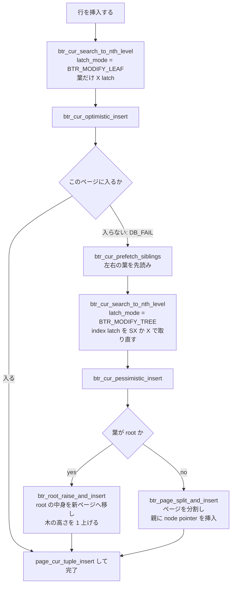

> **前提**: [B+tree](./btree-basics/) / [ページの構造](./page-layout/)

## 何を学んだか

B+tree を更新するときの根本的な問題は「**どこまで latch を取ればいいか分からない**」ことだ。1 レコード挿入するだけなら葉ページ 1 枚の X latch で足りるが、ページが溢れれば分割が起きて親も触る。親も溢れればその親も。最悪 root まで届く。

かといって毎回 root から X latch を取ると、木全体が直列化して並行性が消える。

InnoDB の答えは 2 段構えだ。



この形は挿入だけでなく更新にも削除にもある。`btr_cur_optimistic_update` / `btr_cur_pessimistic_update`、`btr_cur_optimistic_delete_func` / `btr_cur_pessimistic_delete`。**楽観パスが `DB_FAIL` を返したら、探索からやり直す**というのが共通の作法だ。

もう 1 つ押さえるべきは、**root ページ番号は木がどれだけ深くなっても変わらない**こと。root が分割されるときは、新しい root を作るのではなく root の中身を追い出す。

## なぜそうなっているか

### なぜ 2 段構えなのか

「木構造が変わるかどうか」は葉ページを見るまで分からない。分からないうちから木全体の latch を取ると、**大多数の挿入 (溢れない挿入) が不必要に直列化する**。

一方で楽観パスの失敗コストは低い。ページはバッファプールに載っているので、やり直しに I/O は要らない。降下のコストが 2 倍になるだけだ。ページが溢れる頻度を考えれば、期待値では圧倒的に得をする。

同じ考え方は他の場所にも出てくる。`btr_cur_optimistic_update` ([L3496](https://github.com/mysql/mysql-server/blob/mysql-8.4.11/storage/innobase/btr/btr0cur.cc#L3496)) は「更新後のレコードが同じページに収まるか」で分岐するし、`btr_cur_update_in_place` ([L3331](https://github.com/mysql/mysql-server/blob/mysql-8.4.11/storage/innobase/btr/btr0cur.cc#L3331)) は「レコードのサイズが変わらないか」でさらに手前の高速パスを作っている。

### なぜ latch を降りながら落とすのか

B+tree の降下は根から葉へ一方向なので、**子の latch を取ったら親はもう要らない**。親を保持し続けると、根に近いページの latch が全スレッドの競合点になる。

例外は「変更が親に波及するかもしれない場合」だけで、それを判定するのが `btr_cur_will_modify_tree` だ。判定を保守的にしておけば安全側に倒れる。

### なぜ連番挿入を特別扱いするのか

中央で割ると、連番挿入では左半分は二度と触られない。ページの半分が永久に空くわけで、**テーブルサイズが 2 倍になる**。右詰めにすればほぼ 100% 充填になる。

判定が `PAGE_LAST_INSERT` の一致という乱暴なもの (コメントも `eager heuristics` と認めている) なのは、正確に判定しようとするとコストが見合わないからだ。誤判定しても正しさには影響しない。

「1 件残す」理由もコメントにある。adaptive hash index が「このページの先頭にあるレコードを見るだけで検索位置を決められる」状態を保つためだ ([adaptive hash index](./adaptive-hash-index/))。

## ソースコードのどこか

### 探索 — 降りながら親の latch を落とす

[`btr_cur_search_to_nth_level` (`btr0cur.cc#L620`)](https://github.com/mysql/mysql-server/blob/mysql-8.4.11/storage/innobase/btr/btr0cur.cc#L620)。8.4 でも free function のままで、メソッド化されたのは `btr_pcur_t` の側だけだ。

`latch_mode` で挙動が変わる。読み取りなら `BTR_SEARCH_LEAF`、葉だけの更新なら `BTR_MODIFY_LEAF`、木構造を変える可能性があるなら `BTR_MODIFY_TREE`。

`BTR_MODIFY_TREE` では、まずインデックス全体の latch を取る。

```cpp title="storage/innobase/btr/btr0cur.cc"
  switch (latch_mode) {
    case BTR_MODIFY_TREE:
      /* Most of delete-intended operations are purging.
      Free blocks and read IO bandwidth should be prior
      for them, when the history list is glowing huge. */
      if (lock_intention == BTR_INTENTION_DELETE &&
          trx_sys->rseg_history_len.load() > BTR_CUR_FINE_HISTORY_LENGTH &&
          buf_get_n_pending_read_ios()) {
        mtr_x_lock(dict_index_get_lock(index), mtr, UT_LOCATION_HERE);
      } else if (dict_index_is_spatial(index) &&
                 lock_intention <= BTR_INTENTION_BOTH) {
        ...
        mtr_x_lock(dict_index_get_lock(index), mtr, UT_LOCATION_HERE);
      } else {
        mtr_sx_lock(dict_index_get_lock(index), mtr, UT_LOCATION_HERE);
      }
      upper_rw_latch = RW_X_LATCH;
      break;
```

[L816](https://github.com/mysql/mysql-server/blob/mysql-8.4.11/storage/innobase/btr/btr0cur.cc#L816)。通常は SX latch。**purge が溜まっているときだけ X latch にして、purge を優先させる**。`History list length` が伸びている状態では、この分岐によって木全体の更新が直列化する。

降下ループの本体は `search_loop` ラベルから。非葉ページの latch モードは `upper_rw_latch` で決まるが、`BTR_MODIFY_TREE` のときは**そもそもページ単位の latch を取らない** (`RW_NO_LATCH`) 場合がある。

```cpp title="storage/innobase/btr/btr0cur.cc"
search_loop:
  fetch = cursor->m_fetch_mode;
  rw_latch = RW_NO_LATCH;
  rtree_parent_modified = false;

  if (height != 0) {
    /* We are about to fetch the root or a non-leaf page. */
    if ((latch_mode != BTR_MODIFY_TREE || height == level) &&
        !retrying_for_search_prev) {
      /* If doesn't have SX or X latch of index,
      each pages should be latched before reading. */
      ...
        rw_latch = upper_rw_latch;
      }
    }
  } else if (latch_mode <= BTR_MODIFY_LEAF) {
    rw_latch = latch_mode;
```

[L923](https://github.com/mysql/mysql-server/blob/mysql-8.4.11/storage/innobase/btr/btr0cur.cc#L923)。インデックス全体の SX / X latch を持っているなら、個々の非葉ページを latch する必要がない。逆に `BTR_SEARCH_LEAF` / `BTR_MODIFY_LEAF` では index latch を S でしか持たないので、非葉ページを 1 枚ずつ latch しながら降りる。これが **latch coupling** (crabbing) だ。

親の latch は葉に着いたところでまとめて落とされる。

```cpp title="storage/innobase/btr/btr0cur.cc"
  if (height == 0) {
    ...
    switch (latch_mode) {
      case BTR_MODIFY_TREE:
      case BTR_CONT_MODIFY_TREE:
      case BTR_CONT_SEARCH_TREE:
        break;
      default:
        if (!s_latch_by_caller && !srv_read_only_mode && !modify_external) {
          /* Release the tree s-latch */
          /* NOTE: BTR_MODIFY_EXTERNAL
          needs to keep tree sx-latch */
          mtr_release_s_latch_at_savepoint(mtr, savepoint,
                                           dict_index_get_lock(index));
        }
        ...
        for (; n_releases < n_blocks; n_releases++) {
```

[L1134](https://github.com/mysql/mysql-server/blob/mysql-8.4.11/storage/innobase/btr/btr0cur.cc#L1134)。**index latch も、降下経路の非葉ページの latch も、葉に着いた時点で解放される**。読み取りが木の上部で衝突しないのはこのおかげだ。

`BTR_MODIFY_TREE` の場合はもう少し賢い。降りながら「このページの変更が親に波及しないか」を判定し、波及しないなら親を解放する。

```cpp title="storage/innobase/btr/btr0cur.cc"
    /* If the page might cause modify_tree,
    we should not release the parent page's lock. */
    if (!detected_same_key_root && latch_mode == BTR_MODIFY_TREE &&
        !btr_cur_will_modify_tree(index, page, lock_intention, node_ptr,
                                  node_ptr_max_size, page_size, mtr) &&
        !rtree_parent_modified) {
      ...
      /* we can release upper blocks */
      for (; n_releases < n_blocks; n_releases++) {
        if (n_releases == 0) {
          /* we should not release root page
          to pin to same block. */
          continue;
        }
```

[L1442](https://github.com/mysql/mysql-server/blob/mysql-8.4.11/storage/innobase/btr/btr0cur.cc#L1442)。`btr_cur_will_modify_tree` が「このページは分割も併合も起こさない」と判断すれば、そこから上の latch を落とす。**root だけは落とさない**のがコメントで明示されている。

### 楽観的挿入

[`btr_cur_optimistic_insert` (`btr0cur.cc#L2663`)](https://github.com/mysql/mysql-server/blob/mysql-8.4.11/storage/innobase/btr/btr0cur.cc#L2663)。入らないと判断する条件は 3 つある。

```cpp title="storage/innobase/btr/btr0cur.cc"
  ulint max_size = page_get_max_insert_size_after_reorganize(page, 1);

  if (page_has_garbage(page)) {
    if ((max_size < rec_size || max_size < BTR_CUR_PAGE_REORGANIZE_LIMIT) &&
        page_get_n_recs(page) > 1 &&
        page_get_max_insert_size(page, 1) < rec_size) {
      goto fail;
    }
  } else if (max_size < rec_size) {
    goto fail;
  }

  /* If there have been many consecutive inserts to the
  clustered index leaf page of an uncompressed table, check if
  we have to split the page to reserve enough free space for
  future updates of records. */

  if (leaf && !page_size.is_compressed() && index->is_clustered() &&
      page_get_n_recs(page) >= 2 &&
      dict_index_get_space_reserve() + rec_size > max_size &&
      (btr_page_get_split_rec_to_right(cursor, &dummy) ||
       btr_page_get_split_rec_to_left(cursor, &dummy))) {
    goto fail;
  }
```

1 つ目は単純な空き不足。2 つ目 (`page_has_garbage`) は「削除済みレコードを回収 (reorganize) すれば入るか」まで見る。3 つ目が面白い。**連番挿入と判定されたクラスタードインデックスの葉では、まだ入るのに敢えて失敗させる**。

```cpp title="storage/innobase/include/dict0dict.ic"
static inline ulint dict_index_get_space_reserve(void) {
  return (UNIV_PAGE_SIZE / 16);
}
```

16KB ページなら 1024 バイト。更新で行が伸びたときに同じページで吸収できるよう、連番挿入のページは 1KB 空けて封をする。

失敗したときは `DB_FAIL` を返すが、その前に隣接ページを先読みする。

```cpp title="storage/innobase/btr/btr0cur.cc"
  fail:
    err = DB_FAIL;

    /* prefetch siblings of the leaf for the pessimistic
    operation, if the page is leaf. */
    if (page_is_leaf(page)) {
      btr_cur_prefetch_siblings(block);
    }
```

分割では隣接ページの `FIL_PAGE_PREV` / `FIL_PAGE_NEXT` を書き換えるので、そのページが要る。悲観パスに入る前に非同期で読んでおく。

### 悲観的挿入と分割

呼び出し側 (`row_ins_clust_index_entry` など) は `DB_FAIL` を見て、`BTR_MODIFY_TREE` で探索をやり直してから [`btr_cur_pessimistic_insert` (L2931)](https://github.com/mysql/mysql-server/blob/mysql-8.4.11/storage/innobase/btr/btr0cur.cc#L2931) を呼ぶ。その中で葉が root なら `btr_root_raise_and_insert`、そうでなければ `btr_page_split_and_insert` に分岐する。

分割点の決定が [`btr_page_split_and_insert` (`btr0btr.cc#L2305`)](https://github.com/mysql/mysql-server/blob/mysql-8.4.11/storage/innobase/btr/btr0btr.cc#L2305) の冒頭にある。

```cpp title="storage/innobase/btr/btr0btr.cc"
  /* 1. Decide the split record; split_rec == NULL means that the
  tuple to be inserted should be the first record on the upper
  half-page */
  insert_left = false;

  if (n_iterations > 0) {
    direction = FSP_UP;
    hint_page_no = page_no + 1;
    split_rec = btr_page_get_split_rec(cursor, tuple);
    ...
  } else if (btr_page_get_split_rec_to_right(cursor, &split_rec)) {
    direction = FSP_UP;
    hint_page_no = page_no + 1;

  } else if (btr_page_get_split_rec_to_left(cursor, &split_rec)) {
    direction = FSP_DOWN;
    hint_page_no = page_no - 1;
    ut_ad(split_rec);
  } else {
    direction = FSP_UP;
    hint_page_no = page_no + 1;
    ...
    if (page_get_n_recs(page) > 1) {
      split_rec = page_get_middle_rec(page);
    } else if (btr_page_tuple_smaller(cursor, tuple, offsets, n_uniq, heap)) {
```

**優先順位は「右詰め → 左詰め → 中央」**。右詰めの判定はこうだ。

```cpp title="storage/innobase/btr/btr0btr.cc"
  /* We use eager heuristics: if the new insert would be right after
  the previous insert on the same page, we assume that there is a
  pattern of sequential inserts here. */

  if (page_header_get_ptr(page, PAGE_LAST_INSERT) == insert_point) {
    rec_t *next_rec;

    next_rec = page_rec_get_next(insert_point);

    if (page_rec_is_supremum(next_rec)) {
    split_at_new:
      /* Split at the new record to insert */
      *split_rec = nullptr;
    } else {
      rec_t *next_next_rec = page_rec_get_next(next_rec);
      if (page_rec_is_supremum(next_next_rec)) {
        goto split_at_new;
      }

      /* If there are >= 2 user records up from the insert
      point, split all but 1 off. We want to keep one because
      then sequential inserts can use the adaptive hash
      index, as they can do the necessary checks of the right
      search position just by looking at the records on this
      page. */

      *split_rec = next_next_rec;
    }
```

[`btr_page_get_split_rec_to_right` (`btr0btr.cc#L1703`)](https://github.com/mysql/mysql-server/blob/mysql-8.4.11/storage/innobase/btr/btr0btr.cc#L1703)。判定は `PAGE_LAST_INSERT` (前回の挿入位置、[ページの構造](./page-layout/)) が今回の挿入位置と一致するか、それだけだ。一致すれば**新しいページには挿入するレコードと高々 1 件しか移さない**。左のページは満杯で固定される。

`hint_page_no` と `direction` はそのまま `btr_page_alloc` → `fseg_alloc_page_no` に渡り、**新しいページを物理的に隣に置こうとする** ([物理構造の walkthrough](./innodb-physical-walkthrough/))。

### root は動かない

```cpp title="storage/innobase/btr/btr0btr.cc"
  /* Allocate a new page to the tree. Root splitting is done by first
  moving the root records to the new page, emptying the root, putting
  a node pointer to the new page, and then splitting the new page. */

  level = btr_page_get_level(root);

  new_block = btr_page_alloc(index, 0, FSP_NO_DIR, level, mtr, mtr);
```

[`btr_root_raise_and_insert` (`btr0btr.cc#L1482`)](https://github.com/mysql/mysql-server/blob/mysql-8.4.11/storage/innobase/btr/btr0btr.cc#L1482)。root の中身を新ページにコピーし、root を空にして子へのポインタ 1 本を書く。

これが必要な理由は 3 つある。

- root ページ番号は data dictionary に記録されている (`dict_index_t::page`)。動かすと DD の更新が必要になる
- **葉セグメントと非葉セグメントのヘッダが root ページにある** (`PAGE_BTR_SEG_LEAF` / `PAGE_BTR_SEG_TOP`、[物理構造の walkthrough](./innodb-physical-walkthrough/))。root が動くとセグメントの入口を見失う
- 同じ関数の冒頭には、`UNIV_BTR_DEBUG` ビルドで `ut_a(dict_index_get_page(index) == page_get_page_no(root));` が置かれている。root がその番号にあることが不変条件として明示されている

### 併合

削除でページが痩せると `btr_cur_compress_if_useful` ([`btr0cur.cc#L4502`](https://github.com/mysql/mysql-server/blob/mysql-8.4.11/storage/innobase/btr/btr0cur.cc#L4502)) が呼ばれ、閾値を割っていれば [`btr_compress` (`btr0btr.cc#L3023`)](https://github.com/mysql/mysql-server/blob/mysql-8.4.11/storage/innobase/btr/btr0btr.cc#L3023) が隣のページと併合する。

```cpp title="storage/innobase/include/btr0cur.h"
/** In the pessimistic delete, if the page data size drops below this
limit, merging it to a neighbor is tried */
#define BTR_CUR_PAGE_COMPRESS_LIMIT(index) \
  ((UNIV_PAGE_SIZE * (ulint)((index)->merge_threshold)) / 100)
```

[`btr0cur.h#L610`](https://github.com/mysql/mysql-server/blob/mysql-8.4.11/storage/innobase/include/btr0cur.h#L610)。`merge_threshold` の既定は 50 ([`dict0mem.h#L1041`](https://github.com/mysql/mysql-server/blob/mysql-8.4.11/storage/innobase/include/dict0mem.h#L1041) の `DICT_INDEX_MERGE_THRESHOLD_DEFAULT`) で、**ページ内のデータが 8192 バイトを割ると併合を試みる**。インデックスごとに `CREATE INDEX ... COMMENT 'MERGE_THRESHOLD=40'` で変えられる。

木が浅くなるときは `btr_lift_page_up` ([`btr0btr.cc#L2856`](https://github.com/mysql/mysql-server/blob/mysql-8.4.11/storage/innobase/btr/btr0btr.cc#L2856)) が呼ばれ、これも root を残したまま子の中身を root に引き上げる。

### カーソルの保存と復元

セカンダリインデックスとクラスタードインデックスを両方触るときや、悲観パスに切り替えるときは、いったん latch を落として取り直す必要がある。そのための仕組みが `btr_pcur_t` だ。

[`btr_pcur_t::store_position` (`btr0pcur.cc#L42`)](https://github.com/mysql/mysql-server/blob/mysql-8.4.11/storage/innobase/btr/btr0pcur.cc#L42) はカーソル位置を「そのレコードのキーのコピー」として保存し、[`restore_position` (L147)](https://github.com/mysql/mysql-server/blob/mysql-8.4.11/storage/innobase/btr/btr0pcur.cc#L147) は保存したキーで木を降り直す。**ページ番号やオフセットではなくキーで覚える**ので、その間にページが分割されても正しい位置に戻れる。ただし「そのレコードが消えていたら隣に着地する」ので、呼び出し側は位置がずれた可能性を扱う必要がある。

## どう活かすか

### `innodb_fill_factor` は普段の INSERT には効かない

名前から「ページの充填率を制御する」ように見えるが、実装を追うと違う。

```cpp title="storage/innobase/handler/ha_innodb.cc"
static MYSQL_SYSVAR_LONG(fill_factor, ddl::fill_factor, PLUGIN_VAR_RQCMDARG,
                         "Percentage of B-tree page filled during bulk insert",
                         nullptr, nullptr, 100, 10, 100, 0);
```

[`ha_innodb.cc#L22717`](https://github.com/mysql/mysql-server/blob/mysql-8.4.11/storage/innobase/handler/ha_innodb.cc#L22717)。ヘルプ文が `during bulk insert` と言っているとおりで、`ddl::fill_factor` を読んでいるのは `btr/btr0load.cc` と `btr/btr0mtib.cc` — つまり**インデックス構築 (bulk load) の経路だけ**だ。`btr0cur.cc` の通常の挿入経路は一度も参照しない。

通常の `INSERT` でページに残される余白は `dict_index_get_space_reserve()` の `UNIV_PAGE_SIZE / 16` で固定されており、しかも連番挿入と判定されたときにしか効かない。

だから `innodb_fill_factor` を下げても既存テーブルへの挿入は変わらない。効くのは `ALTER TABLE ... ADD INDEX` や `OPTIMIZE TABLE` のときだけだ。**更新でよく伸びるテーブルのインデックスを作り直すときに `innodb_fill_factor` を下げておく**、という使い方になる。

### UUID PK でテーブルが太る

上で見た右詰め分割は `PAGE_LAST_INSERT` の一致で判定される。ランダムな PK では毎回外れ、中央分割になる。中央分割が続くとページ充填率は 7 割前後に落ち着き、同じ行数でもテーブルサイズが 1.5 倍近くなる。

さらに悪いのは書き込みの散らばりだ。触るページが毎回違うのでダーティページが木全体に広がり、[page cleaner](./flush-list-and-page-cleaner/) が書き出す量が増える。詳しくは[クラスタードインデックス](./clustered-index/)。

### 大量 DELETE の後にページが虫食いになる

削除は `merge_threshold` (既定 50%) を割ったページから順に併合される。だが**併合は隣のページと合わせて 1 ページに収まるときしか成立しない**。40% と 40% なら合わせて 80% で成立するが、60% と 60% なら成立しない。結果、半分ほど埋まったページが並ぶ状態に落ち着く。

これを解消するのは `OPTIMIZE TABLE` (実体はテーブル再構築) だけだ。定期的な削除があるテーブルでは、`INFORMATION_SCHEMA.TABLES` の `DATA_FREE` と `DATA_LENGTH` の比を監視して再構築のタイミングを決める。

### 大きい行の更新が急に遅くなる

`btr_cur_update_in_place` は「レコードのサイズが変わらない」場合の最速パスだ。`VARCHAR` を短い値から長い値に更新すると、ここを外れて `btr_cur_optimistic_update`、さらにページに入らなければ `btr_cur_pessimistic_update` に落ちる。悲観パスは**元のレコードを delete-mark して新しいレコードを挿入する**ので、ページ分割まで起きうる。

「同じ `UPDATE` 文なのに実行時間が跳ねる」ときは、値の長さが変わっていないか疑う。更新頻度の高い列を短く保つ設計がここで効く。

### `History list length` が伸びると木の更新が直列化する

上で見たとおり、`BTR_MODIFY_TREE` の探索は purge が溜まっていると index latch を SX ではなく X で取る。**purge の遅れが、直接そのテーブルの並行更新性能を落とす**。

長時間のトランザクションが `History list length` を伸ばしている状態で書き込みのレイテンシが跳ねているなら、この分岐を疑う価値がある ([purge のページ](./purge/))。

### latch 競合と行ロックのデッドロックは別物

ここで扱った latch はロックではない。latch は 1 つの mtr の中でしか保持されず、トランザクションをまたがない ([mini-transaction](./mini-transaction/))。**行ロックのデッドロック検出とは別の世界**で、latch の待ちは `SHOW ENGINE INNODB STATUS` の `SEMAPHORES` セクションに現れる。

そこに `--Thread ... has waited at btr0cur.cc line ... for N seconds` が並んでいるなら、行ロックではなく B+tree の latch 競合を見ている。対処も違う: 行ロックならトランザクションを短くする話だが、latch 競合は「同じ木の同じあたりに書き込みが集中している」話で、パーティショニングやシャーディングの検討に向かう。
