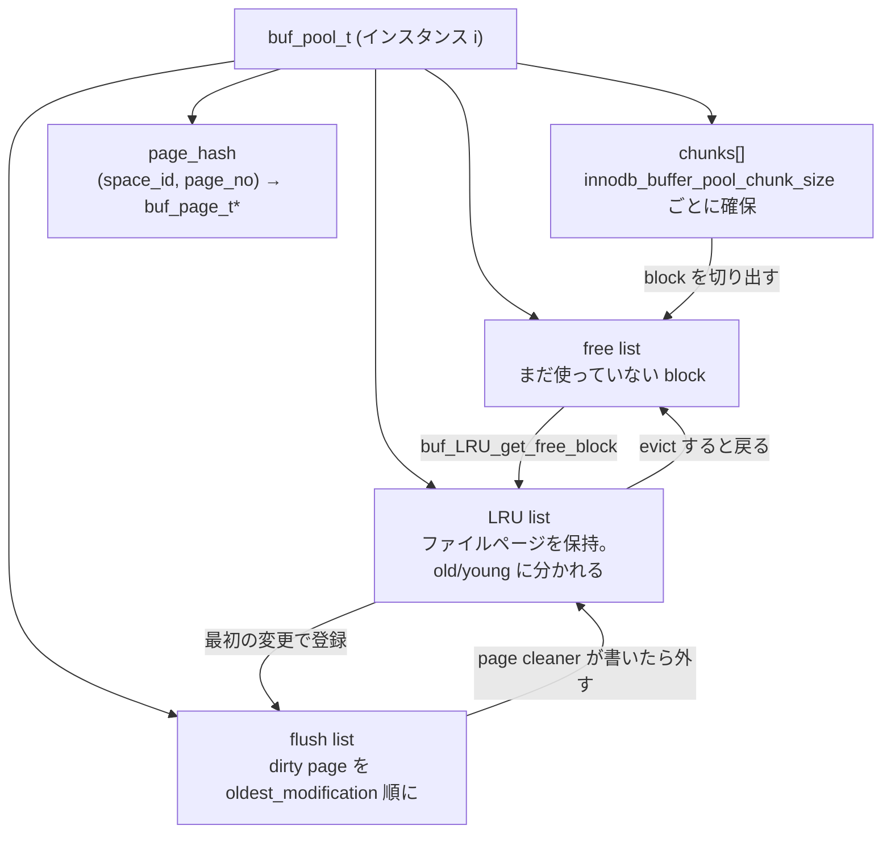
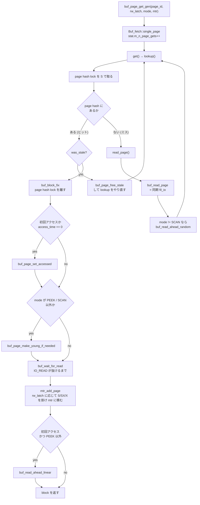

> **前提**: [ページとバッファ](./page-and-buffer/) / [物理構造](./innodb-physical-walkthrough/)

## この層の責務

バッファプールの仕事は 1 行で書ける。**`(space_id, page_no)` を、メモリ上の 16KB のバイト列と、それを触ってよいという latch に変換する**。

その入口は `buf_page_get_gen` ただ 1 つだ。B+tree の探索も、undo ページの読み書きも、テーブルスペースヘッダの更新も、adaptive hash index のミス時のフォールバックも、全部この関数を通る。[物理構造のページ](./innodb-physical-walkthrough/)で見た `fil_io` は、この関数がキャッシュミスしたときにだけ呼ばれる。

責務は 4 つに分かれる。

1. **キャッシュの索引** — page hash で `(space_id, page_no)` から block を引く
2. **メモリの所有** — chunk 単位でまとめて確保したフレームを、free list / LRU list / flush list という 3 本のリストで管理する
3. **並行制御** — page hash lock、block mutex、そしてページ本体の rw_lock を、決まった順で取る
4. **先読みの起動** — 初回アクセスだったとき linear read-ahead を、ミスして読んだとき random read-ahead を仕掛ける

書き出し (dirty page のディスク反映) はこの入口には含まれない。呼び出し側は mtr の中でページを変更し、mtr のコミット時に flush list へ載るだけで、実際に書くのは page cleaner だ ([flush list と page cleaner](./flush-list-and-page-cleaner/))。**読みは同期、書きは非同期**という非対称がバッファプールの設計の芯にある。

## 主要な型とその関係

### `buf_page_t` / `buf_block_t` — 記述子とフレーム

[`storage/innobase/include/buf0buf.h#L1165`](https://github.com/mysql/mysql-server/blob/mysql-8.4.11/storage/innobase/include/buf0buf.h#L1165) の `buf_page_t` が**ページ 1 枚のメタデータ**を持つ。`id` (= `page_id_t`)、`state`、`io_fix`、`buf_fix_count`、そして 3 本のリストのノードだ。

```cpp title="storage/innobase/include/buf0buf.h"
  /** Node used in chaining to buf_pool->page_hash or buf_pool->zip_hash */
  buf_page_t *hash;
...
  UT_LIST_NODE_T(buf_page_t) list;
...
  /** node of the LRU list */
  UT_LIST_NODE_T(buf_page_t) LRU;
```

`hash` が page hash のチェイン、`list` が free list か flush list のどちらか (state で決まる)、`LRU` が LRU list のノードになる。**1 つの記述子が同時に free と flush の両方に載ることはない**が、LRU と flush list には同時に載る。これは `list` と `LRU` が別フィールドだから成り立つ。

[`buf_block_t` (L1765)](https://github.com/mysql/mysql-server/blob/mysql-8.4.11/storage/innobase/include/buf0buf.h#L1765) はその `buf_page_t` を**先頭フィールドに埋め込んだ**構造体で、実際の 16KB フレームへのポインタとページ latch を足したものだ。

```cpp title="storage/innobase/include/buf0buf.h"
struct buf_block_t {
  /** page information; this must be the first field, so
  that buf_pool->page_hash can point to buf_page_t or buf_block_t */
  buf_page_t page;

#ifndef UNIV_HOTBACKUP
  /** read-write lock of the buffer frame */
  BPageLock lock;
...
  /** pointer to buffer frame which is of size UNIV_PAGE_SIZE, and aligned
  to an address divisible by UNIV_PAGE_SIZE */
  byte *frame;
```

コメントが明言しているとおり、**`page` が先頭にあることが前提の `reinterpret_cast` がコード中に散らばっている**。page hash は `buf_page_t*` を返し、呼び出し側は state を見てから `buf_block_t*` にキャストし直す。圧縮ページだけの状態 (`BUF_BLOCK_ZIP_PAGE`) では `buf_page_t` 単体がバディアロケータから取られるので、この 2 段構えが必要になる。

`frame` が 16KB のページそのもので、[ページの構造](./page-layout/)で見たバイト列がここに載る。`lock` がそのフレームを守る rw_lock で、これが**ページ latch**と呼ばれるものだ。

### `buf_pool_t` — インスタンス

[`buf_pool_t` (L2294)](https://github.com/mysql/mysql-server/blob/mysql-8.4.11/storage/innobase/include/buf0buf.h#L2294) が 1 インスタンスに対応する。`buf_pool_ptr` という配列に `srv_buf_pool_instances` 個並び、それぞれが独立した mutex・リスト・page hash を持つ。

インスタンス内は役割ごとに mutex が分かれている。

```cpp title="storage/innobase/include/buf0buf.h"
  BufListMutex chunks_mutex;

  /** LRU list mutex */
  BufListMutex LRU_list_mutex;

  /** free and withdraw list mutex */
  BufListMutex free_list_mutex;
...
  /** Mutex protecting the flush list access. This mutex protects flush_list,
```

`LRU_list_mutex` / `free_list_mutex` / `flush_list_mutex` が別々なので、LRU を走査しているスレッドと flush list を走査しているスレッドはぶつからない。8.0 で `buf_pool->mutex` 1 本を割ったのがこの形だ。

1 インスタンスの持ち物を並べるとこうなる。



### chunk — メモリ確保の単位

メモリは 1 ページずつではなく **chunk 単位**で OS から取る。[`buf_chunk_init` (`buf0buf.cc#L1055`)](https://github.com/mysql/mysql-server/blob/mysql-8.4.11/storage/innobase/buf/buf0buf.cc#L1055) が 1 chunk を確保し、その先頭に `buf_block_t` の配列を、続きにページフレームを敷き詰めて、全 block を free list に繋ぐ。

```cpp title="storage/innobase/buf/buf0buf.cc"
  /* Round down to a multiple of page size,
  although it already should be. */
  mem_size = ut_2pow_round(mem_size, UNIV_PAGE_SIZE);
  /* Reserve space for the block descriptors. */
  mem_size += ut_2pow_round(
      (mem_size / UNIV_PAGE_SIZE) * (sizeof *block) + (UNIV_PAGE_SIZE - 1),
      UNIV_PAGE_SIZE);
```

chunk の大きさは `innodb_buffer_pool_chunk_size` (既定 128MB) で、`buf_pool_size / srv_buf_pool_chunk_unit` が chunk の本数になる ([L1295](https://github.com/mysql/mysql-server/blob/mysql-8.4.11/storage/innobase/buf/buf0buf.cc#L1295))。**オンラインでのプールサイズ変更が chunk 単位でしかできない**のはこの構造のためで、`innodb_buffer_pool_size` は「chunk_size × instances」の倍数に丸められる。

### インスタンスへの振り分け

ここは誤解しやすい。**ファイルページの振り分けはラウンドロビンではなくハッシュ**だ。[`buf_pool_get` (`buf0buf.ic#L823`)](https://github.com/mysql/mysql-server/blob/mysql-8.4.11/storage/innobase/include/buf0buf.ic#L823) はこうなっている。

```cpp title="storage/innobase/include/buf0buf.ic"
static inline buf_pool_t *buf_pool_get(const page_id_t &page_id) {
  /* 2log of BUF_READ_AHEAD_AREA (64) */
  page_no_t ignored_page_no = page_id.page_no() >> 6;

  page_id_t id(page_id.space(), ignored_page_no);

  ulint i = id.hash() % srv_buf_pool_instances;

  return (&buf_pool_ptr[i]);
}
```

ページ番号の下位 6 bit を落としてからハッシュする。つまり**連続する 64 ページは必ず同じインスタンスに載る**。read-ahead が 64 ページ単位で動くので、先読みしたページ群が 1 インスタンスに閉じるようにわざと揃えてある ([read-ahead のページ](./read-ahead-and-io/))。

ラウンドロビンなのは、ファイルページではない作業用ブロックを取るときだけだ。[`buf_block_alloc` (L582)](https://github.com/mysql/mysql-server/blob/mysql-8.4.11/storage/innobase/buf/buf0buf.cc#L582) が `buf_pool == nullptr` で呼ばれたときに `static ulint buf_pool_index` を回して均等に散らす。

```cpp title="storage/innobase/buf/buf0buf.cc"
  if (buf_pool == nullptr) {
    /* We are allocating memory from any buffer pool, ensure
    we spread the grace on all buffer pool instances. */
    index = buf_pool_index++ % srv_buf_pool_instances;
    buf_pool = buf_pool_from_array(index);
  }
```

インスタンス数の既定値も 8.4 では固定値ではない。[`ha_innodb.cc#L4604`](https://github.com/mysql/mysql-server/blob/mysql-8.4.11/storage/innobase/handler/ha_innodb.cc#L4604) で、プールが 1GB 未満なら強制的に 1、そうでなければプールサイズと CPU 数から導く。

```cpp title="storage/innobase/handler/ha_innodb.cc"
    const auto bp_hint_ull = srv_buf_pool_size / (srv_buf_pool_chunk_unit * 2);
...
    ulong cpu_hint = ulong{std::thread::hardware_concurrency() / 4};

    srv_buf_pool_instances = std::clamp(std::min(bp_hint, cpu_hint), 1UL, 64UL);
```

### page hash と page latch は別物

混同されやすい 2 つを分けておく。

- **page hash lock** — page hash のバケット群を守る rw_lock。既定 16 本 (`MAX_PAGE_HASH_LOCKS = 1024`、[`buf0buf.h#L115`](https://github.com/mysql/mysql-server/blob/mysql-8.4.11/storage/innobase/include/buf0buf.h#L115))。**「その page_id の block がどこにあるか」という索引だけを守る**。持っている時間は極めて短い
- **page latch** — `buf_block_t::lock`。**ページの中身 (16KB のバイト列) を守る**。mtr がコミットするまで保持され、B+tree の latch coupling もこの latch で行う ([B+tree の操作](./btree-operations/))

`buf_page_get_gen` の仕事は、前者を短く取って block を見つけ、buf-fix でその block が消えないことを保証し、page hash lock を離してから後者を掛けることだ。

## 処理の流れ

### `buf_page_get_gen` は 2 つのテンプレート実装に振り分ける

[`buf0buf.cc#L4456`](https://github.com/mysql/mysql-server/blob/mysql-8.4.11/storage/innobase/buf/buf0buf.cc#L4456) の本体は、デバッグ用の assert を除けばほぼ振り分けだけだ。

```cpp title="storage/innobase/buf/buf0buf.cc"
  if (mode == Page_fetch::NORMAL && !fsp_is_system_temporary(page_id.space())) {
    Buf_fetch_normal fetch(page_id, page_size);

    fetch.m_rw_latch = rw_latch;
    fetch.m_guess = guess;
...
    return (fetch.single_page());

  } else {
    Buf_fetch_other fetch(page_id, page_size);
```

`Buf_fetch` は CRTP のテンプレート ([L3622](https://github.com/mysql/mysql-server/blob/mysql-8.4.11/storage/innobase/buf/buf0buf.cc#L3622)) で、`Buf_fetch_normal` と `Buf_fetch_other` の 2 つが派生する。**通常の読み書きのパスを、watch や一時テーブルスペースや `IF_IN_POOL` といった特殊ケースから完全に分離するため**の分岐で、`Buf_fetch_normal::get` のコメントは "Keep this path as simple as possible." と言っている。

`mode` は `Page_fetch` の enum で、主なものはこうなる。

| mode                  | 意味                                                           |
| --------------------- | -------------------------------------------------------------- |
| `NORMAL`              | 通常。なければ読む                                             |
| `SCAN`                | 並列スキャン用。read-ahead を起こさず LRU の先頭にも動かさない |
| `IF_IN_POOL`          | プールにあるときだけ返す。なければ `nullptr`                   |
| `PEEK_IF_IN_POOL`     | 同上 + LRU を動かさない                                        |
| `IF_IN_POOL_OR_WATCH` | なければ watch を仕掛ける (purge が使う)                       |
| `NO_LATCH`            | buf-fix だけして latch は掛けない                              |

### ヒットとミス



ヒットのパス ([`Buf_fetch_normal::get` L3720](https://github.com/mysql/mysql-server/blob/mysql-8.4.11/storage/innobase/buf/buf0buf.cc#L3720)) は本当に短い。

```cpp title="storage/innobase/buf/buf0buf.cc"
    block = lookup();

    if (block != nullptr) {
      if (block->page.was_stale()) {
...
      }

      buf_block_fix(block);

      /* Now safe to release page_hash S lock. */
      rw_lock_s_unlock(m_hash_lock);
      break;
    }

    /* Page not in buf_pool: needs to be read from file */
    read_page();
```

`buf_block_fix` は `buf_fix_count` のアトミックなインクリメントで、**「この block を evict したり別のページに再利用したりするな」という予約**だ。mutex ではないので、これを持ったまま page hash lock を離せる。

ミスのパス ([`read_page` L4124](https://github.com/mysql/mysql-server/blob/mysql-8.4.11/storage/innobase/buf/buf0buf.cc#L4124)) は `buf_read_page` を同期で呼び、成功したら random read-ahead を試す。

```cpp title="storage/innobase/buf/buf0buf.cc"
void Buf_fetch<T>::read_page() {
  if (buf_read_page(m_page_id, m_page_size)) {
    /* Avoid doing read-ahead for parallel scans (well, at least currently this
    flag is used only during the parallel scans). This would cause unnecessary
    IO when the process is already being parallelized on higher level of
    abstraction. */
    if (m_mode != Page_fetch::SCAN) {
      buf_read_ahead_random(m_page_id, m_page_size, ibuf_inside(m_mtr));
    }
    m_retries = 0;
  } else if (m_retries < BUF_PAGE_READ_MAX_RETRIES) {
```

読んだ後は `for (;;)` の頭に戻ってもう一度 `lookup()` する。**「読んで、その戻り値の block を使う」のではなく「読んで、もう一度探す」**。読んでいる間に別のスレッドが同じページを読み終えているかもしれないし、evict されているかもしれないからだ。

`BUF_PAGE_READ_MAX_RETRIES` は 100 で、100 回読んでも駄目なら `ib::fatal` でプロセスを落とす。破損したページを黙って返すよりクラッシュを選ぶ設計になっている。

### latch を掛けて mtr に積む

[`single_page` (L4306)](https://github.com/mysql/mysql-server/blob/mysql-8.4.11/storage/innobase/buf/buf0buf.cc#L4306) の後半が、返す直前の仕上げだ。

```cpp title="storage/innobase/buf/buf0buf.cc"
  /* We have to wait here because the IO_READ state was set under the protection
  of the hash_lock and not the block->mutex and block->lock. */
  buf_wait_for_read(block);
```

`buf_wait_for_read` は `block->lock` を S で取ってすぐ離すループになっている。**読み込み中のページは I/O 側が `block->lock` を X で持っている**ので、S が取れた時点で読み込みは終わっている。

その後 [`mtr_add_page` (L4160)](https://github.com/mysql/mysql-server/blob/mysql-8.4.11/storage/innobase/buf/buf0buf.cc#L4160) が要求された latch を掛け、mtr のメモに積む。

```cpp title="storage/innobase/buf/buf0buf.cc"
    case RW_S_LATCH:
      rw_lock_s_lock_gen(&block->lock, 0, loc);
      fix_type = MTR_MEMO_PAGE_S_FIX;
      break;
...
  mtr_memo_push(m_mtr, block, fix_type);
```

**latch の解放は呼び出し側ではなく mtr のコミットが行う**。これが [mini-transaction](./mini-transaction/) の中核で、「ページを取った人が返し忘れる」ことが構造的に起きない。

### 起動時と終了時 — dump と load

プールは再起動すると空になる。ウォームアップに数十分かかるのを避けるため、**LRU の中身を `(space_id, page_no)` のテキストとして書き出し、次の起動で読み直す**機構がある。

[`buf_dump` (`buf0dump.cc#L233`)](https://github.com/mysql/mysql-server/blob/mysql-8.4.11/storage/innobase/buf/buf0dump.cc#L233) が、インスタンスごとに LRU を先頭から辿って `space,page_no` を 1 行ずつ書く。

```cpp title="storage/innobase/buf/buf0dump.cc"
      for (auto bpage : buf_pool->LRU) {
        if (n_pages <= j) break;
        ut_a(buf_page_in_file(bpage));

        dump[j++] = BUF_DUMP_CREATE(bpage->id.space(), bpage->id.page_no());
      }
```

書き出すのはページの中身ではなく**ページ番号だけ**だ。既定では LRU の先頭から `innodb_buffer_pool_dump_pct` (既定 25%) だけを取る。`.incomplete` という一時名で書いてから rename するので、途中で落ちても壊れたファイルが残らない。

[`buf_load` (L435)](https://github.com/mysql/mysql-server/blob/mysql-8.4.11/storage/innobase/buf/buf0dump.cc#L435) は読み込んだリストを `(space, page)` でソートしてから、`buf_read_page_background` で順に非同期読み込みを投げる。

```cpp title="storage/innobase/buf/buf0dump.cc"
  if (!SHUTTING_DOWN()) {
    std::sort(dump, dump + dump_n);
  }
```

**ソートするのはシーケンシャル I/O にするため**だ。LRU の順に読むとディスク上はランダムアクセスになる。64 ページごとに `os_aio_simulated_wake_handler_threads()` を呼んで I/O をまとめて発火させる。

`innodb_buffer_pool_dump_at_shutdown` と `innodb_buffer_pool_load_at_startup` はどちらも既定 `true` ([`ha_innodb.cc#L22623`](https://github.com/mysql/mysql-server/blob/mysql-8.4.11/storage/innobase/handler/ha_innodb.cc#L22623))。専用スレッド `buf_dump_thread` がこれを担当し、`buf_dump_start()` / `buf_load_start()` で `SET GLOBAL innodb_buffer_pool_dump_now=ON` からも起こせる。

### オンラインリサイズ

`innodb_buffer_pool_size` を `SET GLOBAL` で変えると、専用スレッド [`buf_resize_thread` (L2702)](https://github.com/mysql/mysql-server/blob/mysql-8.4.11/storage/innobase/buf/buf0buf.cc#L2702) が起きて `buf_pool_resize()` を回す。

```cpp title="storage/innobase/buf/buf0buf.cc"
void buf_resize_thread() {
  while (srv_shutdown_state.load() < SRV_SHUTDOWN_CLEANUP) {
    os_event_wait(srv_buf_resize_event);
    os_event_reset(srv_buf_resize_event);
```

縮小時は `withdraw` リストに block を集めてから chunk ごと解放する。この間 page cleaner は `buf_get_withdraw_depth()` を見て「サーバはアイドルではない」と判断し、動き続ける ([coordinator の判定](https://github.com/mysql/mysql-server/blob/mysql-8.4.11/storage/innobase/buf/buf0flu.cc#L3215))。

## 守られている不変条件

### page hash → block → latch の順に取る

これがこの層で最も重要な不変条件だ。**探索構造 → block の同一性 → ページの中身**という順序で、外側ほど短く持つ。

読み取りパスでは:

1. `buf_page_hash_lock_get` で page hash lock を **S** で取る
2. `buf_page_hash_get_low` で block を得る
3. `buf_block_fix(block)` で buf-fix する (mutex ではなくアトミック)
4. **page hash lock を離す**
5. `block->lock` を S / SX / X で取る

3 で buf-fix しているから、4 で page hash lock を離しても block が別のページに再利用されることはない。**5 の間 page hash lock を持っていない**ことが重要で、そうでなければ「ページ latch を待つスレッドが page hash 全体を止める」ことになる。

evict 側 ([`buf_LRU_free_page` `buf0lru.cc#L1741`](https://github.com/mysql/mysql-server/blob/mysql-8.4.11/storage/innobase/buf/buf0lru.cc#L1741)) は逆から入るので順序が問題になる。実際のコードは、いったん block mutex を離してから page hash lock を X で取り、また block mutex を取り直す。

```cpp title="storage/innobase/buf/buf0lru.cc"
  mutex_exit(block_mutex);
...
  rw_lock_x_lock(hash_lock, UT_LOCATION_HERE);
  mutex_enter(block_mutex);
  is_dirty = bpage->is_dirty();

  if (!buf_page_can_relocate(bpage) ||
```

つまり **LRU_list_mutex → page hash lock → block mutex** の順が守られる。[`sync0types.h`](https://github.com/mysql/mysql-server/blob/mysql-8.4.11/storage/innobase/include/sync0types.h#L224) の `SYNC_BUF_FLUSH_LIST` < `SYNC_BUF_FREE_LIST` < `SYNC_BUF_BLOCK` < `SYNC_BUF_PAGE_HASH` < `SYNC_BUF_LRU_LIST` という並びがこの順序を機械的に検査する (debug ビルドのみ)。

取り直した後に `buf_page_can_relocate` を**もう一度**確認しているのも同じ理由だ。mutex を離している隙に誰かが buf-fix したかもしれない。

### buf-fix されている block は消えない

`buf_fix_count > 0` の block は evict も flush 完了処理も通らない。`buf_page_can_relocate` / `buf_flush_ready_for_replace` がこれを見る。`single_page` の各所に `ut_ad(block->page.buf_fix_count > 0)` が並んでいるのは、この不変条件を関数の途中で落としていないかの検査だ。

### 読み込み中のページは `block->lock` を X で押さえられている

`buf_page_init_for_read` が `io_fix = BUF_IO_READ` を立てるのと同時に `block->lock` を X で取り、I/O 完了ハンドラが両方を解く。だから読み込み中のページを掴んでしまったスレッドは、`buf_wait_for_read` で S latch を待つだけでよい。**別の同期プリミティブを用意していない**のがポイントで、ページ latch がそのまま「読み込み完了の通知」に使われている。

### ディスクから読んだページは必ず LRU の midpoint に入る

[`buf0buf.cc#L4986`](https://github.com/mysql/mysql-server/blob/mysql-8.4.11/storage/innobase/buf/buf0buf.cc#L4986) の `buf_LRU_add_block(bpage, true /* to old blocks */)` がそれで、対して新規作成したページ ([L5189](https://github.com/mysql/mysql-server/blob/mysql-8.4.11/storage/innobase/buf/buf0buf.cc#L5189)) は `false` で先頭に入る。この非対称が[全表スキャン耐性](./lru-and-midpoint/)の実体だ。

### 連続する 64 ページは同じインスタンスに載る

`buf_pool_get` が `page_no >> 6` を使うので、read-ahead が読む 1 領域はインスタンスをまたがない。read-ahead のコードが `buf_pool_get(page_id)` を 1 回だけ呼んで、その `buf_pool` で領域全体のページを引いているのは、この不変条件に依存している。

## つまずきどころ

### `Page_fetch::SCAN` は LRU も read-ahead も止める

並列スキャン ([`row0pread.cc` 系](./access-path-selection/)) が使うモードで、`single_page` の 2 か所で分岐する。

```cpp title="storage/innobase/buf/buf0buf.cc"
  /* Don't move the page to the head of the LRU list so that the
  page can be discarded quickly if it is not accessed again. */
  if (m_mode != Page_fetch::PEEK_IF_IN_POOL && m_mode != Page_fetch::SCAN) {
    buf_page_make_young_if_needed(&block->page);
  }
```

**`SHOW ENGINE INNODB STATUS` の hit rate や young-making rate を見るときは、並列スキャンが走っているかどうかで数字の意味が変わる**。SCAN モードのページはヒットしてもカウンタ (`m_n_page_gets`) には載るが young にはならない。

### プールサイズが小さいと instance が 1 に潰される

`innodb_buffer_pool_size < 1GB` なら `innodb_buffer_pool_instances` は問答無用で 1 になる ([`srv0start.h#L67`](https://github.com/mysql/mysql-server/blob/mysql-8.4.11/storage/innobase/include/srv0start.h#L67) の `BUF_POOL_SIZE_THRESHOLD`)。設定ファイルに 8 と書いても `SHOW VARIABLES` は 1 を返す。開発環境と本番でインスタンス数が違うので、mutex 競合の再現ができないことがある。

### `innodb_buffer_pool_size` は勝手に丸められる

`buf_pool_size_align` が `chunk_size × instances` の倍数に切り上げる。`SET GLOBAL innodb_buffer_pool_size = 5G` と打っても、chunk 128MB × instance 8 なら 1GB 単位でしか刻めない。**設定した値と `SHOW VARIABLES` の値がずれるのは正常**だ。

### dump ファイルはページ番号しか持っていない

`ib_buffer_pool` は「どのページが載っていたか」のリストであって、ページの中身のコピーではない。**バックアップにはならないし、テーブルを DROP したあとに load すると該当ページが黙って読み飛ばされる** (`fil_space_acquire_silent` が `nullptr` を返して `continue`)。逆に、ファイルさえあれば別のサーバに持っていっても効く。

### `innodb_buffer_pool_dump_pct` の 25% は「LRU の先頭から 25%」

ランダムサンプルではなく、**LRU の先頭 (最も新しい) から数えて 25%** だ。したがって load 後のプールは「前回の hot set」に寄る。全部載せたいなら 100 にするが、その分起動が遅くなる。

### `buf_page_get_gen` がキャッシュミスで返すまでは同期 I/O

読みは非同期にならない。ミスしたスレッドは `fil_io` を同期で呼び、そのまま待つ (`thd_wait_begin(nullptr, THD_WAIT_DISKIO)`)。**「バッファプールが小さい」の症状は、まず接続スレッドのディスク待ちとして現れる**。`performance_schema.events_waits_*` の `wait/io/file/innodb/innodb_data_file` がここに対応する。

### block mutex はホットではない

`buf_block_t::mutex` を見ないコードが多いのは、読み取りパスがそもそも block mutex をほとんど取らないからだ (`access_time` の初回設定と `is_optimistic()` の `io_fix` 確認くらい)。**プロファイルで詰まるのは page hash lock と `LRU_list_mutex` と `flush_list_mutex` のほう**で、インスタンスを増やすとこの 3 つが分割される。
