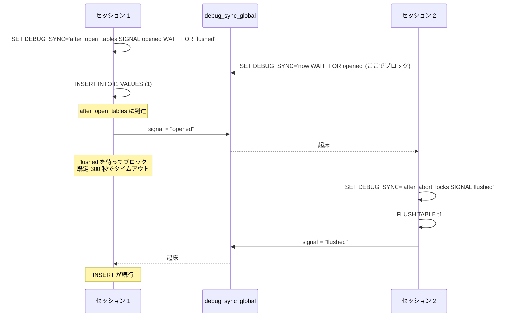

> **前提**: [ディレクトリ地図](./directory-map/)

## 何を学んだか

この章のページで引いてきた `ut_ad` や `DBUG_PRINT` や `DEBUG_SYNC` は、**あなたが本番で動かしているバイナリには 1 行も入っていない**。

```cpp title="storage/innobase/include/ut0dbg.h"
#ifdef UNIV_DEBUG
/** Debug assertion. Does nothing unless UNIV_DEBUG is defined. */
#define ut_ad(EXPR) ut_a(EXPR)
...
#else
/** Debug assertion. Does nothing unless UNIV_DEBUG is defined. */
#define ut_ad(EXPR)
```

**release と debug は同じソースから作られた別のプログラムだ。** 「不変条件は `ut_ad` で守られている」とこの章で何度も書いたが、正確には「debug ビルドでだけ実行時に検査され、release ビルドでは開発時の検査を通過したという事実だけが残る」ということになる。ソースを読んで挙動を確かめたいなら、debug ビルドを自分で作る必要がある。

`-DWITH_DEBUG=1` が実際に切り替えるのは 5 つで、それぞれ別の場所で定義されている。

| 切り替わるもの                                       | どこで                                | 何が変わるか                                                |
| ---------------------------------------------------- | ------------------------------------- | ----------------------------------------------------------- |
| `NDEBUG` が付かない                                  | `CMAKE_BUILD_TYPE=Debug` の既定フラグ | `assert` と DBUG マクロ群が実体を持つ                       |
| `UNIV_DEBUG`                                         | `storage/innobase/innodb.cmake`       | InnoDB の `ut_ad` / `ut_d` が有効になる                     |
| `ENABLED_DEBUG_SYNC`                                 | トップの `CMakeLists.txt`             | `DEBUG_SYNC` マクロと `debug_sync` システム変数が有効になる |
| `SAFE_MUTEX`                                         | 同上                                  | mutex の二重ロックなどを実行時に検査する                    |
| `WITH_HYPERGRAPH_OPTIMIZER` / `WITH_SHOW_PARSE_TREE` | トップの `CMakeLists.txt`             | debug ビルドでのみ既定 ON                                   |

最後の 1 行は運用上いちばん引っかかる。[hypergraph オプティマイザ](./hypergraph-optimizer/)を `optimizer_switch` で ON にしようとして `ER_HYPERGRAPH_NOT_SUPPORTED_YET` が返るのも、[`SHOW PARSE_TREE`](./parse-tree-and-contextualize/) が構文エラーになるのも、**バイナリの種類が違うから**であってバージョンの問題ではない。

## なぜそうなっているか

**`ut_ad` が release で消えるのは、InnoDB の不変条件の検査が高すぎるからだ。** [`buf_page_get_gen`](./buffer-pool-walkthrough/) や [`btr_cur_search_to_nth_level`](./btree-operations/) の中の `ut_ad` は、latch を持っているか・ページのヘッダが整合しているか・ヒープ番号が範囲内かといったことを毎回検査する。これを本番で回すと数割単位で遅くなる。**そのかわり、debug ビルドは「壊れた瞬間に止まる」プログラムになる。** 本番で `Assertion failure` を見ることが稀なのは、こうした検査が debug ビルドと MTR の中で先に発火しているからだ。

**DBUG が gdb で代替されずに残っているのは、gdb では追えないものがあるからだ。** サーバは接続ごとにスレッドを作る ([スレッドモデル](./thread-model/))。数百本のスレッドの中の 1 本を止めると、そのスレッドが握った latch でほかの全部が止まり、観測したい現象そのものが消える。DBUG は止めずにテキストを吐くので、**タイミングに依存する現象を壊さずに観測できる**。逆に、状態をじっくり見たいときは gdb が向く。用途が違う。

**Debug Sync が「テスト用の同期点」ではなく「サーバの機能」として実装されているのは、テストから制御する必要があるからだ。** ソース中に条件変数を仕込むだけなら `#ifdef` で足りる。しかし MTR のテストは SQL しか書けないので、**SQL から任意の同期点に行動を割り当てられる**必要がある。だから `debug_sync` はシステム変数になり、`SET` 文で文字列をパースして `THD` に行動を積む形になった。[デッドロック](./deadlock-detection/)や[オンライン DDL の row log](./online-index-build-row-log/) のような、本来は再現性のない現象をテストで固定できるのはこの設計のおかげだ。

**`--debug-sync-timeout` という二重のスイッチがあるのは、debug ビルドでも既定では無効にしたいからだ。** `DEBUG_SYNC` マクロは `opt_debug_sync_timeout` を先に見るので、無効時のコストはグローバル変数 1 個の読み出しで済む。debug ビルドは MTR 以外でも日常的に使われるので、**「コンパイルはされているが動かない」という状態が必要**だった。

**初期化 SQL をバイナリに埋め込むのは、`--initialize` が「まだ何もない状態」で走るからだ。** データディレクトリもテーブルも `mysql` スキーマもない時点で、外部の `.sql` ファイルを探しに行くと、パス解決の失敗という新しい失敗モードが増える。**バイナリに入っていれば、バイナリとスキーマ定義のバージョンが食い違うこともない。**

## ソースコードのどこか

### `WITH_DEBUG` は `CMAKE_BUILD_TYPE` の別名

[`CMakeLists.txt#L123`](https://github.com/mysql/mysql-server/blob/mysql-8.4.11/CMakeLists.txt#L123) で `OPTION(WITH_DEBUG "Use dbug/safemutex" OFF)` と宣言され、[L164](https://github.com/mysql/mysql-server/blob/mysql-8.4.11/CMakeLists.txt#L164) で `CMAKE_BUILD_TYPE` に翻訳される。

```cmake title="CMakeLists.txt"
IF(WITH_DEBUG)
  SET(CMAKE_BUILD_TYPE "Debug" CACHE STRING ${BUILDTYPE_DOCSTRING} FORCE)
  SET(OLD_WITH_DEBUG 1 CACHE INTERNAL "" FORCE)
ELSEIF(NOT HAVE_CMAKE_BUILD_TYPE OR OLD_WITH_DEBUG)
```

明示しなければ `RelWithDebInfo` になる。**つまり既定のビルドにもシンボルは入っている**ので、`ut_ad` を諦めてよいならリリース相当のバイナリでもスタックは読める。

デバッグ専用のマクロは `Debug` 構成のフラグに後付けされる。[`CMakeLists.txt#L1519`](https://github.com/mysql/mysql-server/blob/mysql-8.4.11/CMakeLists.txt#L1519):

```cmake title="CMakeLists.txt"
FOREACH(LANG C CXX)
  STRING_PREPEND(CMAKE_${LANG}_FLAGS_DEBUG "-DENABLED_DEBUG_SYNC ")
  STRING_PREPEND(CMAKE_${LANG}_FLAGS_DEBUG "-DSAFE_MUTEX ")
ENDFOREACH()
```

InnoDB 側は自前で足す。[`storage/innobase/innodb.cmake#L88`](https://github.com/mysql/mysql-server/blob/mysql-8.4.11/storage/innobase/innodb.cmake#L88) の 1 行が `ut_ad` の生死を決めている。`-DWITH_INNODB_EXTRA_DEBUG=1` を足すとさらに `UNIV_AHI_DEBUG` / `UNIV_DDL_DEBUG` / `UNIV_DEBUG_FILE_ACCESSES` / `UNIV_ZIP_DEBUG` が乗る ([L90](https://github.com/mysql/mysql-server/blob/mysql-8.4.11/storage/innobase/innodb.cmake#L90))。[adaptive hash index](./adaptive-hash-index/) の整合性を疑うときはこれを入れる。

hypergraph と `SHOW PARSE_TREE` の既定値は [`CMakeLists.txt#L2235`](https://github.com/mysql/mysql-server/blob/mysql-8.4.11/CMakeLists.txt#L2235) と [L2246](https://github.com/mysql/mysql-server/blob/mysql-8.4.11/CMakeLists.txt#L2246) で、どちらも同じ条件式を書いている。

```cmake title="CMakeLists.txt"
# The hypergraph optimizer is default on only for debug builds.
IF(CMAKE_BUILD_TYPE_UPPER STREQUAL "DEBUG" OR WITH_DEBUG)
  SET(WITH_HYPERGRAPH_OPTIMIZER_DEFAULT ON)
```

### `INFO_SRC` はツリーになく、cmake が作る

ソースツリーを探しても `INFO_SRC` は見つからない。[`cmake/info_src.cmake`](https://github.com/mysql/mysql-server/blob/mysql-8.4.11/cmake/info_src.cmake) が `CREATE_INFO_SRC(${CMAKE_BINARY_DIR}/Docs)` を呼んでビルドディレクトリに生成する。ファイル冒頭のコメントが目的をそのまま書いている。

```cmake title="cmake/info_src.cmake"
# The sole purpose of this cmake control file is to create the "INFO_SRC" file.
```

`cmake ; make ; git pull ; make` という順序でもコミットハッシュが正しくなるように、`make` フェーズ用の独立したターゲットとして切り出してある。**「このバイナリはどのコミットから作ったか」を確かめたいときは、ソースディレクトリではなくビルドディレクトリの `Docs/INFO_SRC` を見る。**

### DBUG — 1989 年から入っている実行時トレース

`mysys/dbug.cc` は 2191 行で、ファイル冒頭に `@(#)dbug.c 1.25 7/25/89` という SCCS の ID が残っている。Fred Fish の dbug パッケージがそのまま生き延びたものだ。

使う側のマクロは [`include/my_dbug.h`](https://github.com/mysql/mysql-server/blob/mysql-8.4.11/include/my_dbug.h) にある。中心は `DBUG_TRACE` で、実体は RAII のヘルパクラスだ ([L118](https://github.com/mysql/mysql-server/blob/mysql-8.4.11/include/my_dbug.h#L118))。

```cpp title="include/my_dbug.h"
#define DBUG_TRACE \
  const AutoDebugTrace _db_trace(DBUG_PRETTY_FUNCTION, __FILE__, __LINE__)
```

コンストラクタが `_db_enter_`、デストラクタが `_db_return_` を呼ぶので、**関数の先頭に 1 行置くだけで入退出がトレースに載る**。旧来の `DBUG_ENTER` / `DBUG_RETURN` のペアも残っているが、新しいコードは `DBUG_TRACE` を使う。

`NDEBUG` が定義された release ビルドでは、同じファイルの [L231](https://github.com/mysql/mysql-server/blob/mysql-8.4.11/include/my_dbug.h#L231) 以降の分岐が採用され、全部が空マクロになる。

```cpp title="include/my_dbug.h"
#else /* No debugger */
#define DBUG_TRACE \
  do {             \
  } while (false)
```

制御文字列を解釈するのは [`mysys/dbug.cc#L439`](https://github.com/mysql/mysql-server/blob/mysql-8.4.11/mysys/dbug.cc#L439) の `DbugParse` で、`:` 区切りの 1 文字コマンドを順に処理する。よく使うものだけ挙げる。

| 文字      | 意味                                          | 実装                                                                               |
| --------- | --------------------------------------------- | ---------------------------------------------------------------------------------- |
| `d`       | キーワードを有効にする (引数なしで全部)       | [L519](https://github.com/mysql/mysql-server/blob/mysql-8.4.11/mysys/dbug.cc#L519) |
| `t`       | 関数の入退出をトレース (引数は深さ、既定 200) | [L641](https://github.com/mysql/mysql-server/blob/mysql-8.4.11/mysys/dbug.cc#L641) |
| `i`       | 各行にプロセス ID を付ける                    | [L573](https://github.com/mysql/mysql-server/blob/mysql-8.4.11/mysys/dbug.cc#L573) |
| `o` / `O` | 出力先ファイル (`O` は 1 行ごとに flush)      | [L598](https://github.com/mysql/mysql-server/blob/mysql-8.4.11/mysys/dbug.cc#L598) |
| `f`       | 関数名で絞り込む                              | [L553](https://github.com/mysql/mysql-server/blob/mysql-8.4.11/mysys/dbug.cc#L553) |
| `T`       | タイムスタンプを付ける                        | [L658](https://github.com/mysql/mysql-server/blob/mysql-8.4.11/mysys/dbug.cc#L658) |

したがって定番の `--debug=d:t:i:o,/tmp/mysqld.trace` は「全キーワード有効・関数トレース ON・PID 付き・`/tmp/mysqld.trace` へ出力」を意味する。**サーバ全体で有効にすると出力が凄まじい量になる**ので、実用上は `d,keyword` でキーワードを絞るか、セッション単位で入れる。

セッション単位で入れられるのは `debug` がシステム変数として登録されているからだ ([`sql/sys_vars.cc#L2038`](https://github.com/mysql/mysql-server/blob/mysql-8.4.11/sql/sys_vars.cc#L2038))。

```sql
SET SESSION debug = '+d,keyword';
-- 調べたい文を実行
SET SESSION debug = '-d,keyword';
```

### `DBUG_EXECUTE_IF` + `DEBUG_SYNC` — 競合状態を手で再現する

デバッグ用のキーワードは、出力するだけでなく**コードの分岐にも使われる**。[L171](https://github.com/mysql/mysql-server/blob/mysql-8.4.11/include/my_dbug.h#L171):

```cpp title="include/my_dbug.h"
#define DBUG_EXECUTE_IF(keyword, a1)           \
  do {                                         \
    if (_db_keyword_(nullptr, (keyword), 1)) { \
      a1                                       \
    }                                          \
  } while (0)
```

これ単体では「特定の条件でエラーを注入する」程度のことしかできない。強力になるのは Debug Sync と組み合わせたときだ。

`DEBUG_SYNC` はソース中の名前付き地点で、**シグナルを出す・シグナルを待つ**の 2 つを行う ([`sql/debug_sync.h#L47`](https://github.com/mysql/mysql-server/blob/mysql-8.4.11/sql/debug_sync.h#L47))。

```cpp title="sql/debug_sync.h"
#define DEBUG_SYNC(_thd_, _sync_point_name_)                 \
  do {                                                       \
    if (unlikely(opt_debug_sync_timeout))                    \
      debug_sync(_thd_, STRING_WITH_LEN(_sync_point_name_)); \
  } while (0)
```

各地点は既定では不活性で、SQL で行動を割り当てたときだけ起動する。文法は [`sql/debug_sync.cc#L176`](https://github.com/mysql/mysql-server/blob/mysql-8.4.11/sql/debug_sync.cc#L176) に形式的に書いてある。

```text
{RESET |
 <sync point name> TEST |
 <sync point name> CLEAR |
 <sync point name> {{SIGNAL <signal name>[, <signal name>]* |
                     WAIT_FOR <signal name> [TIMEOUT <seconds>]
                     [NO_CLEAR_EVENT]}
                    [EXECUTE <count>] &| HIT_LIMIT <count>}}
```

`now` という特別な地点名を使うと、**その `SET` 文自体が実行された瞬間**にシグナルを出したり待ったりできる。これで 2 つのセッションの実行順序を任意に組める。

```sql
-- セッション 1
SET DEBUG_SYNC = 'after_open_tables SIGNAL opened WAIT_FOR flushed';
INSERT INTO t1 VALUES (1);   -- ここで止まる

-- セッション 2
SET DEBUG_SYNC = 'now WAIT_FOR opened';
SET DEBUG_SYNC = 'after_abort_locks SIGNAL flushed';
FLUSH TABLE t1;
```

**この機構は debug ビルドでもさらに明示的に有効化しないと動かない。** `--debug-sync-timeout` を指定しないと `opt_debug_sync_timeout` が 0 のままで、`DEBUG_SYNC` マクロは即座に抜ける ([`debug_sync.cc#L200`](https://github.com/mysql/mysql-server/blob/mysql-8.4.11/sql/debug_sync.cc#L200))。既定の待ち時間は 300 秒 ([`debug_sync.h#L57`](https://github.com/mysql/mysql-server/blob/mysql-8.4.11/sql/debug_sync.h#L57))。MTR は既定で有効にしてくれる ([MTR のページ](./mtr-and-unit-tests/))。

2 つを合成する定型が `DBUG_SIGNAL_WAIT_FOR` として用意されている ([`debug_sync.h#L76`](https://github.com/mysql/mysql-server/blob/mysql-8.4.11/sql/debug_sync.h#L76))。

```cpp title="sql/debug_sync.h"
#define DBUG_SIGNAL_WAIT_FOR(T, A, B, C)                     \
  DBUG_EXECUTE_IF(A, {                                       \
    const char act[] = "now SIGNAL " B " WAIT_FOR " C;       \
    assert(!debug_sync_set_action(T, STRING_WITH_LEN(act))); \
  };)
```

`SET SESSION debug='+d,A'` でキーワード `A` を立てておくと、その地点に来たスレッドがシグナル `B` を出して `C` を待つ。**「同期点がソースに書かれていない場所」でも、DBUG キーワードさえ埋まっていれば同期を差し込める**というのがこの合成の狙いだ。

今どのシグナルが立っているかは `SELECT @@DEBUG_SYNC` で読める。

2 セッションで順序を固定するときの往復はこうなる。**`now` の `SET` 文自体がブロックする**のが要点で、これがあるから「相手が特定の地点に到達するまで待つ」が SQL で書ける。



### `--initialize` の SQL はバイナリに埋め込まれている

デバッグ用のデータディレクトリは `mysqld --initialize-insecure --datadir=...` で作る。このとき実行される SQL は外部ファイルではなく**バイナリの中の文字列配列**だ。

`scripts/comp_sql.cc` (185 行) は「SQL ファイルを C のファイルに変換する」だけのビルド用ツールで、[`scripts/CMakeLists.txt#L28`](https://github.com/mysql/mysql-server/blob/mysql-8.4.11/scripts/CMakeLists.txt#L28) でビルドされ、[L100](https://github.com/mysql/mysql-server/blob/mysql-8.4.11/scripts/CMakeLists.txt#L100) 以降で各 `.sql` に適用される。

```cmake title="scripts/CMakeLists.txt"
ADD_CUSTOM_COMMAND(
  OUTPUT ${CMAKE_CURRENT_BINARY_DIR}/sql_commands_system_tables.h
  COMMAND comp_sql
  mysql_system_tables
  ${CMAKE_CURRENT_SOURCE_DIR}/mysql_system_tables.sql
  sql_commands_system_tables.h
```

生成されたヘッダは [`sql/sql_initialize.cc#L43`](https://github.com/mysql/mysql-server/blob/mysql-8.4.11/sql/sql_initialize.cc#L43) で include され、実行順序が [L75](https://github.com/mysql/mysql-server/blob/mysql-8.4.11/sql/sql_initialize.cc#L75) の配列で決まる。

```cpp title="sql/sql_initialize.cc"
static const char **cmds[] = {initialization_cmds, mysql_system_tables,
                              initialization_data, mysql_system_data,
                              fill_help_tables,    mysql_system_users,
                              mysql_sys_schema,    nullptr};
```

`mysql.user` や [データディクショナリ](./data-dictionary/)のテーブル定義、[`sys` スキーマのビュー](./data-locks-and-sys-schema/)がどう作られるかを知りたければ、`scripts/mysql_system_tables.sql` と `scripts/sys_schema/` を読めばよい。**`--initialize-insecure` と `--initialize` の差はこの配列の 1 要素だけ**で、[L144](https://github.com/mysql/mysql-server/blob/mysql-8.4.11/sql/sql_initialize.cc#L144) が `insert_user_buffer` に入れる文字列を切り替えている (パスワードなしか、生成したランダムパスワードか)。

### 置くと有用なブレークポイント

この章の各層に 1 つずつ対応させると、SQL 1 本の経路をデバッガで縦に降りられる。

| ブレークポイント                                                                                                                | 層                                         | 対応するページ                                                                      |
| ------------------------------------------------------------------------------------------------------------------------------- | ------------------------------------------ | ----------------------------------------------------------------------------------- |
| [`dispatch_sql_command`](https://github.com/mysql/mysql-server/blob/mysql-8.4.11/sql/sql_parse.cc#L5275)                        | テキストプロトコルを受けてから構文解析まで | [パーサとリゾルバ](./parser-walkthrough/)                                           |
| [`JOIN::optimize`](https://github.com/mysql/mysql-server/blob/mysql-8.4.11/sql/sql_optimizer.cc#L362)                           | 最適化の全段階の入口                       | [JOIN::optimize の段階](./optimizer-walkthrough/)                                   |
| [`ha_innobase::write_row`](https://github.com/mysql/mysql-server/blob/mysql-8.4.11/storage/innobase/handler/ha_innodb.cc#L9250) | Server → InnoDB の書き込み境界             | [handler](./handler-walkthrough/) / [行フォーマット変換](./row-format-conversion/)  |
| [`row_search_mvcc`](https://github.com/mysql/mysql-server/blob/mysql-8.4.11/storage/innobase/row/row0sel.cc#L4420)              | 読み取りの本体。版の選択もここ             | [read view と可視性](./read-view-and-visibility/)                                   |
| [`lock_rec_lock`](https://github.com/mysql/mysql-server/blob/mysql-8.4.11/storage/innobase/lock/lock0lock.cc#L1878)             | 行ロックの取得                             | [ロックの種類](./lock-modes-and-types/) / [デッドロック検出](./deadlock-detection/) |
| [`MYSQL_BIN_LOG::ordered_commit`](https://github.com/mysql/mysql-server/blob/mysql-8.4.11/sql/binlog.cc#L8924)                  | コミットの 5 段パイプライン                | [2PC とグループコミット](./two-phase-commit-and-group-commit/)                      |

`lock_rec_lock` は `static` 関数なので、シンボル名で引けないときは `break lock0lock.cc:1878` のようにファイルと行で置く。同じ理由で、[`MaterializeIterator`](./materialization-and-temptable/) のように無名名前空間に隠された型のメソッドも名前では引きにくい。

`ha_innobase::write_row` に素朴にブレークポイントを置くと、起動時のデータディクショナリ初期化で何度も止まる。**接続を確立してからアタッチする**か、`thread` 条件を付ける。

## どう活かすか

**まず debug ビルドを 1 つ持っておく。** この章の記述を自分で確かめたいなら、これがないと始まらない。

```sh
cmake .. -DWITH_DEBUG=1 -DWITH_BOOST=... -DCMAKE_BUILD_TYPE=Debug
make -j
```

**debug ビルドを本番と混同しない。** `SELECT VERSION()` に `-debug` が付く。MTR の `include/have_debug.inc` がやっている判定と同じだ。

```sql
SELECT VERSION() LIKE '%debug%';
```

**再現しない競合状態を追うときは、まず「その 2 つの操作の間に同期点があるか」を grep する。** `git grep 'DEBUG_SYNC(thd' sql/` や `git grep DEBUG_SYNC storage/innobase/` で出てくる名前が、そのまま `SET DEBUG_SYNC` で使える地点名になる。既存の MTR テストに同じ地点を使ったものがあれば、それが再現手順の雛形になる ([MTR のページ](./mtr-and-unit-tests/))。

**「エラーパスが通っているか」を確かめたいときは、DBUG キーワードでエラーを注入する。** `git grep DBUG_EXECUTE_IF sql/binlog.cc` のように読むと、[binlog のクラッシュ耐性](./crash-safe-replication-and-until/)がどの地点でのクラッシュを想定しているかが分かる。キーワード名がそのまま「開発者が心配した地点の一覧」になっている。

**本番のスタックトレースを読むときは、`RelWithDebInfo` でも十分だということを覚えておく。** 既定のビルドはシンボルを持つので、`Assertion failure` やシグナルのときにエラーログに出るスタックは関数名まで解決される。`ut_ad` が消えているだけで、`ut_a` (常時有効な assert) と `ut_error` は release でも発火する。**エラーログに `InnoDB: Assertion failure in file ... line ...` が出たら、そのファイルと行を 8.4.11 のタグで開けば何を検査していたか読める。**

**DBUG のトレースは、経路が分からないときの最後の手段として使う。** 「この設定を変えたのにコードが通っていない気がする」というときに、対象の関数だけ `--debug=d,keyword:f,function_name:t:o,/tmp/t.trace` で絞る。全体を有効にすると数分で GB 単位になるので、必ず `f` か `d` で絞る。

**hypergraph や `SHOW PARSE_TREE` を試したいだけなら、debug ビルドが唯一の手段だ。** 8.4 の release バイナリではどうやっても有効にできない。`optimizer_switch` に `hypergraph_optimizer=on` を書いても [`ER_HYPERGRAPH_NOT_SUPPORTED_YET`](./hypergraph-optimizer/) が返る。
