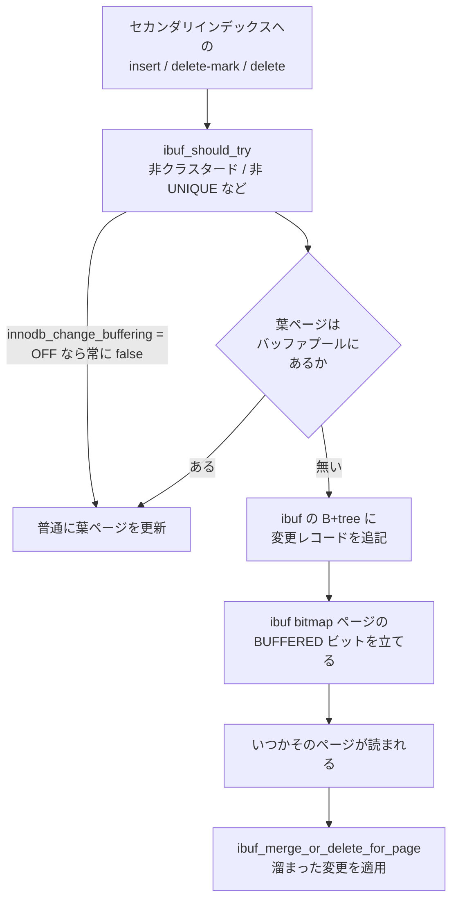

## 何を学んだか

`t (id PK, email, created_at)` の `created_at` にインデックスがあるとする。`INSERT` すると、クラスタードインデックスに 1 行入れるほかに、`created_at` のセカンダリインデックスの葉ページも 1 枚更新しなければならない。`created_at` がランダムな値なら、その葉ページはバッファプールに載っていない可能性が高い。**1 行の挿入のために 16KB のランダム読み込みが 1 回入る。**

change buffer (旧名 insert buffer、コード上は今も `ibuf`) は、この読み込みを省く仕組みだ。**葉ページがバッファプールに無いとき、ページを読まずに「このページにこういう変更をした」というレコードを別の B+tree に書いておく。** そのページが後で何かの理由で読まれたとき、溜まっていた変更をまとめて適用する。ランダム読み書き 1 回を、シーケンシャルな追記 1 回に置き換えている。

**そして 8.4 では既定で無効になっている。**

```cpp title="storage/innobase/handler/ha_innodb.cc (L23207)"
static MYSQL_SYSVAR_ENUM(
    change_buffering, innodb_change_buffering, PLUGIN_VAR_RQCMDARG,
    "Buffer changes to reduce random access:"
    " OFF (default), ON, inserting, deleting, changing, or purging.",
    nullptr, nullptr, IBUF_USE_NONE, &innodb_change_buffering_typelib);
```

既定値の引数が `IBUF_USE_NONE` になっている。ただし**コード上に deprecated のマークは一切無い。** `ibuf0ibuf.cc` は 4561 行あり、`ibuf_insert` も `ibuf_merge_or_delete_for_page` も生きていて、`innodb_change_buffering = all` にすればそのまま動く。「消された機能」ではなく「既定を反転させた機能」だ。

この差は運用上そこそこ大きい。**8.0 時代に書かれた「`innodb_change_buffer_max_size` を調整する」「`Ibuf: size` を監視する」といったチューニング記事は、8.4 の既定構成にはそのまま当てはまらない。** 見るべき値は常に 0 のままになる。



## ソースコードのどこか

### 入口は B+tree 探索の中にある

change buffer は独立した層ではなく、**B+tree を降りる関数の中に埋め込まれている**。[`btr0cur.cc#L946`](https://github.com/mysql/mysql-server/blob/mysql-8.4.11/storage/innobase/btr/btr0cur.cc#L946) が判断する。

```cpp title="storage/innobase/btr/btr0cur.cc"
    if (btr_op != BTR_NO_OP &&
        ibuf_should_try(index, btr_op != BTR_INSERT_OP)) {
      /* Try to buffer the operation if the leaf
      page is not in the buffer pool. */

      fetch = btr_op == BTR_DELETE_OP ? Page_fetch::IF_IN_POOL_OR_WATCH
                                      : Page_fetch::IF_IN_POOL;
    }
```

**ページ取得のモードを `IF_IN_POOL` に変えるだけ**というのが巧い。`buf_page_get_gen` はバッファプールに無ければ `nullptr` を返して I/O を出さない。呼び出し側は `block == nullptr` を「ページが載っていなかった」と読み替えて、change buffer に回す。

```cpp title="storage/innobase/btr/btr0cur.cc (L965)"
  if (block == nullptr) {
    /* This must be a search to perform an insert/delete
    mark/ delete; try using the insert/delete buffer */

    ut_ad(height == 0);
```

条件を判定する [`ibuf_should_try` (`ibuf0ibuf.ic#L116`)](https://github.com/mysql/mysql-server/blob/mysql-8.4.11/storage/innobase/include/ibuf0ibuf.ic#L116) が、この機構の適用範囲そのものだ。

```cpp title="storage/innobase/include/ibuf0ibuf.ic"
  return (innodb_change_buffering != IBUF_USE_NONE && ibuf->max_size != 0 &&
          index->space != dict_sys_t::s_dict_space_id &&
          !index->is_clustered() && !dict_index_is_spatial(index) &&
          !dict_index_has_desc(index) &&
          index->table->quiesce == QUIESCE_NONE &&
          (ignore_sec_unique || !dict_index_is_unique(index)) &&
          srv_force_recovery < SRV_FORCE_NO_IBUF_MERGE);
```

読み取れる制約が並んでいる。

- **クラスタードインデックスは対象外。** 主キーへの挿入は必ずページを読む
- **UNIQUE なセカンダリインデックスへの `INSERT` は対象外。** 重複検査にページの中身が要るからだ。ただし `ignore_sec_unique` が立つ delete-mark / delete では UNIQUE でも buffer できる
- **降順インデックス (`DESC`) と空間インデックスは対象外**
- 第 1 引数が `IBUF_USE_NONE` を弾く。**8.4 の既定ではここで必ず false になり、以降の経路は一切通らない**

### `ibuf_use_t` — ON/OFF ではなく 6 段階

[`storage/innobase/include/ibuf0ibuf.h#L63`](https://github.com/mysql/mysql-server/blob/mysql-8.4.11/storage/innobase/include/ibuf0ibuf.h#L63)。

```cpp title="storage/innobase/include/ibuf0ibuf.h"
enum ibuf_use_t {
  IBUF_USE_NONE = 0,
  IBUF_USE_INSERT,             /* insert */
  IBUF_USE_DELETE_MARK,        /* delete */
  IBUF_USE_INSERT_DELETE_MARK, /* insert+delete */
  IBUF_USE_DELETE,             /* delete+purge */
  IBUF_USE_ALL                 /* insert+delete+purge */
};
```

SQL 側の名前 (`none` / `inserts` / `deletes` / `changes` / `purges` / `all`) との対応がややこしい。`deletes` は「delete-mark を buffer する」で、`purges` は「purge による物理削除も buffer する」だ。**`delete` という語が 2 種類の操作を指している**ことが分かっていないと、この enum は読めない。

[`ibuf_insert` (`ibuf0ibuf.cc#L3284`)](https://github.com/mysql/mysql-server/blob/mysql-8.4.11/storage/innobase/ibuf/ibuf0ibuf.cc#L3284) が、操作の種類 × 設定値の二重 switch でこれを解く。

```cpp title="storage/innobase/ibuf/ibuf0ibuf.cc"
    case IBUF_OP_DELETE_MARK:
      switch (use) {
        case IBUF_USE_NONE:
        case IBUF_USE_INSERT:
          return false;
        case IBUF_USE_DELETE_MARK:
        case IBUF_USE_DELETE:
        case IBUF_USE_INSERT_DELETE_MARK:
        case IBUF_USE_ALL:
          ut_ad(!no_counter);
          goto check_watch;
      }
      break;
```

`check_watch` というラベルに飛ぶのが、この機構の複雑さの入口だ。

```cpp title="storage/innobase/ibuf/ibuf0ibuf.cc"
check_watch:
  /* If a thread attempts to buffer an insert on a page while a
  purge is in progress on the same page, the purge must not be
  buffered, because it could remove a record that was
  re-inserted later.  For simplicity, we block the buffering of
  all operations on a page that has a purge pending.
```

**purge と change buffer が同じページを狙うと順序が壊れる**ので、バッファプールに「watch」という擬似ページを置いて監視している。バッファプールの sentinel 機構 (`buf_pool_watch_set`) は、change buffer のためだけに存在する。

### `ibuf` bitmap ページ — 「このページには変更が溜まっている」

各エクステント群の先頭に、専用のページ型が置かれている ([`fil0fil.h#L1274`](https://github.com/mysql/mysql-server/blob/mysql-8.4.11/storage/innobase/include/fil0fil.h#L1274))。

```cpp title="storage/innobase/include/fil0fil.h"
constexpr page_type_t FIL_PAGE_IBUF_BITMAP = 5;
```

1 ページあたり 4 ビットで、うち 3 つに意味がある ([`ibuf0ibuf.cc#L240`](https://github.com/mysql/mysql-server/blob/mysql-8.4.11/storage/innobase/ibuf/ibuf0ibuf.cc#L240))。

```cpp title="storage/innobase/ibuf/ibuf0ibuf.cc"
/** @name Offsets to the per-page bits in the insert buffer bitmap */
/** @{ */
/** Bits indicating the amount of free space */
constexpr uint32_t IBUF_BITMAP_FREE = 0;
/** true if there are buffered changes for the page */
constexpr uint32_t IBUF_BITMAP_BUFFERED = 2;
/** true if page is a part of  the ibuf tree, excluding the root page, or is in
 the free list of the ibuf */
constexpr uint32_t IBUF_BITMAP_IBUF = 3;
/** @} */
```

`IBUF_BITMAP_FREE` が 2 ビットで「そのページにどれくらい空きがあるか」を粗く持つ。**ページを読まずに buffer してよいか判断するには、そのページに空きがあることを知っている必要がある**からだ。この 2 ビットを最新に保つために、B+tree 側は葉ページを更新するたびに `ibuf_update_free_bits_if_full` や `ibuf_reset_free_bits` を呼ぶ。`btr0cur.cc` に `ibuf_` で始まる呼び出しが散らばっているのは、この維持コストである。

**つまり change buffer は、使っていなくても B+tree のコードに痕跡を残す。** これが「複雑さだけが残る」の実体だ。

### merge — 読んだときと、暇なとき

溜まった変更を適用する [`ibuf_merge_or_delete_for_page` (`ibuf0ibuf.cc#L3962`)](https://github.com/mysql/mysql-server/blob/mysql-8.4.11/storage/innobase/ibuf/ibuf0ibuf.cc#L3962) は、3 か所から呼ばれる。

1. **ページの読み込みが完了したとき** — [`buf0buf.cc#L5975`](https://github.com/mysql/mysql-server/blob/mysql-8.4.11/storage/innobase/buf/buf0buf.cc#L5975)。leaf の `FIL_PAGE_INDEX` に限る
2. **read-ahead でページを持ってきたとき** — [`buf0rea.cc#L638`](https://github.com/mysql/mysql-server/blob/mysql-8.4.11/storage/innobase/buf/buf0rea.cc#L638)
3. **テーブルスペースが消えていたとき** — 同じ関数が「適用」ではなく「破棄」として働く

そして背景では master thread が [`ibuf_merge_in_background` (`ibuf0ibuf.cc#L2399`)](https://github.com/mysql/mysql-server/blob/mysql-8.4.11/storage/innobase/ibuf/ibuf0ibuf.cc#L2399) を毎秒呼ぶ。

```cpp title="storage/innobase/ibuf/ibuf0ibuf.cc"
  if (full) {
    /* Caller has requested a full batch */
    n_pages = PCT_IO(100);
  } else {
    /* By default we do a batch of 5% of the io_capacity */
    n_pages = PCT_IO(5);
```

`full` の値は master thread が active か idle かで決まる。active なら `innodb_io_capacity` の 5%、idle なら 100% ([スレッド一覧のページ](./innodb-threads-walkthrough/))。**8.4 の既定では merge するものが無いので、この呼び出しは毎秒空振りしている。**

### 観測はどこから取るか

`SHOW ENGINE INNODB STATUS` に専用セクションがある ([`srv0srv.cc#L1441`](https://github.com/mysql/mysql-server/blob/mysql-8.4.11/storage/innobase/srv/srv0srv.cc#L1441))。

```cpp title="storage/innobase/srv/srv0srv.cc"
  fputs(
      "-------------------------------------\n"
      "INSERT BUFFER AND ADAPTIVE HASH INDEX\n"
      "-------------------------------------\n",
      file);
  ibuf_print(file);
```

[`ibuf_print` (`ibuf0ibuf.cc#L4378`)](https://github.com/mysql/mysql-server/blob/mysql-8.4.11/storage/innobase/ibuf/ibuf0ibuf.cc#L4378) が出す行はこの形をしている。

```
Ibuf: size 1, free list len 0, seg size 2, 0 merges
merged operations:
 insert 0, delete mark 0, delete 0
discarded operations:
 insert 0, delete mark 0, delete 0
```

**`size 1` / `seg size 2` は空の状態の値**で、ibuf の B+tree は無効でも 1 ページ確保されている。`0 merges` が続いているなら change buffer は使われていない。

**注意すべきは、`Innodb_ibuf_*` というステータス変数は upstream の MySQL には存在しないことだ。** `innodb_status_variables[]` ([`ha_innodb.cc#L1124`](https://github.com/mysql/mysql-server/blob/mysql-8.4.11/storage/innobase/handler/ha_innodb.cc#L1124)) に `ibuf` で始まるエントリは 1 つも無い。`SHOW STATUS LIKE 'Innodb_ibuf%'` が空を返すのは 8.4 でそうなったからではなく、**元々 Percona Server の拡張だった**からだ。8.0 からの移行で「消えた」と勘違いしやすい。

upstream で機械的に取れるのは `INNODB_METRICS` の `change_buffer` モジュールになる ([`srv0mon.cc#L1139`](https://github.com/mysql/mysql-server/blob/mysql-8.4.11/storage/innobase/srv/srv0mon.cc#L1139))。

```sql
SELECT name, count, status FROM information_schema.INNODB_METRICS
 WHERE subsystem = 'change_buffer';
```

`ibuf_merges`、`ibuf_merges_insert`、`ibuf_merges_delete_mark`、`ibuf_merges_delete`、`ibuf_size` などが並ぶ ([INNODB_METRICS のページ](./innodb-stats-and-metrics/))。

## なぜそうなっているか

**change buffer が生まれた前提は「ランダム読み込みが桁違いに高い」だった。** 回転するディスクでは、シーケンシャル書き込み 1 回とランダム読み込み 1 回のコスト差が 100 倍あった。1 行の `INSERT` のためにセカンダリインデックスの葉を 1 枚読むのは、割に合わない支出だった。だから「読まずに済ませて、後でまとめる」に大きな価値があった。

**SSD ではその前提が崩れる。** ランダム読み込みとシーケンシャル読み込みの差は数倍で、しかも NVMe では並列度でさらに埋まる。一方で change buffer が払うコストは変わらない。

- ibuf 用の B+tree への挿入 (それ自体がランダム書き込みを含む)
- bitmap ページの更新と、それを最新に保つための B+tree 側の呼び出し
- purge との競合を避ける buffer pool watch
- ページを読むたびに「変更が溜まっていないか」を確認する分岐
- **クラッシュリカバリで、redo を当てた後に ibuf の中身も整合させる必要がある**

最後の項目が効いている。`ibuf_should_try` に `srv_force_recovery < SRV_FORCE_NO_IBUF_MERGE` が入っているのは、**ibuf の merge がリカバリを壊しうる**ことを認めた条件だ。`innodb_force_recovery = 4` (`SRV_FORCE_NO_IBUF_MERGE`) という段が存在すること自体が、この機構が過去に何度もリカバリ時の問題の震源になったことを示している。

**「効果が縮み、複雑さが残った」** ときに取れる選択は 2 つある。消すか、既定を反転させるか。MySQL は後者を取った。回転ディスク上の巨大なテーブルという構成は今も存在するし、コードを消せば戻せない。既定を `NONE` にしておけば、既定の構成では 1 行も実行されず、必要な人だけが `SET GLOBAL innodb_change_buffering = 'all'` で戻せる。

**deprecated マークが付いていないのはこの立場の表明**だと読める。deprecated にすれば次のメジャーで消す約束になる。既定を反転させただけなら、いつでも戻せる。

## どう活かすか

### 8.0 → 8.4 で変わること

| 8.0 でやっていたこと                              | 8.4 での結果                                                                   |
| ------------------------------------------------- | ------------------------------------------------------------------------------ |
| `Ibuf: size` / `merges` を監視                    | 常に `size 1` / `0 merges`。監視項目としては死んでいる                         |
| `innodb_change_buffer_max_size` の調整            | 効かない。change buffering 自体が無効なので上限も意味がない                    |
| `SHOW STATUS LIKE 'Innodb_ibuf%'`                 | 元々 upstream には無い。Percona Server から移行してきた手順は落ちる            |
| ランダムなセカンダリインデックスへの大量 `INSERT` | 葉ページを毎回読むようになる。バッファプールに載っていなければ読み込みが増える |

**移行後に「`INSERT` が遅くなった」場合、真っ先に疑うのは buffer pool のヒット率**になる。`SHOW ENGINE INNODB STATUS` の BUFFER POOL AND MEMORY セクションの `Buffer pool hit rate` と、`Innodb_buffer_pool_reads` の増加率を 8.0 のときと比べる。

### 元に戻すか

戻す判断が成り立つのは、次の条件が同時に揃うときだけだ。

- ストレージがランダム読み込みに弱い (ネットワーク越しのブロックストレージ、回転ディスク)
- セカンダリインデックスが**バッファプールに収まらないほど大きい**
- そのインデックスのキーが**挿入順とほぼ無関係** (UUID、ハッシュ、外部システムの ID)
- そのインデックスが **UNIQUE ではない** (UNIQUE だと `INSERT` は buffer されない)

1 つでも欠けると効果は出ない。特に「バッファプールに収まる」場合は `IF_IN_POOL` が成功してしまうので、`innodb_change_buffering = all` にしても実行時には 1 件も buffer されない。

```sql
SET GLOBAL innodb_change_buffering = 'all';
-- しばらく流してから
SELECT name, count FROM information_schema.INNODB_METRICS
 WHERE name LIKE 'ibuf%' AND count > 0;
```

**`ibuf_merges` が増えていなければ、有効化しても何も起きていない。** そのまま `none` に戻す。

戻すときのリスクも把握しておく。change buffer に変更が溜まった状態でクラッシュすると、リカバリは redo を当てた後に ibuf の内容も反映する必要がある。**`innodb_force_recovery = 4` 以上で起動すると merge がスキップされ、セカンダリインデックスが本体と食い違ったままになる。** 障害復旧の選択肢が 1 つ減る、という副作用がある。

### Aurora ではそもそも成立しない

Aurora MySQL のように**ページの読み書きがストレージノードに分散している構成**では、この機構の前提 (ローカルのランダム I/O が高い) がそのまま当てはまらない。redo・doublewrite・page cleaner と同様、change buffer も設計の前提が変わる対象だ ([Aurora のページ](./aurora-what-changed/))。
