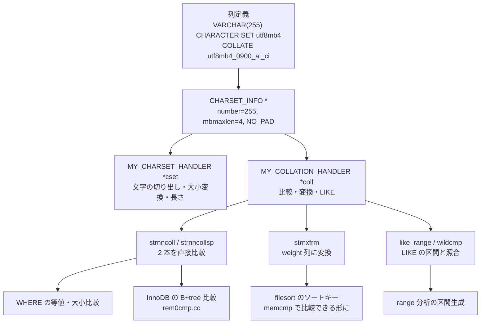

> **前提**: [型と Field クラス](./field-and-types/) / [名前解決と Item ツリー](./name-resolution-and-items/)

## 何を学んだか

`utf8mb4_0900_ai_ci` という名前は 1 個の構造体を指している。

```cpp title="include/mysql/strings/m_ctype.h"
struct CHARSET_INFO {
  unsigned number;
  ...
  unsigned mbminlen;
  unsigned mbmaxlen;
  ...
  MY_CHARSET_HANDLER *cset;
  MY_COLLATION_HANDLER *coll;
  enum Pad_attribute pad_attribute;
};
```

[`include/mysql/strings/m_ctype.h#L423`](https://github.com/mysql/mysql-server/blob/mysql-8.4.11/include/mysql/strings/m_ctype.h#L423)。列 1 本はこの構造体へのポインタを 1 個持つ。**「文字セット」と「照合順序」は別々に格納されていない**。`utf8mb4` という `csname` と `utf8mb4_0900_ai_ci` という `m_coll_name` は同じ構造体の 2 つのフィールドで、文字セットだけを指す `CHARSET_INFO` は存在しない (各文字セットの「既定の照合順序」が `MY_CS_PRIMARY` フラグ付きでその役を兼ねる)。

ここから、照合順序について知るべきことが出てくる。

- **文字列比較には 2 系統ある。** その場で 2 本の文字列を比べる `strnncollsp` と、**memcmp できるバイト列 (weight 列) に変換する `strnxfrm`**。ソートは後者を使う
- **同じ `utf8mb4` でも、`0900_ai_ci` と `general_ci` は別実装だ。** 前者は UCA 9.0.0 の重みテーブルを引き、後者は 1 バイトの `to_upper` 表を引く
- **`0900` 系は NO PAD、それ以前は PAD SPACE。** `'a'` と `'a '` が等しいかどうかがここで変わる
- **NO PAD にするとソートキーが可変長になる。** filesort の内部形式が変わる
- **InnoDB の B+tree の順序も同じ関数で決まる。** InnoDB は生バイトを格納し、比較のたびに照合順序の関数を呼ぶ



## なぜそうなっているか

**比較を 2 系統持つのは、ソートが「2 本の比較」ではなく「N 本の整列」だからだ。** 100 万行を `ORDER BY name` で並べるとき、比較関数を毎回呼ぶと UCA のテーブル引きが `O(n log n)` 回走る。代わりに 1 行 1 回だけ weight 列に変換しておけば、以降の比較は `memcmp` になる。ヘッダの `strnxfrm` のコメントがこの契約を明示している。

```cpp title="include/mysql/strings/m_ctype.h"
  /**
    Transform the string into a form such that memcmp() between transformed
    strings yields the correct collation order.
```

[`include/mysql/strings/m_ctype.h#L265`](https://github.com/mysql/mysql-server/blob/mysql-8.4.11/include/mysql/strings/m_ctype.h#L265)。「変換後の `memcmp` が照合順序と一致する」というのが weight 列の定義そのものになる。

**PAD SPACE が存在するのは、`CHAR(10)` が固定長だったからだ。** `CHAR` は宣言長まで空白で埋めて格納されるので、`'a'` と `'a         '` は同じ値でなければならない。この規則を照合順序の側に持たせたのが PAD SPACE で、「両方の文字列が無限に空白で伸びているとみなして比較する」と定義されている。

```cpp title="include/mysql/strings/m_ctype.h"
    Thus, for NO PAD collations, this is identical to strnncoll with is_prefix
    set to false. For PAD SPACE collations, the two strings are conceptually
    extended infinitely at the end using space characters (0x20) and then
    compared under the collation's normal comparison rules, so that e.g 'a' is
    equal to 'a '.
```

[`include/mysql/strings/m_ctype.h#L254`](https://github.com/mysql/mysql-server/blob/mysql-8.4.11/include/mysql/strings/m_ctype.h#L254)。副作用として `VARCHAR` でも末尾空白が無視される。8.0 の `0900` 系が NO PAD に切り替えたのは、この副作用のほうが驚きが大きいと判断されたからだ。

**UCA を引く照合順序が重いのは、1 文字が 1 個の重みに対応しないからだ。** Unicode の照合アルゴリズムでは、1 コードポイントが 0 個から複数個の重みに展開される (合成文字、展開文字)。だから `strnxfrm` の出力長は入力長から一意に決まらず、`strnxfrmlen()` という「最悪長を返す関数」が別に要る。

**InnoDB が weight 列ではなく生バイトを格納するのは、行を返すときに元の文字列が要るからだ。** weight 列は不可逆変換なので、これを格納すると `SELECT` で元の値を返せない。したがって InnoDB は生バイトを持ち、比較のたびに照合順序の関数を呼ぶ。**その代償として、インデックスの順序は作成時の照合順序に固定される。**

## ソースコードのどこか

### 比較関数の束 — `MY_COLLATION_HANDLER`

```cpp title="include/mysql/strings/m_ctype.h"
struct MY_COLLATION_HANDLER {
  bool (*init)(CHARSET_INFO *, MY_CHARSET_LOADER *, MY_CHARSET_ERRMSG *);
  void (*uninit)(CHARSET_INFO *, MY_CHARSET_LOADER *);
  /* Collation routines */
  int (*strnncoll)(const CHARSET_INFO *, const uint8_t *, size_t,
                   const uint8_t *, size_t, bool);
  int (*strnncollsp)(const CHARSET_INFO *, const uint8_t *, size_t,
                     const uint8_t *, size_t);
  size_t (*strnxfrm)(const CHARSET_INFO *, uint8_t *dst, size_t dstlen,
                     unsigned num_codepoints, const uint8_t *src, size_t srclen,
                     unsigned flags);
  size_t (*strnxfrmlen)(const CHARSET_INFO *, size_t num_bytes);
  bool (*like_range)(...);
  int (*wildcmp)(...);
```

[`include/mysql/strings/m_ctype.h#L247`](https://github.com/mysql/mysql-server/blob/mysql-8.4.11/include/mysql/strings/m_ctype.h#L247)。`strnncoll` と `strnncollsp` の違いが PAD の有無で、**NO PAD の照合順序では両者が同じ動作になる**。`like_range` は `LIKE 'abc%'` からインデックス区間を作る関数で、range 分析がここを呼ぶ ([range 分析](./range-optimizer/))。

### 同じ utf8mb4 の 2 つの実装

`utf8mb4_0900_ai_ci` はこう定義されている。

```cpp title="strings/ctype-uca.cc"
CHARSET_INFO my_charset_utf8mb4_0900_ai_ci = {
    255,
    0,
    0,                                       /* number       */
    MY_CS_UTF8MB4_UCA_FLAGS | MY_CS_PRIMARY, /* state    */
    "utf8mb4",                               /* csname       */
    "utf8mb4_0900_ai_ci",                    /* m_coll_name  */
    ...
    nullptr,                                 /* to_lower     */
    nullptr,                                 /* to_upper     */
    nullptr,                                 /* sort_order   */
    &my_uca_v900,                            /* uca_900      */
    ...
    0,                                       /* strxfrm_multiply */
    ...
    &my_collation_uca_900_handler,
    NO_PAD};
```

[`strings/ctype-uca.cc#L9610`](https://github.com/mysql/mysql-server/blob/mysql-8.4.11/strings/ctype-uca.cc#L9610)。`sort_order` が `nullptr` で `uca` に `my_uca_v900` が入り、末尾が `NO_PAD`。

`utf8mb4_general_ci` は同じ `csname` を持ちながら中身が別になる。

```cpp title="strings/ctype-utf8.cc"
CHARSET_INFO my_charset_utf8mb4_general_ci = {
    45,
    0,
    0, /* number       */
    MY_CS_COMPILED | MY_CS_STRNXFRM | MY_CS_UNICODE |
        MY_CS_UNICODE_SUPPLEMENT, /* state  */
    "utf8mb4",                    /* cs name      */
    "utf8mb4_general_ci",         /* m_coll_name  */
    ...
    to_upper_utf8mb4,             /* sort_order   */
    nullptr,                      /* uca          */
    ...
    1,                            /* strxfrm_multiply */
    ...
    &my_collation_utf8mb4_general_ci_handler,
    PAD_SPACE};
```

[`strings/ctype-utf8.cc#L7786`](https://github.com/mysql/mysql-server/blob/mysql-8.4.11/strings/ctype-utf8.cc#L7786)。`uca` が `nullptr` で、代わりに `sort_order` に `to_upper` の表が入っている。**`general_ci` は「大文字に寄せてから比較する」だけの照合順序**で、Unicode の照合規則にはほとんど従っていない。番号も 255 と 45 で完全に別物になる。

`strxfrm_multiply` の 0 と 1 の差も効いてくる。`general_ci` は「入力 1 バイトにつき weight 1 バイト」と宣言しているので `strnxfrmlen` が単純な掛け算になるが、`0900` 系は 0 (未使用) で、UCA 専用の `strnxfrmlen` が最悪長を計算する。

### ソートキーを作る — `filesort`

`ORDER BY` が使うのは変換のほうだ。

```cpp title="sql/filesort.cc"
      if (is_varlen) {
        size_t max_length = to_end - to;
        if (max_length % 2 != 0) {
          // Heed the contract that strnxfrm needs an even number of bytes.
          --max_length;
        }
        actual_length = cs->coll->strnxfrm(
            cs, to, max_length, item->max_char_length(),
            pointer_cast<const uchar *>(from), src_length, 0);
```

[`sql/filesort.cc#L1284`](https://github.com/mysql/mysql-server/blob/mysql-8.4.11/sql/filesort.cc#L1284)。変換後のバイト列がソートバッファに書かれ、以降の比較は `memcmp` になる ([filesort](./filesort/))。

その `is_varlen` を決めているのが PAD 属性だ。

```cpp title="sql/filesort.cc"
      case STRING_RESULT: {
        const CHARSET_INFO *cs = item->collation.collation;
        sortorder->length = item->max_length;

        if (cs->pad_attribute == NO_PAD) {
          sortorder->is_varlen = true;
        }

        if (sortorder->length < (10 << 20)) {  // 10 MB.
          // How many bytes do we need (including sort weights) for
          // strnxfrm()?
          sortorder->length = cs->coll->strnxfrmlen(cs, sortorder->length);
```

[`sortlength` (`sql/filesort.cc#L2099`)](https://github.com/mysql/mysql-server/blob/mysql-8.4.11/sql/filesort.cc#L2099)。**NO PAD の照合順序では、ソートキーが固定長ではなく可変長で格納される。** PAD SPACE なら短い文字列も宣言長まで空白で伸ばした前提で変換できる (`MY_STRXFRM_PAD_TO_MAXLEN`) が、NO PAD では伸ばしてはいけないので、実長を書いて長さを別に持つしかない。

### InnoDB 側の比較 — 生バイトと照合順序 ID

InnoDB は列の照合順序を `prtype` (precise type) の中に番号として持ち、比較のたびに引き直す。

```cpp title="storage/innobase/rem/rem0cmp.cc"
  uint cs_num = (uint)dtype_get_charset_coll(prtype);

  if (CHARSET_INFO *cs = get_charset(cs_num, MYF(MY_WME))) {
    if ((prtype & DATA_MYSQL_TYPE_MASK) == MYSQL_TYPE_STRING &&
        cs->pad_attribute == NO_PAD) {
      /* MySQL specifies that CHAR fields are stripped of
      trailing spaces before being returned from the database.
      Normally this is done in Field_string::val_str(),
      but since we don't involve the Field classes for internal
      index comparisons, we need to do the same thing here
      for NO PAD collations. ... */
      a_length = cs->cset->lengthsp(cs, (const char *)a, a_length);
      b_length = cs->cset->lengthsp(cs, (const char *)b, b_length);
    }
    return (cs->coll->strnncollsp(cs, a, a_length, b, b_length));
```

[`innobase_mysql_cmp` (`storage/innobase/rem/rem0cmp.cc#L76`)](https://github.com/mysql/mysql-server/blob/mysql-8.4.11/storage/innobase/rem/rem0cmp.cc#L76)。読みどころが 2 つある。

**B+tree のキー比較は `Field` を通らない。** コメントが `we don't involve the Field classes for internal index comparisons` と明言している。だから `CHAR` の末尾空白除去のような `Field_string::val_str` の仕事を、InnoDB 側でもう一度やる必要がある。NO PAD の登場で新しく必要になった補正がこれだ。

**照合順序が違えば B+tree の順序も違う。** インデックスに格納されているのは生バイトなので、比較関数を差し替えれば順序が変わる。既存インデックスを別の照合順序で使い回すことはできず、`ALTER TABLE ... COLLATE` はインデックスの作り直しになる。

## どう活かすか

### 5.7 から 8.0 に上げると `'a '` と `'a'` が別の行になる

5.7 の既定は `utf8mb4_general_ci` (PAD SPACE)、8.0 以降の既定は `utf8mb4_0900_ai_ci` (NO PAD) だ。この差は 2 か所で表面化する。

- **UNIQUE 制約** — PAD SPACE では `'a'` と `'a '` が重複扱いで弾かれる。NO PAD では両方入る
- **`WHERE name = 'a'`** — 末尾に空白が付いたデータが引っかからなくなる

移行時に「重複が増えた」「検索でヒットしなくなった」という形で出る。アプリ側で入力の trim を掛けていれば影響しないので、**照合順序を選ぶより先に、末尾空白を入れないほうを直す**のが順序として正しい。

### `general_ci` を選ぶ理由はもう残っていない

`general_ci` は 1 バイトの `to_upper` 表を引くだけなので確かに速いが、Unicode の照合規則には従っていない。日本語で言えば濁点・半濁点や全角半角の扱いが `0900_ai_ci` と違う。8.0 で `0900_ai_ci` に切り替えるのが既定であり、**明示的に `COLLATE utf8mb4_general_ci` と書かれた古いスキーマ定義がそのまま引き継がれていないか**を確認する価値がある。

混在すると照合順序の集約が走り、JOIN でインデックスが落ちる ([名前解決と Item ツリー](./name-resolution-and-items/))。テーブルごとに違う照合順序が付いているスキーマは、この事故が起きるまで気付かれないことが多い。

### `ORDER BY` のメモリ見積もりは `strnxfrmlen` で決まる

ソートバッファの必要量は元の文字列長ではなく、**weight 列の最悪長**で見積もられる。UCA 系の照合順序では 1 文字あたり複数の重みが出るので、`VARCHAR(255)` を utf8mb4 で `ORDER BY` すると、1 行あたりのソートキーは 255 バイトよりずっと大きくなる。`sort_buffer_size` に収まらずマージが増えているとき、原因が行数ではなくキー長のこともある ([filesort](./filesort/))。

ただし `max_sort_length` (既定 1024 バイト) による切り詰めは、**PAD SPACE の照合順序にしか効かない**。

```cpp title="sql/filesort.cc"
    if (!sortorder->is_varlen && is_string_type) {
      /*
        We would love to never have to care about max_sort_length anymore,
        but that would make it impossible for us to sort blobs (TEXT) with
        PAD SPACE collations, since those are not variable-length (the padding
        is serialized as part of the sort key) and thus require infinite space.
      */
      sortorder->length = std::min(sortorder->length, max_sort_length_even);
    }
```

[`sql/filesort.cc#L2166`](https://github.com/mysql/mysql-server/blob/mysql-8.4.11/sql/filesort.cc#L2166)。`is_varlen` が立つ NO PAD ではこの `min` を通らない。つまり **8.0 既定の `utf8mb4_0900_ai_ci` で `TEXT` を `ORDER BY` すると、`max_sort_length` は歯止めにならない**。「順序が先頭 1024 バイトまでしか保証されない」という 5.7 時代の注意書きは PAD SPACE のときの話で、逆に言えば NO PAD ではソートキーがフルサイズで積まれる。

### インデックス長は文字数ではなくバイト数で数える

DYNAMIC 行フォーマットのキー長上限は 3072 バイトなので、utf8mb4 では 768 文字が上限になる。`VARCHAR(255)` を 3 列並べた複合インデックスは 3060 バイトで、ぎりぎり通る。4 列目を足すと `Specified key was too long` になる ([セカンダリインデックス](./secondary-index/))。

プレフィックスインデックス (`KEY (col(20))`) の 20 も文字数で、内部では 80 バイトとして扱われる。

### 一般化して持ち帰るもの

**「その場の比較」と「事前変換した鍵の比較」を両方持つ**というのが照合順序の設計だ。片方だけでは足りない。`SELECT` の `WHERE` は 2 本の比較で済むが、`ORDER BY` は N log N 回の比較になるので、変換のコストを 1 行 1 回に前倒しするほうが安くなる。同じ判断は自前のソートやインデックス実装でも出てくる。

もう 1 つは、**不可逆変換の結果を保存しない**という判断だ。weight 列を格納すれば比較は速くなるが、元の値を返せなくなる。InnoDB は生バイトを持ち、比較のたびにコストを払うほうを選んだ。その帰結として「インデックスは照合順序に紐付く」という制約が生まれ、照合順序の違う列同士の JOIN でインデックスが使えないという症状につながる。
