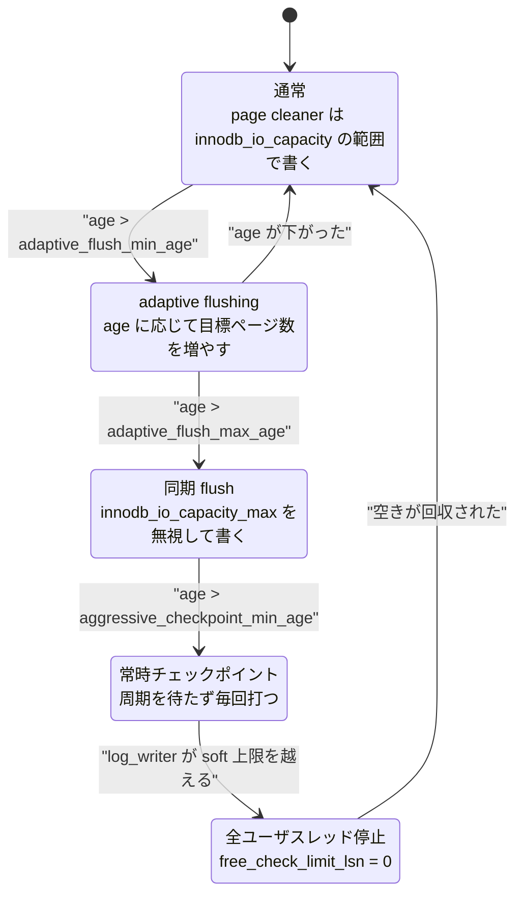

> **前提**: [redo ログ](./redo-log-walkthrough/) / [flush list と page cleaner](./flush-list-and-page-cleaner/)

## 何を学んだか

チェックポイントの意味は 1 文で言える。

> **チェックポイント LSN より前の redo レコードは、もう誰も必要としない。**

「必要としない」の中身は 2 つだ。クラッシュリカバリはチェックポイント LSN から読み始めるので、それより前は読まない ([クラッシュリカバリのページ](./crash-recovery/))。そして redo ファイルは環状に使われるので、**要らなくなった前半のファイルは削除するか再利用してよい**。

だからチェックポイント LSN は「捨ててよい境界」であり、同時に**redo の使用量 (checkpoint age = 現在の LSN − チェックポイント LSN) を決める値**でもある。この age が `innodb_redo_log_capacity` に近づくと、InnoDB は段階的に必死になり、最後は書き込みを止める。

チェックポイント LSN の計算は [`log_compute_available_for_checkpoint_lsn` (`log0chkp.cc#L180`)](https://github.com/mysql/mysql-server/blob/mysql-8.4.11/storage/innobase/log/log0chkp.cc#L180) にあり、実質は 3 つの min だ。

```text
checkpoint_lsn = min(
    flush list に残る oldest_modification の低位水準 (LWM),
    recent_closed.tail()  = dirty page が flush list に載り終えた LSN,
    flushed_to_disk_lsn   = redo が fsync された LSN
)
```

3 つそれぞれに別の理由がある。**どれか 1 つでも進まなければ、チェックポイントは進まない。**

そして checkpoint age (現在の LSN − チェックポイント LSN) が伸びるにつれ、InnoDB は 4 段階でギアを上げる。



**`innodb_io_capacity` / `innodb_io_capacity_max` が効くのは最初の 2 段だけだ。** 同期 flush まで来たらチューニングの余地はない。

## なぜそうなっているか

**チェックポイントが「ページを書いた記録」ではなく「まだ書いていないページの下限」なのは、fuzzy checkpoint だからだ。** InnoDB は「チェックポイントを打つためにバッファプールを全部吐き出す」ことをしない。それをやると、そのたびにサーバが止まる。代わりに page cleaner が常時少しずつ書き、checkpointer は「今どこまでが安全か」を観測して記録するだけにした。**チェックポイントを打つコストが O(1) になっている**のはこの設計の帰結だ。

**3 段の警戒レベルがあるのは、急ブレーキを避けるためだ。** age が上限に達してから止めると、止まる時間が長くなる。手前から page cleaner を段階的に速くすることで、多くの場合は上限に到達しない。`innodb_io_capacity` / `innodb_io_capacity_max` が効くのは「regular」と「adaptive」の範囲までで、**同期 flush に入ったらこの設定は無視される**。上限に触れた時点でチューニングの余地はもうない、ということだ。

**論理容量が物理容量より小さいのは、次のファイルを作る余地を残すためだ。** `Log_files_capacity` のコメントによれば `(LOG_N_FILES - 2) / LOG_N_FILES`、つまり物理容量の約 94% までしか論理的には使えない。`innodb_redo_log_capacity` に設定した値がそのまま使えるわけではない。

**`free_check_limit_lsn` を 0 にして全員止めるという実装は乱暴に見えるが、正しい。** ここまで来ているということは、redo に空きがなく、log_writer が書けず、page cleaner も追いついていない。**新しい redo を作らせないこと以外に、状態を回復させる手段がない。** 中途半端に一部だけ通すと、通ったスレッドが latch を握ったまま止まって事態が悪化する。`log_free_check` が「危険な latch を持っていない安全な地点」でしか呼ばれない (debug ビルドの `log_free_check_validate` が検査している) のもこのためだ。

## ソースコードのどこか

### 3 つの min

```cpp title="storage/innobase/log/log0chkp.cc"
  const lsn_t dpa_lsn = log_buffer_dirty_pages_added_up_to_lsn(log);
  ...
  lsn_t lwm_lsn = buf_pool_get_oldest_modification_lwm();

  /* We cannot return lsn larger than dpa_lsn,
  because some mtr's commit could be in the middle, after
  its log records have been written to log buffer, but before
  its dirty pages have been added to flush lists. */

  if (lwm_lsn == 0) {
    /* Empty flush list. */
    lwm_lsn = dpa_lsn;
  } else {
    lwm_lsn = std::min(lwm_lsn, dpa_lsn);
  }
  ...
  const lsn_t flushed_lsn = log.flushed_to_disk_lsn.load();

  lsn_t lsn = std::min(lwm_lsn, flushed_lsn);
```

**1 つ目 — `oldest_modification` の LWM。** flush list に残っている dirty page のうち、最も古い LSN。そのページはまだディスクにないので、そこから先の redo が要る ([mini-transaction のページ](./mini-transaction/))。`_lwm` が付くのは、flush list の順序が緩められているので厳密な最小値ではなく、安全側に振った下限だからだ ([`buf0buf.cc#L484`](https://github.com/mysql/mysql-server/blob/mysql-8.4.11/storage/innobase/buf/buf0buf.cc#L484))。

**2 つ目 — `recent_closed.tail()`。** コメントがそのまま理由を書いている。mtr は redo をログバッファに置いてから dirty page を flush list に載せるまでに隙間がある。その隙間にいる mtr のページは 1 つ目の LWM に反映されていないので、そこを越えてはいけない。

**3 つ目 — `flushed_to_disk_lsn`。** チェックポイントは redo ファイルのヘッダに書かれるので、その位置までの redo が実際にディスクにないと矛盾する。**これがないとデッドロックになる**とコメントに書かれている。log_writer は空きがないとチェックポイントを待つので、チェックポイント側が log_writer を待つと循環する。

最後に、ブロック境界を避ける補正と、`last_checkpoint_lsn` との max を取る。

### 書くのは `log_checkpointer` スレッド

[`log_checkpointer` (`log0chkp.cc#L915`)](https://github.com/mysql/mysql-server/blob/mysql-8.4.11/storage/innobase/log/log0chkp.cc#L915) は既定 1 秒周期 (`INNODB_LOG_CHECKPOINT_EVERY_DEFAULT = 1000` ミリ秒。これを変える `innodb_log_checkpoint_every` は `ENABLE_EXPERIMENT_SYSVARS` 付きビルドにしかない) で回り、2 つの仕事をする。

```cpp title="storage/innobase/log/log0chkp.cc"
      /* Consider flushing some dirty pages. */
      log_consider_sync_flush(log);

      log_sync_point("log_checkpointer_before_consider_checkpoint");

      /* Consider writing checkpoint. */
      log_consider_checkpoint(log);
```

**順序が重要だ。** 先に「dirty page を吐き出させる」ことを考え、そのあとで「チェックポイントを打てるか」を見る。ページを書かせなければ LWM は動かないので、この順番でないと 1 周期分遅れる。なお**毎周期この 2 つに入るわけではない**。直前の周期がタイムアウトで抜けていてサーバが busy と判定されると、`log_busy_checkpoint_interval = 7` 倍の時間が経つまで両方を飛ばす。チェックポイントが明示的に要求されていれば飛ばさない。

[`log_checkpoint` (L443)](https://github.com/mysql/mysql-server/blob/mysql-8.4.11/storage/innobase/log/log0chkp.cc#L443) が実際の書き込みで、**checkpoint ヘッダを書く前にデータファイルを `fsync` する**。

```cpp title="storage/innobase/log/log0chkp.cc"
  log_sync_point("log_before_checkpoint_data_flush");

  buf_flush_fsync();
  ...
  ut_a(checkpoint_lsn <= log_buffer_dirty_pages_added_up_to_lsn(log));
  ...
  ut_a(log.flushed_to_disk_lsn.load() >= checkpoint_lsn);
  ...
  const dberr_t err = log_files_next_checkpoint(log, checkpoint_lsn);
```

page cleaner が `write(2)` しただけのページは、まだデバイスに届いていないかもしれない。**「チェックポイント LSN より前のページ変更はディスクにある」を成立させているのがこの `buf_flush_fsync()` 1 行だ。**

書き先は、その LSN を含む redo ファイルのヘッダの 2 箇所 (`LOG_CHECKPOINT_1 = 512` と `LOG_CHECKPOINT_2 = 1536`) で、**交互に使う** ([`log_next_checkpoint_header` (`log0chkp.cc#L414`)](https://github.com/mysql/mysql-server/blob/mysql-8.4.11/storage/innobase/log/log0chkp.cc#L414))。書いている最中にクラッシュしても、もう一方に前回の値が残る。

### 3 段の容量上限

[`Log_files_capacity`](https://github.com/mysql/mysql-server/blob/mysql-8.4.11/storage/innobase/include/log0files_capacity.h#L113) のコメントに、age が伸びたときの段階が図で書いてある。

```text
  adaptive_flush_min_age  adaptive_flush_max_age  aggressive_checkpoint_min_age
         |                        |                     |
  -------!------------------------!---------------------!----------------->age
  regular     adaptive flushing     aggressive flushing   aggr. checkpoints
```

- **`adaptive_flush_min_age` を超える** — page cleaner の目標ページ数が checkpoint age に応じて増える (`set_flush_target_by_lsn`、[page cleaner のページ](./flush-list-and-page-cleaner/))
- **`adaptive_flush_max_age` を超える** — [`log_sync_flush_lsn` (`log0chkp.cc#L699`)](https://github.com/mysql/mysql-server/blob/mysql-8.4.11/storage/innobase/log/log0chkp.cc#L699) が 0 でない値を返し、同期 flush が要求される
- **`aggressive_checkpoint_min_age` を超える** — チェックポイントを周期に関係なく毎回打つ

同期 flush の要求は [`log_request_sync_flush` (L642)](https://github.com/mysql/mysql-server/blob/mysql-8.4.11/storage/innobase/log/log0chkp.cc#L642) で、**`innodb_io_capacity_max` を無視して page cleaner を走らせる**。宣言部のコメントが明言している。

```cpp title="storage/innobase/log/log0chkp.cc"
/** Requests for urgent flush of dirty pages, to advance oldest_lsn
in flush lists to provided value. This should force page cleaners
to perform the sync-flush in which case the innodb_max_io_capacity
is not respected. This should be called when we are close to running
out of space in redo log (close to free_check_limit_lsn).
```

`innodb_flush_sync` を OFF にするとこの緊急モードを止められるが、そのぶん redo の枯渇に早く到達する。

### `log_free_check` — ユーザスレッドが止まる場所

InnoDB は redo を大量に消費しうる操作の直前に `log_free_check()` を挟む。判定は 1 つの比較だ ([`log0chkp.h#L256`](https://github.com/mysql/mysql-server/blob/mysql-8.4.11/storage/innobase/include/log0chkp.h#L256))。

```cpp title="storage/innobase/include/log0chkp.h"
inline bool log_free_check_is_required(const log_t &log) {
  ...
  return lsn > log.free_check_limit_lsn.load();
}
```

`free_check_limit_lsn` は [`log_update_limits_low` (`log0chkp.cc#L1112`)](https://github.com/mysql/mysql-server/blob/mysql-8.4.11/storage/innobase/log/log0chkp.cc#L1112) が更新する。

```cpp title="storage/innobase/log/log0chkp.cc"
  if (log.m_writer_inside_extra_margin) {
    /* Stop all new incoming user threads at safe place. */
    log.free_check_limit_lsn.store(0);
    return;
  }

  const lsn_t current_lsn = log_get_lsn(log);
  const lsn_t log_capacity = log_free_check_capacity(log);
  lsn_t oldest_needed_lsn;
  auto consumer = log_consumer_get_oldest(log, oldest_needed_lsn);

  const lsn_t limit_lsn = oldest_needed_lsn + log_capacity;

  log.free_check_limit_lsn.store(limit_lsn);
```

**`log_writer` が非常用マージンに入っていると、`free_check_limit_lsn` が 0 になる。** 0 より大きい LSN はすべて上限超過なので、**以後 `log_free_check()` を通る全ユーザスレッドが例外なく止まる**。これが「書き込みが完全に止まる」の実装だ。

止まったスレッドは [`log_free_check_wait` (L1176)](https://github.com/mysql/mysql-server/blob/mysql-8.4.11/storage/innobase/log/log0chkp.cc#L1176) で checkpointer を叩き起こしながら 100 マイクロ秒ずつスピンする。

```cpp title="storage/innobase/log/log0chkp.cc"
  os_event_set(log.checkpointer_event);
  auto stop_condition = [&log, current_lsn](bool) {
    return current_lsn <= log.free_check_limit_lsn.load();
  };

  const auto wait_stats =
      ut::wait_for(0, std::chrono::microseconds{100}, stop_condition);
```

### エラーログに出るもの

`log_writer` が soft 上限を越えると [`log_writer_enter_extra_margin` (`log0write.cc#L1835`)](https://github.com/mysql/mysql-server/blob/mysql-8.4.11/storage/innobase/log/log0write.cc#L1835) が警告を出す。8.4.11 の文言は [`share/messages_to_error_log.txt`](https://github.com/mysql/mysql-server/blob/mysql-8.4.11/share/messages_to_error_log.txt#L11681) にある。

```text
ER_IB_MSG_LOG_WRITER_ENTERED_EXTRA_MARGIN
  eng "Redo log is running out of free space, pausing user threads... Consider increasing innodb_redo_log_capacity."

ER_IB_MSG_LOG_WRITER_EXITED_EXTRA_MARGIN
  eng "Redo log reclaimed some free space, resuming user threads."
```

さらに 5 秒間 1 ブロックも回収できないと、`log_writer_wait_on_checkpoint_pessimistic` がエラーを出す。

```text
ER_IB_MSG_LOG_WRITER_OUT_OF_SPACE
  eng "Out of space in the redo log. Checkpoint LSN: %llu. Consider increasing innodb_redo_log_capacity."
```

`log_free_check` 側で待たされている場合はこちらが出る。

```text
ER_IB_MSG_WAITING_ON_LAGGING_REDO_LOG_CONSUMER
  eng "Threads are unable to reserve space in redo log which can't be reclaimed due to the '%s' consumer still lagging behind at LSN = %llu. Consider increasing innodb_redo_log_capacity."
```

**この 4 つが「redo が足りない」の症状の全部だ。** 8.0.30 より前の `InnoDB: ERROR: the age of the last checkpoint is ...` は 8.4 には存在しない。

## どう活かすか

**エラーログの `Redo log is running out of free space, pausing user threads...` は、`innodb_redo_log_capacity` を増やす以外に即効性のある対処がない。** このメッセージが出ているとき、アプリケーション側では「書き込みクエリが一斉に数秒固まる」「レイテンシのスパイクが周期的に出る」という形で観測される。特定のクエリが遅いのではなく全部が同時に遅くなるのが特徴だ。

**サイジングの目安は「ピーク時に redo を書く速度 × 想定リカバリ時間」で見る。** `Innodb_os_log_written` の増分から秒あたりのバイト数が分かる。checkpoint age は `SHOW ENGINE INNODB STATUS` の LOG セクションで `Log sequence number` − `Last checkpoint at` として読める。この差が容量の半分を常時超えているなら余裕がない。

```text
Log capacity                 104857600
Log capacity used            104857600
Log sequence number          ...
Log flushed up to            ...
Added dirty pages up to      ...
Pages flushed up to          ...
Last checkpoint at           ...
```

**この 2 行を「容量」と「使用量」だと読まない。** `Log capacity` は `innodb_redo_log_capacity` の設定値、`Log capacity used` は `srv_redo_log_capacity_used` すなわち**実際に効いている容量**の印字で、リサイズ中でなければ両者は一致する ([`log0log.cc#L1163`](https://github.com/mysql/mysql-server/blob/mysql-8.4.11/storage/innobase/log/log0log.cc#L1163))。使用量を 1 つの数値で見たいなら、ステータス変数の `Innodb_redo_log_logical_size` (「使用中の redo が占める LSN 範囲のバイト数」) を `Innodb_redo_log_capacity_resized` と比べる。

**redo を大きくするとクラッシュリカバリが長くなる、というトレードオフは 8.0 以降は昔ほど厳しくない。** リカバリ時間を決めるのは容量ではなく実際の checkpoint age であって、page cleaner が追いついていれば age は小さいままだ。容量に余裕を持たせておくと、スパイク時に止まらずに済む。

**`innodb_flush_sync=OFF` は「同期 flush でディスクを飽和させたくない」ときの選択肢だが、redo 枯渇を早める。** 共有ストレージで他のワークロードに影響を出したくない場合に検討する程度で、既定の ON から動かす理由は普通ない。

**`innodb_redo_log_capacity` はオンラインで変更できる。** ただしリサイズは即座には終わらず、`log_files_governor` が古いサイズのファイルを消費し終えるまで続く。縮小方向は特に時間がかかり、`Innodb_redo_log_capacity_resized` ステータス変数が「実際に反映済みの容量」を示す ([`ha_innodb.cc#L5134`](https://github.com/mysql/mysql-server/blob/mysql-8.4.11/storage/innobase/handler/ha_innodb.cc#L5134))。設定を変えた直後に効いていないように見えるのはこのためだ。
