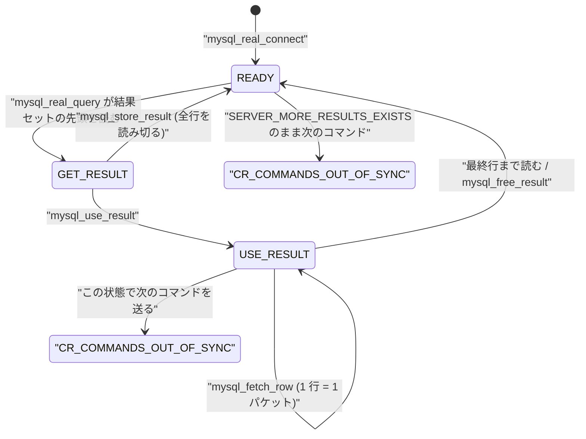

> **前提**: [テキストプロトコル](./text-protocol-and-resultset/) / [パケット](./packet-framing/)

## 何を学んだか

クライアントライブラリを読むと、サーバ側だけ読んでいては見えない性質が 4 つ出てくる。

1. **`sql-common/client.cc` (9600 行超) がクライアント API の本体で、サーバもこれをリンクしている。** レプリカの receiver スレッドや `FEDERATED` 相当の経路がクライアントとして振る舞うため。`libmysql/libmysql.cc` は prepared statement 側 (`mysql_stmt_*`) を担当する
2. **`mysql_store_result` と `mysql_use_result` の違いは、行を読み切るかどうか。** `use` を選ぶと `mysql->status = MYSQL_STATUS_USE_RESULT` になり、**読み切るまで同じハンドルで次のコマンドを送れない**
3. **メソッドは `MYSQL_METHODS` という関数ポインタのテーブルで差し替えられる。** サーバに埋め込む版 (embedded) や、非同期版がここに乗る
4. **同期 API と非同期 API は、同じ状態関数のテーブルを違うループで回しているだけだ。** `csm_begin_connect` から始まる状態遷移は共通で、`non_blocking` フラグで「途中で戻るか、その場で待つか」が変わる

そして LOAD DATA LOCAL は、**サーバが「このファイルを送れ」と言い、クライアントが素直に送る**という逆転したプロトコルになっている。安全境界がクライアント側にある。

`MYSQL` ハンドルの状態遷移が、この制約をそのまま表している。



## なぜそうなっているか

**`store` と `use` の 2 本立てがあるのは、「結果セットのサイズが事前に分からない」という根本問題への 2 つの答えだからだ。** サーバは行数を先に教えてくれない (OK パケットの `affected_rows` は `SELECT` では意味を持たない)。クライアントは「全部受け取ってからサイズを知る」(store) か、「1 行ずつ受け取ってサイズを知らないまま進む」(use) しかない。前者はメモリを食い、後者は接続を占有する。**どちらも避けたければ `LIMIT` でアプリが分割するしかない**、というのが結論になる。

**`use_result` が接続を占有するのは、プロトコルにフレーム境界以上の構造がないからだ。** ソケットの上を流れているのは 4 バイトヘッダのパケット列で、「どの結果セットに属するか」の情報がない。読み残しがある状態で新しいコマンドを送れば、その応答と読み残しが区別できなくなる。**多重化 (1 接続に複数のリクエストを並行して流す) をやりたければ、プロトコルを変えるしかない。** それが [X Protocol](./x-protocol-messages/) を作った動機の 1 つになった。

**非同期 API を「状態関数のテーブル」にしたのは、同期版のコードを 2 つに増やさないためだ。** C にはコルーチンがないので、「途中で中断して後から再開する」には状態を明示的にヒープに置くしかない。`mysql_async_connect` / `mysql_async_auth` という構造体がその状態で、各 `csm_*` は「1 段進めて次の関数を指す」だけの純粋な遷移になる。同期版はその遷移をブロッキング I/O で回すだけ。**「非同期版だけバグが残る」という典型的な事故を、経路の共有で防いでいる。**

**LOAD DATA LOCAL の安全境界がクライアントにあるのは、そういうプロトコルにしてしまったからだ。** サーバがファイル名を指定してクライアントが送る、という向きを選んだ時点で、「サーバが嘘のファイル名を言う」攻撃は成立する。後付けで `local_infile` システム変数、クライアント側の `CLIENT_LOCAL_FILES`、`MYSQL_OPT_LOCAL_INFILE` のディレクトリ制限、`ENABLED_LOCAL_INFILE` のビルドフラグ、と 4 段の防御が積まれたが、**プロトコル自体は変わっていない。**

## ソースコードのどこか

### `MYSQL_METHODS` — 関数ポインタのテーブル

```cpp title="sql-common/client.cc"
static MYSQL_METHODS client_methods = {
    cli_connect,
    cli_read_query_result,      /* read_query_result */
    cli_advanced_command,       /* advanced_command */
    cli_read_rows,              /* read_rows */
    cli_use_result,             /* use_result */
    cli_fetch_row,              /* fetch_row */
    cli_fetch_lengths,          /* fetch_lengths */
    cli_flush_use_result,       /* flush_use_result */
    cli_read_change_user_result /* read_change_user_result */
#ifndef MYSQL_SERVER
    ,
    cli_list_fields,         /* list_fields */
    cli_read_prepare_result, /* read_prepare_result */
    cli_stmt_execute,        /* stmt_execute */
    cli_read_binary_rows,    /* read_binary_rows */
    cli_unbuffered_fetch,    /* unbuffered_fetch */
    cli_read_statistics,     /* read_statistics */
    cli_read_query_result,   /* next_result */
    cli_read_binary_rows,    /* read_rows_from_cursor */
    free_rows
#endif
```

[L3230](https://github.com/mysql/mysql-server/blob/mysql-8.4.11/sql-common/client.cc#L3230)。**`#ifndef MYSQL_SERVER` で囲まれた後半が、サーバにリンクされない部分**だ。prepared statement 関連 (`cli_stmt_execute`、`cli_read_binary_rows`) がここにある。サーバがクライアントとして繋ぐ用途 (レプリカの receiver) では、`COM_QUERY` とその結果さえ読めればよい。

公開 API はほぼ全部このテーブルを経由する。

```cpp title="sql-common/client.cc"
MYSQL_RES *STDCALL mysql_use_result(MYSQL *mysql) {
  return (*mysql->methods->use_result)(mysql);
}
```

### `mysql_store_result` — 全部読む

```cpp title="sql-common/client.cc"
  mysql->status = MYSQL_STATUS_READY; /* server is ready */
  ...
  result->eof = true; /* Marker for buffered */
  result->lengths = (ulong *)(result + 1);
  if (!(result->data = (*mysql->methods->read_rows)(mysql, mysql->fields,
                                                    mysql->field_count))) {
```

[`mysql_store_result` (L8162)](https://github.com/mysql/mysql-server/blob/mysql-8.4.11/sql-common/client.cc#L8162)。**先に `MYSQL_STATUS_READY` に戻してから `read_rows` を呼ぶ。** 読み終わった時点で接続は次のコマンドを受け付けられる状態になる。

行の格納は [`cli_read_rows` (L2994)](https://github.com/mysql/mysql-server/blob/mysql-8.4.11/sql-common/client.cc#L2994)。

```cpp title="sql-common/client.cc"
  ::new ((void *)result->alloc)
      MEM_ROOT(PSI_NOT_INSTRUMENTED, 8192); /* Assume rowlength < 8192 */
  prev_ptr = &result->data;
  result->rows = 0;
  result->fields = fields;

  /*
    The last EOF packet is either a single 254 character or (in MySQL 4.1)
    254 followed by 1-7 status bytes or an OK packet starting with 0xFE
  */

  while (*(cp = net->read_pos) == 0 || is_data_packet) {
```

終端の判定は「先頭バイトが 0 でもなく `is_data_packet` でもない」。`is_data_packet` は `cli_safe_read` が返すフラグで、`CLIENT_DEPRECATE_EOF` 時に `0xFE` で始まるパケットを「行データ」と「OK」で区別するために要る ([テキストプロトコルのページ](./text-protocol-and-resultset/))。

**1 行ごとにポインタ配列と実データを `MEM_ROOT` から確保する。** 100 万行の結果セットなら、100 万個の `MYSQL_ROWS` とその中身が全部メモリに載る。`mysql_store_result` が「メモリを食う」と言われるのはこの構造そのものだ。

### `mysql_use_result` — 読み残したまま返す

```cpp title="sql-common/client.cc"
  result->handle = mysql;
  result->current_row = nullptr;
  mysql->fields = nullptr; /* fields is now in result */
  mysql->status = MYSQL_STATUS_USE_RESULT;
  mysql->unbuffered_fetch_owner = &result->unbuffered_fetch_cancelled;
  return result; /* Data is read to be fetched */
```

[`use_result` (L8302)](https://github.com/mysql/mysql-server/blob/mysql-8.4.11/sql-common/client.cc#L8302)。関数の上のコメントが制約をそのまま書いている。

```cpp title="sql-common/client.cc"
/**************************************************************************
  Alloc struct for use with unbuffered reads. Data is fetched by domand
  when calling to mysql_fetch_row.
  mysql_data_seek is a noop.

  No other queries may be specified with the same MYSQL handle.
  There shouldn't be much processing per row because mysql server shouldn't
  have to wait for the client (and will not wait more than 30 sec/packet).
**************************************************************************/
```

**「同じ `MYSQL` ハンドルで他のクエリを投げてはいけない」「1 行あたりの処理は軽くしろ、サーバは 30 秒しか待たない」** の 2 つ。ただしコメントの「30 秒」は古い。8.4 の定数は [`include/mysql_com.h#L883`](https://github.com/mysql/mysql-server/blob/mysql-8.4.11/include/mysql_com.h#L883) で `NET_READ_TIMEOUT 30` / `NET_WRITE_TIMEOUT 60` と分かれていて、サーバが遅いクライアントに行を書き続けるときに効くのは後者、つまり `net_write_timeout` の 60 秒だ ([パケットのページ](./packet-framing/))。

`mysql_fetch_row` は毎回 1 パケット読む。

```cpp title="sql-common/client.cc"
MYSQL_ROW cli_fetch_row(MYSQL_RES *res) {
  DBUG_TRACE;
  if (!res->data) { /* Unbufferred fetch */
    if (!res->eof) {
      MYSQL *mysql = res->handle;
      if (mysql->status != MYSQL_STATUS_USE_RESULT) {
        set_mysql_error(mysql,
                        res->unbuffered_fetch_cancelled
                            ? CR_FETCH_CANCELED
                            : CR_COMMANDS_OUT_OF_SYNC,
                        unknown_sqlstate);
      } else if (!(read_one_row(mysql, res->field_count, res->row,
                                res->lengths))) {
        res->row_count++;
        return res->current_row = res->row;
      }
```

[L8353](https://github.com/mysql/mysql-server/blob/mysql-8.4.11/sql-common/client.cc#L8353)。**`res->data` が `nullptr` かどうかで store と use を切り替えている。** store なら `data_cursor` を進めるだけ、use なら [`read_one_row` (L3179)](https://github.com/mysql/mysql-server/blob/mysql-8.4.11/sql-common/client.cc#L3179) でソケットから読む。

`unbuffered_fetch_owner` / `unbuffered_fetch_cancelled` という 2 段のポインタがあるのは、**「途中で誰かが割り込んだ」ことを検出するため**だ。別の結果セットを開いたり `mysql_stmt_close` したりすると、前の結果セットの `unbuffered_fetch_cancelled` に `true` が書かれ、次の `mysql_fetch_row` が `CR_FETCH_CANCELED` を返す。

### 状態がずれると `Commands out of sync`

コマンドを送る手前に、必ずこの検査がある。

```cpp title="sql-common/client.cc"
  if (mysql->status != MYSQL_STATUS_READY ||
      mysql->server_status & SERVER_MORE_RESULTS_EXISTS) {
    DBUG_PRINT("error", ("state: %d", mysql->status));
    set_mysql_error(mysql, CR_COMMANDS_OUT_OF_SYNC, unknown_sqlstate);
    return true;
  }
```

[`cli_advanced_command` (L1353 付近)](https://github.com/mysql/mysql-server/blob/mysql-8.4.11/sql-common/client.cc#L1353)。条件は 2 つ。**`MYSQL_STATUS_USE_RESULT` のまま**か、**`SERVER_MORE_RESULTS_EXISTS` が立ったまま**か。前者が `mysql_use_result` の読み残し、後者がマルチステートメントの読み残しだ。

`CLIENT_QUERY_ATTRIBUTES` を交渉していると、同じ検査が **1 段早い場所にも複製されている**。

```cpp title="sql-common/client.cc"
  if (send_named_params) {
    /*
      The state is checked later in cli_advanced_command too, but it's
      already too late since the below will reset the NET buffers.
      So we need to check before doing the below too.
    */
    if (mysql->status != MYSQL_STATUS_READY ||
        mysql->server_status & SERVER_MORE_RESULTS_EXISTS) {
```

[L7873 付近](https://github.com/mysql/mysql-server/blob/mysql-8.4.11/sql-common/client.cc#L7873)。クエリ属性を組み立てる過程で `NET` バッファを潰してしまうので、その前にも見る。**同じ判定が 3 箇所 (同期・非同期・クエリ属性) にコピーされている。**

読み残しを捨てたいときのために [`cli_flush_use_result` (L1795)](https://github.com/mysql/mysql-server/blob/mysql-8.4.11/sql-common/client.cc#L1795) がある。

```cpp title="sql-common/client.cc"
  while (mysql->server_status & SERVER_MORE_RESULTS_EXISTS) {
    bool is_ok_packet;
    if (opt_flush_ok_packet(mysql, &is_ok_packet))
      return; /* An error occurred. */
    if (is_ok_packet) {
      /*
        Indeed what we got from network was an OK packet, and we
        know that OK is the last one in a multi-result-set, so
        just return.
      */
      return;
    }
```

**捨てるにもソケットから全部読む必要がある。** 巨大な結果セットを `use_result` で開いて途中で諦めると、`mysql_free_result` の中でこのループが回り、残り全部をネットワーク越しに読み捨てる。

### 非同期 API は同じ状態関数を別のループで回す

接続は `csm_*` (connect state machine) という関数のチェーンだ。

```cpp title="sql-common/client.cc"
    {csm_begin_connect, CONNECT_STAGE_NET_BEGIN_CONNECT},
    {csm_complete_connect, CONNECT_STAGE_NET_COMPLETE_CONNECT},
    {csm_wait_connect, CONNECT_STAGE_NET_WAIT_CONNECT},
    {csm_read_greeting, CONNECT_STAGE_READ_GREETING},
    {csm_parse_handshake, CONNECT_STAGE_PARSE_HANDSHAKE},
    {csm_establish_ssl, CONNECT_STAGE_ESTABLISH_SSL},
    {csm_authenticate, CONNECT_STAGE_AUTHENTICATE},
    {csm_prep_select_database, CONNECT_STAGE_PREP_SELECT_DATABASE},
```

[`mysql_get_connect_nonblocking_stage` (L4783)](https://github.com/mysql/mysql-server/blob/mysql-8.4.11/sql-common/client.cc#L4783)。この `std::map` は「いまどの段にいるか」を外から問い合わせるためだけのもので、実際の遷移は各関数が `ctx->state_function` を書き換えることで進む。

同期版のループ。

```cpp title="sql-common/client.cc"
MYSQL *connect_helper(mysql_async_connect *ctx) {
  mysql_state_machine_status status;
  auto mysql = ctx->mysql;
  mysql->options.client_flag |= ctx->client_flag;
  do {
    status = ctx->state_function(ctx);
  } while (status != STATE_MACHINE_FAILED && status != STATE_MACHINE_DONE);
```

[L6205](https://github.com/mysql/mysql-server/blob/mysql-8.4.11/sql-common/client.cc#L6205)。非同期版のループ。

```cpp title="sql-common/client.cc"
  /*
    Continue to loop When different state returns STATE_MACHINE_CONTINUE, which
    means more work has to be done immediately and should not return to the
    caller.
  */
  do {
    status = ctx->state_function(ctx);
  } while (status == STATE_MACHINE_CONTINUE);
```

[`mysql_real_connect_nonblocking` (L6292)](https://github.com/mysql/mysql-server/blob/mysql-8.4.11/sql-common/client.cc#L6292) の中、[L6331](https://github.com/mysql/mysql-server/blob/mysql-8.4.11/sql-common/client.cc#L6331)。**ループの終了条件だけが違う。** 同期版は `FAILED` か `DONE` まで回し続ける。非同期版は `CONTINUE` の間だけ回し、`STATE_MACHINE_WOULD_BLOCK` が返ったら呼び出し元に戻る。

`ctx->non_blocking` を見て `vio` をノンブロッキングにするかどうかを決めるのは各 `csm_*` の側で、状態遷移そのものは完全に共有されている。認証も同じ形 (`authsm_*`、[`run_plugin_auth` (L5620)](https://github.com/mysql/mysql-server/blob/mysql-8.4.11/sql-common/client.cc#L5620))。

**「非同期対応のために処理を書き直す」のではなく、「処理を状態関数に切り出して、待ち方だけ差し替える」**という形になっている。Rust の `async` や Turso の `return_if_io!` マクロが自動化しているものを、C なので手書きの状態機械でやっている。

### LOAD DATA LOCAL の逆転

サーバは「ファイルを送れ」というパケットを送る。

```cpp title="sql/rpl_replica.cc"
bool net_request_file(NET *net, const char *fname) {
  DBUG_TRACE;
  return net_write_command(net, 251, pointer_cast<const uchar *>(fname),
                           strlen(fname), pointer_cast<const uchar *>(""), 0);
}
```

[`sql/rpl_replica.cc#L2377`](https://github.com/mysql/mysql-server/blob/mysql-8.4.11/sql/rpl_replica.cc#L2377)。**関数がレプリケーションのファイルに置かれている**のは歴史的な理由で、`LOAD DATA LOCAL` から呼ぶのは [`sql/sql_load.cc#L952`](https://github.com/mysql/mysql-server/blob/mysql-8.4.11/sql/sql_load.cc#L952)。

```cpp title="sql/sql_load.cc"
  if (m_is_local_file) {
    (void)net_request_file(thd->get_protocol_classic()->get_net(),
                           m_exchange.file_name);
    file = -1;
```

コマンドバイトが `251` (`0xFB`) である点に注意。クライアント側は「結果セットの列数」を読む位置でこれを見る。

```cpp title="sql-common/client.cc"
  pos = (uchar *)mysql->net.read_pos;
  if ((field_count = net_field_length(&pos)) == 0) {
    read_ok_ex(mysql, length);
    ...
    return false;
  }
#ifndef MYSQL_SERVER
  if (field_count == NULL_LENGTH) /* LOAD DATA LOCAL INFILE */
  {
    int error;

    MYSQL_TRACE_STAGE(mysql, FILE_REQUEST);

    error = handle_local_infile(mysql, (char *)pos);
```

[`cli_read_query_result` (L7684 付近)](https://github.com/mysql/mysql-server/blob/mysql-8.4.11/sql-common/client.cc#L7684)。**`net_field_length` が `NULL_LENGTH` を返すこと、つまり LEI として読んだ先頭バイトが 251 だったことが、そのまま「LOCAL INFILE 要求」の合図になっている** ([テキストプロトコルのページ](./text-protocol-and-resultset/)で見た LEI の 251 = NULL の予約が、ここで別の意味に転用されている)。`#ifndef MYSQL_SERVER` なので、**サーバがクライアントとして動くときはこの分岐に入らない。**

有効かどうかはビルド時のマクロで決まる。

```cpp title="sql-common/client.cc"
  /*
    Only enable LOAD DATA INFILE by default if configured with option
    ENABLED_LOCAL_INFILE
  */

#if defined(ENABLED_LOCAL_INFILE) && !defined(MYSQL_SERVER)
  mysql->options.client_flag |= CLIENT_LOCAL_FILES;
#endif
```

[L3286 付近](https://github.com/mysql/mysql-server/blob/mysql-8.4.11/sql-common/client.cc#L3286)。**「サーバが要求したファイルをクライアントが送る」という構造上、悪意あるサーバは任意のファイルパスを要求できる。** 防げるのはクライアント側だけで、`CLIENT_LOCAL_FILES` を立てないか、`mysql_options(MYSQL_OPT_LOCAL_INFILE, ...)` で許可するディレクトリを制限するしかない。サーバ側の `local_infile` 変数は「機能を受け付けるか」を決めるだけで、安全境界にはならない。

### mysql2 の対比 — `.stream()` と backpressure

node-mysql2 の `.stream()` は Node の `Readable` を返す。

```js title="lib/commands/query.js"
    const stream = new Readable({
      ...options,
      emitClose: true,
      autoDestroy: true,
      read: () => {
        this._connection && this._connection.resume();
      },
    });
    ...
    const onResult = (row, index) => {
      if (stream.destroyed) return;

      if (!stream.push(row)) {
        this._connection && this._connection.pause();
      }

      stream.emit('result', row, index); // replicate old emitter
    };
```

[`query.js#L276`](https://github.com/sidorares/node-mysql2/blob/d8932925b237f07b6410263770379998df973502/lib/commands/query.js#L276)。`stream.push()` が `false` を返したら `connection.pause()`、`read()` が呼ばれたら `resume()`。

```js title="lib/base/connection.js"
  pause() {
    this._paused = true;
    this.stream.pause();
  }

  resume() {
    let packet;
    this._paused = false;
    while ((packet = this._paused_packets.shift())) {
      this.handlePacket(packet);
      // don't resume if packet handler paused connection
      if (this._paused) {
        return;
      }
    }
    this.stream.resume();
  }
```

[`connection.js#L701`](https://github.com/sidorares/node-mysql2/blob/d8932925b237f07b6410263770379998df973502/lib/base/connection.js#L701)。**TCP ソケットを止めることが backpressure の実体だ。** これは `mysql_use_result` と全く同じ構造で、止まっている間サーバのスレッドは `net_write_timeout` のカウントを進めている。

そして mysql2 でも制約は同じだ。`this._connection.pause()` はコネクション全体を止めるので、**ストリーミング中の接続では他のクエリも進まない**。コネクションプールを使っていて 1 本をストリーミングに使うなら、その 1 本は占有される。

`rowsAsArray` オプションを付けると、行がオブジェクトではなく配列で返る。列名をキーにしたオブジェクトを 100 万個作るコストが消えるので、大きな結果セットでは効く。プロトコル上のバイト列は変わらない。

## どう活かすか

**`Commands out of sync; you can't run this command now` は、前の結果を読み切っていない。** 原因は 3 つに絞られる。

| 状況                                                                | 直し方                                          |
| ------------------------------------------------------------------- | ----------------------------------------------- |
| `mysql_use_result` / `.stream()` で途中まで読んで次のクエリを投げた | 読み切る、または `mysql_free_result` を先に呼ぶ |
| マルチステートメントで `SERVER_MORE_RESULTS_EXISTS` を無視した      | `mysql_next_result` をループで回す              |
| 1 本の接続を複数スレッドで共有した                                  | 接続をスレッドごとに分ける                      |

3 つ目が一番多い。**`MYSQL*` ハンドルはスレッドセーフではない。** コネクションプールの実装ミスで同じ接続が 2 つのスレッドに配られると、この症状か [`Got packets out of order`](./packet-framing/) になる。

**巨大な結果セットの扱いは、3 つの選択肢から選ぶ。**

- **`mysql_store_result` / mysql2 の `query()`** — 全部メモリに載る。クライアント側の RSS が結果セットサイズに比例
- **`mysql_use_result` / mysql2 の `.stream()`** — メモリは一定。ただしその接続は占有され、読むのが遅いとサーバ側で `net_write_timeout` に当たる。**サーバのスレッドとロックも握りっぱなし**なので、RR で長いトランザクションの中でやると purge が進まなくなる ([purge のページ](./purge/))
- **`WHERE id > ? ORDER BY id LIMIT n` のページネーション** — 接続もメモリも解放される。トランザクションの一貫性は失われるが、バッチ処理ではたいてい問題にならない

**ストリーミング中は接続が丸ごと止まる、をアプリの設計に織り込む。** mysql2 の `connection.pause()` はソケットレベルなので、その接続で走っている他のクエリも止まる。プールから 1 本借りてストリーミングするなら、その 1 本はプールの容量から抜けたものとして数える。

**`net_write_timeout` (既定 60 秒) を超えると、ストリーミング中のクエリがサーバ側から切られる。** 1 行ごとに重い処理 (外部 API 呼び出しなど) をしていると当たる。`client.cc` のコメントが「1 行あたりの処理は軽くしろ」と言っているのはこれだ。重い処理をするなら、行をいったんメモリかローカルファイルに落としてから処理する。

**`LOAD DATA LOCAL INFILE` を使わないなら、クライアント側で無効にしておく。** サーバ側の `local_infile=OFF` だけでは、**悪意あるサーバに繋いだときのクライアントを守れない**。JDBC の `allowLoadLocalInfile`、mysql2 の `infileStreamFactory` 未設定 (設定しない限りエラーになる)、C API の `MYSQL_OPT_LOCAL_INFILE` を確認する。mysql2 は既定でファクトリ未設定なので、明示的に設定しない限りファイルは読まれない。

**サーバがクライアントライブラリを使っている経路がある、と知っておく。** レプリカの receiver スレッドは `client.cc` 経由でソースに繋ぐ。だからレプリケーションの接続にも `connect_timeout` / `net_read_timeout` / TLS の設定が効き、認証も同じ `caching_sha2_password` の経路を通る ([ハンドシェイクのページ](./handshake-and-auth/))。「レプリカが繋がらない」ときにアプリの接続と同じ観点で切り分けられる。
