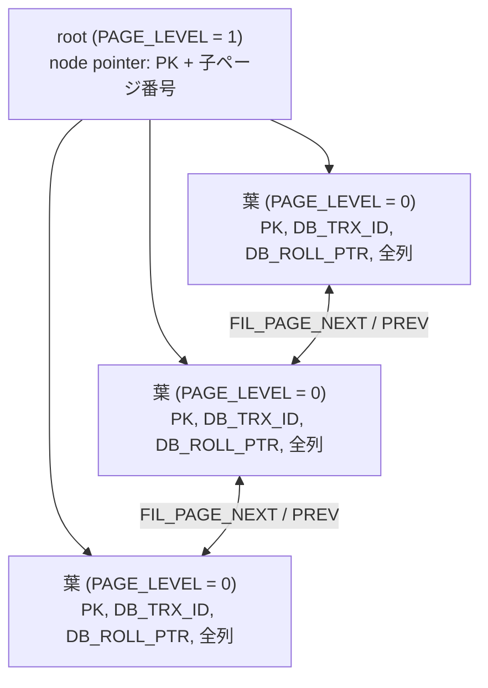

> **前提**: [B+tree](./btree-basics/) / [物理構造](./innodb-physical-walkthrough/)

## 何を学んだか

「テーブルにインデックスを張る」という言い方は InnoDB では正確ではない。**テーブルそのものが 1 本の B+tree** で、そのキーが PRIMARY KEY だ。行データは葉ページのレコードとして存在し、葉の外に「テーブル本体」は存在しない。

クラスタードインデックスの葉レコードのフィールド順はこうなる。

```
[ PK 列 1 ] ... [ PK 列 n ] [ DB_TRX_ID ] [ DB_ROLL_PTR ] [ 残りの全列 ]
     ^^^^^^^^^^^^^^^^^^^^     6 バイト       7 バイト        定義順
     ここまでが n_uniq (キーとして比較される範囲)
```

PK が宣言されていなければ、その先頭に 6 バイトの `DB_ROW_ID` が入る。

```
[ DB_ROW_ID ] [ DB_TRX_ID ] [ DB_ROLL_PTR ] [ 全列 ]
   6 バイト
```

非葉ページのレコード (node pointer) は違う形をしている。

```
[ PK 列 1 ] ... [ PK 列 n ] [ 子ページ番号 ]
                                4 バイト
```

**node pointer には `DB_TRX_ID` も `DB_ROLL_PTR` も他の列も入らない**。キーと子ページ番号だけだ。だから非葉ページの fan-out は PK の長さだけで決まる。

木として見るとこうなる。



そして重要な帰結が 2 つある。

- **PK の値がそのまま全セカンダリインデックスの葉に複製される** ([セカンダリインデックス](./secondary-index/))。PK が長いとテーブル全体が太る
- **挿入位置は PK が決める**。PK が単調増加なら常に右端に挿入され、ランダムなら木の全体に散らばる。これが UUID を PK にしたときの書き込み性能の差になる

## なぜそうなっているか

### なぜテーブル本体を作らず B+tree に入れるのか

行を PK で引く問い合わせが、インデックスを引いてからテーブルを引く 2 段ではなく、**B+tree を 1 回降りるだけ**で終わる。PK 検索が支配的なワークロードでは、これが一番効く。MyISAM のように「データファイル + インデックスファイル」に分けると、PK 検索でも必ず 2 回の I/O が要る。

代償が 2 つある。1 つは **PK 以外の検索が必ず 2 段になる**こと ([セカンダリインデックス](./secondary-index/))。もう 1 つは **PK の値が全セカンダリインデックスに複製される**こと。

### なぜ `DB_TRX_ID` と `DB_ROLL_PTR` が PK の直後なのか

`n_uniq` の直後、つまり「キーの終わり」に置くことで、キーの比較範囲とシステム列の位置が両方とも `n_uniq` から計算できる。node pointer は先頭 `n_uniq` 個をコピーするだけなので、システム列が自動的に除外される。

`DB_ROLL_PTR` (7 バイト) は undo レコードのアドレスで、これを辿ると 1 つ前の版が得られる ([undo ログ](./undo-log/))。**版の鎖はクラスタードインデックスにしかない**。セカンダリインデックスの葉に `DB_ROLL_PTR` がないのはこのためで、それが[セカンダリインデックスと MVCC](./secondary-index-visibility/) の面倒さの根源になる。

### なぜ PK がないと `DB_ROW_ID` なのか

B+tree はキーで順序づけられている必要がある。行を一意に特定できるキーがないと、同じキーの行を区別できず、更新も削除もできない。だから何かしらの一意なキーが要る。

`DB_ROW_ID` を**単調増加**にしてあるのは、挿入が常に右端になるようにするためだ。ランダムな値にすると PK なしテーブルの挿入がすべて木の全体に散らばる。ただしグローバルなカウンタなので、複数テーブルに同時に挿入すると `dict_sys` の mutex で直列化する。

## ソースコードのどこか

### 隠し列は 3 本

```cpp title="storage/innobase/include/data0type.h"
/** row id: a 48-bit integer */
constexpr uint32_t DATA_ROW_ID = 0;
/** stored length for row id */
constexpr uint32_t DATA_ROW_ID_LEN = 6;

/** Transaction id: 6 bytes */
constexpr size_t DATA_TRX_ID = 1;

/** Transaction ID type size in bytes. */
constexpr size_t DATA_TRX_ID_LEN = 6;

/** Rollback data pointer: 7 bytes */
constexpr size_t DATA_ROLL_PTR = 2;

/** Rollback data pointer type size in bytes. */
constexpr size_t DATA_ROLL_PTR_LEN = 7;

/** number of system columns defined above */
constexpr uint32_t DATA_N_SYS_COLS = 3;
```

[`data0type.h#L177`](https://github.com/mysql/mysql-server/blob/mysql-8.4.11/storage/innobase/include/data0type.h#L177)。`DB_TRX_ID` 6 + `DB_ROLL_PTR` 7 = **13 バイト**が常に付き、クラスタリングキーが一意でないときだけ `DB_ROW_ID` 6 が加わって 19 バイトになる。「PK がなければ」ではなく「一意なクラスタリングキーがなければ」が正確な条件で、判定は `dict_index_build_internal_clust` の `if (!dict_index_is_unique(index))` にある。

3 本ともテーブルの列として dictionary に登録される。

```cpp title="storage/innobase/dict/dict0dict.cc"
void dict_table_add_system_columns(dict_table_t *table, mem_heap_t *heap) {
  ...
  /* NOTE: the system columns MUST be added in the following order
  (so that they can be indexed by the numerical value of DATA_ROW_ID,
  etc.) and as the last columns of the table memory object.
  The clustered index will not always physically contain all system
  columns.
  Intrinsic table don't need DB_ROLL_PTR as UNDO logging is turned off
  for these tables. */
  ...
  dict_mem_table_add_col(table, heap, "DB_ROW_ID", DATA_SYS,
                         DATA_ROW_ID | DATA_NOT_NULL, DATA_ROW_ID_LEN, false,
                         phy_pos, v_added, v_dropped);

  dict_mem_table_add_col(table, heap, "DB_TRX_ID", DATA_SYS,
                         DATA_TRX_ID | DATA_NOT_NULL, DATA_TRX_ID_LEN, false,
                         phy_pos, v_added, v_dropped);

  if (!table->is_intrinsic()) {
    dict_mem_table_add_col(table, heap, "DB_ROLL_PTR", DATA_SYS,
                           DATA_ROLL_PTR | DATA_NOT_NULL, DATA_ROLL_PTR_LEN,
                           false, phy_pos, v_added, v_dropped);
```

[`dict0dict.cc#L1131`](https://github.com/mysql/mysql-server/blob/mysql-8.4.11/storage/innobase/dict/dict0dict.cc#L1131)。コメントの「クラスタードインデックスが常に全システム列を物理的に含むわけではない」がまさに `DB_ROW_ID` のことで、PK があれば含まれない。

### `dict_index_build_internal_clust` が組み立てる

ユーザが `PRIMARY KEY (a, b)` と書いた `dict_index_t` は、dictionary キャッシュに入る前に**内部表現に書き換えられる**。

```cpp title="storage/innobase/dict/dict0dict.cc"
  if (dict_index_is_unique(index)) {
    /* Only the fields defined so far are needed to identify
    the index entry uniquely */

    new_index->n_uniq = new_index->n_def;
  } else {
    /* Also the row id is needed to identify the entry */
    new_index->n_uniq = 1 + new_index->n_def;
  }
```

[`dict_index_build_internal_clust` (`dict0dict.cc#L3107`)](https://github.com/mysql/mysql-server/blob/mysql-8.4.11/storage/innobase/dict/dict0dict.cc#L3107)。続いてシステム列を差し込む。

```cpp title="storage/innobase/dict/dict0dict.cc"
  /* Add ROW ID */
  if (!dict_index_is_unique(index)) {
    dict_index_add_col(new_index, table, table->get_sys_col(DATA_ROW_ID), 0,
                       true);
    set_phy_pos(table->get_sys_col(DATA_ROW_ID));
    trx_id_pos++;
  }

  /* Add TRX ID */
  dict_index_add_col(new_index, table, table->get_sys_col(DATA_TRX_ID), 0,
                     true);
```

そして最後に、まだ含まれていないユーザ列を全部追加する。

```cpp title="storage/innobase/dict/dict0dict.cc"
  /* Add to new_index non-system columns of table not yet included there */
  for (size_t i = 0; i < table->get_n_user_cols(); i++) {
    dict_col_t *col = table->get_col(i);
    ut_ad(col->mtype != DATA_SYS);

    if (indexed[col->ind]) {
      continue;
    }

    dict_index_add_col(new_index, table, col, 0, true);
```

**この最後のループが「テーブル = クラスタードインデックス」の実装そのもの**だ。PK に含まれていない列はすべてクラスタードインデックスのフィールドとして追加される。`n_uniq` (比較に使う範囲) と `n_fields` (レコードに入る範囲) が別の数になるのはここから来る。

`indexed[]` のマーク処理には条件がついている。

```cpp title="storage/innobase/dict/dict0dict.cc"
    /* If there is only a prefix of the column in the index
    field, do not mark the column as contained in the index */

    if (field->prefix_len == 0) {
      indexed[field->col->ind] = true;
    }
```

**PK が接頭辞インデックス (`PRIMARY KEY (name(10))`) の場合、その列は「含まれていない」扱いになり、フルの列がもう一度追加される**。同じ列のデータが 2 回入る。

### `trx_id_offset` — 固定長 PK のショートカット

```cpp title="storage/innobase/dict/dict0dict.cc"
  for (size_t i = 0; i < trx_id_pos; i++) {
    ulint fixed_size =
        new_index->get_col(i)->get_fixed_size(dict_table_is_comp(table));

    if (fixed_size == 0) {
      new_index->trx_id_offset = 0;

      break;
    }

    dict_field_t *field = new_index->get_field(i);
    if (field->prefix_len > 0) {
      new_index->trx_id_offset = 0;

      break;
    }
    ...
    new_index->trx_id_offset = fixed_size;
```

PK の列がすべて固定長で接頭辞でなければ、`DB_TRX_ID` は origin から固定オフセットにある。`trx_id_offset` にその値が入り、可変長ヘッダを解析せずに `DB_TRX_ID` を読める。**`BIGINT` の PK と `VARCHAR` の PK の差は、比較コストだけでなくここにも出る**。可視性判定 ([read view](./read-view-and-visibility/)) は全行で `DB_TRX_ID` を読むので、頻度が高い。

### `DB_ROW_ID` はインスタンスで 1 本のカウンタ

```cpp title="storage/innobase/include/dict0boot.ic"
static inline row_id_t dict_sys_get_new_row_id(void) {
  row_id_t id;

  dict_sys_mutex_enter();

  id = dict_sys->row_id;

  if (0 == (id % DICT_HDR_ROW_ID_WRITE_MARGIN)) {
    dict_hdr_flush_row_id();
  }

  dict_sys->row_id++;

  dict_sys_mutex_exit();

  return (id);
}
```

[`dict0boot.ic#L36`](https://github.com/mysql/mysql-server/blob/mysql-8.4.11/storage/innobase/include/dict0boot.ic#L36)。**テーブルごとではなく `dict_sys` に 1 つ**しかない。PK のないテーブルが 10 個あれば、10 個が同じカウンタを取り合い、同じ `dict_sys` の mutex を取る。`DICT_HDR_ROW_ID_WRITE_MARGIN = 256` ごとに dictionary ヘッダページへ書き戻す (クラッシュ時に 256 個飛ばして再開するため)。

呼ぶのは挿入経路の最初のステップだ。

```cpp title="storage/innobase/row/row0ins.cc"
static inline void row_ins_alloc_row_id_step(
    ins_node_t *node) /*!< in: row insert node */
{
  row_id_t row_id;

  ut_ad(node->state == INS_NODE_ALLOC_ROW_ID);

  if (dict_index_is_unique(node->table->first_index())) {
    /* No row id is stored if the clustered index is unique */

    return;
  }
  ...
  row_id = dict_sys_get_new_row_id();
```

[`row0ins.cc#L3501`](https://github.com/mysql/mysql-server/blob/mysql-8.4.11/storage/innobase/row/row0ins.cc#L3501)。

なお **PK がなくても、`NOT NULL` の UNIQUE インデックスがあればそれがクラスタードインデックスになる**。`dict_index_is_unique(first_index())` が真なら `DB_ROW_ID` は要らない。

### node pointer レコード

非葉ページのレコードを組み立てるのは `dict_index_build_node_ptr` だ。

```cpp title="storage/innobase/dict/dict0dict.cc"
  } else {
    n_unique = dict_index_get_n_unique_in_tree_nonleaf(index);
  }

  tuple = dtuple_create(heap, n_unique + 1);

  /* When searching in the tree for the node pointer, we must not do
  comparison on the last field, the page number field, as on upper
  levels in the tree there may be identical node pointers with a
  different page number; therefore, we set the n_fields_cmp to one
  less: */

  dtuple_set_n_fields_cmp(tuple, n_unique);

  dict_index_copy_types(tuple, index, n_unique);

  buf = static_cast<byte *>(mem_heap_alloc(heap, 4));

  mach_write_to_4(buf, page_no);

  field = dtuple_get_nth_field(tuple, n_unique);
  dfield_set_data(field, buf, 4);

  dtype_set(dfield_get_type(field), DATA_SYS_CHILD, DATA_NOT_NULL, 4);

  rec_copy_prefix_to_dtuple(tuple, rec, index, n_unique, heap);
  dtuple_set_info_bits(tuple,
                       dtuple_get_info_bits(tuple) | REC_STATUS_NODE_PTR);
```

[`dict0dict.cc#L3796`](https://github.com/mysql/mysql-server/blob/mysql-8.4.11/storage/innobase/dict/dict0dict.cc#L3796)。`rec_copy_prefix_to_dtuple` が**子ページの先頭レコードから最初の `n_unique` 個のフィールドだけコピー**し、そこに 4 バイトの `DATA_SYS_CHILD` を足す。

クラスタードインデックスの `n_unique_in_tree` は `n_uniq` (= PK の列数、PK が無ければ `DB_ROW_ID` の 1) だ ([`dict0dict.ic`](https://github.com/mysql/mysql-server/blob/mysql-8.4.11/storage/innobase/include/dict0dict.ic))。だから **node pointer は `PK + 4 バイト + レコードヘッダ 5 バイト`** で、行の他の列は一切入らない。

`n_fields_cmp` を 1 つ減らしているのは、比較でページ番号を見ないためだ。同じキーの node pointer が別のページ番号で複数存在しうる状況 (分割の途中) でも、比較結果が安定する。

## どう活かすか

### 単調増加 PK と UUID の差

`AUTO_INCREMENT` の PK なら、挿入は常に木の右端のページに行く。B+tree はこれを検出して**右詰めの分割**をする。

```cpp title="storage/innobase/btr/btr0btr.cc"
  /* We use eager heuristics: if the new insert would be right after
  the previous insert on the same page, we assume that there is a
  pattern of sequential inserts here. */

  if (page_header_get_ptr(page, PAGE_LAST_INSERT) == insert_point) {
```

[`btr_page_get_split_rec_to_right` (`btr0btr.cc#L1703`)](https://github.com/mysql/mysql-server/blob/mysql-8.4.11/storage/innobase/btr/btr0btr.cc#L1703)。連番と判定されると、ページを半分に割らず**末尾 1〜2 件だけを新ページに移す**。左側のページはほぼ満杯のまま封をされ、以降触られない。結果、ページ充填率はほぼ 100%、ダーティページも右端の数枚だけになる。

UUIDv4 を PK にすると、この判定が毎回外れる。挿入は木の全体に散らばり、

- 分割は中央で起き、ページ充填率は 50% 前後に落ち着く。**テーブルサイズが 1.5〜2 倍**になる
- 触るページが毎回違うので、バッファプールに載らない木ではランダム読み込みが発生する ([LRU と midpoint 挿入](./lru-and-midpoint/))
- ダーティページが木全体に広がり、[page cleaner](./flush-list-and-page-cleaner/) の書き込み量が増える

さらに `CHAR(36)` の UUID なら PK だけで 36 バイト (utf8mb4 なら 144 バイト) になり、全セカンダリインデックスがその分太る。UUID を使うなら `BINARY(16)` にして、時刻を先頭に持ってくる並べ替え (`UUID_TO_BIN(uuid, 1)`) をかけるのが定石で、**その定石が効く理由がこの `PAGE_LAST_INSERT` の判定**だ。

### PK が長いとセカンダリインデックスが太る

セカンダリインデックスの葉には PK の値が入る ([セカンダリインデックス](./secondary-index/))。PK が 144 バイトでセカンダリインデックスが 5 本あれば、1 行あたり 720 バイトが PK の複製に使われる。

同時に node pointer も PK 列だけで構成されるので、**PK が長いと非葉ページの fan-out が落ちて木が深くなる**。16KB ページで PK が 8 バイトなら node pointer は 20 バイト弱で 800 件近く入るが、144 バイトなら 100 件程度になる。100 万行の木が 3 段から 4 段になり、全検索が 1 ページ分深くなる。

### PK を宣言しないコスト

- 1 行あたり 6 バイト増える
- 挿入が `dict_sys` の mutex を通る (全テーブル共通)
- `DB_ROW_ID` は SQL から見えないので、**行を一意に指す手段がない**。ROW ベースのレプリケーションで applier が行を探すとき、PK も UNIQUE もないテーブルはフルスキャンになる ([applier と並列適用](./applier-and-mta/))
- `SELECT ... FOR UPDATE` の範囲が広くなりやすい

PK なしテーブルは `sys.schema_tables_with_full_table_scans` ではなく、`SELECT * FROM sys.schema_redundant_indexes` でもなく、`INFORMATION_SCHEMA.TABLES` と `STATISTICS` を突き合わせて洗い出す。8.4 では `sql_require_primary_key` でそもそも作れなくできる。

### 接頭辞 PK は列が二重に入る

`PRIMARY KEY (url(100))` のような接頭辞 PK にすると、上で見たとおり `indexed[]` にマークされず、`url` のフル値がクラスタードインデックスにもう一度追加される。**接頭辞 100 バイト + フル値**が両方保存される。接頭辞 PK はまず選ばない。
