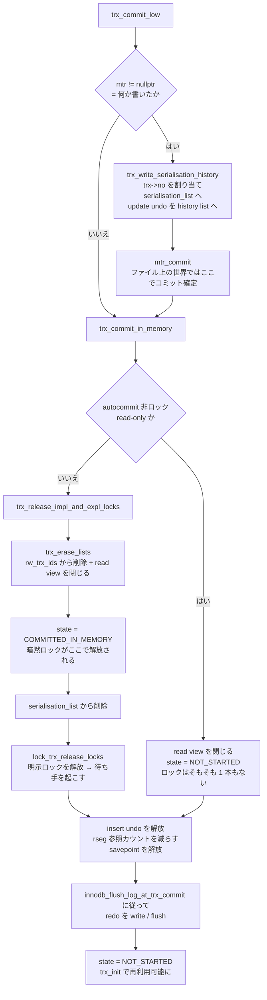

## 何を学んだか

`COMMIT` を投げると InnoDB 側で何が起きるか。順序が全部意味を持っている。

1. **`trx->no` を貰い、undo を history list に積む** — purge が処理する順序がここで決まる
2. **mtr をコミットする** — ファイル上の世界ではこの瞬間にコミット済みになる
3. **`rw_trx_ids` から自分の ID を抜く** — これ以降に作られた read view は自分の変更を見る
4. **read view を閉じる**
5. **状態を `COMMITTED_IN_MEMORY` にする** — **暗黙ロックが解放される瞬間**
6. **`serialisation_list` から抜ける**
7. **明示ロックを解放する** — 待っていたスレッドが起こされる
8. **redo を `innodb_flush_log_at_trx_commit` に従って書く / flush する**

**暗黙ロックのほうが明示ロックより先に消える。** そして 3 と 6 の順序が逆になると purge が壊れる。ソースにはどちらの順序についてもコメントが付いている。

この順序は REPEATABLE READ を基準にしている。**READ COMMITTED 以下では、7 の時点で外れるロックが少ない**——2 相コミットを通る経路なら `trx_prepare` がギャップロックだけを先に解放しているからだ ([RR と RC のページ](./locking-in-rr-vs-rc/))。可視性の順序 (3〜6) は分離レベルによらず同じ。

ロールバックはこれと対称ではない。**undo レコードを 1 本ずつ逆適用してから、最後に `trx_commit` を呼ぶ。** つまりロールバックの出口はコミットと同じで、ロックが外れるのもそこだ。逆適用の分だけコミットより遅い。

そしてもう 1 つ。**文単位のロールバックではロックが 1 つも解放されない。** `Lock wait timeout exceeded` を受け取ったとき、既定では文だけが巻き戻り、その文が取ったロックは残ったままトランザクションが続く。

## ソースコードのどこか

### コミットの経路

`ha_commit_low` → [`innobase_commit` (`ha_innodb.cc#L6013`)](https://github.com/mysql/mysql-server/blob/mysql-8.4.11/storage/innobase/handler/ha_innodb.cc#L6013) → `innobase_commit_low` → [`trx_commit` (`trx0trx.cc#L2257`)](https://github.com/mysql/mysql-server/blob/mysql-8.4.11/storage/innobase/trx/trx0trx.cc#L2257) → [`trx_commit_low` (L2165)](https://github.com/mysql/mysql-server/blob/mysql-8.4.11/storage/innobase/trx/trx0trx.cc#L2165)。

`trx_commit` の最初の判断が効いている。

```cpp title="storage/innobase/trx/trx0trx.cc"
  if (trx_is_rseg_updated(trx)) {
    mtr = &local_mtr;
    ...
    mtr_start_sync(mtr);

  } else {
    mtr = nullptr;
  }

  trx_commit_low(trx, mtr);
```

**ロールバックセグメントを一度も触っていなければ mtr すら開かない。** 読むだけのトランザクションのコミットは、ほとんど何もしない。



### 順序を決めているコメント

[`trx_release_impl_and_expl_locks` (`trx0trx.cc#L1857`)](https://github.com/mysql/mysql-server/blob/mysql-8.4.11/storage/innobase/trx/trx0trx.cc#L1857) が順序の本体だ。まず `rw_trx_ids` から抜く。

```cpp title="storage/innobase/trx/trx0trx.cc"
  if (trx->id > 0) {
    /* For consistent snapshot, we need to remove current
    transaction from running transaction id list for mvcc
    before doing commit and releasing locks. */
    trx_erase_lists(trx);
  }
```

[`trx_erase_lists` (L1834)](https://github.com/mysql/mysql-server/blob/mysql-8.4.11/storage/innobase/trx/trx0trx.cc#L1834) は `trx_sys->mutex` の下で `rw_trx_ids` から ID を消し、同じ流れで read view も閉じる ([L1850](https://github.com/mysql/mysql-server/blob/mysql-8.4.11/storage/innobase/trx/trx0trx.cc#L1850))。

次が状態遷移で、ここにこの章でもっとも重要なコメントが付いている。

```cpp title="storage/innobase/trx/trx0trx.cc"
  auto state_transition = [&]() {
    trx_mutex_enter(trx);
    /* Please consider this particular point in time as the moment the trx's
    implicit locks become released.
    This change is protected by both Trx_shard's mutex and trx->mutex. */
    trx->state.store(TRX_STATE_COMMITTED_IN_MEMORY, std::memory_order_relaxed);
    trx_mutex_exit(trx);
  };
```

[L1896-L1917](https://github.com/mysql/mysql-server/blob/mysql-8.4.11/storage/innobase/trx/trx0trx.cc#L1896)。**暗黙ロックはこの 1 行で消える。** レコードの `DB_TRX_ID` は書き換わらないが、その ID のトランザクションが「もうアクティブではない」ことになるので、`lock_rec_convert_impl_to_expl` は変換しなくなる ([ロックのページ](./lock-modes-and-types/))。コメントは「他人がこれを確かめる方法は 2 つある」として、`trx_rw_is_active` を使う道と `trx->state` を見る道を挙げている。

続いて `serialisation_list` から抜けるが、その順序にも理由が書かれている。

```cpp title="storage/innobase/trx/trx0trx.cc"
  /* It is important to remove the transaction from the serialisation list
  after it is erased from the rw_trx_ids / rw_trx_list (not before!).
  Otherwise a read-view could be created, which could still pretend that
  changes of this transaction are invisible, but related undo records could
  become purged (because trx->no would no longer protect them). */
```

[L1932](https://github.com/mysql/mysql-server/blob/mysql-8.4.11/storage/innobase/trx/trx0trx.cc#L1932)。**逆順にすると「見えないと主張する read view」と「その版を消してよいと判断する purge」が同時に成立する。** MVCC が壊れる典型的な競合で、順序 1 つで防いでいる。

最後に明示ロックの解放。

```cpp title="storage/innobase/trx/trx0trx.cc"
  lock_trx_release_locks(trx);
}
```

[L1959](https://github.com/mysql/mysql-server/blob/mysql-8.4.11/storage/innobase/trx/trx0trx.cc#L1959)。

### 明示ロックの解放は参照カウントを待つ

[`lock_trx_release_locks` (`lock0lock.cc#L5904`)](https://github.com/mysql/mysql-server/blob/mysql-8.4.11/storage/innobase/lock/lock0lock.cc#L5904) の頭に待ちループがある。

```cpp title="storage/innobase/lock/lock0lock.cc"
  if (trx_is_referenced(trx)) {
    while (trx_is_referenced(trx)) {
      trx_mutex_exit(trx);

      DEBUG_SYNC_C("waiting_trx_is_not_referenced");

      /** Doing an implicit to explicit conversion
      should not be expensive. */
      ut_delay(ut::random_from_interval_fast(0, srv_spin_wait_delay));

      trx_mutex_enter(trx);
    }
  }
```

**他人がこのトランザクションの暗黙ロックを明示ロックに変換している最中なら、それが終わるまで待つ。** 参照カウントは `lock_rec_convert_impl_to_expl` が `trx_rw_is_active(trx_id, true)` を呼ぶときに立て、`trx_release_reference` で落とす。

その後 `while (!locksys::try_release_all_locks(trx))` のループに入る ([L5931](https://github.com/mysql/mysql-server/blob/mysql-8.4.11/storage/innobase/lock/lock0lock.cc#L5931))。lock_sys の latching order の都合で 1 発では終わらない ([lock_sys のシャーディング](./lock-sys-sharding/))。

### redo の flush は 2 段構え

`trx_commit_in_memory` の中で `srv_flush_log_at_trx_commit` の switch が回る。

```cpp title="storage/innobase/trx/trx0trx.cc"
  switch (srv_flush_log_at_trx_commit) {
    case 2:
      /* Write the log but do not flush it to disk */
      flush = false;
      [[fallthrough]];
    case 1:
      /* Write the log and optionally flush it to disk */
      wait_stats = log_write_up_to(*log_sys, lsn, flush);
      ...
      return;
    case 0:
      /* Do nothing */
      return;
  }
```

[`trx_flush_log_if_needed_low` (`trx0trx.cc#L1758`)](https://github.com/mysql/mysql-server/blob/mysql-8.4.11/storage/innobase/trx/trx0trx.cc#L1758)。ただし**グループコミットのときはここで flush しない**。`innobase_commit` が `trx->flush_log_later = true` を立てておき ([`ha_innodb.cc#L6108`](https://github.com/mysql/mysql-server/blob/mysql-8.4.11/storage/innobase/handler/ha_innodb.cc#L6108))、`trx_commit_in_memory` は `must_flush_log_later` に転記するだけで通過する ([L2078](https://github.com/mysql/mysql-server/blob/mysql-8.4.11/storage/innobase/trx/trx0trx.cc#L2078))。実際の書き込みは、ロック解放後に呼ばれる [`trx_commit_complete_for_mysql` (L2498)](https://github.com/mysql/mysql-server/blob/mysql-8.4.11/storage/innobase/trx/trx0trx.cc#L2498) で行う。

**つまり `fsync` はロックの解放より後だ。** 待っていたトランザクションは、こちらの redo がディスクに届く前に動き出せる。この順序で耐久性が壊れないのは、後続トランザクションのコミットが必ずこちらの LSN 以降を含む形で flush されるからで、2PC の順序保証と合わせて[グループコミットのページ](./two-phase-commit-and-group-commit/)で扱う。

### 後片付け

`trx_commit_in_memory` の残りでやることは 4 つ。

- **insert undo の解放** ([L2037](https://github.com/mysql/mysql-server/blob/mysql-8.4.11/storage/innobase/trx/trx0trx.cc#L2037)) — INSERT の undo は誰にも要らないので捨てる ([undo ログのページ](./undo-log/))
- **rseg の参照カウントを減らす** ([L2114](https://github.com/mysql/mysql-server/blob/mysql-8.4.11/storage/innobase/trx/trx0trx.cc#L2114)) — undo テーブルスペースの truncate がこれを見て待つ。コメントが「この時点より前に減らしてはいけない」と警告している
- **savepoint の解放** ([L2126](https://github.com/mysql/mysql-server/blob/mysql-8.4.11/storage/innobase/trx/trx0trx.cc#L2126))
- **`state = NOT_STARTED` にして `trx_init`** ([L2146-L2154](https://github.com/mysql/mysql-server/blob/mysql-8.4.11/storage/innobase/trx/trx0trx.cc#L2146)) — `trx_t` を次の文で使い回す

### ロールバック — 逆適用してから commit する

[`trx_rollback_to_savepoint_low` (`trx0roll.cc#L79`)](https://github.com/mysql/mysql-server/blob/mysql-8.4.11/storage/innobase/trx/trx0roll.cc#L79) が本体で、`savept` が `nullptr` かどうかで完全ロールバックと部分ロールバックが分かれる。

```cpp title="storage/innobase/trx/trx0roll.cc"
  if (savept == nullptr) {
    trx_rollback_finish(trx);
    MONITOR_INC(MONITOR_TRX_ROLLBACK);
  } else {
    trx->lock.que_state = TRX_QUE_RUNNING;
    MONITOR_INC(MONITOR_TRX_ROLLBACK_SAVEPOINT);
  }
```

そして `trx_rollback_finish` の中身はこれだけだ。

```cpp title="storage/innobase/trx/trx0roll.cc"
static void trx_rollback_finish(trx_t *trx) /*!< in: transaction */
{
  trx_commit(trx);

  trx->mod_tables.clear();

  trx->lock.que_state = TRX_QUE_RUNNING;
}
```

[L1101](https://github.com/mysql/mysql-server/blob/mysql-8.4.11/storage/innobase/trx/trx0roll.cc#L1101)。**完全ロールバックの出口は `trx_commit` である。** だからロックが外れるのも read view が閉じるのもコミットとまったく同じ場所だ。

**逆に、部分ロールバック (savepoint / 文単位) は `trx_commit` を呼ばない。** `que_state` を戻すだけで、ロックは 1 本も解放されない。

undo の逆適用は [`trx_rollback_start` (L1073)](https://github.com/mysql/mysql-server/blob/mysql-8.4.11/storage/innobase/trx/trx0roll.cc#L1073) が組むクエリグラフで走り、[`trx_roll_pop_top_rec_of_trx` (L1019)](https://github.com/mysql/mysql-server/blob/mysql-8.4.11/storage/innobase/trx/trx0roll.cc#L1019) が `undo_no` の大きいほうから 1 本ずつ取り出す。ある程度進むと [`trx_roll_try_truncate` (L860)](https://github.com/mysql/mysql-server/blob/mysql-8.4.11/storage/innobase/trx/trx0roll.cc#L860) が undo ログの末尾を切り詰めてページを返す。

### 文単位のロールバック

```cpp title="storage/innobase/trx/trx0roll.cc"
    case TRX_STATE_ACTIVE:
      assert_trx_nonlocking_or_in_list(trx);

      trx->op_info = "rollback of SQL statement";

      err = trx_rollback_to_savepoint(trx, &trx->last_sql_stat_start);
```

[`trx_rollback_last_sql_stat_for_mysql` (`trx0roll.cc#L284`)](https://github.com/mysql/mysql-server/blob/mysql-8.4.11/storage/innobase/trx/trx0roll.cc#L284)。**savepoint は `trx->last_sql_stat_start`**、つまり「この文が始まったときの `undo_no`」だ。これは `trx_mark_sql_stat_end` ([`trx0trx.cc#L2516`](https://github.com/mysql/mysql-server/blob/mysql-8.4.11/storage/innobase/trx/trx0trx.cc#L2516)) が文の終わりに更新している。

`Lock wait timeout exceeded` のときにこの経路が使われる。

```cpp title="storage/innobase/row/row0mysql.cc"
    case DB_LOCK_WAIT_TIMEOUT:
      if (row_rollback_on_timeout) {
        trx_rollback_to_savepoint(trx, nullptr);
        break;
      }
      [[fallthrough]];
```

[`row_mysql_handle_errors` (`row0mysql.cc#L672`)](https://github.com/mysql/mysql-server/blob/mysql-8.4.11/storage/innobase/row/row0mysql.cc#L672)。`innodb_rollback_on_timeout` が既定 `OFF` なので、**通常は文だけが戻り、ロックは残る**。デッドロックのほうは `trx_rollback_to_savepoint(trx, nullptr)` で完全ロールバックになる ([デッドロック検出のページ](./deadlock-detection/))。

### 文の終わりで解放されるもの

コミットしなくても文の終わりに片付くものがある。

```cpp title="storage/innobase/handler/ha_innodb.cc"
    /* If we had reserved the auto-inc lock for some
    table in this SQL statement we release it now */

    if (!read_only) {
      lock_unlock_table_autoinc(trx);
    }
    ...
    trx_mark_sql_stat_end(trx);
```

[`innobase_commit` の非コミット分岐 (`ha_innodb.cc#L6144`)](https://github.com/mysql/mysql-server/blob/mysql-8.4.11/storage/innobase/handler/ha_innodb.cc#L6144)。**AUTO-INC ロックは文の終わりで外れる**([INSERT のロックのページ](./insert-and-duplicate-check/))。`trx_mark_sql_stat_end` は `lock_on_statement_end(trx)` も呼び、ギャップロックの継承フラグ `trx->lock.inherit_all` をクリアする ([RR と RC のページ](./locking-in-rr-vs-rc/))。

## なぜそうなっているか

**「暗黙ロック → 明示ロック」の順で解放するのは、暗黙ロックの解放が「状態を変える」だけで済むからだ。** レコードを 1 つも触らずに、`trx->state` を書き換えるだけで全行の暗黙ロックが一斉に消える。一方、明示ロックはシャードを 1 つずつ latch して外す必要がある。**先に安いほうを済ませて、待っている側が早く動けるようにしている**とも読める。

**参照カウントを待つのは、変換の途中で状態を変えると片付け漏れが起きるからだ。** `lock_rec_convert_impl_to_expl_for_trx` は他人の名義でロックを作るので、その最中にトランザクションが消えると、誰も所有していないロックが残る。`trx_is_referenced` が 0 になるまで待つのはそのためだ。コメントが「暗黙から明示への変換は高くないはず」と楽観している。

**mtr のコミットとメモリ上のコミットを分けているのは、耐久性と可視性が別の話だからだ。** `mtr_commit` の時点で「ファイルベースの世界ではコミットされた」ことになるが、まだ redo はディスクに届いていないし、他のトランザクションからも見えない。可視性が変わるのは `rw_trx_ids` から抜けたときで、耐久性が確定するのは `log_write_up_to` が返ったときだ。**この 3 つの時刻がずれていることが、グループコミットや `innodb_flush_log_at_trx_commit=2` の議論の前提になる。**

**ロールバックの出口をコミットにしたのは、後片付けが完全に同じだからだ。** ロックの解放、read view のクローズ、undo の history list への移動、`trx_t` の初期化——ロールバックしたトランザクションにも全部必要になる。`ROLLBACK` されたトランザクションの update undo も history list に積まれ、purge の対象になる。「取り消した」という事実自体が、他のトランザクションから見た版の履歴の一部だからだ。

**部分ロールバックでロックを解放しないのは、2 相ロック (2PL) を守るためだ。** 途中で取ったロックを途中で返せば、その隙間に他人が入り込める。文が失敗しても、トランザクションはまだ生きていて同じ整合性を要求している。

**`innodb_rollback_on_timeout` の既定が OFF なのは、5.0.13 での方針変更だ。** ソースのコメントが「5.0.13 から、ロック待ちタイムアウトでは MySQL に最新の SQL 文だけをロールバックさせる。以前はトランザクション全体をロールバックしていた」と書いている。sysvar の説明も `for 4.x compatibility (disabled by default)` となっていて、ON にするのは互換性のためだと明言されている。

## どう活かすか

**大量 DELETE / UPDATE のロールバックはコミットよりずっと遅い。** コミットは `trx->no` を配って undo を history list に繋ぐだけだが、ロールバックは `undo_no` の本数だけ逆適用する。**100 万行の DELETE をロールバックすると、DELETE 自体と同程度かそれ以上の時間がかかる**。しかもその間ロックは解放されない。巨大な DML は分割してコミットするのが、失敗時の回復時間という意味でも正しい。

**「`KILL` したのに戻ってこない」の多くはロールバックの最中だ。** `SHOW ENGINE INNODB STATUS` の TRANSACTIONS セクションに `ROLLING BACK` と、進捗を示す `undo log entries N` が出る。ここでサーバを再起動しても、[クラッシュリカバリ](./crash-recovery/)がロールバックを引き継ぐだけで速くはならない。

**`Lock wait timeout exceeded` を受け取ったら明示的に `ROLLBACK` する。** 既定ではトランザクションが生き残っており、失敗した文が取ったロックも残っている。そのまま次の文を投げると、中途半端な状態で処理を続けることになる。**アプリのエラーハンドリングで「タイムアウトならロールバックしてやり直す」を既定の作法にしておく。** デッドロック (`Deadlock found when trying to get lock`) のほうは InnoDB がすでにロールバックしているので、その必要はない。

**ロックが外れるのはコミット / ロールバックの瞬間しかない。** ロック待ちの被害者を見て回るより、**ロックを持ったまま長く生きているトランザクションを潰す**ほうが効く。「トランザクションを開いたまま外部 API を叩く」が致命的なのはこのためだ ([UPDATE の一生](./life-of-an-update/))。

**`innodb_flush_log_at_trx_commit=2` が失うのは「OS ごと落ちたときの直近のコミット」だけ。** プロセスがクラッシュしただけなら `write(2)` 済みのデータは OS が持っている。ただし**binlog の `sync_binlog=1` と組み合わせても完全にはならない**——InnoDB 側が失われればレプリカと source がずれる。両方を 1 にして初めて完全な耐久性になる。

**AUTO-INC ロックだけは文の終わりで外れる。** ロック待ちの原因を切り分けるとき、「行ロックは commit まで、AUTO-INC ロックは文の終わりまで、MDL は commit まで」という 3 つの寿命の違いを頭に置いておくと、`SHOW ENGINE INNODB STATUS` と `performance_schema.metadata_locks` のどちらを見るべきかが決まる ([MDL のページ](./metadata-locking/))。
