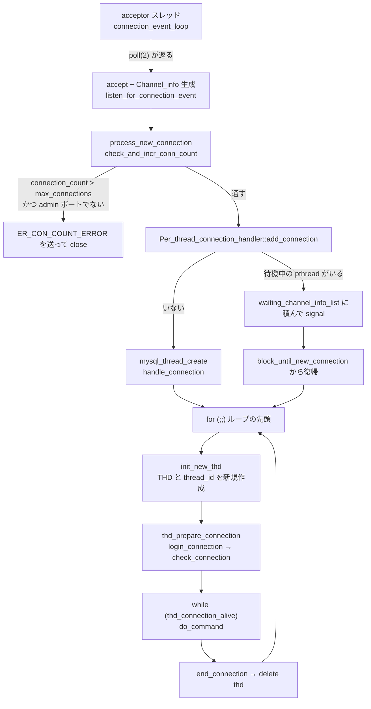

> **前提**: [プロセスとスレッド](./thread-model/)

## この層の責務

この層がやることは 3 つしかない。

1. **listen ソケットを待って `accept()` する** — acceptor スレッド 1 本 (admin インターフェースを別スレッドにした場合は 2 本)
2. **接続を受けてよいか決める** — `max_connections`、admin 予約枠、`max_user_connections`
3. **その接続に `THD` と OS スレッドを割り当てる** — thread cache から取るか、新しく `pthread_create` するか

ここから先、`do_command` のループに入ったら[パケットの層](./packet-framing/)の話になる。逆にこの層より上は SQL を一切知らない。`Channel_info` が握っているのはソケットと「TCP か Unix ドメインソケットか」「admin ポートから来たか」だけだ。

[スレッドモデルのページ](./thread-model/)で「1 接続 = 1 OS スレッド」と書いたが、その "1 本" がどこで作られ、いつプールに戻り、いつ捨てられるかはこのページで確定させる。



## 主要な型とその関係

### `Channel_info` — ソケットだけを運ぶ箱

acceptor スレッドが `accept()` した結果は、`THD` ではなく `Channel_info` になる。TCP なら `Channel_info_tcpip_socket`、Unix ドメインソケットなら `Channel_info_local_socket` だ。

```cpp title="sql/conn_handler/socket_connection.cc"
  Channel_info *channel_info = nullptr;
  if (listen_socket->m_socket_type == Socket_type::UNIX_SOCKET)
    channel_info = new (std::nothrow) Channel_info_local_socket(connect_sock);
  else
    channel_info = new (std::nothrow) Channel_info_tcpip_socket(
        connect_sock, (listen_socket->m_socket_interface ==
                       Socket_interface_type::ADMIN_INTERFACE));
```

[`Mysqld_socket_listener::listen_for_connection_event` (`socket_connection.cc#L1349`)](https://github.com/mysql/mysql-server/blob/mysql-8.4.11/sql/conn_handler/socket_connection.cc#L1349)。**`THD` をこの時点で作らないのが重要**で、`THD` は 1 接続あたり数十 KB を消費する重い構造体なので、接続数の上限判定より後、しかも受け持つスレッドが決まってから作る。

`Channel_info` が `is_admin_connection()` を答えられるのは、listen ソケットの種類がそのまま乗っているからだ。admin インターフェース (`admin_address` / `admin_port`) から来た接続だけがこのフラグを立てる。

### `Connection_acceptor<Listener>` — 4 行のイベントループ

acceptor 側のループは、テンプレート 1 個のヘッダに全部書いてある。

```cpp title="sql/conn_handler/connection_acceptor.h"
  void connection_event_loop() {
    Connection_handler_manager *mgr =
        Connection_handler_manager::get_instance();
    while (!connection_events_loop_aborted()) {
      Channel_info *channel_info = m_listener->listen_for_connection_event();
      if (channel_info != nullptr) mgr->process_new_connection(channel_info);
    }
  }
```

[`connection_acceptor.h#L61`](https://github.com/mysql/mysql-server/blob/mysql-8.4.11/sql/conn_handler/connection_acceptor.h#L61)。`Listener` は「`setup_listener` / `listen_for_connection_event` / `close_listener` を持つ何か」という duck typing で、名前付き interface はない。実際に入るのは `Mysqld_socket_listener` (TCP + Unix socket) と、Windows の named pipe / shared memory の実装だ。

**このループはシングルスレッドで、`accept()` も 1 本のスレッドしかやらない。** 秒間数千接続を張るようなワークロードでは、ここが直列点になる。

### `Connection_handler_manager` — 接続数の門番

`process_new_connection` が、通すか蹴るかを決める。

```cpp title="sql/conn_handler/connection_handler_manager.cc"
void Connection_handler_manager::process_new_connection(
    Channel_info *channel_info) {
  if (connection_events_loop_aborted() ||
      !check_and_incr_conn_count(channel_info->is_admin_connection())) {
    channel_info->send_error_and_close_channel(ER_CON_COUNT_ERROR, 0, true);
    delete channel_info;
    return;
  }

  if (m_connection_handler->add_connection(channel_info)) {
    inc_aborted_connects();
    delete channel_info;
  }
}
```

[`connection_handler_manager.cc#L254`](https://github.com/mysql/mysql-server/blob/mysql-8.4.11/sql/conn_handler/connection_handler_manager.cc#L254)。`ER_CON_COUNT_ERROR` が `Too many connections` の正体だ。

### `Per_thread_connection_handler` — thread cache

既定の接続ハンドラ。`Connection_handler` の実装はこれと `One_thread_connection_handler` (`--thread-handling=no-threads`、テスト用) の 2 つだけで、Enterprise の thread pool はプラグインとして `load_connection_handler` で差し込まれる。

thread cache の状態は 3 つのグローバルで表現されている。

| 変数                        | 意味                                                      |
| --------------------------- | --------------------------------------------------------- |
| `blocked_pthread_count`     | いま `block_until_new_connection` で寝ている pthread の数 |
| `max_blocked_pthreads`      | `thread_cache_size` システム変数の実体                    |
| `waiting_channel_info_list` | 起こす相手に渡す `Channel_info` のキュー                  |

`thread_cache_size` は明示しなければ起動時に自動設定される。

```cpp title="sql/mysqld.cc"
  /* Fix thread_cache_size. */
  if (!thread_cache_size_specified &&
      (Per_thread_connection_handler::max_blocked_pthreads =
           8 + max_connections / 100) > 100)
    Per_thread_connection_handler::max_blocked_pthreads = 100;
```

[`mysqld.cc#L6723`](https://github.com/mysql/mysql-server/blob/mysql-8.4.11/sql/mysqld.cc#L6723)。既定の `max_connections = 151` ([`sys_vars.h#L111`](https://github.com/mysql/mysql-server/blob/mysql-8.4.11/sql/sys_vars.h#L111) の `MAX_CONNECTIONS_DEFAULT`) なら 9 本になる。`SHOW VARIABLES` で `thread_cache_size` が 9 に見えるのはこの式の結果で、設定した覚えがなくても既定値 0 ではない。

## 処理の流れ

### 1. `poll(2)` で listen ソケットを待つ

```cpp title="sql/conn_handler/socket_connection.cc"
Channel_info *Mysqld_socket_listener::listen_for_connection_event() {
#ifdef HAVE_POLL
  int retval = poll(&m_poll_info.m_fds[0], m_socket_vector.size(), -1);
#else
  m_select_info.m_read_fds = m_select_info.m_client_fds;
  int retval = select((int)m_select_info.m_max_used_connection,
                      &m_select_info.m_read_fds, nullptr, nullptr, nullptr);
#endif
```

タイムアウトは `-1`、つまり無限待ちだ。listen ソケットが複数ある (IPv4 / IPv6 / Unix socket / admin) ので `poll` の配列は数本になる。

準備できたソケットを選ぶ [`get_listen_socket` (L1307)](https://github.com/mysql/mysql-server/blob/mysql-8.4.11/sql/conn_handler/socket_connection.cc#L1307) には、**admin ソケットを配列の先頭に置いて優先的に返す**というひと手間が入っている。同時に複数のソケットが readable でも、admin が優先される。

### 2. 接続数を数える — `max_connections + 1`

```cpp title="sql/conn_handler/connection_handler_manager.cc"
bool Connection_handler_manager::check_and_incr_conn_count(
    bool is_admin_connection) {
  bool connection_accepted = true;
  mysql_mutex_lock(&LOCK_connection_count);
  /*
    Here we allow max_connections + 1 clients to connect
    (by checking before we increment by 1).

    The last connection is reserved for SUPER users. This is
    checked later during authentication where valid_connection_count()
    is called for non-SUPER users only.
  */
  if (connection_count > max_connections && !is_admin_connection) {
```

[L104](https://github.com/mysql/mysql-server/blob/mysql-8.4.11/sql/conn_handler/connection_handler_manager.cc#L104)。判定が `>=` ではなく `>` で、しかもインクリメント**前**に見ている。結果として `max_connections + 1` 本目までは通る。

この +1 は SUPER 用の予約枠だが、**この時点では誰が繋いできたのか分からない**。ユーザ名が分かるのは認証が終わってからなので、予約枠を使ってよいかの本判定は認証の途中で行われる。

```cpp title="sql/auth/sql_authentication.cc"
  if (!(thd->m_main_security_ctx.check_access(SUPER_ACL) ||
        thd->m_main_security_ctx
            .has_global_grant(STRING_WITH_LEN("CONNECTION_ADMIN"))
            .first ||
        thd->m_main_security_ctx
            .has_global_grant(STRING_WITH_LEN("SERVICE_CONNECTION_ADMIN"))
            .first)) {
    if (!Connection_handler_manager::get_instance()
             ->valid_connection_count()) {  // too many connections
      my_error(ER_CON_COUNT_ERROR, MYF(0));
      return true;
    }
  }
```

[`check_restrictions_for_com_connect_command` (L3894)](https://github.com/mysql/mysql-server/blob/mysql-8.4.11/sql/auth/sql_authentication.cc#L3894)。**`Too many connections` を出す場所は 2 箇所ある。** 1 箇所目は認証前 (`process_new_connection`)、2 箇所目は認証後にここ。だから「`max_connections` ちょうどまで埋まっている状態で普通のユーザが繋ぐと、TCP は張れて認証も通ってから蹴られる」という挙動になる。

`valid_connection_count` の条件は `connection_count > max_connections` で、`check_and_incr_conn_count` と違ってこちらは自分の分がすでに数えられている。

admin ポート (`admin_address`) から来た接続はさらに別扱いで、`SERVICE_CONNECTION_ADMIN` を持っていなければ `ER_SPECIFIC_ACCESS_DENIED_ERROR` で蹴られる。

### 3. スレッドを割り当てる

```cpp title="sql/conn_handler/connection_handler_per_thread.cc"
bool Per_thread_connection_handler::check_idle_thread_and_enqueue_connection(
    Channel_info *channel_info) {
  bool res = true;

  mysql_mutex_lock(&LOCK_thread_cache);
  if (Per_thread_connection_handler::blocked_pthread_count > wake_pthread) {
    DBUG_PRINT("info", ("waiting_channel_info_list->push %p", channel_info));
    waiting_channel_info_list->push_back(channel_info);
    wake_pthread++;
    mysql_cond_signal(&COND_thread_cache);
    res = false;
  }
  mysql_mutex_unlock(&LOCK_thread_cache);

  return res;
}
```

[L387](https://github.com/mysql/mysql-server/blob/mysql-8.4.11/sql/conn_handler/connection_handler_per_thread.cc#L387)。`blocked_pthread_count > wake_pthread` という比較は、「寝ている本数」から「すでに起こす予約がされた本数」を引いてまだ余っているか、を見ている。余っていなければ [`add_connection` (L404)](https://github.com/mysql/mysql-server/blob/mysql-8.4.11/sql/conn_handler/connection_handler_per_thread.cc#L404) が `mysql_thread_create` を呼ぶ。

pthread 生成が遅かったことは `slow_launch_threads` に記録される。判定は `init_new_thd` の中で、`slow_launch_time` (既定 2 秒) と比較している。

### 4. `handle_connection` の外側ループ

```cpp title="sql/conn_handler/connection_handler_per_thread.cc"
  for (;;) {
    THD *thd = init_new_thd(channel_info);
    ...
    if (thd_prepare_connection(thd))
      handler_manager->inc_aborted_connects();
    else {
      while (thd_connection_alive(thd)) {
        if (do_command(thd)) break;
      }
      end_connection(thd);
    }
    close_connection(thd, 0, false, false);
    ...
    delete thd;
    ...
    channel_info = Per_thread_connection_handler::block_until_new_connection();
    if (channel_info == nullptr) break;
    pthread_reused = true;
```

[L246](https://github.com/mysql/mysql-server/blob/mysql-8.4.11/sql/conn_handler/connection_handler_per_thread.cc#L246)。ループの底で `delete thd` してから `block_until_new_connection` に入る。**再利用されるのは pthread だけで、`THD` は毎回 `init_new_thd` で作り直される。**

```cpp title="sql/conn_handler/connection_handler_per_thread.cc"
static THD *init_new_thd(Channel_info *channel_info) {
  THD *thd = channel_info->create_thd();
  ...
  thd->set_new_thread_id();
```

[L194](https://github.com/mysql/mysql-server/blob/mysql-8.4.11/sql/conn_handler/connection_handler_per_thread.cc#L194)。`set_new_thread_id()` があるので `thread_id` (= `PROCESSLIST_ID`) は接続ごとに必ず新しくなる。performance_schema の thread も `pthread_reused` が立っていれば `PSI_THREAD_CALL(new_thread)` で作り直して、走っている pthread に付け替える。

`block_until_new_connection` ([L144](https://github.com/mysql/mysql-server/blob/mysql-8.4.11/sql/conn_handler/connection_handler_per_thread.cc#L144)) は `blocked_pthread_count < max_blocked_pthreads` のときだけ寝る。すでにキャッシュが埋まっていれば `nullptr` を返し、pthread はそのまま終了する。

### 5. 認証とタイムアウトの張り替え

`thd_prepare_connection` ([`sql_connect.cc#L893`](https://github.com/mysql/mysql-server/blob/mysql-8.4.11/sql/sql_connect.cc#L893)) → `login_connection` ([L698](https://github.com/mysql/mysql-server/blob/mysql-8.4.11/sql/sql_connect.cc#L698)) の順に降りる。

```cpp title="sql/sql_connect.cc"
  /* Use "connect_timeout" value during connection phase */
  thd->get_protocol_classic()->set_read_timeout(connect_timeout, true);
  thd->get_protocol_classic()->set_write_timeout(connect_timeout);

  error = check_connection(thd);
  thd->send_statement_status();
  ...
  /* Connect completed, set read/write timeouts back to default */
  thd->get_protocol_classic()->set_read_timeout(
      thd->variables.net_read_timeout);
  thd->get_protocol_classic()->set_write_timeout(
      thd->variables.net_write_timeout);
```

**握手の間だけ `connect_timeout` (既定 10 秒) が socket の read/write timeout として張られ、認証が終わると `net_read_timeout` / `net_write_timeout` に戻る。** タイムアウトの管理はすべてこの「socket option を張り替える」やり方で、別のタイマースレッドはいない。

[`check_connection` (L440)](https://github.com/mysql/mysql-server/blob/mysql-8.4.11/sql/sql_connect.cc#L440) がやることは、順に、peer アドレスの取得、逆引き (`--skip-name-resolve` でなければ `ip_to_hostname`)、`net_buffer_length` 分の出力バッファ確保、監査プラグインへの pre-authenticate 通知、そして `acl_authenticate(thd, COM_CONNECT)` だ。握手そのものは[ハンドシェイクのページ](./handshake-and-auth/)で読む。

認証が通ると [`prepare_new_connection_state` (L777)](https://github.com/mysql/mysql-server/blob/mysql-8.4.11/sql/sql_connect.cc#L777) で圧縮コンテキストの初期化とセッション変数の確保をして、`init_connect` があれば実行する。

### 6. `wait_timeout` は read timeout

コマンドループに入ると、`do_command` が毎回冒頭で read timeout を張り替える。

```cpp title="sql/sql_parse.cc"
  /*
    This thread will do a blocking read from the client which
    will be interrupted when the next command is received from
    the client, the connection is closed or "net_wait_timeout"
    number of seconds has passed.
  */
  net = thd->get_protocol_classic()->get_net();
  my_net_set_read_timeout(net, thd->variables.net_wait_timeout);
```

[`sql_parse.cc#L1345`](https://github.com/mysql/mysql-server/blob/mysql-8.4.11/sql/sql_parse.cc#L1345)。パケットが 1 つ読めた直後に、今度は `net_read_timeout` に戻す。

```cpp title="sql/sql_parse.cc"
  /* Restore read timeout value */
  my_net_set_read_timeout(net, thd->variables.net_read_timeout);
```

[L1460](https://github.com/mysql/mysql-server/blob/mysql-8.4.11/sql/sql_parse.cc#L1460)。つまり **`wait_timeout` は「コマンドの先頭 1 バイトを待つ時間」、`net_read_timeout` は「コマンドの途中で続きのバイトを待つ時間」**という切り分けになっている。`thd->variables.net_wait_timeout` の名前がややこしいが、これがシステム変数 `wait_timeout` の実体だ ([`sys_vars.cc#L5105`](https://github.com/mysql/mysql-server/blob/mysql-8.4.11/sql/sys_vars.cc#L5105))。

`interactive_timeout` は別変数ではなく、認証の最後に `wait_timeout` を上書きする形で効く。

```cpp title="sql/auth/sql_authentication.cc"
static void server_mpvio_update_thd(THD *thd, MPVIO_EXT *mpvio) {
  thd->max_client_packet_length = mpvio->max_client_packet_length;
  if (mpvio->protocol->has_client_capability(CLIENT_INTERACTIVE))
    thd->variables.net_wait_timeout = thd->variables.net_interactive_timeout;
```

[L3761](https://github.com/mysql/mysql-server/blob/mysql-8.4.11/sql/auth/sql_authentication.cc#L3761)。クライアントが `CLIENT_INTERACTIVE` を立てて繋いだかどうか、それだけで決まる。

## 守られている不変条件

**`connection_count` を増やしたスレッドと減らすスレッドは違ってよい。** `check_and_incr_conn_count` は acceptor スレッドが呼び、`dec_connection_count` は `handle_connection` が呼ぶ。だから `add_connection` が失敗した場合や、シャットダウン中に thread cache から起こされた場合など、**エラーパスすべてで `dec_connection_count` を呼ぶ責任が呼び出し側にある**。`handle_connection` のエラー分岐がどれも `Connection_handler_manager::dec_connection_count()` を含んでいるのはそのためだ。

**`Channel_info` は必ず 1 回だけ delete される。** 生成は acceptor、破棄は `init_new_thd` の中 (成功時) か、各エラーパス。`init_new_thd` の途中で `delete channel_info` しているのは、`create_thd` が `Channel_info` から vio を「奪う」ためで、以後は `THD` が所有者になる。

**`THD` は接続をまたがない。** `thread_id` が接続ごとに新しくなること、`delete thd` が `block_until_new_connection` の**前**にあることの 2 つで保証される。`THD` にはセッション変数、一時テーブル、prepared statement、トランザクション状態がぶら下がっているので、リセットして使い回すより捨てるほうが安全だという判断だ ([スレッドモデルのページ](./thread-model/))。

**admin 接続はこの層のあらゆる制限を素通りする。** `check_and_incr_conn_count` の `is_admin_connection` 分岐、`check_for_max_user_connections` の `!thd->is_admin_connection()`、`prepare_new_connection_state` の `init_connect` スキップ。「本番が `Too many connections` で埋まっても入れる口」を作るための設計で、admin インターフェースは専用の acceptor スレッドを持たせることもできる (`create-admin-listener-thread`)。

**タイムアウトの状態は socket option 1 個に集約されている。** `wait_timeout` / `net_read_timeout` / `connect_timeout` は、どれも最終的に `my_net_set_read_timeout` → `vio_timeout` に落ちる。3 つの変数が同じ 1 個のスロットを取り合っており、**いま何が張られているかは制御フローのどこにいるかでしか分からない**。

## つまずきどころ

### `Too many connections` の 2 つの出方

前述のとおり判定が 2 段ある。実務上の違いはこうだ。

| 出る場所                                     | 状況                                 | クライアントから見た症状                                             |
| -------------------------------------------- | ------------------------------------ | -------------------------------------------------------------------- |
| `process_new_connection`                     | `connection_count > max_connections` | 握手前にエラーパケットが来る。速い                                   |
| `check_restrictions_for_com_connect_command` | 予約枠 1 本にいる非 SUPER ユーザ     | 握手と認証が終わってからエラー。TLS ハンドシェイクのコストを払った後 |

`Connection_errors_max_connections` ステータス変数はどちらでもインクリメントされる (`m_connection_errors_max_connection++` が両方の関数にある)。

**`max_connections` を上げてもスレッド生成は速くならない。** `add_connection` が `mysql_thread_create` を呼ぶコストと、`THD` の初期化と、認証のラウンドトリップは接続ごとに毎回かかる。効くのはアプリ側のコネクションプールで、`thread_cache_size` が節約するのは pthread のスタック確保だけだ。

### `THREAD_OS_ID` は接続を一意に指さない

thread cache が pthread を再利用するので、`performance_schema.threads` の `THREAD_OS_ID` は前の接続と同じ値になりうる。接続を一意に指すのは `PROCESSLIST_ID` (= `thread_id`) のほうだ。`top -H` や `perf` の TID から接続を逆引きするときは、時間差でずれる。

### acceptor が 1 本しかない

`connection_event_loop` はシングルスレッドで、その中で `accept()` と `Channel_info` の `new` と `check_and_incr_conn_count` (mutex) と `add_connection` (mutex + 場合により `pthread_create`) をすべて直列にやる。接続を張り直し続けるワークロードでは、**この 1 本のスレッドが CPU を 1 コア食い切る**ことがある。`SHOW GLOBAL STATUS` の `Connections` が秒間数千を超えるようなら疑う。

### `wait_timeout` で切れた接続の見え方

サーバ側は read timeout に当たると単に socket を閉じる。クライアントは次のコマンドを送ってから初めて気づくので、`Lost connection to MySQL server during query` や `MySQL server has gone away` になる。しかも `net_serv.cc` にはこの状況を見越したコメントがある。

```cpp title="sql-common/net_serv.cc"
    if (net->pkt_nr == 1) {
      assert(net->where_b == 0);
      /*
        Server may have sent an error before it received our new command.
        Perhaps due to wait_timeout.
        Only use what is already read and then close the socket.
      */
```

[`net_read_packet_header` (L1482)](https://github.com/mysql/mysql-server/blob/mysql-8.4.11/sql-common/net_serv.cc#L1482) の中。**パケット番号がずれたとき、クライアント側だけは「サーバが先にエラーを送ってきた可能性」として扱う。** コネクションプールを持つアプリで `wait_timeout` より長くアイドルさせると、この経路を踏む。プール側の idle timeout を `wait_timeout` より短くする、というよくある設定はここに対応している。

### `connect_timeout` を長くしても認証の遅さは隠れない

`connect_timeout` は「サーバがクライアントからのパケットを待つ時間」だ。逆引き (`ip_to_hostname`) が遅い、TLS ハンドシェイクが遅い、`caching_sha2_password` の full authentication で RSA の往復が増える、といった遅さはサーバ側の処理時間なのでこの変数では制御できない。逆引きが疑わしければ `--skip-name-resolve` を立て、`performance_schema.host_cache` を見る。

### `init_connect` は SUPER には走らない

```cpp title="sql/sql_connect.cc"
  const bool is_admin_conn =
      (sctx->check_access(SUPER_ACL) ||
       sctx->has_global_grant(STRING_WITH_LEN("CONNECTION_ADMIN")).first);
  ...
  if (opt_init_connect.length && !is_admin_conn) {
```

[`prepare_new_connection_state` (L777)](https://github.com/mysql/mysql-server/blob/mysql-8.4.11/sql/sql_connect.cc#L777)。`init_connect` に壊れた SQL を書いても管理者は締め出されない、という安全弁になっている。逆に、`init_connect` が失敗した一般ユーザの接続は `THD::KILL_CONNECTION` を立てられて即座に切られ、`Aborted_connects` が増える。
