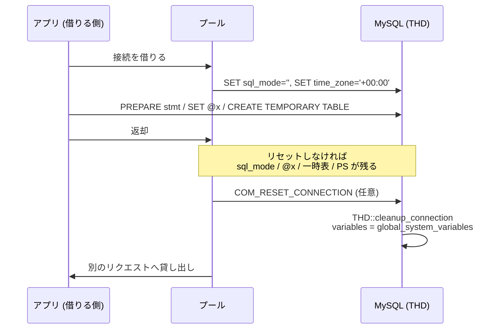

> **前提**: [接続層](./connection-layer/) / [prepared statement](./binary-protocol-prepared-statements/)

## 何を学んだか

「接続を使い回す」というのは、**サーバ側の `THD` に積み上がった状態を引き継ぐ**ということだ。何が積み上がるかは、それを掃除する関数を読むといちばん早い。

```cpp title="sql/sql_class.cc"
  init();
  stmt_map.reset();
  user_vars.clear();
  sp_cache_clear(&sp_proc_cache);
  sp_cache_clear(&sp_func_cache);
```

[`THD::cleanup_connection` (`sql/sql_class.cc#L1193`)](https://github.com/mysql/mysql-server/blob/mysql-8.4.11/sql/sql_class.cc#L1193)。同じ関数のデバッグビルド専用のアサーションが、掃除後にどういう状態であるべきかを列挙している。

```cpp title="sql/sql_class.cc"
  if (check_cleanup) {
    /* isolation level should be default */
    assert(variables.transaction_isolation == ISO_REPEATABLE_READ);
    /* check autocommit is ON by default */
    assert(server_status == SERVER_STATUS_AUTOCOMMIT);
    /* check prepared stmts are cleaned up */
    assert(prepared_stmt_count == 0);
    /* check diagnostic area is cleaned up */
    assert(get_stmt_da()->status() == Diagnostics_area::DA_EMPTY);
    /* check if temp tables are deleted */
    assert(temporary_tables == nullptr);
    /* check if tables are unlocked */
    assert(locked_tables_list.locked_tables() == nullptr);
  }
```

**これがそのまま「接続に残るもの」の一覧**になる。

- **セッションシステム変数** — `sql_mode`、`time_zone`、`character_set_*`、分離レベル、`autocommit`
- **ユーザ変数** (`@x`) と prepared statement
- **一時テーブル** (`CREATE TEMPORARY TABLE`)
- **`LOCK TABLES` で取ったロック**
- **ストアドプログラムのキャッシュ** ([トリガとストアドプログラム](./triggers-and-stored-programs/))
- **診断エリア** — 直前の警告

そして `COM_RESET_CONNECTION` を送ると、これが全部初期状態に戻る。**セッション変数はグローバル値から取り直される。**



## なぜそうなっているか

**接続が状態を持つのは、SQL がセッションを前提にした言語だからだ。** `START TRANSACTION` から `COMMIT` までは複数の文にまたがるし、一時テーブルも prepared statement もセッションの寿命に紐付く。これらを持たない「ステートレスな接続」は SQL としては別の言語になる。

**プールが問題を生むのは、アプリケーションが接続の同一性を意識しない前提で書かれるからだ。** 「HTTP リクエスト 1 本 = 1 接続」なら状態は自然に捨てられるが、プールは「リクエスト 1 本 = 借りた接続」なので、前の借り手の状態が見える。

**`COM_RESET_CONNECTION` が用意されているのは、再認証なしで状態だけを捨てるためだ。** 同じことは `COM_CHANGE_USER` でもできるが、そちらは認証をやり直す。プールが返却時に走らせるなら、認証の往復がないほうが速い。

**セッション変数がグローバル値から取り直されるのは、`THD::init` が変数の塊ごとコピーしているからだ。**

```cpp title="sql/sql_plugin.cc"
  mysql_mutex_lock(&LOCK_global_system_variables);
  thd->variables = global_system_variables;
```

[`plugin_thdvar_init` (`sql/sql_plugin.cc#L3008`)](https://github.com/mysql/mysql-server/blob/mysql-8.4.11/sql/sql_plugin.cc#L3008)。1 変数ずつ既定値に戻すのではなく、構造体を丸ごと上書きする。だから**接続確立時に `SET` した値も、リセットで消える**。

## ソースコードのどこか

### `COM_RESET_CONNECTION` の実装

```cpp title="sql/sql_parse.cc"
    case COM_RESET_CONNECTION: {
      thd->status_var.com_other++;
      global_aggregated_stats.get_shard(thd->thread_id()).com_other++;
      thd->cleanup_connection();
      my_ok(thd);
      break;
    }
```

[`sql/sql_parse.cc#L1906`](https://github.com/mysql/mysql-server/blob/mysql-8.4.11/sql/sql_parse.cc#L1906)。**`cleanup_connection` を呼んで OK を返すだけ**で、認証もテーブルの開き直しもしない。`Com_other` に計上されるので、`SHOW GLOBAL STATUS` では専用のカウンタが立たない。

`COM_CHANGE_USER` は同じ掃除に加えて `acl_authenticate` を通る ([`sql/sql_parse.cc#L1952`](https://github.com/mysql/mysql-server/blob/mysql-8.4.11/sql/sql_parse.cc#L1952))。ユーザを変えないなら往復が無駄になる。

### `init()` が何を戻すか

```cpp title="sql/sql_class.cc"
void THD::init(void) {
  plugin_thdvar_init(this, m_enable_plugins);
  ...
  /*
    NOTE: reset_connection command will reset the THD to its default state.
    All system variables whose scope is SESSION ONLY should be set to their
    default values here.
  */
  reset_first_successful_insert_id();
  ...
  server_status = SERVER_STATUS_AUTOCOMMIT;
  ...
  tx_isolation = (enum_tx_isolation)variables.transaction_isolation;
  tx_read_only = variables.transaction_read_only;
```

[`sql/sql_class.cc#L1089`](https://github.com/mysql/mysql-server/blob/mysql-8.4.11/sql/sql_class.cc#L1089)。コメントが「`reset_connection` は THD を既定状態に戻す。SESSION ONLY のシステム変数はここで既定値にすること」と、この関数の契約を明示している。

`reset_first_successful_insert_id()` があるので、**`LAST_INSERT_ID()` もリセットされる**。`autocommit` は `SERVER_STATUS_AUTOCOMMIT` に戻る。

### セッション状態の変化を通知する仕組み

サーバは「セッション状態が変わった」ことを OK パケットに載せてクライアントに伝えられる。

```cpp title="sql/sys_vars.cc"
static Sys_var_charptr Sys_track_session_sys_vars(
    "session_track_system_variables",
    "Track changes in registered system variables.",
    SESSION_VAR(track_sysvars_ptr), CMD_LINE(REQUIRED_ARG), IN_FS_CHARSET,
    DEFAULT("time_zone,autocommit,character_set_client,character_set_results,"
            "character_set_connection"),
```

[`sql/sys_vars.cc#L6635`](https://github.com/mysql/mysql-server/blob/mysql-8.4.11/sql/sys_vars.cc#L6635)。**既定で 5 つの変数が追跡対象**になっている。`time_zone` と文字セット 3 種と `autocommit` — プールやプロキシが最も気にする組み合わせだ ([テキストプロトコル](./text-protocol-and-resultset/))。

トランザクションの状態を追跡する仕組みも別にある。

```cpp title="sql/sys_vars.cc"
static const char *session_track_transaction_info_names[] = {
```

[`sql/sys_vars.cc#L6662`](https://github.com/mysql/mysql-server/blob/mysql-8.4.11/sql/sys_vars.cc#L6662)。`OFF` / `STATE` / `CHARACTERISTICS` の 3 段で、**プロキシが「いまトランザクションの途中か」を知るためのもの**になる。トランザクションの途中で別の接続に切り替えたら壊れるので、切り替えていい瞬間を知る手段が要る。

### prepared statement はグローバル上限

```cpp title="sql/sql_class.cc"
    /* check prepared stmts are cleaned up */
    assert(prepared_stmt_count == 0);
```

`prepared_stmt_count` は `THD` のメンバに見えるが、上限判定に使われる `Prepared_stmt_count` はサーバ全体のカウンタになる。`max_prepared_stmt_count` (既定 16382) もグローバルなので、**プールの各接続が独自に PS をキャッシュすると、接続数 × ステートメント数で上限に届く** ([prepared statement](./binary-protocol-prepared-statements/))。

## どう活かすか

### プールは「返却時にリセット」を設定できるか確認する

主要なドライバとプールには、接続を返すときに `COM_RESET_CONNECTION` を送る設定がある。有効にすれば、前の借り手の `sql_mode`・ユーザ変数・一時テーブル・PS が次の借り手に見えない。

ただし**リセットは接続確立時に設定した値も消す**。ドライバが「接続確立時に `SET time_zone = '+00:00'` を送る」設計になっているなら、リセット後にもう一度送られるかを確認する。送られなければ、リセット後の接続だけサーバのグローバル設定 (`SYSTEM`) で動く ([日付時刻とタイムゾーン](./datetime-and-timezone/))。

**接続ごとに挙動が違う**という症状は、この組み合わせで起きる。

### 疑ったらセッションとグローバルを並べて見る

```sql
SELECT @@session.sql_mode, @@global.sql_mode;
SELECT @@session.time_zone, @@global.time_zone;
SELECT @@session.transaction_isolation, @@global.transaction_isolation;
```

`performance_schema.variables_by_thread` を使えば、全接続のセッション変数を横断で見られる。**同じ変数に 2 種類の値が並んでいたら、プールの初期化経路が 2 通りある。**

### 一時テーブルは接続の寿命に紐付く

`CREATE TEMPORARY TABLE` はセッションに属するので、プールが接続を返しても消えない。次の借り手が同じ名前で作ろうとすると `Table already exists` になる。**エラーが「たまに」出るなら、プールのどの接続に当たったかで結果が変わっている。**

同じ理由で、一時テーブルを作ったまま返却された接続はディスク領域を掴み続ける。接続が切れるまで解放されない。

### 開きっぱなしのトランザクションが最悪の残留物

返却前に `COMMIT` も `ROLLBACK` もしていない接続は、**トランザクションが生きたまま**次の借り手に渡る。起きることは 2 つある。

- **read view が古いまま**になり、次の借り手が古いスナップショットを読む ([read view と可視性](./read-view-and-visibility/))
- **その read view が生きている間、purge が undo を消せない**。`History list length` が伸びる ([purge](./purge/))

「なぜか古いデータが返る」と「`History list length` が伸び続ける」が同時に起きているなら、まずここを疑う。`information_schema.innodb_trx` の `trx_started` が異様に古い行を探す。

### ストアドプログラムのメモリは接続数に比例する

`sp_cache` は接続ごとなので、長寿命のプールでは `sp_head` が接続数ぶん生きる ([トリガとストアドプログラム](./triggers-and-stored-programs/))。`COM_RESET_CONNECTION` は `sp_cache_clear` を呼ぶので、リセットを有効にしているとこの分は都度解放される。

### 一般化して持ち帰るもの

**掃除する関数を読むと、状態の一覧が手に入る。** `THD::cleanup_connection` は、設計文書のどこにも書かれていない「セッションが持つもの」の完全な列挙になっている。しかもデバッグ用のアサーションが「掃除後にこうなっているべき」を書いているので、意図まで読める。状態を持つオブジェクトを理解したいときは、コンストラクタより先にリセット処理を読むほうが早いことが多い。

もう 1 つは、**リセットを「構造体の丸ごとコピー」で実装する**という判断だ。1 項目ずつ戻す実装は、項目が増えたときに戻し忘れる。グローバルの塊をコピーする形なら、新しいセッション変数を足しても自動的にリセット対象になる。代わりに「接続確立時の設定も消える」という性質が付いてくるので、クライアント側がそれを前提にする必要がある。
