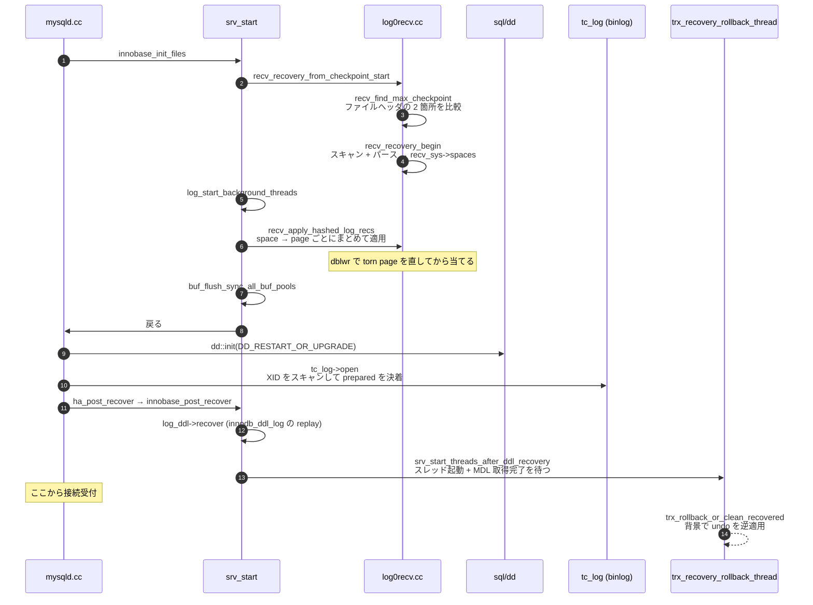

> **前提**: [redo ログ](./redo-log-walkthrough/) / [チェックポイント](./checkpoint/)

## 何を学んだか

クラッシュリカバリは「redo を当てて undo で巻き戻す」の 2 段だと説明されることが多いが、**実際には 6 段あり、しかも最後の undo は接続受付と並行に走る**。

```text
1. checkpoint LSN を見つける       recv_find_max_checkpoint
2. redo をスキャンして束ねる       recv_recovery_begin
3. ページに当てる                  recv_apply_hashed_log_recs
4. データディクショナリを開く       dd::init(DD_RESTART_OR_UPGRADE)
5. binlog と 2PC の決着            tc_log->open
6. 未完了トランザクションを巻き戻す  trx_recovery_rollback_thread (背景)
```

順序の理由ははっきりしている。**1〜3 が終わるまで、`mysql.ibd` の中身すら信用できない。** データディクショナリは InnoDB のテーブルとして格納されているので ([データディクショナリのページ](./data-dictionary/))、redo を当て終わるまで開けない。DD が開けないとテーブル名も分からないので、undo のロールバック (テーブルに MDL を取る必要がある) はさらに後になる。

そして重要な非対称がある。**redo の適用は同期的に、undo のロールバックは非同期に行われる。**

- redo を当て終わっていないページは物理的に壊れているので、待つしかない
- 未コミットのトランザクションが残っていても、**そのトランザクションはロックを持ったまま「生きている」ように見える**ので、他のセッションは MVCC とロックで正しく扱える。ロールバックが完了するのを待つ必要がない

だから巨大な `DELETE` の途中でクラッシュしても、**サーバは即座に接続を受け付ける**。裏で `trx_rollback_or_clean_recovered` が何時間も回っていることはある。



## なぜそうなっているか

**redo の適用が冪等なのは、判定をページ自身に持たせたからだ。** 「どこまで適用したか」を別途記録すると、その記録自体をクラッシュから守る必要が出て、問題が再帰する。ページの `FIL_PAGE_LSN` は元々「このページを最後に変えた mtr の LSN」として書かれているので、追加のコストゼロで進捗の記録を兼ねている。

**LSN 順に読んだレコードをページ単位に組み替えるのは、I/O を最小にするためだ。** LSN 順にそのまま適用すると、同じページを何度も読み込むか、バッファプールにすべて載せておく必要がある。ページ単位にまとめれば、1 ページにつき読み 1 回・書き 1 回で済む。バッファプールに載らない量の redo があっても、バッチを区切って処理できる。

**undo のロールバックを非同期にできるのは、ロールバック前後で「他人から見た状態」が同じだからだ。** 未コミットのトランザクションの変更は、read view からはどのみち見えない ([read view のページ](./read-view-and-visibility/))。行ロックを復活させておけば、その行を触ろうとしたセッションは正しく待つ。**ロールバックが終わるのを待たせて得られるものが何もない。**

一方で **redo の適用は待つしかない。** 当て終わっていないページは物理的に壊れており、読んだ瞬間に B+tree の走査が破綻する。「見えない」で済ませられる論理的な状態と、「壊れている」物理的な状態の違いがそのまま同期/非同期を分けている。

**`innodb_force_recovery` の 4 以上が書き込み禁止なのは、この時点で InnoDB の不変条件が既に壊れているからだ。** 4 で change buffer をマージしない、5 で未コミットをコミット扱いにする、6 で redo を当てない。どれも「データが論理的に間違っている状態で起動する」ことを意味する。そこに書き込みを許すと、間違った状態を土台にした新しいデータを作ってしまう。**4 以上は `mysqldump` して作り直すための一時的な措置**であり、そのまま運用に戻す設定ではない。

## ソースコードのどこか

### 1. checkpoint LSN を見つける

[`recv_recovery_from_checkpoint_start` (`log0recv.cc#L3839`)](https://github.com/mysql/mysql-server/blob/mysql-8.4.11/storage/innobase/log/log0recv.cc#L3839) の冒頭。

```cpp title="storage/innobase/log/log0recv.cc"
  /* Look for the latest checkpoint */
  Log_checkpoint_location checkpoint;
  if (!recv_find_max_checkpoint(log, checkpoint)) {
    ib::error(ER_IB_MSG_RECOVERY_CHECKPOINT_NOT_FOUND);
    return DB_ERROR;
  }
```

チェックポイントは各 redo ファイルのヘッダの 2 箇所に交互に書かれているので ([チェックポイントのページ](./checkpoint/))、全ファイルのヘッダを読んで最大の LSN を採る。片方が書きかけで壊れていても、もう片方が使える。

「リカバリが必要か」の判定は、この checkpoint LSN と、**システムテーブルスペースの先頭ページに記録された `flush_lsn`** の比較だ。

```cpp title="storage/innobase/log/log0recv.cc"
  if (checkpoint_lsn != flush_lsn) {
    if (checkpoint_lsn < flush_lsn) {
      ib::warn(ER_IB_MSG_RECOVERY_CHECKPOINT_FROM_BEFORE_CLEAN_SHUTDOWN,
               ulonglong{checkpoint_lsn}, ulonglong{flush_lsn});
    }

    if (!recv_needed_recovery) {
      ib::info(ER_IB_MSG_RECOVERY_IS_NEEDED, ulonglong{flush_lsn},
               ulonglong{checkpoint_lsn});
      ...
      recv_init_crash_recovery();
```

**きれいに停止したなら両者は一致する。** ずれていれば `recv_init_crash_recovery()` に入り、エラーログに「リカバリが必要だ」と出る。

### 2. スキャンして `space → page` に束ねる

`recv_recovery_begin` ([L3717](https://github.com/mysql/mysql-server/blob/mysql-8.4.11/storage/innobase/log/log0recv.cc#L3717)) が checkpoint LSN からブロックを読み進め、[`recv_parse_log_recs` (L3230)](https://github.com/mysql/mysql-server/blob/mysql-8.4.11/storage/innobase/log/log0recv.cc#L3230) がレコードを切り出して `recv_sys->spaces` に積む。構造は 2 段のハッシュだ ([`log0recv.h#L381`](https://github.com/mysql/mysql-server/blob/mysql-8.4.11/storage/innobase/include/log0recv.h#L381))。

```cpp title="storage/innobase/include/log0recv.h"
struct recv_sys_t {
  using Pages =
      std::unordered_map<page_no_t, recv_addr_t *, std::hash<page_no_t>,
  ...
  struct Space {
  ...
  using Spaces = std::unordered_map<space_id_t, Space, std::hash<space_id_t>,
```

**LSN 順に読んだレコードを、ページ単位に組み替えるのがこの段の仕事だ。** そうしないと、同じページを何度も読み書きすることになる。ページ 1 枚を読んだら、そのページ宛のレコードを全部一気に当てて、書いて終わりにできる。

ブロックの `hdr_no` と `epoch_no` の不連続、そして checksum の不一致が「ログの末尾」の合図になる ([redo ログ walkthrough](./redo-log-walkthrough/))。クラッシュ時に書きかけだった最後のブロックはここで捨てられる。

### 3. ページに当てる

[`recv_apply_hashed_log_recs` (`log0recv.cc#L1125`)](https://github.com/mysql/mysql-server/blob/mysql-8.4.11/storage/innobase/log/log0recv.cc#L1125) が `spaces` を舐める。テーブルスペースを開くところで doublewrite の復元が入る。

```cpp title="storage/innobase/log/log0recv.cc"
    if (space.first != TRX_SYS_SPACE) {
      dberr_t err = fil_tablespace_open_for_recovery(space.first);
      if (err == DB_CORRUPTION) {
        /* Page couldn't be recovered from double-write, we cannot proceed
        with recovery. Skip applying redos and abort the startup. */
        mutex_exit(&recv_sys->mutex);
        ib::fatal(UT_LOCATION_HERE, ER_IB_ERR_CORRUPT_TABLESPACE_UNRECOVERABLE,
                  space.first);
```

**torn page を先に直してから redo を当てる。** 逆だと、壊れたページに redo を当てることになる ([doublewrite のページ](./doublewrite/))。

1 ページ分の適用が [`recv_recover_page_func` (L2554)](https://github.com/mysql/mysql-server/blob/mysql-8.4.11/storage/innobase/log/log0recv.cc#L2554) で、**冪等性はここで担保される**。

```cpp title="storage/innobase/log/log0recv.cc"
  /* Read the newest modification lsn from the page */
  lsn_t page_lsn = mach_read_from_8(page + FIL_PAGE_LSN);
  ...
  for (auto recv : recv_addr->rec_list) {
    ...
    if (recv->start_lsn >= page_lsn
        && undo::is_active(recv_addr->space)
    ) {
      ...
      recv_parse_or_apply_log_rec_body(recv->type, buf, buf_end,
                                       recv_addr->space, recv_addr->page_no,
                                       block, &mtr, ULINT_UNDEFINED, LSN_MAX);
```

**ページの `FIL_PAGE_LSN` より古い redo レコードは飛ばす。** そのページには既にその変更が反映済みだからだ。ページごとに個別に判定されるので、「どのページがどこまで書かれていたか」を InnoDB が覚えている必要がない。リカバリの途中でもう一度クラッシュしても、次の起動で同じ処理を繰り返すだけで正しい結果になる。

### 4〜6. Server 層の順序

InnoDB 側の `srv_start` が返ってからの順序は [`sql/mysqld.cc`](https://github.com/mysql/mysql-server/blob/mysql-8.4.11/sql/mysqld.cc#L8531) の `init_server_components()` にある。

```cpp title="sql/mysqld.cc"
  RUN_HOOK(server_state, before_recovery, (nullptr));
  if (tc_log->open(opt_bin_log ? opt_bin_logname : opt_tc_log_file)) {
    LogErr(ERROR_LEVEL, ER_CANT_INIT_TC_LOG);
    unireg_abort(MYSQLD_ABORT_EXIT);
  }

  if (dd::reset_tables_and_tablespaces()) {
    unireg_abort(MYSQLD_ABORT_EXIT);
  }
  ha_post_recover();
```

データディクショナリの初期化 `dd::init(dd::enum_dd_init_type::DD_RESTART_OR_UPGRADE)` はこれより前 ([L8225](https://github.com/mysql/mysql-server/blob/mysql-8.4.11/sql/mysqld.cc#L8225)) で走る。つまり **DD を開く → binlog リカバリ → undo ロールバック**の順だ。binlog リカバリは XA PREPARE 状態で残ったトランザクションを binlog の内容に照らして commit / rollback する処理で、詳細は[2PC のページ](./two-phase-commit-and-group-commit/)。

`ha_post_recover()` から呼ばれる [`innobase_post_recover` (`ha_innodb.cc#L4131`)](https://github.com/mysql/mysql-server/blob/mysql-8.4.11/storage/innobase/handler/ha_innodb.cc#L4131) が 2 つの仕事をする。

```cpp title="storage/innobase/handler/ha_innodb.cc"
static void innobase_post_recover() {
  if (srv_force_recovery < SRV_FORCE_NO_TRX_UNDO) {
    ...
    dberr_t err = log_ddl->recover();
```

1 つは `mysql.innodb_ddl_log` テーブルの replay で、半端に終わった DDL の後始末をする ([アトミック DDL のページ](./atomic-ddl-and-ddl-log/))。もう 1 つが [`srv_start_threads_after_ddl_recovery` (`srv0start.cc#L2533`)](https://github.com/mysql/mysql-server/blob/mysql-8.4.11/storage/innobase/srv/srv0start.cc#L2533) だ。

```cpp title="storage/innobase/srv/srv0start.cc"
  if (srv_force_recovery < SRV_FORCE_NO_TRX_UNDO && trx_sys_need_rollback()) {
    /* Rollback all recovered transactions that are
    not in committed nor in XA PREPARE state. */
    srv_threads.m_trx_recovery_rollback = os_thread_create(
        trx_recovery_rollback_thread_key, 0, trx_recovery_rollback_thread);

    srv_threads.m_trx_recovery_rollback.start();
    /* Wait till shared MDL is taken by background thread for all tables,
    for which rollback is to be performed. */
    os_event_wait(recovery_lock_taken);
  }
```

**起動処理が待つのは「MDL を取り終えるまで」だけで、ロールバックの完了は待たない。** [`trx_recovery_rollback` (`trx0roll.cc#L784`)](https://github.com/mysql/mysql-server/blob/mysql-8.4.11/storage/innobase/trx/trx0roll.cc#L784) は、対象テーブルに共有 MDL を取り、`lock_table_ix_resurrect` で表ロックを復活させてから `recovery_lock_taken` をセットし、そのあとで実際の逆適用に入る。

```cpp title="storage/innobase/trx/trx0roll.cc"
  /* Let the startup thread proceed now */
  os_event_set(recovery_lock_taken);
  ...
  trx_rollback_or_clean_recovered(true);
```

**MDL とロックだけ先に押さえるのが肝だ。** これでロールバック対象のテーブルに `DROP TABLE` や `ALTER TABLE` が入り込めなくなり、行ロックも復活しているので、他のセッションから見ると「まだ生きている長いトランザクション」に見える ([ロックのページ](./lock-modes-and-types/))。

### `innodb_force_recovery`

[`srv0srv.h#L925`](https://github.com/mysql/mysql-server/blob/mysql-8.4.11/storage/innobase/include/srv0srv.h#L925) の enum に、6 段の意味がそのまま書かれている。**大きい番号は小さい番号の効果をすべて含む。**

```cpp title="storage/innobase/include/srv0srv.h"
enum {
  SRV_FORCE_IGNORE_CORRUPT = 1,   /*!< let the server run even if it
                                  detects a corrupt page */
  SRV_FORCE_NO_BACKGROUND = 2,    /*!< prevent the main thread from
                                  running: if a crash would occur
                                  in purge, this prevents it */
  SRV_FORCE_NO_TRX_UNDO = 3,      /*!< do not run trx rollback after
                                  recovery */
  SRV_FORCE_NO_IBUF_MERGE = 4,    /*!< prevent also ibuf operations:
                                  if they would cause a crash, better
                                  not do them */
  SRV_FORCE_NO_UNDO_LOG_SCAN = 5, /*!< do not look at undo logs when
                                  starting the database: InnoDB will
                                  treat even incomplete transactions
                                  as committed */
  SRV_FORCE_NO_LOG_REDO = 6       /*!< do not do the log roll-forward
                                  in connection with recovery */
};
```

| 値  | 諦めるもの                           | 起きること                                                                       |
| --- | ------------------------------------ | -------------------------------------------------------------------------------- |
| 1   | ページの破損検査                     | 壊れたページを読んでもサーバを止めない                                           |
| 2   | master スレッドと purge              | 古い版が溜まり続ける ([purge のページ](./purge/))                                |
| 3   | 未完了トランザクションのロールバック | ロックを持ったままの trx が永久に残る                                            |
| 4   | change buffer のマージ               | 8.4 では既定 OFF なので影響は小さい ([change buffer のページ](./change-buffer/)) |
| 5   | undo ログのスキャン                  | **未コミットのトランザクションがコミット済みとして扱われる**                     |
| 6   | redo の適用                          | ページが半端な状態のまま起動する                                                 |

境界が 2 つある。

- **`> 3` で `high_level_read_only` が立つ** ([`ha_innodb.cc#L4939`](https://github.com/mysql/mysql-server/blob/mysql-8.4.11/storage/innobase/handler/ha_innodb.cc#L4939))。つまり **4 以上では DML も DDL もできない**。データを吸い出すためだけのモードになる
- **`== 6` で `srv_read_only_mode` が強制される**

```cpp title="storage/innobase/handler/ha_innodb.cc"
  if (srv_force_recovery == SRV_FORCE_NO_LOG_REDO) {
    srv_read_only_mode = true;
  }

  high_level_read_only =
      srv_read_only_mode || srv_force_recovery > SRV_FORCE_NO_TRX_UNDO;
```

`srv_force_recovery > 0` の時点でデータディクショナリも読み取り専用になる (`innobase_is_dict_readonly`、[L3910](https://github.com/mysql/mysql-server/blob/mysql-8.4.11/storage/innobase/handler/ha_innodb.cc#L3910))。

## どう活かすか

**起動が遅い原因は checkpoint age で決まる。** 「redo を 10GB にしたらリカバリが 10 分かかる」ではなく、「クラッシュ時点の checkpoint age だけ redo を読む」ので、page cleaner が追いついていれば大きい redo でもリカバリは短い ([チェックポイントのページ](./checkpoint/))。エラーログには適用の進捗が 10% 刻みで出る (`ER_IB_MSG_708`)。

**「起動したのに一部のテーブルが妙に遅い」ときは、背景のロールバックを疑う。** `SHOW ENGINE INNODB STATUS` の TRANSACTIONS セクションに、状態が `ROLLING BACK` の長いトランザクションが出る。`performance_schema.metadata_locks` にも、そのテーブルに対する共有 MDL が残っている。**この間に対象テーブルへ `ALTER TABLE` を打つと MDL 待ちで固まる** ([MDL のページ](./metadata-locking/))。

**ロールバックが終わるまでの時間は、クラッシュ前にどれだけ書いたかで決まる。** 巨大な `DELETE` の途中で落ちたなら、逆適用も同じだけかかる。しかもロールバックはコミットより遅い ([コミットとロールバックのページ](./commit-and-rollback-internals/))。**巨大な DML を分割する理由は、ロック時間だけでなく障害からの復帰時間にもある。**

**`innodb_force_recovery` は 1 から順に上げる。** 起動できた最小の値で止め、そのままデータを吸い出す。**4 以上に上げた時点で、そのインスタンスは復旧させずに作り直す前提に切り替える。** 5 は未コミットをコミット扱いにするので、アプリケーションから見て「あるはずのない中途半端なデータ」が生まれうる。

**エラーログの `Are you sure you are using the right redo log files to start up the database? Log sequence number in the redo log files is %llu, less than the log sequence number in the first system tablespace file header, %llu.` は、redo ファイルだけを消したか差し替えたことを示す。** バックアップからデータファイルだけ戻して `#innodb_redo` を消す、という手順で出る。checkpoint LSN がデータファイルの `flush_lsn` より小さいので、**当てるべき redo が存在しない**。この状態で起動すると壊れる可能性があるので、原因を先に確認する。

**クリーンなシャットダウンが 8.0 以降も重要な理由は、checkpoint LSN と `flush_lsn` の一致にある。** 正常停止では全 dirty page が書き出され両者が一致するので、起動時のリカバリはゼロになる。アップグレード前に slow shutdown が推奨されるのも、[`_8027` 形式の redo を読ませないため](./mini-transaction/)を含めてここに理由がある。
