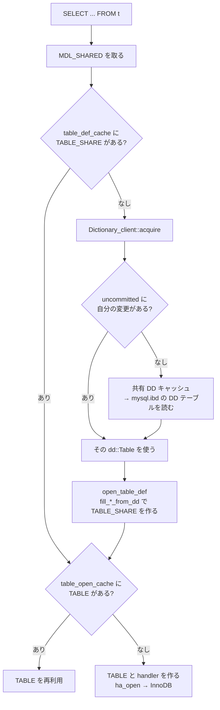

> **前提**: [handler](./handler-walkthrough/)

## 何を学んだか

MySQL 5.7 までのメタデータは、`.frm` (テーブル定義)、`.par` (パーティション定義)、`db.opt` (スキーマのデフォルト文字セット)、`mysql.proc` などの MyISAM テーブルにバラバラに置かれていた。DDL の途中でクラッシュすると、`.frm` は書けたが InnoDB のテーブルスペースは作られていない、といった不整合が起きた。

8.0 でこれが全部 InnoDB のテーブル 30 本に統合された。ポイントは 4 つある。

1. **保管場所は `mysql.ibd` という単一のテーブルスペース**だ。データディレクトリ直下に 1 ファイルある。中の DD テーブルは `mysql.tables` / `mysql.columns` / `mysql.indexes` のような名前だが、通常の SQL では直接読めない
2. **DD の更新は普通の InnoDB トランザクションだ。** DDL は「テーブルスペースを作る」「DD テーブルの行を挿入する」を同じトランザクションでやり、redo と undo が普通に効く。アトミック DDL の土台がこれになる
3. **読み出しは 2 段のキャッシュを通る。** `Dictionary_client` が `dd::Table` オブジェクトを、`table_def_cache` が `TABLE_SHARE` を持つ。前者はトランザクションの可視性を持ち、後者は LRU で溢れる
4. **`INFORMATION_SCHEMA` のテーブルは DD 上の SQL ビューになった。** `I_S.TABLES` は `mysql.tables` を `mysql.schemata` と JOIN するビューで、その `CREATE VIEW` 文は C++ のコードが組み立てて bootstrap 時に実行する

「オプティマイザが I_S を最適化できるようになった」も「`FLUSH TABLES` の意味が変わった」も、この 4 点から出てくる。

## なぜそうなっているか

**DD を InnoDB のテーブルにしたのは、DDL をアトミックにする以外に方法がなかったからだ。** `.frm` はただのファイルで、書き込みと InnoDB のテーブルスペース作成を 1 つの原子操作にする手段がない。同じトランザクションの中に入れてしまえば、redo と undo がそのまま使える。`CREATE TABLE` の途中でクラッシュしても、DD の行が入っていなければテーブルは存在しなかったことになる ([アトミック DDL のページ](./atomic-ddl-and-ddl-log/))。

**`Dictionary_client` が uncommitted レジストリを持つのは、DDL 実行中のセッション自身が新しい定義を読む必要があるからだ。** `ALTER TABLE` は列を足した後の定義を使って行を組み立て直す。だが同じ定義を他セッションに見せてはいけない。**InnoDB の MVCC は `mysql.tables` の行の可視性は解決するが、そこから組み立てた `dd::Table` オブジェクトのキャッシュまでは面倒を見ない**ので、キャッシュ層に同じ構造をもう 1 つ作ることになった。

**`table_def_cache` と `table_open_cache` が別物なのは、共有できるものとできないものが違うからだ。** `TABLE_SHARE` は定義なので全接続で共有できる。`TABLE` は `record[0]` のバッファと `handler` インスタンスを持つので、接続ごとに要る ([handler のページ](./handler-walkthrough/))。だから前者の既定は 400、後者は 4000 と 1 桁違う。**同じテーブルを 100 接続が同時に開けば `TABLE` は 100 個できるが `TABLE_SHARE` は 1 個だ。**

**I_S をビューにしたのは、オプティマイザに任せたかったからだ。** 5.7 では I_S へのクエリはサーバ内のループでテーブルを 1 つずつ開いて行を作っていた。`WHERE table_schema = 'app'` があっても全テーブルを開いてから捨てていた。ビューになったので、`mysql.schemata` に対する ref アクセスに落ちる。**`I_S.COLUMNS` を叩いたときの速度が 8.0 で桁違いに変わったのはこれが理由だ。**

## ソースコードのどこか

### `mysql.ibd` — [`storage/innobase/dict/dict0dict.cc#L148`](https://github.com/mysql/mysql-server/blob/mysql-8.4.11/storage/innobase/dict/dict0dict.cc#L148)

このファイル名がツリー全体で文字列として現れるのはここ 1 箇所だけだ。

```cpp title="storage/innobase/dict/dict0dict.cc"
/** The name of the data dictionary tablespace. */
const char *dict_sys_t::s_dd_space_name = "mysql";

/** The file name of the data dictionary tablespace */
const char *dict_sys_t::s_dd_space_file_name = "mysql.ibd";

/** The name of the hard-coded system tablespace. */
const char *dict_sys_t::s_sys_space_name = "innodb_system";
```

他の 6 箇所はすべてこの定数を参照している。うち 2 箇所が起動シーケンスで、ここに DD の卵と鶏の問題がそのまま出ている ([`ha_innodb.cc#L5799`](https://github.com/mysql/mysql-server/blob/mysql-8.4.11/storage/innobase/handler/ha_innodb.cc#L5799))。

```cpp title="storage/innobase/handler/ha_innodb.cc"
  ret = create ? dd_create_hardcoded(dict_sys_t::s_dict_space_id,
                                     dict_sys_t::s_dd_space_file_name)
               : dd_open_hardcoded(dict_sys_t::s_dict_space_id,
                                   dict_sys_t::s_dd_space_file_name);

  /* Once hardcoded tablespace mysql is created or opened,
  prepare it along with innodb system tablespace for server.
  Tell server that these two hardcoded tablespaces exist.  */
```

**「テーブルスペースの定義は DD に入っている。だが DD 自身のテーブルスペースの定義はどこにあるのか」**という循環を、`hardcoded` という名前の関数で断ち切っている。`mysql.ibd` のスペース ID もフラグも C++ の定数として持っていて、DD を読まずに開ける。

同じ性質が DD テーブル側にもある。[`sql/dd/impl/system_registry.h#L334`](https://github.com/mysql/mysql-server/blob/mysql-8.4.11/sql/dd/impl/system_registry.h#L334) の分類コメントが理由を書いている。

```cpp title="sql/dd/impl/system_registry.h"
  /*
    Classification of tables based on WL#6391.

    - An INERT table can never change.
    - The dd::Table objects representing the CORE tables must be present
      to handle a cache miss for an arbitrary table.
    - The dd::Table objects representing the SECOND order tables can be
      fetched from the dd tables as long as the core table objects are
      present.
```

`INERT` は `mysql.dd_properties` 1 本だけで、DD のバージョン番号を持つ。`CORE` は「任意のテーブルのキャッシュミスを解決するために必要な DD テーブル」で、`mysql.tables` / `mysql.columns` / `mysql.indexes` / `mysql.schemata` などがここに入る。**CORE テーブルの定義自体はキャッシュに常駐させておく**ことで、「`mysql.tables` を読むために `mysql.tables` を読む」が起きないようにしてある。

登録は [`sql/dd/impl/system_registry.cc#L165`](https://github.com/mysql/mysql-server/blob/mysql-8.4.11/sql/dd/impl/system_registry.cc#L165) で、`register_table<X>()` が 30 回並ぶ。

### DD テーブルの定義は C++ の中の DDL 文字列

DD テーブルには `.sql` のスキーマファイルがない。定義は `sql/dd/impl/tables/*.cc` に、列ごとの DDL 断片として書かれている ([`sql/dd/impl/tables/tablespaces.cc#L44`](https://github.com/mysql/mysql-server/blob/mysql-8.4.11/sql/dd/impl/tables/tablespaces.cc#L44))。

```cpp title="sql/dd/impl/tables/tablespaces.cc"
Tablespaces::Tablespaces() {
  m_target_def.set_table_name("tablespaces");

  m_target_def.add_field(FIELD_ID, "FIELD_ID",
                         "id BIGINT UNSIGNED NOT NULL AUTO_INCREMENT");
  /*
    We allow name lengths up to 268 bytes, which is needed for InnoDB
    tablespace naming convention. The following explains the name format,

      <dbname> +'/'+ <tablename> +'#p#'+ <partitionname>
               +'#sp#'+ <subpartion_name> +'#tmp'
    Note: #tmp is appended during ALTER TABLE.
```

`VARCHAR(268)` という数字の根拠がコメントに残っているのが面白い。パーティション名まで含めたテーブルスペース名の最大長で、[パーティショニングのページ](./partitioning/)で見る `#p#` 区切りがここに効いている。

### `Dictionary_client` — committed と uncommitted の二重レジストリ

DD オブジェクトを取り出す口は `THD::dd_client()` が返す [`dd::cache::Dictionary_client`](https://github.com/mysql/mysql-server/blob/mysql-8.4.11/sql/dd/cache/dictionary_client.h#L249) だ。セッションごとに 3 つのレジストリを持つ。

```cpp title="sql/dd/cache/dictionary_client.h"
  std::vector<Entity_object *> m_uncached_objects;  // Objects to be deleted.
  Object_registry m_registry_committed;    // Registry of committed objects.
  Object_registry m_registry_uncommitted;  // Registry of uncommitted objects.
  Object_registry m_registry_dropped;      // Registry of dropped objects.
```

[`Dictionary_client::acquire` (`dictionary_client.cc#L866`)](https://github.com/mysql/mysql-server/blob/mysql-8.4.11/sql/dd/impl/cache/dictionary_client.cc#L866) の探索順が、DD のトランザクショナルな可視性そのものだ。

```cpp title="sql/dd/impl/cache/dictionary_client.cc"
  // Lookup in registry of uncommitted objects
  T *uncommitted_object = nullptr;
  bool dropped = false;
  acquire_uncommitted(key, &uncommitted_object, &dropped);
  if (uncommitted_object || dropped) {
    *local_committed = false;
    *local_uncommitted = true;
    *object = uncommitted_object;
    return false;
  }
  *local_uncommitted = false;

  // Lookup in the registry of committed objects.
  Cache_element<T> *element = nullptr;
  m_registry_committed.get(key, &element);
```

**自分の未コミットの変更を先に見る。** DDL を実行中のセッションは書き換え後の定義を、他のセッションは共有キャッシュの古い定義を見る。「DDL 中に別セッションから見えるのはどちらか」の答えがここにある。

書き換えるときは [`acquire_for_modification` (L1124)](https://github.com/mysql/mysql-server/blob/mysql-8.4.11/sql/dd/impl/cache/dictionary_client.cc#L1124) を使う。名前どおり、**共有キャッシュのオブジェクトを直接いじらず clone する。**

```cpp title="sql/dd/impl/cache/dictionary_client.cc"
    const T *casted = dynamic_cast<const T *>(cached_object);

    if (!casted)
      *object = nullptr;
    else {
      *object = casted->clone();
      auto_delete<T>(*object);
    }
```

clone した側を書き換えて uncommitted レジストリに置き、コミットのときに共有キャッシュへ移す。その移動を起こすのが [`trans_commit` (`sql/transaction.cc#L233`)](https://github.com/mysql/mysql-server/blob/mysql-8.4.11/sql/transaction.cc#L233) の末尾だ。

```cpp title="sql/transaction.cc"
    /*
      If the SE failed to commit the transaction, we must rollback the
      modified dictionary objects to make sure the DD cache, the DD
      tables and the state in the SE stay in sync.
    */
    if (res)
      thd->dd_client()->rollback_modified_objects();
    else
      thd->dd_client()->commit_modified_objects();
```

**DD キャッシュの可視性と InnoDB のトランザクションの成否が、同じ `trans_commit` の中で結び付けられている。** `commit_modified_objects` のコメントは `Should be called after commit to disk but before metadata locks are released` と、順序の制約まで書いている。MDL を持ったまま切り替えることで、他のセッションが中途半端な状態を見ないようにしている ([MDL のページ](./metadata-locking/))。

### `TABLE_SHARE` のキャッシュ — `table_def_cache`

`dd::Table` は DD の生データに近い表現で、実行時に使うのは `TABLE_SHARE` のほうだ。こちらのキャッシュは [`sql/sql_base.cc#L337`](https://github.com/mysql/mysql-server/blob/mysql-8.4.11/sql/sql_base.cc#L337) にある。

```cpp title="sql/sql_base.cc"
using Table_definition_cache =
    malloc_unordered_map<std::string,
                         std::unique_ptr<TABLE_SHARE, Table_share_deleter>>;
Table_definition_cache *table_def_cache;
static TABLE_SHARE *oldest_unused_share, end_of_unused_share;
```

ハッシュマップと、参照カウント 0 のシェアを繋ぐ双方向リンクの LRU の組だ。エントリを返す直前に上限を超えていたら未使用のものを捨てる ([L575](https://github.com/mysql/mysql-server/blob/mysql-8.4.11/sql/sql_base.cc#L575))。

```cpp title="sql/sql_base.cc"
  /* Free cache if too big */
  while (table_def_cache->size() > table_def_size && oldest_unused_share->next)
    table_def_cache->erase(to_string(oldest_unused_share->table_cache_key));
```

`table_def_size` は `table_definition_cache` という名前のシステム変数で、既定は 400 ([`sql/sys_vars.h#L105`](https://github.com/mysql/mysql-server/blob/mysql-8.4.11/sql/sys_vars.h#L105) の `TABLE_DEF_CACHE_DEFAULT`)。**参照中のシェアは捨てられない**ので、これは上限ではなく目安だ。

キャッシュミスの経路は [`get_table_share` (L748)](https://github.com/mysql/mysql-server/blob/mysql-8.4.11/sql/sql_base.cc#L748)。MDL を持っていることを assert してから探し、無ければ DD から作る。

```cpp title="sql/sql_base.cc"
  /*
    To be able perform any operation on table we should own
    some kind of metadata lock on it.
  */
  assert(thd->mdl_context.owns_equal_or_stronger_lock(MDL_key::TABLE, db,
                                                      table_name, MDL_SHARED));
```

そして DD から読む部分は `LOCK_open` を**外して**から実行する。

```cpp title="sql/sql_base.cc"
  share->increment_ref_count();      // Mark in use
  share->m_open_in_progress = true;  // Mark being opened
  DEBUG_SYNC(thd, "table_share_open_in_progress");

  /*
    Temporarily release LOCK_open before opening the table definition,
    which can be done without mutex protection.
  */
  mysql_mutex_unlock(&LOCK_open);
  ...
    if (thd->dd_client()->acquire(share->db.str, &sch) ||
        thd->dd_client()->acquire(share->db.str, share->table_name.str,
                                  &abstract_table)) {
```

**DD からの読み出しは SQL の実行を伴う**ので、`LOCK_open` を握ったままやると全接続が止まる。代わりに `m_open_in_progress` フラグを立てて、同じシェアを求める他スレッドは `COND_open` で待つ。

`dd::Table` から `TABLE_SHARE` を組み立てるのが [`open_table_def` (`sql/dd_table_share.cc#L2288`)](https://github.com/mysql/mysql-server/blob/mysql-8.4.11/sql/dd_table_share.cc#L2288)。

```cpp title="sql/dd_table_share.cc"
  // Fill the TABLE_SHARE with details.
  bool error = (fill_share_from_dd(thd, share, &table_def) ||
                fill_columns_from_dd(thd, share, &table_def) ||
                fill_indexes_from_dd(thd, share, &table_def) ||
                fill_partitioning_from_dd(thd, share, &table_def) ||
                fill_foreign_keys_from_dd(share, &table_def) ||
                fill_check_constraints_from_dd(share, &table_def));
```

**5.7 でここに相当したのが `.frm` のパースだった。** 関数の形は同じで、入力がファイルからオブジェクトに変わっている。



### `INFORMATION_SCHEMA` は DD の上のビュー

`I_S.TABLES` の定義は [`sql/dd/impl/system_views/tables.cc#L38`](https://github.com/mysql/mysql-server/blob/mysql-8.4.11/sql/dd/impl/system_views/tables.cc#L38) にある。SELECT リストと FROM 句を C++ で組み立てている。

```cpp title="sql/dd/impl/system_views/tables.cc"
  m_target_def.add_field(FIELD_TABLE_NAME, "TABLE_NAME",
                         "tbl.name" + m_target_def.fs_name_collation());
  m_target_def.add_field(FIELD_TABLE_TYPE, "TABLE_TYPE", "tbl.type");
  m_target_def.add_field(FIELD_ENGINE, "ENGINE",
                         "IF(tbl.type = 'BASE TABLE', tbl.engine, NULL)");
  ...
  m_target_def.add_from("mysql.tables tbl");
  m_target_def.add_from("JOIN mysql.schemata sch ON tbl.schema_id=sch.id");
  m_target_def.add_from(
      "JOIN mysql.catalogs cat ON "
      "cat.id=sch.catalog_id");
  m_target_def.add_from(
      "LEFT JOIN mysql.collations col ON "
      "tbl.collation_id=col.id");

  m_target_def.add_where("CAN_ACCESS_TABLE(sch.name, tbl.name)");
  m_target_def.add_where("AND IS_VISIBLE_DD_OBJECT(tbl.hidden)");
```

**権限チェックが `CAN_ACCESS_TABLE()` という WHERE 句の関数**になっているのが目を引く。5.7 では I_S テーブルを埋めるループの中で権限を見ていたが、いまは述語なのでオプティマイザが扱える。

これを文字列にするのが [`build_ddl_create_view` (`system_view_definition_impl.h#L207`)](https://github.com/mysql/mysql-server/blob/mysql-8.4.11/sql/dd/impl/system_views/system_view_definition_impl.h#L207)。

```cpp title="sql/dd/impl/system_views/system_view_definition_impl.h"
  String_type build_ddl_create_view() const override {
    Stringstream_type ss;
    ss << "CREATE OR REPLACE DEFINER=`mysql.infoschema`@`localhost` VIEW "
       << "information_schema." << view_name() << " AS " + build_select_query();

    return ss.str();
  }
```

そして bootstrap 時に [`create_system_views` (`sql/dd/info_schema/metadata.cc#L430`)](https://github.com/mysql/mysql-server/blob/mysql-8.4.11/sql/dd/info_schema/metadata.cc#L430) がそれを実行する。

```cpp title="sql/dd/info_schema/metadata.cc"
  // Iterate over system view definitions.
  bool error = false;
  for (dd::System_views::Const_iterator it =
           dd::System_views::instance()->begin(sv_type);
       it != dd::System_views::instance()->end();
       it = dd::System_views::instance()->next(it, sv_type)) {
    const dd::system_views::System_view_definition *view_def =
        (*it)->entity()->view_definition();

    // Build the CREATE VIEW DDL statement and execute it.
    if (view_def == nullptr ||
        dd::execute_query(thd, view_def->build_ddl_create_view())) {
```

**`dd::execute_query` で本当に `CREATE VIEW` を流している。** 登録されているビューは `sql/dd/impl/system_registry.cc` の `register_view<X>()` が 44 個。`SHOW CREATE VIEW information_schema.TABLES` が実際に SQL を返すのはこのためだ。

## どう活かすか

**`.frm` を前提にした手順はすべて動かない。** 「`.frm` をコピーしてテーブルを復元する」「`.frm` の日付でスキーマ変更を追う」「`.frm` を消して壊れたテーブルを消す」はどれも 8.0 以降では成立しない。テーブルの実体は `t.ibd` と `mysql.ibd` の中の行の組で、片方だけを持ち出しても意味がない。テーブル単位の持ち出しは `ALTER TABLE ... IMPORT TABLESPACE` に一本化されている。

**`mysql.ibd` は単一障害点だ。** すべてのテーブルの定義が 1 ファイルに入っている。バックアップ手順がデータディレクトリのファイルコピーなら、`mysql.ibd` が含まれていることを確認する。逆に、このファイルが壊れるとサーバは起動できず、個別テーブルの `.ibd` が無事でも定義がないので読めない。

**`Opened_table_definitions` が伸び続けたら `table_definition_cache` が足りない。** LRU から溢れると、次に同じテーブルを触ったときに DD の読み直しと `fill_*_from_dd` が走る。パーティションの多いテーブルは 1 テーブルで多くの定義を持つので、パーティション数が多い環境ではこの値を上げる必要がある。

**`Opened_tables` と `Table_open_cache_overflows` は別の話だ。** 前者は `TABLE` オブジェクトの生成回数、後者は `table_open_cache` の上限を超えて捨てた回数。**接続数 × 同時に触るテーブル数が `table_open_cache` を超えると、クエリのたびに `handler` の生成と `ha_open` (InnoDB では `row_create_prebuilt`) が走る。** コネクションプールを増やしたら遅くなった、という現象の典型的な原因の 1 つがこれだ。

**`FLUSH TABLES` は DD を読み直させる。** 参照されていない `TABLE_SHARE` を全部捨てるので、次のアクセスで `get_table_share` → `open_table_def` が走る。定義が変わっていないのに `FLUSH TABLES` を定期実行すると、無駄な DD 読み出しを増やすだけになる。

**`I_S` へのクエリにも MDL がかかる。** ビューの実体は `mysql.tables` などへの SELECT だが、統計列 (`TABLE_ROWS`、`DATA_LENGTH`) を取ろうとすると対象テーブルを開く経路に入る。`information_schema_stats_expiry` (既定 86400 秒) の間はキャッシュされた統計を返し、超えるとエンジンに取りに行く。**`I_S.TABLES` が突然遅くなるのはこの期限切れ**で、正確な値が要らないなら 0 にせずキャッシュを使わせるほうがいい ([統計とコストモデル](./statistics-and-cost-model/))。
