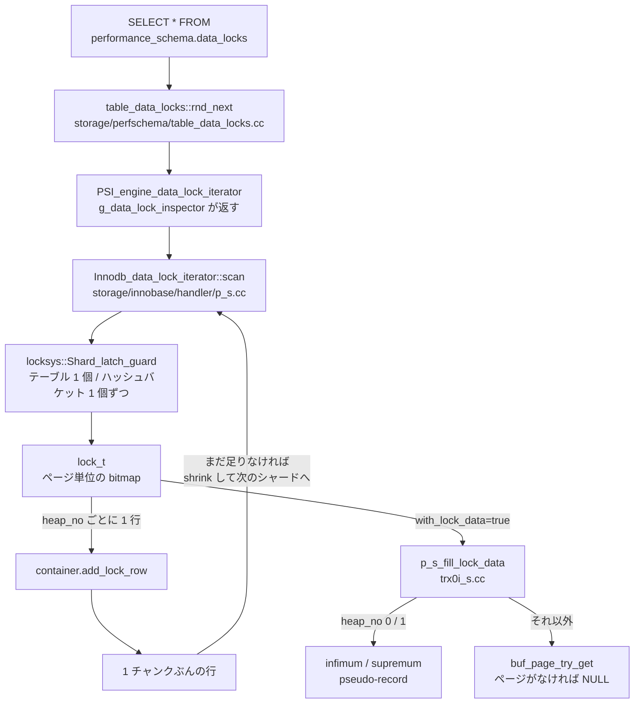

> **前提**: [ロックの種類 (InnoDB)](./lock-modes-and-types/) / [performance_schema](./performance-schema-internals/)

## 何を学んだか

まず、古い手順が動かない理由から。**`INFORMATION_SCHEMA.INNODB_LOCKS` と `INNODB_LOCK_WAITS` は 8.0 で削除された**。8.4.11 の `storage/innobase/handler/i_s.cc` にこの 2 つのテーブルの定義はない。ロックを見る口は `performance_schema.data_locks` / `data_lock_waits` に移り、`sys.innodb_lock_waits` もこちらを引くように書き直されている。

移った先の実装がおもしろい。`data_locks` は **`SELECT` した瞬間に InnoDB が作る**。P_S 側は行の入れ物 (`PSI_server_data_lock_container`) を用意するだけで、行を詰めるのは InnoDB の `Innodb_data_lock_iterator::scan()` だ。その走査は `lock_sys` の[シャードの latch](./lock-sys-sharding/) を 1 個ずつ取りながら、バケット単位で少しずつ進む。



## なぜそうなっているか

### なぜ「一貫性のないスキャン」を選んだか

`lock_sys` は table と page それぞれ 512 シャードに分かれ、シャードごとに latch を持つ ([lock_sys](./lock-sys-sharding/))。一貫したスナップショットを取るにはグローバルな排他 latch が要り、その間**すべての行ロックの取得・解放が止まる**。監視のためにワークロードを止めるのは本末転倒だ。

`SHOW ENGINE INNODB STATUS` は実際にそれをやっている ([SHOW ENGINE INNODB STATUS](./innodb-status-sections/) — `locksys::Global_exclusive_latch_guard`)。`data_locks` はそれを避けるために一貫性を捨てた。用途が違う。

### なぜ `LOCK_DATA` が `NULL` になりうるか

`buf_page_try_get` は「バッファプールにあれば latch を取って返す、なければ諦める」関数だ。ディスクから読み直すことはしない。監視のための読みがディスク I/O を起こしたら、それこそ本番を壊す。

だから `LOCK_DATA` が `NULL` の行は「ロックはあるがページが常駐していない」という意味で、ロックの存在自体は疑う必要がない。

### なぜ `I_S.INNODB_LOCKS` が消えたか

古い `I_S.INNODB_LOCKS` は `trx_i_s_cache` というグローバルなキャッシュに、全ロックを**一度に**コピーしていた。上で却下されている「全件を一度に」の実装そのもので、大きなトランザクションでメモリが膨らみ、コピー中は InnoDB が止まった。`trx0i_s.cc` の一部 (`fill_locks_row`、`trx_i_s_create_lock_id`、`p_s_fill_lock_data`) だけが `data_locks` 用に生き残っている。ロック ID の書式が古いままなのは、`I_S.innodb_trx` の `trx_requested_lock_id` と join できるようにするためだと `print_table_lock_id` のコメントに書いてある。

## ソースコードのどこか

### エンジンが行を作る

InnoDB は起動時に自分を「data lock を見せられるエンジン」として登録する ([`ha_innodb.cc#L5630`](https://github.com/mysql/mysql-server/blob/mysql-8.4.11/storage/innobase/handler/ha_innodb.cc#L5630))。

```cpp title="storage/innobase/handler/ha_innodb.cc"
  mysql_data_lock_register(&innodb_data_lock_inspector);
```

`Innodb_data_lock_inspector` は [`storage/innobase/handler/p_s.h#L41`](https://github.com/mysql/mysql-server/blob/mysql-8.4.11/storage/innobase/handler/p_s.h#L41) にあり、iterator を作る / 壊すだけの 4 つのメソッドしか持たない。

```cpp title="storage/innobase/handler/p_s.h"
class Innodb_data_lock_inspector : public PSI_engine_data_lock_inspector {
 public:
  PSI_engine_data_lock_iterator *create_data_lock_iterator() override;
  PSI_engine_data_lock_wait_iterator *create_data_lock_wait_iterator() override;
```

P_S 側の [`table_data_locks::rnd_next` (`storage/perfschema/table_data_locks.cc#L132`)](https://github.com/mysql/mysql-server/blob/mysql-8.4.11/storage/perfschema/table_data_locks.cc#L132) は、コンテナが空になるたびに `scan()` を呼び直す。この呼び出しに付いているコメントが、この設計の契約を書いている。

```cpp title="storage/perfschema/table_data_locks.cc"
      /*
        The implementation of PSI_engine_data_lock_iterator::scan(),
        inside a storage engine, is expected to:
        - (1) not report all the data at once,
        - (2) implement re-startable scans internally,
        - (3) report a bounded number of rows per scan (1).

        This is to allow allocating only a bounded amount of memory
        in the data container, to cap the peak memory consumption
        of the container.

        TODO: Innodb_data_lock_iterator::scan()
        does not satisfy (3) currently.
      */

      iterator_done = it->scan(&m_container, true);
```

`scan()` の第 2 引数 `with_lock_data` は `true` 固定だ。同じ関数の少し上に `TODO: avoid requesting column LOCK_DATA if not used.` とある。つまり **`LOCK_DATA` を `SELECT` しなくても毎回組み立てられる**。

### 全部を一度に取らない理由がファイル冒頭に書いてある

[`storage/innobase/handler/p_s.cc`](https://github.com/mysql/mysql-server/blob/mysql-8.4.11/storage/innobase/handler/p_s.cc#L60) の Doxygen コメントは、却下した 2 案と採用案を並べた設計メモになっている。

- **全件を一度に** — 一貫性は得られるが「InnoDB engine is frozen for the entire duration, for a time that is unpredictable」。メモリも青天井
- **1 行ずつ** — メモリは有界だが、リストを N 回走査するので O(N²)。1 万トランザクションなら 1 億回の操作
- **採用: restartable batch scan** — シャードごとに latch を取り、テーブルロックは 1 テーブルずつ、レコードロックはハッシュのバケット 1 個ずつ処理する

そして採用案の性質をこう認めている。

> The data returned is not consistent, but at least it is "consistent by chunks"

`data_locks` の 1 回の `SELECT` は**スナップショットではない**。走査の途中で取られたロックが見えたり見えなかったりする。

### `data_locks` の列と InnoDB の対応

行を詰めるのは [`Innodb_data_lock_iterator::report` (`p_s.cc#L438`)](https://github.com/mysql/mysql-server/blob/mysql-8.4.11/storage/innobase/handler/p_s.cc#L438) だ。列定義は [`table_data_locks.cc#L55`](https://github.com/mysql/mysql-server/blob/mysql-8.4.11/storage/perfschema/table_data_locks.cc#L55)。

| 列                                                                       | 値の出所                                                                                                                                       | 補足                                                                                         |
| ------------------------------------------------------------------------ | ---------------------------------------------------------------------------------------------------------------------------------------------- | -------------------------------------------------------------------------------------------- |
| `ENGINE`                                                                 | `"INNODB"` 固定                                                                                                                                | 8.4 では `COUNT_DATA_LOCK_ENGINES == 1` を `static_assert` している                          |
| `ENGINE_LOCK_ID`                                                         | `trx_i_s_create_lock_id` が組み立てる `trx:space:page:heap_no:guid` 形式                                                                       | `I_S.innodb_trx.trx_requested_lock_id` と join できるよう互換を保っている                    |
| `ENGINE_TRANSACTION_ID`                                                  | `lock_get_trx_id(&lock)`                                                                                                                       | read-only トランザクションは `trx->id == 0` ([トランザクション](./transaction-walkthrough/)) |
| `THREAD_ID` / `EVENT_ID`                                                 | `lock_get_psi_event()`                                                                                                                         | P_S のスレッド ID。`processlist_id` ではない                                                 |
| `OBJECT_SCHEMA` / `OBJECT_NAME` / `PARTITION_NAME` / `SUBPARTITION_NAME` | `lock_get_table_name(&lock).m_name` を `dict_name::get_table` / `get_partition` で分解                                                         | [パーティション](./partitioning/)は 1 つ 1 つが別のテーブル名を持つ                          |
| `INDEX_NAME`                                                             | `lock_rec_get_index_name(&lock)`                                                                                                               | `LOCK_TYPE='TABLE'` の行では `NULL`                                                          |
| `OBJECT_INSTANCE_BEGIN`                                                  | `lock_t` のアドレス                                                                                                                            | 同じ `lock_t` の複数ビットは同じ値になる                                                     |
| `LOCK_TYPE`                                                              | [`lock_get_type_str` (`lock0lock.cc#L5759`)](https://github.com/mysql/mysql-server/blob/mysql-8.4.11/storage/innobase/lock/lock0lock.cc#L5759) | `RECORD` か `TABLE` の 2 値                                                                  |
| `LOCK_MODE`                                                              | [`lock_get_mode_str` (`lock0lock.cc#L5704`)](https://github.com/mysql/mysql-server/blob/mysql-8.4.11/storage/innobase/lock/lock0lock.cc#L5704) | モード名 + フラグ名をカンマで連結 (下記)                                                     |
| `LOCK_STATUS`                                                            | `lock_is_waiting(lock) ? "WAITING" : "GRANTED"`                                                                                                |                                                                                              |
| `LOCK_DATA`                                                              | [`p_s_fill_lock_data` (`trx0i_s.cc#L587`)](https://github.com/mysql/mysql-server/blob/mysql-8.4.11/storage/innobase/trx/trx0i_s.cc#L587)       | 下記                                                                                         |

`lock_t` は 1 個で**ページ 1 枚ぶんのビットマップ**を持つので、`scan` は `lock_rec_find_set_bit` でビットを 1 個ずつ辿り、立っているビットの数だけ行を作る。だから `OBJECT_INSTANCE_BEGIN` が同じで `ENGINE_LOCK_ID` の末尾 (heap_no) だけ違う行が並ぶ ([ロックの種類](./lock-modes-and-types/))。

### `LOCK_MODE` の読み方

`lock_get_mode_str` はモード名 (`LOCK_` を剥いだもの) に、立っているフラグ名を昇順に連結する。フラグの名前は [`lock0lock.cc#L88`](https://github.com/mysql/mysql-server/blob/mysql-8.4.11/storage/innobase/lock/lock0lock.cc#L88) の 5 個だ。

```cpp title="storage/innobase/lock/lock0lock.cc"
static const std::map<uint, const char *> lock_constant_names{
    {LOCK_GAP, "GAP"},
    {LOCK_REC_NOT_GAP, "REC_NOT_GAP"},
    {LOCK_INSERT_INTENTION, "INSERT_INTENTION"},
    {LOCK_PREDICATE, "PREDICATE"},
    {LOCK_PRDT_PAGE, "PRDT_PAGE"},
};
```

`LOCK_ORDINARY` は値 0 なので**名前が付かない**。ここが読み方の要点になる。

| `LOCK_MODE`                       | 意味                                                                                |
| --------------------------------- | ----------------------------------------------------------------------------------- |
| `X` / `S`                         | next-key lock。レコードとその手前のギャップの両方 (RR の既定)                       |
| `X,REC_NOT_GAP` / `S,REC_NOT_GAP` | レコードだけ。ギャップは含まない ([RC](./locking-in-rr-vs-rc/)ではこれが標準)       |
| `X,GAP` / `S,GAP`                 | ギャップだけ。レコードそのものは含まない                                            |
| `X,GAP,INSERT_INTENTION`          | insert intention。挿入待ちの表明 ([INSERT のロック](./insert-and-duplicate-check/)) |
| `IX` / `IS`                       | テーブルレベルの意図ロック。`LOCK_TYPE='TABLE'` の行                                |

フラグなしの `X` を「行ロック」と読むと誤読する。**next-key lock なのでギャップも押さえている**。

### `LOCK_DATA` の読み方

[`p_s_fill_lock_data` (`storage/innobase/trx/trx0i_s.cc#L587`)](https://github.com/mysql/mysql-server/blob/mysql-8.4.11/storage/innobase/trx/trx0i_s.cc#L587) は 4 通りの結果を返す。

```cpp title="storage/innobase/trx/trx0i_s.cc"
  switch (heap_no) {
    case PAGE_HEAP_NO_INFIMUM:
      *lock_data = "infimum pseudo-record";
      return;
    case PAGE_HEAP_NO_SUPREMUM:
      *lock_data = "supremum pseudo-record";
      return;
  }
  ...
  block = buf_page_try_get(lock_rec_get_page_id(lock), UT_LOCATION_HERE, &mtr);

  if (block == nullptr) {
    *lock_data = nullptr;
    mtr_commit(&mtr);
    return;
  }
  ...
  n_fields = dict_index_get_n_unique_in_tree(index);
```

1. **`supremum pseudo-record`** — ページの末尾にある番兵 ([ページの構造](./page-layout/))。実在の行ではないので、これに対するロックは必ず**そのページの最後の行より後ろのギャップ**を意味する。「どの行もロックしていないのにロック待ちが出る」の典型がこれだ
2. **`infimum pseudo-record`** — ページ先頭の番兵。next-key lock の下限側
3. **`NULL`** — `buf_page_try_get` が失敗したとき。ページが[バッファプール](./buffer-pool-walkthrough/)にないか、latch を待たずに諦めたときで、**ロックが消えたわけではない**
4. **カンマ区切りの値** — `dict_index_get_n_unique_in_tree(index)` 個のフィールドだけを印字する。クラスタードインデックスなら主キー、セカンダリインデックスなら「セカンダリキー + 主キー」だ ([セカンダリインデックス](./secondary-index/))。バッファは `TRX_I_S_LOCK_DATA_MAX_LEN` で打ち切られる

印字には `mtr_start` / `mtr_commit` が要る。つまり `data_locks` を読むと[バッファプールのページ latch](./buffer-pool-walkthrough/) にも触る。

### `data_lock_waits` は待ちの辺だけ

[`table_data_lock_waits.cc#L54`](https://github.com/mysql/mysql-server/blob/mysql-8.4.11/storage/perfschema/table_data_lock_waits.cc#L54) の列は `REQUESTING_*` と `BLOCKING_*` の対称な組で、それぞれ `ENGINE_LOCK_ID` / `ENGINE_TRANSACTION_ID` / `THREAD_ID` / `EVENT_ID` / `OBJECT_INSTANCE_BEGIN` を持つ。テーブル名も行の値も入っていないので、**`data_locks` と join しないと何のロックか分からない**。

`Innodb_data_lock_wait_iterator::scan` ([`p_s.cc#L548`](https://github.com/mysql/mysql-server/blob/mysql-8.4.11/storage/innobase/handler/p_s.cc#L548)) も `data_locks` と同じくシャードを 1 個ずつ latch する。

### `metadata_locks` は別の世界

[MDL](./metadata-locking/) は InnoDB の行ロックとはまったく別の機構で、`performance_schema.metadata_locks` ([`table_md_locks.cc#L53`](https://github.com/mysql/mysql-server/blob/mysql-8.4.11/storage/perfschema/table_md_locks.cc#L53)) に出る。

```cpp title="storage/perfschema/table_md_locks.cc"
    "  OBJECT_TYPE VARCHAR(64) not null,\n"
    "  OBJECT_SCHEMA VARCHAR(64),\n"
    "  OBJECT_NAME VARCHAR(64),\n"
    "  COLUMN_NAME VARCHAR(64),\n"
    "  OBJECT_INSTANCE_BEGIN BIGINT unsigned not null,\n"
    "  LOCK_TYPE VARCHAR(32) not null,\n"
    "  LOCK_DURATION VARCHAR(32) not null,\n"
    "  LOCK_STATUS VARCHAR(32) not null,\n"
    "  SOURCE VARCHAR(64),\n"
```

`LOCK_TYPE` には `SHARED_READ` / `SHARED_WRITE` / `EXCLUSIVE` のような MDL のモード名が入り、`LOCK_DURATION` は `STATEMENT` / `TRANSACTION` / `EXPLICIT`。`ALTER TABLE` が固まったときはこちらを見る — `data_locks` には何も出ない。この表は `wait/lock/metadata/sql/mdl` の instrument が有効なときだけ埋まる ([performance_schema](./performance-schema-internals/))。

### sys スキーマのビュー

`scripts/sys_schema/views/p_s/` にある SQL がそのままビュー定義になる。3 つ見る。

**[`innodb_lock_waits.sql`](https://github.com/mysql/mysql-server/blob/mysql-8.4.11/scripts/sys_schema/views/p_s/innodb_lock_waits.sql)** は 5 つの表を join する。

```sql
    FROM performance_schema.data_lock_waits w
 INNER JOIN information_schema.innodb_trx b  ON b.trx_id = CAST(w.blocking_engine_transaction_id AS CHAR)
 INNER JOIN information_schema.innodb_trx r  ON r.trx_id = CAST(w.requesting_engine_transaction_id AS CHAR)
 INNER JOIN performance_schema.data_locks bl
   ON ((bl.engine_lock_id = w.blocking_engine_lock_id) AND (bl.engine = w.engine))
 INNER JOIN performance_schema.data_locks rl
   ON ((rl.engine_lock_id = w.requesting_engine_lock_id) AND (rl.engine = w.engine))
```

`data_locks` を 2 回、`data_lock_waits` を 1 回、`innodb_trx` を 2 回引く。しかも `ALGORITHM = TEMPTABLE` なので、内部一時表に materialize される。**1 回の `SELECT * FROM sys.innodb_lock_waits` は InnoDB の latch を何度も取る**。便利さの対価がこれで、待ちが多いときほど重くなる。

見返りに `sql_kill_blocking_query` (`CONCAT('KILL QUERY ', b.trx_mysql_thread_id)`) までカラムとして用意されている。コピーして貼れば止められる。

**[`schema_unused_indexes.sql`](https://github.com/mysql/mysql-server/blob/mysql-8.4.11/scripts/sys_schema/views/p_s/schema_unused_indexes.sql)** は `table_io_waits_summary_by_index_usage` の `count_star = 0` を探す。ただし条件が 5 つ付く。

```sql
 WHERE t.index_name IS NOT NULL
   AND t.count_star = 0
   AND t.object_schema != 'mysql'
   AND t.index_name != 'PRIMARY'
   AND s.NON_UNIQUE = 1
   AND s.SEQ_IN_INDEX = 1
```

`s.NON_UNIQUE = 1` があるので、**UNIQUE インデックスは絶対に出てこない**。制約として必要かもしれないからだ。ビューのコメント自身も「サーバが代表的な期間ずっと上がっていたことを確認してから信じろ」と書いている。再起動でカウンタが 0 に戻るので、起動直後に見ると全インデックスが未使用に見える。

**[`statement_analysis.sql`](https://github.com/mysql/mysql-server/blob/mysql-8.4.11/scripts/sys_schema/views/p_s/statement_analysis.sql)** は `events_statements_summary_by_digest` を `SUM_TIMER_WAIT DESC` で並べ直しただけだ。`ALGORITHM = MERGE` なので一時表は作らない。加工は `format_pico_time` / `format_bytes` / `format_statement` による整形と、`SUM_NO_GOOD_INDEX_USED > 0 OR SUM_NO_INDEX_USED > 0` を `full_scan` の `*` にまとめている部分だけ。

## どう活かすか

**`Lock wait timeout exceeded; try restarting transaction` の犯人を特定する。** `sys.innodb_lock_waits` を見て `blocking_pid` を取り、`sql_kill_blocking_query` 列をそのまま実行する。ただし待ちは 50 秒 (`innodb_lock_wait_timeout` の既定) で消えるので、間に合わないことが多い。継続的に取るなら `data_lock_waits` を定期ポーリングするより、[デッドロックのログ](./deadlock-detection/) (`innodb_print_all_deadlocks`) と slow log を残すほうが確実だ。

**`LOCK_DATA` が `supremum pseudo-record` の行を見たらギャップを疑う。** 「存在しない行を狙った `SELECT ... FOR UPDATE`」や「範囲の末尾までの `WHERE id > 100`」でこれが出る。RR で走っているなら、[RC に落とす](./locking-in-rr-vs-rc/)とギャップが消えて待ちがなくなることがある。ただし RC は他の性質も変わるので、[分離レベルの差](./isolation-levels-and-anomalies/)を確認してから決める。

**`LOCK_MODE` のフラグなしの `X` を「1 行のロック」と読まない。** フラグがない = `LOCK_ORDINARY` = next-key lock だ。`X,REC_NOT_GAP` になっていて初めて「その行だけ」と言える。

**`INSERT` が待つときは `INSERT_INTENTION` を探す。** `LOCK_MODE` に `INSERT_INTENTION` があり `LOCK_STATUS='WAITING'` なら、ギャップロックとの衝突だ。相手は `X,GAP` か素の `X` を持っている。同じギャップに複数セッションが insert intention を積むと[デッドロック](./insert-and-duplicate-check/)になる。

**`ALTER TABLE` が固まるときに `data_locks` を見ても何も出ない。** MDL は別の表だ。`performance_schema.metadata_locks` で `LOCK_STATUS='PENDING'` の行を探し、同じ `OBJECT_NAME` を `GRANTED` で持っているスレッドを止める ([MDL](./metadata-locking/))。

**`sys.schema_unused_indexes` を鵜呑みにしない。** UNIQUE インデックスは定義上出ない。加えて、`table_io_waits_summary_by_index_usage` は再起動でリセットされ、`setup_instruments` の `wait/io/table/sql/handler` が無効なら永久に 0 のままだ。消す前に `information_schema.statistics` で外部キーに使われていないかも確認する。

**`data_locks` の `SELECT` そのものが重い。** シャードの latch を順に取り、`LOCK_DATA` のためにページも触る。ロック数が多い状況 (まさに調べたい状況) ほど重くなる。監視エージェントから 1 秒間隔で叩くようなことはしない。`WHERE OBJECT_SCHEMA = ... AND OBJECT_NAME = ...` で絞れば、`container.accept_object()` がエンジン側で行を捨てるので多少軽くなる。
