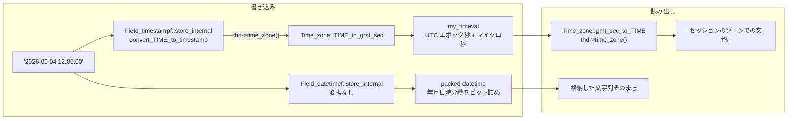

> **前提**: [型と Field クラス](./field-and-types/)

## 何を学んだか

`DATETIME` と `TIMESTAMP` の違いを「範囲が違う」「TIMESTAMP は 4 バイト」と覚えていると、時差の絡む障害で必ず外す。本質的な差は 1 つだ。

**`TIMESTAMP` は書くときと読むときにタイムゾーン変換を通り、`DATETIME` は通らない。**

```cpp title="sql/field.cc"
type_conversion_status Field_timestampf::store_internal(const MYSQL_TIME *ltime,
                                                        int *warnings) {
  THD *thd = current_thd;
  my_timeval tm;
  convert_TIME_to_timestamp(ltime, *thd->time_zone(), &tm, warnings);
```

[`sql/field.cc#L5235`](https://github.com/mysql/mysql-server/blob/mysql-8.4.11/sql/field.cc#L5235)。`thd->time_zone()` が変換に使われている。対して `DATETIME` は。

```cpp title="sql/field.cc"
type_conversion_status Field_datetimef::store_internal(const MYSQL_TIME *ltime,
                                                       int *) {
  /*
    If time zone displacement information is present in "ltime"
    - adjust the value to UTC based on the time zone
    - convert to the local time zone
  */
  MYSQL_TIME temp_t = *ltime;
  if (convert_time_zone_displacement(current_thd->time_zone(), &temp_t))
    return TYPE_ERR_BAD_VALUE;
  store_packed(TIME_to_longlong_datetime_packed(temp_t));
```

[`sql/field.cc#L6023`](https://github.com/mysql/mysql-server/blob/mysql-8.4.11/sql/field.cc#L6023)。**`convert_time_zone_displacement` が呼ばれるのはリテラルが `'2020-01-01 10:00:00+09:00'` のように時差を明示した場合だけ**で、それ以外は受け取った年月日時分秒をそのまま詰める。

ここから出てくることをまとめる。

- **`TIMESTAMP` の列に入っているのは UTC のエポック秒。** 表示されている文字列は毎回セッションのタイムゾーンで作り直されている
- **`DATETIME` の列に入っているのは、時差の情報を持たない「壁時計の値」。** 誰がどこで読んでも同じ文字列が返る
- **`TIMESTAMP` の上限は 2038 年。** 内部の `my_time_t` は 64 ビットになったが、列の型としての上限は `int32` の最大値のまま
- **タイムゾーンは 4 実装ある。** SYSTEM / UTC / 名前付き / オフセットで、コストも前提も違う
- **`Asia/Tokyo` のような名前を使うには `mysql.time_zone*` テーブルの投入が要る。** `+09:00` なら要らない



## なぜそうなっているか

**`TIMESTAMP` を UTC 秒にしたのは、「同じ瞬間」を表したかったからだ。** ログの記録時刻やレプリケーションの順序は、どのタイムゾーンから見ても同じ順序でなければならない。エポック秒なら比較がそのまま時系列になる。

**`DATETIME` を変換しないのは、「壁時計の値」を表したかったからだ。** 「毎朝 9 時に開店」の 9 時は、サーバのタイムゾーン設定を変えても 9 時のままであってほしい。これは瞬間ではなく暦上の位置なので、UTC に直すと意味が壊れる。

**2 つの型が並んでいるのは、両方の要求が実在するからだ。** 「いつ起きたか」は `TIMESTAMP`、「いつと決めたか」は `DATETIME` になる。片方だけで両方を表そうとすると、アプリ側でタイムゾーンを持ち回ることになる。

**上限が 2038 年で止まっているのは、システムタイムゾーンの実装が OS の `time_t` に依存しているからだ。** ソースにその旨が書かれている。

```cpp title="sql/tztime.cc"
  NOTE
    We assume that value passed to this function will fit into time_t range
    supported by localtime_r. This conversion is putting restriction on
    TIMESTAMP range in MySQL. If we can get rid of SYSTEM time zone at least
    for interaction with client then we can extend TIMESTAMP range down to
    the 1902 easily.
*/
void Time_zone_system::gmt_sec_to_TIME(MYSQL_TIME *tmp, my_time_t t) const {
  struct tm tmp_tm;
  const time_t tmp_t = (time_t)t;

  localtime_r(&tmp_t, &tmp_tm);
```

[`sql/tztime.cc#L709`](https://github.com/mysql/mysql-server/blob/mysql-8.4.11/sql/tztime.cc#L709)。`my_time_t` は既に 64 ビットになっているが、`SYSTEM` ゾーンの変換が `localtime_r` に丸投げである限り、範囲を広げると環境依存の挙動になる。

## ソースコードのどこか

### 4 つのタイムゾーン実装

```cpp title="sql/tztime.h"
class Time_zone {
 public:
  /**
    Enum to identify the type of the timezone
  */
  enum tz_type { TZ_DB = 1, TZ_OFFSET = 2, TZ_SYSTEM = 3, TZ_UTC = 4 };

  virtual my_time_t TIME_to_gmt_sec(const MYSQL_TIME *t,
                                    bool *in_dst_time_gap) const = 0;
  virtual void gmt_sec_to_TIME(MYSQL_TIME *tmp, my_time_t t) const = 0;
```

[`sql/tztime.h#L49`](https://github.com/mysql/mysql-server/blob/mysql-8.4.11/sql/tztime.h#L49)。実装は `tztime.cc` に 4 つ並ぶ。

| 実装                                                                                                    | 指定            | 変換方法                                      |
| ------------------------------------------------------------------------------------------------------- | --------------- | --------------------------------------------- |
| `Time_zone_system` ([L646](https://github.com/mysql/mysql-server/blob/mysql-8.4.11/sql/tztime.cc#L646)) | `SYSTEM`        | `localtime_r` / `my_system_gmt_sec`           |
| `Time_zone_utc` ([L748](https://github.com/mysql/mysql-server/blob/mysql-8.4.11/sql/tztime.cc#L748))    | `+00:00` に相当 | 計算のみ                                      |
| `Time_zone_db` ([L840](https://github.com/mysql/mysql-server/blob/mysql-8.4.11/sql/tztime.cc#L840))     | `Asia/Tokyo`    | `mysql.time_zone*` から読んだ遷移表を二分探索 |
| `Time_zone_offset` ([L928](https://github.com/mysql/mysql-server/blob/mysql-8.4.11/sql/tztime.cc#L928)) | `+09:00`        | 秒を足し引きするだけ                          |

**DST (夏時間) の遷移を正しく扱えるのは `Time_zone_system` と `Time_zone_db` だけ**になる。`+09:00` は固定オフセットなので、日本のように DST のない地域では等価だが、DST のある地域では夏と冬でずれる。

`in_dst_time_gap` という出力引数があるのは、春の切り替えで**存在しない時刻**が指定されうるからだ。`2:30` が飛ばされる地域では、その値を格納しようとすると変換に失敗する。

### 名前の解決 — グローバルなキャッシュとテーブル読み込み

```cpp title="sql/tztime.cc"
Time_zone *my_tz_find(THD *thd, const String *name) {
  ...
  MUTEX_LOCK(guard, &tz_LOCK);

  int displacement;
  if (!str_to_offset(name->ptr(), name->length(), &displacement)) {
    // The time zone information is a valid numeric displacement.
    const auto it = offset_tzs.find(displacement);
    ...
  } else {
    const auto it = tz_names.find(to_string(*name));
    if (it != tz_names.end())
      return it->second->tz;
    else if (time_zone_tables_exist) {
      Table_ref tz_tables[MY_TZ_TABLES_COUNT];
      ...
      if (!open_trans_system_tables_for_read(thd, tz_tables)) {
        Time_zone *result_tz = tz_load_from_open_tables(name, tz_tables);
```

[`sql/tztime.cc#L1805`](https://github.com/mysql/mysql-server/blob/mysql-8.4.11/sql/tztime.cc#L1805)。3 段になっている。

1. **`+09:00` 形式なら、オフセットのマップから引くか作る。** テーブルは要らない
2. **名前ならまずキャッシュ (`tz_names`) を引く**
3. **キャッシュになければ `mysql.time_zone*` を開いて読み、キャッシュに載せる**

`time_zone_tables_exist` が false なら 3 が丸ごと飛び、`SET time_zone = 'Asia/Tokyo'` が `Unknown or incorrect time zone` で失敗する。**タイムゾーンテーブルはインストール時に自動で埋まらない**ので、`mysql_tzinfo_to_sql` で投入する運用が必要になる。

`tz_LOCK` はグローバルな mutex だが、掴むのは `SET time_zone` の解決時だけで、行ごとの変換では掴まない。

### `TIMESTAMP` の範囲

```cpp title="include/my_time.h"
/** max seconds from epoch that can be stored in a column of type TIMESTAMP.
    This also impacts the max value that can be given to SET TIMESTAMP
*/
constexpr const std::int64_t TYPE_TIMESTAMP_MAX_VALUE =
    std::numeric_limits<std::int32_t>::max();
constexpr const std::int64_t TYPE_TIMESTAMP_MIN_VALUE = 1;
```

[`include/my_time.h#L89`](https://github.com/mysql/mysql-server/blob/mysql-8.4.11/include/my_time.h#L89)。`int32` の最大値 = 2147483647 秒 = **2038-01-19 03:14:07 UTC**。下限が 0 ではなく 1 なのは、0 を「ゼロ日付」の表現に使っているからだ。

一方 `my_time_t` 自体は 64 ビットになっている。

```cpp title="include/my_time_t.h"
using my_time_t = int64_t;
```

[`include/my_time_t.h#L32`](https://github.com/mysql/mysql-server/blob/mysql-8.4.11/include/my_time_t.h#L32)。**内部表現は既に 2038 年問題を抜けているが、列の型としての上限は残っている**という状態になる。`DATETIME` にはこの上限がなく 9999 年まで入る。

### 8.4 の既定 — `explicit_defaults_for_timestamp` は ON

```cpp title="sql/sys_vars.cc"
static Sys_var_bool Sys_explicit_defaults_for_timestamp(
    "explicit_defaults_for_timestamp",
    "This option causes CREATE TABLE to create all TIMESTAMP columns "
    "as NULL with DEFAULT NULL attribute, Without this option, "
    "TIMESTAMP columns are NOT NULL and have implicit DEFAULT clauses. "
    "The old behavior is deprecated. "
    ...
    DEFAULT(true), NO_MUTEX_GUARD, NOT_IN_BINLOG,
    ON_CHECK(check_explicit_defaults_for_timestamp));
```

[`sql/sys_vars.cc#L1671`](https://github.com/mysql/mysql-server/blob/mysql-8.4.11/sql/sys_vars.cc#L1671)。**既定が `true`** になっている。これが `false` だった時代の挙動は次の 3 つだった。

- テーブルの**最初の** `TIMESTAMP` 列が、書かなくても `DEFAULT CURRENT_TIMESTAMP ON UPDATE CURRENT_TIMESTAMP` になる
- `TIMESTAMP` 列が暗黙に `NOT NULL` になる
- `NULL` を代入すると現在時刻が入る

`true` では全部なくなり、`TIMESTAMP` は他の型と同じ扱いになる。`OFF` に戻すと非推奨警告が出る ([`check_explicit_defaults_for_timestamp` (`sql/sys_vars.cc#L1317`)](https://github.com/mysql/mysql-server/blob/mysql-8.4.11/sql/sys_vars.cc#L1317))。

## どう活かすか

### `TIMESTAMP` の値はセッションのタイムゾーンに依存する

同じ行を、`time_zone = '+00:00'` の接続と `time_zone = 'Asia/Tokyo'` の接続から読むと、`TIMESTAMP` 列は違う文字列を返し、`DATETIME` 列は同じ文字列を返す。ここから実務的な帰結が出てくる。

- **アプリのタイムゾーン設定を変えると、`TIMESTAMP` の見え方が変わる。** データは変わっていない
- **`WHERE ts_col = '2026-09-04 12:00:00'` の意味もセッション依存。** 右辺のリテラルが同じ変換を通るので比較自体は整合するが、別のタイムゾーンの接続では別の行が返る
- **バッチとオンラインでタイムゾーンが違うと、集計の境界がずれる**

接続プールを使うなら、**タイムゾーンを接続確立時に明示的に固定する**のが安全になる ([コネクションプールとセッション状態](./connection-pool-and-session-state/))。多くのドライバに接続オプションがあり、指定しなければサーバの既定 (`SYSTEM`) が使われる。

### `DATETIME` に「その瞬間」を入れると復元できない

`DATETIME` は時差を持たないので、`NOW()` の結果を `DATETIME` に入れると「どのタイムゾーンでの値か」がデータから失われる。サーバのタイムゾーン設定を変えた瞬間、過去のデータの解釈が変わる — 正確には、**変わらないのはバイト列だけで、意味が変わる**。

イベントの発生時刻には `TIMESTAMP`、あるいは `DATETIME` + タイムゾーン列を使う。「アプリは常に UTC で動かして `DATETIME` に入れる」という設計も成立するが、その場合は `time_zone` を `+00:00` に固定して `NOW()` と一致させておかないと、DB 側の関数と食い違う。

### 2038 年問題は `TIMESTAMP` にだけ残っている

有効期限や予約日時のように未来を入れる列に `TIMESTAMP` を使っていると、2038-01-19 を超えた値が入らない。`DATETIME` なら 9999 年まで入る。**「未来の日時」には `DATETIME`、「起きた時刻」には `TIMESTAMP`** という使い分けが、この上限からも支持される。

既存の `TIMESTAMP` 列を `DATETIME` に変えるのは `ALGORITHM=COPY` のテーブル再構築になる ([ALGORITHM と LOCK の決定](./alter-algorithm-selection/))。大きいテーブルほど早く判断したほうがいい。

### `Asia/Tokyo` が使えないサーバがある

`mysql.time_zone*` テーブルが空だと、名前付きゾーンの指定が丸ごと失敗する。マネージドサービスでは投入済みのことが多いが、自前構築や公式 Docker イメージでは空のままのことがある。

判定は `SELECT COUNT(*) FROM mysql.time_zone_name` で足りる。空なら `+09:00` のようなオフセット指定に切り替えるか、`mysql_tzinfo_to_sql` で投入する。DST のない地域なら固定オフセットで実害はない。

### 一般化して持ち帰るもの

**「瞬間」と「暦上の位置」は別の型である**というのが、この 2 つの型が並んでいる理由だ。多くのアプリケーションのバグは、この 2 つを 1 つの型で表そうとしたところから出る。MySQL は型の設計としてこれを分けたが、`DATETIME` と `TIMESTAMP` という名前がその区別を表していないので、名前から意図を読み取れない。ソースを読むと、違いは `store_internal` に `thd->time_zone()` が出てくるかどうかという 1 点に集約されている。

もう 1 つは、**下位層への依存が上位の仕様を縛る**という例だ。`SYSTEM` タイムゾーンが OS の `localtime_r` を呼んでいるという実装上の都合が、「`TIMESTAMP` の範囲は 1970-2038」というユーザから見える仕様になっている。ソースのコメントが「クライアントとのやり取りから SYSTEM を外せれば 1902 年まで広げられる」と書き残しているのは、その依存を自覚しているということだ。
