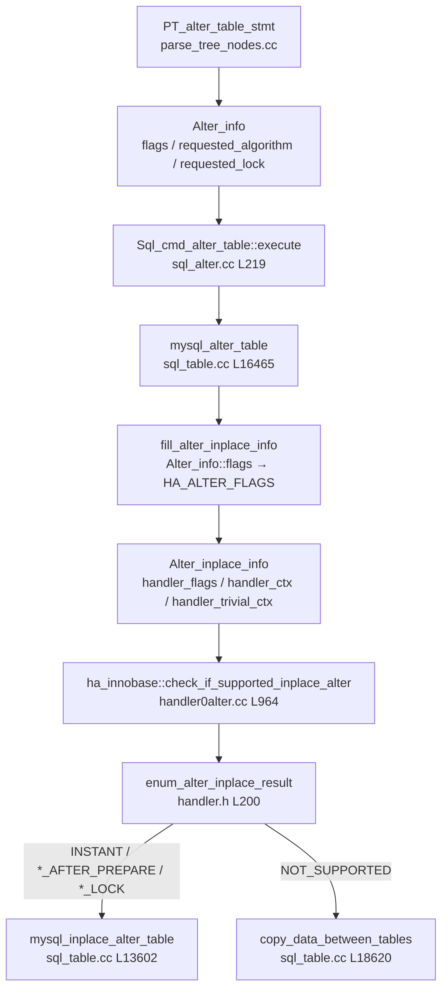
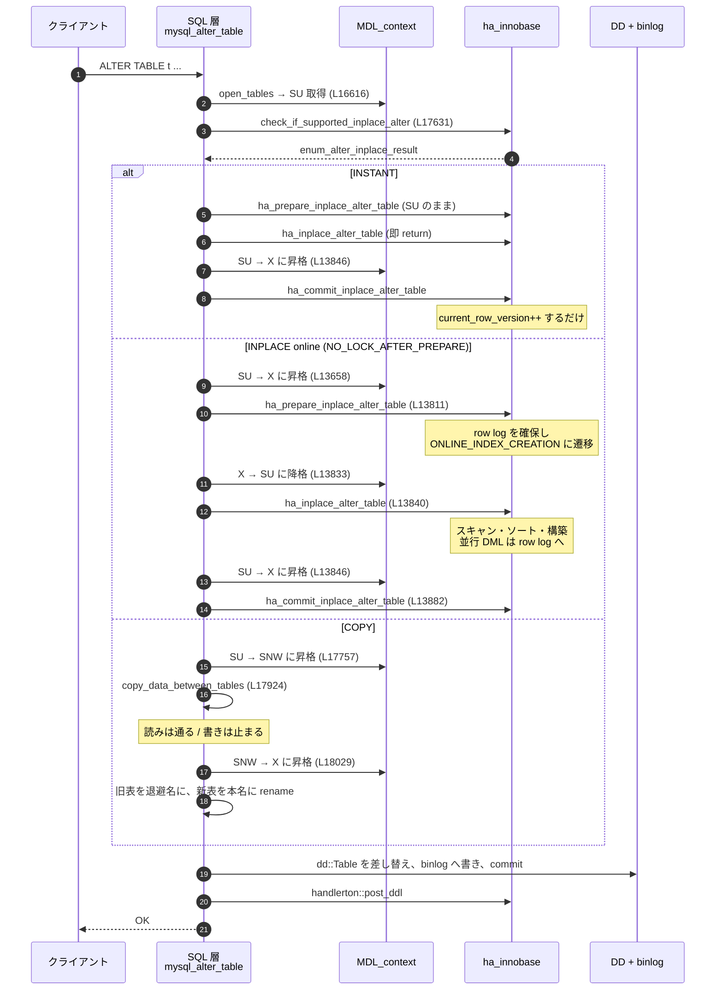

> **前提**: [handler](./handler-walkthrough/) / [データディクショナリ](./data-dictionary/)

## この層の責務

`ALTER TABLE` は 1 つの文だが、内部では性格の違う 3 つの仕事をまとめてやっている。

1. **メタデータの排他制御** — 誰がこのテーブルを見ているか、いつなら定義を差し替えてよいかを MDL で決める
2. **アルゴリズムの選択** — 行を書き直すのか、インデックスだけ作るのか、辞書だけ触るのか
3. **データディクショナリの更新** — 新しい定義を `mysql.tables` などに書き、InnoDB のテーブルスペースの変更と 1 つのトランザクションで確定する

この 3 つが `sql/sql_table.cc` の `mysql_alter_table` (2100 行を超える 1 関数) の中で絡み合っている。

分業の境界がやや意外なところにある。**構文で書かれた `ALGORITHM=` / `LOCK=` を受け取るのは SQL 層だが、「実際にどれが可能か」を決めるのはストレージエンジンだ。** `sql/sql_alter.cc` は 449 行しかなく、そこにあるのは権限チェックと `mysql_alter_table` の呼び出しだけで ([`Sql_cmd_alter_table::execute` L219](https://github.com/mysql/mysql-server/blob/mysql-8.4.11/sql/sql_alter.cc#L219)、[呼び出し L350](https://github.com/mysql/mysql-server/blob/mysql-8.4.11/sql/sql_alter.cc#L350))、判定は 11321 行ある [`storage/innobase/handler/handler0alter.cc`](https://github.com/mysql/mysql-server/blob/mysql-8.4.11/storage/innobase/handler/handler0alter.cc) の側にある。

SQL 層がやっているのは、エンジンの答え (`enum_alter_inplace_result`) を受け取って**MDL をどこまで強めるかを決めること**だ。このページはその対応関係を固定する。理由は [ALGORITHM と LOCK の決定](./alter-algorithm-selection/)、MDL 自体の性質は [MDL のページ](./metadata-locking/)に分けた。

## 主要な型とその関係



### `Alter_info` — 構文が要求したもの

パーサが埋める側の構造体。[`sql/sql_alter.h`](https://github.com/mysql/mysql-server/blob/mysql-8.4.11/sql/sql_alter.h) にある。

- `flags` — `ALTER_ADD_COLUMN` などのビットマスク。`1ULL << 40` まで使っている
- [`requested_algorithm` (L437)](https://github.com/mysql/mysql-server/blob/mysql-8.4.11/sql/sql_alter.h#L437) — `DEFAULT` / `INPLACE` / `INSTANT` / `COPY` の 4 値
- [`requested_lock` (L439)](https://github.com/mysql/mysql-server/blob/mysql-8.4.11/sql/sql_alter.h#L439) — `DEFAULT` / `NONE` / `SHARED` / `EXCLUSIVE` の 4 値

**この 2 つは「要求」であって「結果」ではない。** 要求が通らなければ `ER_ALTER_OPERATION_NOT_SUPPORTED` になるだけで、暗黙に格下げされることはない (`DEFAULT` を指定していた場合を除く)。

`ALGORITHM=` を指定しないときの既定は `ALTER_TABLE_ALGORITHM_DEFAULT` で、**8.4.11 に `alter_algorithm` というシステム変数は存在しない** (8.0.16 で削除された)。似た名前の [`old_alter_table` (`sys_vars.cc` L3108)](https://github.com/mysql/mysql-server/blob/mysql-8.4.11/sql/sys_vars.cc#L3108) は残っていて、これを ON にすると `INPLACE` / `INSTANT` を明示していない限り強制的に COPY になる。

### `Alter_inplace_info` — エンジンに渡すもの

[`sql/handler.h#L3353`](https://github.com/mysql/mysql-server/blob/mysql-8.4.11/sql/handler.h#L3353)。`Alter_info::flags` (構文の語彙) を `HA_ALTER_FLAGS` (エンジンの語彙) に翻訳したものが入る。

```cpp title="sql/handler.h"
  typedef ulonglong HA_ALTER_FLAGS;

  // Add non-unique, non-primary index
  static const HA_ALTER_FLAGS ADD_INDEX = 1ULL << 0;
  ...
  static const HA_ALTER_FLAGS ADD_VIRTUAL_COLUMN = 1ULL << 6;
  static const HA_ALTER_FLAGS ADD_STORED_BASE_COLUMN = 1ULL << 7;
  static const HA_ALTER_FLAGS ADD_STORED_GENERATED_COLUMN = 1ULL << 8;
  static const HA_ALTER_FLAGS ADD_COLUMN =
      ADD_VIRTUAL_COLUMN | ADD_STORED_BASE_COLUMN | ADD_STORED_GENERATED_COLUMN;
```

**`Alter_info::flags` と `HA_ALTER_FLAGS` は別のビット割り当てだ。** 前者は「文に何が書いてあったか」、後者は「テーブル定義が実際にどう変わるか」を表す。`ADD COLUMN` と書いても仮想列なのか実列なのかで別のビットが立つ。この変換をやるのが [`fill_alter_inplace_info` (L17563 で呼ばれる)](https://github.com/mysql/mysql-server/blob/mysql-8.4.11/sql/sql_table.cc#L17563) で、**新旧の `TABLE` を突き合わせて差分を計算する**。だから「ADD/DROP が打ち消し合う ALTER」は `handler_flags == 0` になり、エンジンを呼ばずに終わる。

```cpp title="sql/sql_table.cc"
    if (ha_alter_info.handler_flags == 0) {
      /*
        No-op ALTER, no need to call handler API functions.
        ...
        Note that we can end up here if an ALTER statement has clauses
        that cancel each other out (e.g. ADD/DROP identically index).

        Also note that we ignore the LOCK clause here.
      */
```

最後の一行が効く。**打ち消し合う ALTER では `LOCK=` が無視される。**

他に重要なフィールドが 3 つある。

| フィールド            | 位置                                                                                 | 役割                                                                                         |
| --------------------- | ------------------------------------------------------------------------------------ | -------------------------------------------------------------------------------------------- |
| `handler_ctx`         | [L3655](https://github.com/mysql/mysql-server/blob/mysql-8.4.11/sql/handler.h#L3655) | エンジンが prepare 〜 commit の間で状態を持ち回す場所。InnoDB では `ha_innobase_inplace_ctx` |
| `handler_trivial_ctx` | [L3692](https://github.com/mysql/mysql-server/blob/mysql-8.4.11/sql/handler.h#L3692) | InnoDB は `Instant_Type` をここに詰める。`is_instant()` はこの値を見るだけ                   |
| `unsupported_reason`  | [L3706](https://github.com/mysql/mysql-server/blob/mysql-8.4.11/sql/handler.h#L3706) | 「なぜ INPLACE にできないか」の文字列。`SHOW WARNINGS` に出る                                |

### `enum_alter_inplace_result` — エンジンの答え

[`sql/handler.h#L200`](https://github.com/mysql/mysql-server/blob/mysql-8.4.11/sql/handler.h#L200)。8 値ある。

```cpp title="sql/handler.h"
enum enum_alter_inplace_result {
  HA_ALTER_ERROR,
  HA_ALTER_INPLACE_NOT_SUPPORTED,
  HA_ALTER_INPLACE_EXCLUSIVE_LOCK,
  HA_ALTER_INPLACE_SHARED_LOCK_AFTER_PREPARE,
  HA_ALTER_INPLACE_SHARED_LOCK,
  HA_ALTER_INPLACE_NO_LOCK_AFTER_PREPARE,
  HA_ALTER_INPLACE_NO_LOCK,
  HA_ALTER_INPLACE_INSTANT
};
```

**InnoDB が実際に返すのは 5 値だけだ。** [`ha_innobase::check_if_supported_inplace_alter`](https://github.com/mysql/mysql-server/blob/mysql-8.4.11/storage/innobase/handler/handler0alter.cc#L964) の `return` 文を全部数えると、`HA_ALTER_ERROR` / `HA_ALTER_INPLACE_NOT_SUPPORTED` / `HA_ALTER_INPLACE_INSTANT` と、最後の 1 行に集約された 2 値しかない。

```cpp title="storage/innobase/handler/handler0alter.cc"
  return online ? HA_ALTER_INPLACE_NO_LOCK_AFTER_PREPARE
                : HA_ALTER_INPLACE_SHARED_LOCK_AFTER_PREPARE;
```

つまり **InnoDB は `HA_ALTER_INPLACE_NO_LOCK` (最初から最後まで排他不要) を一度も返さない。** どの INPLACE 経路も、必ず `_AFTER_PREPARE` が付く。この 1 行が「online DDL でも排他ロックの窓が開く」という事実の出どころだ。

## 処理の流れ

### MDL の初期値は SU

`ALTER TABLE` の対象テーブルには、パース時点で `MDL_SHARED_UPGRADABLE` (SU) が要求される。

```cpp title="sql/parse_tree_nodes.cc"
static bool init_alter_table_stmt(Table_ddl_parse_context *pc, ...) {
  LEX *lex = pc->thd->lex;
  if (!lex->query_block->add_table_to_list(
          pc->thd, table_name, nullptr, TL_OPTION_UPDATING, TL_READ_NO_INSERT,
          MDL_SHARED_UPGRADABLE))
    return true;
```

[`sql/parse_tree_nodes.cc#L3229`](https://github.com/mysql/mysql-server/blob/mysql-8.4.11/sql/parse_tree_nodes.cc#L3229)。SU は SR / SW と両立するので、**`ALTER TABLE` を打った瞬間は既存の SELECT も UPDATE も止まらない**。止まるのはこの後の昇格だ。

### 3 経路の MDL 遷移



要点は **online な INPLACE で排他 MDL の窓が 2 回開くこと**だ。1 回目は prepare の直前、2 回目は commit の直前。SQL 層のコードがそれを明示している。

```cpp title="sql/sql_table.cc"
  } else if (inplace_supported == HA_ALTER_INPLACE_SHARED_LOCK_AFTER_PREPARE ||
             inplace_supported == HA_ALTER_INPLACE_NO_LOCK_AFTER_PREPARE) {
    /*
      Storage engine has requested exclusive lock only for prepare phase
      and we are not under LOCK TABLES.
      ...
    */
    if (thd->mdl_context.upgrade_shared_lock(table->mdl_ticket, MDL_EXCLUSIVE,
                                             thd->variables.lock_wait_timeout))
      goto cleanup;
```

そして prepare が終わったら降格する。

```cpp title="sql/sql_table.cc"
      /* If storage engine or user requested shared lock downgrade to SNW. */
      if (inplace_supported == HA_ALTER_INPLACE_SHARED_LOCK_AFTER_PREPARE ||
          alter_info->requested_lock == Alter_info::ALTER_TABLE_LOCK_SHARED)
        table->mdl_ticket->downgrade_lock(MDL_SHARED_NO_WRITE);
      else {
        assert(inplace_supported == HA_ALTER_INPLACE_NO_LOCK_AFTER_PREPARE);
        table->mdl_ticket->downgrade_lock(MDL_SHARED_UPGRADABLE);
      }
```

**`LOCK=NONE` 相当の online DDL では、長い構築フェーズ中の MDL は SNW ではなく SU だ。** SU は SW (DML) と両立するので DML が通る。SNW は SW と両立しないので読みだけになる。この 1 行の違いが `LOCK=NONE` と `LOCK=SHARED` の差の実体になっている。

### 排他への昇格は `wait_while_table_is_used`

commit 直前の昇格はこの関数に包まれている。

```cpp title="sql/sql_base.cc"
bool wait_while_table_is_used(THD *thd, TABLE *table,
                              enum ha_extra_function function) {
  ...
  if (thd->mdl_context.upgrade_shared_lock(table->mdl_ticket, MDL_EXCLUSIVE,
                                           thd->variables.lock_wait_timeout))
    return true;

  tdc_remove_table(thd, TDC_RT_REMOVE_NOT_OWN, table->s->db.str,
                   table->s->table_name.str, false);
  /* extra() call must come only after all instances above are closed */
  (void)table->file->ha_extra(function);
  return false;
}
```

[`sql/sql_base.cc#L2541`](https://github.com/mysql/mysql-server/blob/mysql-8.4.11/sql/sql_base.cc#L2541)。名前は「テーブルが使われなくなるまで待つ」だが、実体は **X MDL への昇格 + TABLE_SHARE の破棄**だ。X が取れた時点で、そのテーブルを開いているセッションはもういない。

### COPY 経路の中身

`copy_data_between_tables` は宣言が [L454](https://github.com/mysql/mysql-server/blob/mysql-8.4.11/sql/sql_table.cc#L454)、定義が [L18620](https://github.com/mysql/mysql-server/blob/mysql-8.4.11/sql/sql_table.cc#L18620) と 18000 行離れている。中身は素直な行ごとのループだ。

```cpp title="sql/sql_table.cc"
  while (!(error = iterator->Read())) {
    ...
    error = to->file->ha_write_row(to->record[0]);
```

[L18798](https://github.com/mysql/mysql-server/blob/mysql-8.4.11/sql/sql_table.cc#L18798) と [L18865](https://github.com/mysql/mysql-server/blob/mysql-8.4.11/sql/sql_table.cc#L18865)。**旧表をイテレータで読み、新表に `ha_write_row` するだけ**で、専用の高速経路はない。`ORDER BY` 付きの ALTER なら filesort も挟まる。だから COPY は「単に遅い」のではなく、**バッファプールを 1 テーブル分の読み書きで踏み荒らす** ([LRU と midpoint 挿入](./lru-and-midpoint/))。

エンジンがアトミック DDL に対応していれば、コピー中もトランザクションを閉じない。

```cpp title="sql/sql_table.cc"
  /*
    If target storage engine supports atomic DDL we should not commit
    and disable transaction to let SE do proper cleanup on error/crash.
    Such engines should be smart enough to disable undo/redo logging
    for target table automatically.
    ...
  */
  if ((!(to->file->ht->flags & HTON_SUPPORTS_ATOMIC_DDL) ||
       from->s->tmp_table) &&
      mysql_trans_prepare_alter_copy_data(thd))
    return -1;
```

InnoDB は `HTON_SUPPORTS_ATOMIC_DDL` を立てているので、この分岐は通らない ([アトミック DDL のページ](./atomic-ddl-and-ddl-log/))。

### RENAME と索引の可視性だけは別経路

`ALTER TABLE ... RENAME TO` と `ENABLE/DISABLE KEYS` しか含まない文は、テーブルを一切開き直さない専用経路に落ちる。

```cpp title="sql/sql_table.cc"
static bool is_simple_rename_or_index_change(const Alter_info *alter_info) {
  return (!(alter_info->flags &
            ~(Alter_info::ALTER_RENAME | Alter_info::ALTER_KEYS_ONOFF)) &&
          alter_info->requested_algorithm !=
              Alter_info::ALTER_TABLE_ALGORITHM_COPY);
}
```

[L15939](https://github.com/mysql/mysql-server/blob/mysql-8.4.11/sql/sql_table.cc#L15939)。この経路は [L17056](https://github.com/mysql/mysql-server/blob/mysql-8.4.11/sql/sql_table.cc#L17056) で分岐し、いきなり X に昇格する ([L17083](https://github.com/mysql/mysql-server/blob/mysql-8.4.11/sql/sql_table.cc#L17083))。`LOCK=NONE` / `LOCK=SHARED` は指定するとエラーになる。**単純な RENAME は「一瞬だが必ず排他」だ。**

### 進捗の見え方

各フェーズは PFS の stage として観測できる。SQL 層側が [`sql/mysqld.cc`](https://github.com/mysql/mysql-server/blob/mysql-8.4.11/sql/mysqld.cc#L13984) に、InnoDB 側が [`storage/innobase/srv/srv0srv.cc`](https://github.com/mysql/mysql-server/blob/mysql-8.4.11/storage/innobase/srv/srv0srv.cc#L808) にある。

| stage 名                                   | どこ   | 意味                                                        |
| ------------------------------------------ | ------ | ----------------------------------------------------------- |
| `preparing for alter table`                | SQL 層 | `ha_prepare_inplace_alter_table` の前後。X MDL を持っている |
| `altering table`                           | SQL 層 | `ha_inplace_alter_table`。ここが長い。MDL は SU か SNW      |
| `alter table (read PK and internal sort)`  | InnoDB | クラスタードインデックスの走査とソート                      |
| `alter table (merge sort)`                 | InnoDB | 外部マージソート                                            |
| `alter table (insert)`                     | InnoDB | 新インデックスへのバルクロード                              |
| `alter table (log apply index)`            | InnoDB | `row_log_apply`。索引の row log 適用                        |
| `alter table (log apply table)`            | InnoDB | `row_log_table_apply`。表再構築の row log 適用              |
| `committing alter table to storage engine` | SQL 層 | `ha_commit_inplace_alter_table`。X MDL を持っている         |
| `copy to tmp table`                        | SQL 層 | COPY 経路。`PSI_FLAG_STAGE_PROGRESS` 付きで進捗が出る       |
| `rename result table`                      | SQL 層 | COPY 経路の最後。X MDL 待ち                                 |

`PSI_FLAG_STAGE_PROGRESS` が付いている stage は `performance_schema.events_stages_current` の `WORK_COMPLETED` / `WORK_ESTIMATED` が埋まる。**「ALTER が何割終わったか」を見られるのはこの列だけだ** ([performance_schema のページ](./performance-schema-internals/))。

## 守られている不変条件

**エンジンが `check_if_supported_inplace_alter` で答えた要求より弱い MDL で prepare / commit が呼ばれることはない。** `mysql_inplace_alter_table` の分岐はすべて `inplace_supported` の値で駆動されていて、降格の前に `assert(inplace_supported == HA_ALTER_INPLACE_NO_LOCK_AFTER_PREPARE)` が置かれている。`error_if_not_empty` (NOT NULL 化など、テーブルが空でないと失敗する変更) が絡む場合は `assert(table->mdl_ticket->get_type() == MDL_EXCLUSIVE)` で X を持っていることまで確認する。

**`ha_prepare_inplace_alter_table` を呼んだら、成功しても失敗しても `ha_commit_inplace_alter_table` を必ず呼ぶ。** 失敗経路は `goto rollback` で `commit = false` を渡した commit に合流する。エンジンが prepare で確保した資源 (row log の一時ファイル、未コミットのインデックス) の解放はここでしか行われない。

**DD の更新と InnoDB の変更は同じトランザクションで確定する。** アトミック DDL 対応エンジンでは、`copy_data_between_tables` の途中でもコミットしない。中間コミットが入るのは `atomic_replace` が偽のとき (旧エンジンと新エンジンのどちらかが非対応) だけだ。

**MDL は文の途中では解放されない。** duration は `MDL_TRANSACTION` なので、ALTER が取った X も、それを待っていた SELECT の SR も、トランザクション終了まで持たれる ([MDL のページ](./metadata-locking/))。

**online な INPLACE のスキャンは必ず REPEATABLE READ で走る。** `inplace_alter_table_impl` が明示的に分離レベルを上書きする。

```cpp title="storage/innobase/handler/handler0alter.cc"
  if (ctx->online &&
      trx->isolation_level != trx_t::isolation_level_t::REPEATABLE_READ) {
    /* We must scan the index at an isolation level >= READ COMMITTED, because
    a dirty read will see half written blob references.
    ...
    */
    trx->isolation_level = trx_t::isolation_level_t::REPEATABLE_READ;
  }
```

[L6345](https://github.com/mysql/mysql-server/blob/mysql-8.4.11/storage/innobase/handler/handler0alter.cc#L6345)。**セッションが READ COMMITTED でも、DDL のスキャンだけは RR に切り替わる。** そうしないと row log の適用時にスキャンが見た版と食い違う。

## つまずきどころ

**「`ALGORITHM=INPLACE, LOCK=NONE` なら止まらない」は誤り。** 排他 MDL の窓は prepare 前と commit 前の 2 回開く。窓自体は短いが、**X を取るには「そのテーブルを触っている全トランザクションの終了」を待つ**ので、長いトランザクションが 1 本あれば窓は開かない。しかも待っている間に後続の全クエリが X の後ろに並ぶ ([MDL のページ](./metadata-locking/))。

**`ALGORITHM=INSTANT` でも排他 MDL は要る。** INSTANT は prepare/inplace フェーズで何もしないが、commit の前に `wait_while_table_is_used` を通る点は他の経路と同じだ。「INSTANT なら他セッションを一切止めない」という理解は間違っている ([INSTANT の実体](./instant-ddl-row-versions/))。

**`ALGORITHM=` を指定しないと、意図せず COPY に落ちることがある。** `check_if_supported_inplace_alter` が `HA_ALTER_INPLACE_NOT_SUPPORTED` を返すと、`ALGORITHM=DEFAULT` では黙って COPY 経路に行く。本番で試すときは `ALGORITHM=INPLACE` を明示してエラーにさせ、`SHOW WARNINGS` で `unsupported_reason` を読むほうが安全だ。

**`LOCK=SHARED` を指定すると、INPLACE でも `HA_ALTER_INPLACE_EXCLUSIVE_LOCK` のケースでは COPY に落ちる。**

```cpp title="sql/sql_table.cc"
      case HA_ALTER_INPLACE_EXCLUSIVE_LOCK:
        // If SHARED lock and no particular algorithm was requested, use COPY.
        if (alter_info->requested_lock == Alter_info::ALTER_TABLE_LOCK_SHARED &&
            alter_info->requested_algorithm ==
                Alter_info::ALTER_TABLE_ALGORITHM_DEFAULT) {
          use_inplace = false;
        }
```

「ロックを弱く要求したら遅い経路になった」という逆転が起きる。

**`ALTER TABLE` は暗黙コミットを起こす。** `BEGIN; ALTER TABLE a ...; ALTER TABLE b ...; COMMIT;` は 4 回コミットしているのと同じで、まとめてロールバックはできない ([トランザクションの調停](./transaction-coordination/))。個々の ALTER がアトミックであることと、複数の ALTER がアトミックであることは別の話だ。

**`copied` / `deleted` の行数は COPY 経路でしか出ない。** `Records: N Duplicates: 0 Warnings: 0` の `N` が 0 なら INPLACE か INSTANT で処理されている。逆に非ゼロなら行を全部書き直しているので、その分の redo と undo が発生している。
