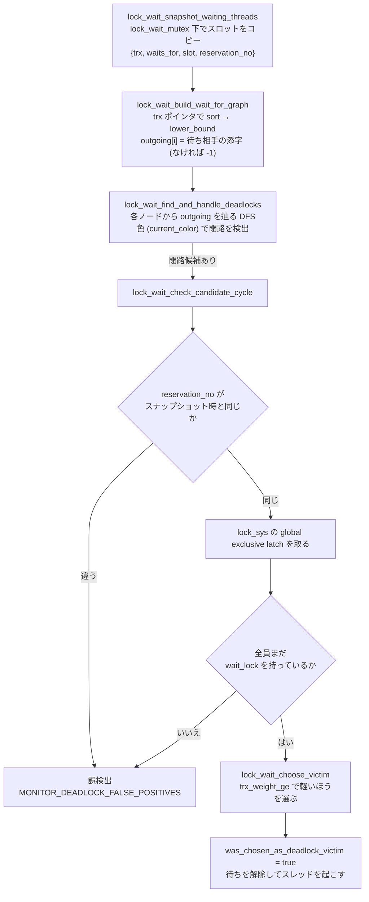

> **前提**: [ロックの種類 (InnoDB)](./lock-modes-and-types/) / [RR と RC の違い](./locking-in-rr-vs-rc/)

## 何を学んだか

デッドロック検出について、コードを読むまで誤解していたことが 3 つあった。

**1. 待っているスレッドは検出しない。** ロックが取れなかったスレッドは「自分を止めているのは誰か」を `trx->lock.blocking_trx` に 1 本だけ書いて眠る。閉路を探すのは [`lock_wait_timeout_thread`](https://github.com/mysql/mysql-server/blob/mysql-8.4.11/storage/innobase/lock/lock0wait.cc#L1432) という専用の背景スレッドで、待ち手のスレッドは検出処理を一切走らせない。

**2. 検出は「スナップショットに対する後追い」である。** 背景スレッドは待ちスロットの内容をコピーしてから `lock_wait_mutex` を放す。そのあとで閉路を探すので、**見つけた閉路がもう解消していることがある**。だから候補が見つかるたびに、スロットの予約番号が変わっていないかを確かめ、さらに lock_sys の global exclusive latch を取ってから「本当にまだ待っているか」を再確認する。誤検出は `MONITOR_DEADLOCK_FALSE_POSITIVES` として数えられている。

**3. victim は「軽いほう」が選ばれる。** 重みは `undo_no + 保持しているロックの本数` で、非トランザクショナルなテーブルを触ったトランザクションは無条件に重いと見なされる。**巻き戻すコストが小さいほうを犠牲にする**という設計だ。

そして victim になったトランザクションは **statement ではなく丸ごとロールバックされる**。アプリケーションから見ると `Deadlock found when trying to get lock; try restarting transaction` が返り、その時点でトランザクションは消えている。**エラーメッセージが「トランザクションを再実行しろ」と言っているのは比喩ではない。**

## なぜそうなっているか

**検出を背景スレッドに移したのは、待ち手のスレッドで走らせるとロック取得の経路が重くなるからだ。** 待ち手が検出するなら、ロックが取れないたびにグラフを辿ることになる。そのためには他のトランザクションの状態を安全に読む必要があり、lock_sys の広い範囲を latch しなければならない。**ロック取得はもっとも頻繁に通る経路**なので、そこに重い処理を置きたくない。

**辺を 1 本だけにしたのは、グラフを単純にするためだ。** 1 つのトランザクションは同時に 1 つのロックしか待てない (これは InnoDB の不変条件で、`rec_lock_check_conflict` の 8 番目のガード節のコメントがその維持について触れている)。出次数が 1 のグラフなら、閉路探索は「辺を辿って同じ色に当たるか」だけで済む。ソートと `lower_bound` で構築できるのも、辺が 1 本ずつだからだ。

**スナップショットを取ってから mutex を放す設計にしたのは、`lock_wait_mutex` の保持時間を切り詰めるためだ。** この mutex は待ち始めるスレッドと終わるスレッドの両方が触るので、ここが詰まると並行性に直接効く。代償として「見つけた閉路がもう存在しない」可能性が生まれ、その検証に 2 段のガードが要る。**誤検出を許して mutex を早く放す**というトレードオフを取っている。

**victim を「軽いほう」にしたのは、ロールバックのコストが `undo_no` に比例するからだ** ([undo ログのページ](./undo-log/))。重いトランザクションを殺すと、逆適用する undo レコードの本数がそのまま復旧時間になる。ロックの本数も足しているのは、解放処理のコストと「他人を待たせている度合い」の両方の代理指標になるからだろう。

**非トランザクショナルなテーブルを触ったものを重くしたのは、ロールバックしても元に戻せないからだ。** MyISAM への書き込みは undo を持たないので、そのトランザクションを殺しても中途半端な状態が残る。だから犠牲にしない。

**タイムアウトではトランザクション全体をロールバックしないのは、5.0.13 での方針変更だ。** ソースのコメントが「5.0.13 から、ロック待ちタイムアウトでは MySQL に最新の SQL 文だけをロールバックさせる。以前はトランザクション全体をロールバックしていた」と書いている。デッドロックは「このトランザクションが生き残る道はない」が確定しているので丸ごと戻すが、タイムアウトは「たまたま待ちきれなかった」だけなので、文だけ戻して続きを試す余地を残している。

## ソースコードのどこか

### 待ち手がすること

ロックが取れないと `lock_rec_lock_slow` が `RecLock::add_to_waitq` を呼び、その中で辺が張られる。

```cpp title="storage/innobase/lock/lock0lock.cc"
static void lock_create_wait_for_edge(const lock_t *waiting_lock,
                                      const lock_t *blocking_lock) {
  trx_t *waiter = waiting_lock->trx;
  trx_t *blocker = blocking_lock->trx;
  ...
  /* We don't call lock_wait_request_check_for_cycles() here as it
  would be slightly premature: the trx is not yet inserted into a slot of
  lock_sys->waiting_threads at this point, and thus it would be invisible to
  the thread which analyzes these slots. What we do instead is to let the
  lock_wait_table_reserve_slot() function be responsible for calling
  lock_wait_request_check_for_cycles() once it insert the trx to a
  slot.*/
  waiter->lock.blocking_trx.store(blocker);
  lock_report_wait_for_edge_to_server(waiting_lock, blocking_lock);
}
```

[`lock0lock.cc#L1420`](https://github.com/mysql/mysql-server/blob/mysql-8.4.11/storage/innobase/lock/lock0lock.cc#L1420)。**辺は 1 トランザクションにつき 1 本だけ**だ (自分を止めている相手を 1 人だけ指す)。`lock_report_wait_for_edge_to_server` はサーバ層の `thd_report_lock_wait` を呼ぶが、これは MDL 側やレプリケーション側のためのもので、InnoDB の検出には使わない。

`SELECT ... FOR UPDATE` が本当に待つと [`lock_wait_suspend_thread` (`lock0wait.cc#L206`)](https://github.com/mysql/mysql-server/blob/mysql-8.4.11/storage/innobase/lock/lock0wait.cc#L206) に入る。ここで**待ちスロットを予約**し、そのタイミングで背景スレッドを起こす。

```cpp title="storage/innobase/lock/lock0wait.cc"
      /* We call lock_wait_request_check_for_cycles() because the
      node representing the `thr` only now becomes visible to the thread which
      analyzes contents of lock_sys->waiting_threads. ... */
      lock_wait_request_check_for_cycles();
      return (slot);
```

[`lock_wait_table_reserve_slot` (L138) の中、L188](https://github.com/mysql/mysql-server/blob/mysql-8.4.11/storage/innobase/lock/lock0wait.cc#L188)。[`lock_wait_request_check_for_cycles` (L204)](https://github.com/mysql/mysql-server/blob/mysql-8.4.11/storage/innobase/lock/lock0wait.cc#L204) の中身は `lock_set_timeout_event()` の 1 行で、イベントをセットするだけだ。あとは `os_event_wait(slot->event)` で眠る。

**待ち手のスレッドがやるのはここまで。** 起こされるのは、(a) ロックが取れた、(b) タイムアウトした、(c) victim に選ばれた、のいずれかだ。

### 背景スレッドのループ

```cpp title="storage/innobase/lock/lock0wait.cc"
void lock_wait_timeout_thread() {
  int64_t sig_count = 0;
  os_event_t event = lock_sys->timeout_event;
  ...
  auto last_checked_for_timeouts_at = std::chrono::steady_clock::now();
  do {
    auto current_time = std::chrono::steady_clock::now();
    if (std::chrono::seconds(1) <=
        current_time - last_checked_for_timeouts_at) {
      last_checked_for_timeouts_at = current_time;
      lock_wait_check_slots_for_timeouts();
    }

    lock_wait_update_schedule_and_check_for_deadlocks();

    /* When someone is waiting for a lock, we wake up every second (at worst)
    and check if a timeout has passed for a lock wait */
    os_event_wait_time_low(event, std::chrono::seconds{1}, sig_count);
    sig_count = os_event_reset(event);

  } while (srv_shutdown_state.load() < SRV_SHUTDOWN_CLEANUP);
}
```

[L1432](https://github.com/mysql/mysql-server/blob/mysql-8.4.11/storage/innobase/lock/lock0wait.cc#L1432)。**タイムアウトの検査は最大 1 秒に 1 回**だが、**デッドロックの検査はループが回るたび**に走る。イベントは新しい待ち手が現れたときにセットされるので、実際には「誰かが待ち始めたら即座に 1 周する」動きになる。

`innodb_deadlock_detect` が効くのはこの中の 1 箇所だけだ。

```cpp title="storage/innobase/lock/lock0wait.cc"
  if (innobase_deadlock_detect) {
    /* This will also update trx->lock.schedule_weight for trxs on cycles. */
    lock_wait_find_and_handle_deadlocks(infos, outgoing, new_weights);
  }
```

[`lock_wait_update_schedule_and_check_for_deadlocks` (L1377) の L1423](https://github.com/mysql/mysql-server/blob/mysql-8.4.11/storage/innobase/lock/lock0wait.cc#L1423)。**OFF にしてもスナップショット取得とスケジュール重みの計算は止まらない。** 止まるのは閉路探索だけだ。

### wait-for graph の作り方



スナップショットは [`lock_wait_snapshot_waiting_threads` (L562)](https://github.com/mysql/mysql-server/blob/mysql-8.4.11/storage/innobase/lock/lock0wait.cc#L562)。`lock_wait_mutex` を持つ時間を最短にするため `push_back` しかしない、という判断がコメントに書かれている。

グラフ構築は [`lock_wait_build_wait_for_graph` (L650)](https://github.com/mysql/mysql-server/blob/mysql-8.4.11/storage/innobase/lock/lock0wait.cc#L650)。`trx` ポインタでソートしてから `lower_bound` で相手を引く。**ハッシュテーブルを使わないのは、実測してソートのほうが速かったから**だとコメントが説明している。

閉路探索は [`lock_wait_find_and_handle_deadlocks` (L1265)](https://github.com/mysql/mysql-server/blob/mysql-8.4.11/storage/innobase/lock/lock0wait.cc#L1265)。各ノードの出次数が高々 1 なので、単純な色塗り DFS で足りる。

### 候補の検証 — 2 段のガード

[`lock_wait_check_candidate_cycle` (L1164)](https://github.com/mysql/mysql-server/blob/mysql-8.4.11/storage/innobase/lock/lock0wait.cc#L1164) のコメントが、なぜ 2 段必要かを丁寧に書いている。要約するとこうだ。

1. スナップショットを取ってからここに来るまでに、そのトランザクションはロールバックされて `trx_t` が再利用されているかもしれない。**ポインタを触ること自体が危険**なので、まず `slot->reservation_no` を比べる。変わっていなければ「まだ同じトランザクションが同じスロットで眠っている」ことが分かる
2. スロットにいることと待っていることは別だ。すでに起こされたが、まだスロットを片付けていない状態がありうる。`trx->lock.wait_lock` が非 `nullptr` かどうかを確実に読むには **lock_sys の global exclusive latch が要る**

```cpp title="storage/innobase/lock/lock0wait.cc"
  locksys::Global_exclusive_latch_guard gurad{UT_LOCATION_HERE};
  if (!lock_wait_trxs_are_still_waiting(cycle_ids, infos)) {
    lock_wait_mutex_exit();
    return false;
  }
```

[L1206](https://github.com/mysql/mysql-server/blob/mysql-8.4.11/storage/innobase/lock/lock0wait.cc#L1206)。**デッドロックを実際に処理する区間だけ、lock_sys 全体が止まる。** シャーディングされた 1024 個の mutex を持つ設計 ([lock_sys のシャーディング](./lock-sys-sharding/)) で global exclusive latch を取るのはここが代表例だ。

### victim の選び方

```cpp title="storage/innobase/lock/lock0wait.cc"
    if (trx_weight_ge(chosen_victim, trx)) {
      /* The joining transaction is 'smaller',
      choose it as the victim and roll it back. */
      chosen_victim = trx;
    }
```

[`lock_wait_choose_victim` (L917) の L949](https://github.com/mysql/mysql-server/blob/mysql-8.4.11/storage/innobase/lock/lock0wait.cc#L949)。関数の頭に `ut_ad(locksys::owns_exclusive_global_latch())` があり、コメントが理由を書いている——「重みは保持しているロックの本数から計算するので、lock_sys 全体の排他 latch が要る」。

重みの定義は 2 段だ。

```cpp title="storage/innobase/include/trx0trx.h"
/** Calculates the "weight" of a transaction. The weight of one transaction
 is estimated as the number of altered rows + the number of locked rows.
 @param t transaction
 @return transaction weight */
static inline uint64_t TRX_WEIGHT(const trx_t *t) {
  return t->undo_no + UT_LIST_GET_LEN(t->lock.trx_locks);
}
```

[`trx0trx.h#L1252`](https://github.com/mysql/mysql-server/blob/mysql-8.4.11/storage/innobase/include/trx0trx.h#L1252)。そして比較関数がもう 1 つ条件を足す。

```cpp title="storage/innobase/trx/trx0trx.cc"
  auto a_notrans_edit =
      a->mysql_thd != nullptr && thd_has_edited_nontrans_tables(a->mysql_thd);

  auto b_notrans_edit =
      b->mysql_thd != nullptr && thd_has_edited_nontrans_tables(b->mysql_thd);

  if (a_notrans_edit != b_notrans_edit) {
    return (a_notrans_edit);
  }
  ...
  return (TRX_WEIGHT(a) >= TRX_WEIGHT(b));
```

[`trx_weight_ge` (`trx0trx.cc#L2899`)](https://github.com/mysql/mysql-server/blob/mysql-8.4.11/storage/innobase/trx/trx0trx.cc#L2899)。**非トランザクショナルなテーブル (MyISAM など) を触ったトランザクションは、行数に関係なく重い。** ロールバックしても取り消せない変更があるので、victim にしたくないという判断だ。

選ばれた victim には [`lock_wait_rollback_deadlock_victim` (L692)](https://github.com/mysql/mysql-server/blob/mysql-8.4.11/storage/innobase/lock/lock0wait.cc#L692) で `was_chosen_as_deadlock_victim` が立ち、待ちが解除されてスレッドが起こされる。

### victim 側で起きること

`lock_wait_suspend_thread` から戻ったスレッドは `trx->error_state == DB_DEADLOCK` を見つけ、`row_mysql_handle_errors` に流れる。

```cpp title="storage/innobase/row/row0mysql.cc"
    case DB_DEADLOCK:
    case DB_LOCK_TABLE_FULL:
      /* Roll back the whole transaction; this resolution was added
      to version 3.23.43 */

      trx_rollback_to_savepoint(trx, nullptr);
      break;
```

[`row0mysql.cc#L723`](https://github.com/mysql/mysql-server/blob/mysql-8.4.11/storage/innobase/row/row0mysql.cc#L723)。`savept == nullptr` は**完全ロールバック**を意味する ([コミットとロールバックのページ](./commit-and-rollback-internals/))。その後 SQL 層に返るところで

```cpp title="storage/innobase/handler/ha_innodb.cc"
    case DB_FORCED_ABORT:
    case DB_DEADLOCK:
      /* Since we rolled back the whole transaction, we must
      tell it also to MySQL so that MySQL knows to empty the
      cached binlog for this transaction */

      if (thd != nullptr) {
        thd_mark_transaction_to_rollback(thd, 1);
      }

      return (HA_ERR_LOCK_DEADLOCK);
```

[`convert_error_code_to_mysql` (`ha_innodb.cc#L2128`)](https://github.com/mysql/mysql-server/blob/mysql-8.4.11/storage/innobase/handler/ha_innodb.cc#L2128)。クライアントには `ER_LOCK_DEADLOCK`、つまり `Deadlock found when trying to get lock; try restarting transaction` (SQLSTATE 40001) が返る。

### タイムアウト側

デッドロックでなくても、待ちが長引けば打ち切られる。

```cpp title="storage/innobase/lock/lock0wait.cc"
  const auto wait_time = std::chrono::steady_clock::now() - slot->suspend_time;
  /* Timeout exceeded or a wrap-around in system time counter */
  const auto timeout = slot->wait_timeout < std::chrono::seconds{100000000} &&
                       wait_time > slot->wait_timeout;
```

[`lock_wait_check_and_cancel` (L501)](https://github.com/mysql/mysql-server/blob/mysql-8.4.11/storage/innobase/lock/lock0wait.cc#L501)。`slot->wait_timeout` は `innodb_lock_wait_timeout` から来る値で、既定 50 秒、**1 億秒以上を設定するとタイムアウトが無効になる** ([sysvar 定義 `ha_innodb.cc#L1088`](https://github.com/mysql/mysql-server/blob/mysql-8.4.11/storage/innobase/handler/ha_innodb.cc#L1088))。ヘルプ文にも「100000000 を超える値はタイムアウトを無効にする」と書いてある。

タイムアウト時の扱いはデッドロックと**違う**。

```cpp title="storage/innobase/row/row0mysql.cc"
  switch (err) {
    case DB_LOCK_WAIT_TIMEOUT:
      if (row_rollback_on_timeout) {
        trx_rollback_to_savepoint(trx, nullptr);
        break;
      }
      [[fallthrough]];
    case DB_DUPLICATE_KEY:
    ...
      if (savept) {
        /* Roll back the latest, possibly incomplete insertion
        or update */

        trx_rollback_to_savepoint(trx, savept);
      }
      /* MySQL will roll back the latest SQL statement */
      break;
```

[`row0mysql.cc#L672`](https://github.com/mysql/mysql-server/blob/mysql-8.4.11/storage/innobase/row/row0mysql.cc#L672)。`row_rollback_on_timeout` は `innodb_rollback_on_timeout` の値で、**既定は `false`** ([sysvar 定義 `ha_innodb.cc#L22425`](https://github.com/mysql/mysql-server/blob/mysql-8.4.11/storage/innobase/handler/ha_innodb.cc#L22425)、`PLUGIN_VAR_READONLY` なので起動時のみ)。つまり既定では**文だけがロールバックされ、トランザクションは生きたまま残る**。クライアントには `Lock wait timeout exceeded; try restarting transaction` が返る。

### 記録

デッドロックが検出されると [`lock_notify_about_deadlock` (`lock0lock.cc#L6286`)](https://github.com/mysql/mysql-server/blob/mysql-8.4.11/storage/innobase/lock/lock0lock.cc#L6286) が `Deadlock_notifier` に渡す。書き先は 2 つある。

- `lock_latest_err_file` — テンポラリファイル。`SHOW ENGINE INNODB STATUS` の `LATEST DETECTED DEADLOCK` セクションはこれを読み戻して印字する ([INNODB STATUS のページ](./innodb-status-sections/))。**直近 1 件しか残らない**
- `srv_print_all_deadlocks` (= `innodb_print_all_deadlocks`) が ON ならエラーログにも出す。既定は OFF ([`ha_innodb.cc#L23289`](https://github.com/mysql/mysql-server/blob/mysql-8.4.11/storage/innobase/handler/ha_innodb.cc#L23289))

### 検出を止めたときの挙動

MTR テストがそのまま証拠になる。

```
SET GLOBAL innodb_deadlock_detect=OFF;
SET GLOBAL innodb_lock_wait_timeout=2;
...
connection con1;
--error ER_LOCK_WAIT_TIMEOUT
--reap;
```

`mysql-test/suite/innodb/t/deadlock_detect.test`。2 セッションが互いのロックを待つ典型的なデッドロックを作り、**検出を切ると `ER_LOCK_DEADLOCK` ではなく `ER_LOCK_WAIT_TIMEOUT` になる**ことを確認している。sysvar のヘルプ文も同じことを書いている——「OFF にするとデッドロック検出はスキップされ、デッドロック時は `innodb_lock_wait_timeout` に頼る」。

## どう活かすか

**デッドロックはアプリ側でリトライすべきエラーである。** これがこのページの結論だ。理由は 3 つある。

1. **victim になったトランザクションはすでに存在しない。** `trx_rollback_to_savepoint(trx, nullptr)` が完了しており、ロックも解放されている。アプリがやるべきは「トランザクションを最初からやり直す」ことだけだ
2. **victim の選択は自分では制御できない。** 重みで決まるので、同じアプリコードでもタイミング次第で犠牲になる側が変わる。「自分のトランザクションは絶対 victim にならない」と仮定できない
3. **デッドロックは設計を正しくしても完全には消せない。** ロック取得順序を揃えれば大幅に減るが、UNIQUE 制約の重複検査のように「同じ操作をしているだけで循環する」形がある ([INSERT のロックのページ](./insert-and-duplicate-check/))

実装としては、SQLSTATE `40001` (または MySQL エラー番号 1213) を捕まえて、指数バックオフ + ジッタで 3〜5 回リトライするのが定石になる。**リトライ可能にするには、トランザクションの中身が冪等か、最初からやり直せる形になっている必要がある**——外部 API 呼び出しをトランザクションの中に入れてはいけない理由がここにもある。

**分離レベルを RC にしても検出の仕組みは 1 つも変わらない。** wait-for graph の作り方も victim の選び方も `isolation_level` を見ていない。変わるのは「そもそも閉路ができる頻度」で、ギャップロックを取らなくなるぶん範囲スキャン由来のデッドロックは減る。**ただし UNIQUE 制約の重複検査は RC でも next-key lock を取る**ので、そこ由来のデッドロックは残る ([RR と RC のページ](./locking-in-rr-vs-rc/))。

**`Lock wait timeout exceeded` はリトライの扱いが違う。** 既定 (`innodb_rollback_on_timeout=OFF`) では**トランザクションが生き残っている**ので、「その文だけリトライする」か「明示的に `ROLLBACK` してからやり直す」かをアプリが選べる。中途半端な状態のまま次の文を投げるのが一番危ないので、**タイムアウトを捕まえたら明示的にロールバックする**のを既定の作法にしておくとよい。

**`innodb_deadlock_detect=OFF` は「デッドロックを消す」設定ではない。** 検出をやめるだけで、循環は起き続ける。結果として `innodb_lock_wait_timeout` (既定 50 秒) まで全員が待つことになり、**症状は「デッドロックエラー」から「50 秒間フリーズ」に変わる**。高並行で検出のコストが問題になったときの最終手段であって、まず `innodb_lock_wait_timeout` を数秒に下げるほうが実害が小さい。

**デッドロックの調査は `innodb_print_all_deadlocks=ON` から始める。** `SHOW ENGINE INNODB STATUS` の `LATEST DETECTED DEADLOCK` は**直近 1 件しか残らない**ので、断続的に起きる問題には向かない。エラーログに出しておけば頻度と時間帯が分かる。出力にはロックの `index` 名と `lock_mode` が入るので、どのインデックスのどの種類のロックが絡んでいるかを、この章の[互換表](./lock-modes-and-types/)と突き合わせて読める。

**デッドロックの発生率だけを見るなら `INNODB_METRICS` に `lock_deadlocks` がある** ([統計と INNODB_METRICS](./innodb-stats-and-metrics/))。誤検出のカウンタ (`MONITOR_DEADLOCK_FALSE_POSITIVES`) も別に取られているので、検出処理の空回りも見える。

**「デッドロックが出ないから安全」でもない。** `SKIP LOCKED` / `NOWAIT` は待ちキューに入らないので ([ロックのページ](./lock-modes-and-types/))、wait-for graph に現れずデッドロックにもならない。代わりに `ER_LOCK_NOWAIT` や「行が返らない」という形で現れる。ジョブキューの実装でこれらを使っているなら、リトライの設計はデッドロックとは別に要る。
