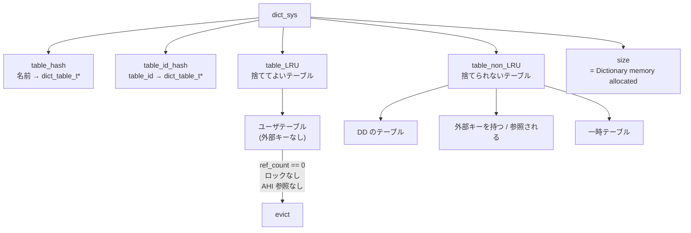

> **前提**: [データディクショナリ](./data-dictionary/) / [handler の walkthrough](./handler-walkthrough/) / [InnoDB のスレッド一覧](./innodb-threads-walkthrough/)

## 何を学んだか

Server 層には DD (`mysql.tables` などのテーブル) と、その上のキャッシュがある。**InnoDB はそれとは別に、自分用の `dict_sys` というキャッシュを持っている。** `dict_table_t` と `dict_index_t` — InnoDB がクエリ実行中に参照する形の定義だ。

このキャッシュは 2 本のリストで管理される。

```cpp title="storage/innobase/dict/dict0dict.cc (L1242-L1248)"
  table->can_be_evicted = can_be_evicted;

  if (table->can_be_evicted) {
    UT_LIST_ADD_FIRST(dict_sys->table_LRU, table);
  } else {
    UT_LIST_ADD_FIRST(dict_sys->table_non_LRU, table);
  }
```

**`table_non_LRU` に入ったテーブルは、二度と自動では捨てられない。** どのテーブルがそちらに行くかが、この章のいちばん実務に効く部分になる。

## なぜそうなっているか

### なぜ Server の DD キャッシュと二重に持つのか

DD は「テーブルとは何か」を SQL の言葉で持っている。InnoDB が必要とするのは**物理的な情報**だ。インデックスのルートページ番号、space_id、列の内部形式、統計、AHI の情報。これを毎回 DD から変換していては、1 行読むたびに変換コストがかかる。

だから InnoDB は変換済みの形で持ち、**参照カウントで生存期間を管理する**。

```cpp title="storage/innobase/dict/dict0dict.cc (L1274-L1284)"
  if (table->get_ref_count() == 0) {
    const dict_index_t *index;

    /* The transaction commit and rollback are called from
    outside the handler interface. This means that there is
    a window where the table->n_ref_count can be zero but
    the table instance is in "use". */

    if (lock_table_has_locks(table)) {
      return false;
    }
```

参照カウントが 0 でも、**ロックを持っているテーブルは捨てない**。コメントにある通り「カウントは 0 だがまだ使っている」窓があるからだ。

### AHI に載ったインデックスは捨てられない

```cpp title="storage/innobase/dict/dict0dict.cc (L1286-L1303)"
    for (index = table->first_index(); index != nullptr;
         index = index->next()) {
      /* We are not allowed to free the in-memory index
      struct dict_index_t until all entries in the adaptive
      hash index that point to any of the page belonging to
      his b-tree index are dropped. This is so because
      dropping of these entries require access to
      dict_index_t struct. To avoid such scenario we keep
      a count of number of such pages in the search_info and
      only free the dict_index_t struct when this count
      drops to zero.

      See also: dict_index_remove_from_cache_low() */

      if (index->search_info->ref_count > 0) {
        return false;
      }
    }
```

**adaptive hash index にエントリが残っているインデックスは、`dict_index_t` を解放できない。** AHI のエントリを消すには `dict_index_t` が要る、という循環があるためだ ([adaptive hash index](./adaptive-hash-index/))。

8.4 で `innodb_adaptive_hash_index` の既定が OFF になったことで、この理由による滞留は起きにくくなった。ON にしている環境では、**AHI が辞書キャッシュのメモリまで押し上げる**ことになる ([InnoDB のメモリ](./innodb-memory/))。

### 外部キーを持つテーブルは捨てられない

```cpp title="storage/innobase/dict/dict0dict.cc (L1270-L1272)"
  ut_a(table->can_be_evicted);
  ut_a(table->foreign_set.empty());
  ut_a(table->referenced_set.empty());
```

`can_be_evicted` なテーブルは、外部キーの両側の集合が空であることが前提になっている。つまり**外部キーで結ばれたテーブルは最初から `table_non_LRU` 側に入る**。

参照整合性のチェックは、子テーブルから親テーブル (あるいはその逆) の `dict_table_t` を辿って行う ([外部キー](./foreign-keys/))。片方だけ捨てられると辿れなくなるので、まとめて残す。

**外部キーを多用したスキーマは、辞書キャッシュがテーブル数に比例して増え、上限で抑えられない。**

### 掃除は master thread がやる

キャッシュを削るのは背景スレッドの仕事だ。

```cpp title="storage/innobase/srv/srv0srv.cc (L1995-L2005)"
static ulint srv_master_evict_from_table_cache(
    ulint pct_check) /*!< in: max percent to check */
{
  ulint n_tables_evicted = 0;

  rw_lock_x_lock(dict_operation_lock, UT_LOCATION_HERE);

  dict_mutex_enter_for_mysql();

  n_tables_evicted =
      dict_make_room_in_cache(innobase_get_table_cache_size(), pct_check);
```

上限として渡している `innobase_get_table_cache_size()` は、**Server 側の `table_definition_cache` の値**をそのまま返す ([`ha_innodb.cc#L2448`](https://github.com/mysql/mysql-server/blob/mysql-8.4.11/storage/innobase/handler/ha_innodb.cc#L2448))。InnoDB 専用の設定は無い。

呼び出しは master thread の active / idle 両方から来るが、**見る範囲が違う**。

```cpp title="storage/innobase/srv/srv0srv.cc (L2356, L2415)"
    ulint n_evicted = srv_master_evict_from_table_cache(50);
...
  ulint n_evicted = srv_master_evict_from_table_cache(100);
```

- **active タスク** — LRU リストの後ろ **50%** だけを見る
- **idle タスク** — **100%** を見る

`pct_check` は「LRU の末尾から何 % まで捨てる候補として調べるか」だ。**忙しいときは掃除を軽く済ませ、暇なときに徹底的にやる**という master thread の一貫した方針がここにも出ている ([InnoDB のスレッド一覧](./innodb-threads-walkthrough/))。

そして重要なのは、この処理が `dict_operation_lock` を **X で取る**ことだ。掃除の間、テーブルを開く操作はすべて待たされる。だから 50% / 100% という上限で 1 回の掃除時間を抑えている。

## ソースコードのどこか

### キャッシュの構造



`dict_sys->size` がそのまま `SHOW ENGINE INNODB STATUS` の `Dictionary memory allocated` になる ([`srv0srv.cc#L1473-L1477`](https://github.com/mysql/mysql-server/blob/mysql-8.4.11/storage/innobase/srv/srv0srv.cc#L1473))。テーブル名の長さまで加算しているので ([`dict0dict.cc#L1254`](https://github.com/mysql/mysql-server/blob/mysql-8.4.11/storage/innobase/dict/dict0dict.cc#L1254))、実メモリにかなり近い値になる。

### LRU の中の移動

```cpp title="storage/innobase/dict/dict0dict.cc (L1050-L1052)"
  UT_LIST_REMOVE(dict_sys->table_LRU, table);

  UT_LIST_ADD_FIRST(dict_sys->table_LRU, table);
```

テーブルを開くたびに先頭へ移動する、素直な LRU だ。バッファプールの midpoint 挿入 ([LRU と midpoint](./lru-and-midpoint/)) のような工夫は入っていない。**辞書は「一度使ったらまた使う」性質が強く、スキャン汚染の心配が小さい**ためと読める。

`table_LRU` と `table_non_LRU` の間の移動もある ([`dict0dict.cc#L1384-L1402`](https://github.com/mysql/mysql-server/blob/mysql-8.4.11/storage/innobase/dict/dict0dict.cc#L1384))。外部キーが付いたり外れたりすれば、テーブルはリストを移る。

### 掃除の効果を数える

```sql
SET GLOBAL innodb_monitor_enable = 'innodb_dict_lru_count,innodb_dict_lru_usec';
SELECT name, count FROM information_schema.INNODB_METRICS
 WHERE name LIKE 'innodb_dict_lru%';
```

`innodb_dict_lru_count` (`MONITOR_SRV_DICT_LRU_EVICT_COUNT`) が追い出せた数、`innodb_dict_lru_usec` が掃除に使った時間だ ([`srv0mon.cc#L1215-L1221`](https://github.com/mysql/mysql-server/blob/mysql-8.4.11/storage/innobase/srv/srv0mon.cc#L1215))。**キャッシュが上限を超えているのに追い出せていない**なら、`table_non_LRU` 側か、参照が残っているテーブルばかりということになる。

## どう活かすか

### `Dictionary memory allocated` が減らないとき

```
SHOW ENGINE INNODB STATUS \G
-- BUFFER POOL AND MEMORY セクション
Dictionary memory allocated 1234567890
```

これが `table_definition_cache` の設定に対して大きすぎるときは、追い出せない理由がある。順に疑う。

1. **外部キーが多い** — 参照関係のあるテーブルは全部 `table_non_LRU`
2. **`innodb_adaptive_hash_index=ON`** — AHI にエントリが残る限り解放されない
3. **長いトランザクションがテーブルロックを持っている** — `lock_table_has_locks` で弾かれる
4. **単純にテーブル数が多い** — パーティションを含めて数える

### パーティションは 1 つずつ数える

パーティション表は、**パーティションごとに `dict_table_t` を持つ** ([パーティショニング](./partitioning/))。1000 パーティションのテーブルは 1000 テーブル分の辞書エントリになる。

`table_definition_cache` を既定のまま、パーティションを大量に使うスキーマを載せると、**master thread が毎秒 `dict_operation_lock` を X で取って掃除を試み、しかも追い出せない**という状態になりうる。パーティション数を抑えるか、`table_definition_cache` を実態に合わせて上げる。

### `table_definition_cache` を上げる判断

この変数は Server 側の TABLE_SHARE キャッシュと InnoDB の辞書キャッシュの**両方**に効く。上げると、

- **良いこと** — テーブルを開き直すコストが減り、master thread の掃除が空振りしなくなる
- **悪いこと** — メモリが増える。特に外部キーやパーティションが多いと 1 テーブルあたりの定義が大きい

**「テーブル数 + パーティション数」が既定値 (自動調整、最大 2000 前後) を大きく超えるスキーマ**では、上げる価値がある。逆にテーブル数が数百なら触る意味はない。

### DDL が全体を止める理由の 1 つ

`dict_operation_lock` を X で取るのは、掃除だけでなく DDL も同じだ。**大きな `ALTER` の前後でこのラッチを取る瞬間、テーブルを開こうとするすべてのスレッドが待つ** ([ラッチとミューテックス](./latches-and-mutexes/))。

メタデータロック ([MDL](./metadata-locking/)) とは別のレイヤの待ちで、`SHOW PROCESSLIST` では見分けにくい。`performance_schema` の `wait/synch/rwlock/innodb/dict_operation_lock` を見ると、この待ちが起きているかが分かる。
