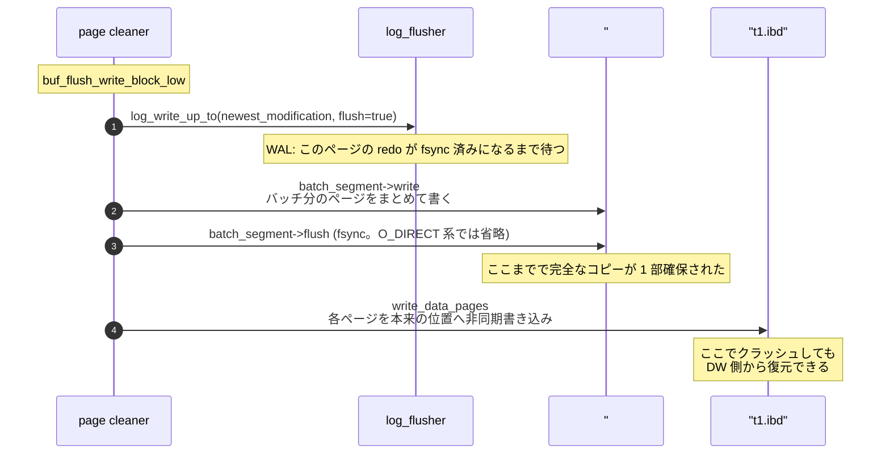

> **前提**: [ページとバッファ](./page-and-buffer/) / [flush list と page cleaner](./flush-list-and-page-cleaner/)

## 何を学んだか

**redo ログだけではクラッシュから復帰できない穴が 1 つある。それが torn page (部分書き込み) だ。**

InnoDB のページは既定 16KB。`write(2)` に 16KB を渡しても、デバイスが原子性を保証する単位は 512 バイトか 4KB のセクタでしかない。**書いている途中で電源が落ちると、前半 4KB だけ新しく、後半 12KB は古いままのページがディスクに残る。**

redo でこれを直せない理由は、redo レコードが physiological だからだ。「ページ P にこのレコードを挿入せよ」という指示は、P の現在の内容を前提にしている ([mini-transaction のページ](./mini-transaction/))。半分だけ新しいページはどちらの世代でもない未定義の状態なので、適用しても結果は保証されない。そもそも `FIL_PAGE_LSN` (ページ先頭の 16 バイト目) とページ末尾のチェックサムが食い違うので、読み込みの時点で「壊れている」としか分からない。

doublewrite の解は素朴だ。**同じページを 2 箇所に書き、片方が壊れてももう片方から復元する。**

1. まず doublewrite ファイル (`#ib_16384_0.dblwr` など) に書き切る (ページキャッシュを経由する `innodb_flush_method` なら `fsync` も)
2. それが済んでから、本来の `.ibd` ファイルの位置に書く
3. クラッシュ後、`.ibd` 側のページが壊れていたら doublewrite 側からコピーする

**2 で壊れても、1 に完全なコピーがある。1 で壊れても、`.ibd` 側はまだ手つかずで完全だ。** どちらか一方は必ず無事、というのがこの仕組みの全部だ。



ただしこれは**ストレージが torn write を起こしうる前提**の話で、その前提が成り立たない環境では純粋なコストになる ([Aurora のページ](./aurora-what-changed/))。

## なぜそうなっているか

**「2 回書けば安全」が成り立つのは、2 つの書き込みが独立に壊れるからだ。** doublewrite ファイルと `.ibd` ファイルは別の位置にあり、1 回目の `fsync` が完了してから 2 回目が始まる。1 回のクラッシュで両方が同時に torn になることはない。**保証しているのは「どちらか一方は完全である」だけで、どちらが完全かは分からなくてよい**。チェックサムで判別できる。

**書き込み量が 2 倍になるのに実用的なのは、doublewrite への書き込みがシーケンシャルでバッチ化されるからだ。** `.ibd` 側は各ページの位置がバラバラなランダム書き込みだが、doublewrite ファイルへはバッチ単位の連続領域に 1 回で書く。`fsync` も 1 バッチ 1 回で、ページ数で割れば十分に安い。「I/O が 2 倍」というより「シーケンシャルな書き込みが 1 本増える」に近い。

**redo をページ全体の物理イメージにするという代替案は採られなかった。** PostgreSQL の `full_page_writes` はチェックポイント後に最初に触ったページの全体を WAL に書くやり方で、doublewrite と同じ問題を解く。InnoDB が別の道を選んだのは、redo を小さく保つほうがコミットのレイテンシに直結するからだ。**doublewrite のコストは page cleaner という背景スレッドに乗り、redo を膨らませるコストはユーザスレッドのコミット待ちに乗る。** どちらに払うかの選択になっている。

**`DETECT_ONLY` は、この 2 つの間に中間点を作るためにある。** ストレージが torn write を起こさない (と信じられる) が、100% は確信できない環境がある。そこで「復元はできないが、壊れていたら確実に検出して止まる」モードが用意された。16 バイト × ページ数しか書かないので、コストはほぼゼロだ。

## ソースコードのどこか

### 書き込みの入口

[`dblwr::write` (`buf0dblwr.cc#L2481`)](https://github.com/mysql/mysql-server/blob/mysql-8.4.11/storage/innobase/buf/buf0dblwr.cc#L2481) が、`buf_flush_write_block_low` から呼ばれる唯一の口だ。先に「doublewrite を通さない条件」が並ぶ。

```cpp title="storage/innobase/buf/buf0dblwr.cc"
  if (srv_read_only_mode || fsp_is_system_temporary(space_id) ||
      !dblwr::is_enabled() || Double_write::s_instances == nullptr ||
      mtr_t::s_logging.dblwr_disabled()) {
    /* Skip the double-write buffer since it is not needed. Temporary
    tablespaces are never recovered, therefore we don't care about
    torn writes. */
    bpage->set_dblwr_batch_id(std::numeric_limits<uint16_t>::max());
    err = Double_write::write_to_datafile(bpage, sync, nullptr);
```

**一時テーブルスペースは対象外だ。** クラッシュ後に復旧しないので、壊れていても構わない ([内部一時表のページ](./materialization-and-temptable/))。`ALTER TABLE ... ALGORITHM=INPLACE` などで redo を止めている間 (`mtr_t::s_logging.dblwr_disabled()`) も通らない。

### 2 段階の書き込み

バッチの本体は [`Double_write::write_dblwr_pages` (L2163)](https://github.com/mysql/mysql-server/blob/mysql-8.4.11/storage/innobase/buf/buf0dblwr.cc#L2163) と [`write_data_pages` (L2195)](https://github.com/mysql/mysql-server/blob/mysql-8.4.11/storage/innobase/buf/buf0dblwr.cc#L2195) の 2 本に分かれている。

```cpp title="storage/innobase/buf/buf0dblwr.cc"
  batch_segment->start(this);

  batch_segment->write(m_buffer);

  m_bytes_written += m_buffer.size();

  m_buffer.clear();

#ifndef _WIN32
  if (is_fsync_required()) {
    batch_segment->flush();
  }
#endif /* !_WIN32 */
```

**`batch_segment->flush()` が `fsync` で、これが終わってから `write_data_pages` が `.ibd` へ書き始める。** 本質は「1 回目の書き込みが確実にデバイスに載ってから 2 回目を始める」という順序のほうで、`fsync` はその手段でしかない。実際 `is_fsync_required()` は `innodb_flush_method` が `O_DIRECT` / `O_DIRECT_NO_FSYNC` のとき **false** を返し、この `fsync` は発行されない (L805-809)。ページキャッシュを経由しないので不要という判断で、**8.4 は `innodb_flush_method` 未指定なら probe 結果で O_DIRECT になるため、この経路がむしろ既定側だ**。

`.ibd` 側への書き込みは非同期 (`write_to_datafile(bpage, false, ...)`) なので、page cleaner はここで待たない。1 回の `fsync` を大量のページで割るぶん、償却コストは下がる。

### ファイル名にページサイズが入る

[`dblwr_file_open` (`buf0dblwr.cc#L2631`)](https://github.com/mysql/mysql-server/blob/mysql-8.4.11/storage/innobase/buf/buf0dblwr.cc#L2631) が名前を組み立てる。

```cpp title="storage/innobase/buf/buf0dblwr.cc"
  file.m_name = std::string(dir_name) + OS_PATH_SEPARATOR + "#ib_";

  file.m_name += std::to_string(srv_page_size) + "_" + std::to_string(id);

  file.m_name += dot_ext[extension];
```

`srv_page_size` がそのまま名前に入るので、既定なら `#ib_16384_0.dblwr`、`#ib_16384_1.dblwr` … となる。拡張子は `.dblwr` と、DETECT_ONLY 用の `.bdblwr` の 2 種類 ([`fil0fil.cc#L288`](https://github.com/mysql/mysql-server/blob/mysql-8.4.11/storage/innobase/fil/fil0fil.cc#L288))。

**ページサイズを名前に入れているのは、`innodb_page_size` を変えたときに古いファイルを誤って読まないためだ。** doublewrite ファイルの中身はページの生バイト列なので、サイズが違うと位置計算が全部ずれる。

ファイル本数は `innodb_doublewrite_files` (既定 2)、1 インスタンスが溜められるページ数 (= 1 バッチの上限) は `innodb_doublewrite_pages` (既定 128)。書き手の側は [`dblwr::open` (L2752)](https://github.com/mysql/mysql-server/blob/mysql-8.4.11/storage/innobase/buf/buf0dblwr.cc#L2752) で `max(4, innodb_buffer_pool_instances * 2)` 個の「インスタンス」に分割され、LRU からの flush と flush list からの flush が別インスタンスになる。**インスタンス数がファイル数より多ければ、1 ファイルの中を複数のセグメントに割って使う。** 置き場所は `innodb_doublewrite_dir` で変えられる。

### `Mode` — 3 つの意味と 6 つの綴り

[`buf0dblwr.h#L304`](https://github.com/mysql/mysql-server/blob/mysql-8.4.11/storage/innobase/include/buf0dblwr.h#L304) の enum は 6 値あるが、意味は 3 つしかない。

```cpp title="storage/innobase/include/buf0dblwr.h"
  enum mode_t {
    /** Equal to FALSEE. In this mode, dblwr is disabled. */
    OFF,

    /** Equal to TRUEE and DETECT_AND_RECOVER modes. */
    ON,

    /** In this mode, dblwr is used only to detect torn writes.  At code level,
    this mode is also called as reduced mode. It is called reduced because the
    number of bytes written to the dblwr file is reduced in this mode. */
    DETECT_ONLY,

    /** This mode is synonymous with ON, TRUEE. */
    DETECT_AND_RECOVER,
    ...
```

- **`OFF` (= `FALSE`)** — doublewrite を通さない
- **`ON` (= `TRUE` = `DETECT_AND_RECOVER`)** — 既定。ページの中身を書き、復元もする
- **`DETECT_ONLY`** — **ページの中身は書かず、`(space_id, page_no, lsn)` の 16 バイトだけ書く**

`DETECT_ONLY` の記録単位が [`Reduced_entry` (`buf0dblwr.h#L272`)](https://github.com/mysql/mysql-server/blob/mysql-8.4.11/storage/innobase/include/buf0dblwr.h#L272) だ。

```cpp title="storage/innobase/include/buf0dblwr.h"
struct Reduced_entry {
  space_id_t m_space_id;
  page_no_t m_page_no;
  lsn_t m_lsn;
```

これで何ができるかというと、**「壊れたページを直す」はできないが、「壊れているのに気づかず使い続ける」を防げる**。[`recv::Pages::reduced_recover` (L3207)](https://github.com/mysql/mysql-server/blob/mysql-8.4.11/storage/innobase/buf/buf0dblwr.cc#L3207) は記録された `(space_id, page_no)` を順に読み直し、壊れていて**復元元のページ本体が見つからないとき**に `ER_REDUCED_DBLWR_PAGE_FOUND` (`"... Cannot recover it from the doublewrite buffer because it was written in detect_only-doublewrite mode."`) で `ib::fatal` に落とす。DETECT_ONLY で書かれた分にはページ本体がないので、検出はそのまま停止を意味する。中途半端に起動して壊れたページを読み書きするより、止まったほうがましだ、という判断だ。

なお `srv_read_only_mode` では、起動時に `dblwr::g_mode` が問答無用で `OFF` に落とされる ([`ha_innodb.cc#L4946`](https://github.com/mysql/mysql-server/blob/mysql-8.4.11/storage/innobase/handler/ha_innodb.cc#L4946))。書かないので要らない。

### リカバリ側 — 壊れていたときだけ差し替える

[`dblwr::recv::Pages::dblwr_recover_page` (`buf0dblwr.cc#L3022`)](https://github.com/mysql/mysql-server/blob/mysql-8.4.11/storage/innobase/buf/buf0dblwr.cc#L3022) が 1 ページ分の判定をする。

```cpp title="storage/innobase/buf/buf0dblwr.cc"
  if (data_file_page.is_corrupted()) {
    ib::info(ER_IB_MSG_DBLWR_1315) << "Database page corruption or"
                                   << " a failed file read of page " << page_id
                                   << ". Trying to recover it from the"
                                   << " doublewrite file.";
    ...
  } else {
    bool data_page_zeroes = buf_page_is_zeroes(buffer.begin(), page_size);
    ...
    if (data_page_zeroes && !dblwr_zeroes && !dblwr_corrupted) {
      /* Database page contained only zeroes, while a valid copy is
      available in dblwr buffer. */
    } else {
      /* Database page is fine.  No need to restore from dblwr. */
      return false;
    }
  }
```

**判定は「データファイル側のチェックサムが合うか」だけだ。** 合っていれば doublewrite 側は見ない。合わなければ doublewrite 側を検証して、そちらが健全ならコピーする。両方壊れていたら両方をエラーログにダンプして `ib::fatal` で落ちる。

「データファイルが全部ゼロで、doublewrite 側に有効なコピーがある」という特殊ケースも拾っている。ファイル拡張の直後にクラッシュしたときに起きうる。

**この復元は redo の適用より前に走る。** [`recv_apply_hashed_log_recs`](https://github.com/mysql/mysql-server/blob/mysql-8.4.11/storage/innobase/log/log0recv.cc#L1125) がテーブルスペースを開くときに `fil_tablespace_open_for_recovery` 経由で `dblwr::recv::recover` が呼ばれ、ページが健全になってから redo を当てる ([クラッシュリカバリのページ](./crash-recovery/))。順序が逆だと、壊れたページに redo を当てることになる。

## どう活かすか

**`innodb_doublewrite=OFF` にしてよいのは、ストレージが 16KB の書き込みを原子的に行うと保証されている場合だけだ。** 具体的には Aurora MySQL のようにストレージ層が redo を直接受け取る構成、あるいはページサイズと同じアトミック書き込みを保証する一部のデバイスやファイルシステム。**「SSD だから大丈夫」は根拠にならない。** 電源断時にデバイス内のキャッシュがどう振る舞うかは製品次第だ。

**Aurora MySQL では doublewrite・page cleaner・チェックポイントの前提が丸ごと成立しない。** Aurora はページをストレージに書かず redo だけを送るので、torn page が起きる場所そのものがない。この章の耐久性の群のうち、Aurora で読み替えが必要な部分は[Aurora のページ](./aurora-what-changed/)にまとめる。

**エラーログの `Database page corruption or a failed file read of page (space_id, page_no). Trying to recover it from the doublewrite file.` は、torn page が実際に起きたことの記録だ。** これに続いて `Recovered page ... from the doublewrite buffer.` が出ていれば復旧できている。1 回だけならクラッシュ時の正常な動作だが、**繰り返し出るならデバイスかファイルシステムを疑う**。

**`Innodb_dblwr_pages_written` ÷ `Innodb_dblwr_writes` が、1 バッチあたりの平均ページ数になる。** この値が小さいと、`fsync` 1 回を割るページが少なく、doublewrite のコストがページ単価として高い。なお**この 2 つのカウンタはバッチ経路でしか増えない** ([L2242](https://github.com/mysql/mysql-server/blob/mysql-8.4.11/storage/innobase/buf/buf0dblwr.cc#L2242) と [L2583](https://github.com/mysql/mysql-server/blob/mysql-8.4.11/storage/innobase/buf/buf0dblwr.cc#L2583))。バッファプールが枯渇したときの単ページ同期 flush (`Double_write::sync_page_flush`) はここに出ないので、LRU 側の逼迫は別の指標で見る ([LRU のページ](./lru-and-midpoint/))。

**`innodb_doublewrite_dir` で別デバイスに逃がすと、`.ibd` への書き込みと I/O が競合しなくなる。** 書き込み帯域が飽和しているときの選択肢の 1 つ。ただし**その別デバイスも電源断に耐える必要がある**ので、揮発性のあるデバイスに置いてはいけない。

**`innodb_page_size` を変えたら doublewrite ファイルの名前も変わる。** データディレクトリに `#ib_16384_0.dblwr` と `#ib_8192_0.dblwr` が混在していたら、過去に変更した痕跡だ。使われていない側の削除はサーバを停止してから行う。起動時にリカバリが doublewrite ファイルを読むので、稼働中に消すと[クラッシュリカバリ](./crash-recovery/)の材料がなくなる。
