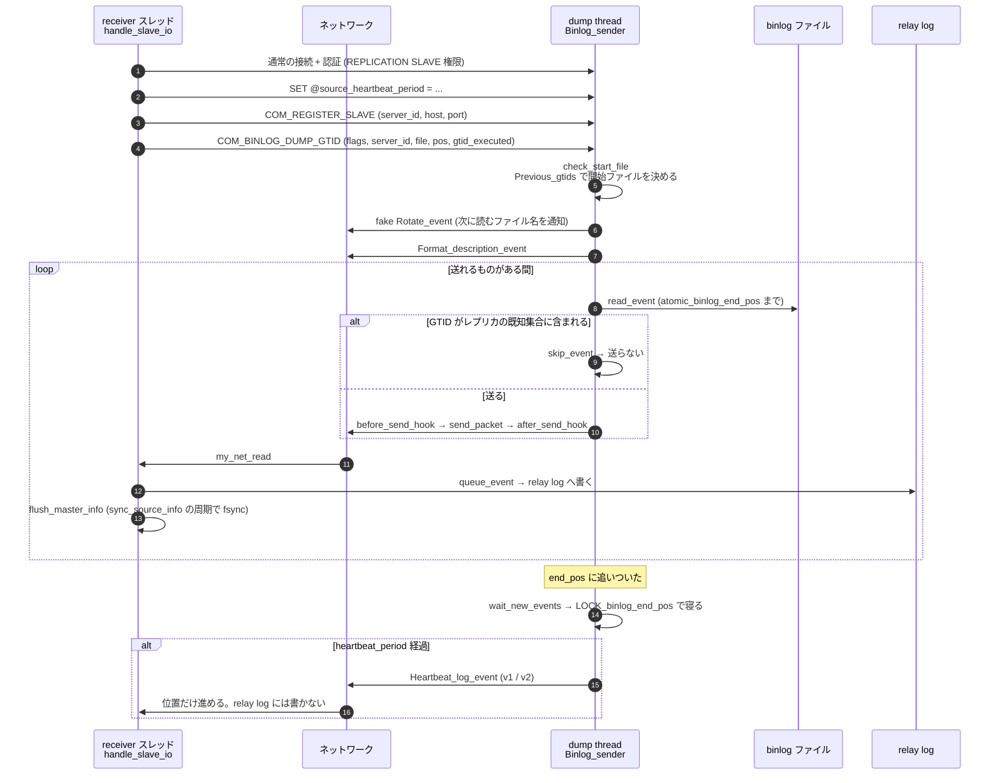

## 何を学んだか

レプリケーションのネットワーク層は、専用のプロトコルではない。**普通の MySQL 接続で `COM_BINLOG_DUMP_GTID` を 1 回送り、その応答として「終わらない結果セット」を受け取り続ける**だけだ。`COM_BINLOG_DUMP` は 18、`COM_BINLOG_DUMP_GTID` は 30 で ([`include/my_command.h#L48`](https://github.com/mysql/mysql-server/blob/mysql-8.4.11/include/my_command.h#L48) の `enum_server_command`)、`COM_QUERY` と同じ土俵に並んでいる。

source 側でこのコマンドを処理するスレッドが **dump thread** で、実体は `Binlog_sender` を 1 個作って `run()` を呼ぶだけの、そのクライアント接続のスレッドだ。専用の背景スレッドではない。**レプリカ 1 台につき source 側のスレッドが 1 本**増える。

このスレッドの読み方で押さえるべき点が 3 つある。

1. **`LOCK_log` を取らない。** 読んでよい上限は `atomic_binlog_end_pos` という 1 個のアトミック変数で公開されている
2. **追いついたら条件変数で寝る。** ポーリングしない。`binlog_end_pos` が更新されると `signal_update()` で起こされる
3. **ハートビートは「送るものがないとき」に送る。** GTID のスキップ中にも送る

レプリカ側の receiver (内部名は今でも `handle_slave_io`) は、受け取ったイベントを**ほぼそのまま relay log に書く**。デコードするのは GTID イベントなど位置の管理に必要なものだけだ。

## ソースコードのどこか

### レプリカ → source の 3 コマンド



`COM_REGISTER_SLAVE` を処理するのは [`register_replica` (`rpl_source.cc#L178`)](https://github.com/mysql/mysql-server/blob/mysql-8.4.11/sql/rpl_source.cc#L178)。ここで登録された情報が `SHOW REPLICAS` に出る。

### dump thread — 読んでよい上限は 1 個のアトミック変数

[`Binlog_sender::get_binlog_end_pos` (`rpl_binlog_sender.cc#L537`)](https://github.com/mysql/mysql-server/blob/mysql-8.4.11/sql/rpl_binlog_sender.cc#L537)。

```cpp title="sql/rpl_binlog_sender.cc"
  result.first = mysql_bin_log.get_binlog_end_pos();
  ...
  /* If this is a cold binlog file, we are done getting the end pos */
  if (unlikely(!mysql_bin_log.is_active(m_linfo.log_file_name))) {
    return std::make_pair(0, 0);
  }
  if (read_pos < result.first) {
    result.second = 0;
    return result;
  }
  flush_net();
```

アクティブでないファイル (既にローテート済み) なら上限なしで最後まで読む。アクティブなファイルなら `atomic_binlog_end_pos` までしか読まない。**この値を進めるのはグループコミットの flush ステージ (または `sync_binlog=1` なら sync ステージ) のリーダーだ** ([binlog walkthrough](./binlog-walkthrough/))。

追いついたら [`wait_new_events` (L771)](https://github.com/mysql/mysql-server/blob/mysql-8.4.11/sql/rpl_binlog_sender.cc#L771) に入る。コメントが `LOCK_binlog_end_pos` を取るタイミングを説明している。

```cpp title="sql/rpl_binlog_sender.cc"
  /*
    MYSQL_BIN_LOG::binlog_end_pos is atomic. We should only acquire the
    LOCK_binlog_end_pos if we reached the end of the hot log and are going
    to wait for updates on the binary log (Binlog_sender::wait_new_event()).
  */
  if (stop_waiting_for_update(log_pos)) {
    return 0;
  }
```

**送るものがある間は mutex を一切取らない。** 寝るときだけ条件変数のために取る。dump thread が何本いてもコミットパスを直接遅くしないのは、この設計から来ている。

### ハートビート — 送るものがないことを送る

[`wait_with_heartbeat` (L812)](https://github.com/mysql/mysql-server/blob/mysql-8.4.11/sql/rpl_binlog_sender.cc#L812)。

```cpp title="sql/rpl_binlog_sender.cc"
  while (!stop_waiting_for_update(log_pos)) {
    // ignoring timeout on conditional variable
    mysql_bin_log.wait_for_update(m_heartbeat_period);

    if (stop_waiting_for_update(log_pos)) {
      return 0;
    }
    ...
    if (send_heartbeat_event(log_pos)) return 1;
  }
```

`m_heartbeat_period` は接続時にレプリカがセッション変数として送ってくる `@source_heartbeat_period` から読む ([`init_heartbeat_period` (L849)](https://github.com/mysql/mysql-server/blob/mysql-8.4.11/sql/rpl_binlog_sender.cc#L849))。`CHANGE REPLICATION SOURCE TO SOURCE_HEARTBEAT_PERIOD = ...` がここに繋がっている。

形式が 2 つある ([`send_heartbeat_event` (L566)](https://github.com/mysql/mysql-server/blob/mysql-8.4.11/sql/rpl_binlog_sender.cc#L566))。

```cpp title="sql/rpl_binlog_sender.cc"
int Binlog_sender::send_heartbeat_event(my_off_t log_pos) {
  uint32 hb_version_flag = m_flag & USE_HEARTBEAT_EVENT_V2;
  DBUG_EXECUTE_IF("use_old_heartbeat_version", { hb_version_flag = 0; });
  return (hb_version_flag ? send_heartbeat_event_v2(log_pos)
                          : send_heartbeat_event_v1(log_pos));
}
```

v2 (`HEARTBEAT_LOG_EVENT_V2 = 41`) はログ位置に加えてファイル名も運べる。どちらを使うかはレプリカが `COM_BINLOG_DUMP_GTID` のフラグで申告する。

**GTID のスキップ中にもハートビートを送る**のが見落としやすい ([`send_events` (L572)](https://github.com/mysql/mysql-server/blob/mysql-8.4.11/sql/rpl_binlog_sender.cc#L572))。

```cpp title="sql/rpl_binlog_sender.cc"
      // if enough time has elapsed so that we should send another heartbeat
      if (m_heartbeat_period > std::chrono::nanoseconds(0) &&
          (now - m_last_event_sent_ts) >= m_heartbeat_period) {
        if (send_heartbeat_event(log_pos)) return 1;
        exclude_group_end_pos = 0;
      } else {
        exclude_group_end_pos = log_pos;
      }
```

auto-position でレプリカが既に持っているトランザクションを長時間スキップし続けると、送るものがないまま `net_write_timeout` に当たってしまう。ハートビートはそれを防ぐと同時に、**レプリカ側の `Read_Source_Log_Pos` を進める役割**も持つ (スキップした分の位置を伝える)。

### 送信バッファの伸縮

`Binlog_sender` はパケットバッファを再利用する。上限と縮小のルールが定数で決まっている ([L76](https://github.com/mysql/mysql-server/blob/mysql-8.4.11/sql/rpl_binlog_sender.cc#L76))。

```cpp title="sql/rpl_binlog_sender.cc"
const uint32 Binlog_sender::PACKET_MIN_SIZE = 4096;
const uint32 Binlog_sender::PACKET_MAX_SIZE = UINT_MAX32;
const ushort Binlog_sender::PACKET_SHRINK_COUNTER_THRESHOLD = 100;
const float Binlog_sender::PACKET_GROW_FACTOR = 2.0;
const float Binlog_sender::PACKET_SHRINK_FACTOR = 0.5;
```

**大きなイベントを 1 個送るとバッファが 2 倍ずつ伸び、100 回小さいイベントが続くと半分に縮む。** 巨大トランザクションを流した直後、dump thread のメモリがしばらく高止まりするのはこのためだ。

イベントの上限は 1GB で、これは `max_allowed_packet` とは別に決まっている ([`binlog_event.h#L448`](https://github.com/mysql/mysql-server/blob/mysql-8.4.11/libs/mysql/binlog/event/binlog_event.h#L448))。

```cpp title="libs/mysql/binlog/event/binlog_event.h"
/// The maximum value for MAX_ALLOWED_PACKET.  This is also the
/// maxmium size of binlog events, and dump threads always use this
/// value for max_allowed_packet.
constexpr size_t max_log_event_size = 1024 * 1024 * 1024;
```

レプリカ側の `replica_max_allowed_packet` の既定もこの値だ ([`sys_vars.cc#L2760`](https://github.com/mysql/mysql-server/blob/mysql-8.4.11/sql/sys_vars.cc#L2760))。

### receiver — 内部名は `handle_slave_io` のまま

[`rpl_replica.cc#L5320`](https://github.com/mysql/mysql-server/blob/mysql-8.4.11/sql/rpl_replica.cc#L5320)。**8.4 でも関数名・テーブル名は `slave` のまま**で、変わったのは SQL の語彙とシステム変数名だけだ。メインループはこうなっている。

```cpp title="sql/rpl_replica.cc"
        THD_STAGE_INFO(thd, stage_waiting_for_source_to_send_event);
        event_len = read_event(mysql, &rpl, mi, &suppress_warnings);
        ...
        retry_count = 0;  // ok event, reset retry counter
        THD_STAGE_INFO(thd, stage_queueing_source_event_to_the_relay_log);
        event_buf = (const char *)mysql->net.read_pos + 1;
```

`SHOW PROCESSLIST` で見える 2 つのステージがそのまま出てくる。`Waiting for source to send event` は正常な待機で、**「詰まっている」の証拠ではない**。

GTID イベントだけはデコードする。トランザクション全体の長さ (`get_trx_length`) を知って、relay log の容量制限の判定に使うためだ。

```cpp title="sql/rpl_replica.cc"
        if (rli->log_space_limit && exceeds_relay_log_limit(rli, queued_size) &&
            !mi->transaction_parser.is_inside_transaction() &&
            !(event_buf[EVENT_TYPE_OFFSET] ==
                  mysql::binlog::event::FORMAT_DESCRIPTION_EVENT ||
              event_buf[EVENT_TYPE_OFFSET] ==
                  mysql::binlog::event::ROTATE_EVENT)) {
          if (wait_for_relay_log_space(rli, queued_size)) {
```

**`relay_log_space_limit` を超えると receiver がアプライヤを待つ。** ただし待つのはトランザクション境界のときだけで、FD / Rotate は例外扱いになる。コメントに理由が書かれている (半端に受け取ったトランザクションが残ったまま再起動すると、アプライヤが「半分しかない」と判断できずディスクを解放できない)。

書き込みは [`queue_event` (L7698)](https://github.com/mysql/mysql-server/blob/mysql-8.4.11/sql/rpl_replica.cc#L7698)。その末尾で位置を永続化する。

```cpp title="sql/rpl_replica.cc"
  if (res == QUEUE_EVENT_OK && do_flush_mi) {
    /*
      Take a ride in the already locked LOCK_log to flush master info.
      ...
    */
```

`Master_info` の永続化先は `mysql.slave_master_info` テーブル ([`sql/table.cc#L158`](https://github.com/mysql/mysql-server/blob/mysql-8.4.11/sql/table.cc#L158) の `MI_INFO_NAME`)。`fsync` の周期は `sync_source_info` (既定 10000 イベント、[`sys_vars.cc#L6166`](https://github.com/mysql/mysql-server/blob/mysql-8.4.11/sql/sys_vars.cc#L6166))。

relay log と `master_info` の書き順にも理由がある ([`flush_master_info` (L1481)](https://github.com/mysql/mysql-server/blob/mysql-8.4.11/sql/rpl_replica.cc#L1481))。

```cpp title="sql/rpl_replica.cc"
    For now, we flush the relay log BEFORE the master.info file, because
    if we crash, we will get a duplicate event in the relay log at restart.
    If we change the order, there might be missing events.
```

**「重複」と「欠落」のどちらかを選ばされる場面で、重複を選んでいる。** 順序を逆にすると relay log に穴が空き、アプライヤが静かに飛ばす。

### 切断と再接続

`replica_net_timeout` の既定は 60 秒 ([`rpl_replica.h#L92`](https://github.com/mysql/mysql-server/blob/mysql-8.4.11/sql/rpl_replica.h#L92) の `REPLICA_NET_TIMEOUT 60`)。この時間 1 バイトも来なければ receiver は接続を切って再接続する。**ハートビートの周期はこれより十分短くする必要がある**。

`read_event` が返すエラーのうち代表的なもの ([L5566 付近](https://github.com/mysql/mysql-server/blob/mysql-8.4.11/sql/rpl_replica.cc#L5566))。

- `CR_NET_PACKET_TOO_LARGE` → `Got a packet bigger than 'replica_max_allowed_packet' bytes`
- `ER_SOURCE_FATAL_ERROR_READING_BINLOG` → source 側で binlog が読めなくなった (purge された、壊れた)

同じ `server_uuid` / `server_id` を持つレプリカが 2 台繋いでくると、source 側が古いほうを殺す (`kill_zombie_dump_threads`)。レプリカ側には「A replica with the same server_uuid/server_id as this replica has connected」というエラーが出る。

## なぜそうなっているか

**dump thread が `LOCK_log` を取らない設計は、レプリカ台数がコミットのスループットに影響しないようにするためだ。** もし読むたびに `LOCK_log` を取るなら、レプリカが増えるほど flush ステージのリーダーが待たされる。読んでよい上限を 1 個のアトミック変数に集約し、更新側は `LOCK_binlog_end_pos` だけを一瞬取るという分離で、**「書く側」と「読む側」の競合をほぼゼロにしている**。

**ハートビートを「送るものがない」ことの通知として設計したのは、TCP のタイムアウトだけでは障害を検出できないからだ。** source が生きていて binlog に何も書かれない状態と、source が落ちてパケットが届かない状態は、レプリカ側からは同じに見える。定期的に何かが届いていれば前者だと分かる。**ハートビートは relay log には書かれない**ので、ディスクを消費しない。

**receiver がイベントをデコードしないのは、レプリカが source のテーブル定義を持っていないからだ。** `Rows_log_event` の中身を解釈するには対応する `Table_map` と、レプリカ側の `TABLE_SHARE` が要る。receiver の仕事は「バイト列を落とさずに relay log へ移す」ことだけに絞られていて、解釈はアプライヤの仕事になっている ([applier と並列適用](./applier-and-mta/))。**この分業のおかげで、receiver はアプライヤより遥かに速く進める。**

**receiver とアプライヤを分けたことの代償が relay log のディスク使用量だ。** `relay_log_space_limit` で頭を押さえられるが、既定は 0 (無制限)。アプライヤが遅れると relay log が積み上がる。**「receiver は追いついているがアプライヤが遅れている」という状態が普通に起きる**のはこの構造から来ている ([レプリカ遅延の正体](./replication-lag/))。

**`Master_info` をテーブルに置くのは、その更新を InnoDB のトランザクションに載せるためだ。** 8.4 ではファイル (`master.info` / `relay-log.info`) 版は既に選べない。詳しくは[クラッシュセーフとフィルタ](./crash-safe-replication-and-until/)。

## どう活かすか

**`SHOW PROCESSLIST` の `Waiting for source to send event` (receiver 側) と `Source has sent all binlog to replica; waiting for more updates` (dump thread 側) は正常状態だ。** どちらも「追いついた」を意味する。障害調査でこれを見て「詰まっている」と判断しない。

**`SOURCE_HEARTBEAT_PERIOD` は `replica_net_timeout` の半分以下にする。** 既定の `replica_net_timeout=60` に対してハートビート周期が 60 秒以上だと、静かな時間帯に接続が切れて再接続を繰り返す。`SHOW REPLICA STATUS` の `Last_IO_Error` が空なのに `Connect_Retry` が回っているなら、ここを疑う。

**巨大トランザクションは source 側 dump thread のメモリも押し上げる。** パケットバッファは 2 倍ずつ伸び、100 イベント分の小さい送信が続くまで縮まない。1 回の `DELETE` で数百万行を消すと、そのイベントを送るぶんのバッファがレプリカ台数ぶん確保される。**`DELETE` を分割する理由は undo とロックだけではない。**

**`Got a packet bigger than 'replica_max_allowed_packet' bytes` が出たら、まず source 側で何が起きたかを見る。** 既定が 1GB なので、これに当たるということは単一イベントが 1GB 近いということだ。行イベントは `binlog_row_event_max_size` で分割されるので、通常は `LOAD DATA` か巨大な BLOB の更新が原因になる。

**`ER_SOURCE_FATAL_ERROR_READING_BINLOG` はレプリカ側のエラーだが原因は source 側にある。** レプリカが要求した位置の binlog が purge されているのが典型だ。`binlog_expire_logs_seconds` の既定は 30 日だが、`max_binlog_size` によるローテートが速ければ実際にはもっと短い期間で消える。**レプリカを止めるときは purge を止める**。

**レプリカを複製するときは `server_uuid` を必ず変える。** `auto.cnf` ごとコピーすると、2 台目が繋いだ瞬間に 1 台目の dump thread が殺される。エラーメッセージ (`A replica with the same server_uuid/server_id ...`) はレプリカ側に出るので、source のログだけ見ていると気づきにくい。

**`relay_log_space_limit` を設定するときは `max_binlog_size` の数倍を確保する。** 制限はトランザクション境界でしかチェックされないので、1 個の巨大トランザクションは制限を超えて書かれる。制限が小さすぎると receiver が常時待たされ、source 側の TCP バッファが埋まって dump thread が送信でブロックする。
