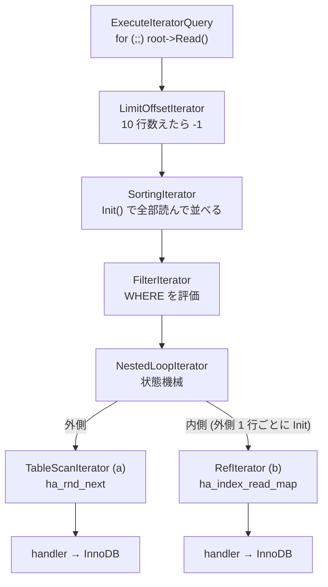

> **前提**: [AccessPath](./access-path-tree/)

## この層の責務

オプティマイザが出した `AccessPath` の木は、実行できるものではない。ただのデータ構造だ ([AccessPath のページ](./access-path-tree/))。エグゼキュータの仕事は 2 つある。

1. `AccessPath` の木を `RowIterator` の木に変換する
2. 根の iterator を回して、1 行ずつ上へ吸い上げる

この層には「クエリ全体を見る」コードがない。ソートも集約も JOIN も LIMIT も、すべて `RowIterator` の実装クラスとして横並びに置かれている。上位が知っているのは `Init()` と `Read()` の 2 つだけだ。

**8.0 の途中まで存在した `JOIN::exec` は 8.4 にはない。** 実行の本体は [`Query_expression::ExecuteIteratorQuery` (`sql/sql_union.cc#L1688`)](https://github.com/mysql/mysql-server/blob/mysql-8.4.11/sql/sql_union.cc#L1688) の中の `for (;;)` 1 本だけになった ([SELECT の一生](./life-of-a-select/))。

## 主要な型とその関係

### `RowIterator` — 契約は 2 つの関数

[`sql/iterators/row_iterator.h#L82`](https://github.com/mysql/mysql-server/blob/mysql-8.4.11/sql/iterators/row_iterator.h#L82)。ヘッダのコメントに使い方がそのまま書いてある。

```cpp title="sql/iterators/row_iterator.h"
  Use by:
@code
  unique_ptr<RowIterator> iterator(new ...);
  if (iterator->Init())
    return true;
  while (iterator->Read() == 0) {
    ...
  }
@endcode
```

純粋仮想は 4 つ。中心は最初の 2 つだ。

```cpp title="sql/iterators/row_iterator.h"
  virtual bool Init() = 0;
```

[`Init()` (L102)](https://github.com/mysql/mysql-server/blob/mysql-8.4.11/sql/iterators/row_iterator.h#L102) は初期化と**巻き戻し**を兼ねる。「何度呼んでもよく、2 回目以降は先頭に戻す」とコメントが明示している。nested loop の内側の iterator が外側 1 行ごとに `Init()` され直すのは、この契約があるからだ。

```cpp title="sql/iterators/row_iterator.h"
  /**
    Read a single row. The row data is not actually returned from the function;
    it is put in the table's (or tables', in case of a join) record buffer, ie.,
    table->records[0].

    @retval
      0   OK
    @retval
      -1   End of records
    @retval
      1   Error
   */
  virtual int Read() = 0;
```

[L116](https://github.com/mysql/mysql-server/blob/mysql-8.4.11/sql/iterators/row_iterator.h#L116)。**行そのものは返り値にならない**。行は `TABLE::record[0]` に置かれ、`Read()` は「置いたかどうか」だけを 3 値で返す。この設計の帰結が後で効いてくる (「守られている不変条件」を参照)。

残りの 2 つは、[`SetNullRowFlag` (L135)](https://github.com/mysql/mysql-server/blob/mysql-8.4.11/sql/iterators/row_iterator.h#L135) が outer join の NULL 補完用、[`UnlockRow` (L153)](https://github.com/mysql/mysql-server/blob/mysql-8.4.11/sql/iterators/row_iterator.h#L153) が「読んだが使わなかった行のロックを外す」用だ。後者のコメントは分離レベルに踏み込んでいる。

```cpp title="sql/iterators/row_iterator.h"
  // However, under some transaction isolation levels (READ COMMITTED or
  // less strict), it is possible to release such locks if and only if the row
  // failed a WHERE predicate, as only the returned rows are protected,
  // not _which_ rows are returned.
```

**REPEATABLE READ ではこの解放は行われない。** RR は「どの行が返るか」まで保護する必要があるので、WHERE で弾いた行のロックも残す。RC ならフィルタで落ちた行のロックを即座に外せる ([RR と RC の違い](./locking-in-rr-vs-rc/))。同じ `UPDATE ... WHERE` が RC のほうがロック範囲が狭くなる理由の一端がここにある。

### `TableRowIterator` — handler を叩く葉

[L234](https://github.com/mysql/mysql-server/blob/mysql-8.4.11/sql/iterators/row_iterator.h#L234)。`TABLE *` を握り、エラー処理と PFS batch mode を実装する中間クラス。木の葉になる iterator はほぼこれを継承する。

葉の実体は 2 つのヘッダに分かれている。

| ヘッダ                                                                                                                     | 主な iterator                                                                                         |
| -------------------------------------------------------------------------------------------------------------------------- | ----------------------------------------------------------------------------------------------------- |
| [`basic_row_iterators.h`](https://github.com/mysql/mysql-server/blob/mysql-8.4.11/sql/iterators/basic_row_iterators.h#L58) | `TableScanIterator` (L58)、`IndexScanIterator` (L103)、ソート結果を読む 4 種 (L182-293)               |
| [`ref_row_iterators.h`](https://github.com/mysql/mysql-server/blob/mysql-8.4.11/sql/iterators/ref_row_iterators.h#L48)     | `RefIterator` (L48)、`RefOrNullIterator` (L76)、`EQRefIterator` (L101)、`DynamicRangeIterator` (L184) |

葉が実際にやっていることは、`handler` のメソッドを呼ぶだけだ。

```cpp title="sql/iterators/basic_row_iterators.cc"
int TableScanIterator::Read() {
  int tmp;
  if (table()->is_union_or_table()) {
    while ((tmp = table()->file->ha_rnd_next(m_record))) {
```

[L275](https://github.com/mysql/mysql-server/blob/mysql-8.4.11/sql/iterators/basic_row_iterators.cc#L275)。`table()->file` が `handler` で、その先が InnoDB だ ([handler のページ](./handler-walkthrough/))。

### `AccessPath::Type` と iterator の対応

[`sql/join_optimizer/access_path.h#L229`](https://github.com/mysql/mysql-server/blob/mysql-8.4.11/sql/join_optimizer/access_path.h#L229) の enum は 5 つの区画に分かれている。

```cpp title="sql/join_optimizer/access_path.h"
  enum Type : uint8_t {
    // Basic access paths (those with no children, at least nominally).
    ...
    // Basic access paths that don't correspond to a specific table.
    ...
    // Joins.
    NESTED_LOOP_JOIN,
    NESTED_LOOP_SEMIJOIN_WITH_DUPLICATE_REMOVAL,
    BKA_JOIN,
    HASH_JOIN,

    // Composite access paths.
    FILTER,
    SORT,
    AGGREGATE,
    TEMPTABLE_AGGREGATE,
    LIMIT_OFFSET,
    STREAM,
    MATERIALIZE,
    ...
```

区画の名前がそのままこの群のページ割りになっている。Joins は [join の実行](./join-iterators/)、`SORT` は [filesort](./filesort/)、`MATERIALIZE` / `TEMPTABLE_AGGREGATE` は [内部一時表](./materialization-and-temptable/)、`AGGREGATE` / `WINDOW` / `APPEND` は [集約・ウィンドウ・集合演算](./aggregation-window-and-set-ops/)、`LIMIT_OFFSET` / `STREAM` は [行の返送](./sending-rows-and-limit/) で扱う。

### `NewIterator` と `TimingIterator`

iterator の生成はほぼ全部 [`NewIterator` (`timing_iterator.h#L222`)](https://github.com/mysql/mysql-server/blob/mysql-8.4.11/sql/iterators/timing_iterator.h#L222) を通る。

```cpp title="sql/iterators/timing_iterator.h"
template <class RealIterator, class... Args>
unique_ptr_destroy_only<RowIterator> NewIterator(THD *thd, MEM_ROOT *mem_root,
                                                 Args &&...args) {
  if (thd->lex->is_explain_analyze) {
    return unique_ptr_destroy_only<RowIterator>(
        new (mem_root)
            TimingIterator<RealIterator>(thd, std::forward<Args>(args)...));
  } else {
    return unique_ptr_destroy_only<RowIterator>(
        new (mem_root) RealIterator(thd, std::forward<Args>(args)...));
  }
}
```

**EXPLAIN ANALYZE のときだけ、各 iterator が [`TimingIterator` (L159)](https://github.com/mysql/mysql-server/blob/mysql-8.4.11/sql/iterators/timing_iterator.h#L159) で包まれる。** 包み紙は `Init()` と `Read()` の前後で `steady_clock::now()` を呼ぶだけの薄いもので、通常実行では影も形もない。計測が「オプション」ではなく「別の木」として実装されているわけだ ([EXPLAIN ANALYZE のページ](./explain-analyze-and-tree/))。

包んだせいで `down_cast` が効かなくなる場面があるので、`real_iterator()` で中身を取り出す口が用意されている。`CreateIteratorFromAccessPath` が BKA の MRR iterator を掴むときなどに使う。

## 処理の流れ

### 1. `CreateIteratorFromAccessPath` — 木を木に写す

[`sql/join_optimizer/access_path.cc#L488`](https://github.com/mysql/mysql-server/blob/mysql-8.4.11/sql/join_optimizer/access_path.cc#L488)。名前から再帰関数を想像するが、**実装は明示スタックのループ**だ。

```cpp title="sql/join_optimizer/access_path.cc"
  unique_ptr_destroy_only<RowIterator> ret;
  Mem_root_array<IteratorToBeCreated> todo(mem_root);
  todo.push_back({top_path, top_join, top_eligible_for_batch_mode, &ret, {}});

  // The access path trees can be pretty deep, and the stack frames can be big
  // on certain compilers/setups, so instead of explicit recursion, we push jobs
  // onto a MEM_ROOT-backed stack. This uses a little more RAM (the MEM_ROOT
  // typically lives to the end of the query), but reduces the stack usage
  // greatly.
```

理由はコメントのとおりで、C++ スタックを食い潰さないためだ。子を持つノードは「子のジョブを積んでから自分を積み直す」という 2 段階を踏む。

```cpp title="sql/join_optimizer/access_path.cc"
      case AccessPath::FILTER: {
        const auto &param = path->filter();
        if (job.children.is_null()) {
          SetupJobsForChildren(mem_root, param.child, join,
                               eligible_for_batch_mode, &job, &todo);
          continue;
        }
        ...
        iterator = NewIterator<FilterIterator>(
            thd, mem_root, std::move(job.children[0]), param.condition);
        break;
      }
```

`job.children.is_null()` が「まだ子を作っていない」印になっている。この switch が `AccessPath::Type` の全ケースを列挙しており、**型と iterator の対応表そのもの**になっている。新しい実行方式を足すときにここに 1 ケース増える。

### 2. `ExecuteIteratorQuery` — 根を回す

```cpp title="sql/sql_union.cc"
    if (m_root_iterator->Init()) {
      return true;
    }

    PFSBatchMode pfs_batch_mode(m_root_iterator.get());

    for (;;) {
      int error = m_root_iterator->Read();
      DBUG_EXECUTE_IF("bug13822652_1", thd->killed = THD::KILL_QUERY;);

      if (error > 0 || thd->is_error())  // Fatal error
        return true;
      else if (error < 0)
        break;
      else if (thd->killed)  // Aborted by user
      {
        thd->send_kill_message();
        return true;
      }

      ++*send_records_ptr;

      if (query_result->send_data(thd, *fields)) {
        return true;
      }
```

これが実行のすべてだ。`Read()` が 0 を返すたびに `send_data` を呼び、`-1` で抜ける。`KILL` の判定もここ 1 か所しかない。だから **`KILL QUERY` が効くのは「根が 1 行返した直後」であり、長時間 `Read()` から返ってこない iterator の中では効かない**。ソートや hash build の内側では、各 iterator が自前で `thd()->killed` を見ている (`NestedLoopIterator::Read`、`HashJoinIterator::Read` にその分岐がある)。

### 3. `Read()` の伝播

`SELECT ... FROM a JOIN b ON ... WHERE ... ORDER BY ... LIMIT 10` の木は、だいたいこうなる。



上から `Read()` が降り、下から行が `TABLE::record[0]` 経由で上がる。ただし **`SortingIterator` だけは例外的に振る舞う**。`Init()` の中で下を全部読み切ってしまい、`Read()` はソート済みの結果を返すだけになる ([filesort のページ](./filesort/))。`MaterializeIterator` も同じ形だ。

つまり pull 型といっても、**木の途中に「そこで全行が止まる」ノードがある**。EXPLAIN ANALYZE で `actual time` の第 1 値 (最初の 1 行が出るまでの時間) が急に大きくなるのは、その下に stop-and-go なノードがあるときだ。

### 4. PFS batch mode

`PFSBatchMode` ([`sql/pfs_batch_mode.h#L34`](https://github.com/mysql/mysql-server/blob/mysql-8.4.11/sql/pfs_batch_mode.h#L34)) は performance_schema の計測オーバーヘッドを削るための仕掛けで、`RowIterator` のヘッダに転送規則が書かれている。

```cpp title="sql/iterators/row_iterator.h"
      1. If you are an iterator with exactly one child (FilterIterator etc.),
         forward any StartPSIBatchMode() calls to it.
      2. If you drive an iterator (read rows from it using a for loop
         or similar), use PFSBatchMode as described above.
      3. If you have multiple children, ignore the call and do your own
         handling of batch mode as appropriate.
```

`NestedLoopIterator` は 3 に該当し、**最内表を読むときだけ** batch mode を立てる。この「誰が計測をまとめるか」が iterator の契約に混ざっているのは、抽象が完全には閉じていない証拠でもある。ヘッダ自身が "The abstraction is not completely tight." と認めている。

## 守られている不変条件

**行は必ず `TABLE::record[0]` にある。** `Read()` は行を返さない。だから 2 行を同時に持つには、どちらかを別バッファに退避しなければならない。`AggregateIterator` が `pack_rows.h` の `StoreFromTableBuffers` / `LoadIntoTableBuffers` でグループ境界の行を退避しているのはこのためだ。hash join がビルド側の行をパックして保持するのも同じ理由による。

**`Init()` は何度でも呼べるが、`Init()` の前に `Read()` を呼んではいけない。** ただし `SetNullRowFlag` だけは例外で、`Init()` 前に呼ばれうるとヘッダが明記している。

```cpp title="sql/iterators/row_iterator.h"
    Note that this can be called without Init() having been called first.
    For example, NestedLoopIterator can hit EOF immediately on the outer
    iterator, which means the inner iterator doesn't get an Init() call,
    but will still forward SetNullRowFlag to both inner and outer iterators.
```

**`Read()` の 1 は「エラーを既に報告済み」を意味する。** 上位は `my_error` を重ねて呼ばない。`ExecuteIteratorQuery` が `error > 0 || thd->is_error()` を同列に扱っているのがその現れだ。

**iterator は MEM_ROOT に置かれ、クエリ終了まで生きる。** `unique_ptr_destroy_only` はデストラクタだけ呼んで `free` しない。だから iterator が抱えたバッファ (`String`、`Mem_root_array`) はクエリ単位でしか返らない。長いクエリのメモリが途中で減らないのはこの性質による。

**batch mode を立てたら必ず終わらせる。** `LIMIT` に達しても、エラーでも同じだ。`ExecuteIteratorQuery` がスコープガード (`PFSBatchMode`) を使っているのはこのため。

## つまずきどころ

**`JOIN::exec` を探しても見つからない。** プロファイルやスタックトレースで実行の入口を探すなら `Query_expression::ExecuteIteratorQuery` を見る。その下は `RowIterator::Read` の連鎖なので、フレーム名は `NestedLoopIterator::Read` / `HashJoinIterator::Read` / `SortingIterator::Read` のように具体的な iterator 名で出る。

**`perf` のフレームが深い。** 1 行につき、木の深さぶんの仮想関数呼び出しが積み上がる。`FilterIterator::Read` の中身は「下を読んで `m_condition->val_int()` を見る」だけなのに、それが 1 行ごとに 1 フレーム増える。これが pull 型の代償で、行数の多いクエリではこのオーバーヘッド自体が無視できなくなる。ベクトル化 (1 回の呼び出しで N 行) と相性が悪いのは、`Read()` の契約が「1 行」に固定されているからだ。

**EXPLAIN ANALYZE の数字は木の形に引きずられる。** `TimingIterator` は自分の `Read()` の前後を測るので、子の時間も含む。`MaterializeIterator` と `TemptableAggregateIterator` はこの積算がおかしくなるため、`TimingIterator` ではなく専用の profiler を持つ、とヘッダに書かれている。

**「stop-and-go」なノードを見落とすと、LIMIT が効かない理由が分からなくなる。** `LIMIT 10` を付けても速くならないクエリは、たいてい `SortingIterator` や `MaterializeIterator` が間に挟まっている。これらは `Init()` で全行を消費するので、上の `LimitOffsetIterator` が 10 行で打ち切っても、下はもう全部読み終わっている。EXPLAIN の `Using filesort` / `Using temporary` はこの位置を示している ([行の返送のページ](./sending-rows-and-limit/))。

**`UnlockRow()` の効き方が分離レベルで変わる。** RR では実質何も起きない。RC で `SELECT ... FOR UPDATE` のロック範囲が狭く見えるのは、この呼び出しがあるからで、iterator の実装ごとに転送先が違う (`NestedLoopIterator` は「どちらの条件で弾かれたか分からない」ので内側にしか転送しない)。
