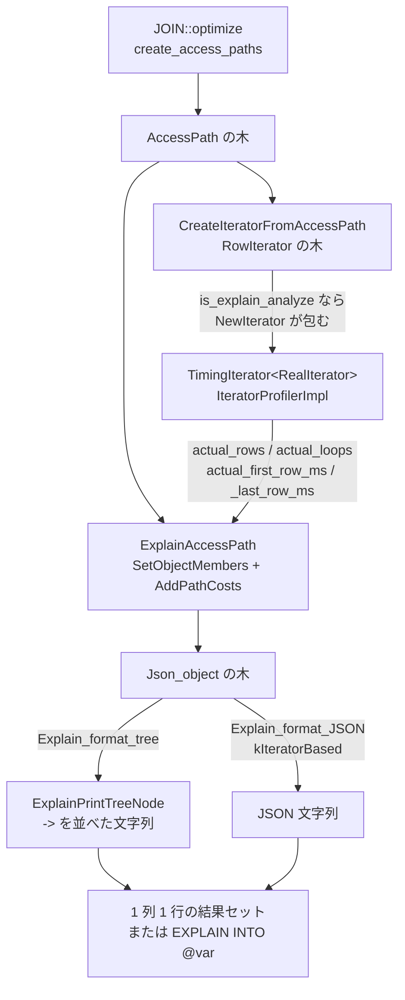

> **前提**: [AccessPath](./access-path-tree/) / [EXPLAIN の列](./explain-columns/)

## 何を学んだか

`EXPLAIN FORMAT=TREE` と `EXPLAIN ANALYZE` は別の機能ではない。どちらも [`AccessPath`](./access-path-tree/) の木を再帰的に歩いて `Json_object` を組み立て、それを文字列にする。`FORMAT=JSON` も `explain_json_format_version=2` にすれば同じ `Json_object` を使う。違いは最後の 1 段、**JSON を木の絵に落とすか JSON のまま出すか**だけだ。

そして `EXPLAIN ANALYZE` は、その `Json_object` に `actual_rows` / `actual_loops` / `actual_first_row_ms` / `actual_last_row_ms` の 4 つを足す。実測値の出どころは `TimingIterator` という薄いラッパで、`Init()` と `Read()` を呼ぶ前後で時計を読む。**行を 1 行返すごとに時計を 2 回読む**ので、これが `EXPLAIN ANALYZE` のオーバーヘッドの正体になる。



もう 1 つ、オプティマイザの途中経過を見る `optimizer_trace` がある。こちらは `AccessPath` とは無関係で、最適化のあいだ中ずっと JSON 文字列を追記していくバッファだ。上限 (`optimizer_trace_max_mem_size`、既定 1MiB) を超えたぶんは**捨てるのではなく数だけ数える**。

## なぜそうなっているか

### 3 つのフォーマットで 1 つの木を共有する理由

`FORMAT=TREE` が入る前、`EXPLAIN` の実装は「TRADITIONAL 用に `qep_row` を埋める」「JSON 用に中間ツリーを作る」の 2 系統に分かれていて、同じ情報を 2 か所で組み立てていた。iterator executor が入って `AccessPath` という単一の計画表現ができたので、**計画そのものを歩けば全フォーマットの元データが作れる**ようになった。

その結果が `Json_object` を中間表現にする構造だ。`Explain_format::ExplainJsonToString()` という 1 個の virtual だけが形式ごとに違い、木の組み立ては共有される。`Explain_format_tree::ExplainPrintTreeNode` ([L2105](https://github.com/mysql/mysql-server/blob/mysql-8.4.11/sql/join_optimizer/explain_access_path.cc#L2105)) がやっているのは、`"operation"` の文字列を取り出してインデントし、`"inputs"` を再帰するだけだ。

```cpp title="sql/join_optimizer/explain_access_path.cc"
  *explain += "-> ";
  ...
  assert(obj->get("operation")->json_type() == enum_json_type::J_STRING);
  *explain += down_cast<Json_string *>(obj->get("operation"))->value();

  ExplainPrintCosts(obj, explain);

  *explain += children_explain;
```

つまり TREE 形式は JSON の `operation` フィールドを縦に並べたものにすぎない。TREE で読めない情報は JSON にもない。

### `actual rows` を平均にした理由

nested loop の内側にあるテーブルは、外側の行数ぶん `Init()` し直される。総行数だけを出すと「1 回あたり何行返ってきたか」が分からず、**見積り (`estimated_rows`) と直接比べられない**。`estimated_rows` は `AccessPath::num_output_rows()`、つまり 1 回の実行で返る行数の見積りだからだ。

だから `actual rows` を `loops` で割って、同じ土俵に乗せてある。`rows=1 loops=100000` と `rows=100000 loops=1` は総行数が同じでも、前者は「見積り 1 行が当たっている」で後者は「見積り 1 行が 10 万倍外れている」という意味になる。

### `srv` 側ではなくクライアント側に 1 行で返す理由

iterator ベースの `EXPLAIN` は [`ExplainIterator` (`sql/opt_explain.cc#L2105`)](https://github.com/mysql/mysql-server/blob/mysql-8.4.11/sql/opt_explain.cc#L2105) が結果を送る。列は `EXPLAIN` という名前の 1 列だけで、木全体が**改行入りの 1 個の文字列**として 1 行で返る。

```cpp title="sql/opt_explain.cc"
    Item *item = new Item_empty_string("EXPLAIN", 78, system_charset_info);
```

木構造をリレーショナルな表に平らにする方法がないので、テキストのまま返すことにしてある。8.4 で入った `EXPLAIN INTO @var` は、この文字列をクライアントに送る代わりにユーザ変数に入れる。`Query_result_explain_into_var` に差し替えるだけの分岐で実現されている。

## ソースコードのどこか

### フォーマットの選択はパース時に決まる

`EXPLAIN` のフォーマットは [`PT_explain::make_cmd` (`sql/parse_tree_nodes.cc#L3652`)](https://github.com/mysql/mysql-server/blob/mysql-8.4.11/sql/parse_tree_nodes.cc#L3652) で `Explain_format` の実装クラスとして固定される。

```cpp title="sql/parse_tree_nodes.cc"
      if (!m_explicit_format &&
          (m_analyze ||
           (thd->optimizer_switch_flag(OPTIMIZER_SWITCH_HYPERGRAPH_OPTIMIZER) &&
            m_format == Explain_format_type::TRADITIONAL))) {
        lex->explain_format = new (thd->mem_root) Explain_format_tree;
      } else {
        lex->explain_format = new (thd->mem_root) Explain_format_traditional;
      }
      break;
    case Explain_format_type::JSON: {
      lex->explain_format = new (thd->mem_root) Explain_format_JSON(
          thd->optimizer_switch_flag(OPTIMIZER_SWITCH_HYPERGRAPH_OPTIMIZER) ||
                  thd->variables.explain_json_format_version == 2
              ? Explain_format_JSON::FormatVersion::kIteratorBased
              : Explain_format_JSON::FormatVersion::kLinear,
          m_explain_into_variable_name);
```

読み取れることが 3 つある。

- `EXPLAIN ANALYZE` にフォーマットを書かなければ**必ず `Explain_format_tree`** になる
- `FORMAT=JSON` は `explain_json_format_version` (既定 `1`、[`sql/sys_vars.cc#L7471`](https://github.com/mysql/mysql-server/blob/mysql-8.4.11/sql/sys_vars.cc#L7471)) が `2` のときだけ iterator ベースになる。既定の `1` は [EXPLAIN の列](./explain-columns/)と同じ `qep_row` を使う古い形式だ
- hypergraph が有効だと、フォーマット無指定の `EXPLAIN` は黙って TREE に化ける。それを嫌うために `TRADITIONAL_STRICT` という形式値が用意されている

分岐を吸収するのは [`Explain_format::is_iterator_based()` (`sql/opt_explain_format.h#L553`)](https://github.com/mysql/mysql-server/blob/mysql-8.4.11/sql/opt_explain_format.h#L553) だ。コメントが設計意図をそのまま書いている。

> Whether the format closely resembles the final plan to be executed by execution iterators (See RowIterator). These formats share a common logic that uses AccessPath structure to generate the information, so they all display exactly the same information, even though the style of each format might be different.

`Explain_format_tree` は [`opt_explain_traditional.h#L95`](https://github.com/mysql/mysql-server/blob/mysql-8.4.11/sql/opt_explain_traditional.h#L95) で常に `true`、`Explain_format_JSON` は [`opt_explain_json.h#L55`](https://github.com/mysql/mysql-server/blob/mysql-8.4.11/sql/opt_explain_json.h#L55) でバージョン次第。`Explain_format_tree` は `begin_context` / `flush_entry` / `entry()` をすべて `assert(false)` にしていて、`qep_row` の経路を一切使わない。

### 木を JSON にする

入口は [`PrintQueryPlan` (`sql/join_optimizer/explain_access_path.cc#L1979`)](https://github.com/mysql/mysql-server/blob/mysql-8.4.11/sql/join_optimizer/explain_access_path.cc#L1979) だ。

```cpp title="sql/join_optimizer/explain_access_path.cc"
  /* Create a Json object for the plan */
  unique_ptr<Json_object> obj =
      ExplainQueryPlan(path, &query_thd->query_plan, join, is_root_of_join);
  if (obj == nullptr) return "";
  ...
  return ethd->lex->explain_format->ExplainJsonToString(obj.get());
```

木の 1 ノードぶんを作るのが [`ExplainAccessPath` (L1871)](https://github.com/mysql/mysql-server/blob/mysql-8.4.11/sql/join_optimizer/explain_access_path.cc#L1871)、その中で `AccessPath::Type` ごとの説明文とプロパティを詰めるのが [`SetObjectMembers` (L1074)](https://github.com/mysql/mysql-server/blob/mysql-8.4.11/sql/join_optimizer/explain_access_path.cc#L1074) で、こちらは 800 行近い巨大な switch だ。子は `"inputs"` という配列に入り、SELECT リストのサブクエリは `"inputs_from_select_list"` という別の配列に入る。

再帰の深さについてコメントに注意書きがある。`SetObjectMembers` は debug ビルドでスタックを大量に食うので、子ノードの生成を**この関数の中でやらず**、戻ってから `ExplainAccessPath` 側でやる、と明記されている。

### コストと実測値を足すのは 1 か所

[`AddPathCosts` (L936)](https://github.com/mysql/mysql-server/blob/mysql-8.4.11/sql/join_optimizer/explain_access_path.cc#L936) が `estimated_*` を入れ、`explain_analyze` が真なら `actual_*` を足す。

```cpp title="sql/join_optimizer/explain_access_path.cc"
  /* Add analyze figures */
  if (explain_analyze) {
    int num_init_calls = 0;

    if (path->iterator != nullptr) {
      const IteratorProfiler *const profiler = path->iterator->GetProfiler();
      if ((num_init_calls = profiler->GetNumInitCalls()) != 0) {
        error |= AddMemberToObject<Json_double>(
            obj, "actual_first_row_ms",
            profiler->GetFirstRowMs() / profiler->GetNumInitCalls());
        error |= AddMemberToObject<Json_double>(
            obj, "actual_last_row_ms",
            profiler->GetLastRowMs() / profiler->GetNumInitCalls());
        error |= AddMemberToObject<Json_double>(
            obj, "actual_rows",
            static_cast<double>(profiler->GetNumRows()) / num_init_calls);
        error |=
            AddMemberToObject<Json_int>(obj, "actual_loops", num_init_calls);
      }
    }

    if (num_init_calls == 0) {
      error |= AddMemberToObject<Json_null>(obj, "actual_first_row_ms");
```

**4 つの値のうち 3 つが `num_init_calls` で割られている**。`actual rows` は総行数ではなく**ループ 1 回あたりの平均**で、`actual time` も同じくループあたりの平均だ。総行数を知りたければ `rows × loops` を自分で掛ける。

`num_init_calls == 0`、つまり `Init()` が一度も呼ばれなかったノードは 4 つとも JSON の `null` になり、木の表示では `(never executed)` になる ([`ExplainPrintCosts` L2144](https://github.com/mysql/mysql-server/blob/mysql-8.4.11/sql/join_optimizer/explain_access_path.cc#L2144))。

```cpp title="sql/join_optimizer/explain_access_path.cc"
    if (obj->get("actual_rows")->json_type() == enum_json_type::J_NULL) {
      *explain += "(never executed)";
    } else {
      ...
      stream << "(actual time=" << FormatNumberReadably(actual_first_row_ms)
             << ".." << FormatNumberReadably(actual_last_row_ms)
             << " rows=" << FormatNumberReadably(actual_rows)
             << " loops=" << FormatNumberReadably(actual_loops) << ")";
```

`(cost=A..B rows=N)` の 2 つ組も同じ関数が出している。`A` は `estimated_first_row_cost`、`B` は `estimated_total_cost` で、`first_row_cost` は `init_cost + (cost - init_cost) / num_output_rows` として `AddPathCosts` が計算した合成値だ。

### `TimingIterator` — 行ごとに時計を 2 回

実測値を集めるのは [`TimingIterator` (`sql/iterators/timing_iterator.h#L159`)](https://github.com/mysql/mysql-server/blob/mysql-8.4.11/sql/iterators/timing_iterator.h#L159) だ。`RowIterator` を継承したテンプレートで、`Init()` と `Read()` だけを横取りする。

```cpp title="sql/iterators/timing_iterator.h"
  int Read() override {
    const IteratorProfilerImpl::TimeStamp start_time =
        IteratorProfilerImpl::Now();
    int err = m_iterator.Read();
    m_profiler.StopRead(start_time, err == 0);
    return err;
  }
```

`StopRead` の中でもう 1 回 `Now()` を呼ぶので、**1 行につき 2 回**時計を読む。`Now()` の実装 ([L48](https://github.com/mysql/mysql-server/blob/mysql-8.4.11/sql/iterators/timing_iterator.h#L48)) には Linux 向けの回避策が入っている。

```cpp title="sql/iterators/timing_iterator.h"
  static TimeStamp Now() {
#if defined(__linux__)
    // Work around very slow libstdc++ implementations of std::chrono
    // (those compiled with _GLIBCXX_USE_CLOCK_GETTIME_SYSCALL).
    timespec tp;
    clock_gettime(CLOCK_MONOTONIC, &tp);
    return steady_clock::time_point(
        steady_clock::duration(std::chrono::seconds(tp.tv_sec) +
                               std::chrono::nanoseconds(tp.tv_nsec)));
#else
    return steady_clock::now();
#endif
  }
```

`std::chrono::steady_clock::now()` が実装によっては syscall になるので、Linux では `clock_gettime(CLOCK_MONOTONIC)` を直接呼ぶ。それでも vDSO 経由で数十ナノ秒かかるから、1 行あたり 2 回は無視できない。

包むかどうかは [`NewIterator` (L222)](https://github.com/mysql/mysql-server/blob/mysql-8.4.11/sql/iterators/timing_iterator.h#L222) が決める。

```cpp title="sql/iterators/timing_iterator.h"
  if (thd->lex->is_explain_analyze) {
    return unique_ptr_destroy_only<RowIterator>(
        new (mem_root)
            TimingIterator<RealIterator>(thd, std::forward<Args>(args)...));
  } else {
    return unique_ptr_destroy_only<RowIterator>(
        new (mem_root) RealIterator(thd, std::forward<Args>(args)...));
```

`EXPLAIN ANALYZE` でないときは素の iterator が返るので、**通常のクエリには 1 命令も足されない**。代わりに全 iterator クラスが 2 通りにテンプレート実体化されるので、コンパイル時間とバイナリサイズを払っている。

例外が 2 つある。ヘッダのコメントによれば `MaterializeIterator` と `TemptableAggregateIterator` は `TimingIterator` で包まない。内部に materialize 済みの結果を読むための iterator を持っていて、これを包むと「materialize の時間」と「結果を読む時間」が二重に計上されるからだ。この 2 つは `SetOverrideProfiler` で別途集めた `IteratorProfiler` を差し込む ([内部一時表](./materialization-and-temptable/))。

### `EXPLAIN ANALYZE` はクエリを実際に走らせる

[`explain_query` (`sql/opt_explain.cc#L2247`)](https://github.com/mysql/mysql-server/blob/mysql-8.4.11/sql/opt_explain.cc#L2247) の中で、結果だけ捨てて実行する。

```cpp title="sql/opt_explain.cc"
      // Run the query, but with the result suppressed.
      Query_result_null null_result;
      unit->set_query_result(&null_result);
      explain_thd->running_explain_analyze = true;
      unit->execute(explain_thd);
      explain_thd->running_explain_analyze = false;
      unit->set_executed();
```

[`Query_result_null` (L2152)](https://github.com/mysql/mysql-server/blob/mysql-8.4.11/sql/opt_explain.cc#L2152) は `send_data` で行を捨てるが、SELECT リストの各 `Item` に `val_str()` だけは呼ぶ。SELECT リストの中のサブクエリを評価しないと実測値が出ないからだ。

「捨てるのは**送信**だけ」なので、`UPDATE` や `DELETE` の `EXPLAIN ANALYZE` は行を書き換える。実行後に `ROLLBACK` する仕組みはコードのどこにもない。

### optimizer trace は切り詰め

`optimizer_trace` はオプティマイザが `Opt_trace_object` / `Opt_trace_array` を作るたびに JSON テキストをバッファに追記していく仕組みだ。バッファの追記は [`Buffer::append_escaped` (`sql/opt_trace.cc#L633`)](https://github.com/mysql/mysql-server/blob/mysql-8.4.11/sql/opt_trace.cc#L633) を通る。

```cpp title="sql/opt_trace.cc"
void Buffer::append_escaped(const char *str, size_t length) {
  if (alloced_length() >= allowed_mem_size) {
    missing_bytes += length;
    return;
  }
```

上限を超えたら**その追記だけを捨てて、捨てたバイト数を足す**。トレース全体が消えるわけではないので、先頭のほうは読める。捨てた合計は `INFORMATION_SCHEMA.OPTIMIZER_TRACE` の 3 列目に出る ([`sql/opt_trace2server.cc#L534`](https://github.com/mysql/mysql-server/blob/mysql-8.4.11/sql/opt_trace2server.cc#L534))。

```cpp title="sql/opt_trace2server.cc"
ST_FIELD_INFO optimizer_trace_info[] = {
    /* name, length, type, value, maybe_null, old_name, open_method */
    {"QUERY", 65535, MYSQL_TYPE_STRING, 0, false, nullptr, 0},
    {"TRACE", 65535, MYSQL_TYPE_STRING, 0, false, nullptr, 0},
    {"MISSING_BYTES_BEYOND_MAX_MEM_SIZE", 20, MYSQL_TYPE_LONG, 0, false,
     nullptr, 0},
    {"INSUFFICIENT_PRIVILEGES", 1, MYSQL_TYPE_TINY, 0, false, nullptr, 0},
```

`optimizer_trace_max_mem_size` は[セッション変数で既定 1MiB](https://github.com/mysql/mysql-server/blob/mysql-8.4.11/sql/sys_vars.cc#L3410) だが、これは **1 文ぶんの上限ではなくセッションが保持しているトレース全部の合計**だ。[`allowed_mem_size_for_current_stmt` (`sql/opt_trace.cc#L1078`)](https://github.com/mysql/mysql-server/blob/mysql-8.4.11/sql/opt_trace.cc#L1078) が、保存済みトレースの実サイズを引いた残りを今の文に割り当てる。`optimizer_trace_limit` (既定 1) を増やしてトレースを溜めると、1 文あたりに使える枠が減る。

`INSUFFICIENT_PRIVILEGES` が立つと `TRACE` は空文字列になる。ビューやストアドプログラムの定義者と実行者が違い、定義を見る権限がないときの安全弁だ (`opt_trace_disable_if_no_view_access` など)。

## どう活かすか

**見積りと実測の乖離を 1 行で見る。** `EXPLAIN ANALYZE` の各ノードは `(cost=... rows=E) (actual time=... rows=A loops=L)` の形で出る。`E` と `A` を比べれば、どの段で見積りが壊れたかが分かる。木の葉から根に向かって見て、**最初に大きくずれたノード**が原因だ。そこより上のずれはそれが伝播しただけになる。`E` がずれているなら[統計](./statistics-and-cost-model/)か[条件の絞り込み率](./explain-columns/)の問題で、`ANALYZE TABLE` かヒストグラムを疑う。

**`(never executed)` は無駄ではなく分岐。** `Init()` すら呼ばれなかったノードは、上の `LimitOffsetIterator` が先に打ち切ったか、外側が 0 行だったかだ。`LIMIT` 付きのクエリで深い部分木が `(never executed)` になっていれば、[早期終了](./sending-rows-and-limit/)が効いている証拠になる。

**`EXPLAIN ANALYZE` の合計時間を鵜呑みにしない。** 行ごとに `clock_gettime` が 2 回入るので、1 行あたりの処理が軽い iterator (フィルタ、単純な nested loop) ほど相対的なオーバーヘッドが大きい。「実測 10ms」が「本当は 6ms」ということはありうる。**ノード間の比率**を見る道具として使い、絶対値は本番の遅延の代わりにしない。

**`EXPLAIN ANALYZE UPDATE` は本当に更新する。** ロールバックしないので、トランザクションで囲んでから実行する。`START TRANSACTION; EXPLAIN ANALYZE UPDATE ...; ROLLBACK;` が安全な使い方だ。同じ理由で、`EXPLAIN ANALYZE` は[行ロック](./lock-modes-and-types/)を取り、`AUTO_INCREMENT` も消費する。

**`FORMAT=JSON` の出力が想像と違う。** 8.4 の既定 (`explain_json_format_version=1`) では、`FORMAT=JSON` は `EXPLAIN` の 12 列と同じ情報を入れ子にした古い形式だ。TREE と同じ内容を JSON で欲しいなら `SET explain_json_format_version = 2` を先に打つ。ツールが `query_block` / `cost_info` を期待しているなら `1` のままにする。

**optimizer trace が途中で切れる。** `MISSING_BYTES_BEYOND_MAX_MEM_SIZE` が 0 でなければ切り詰められている。`optimizer_trace_max_mem_size` を増やすか、`optimizer_trace_features` で `greedy_search` を切る。多数テーブルの JOIN では[探索の記録](./join-order-search/)がトレースの大半を占めるので、これだけで収まることが多い。トレースは**前の文のぶんも枠を食う**ので、1 文ずつ `optimizer_trace_offset=-1, optimizer_trace_limit=1` で回すのが確実だ。

**`TRACE` が空文字列で返る。** `INSUFFICIENT_PRIVILEGES` を確認する。ビューやストアドプログラムを含むクエリで、その定義を見る権限がないと本文が伏せられる。
