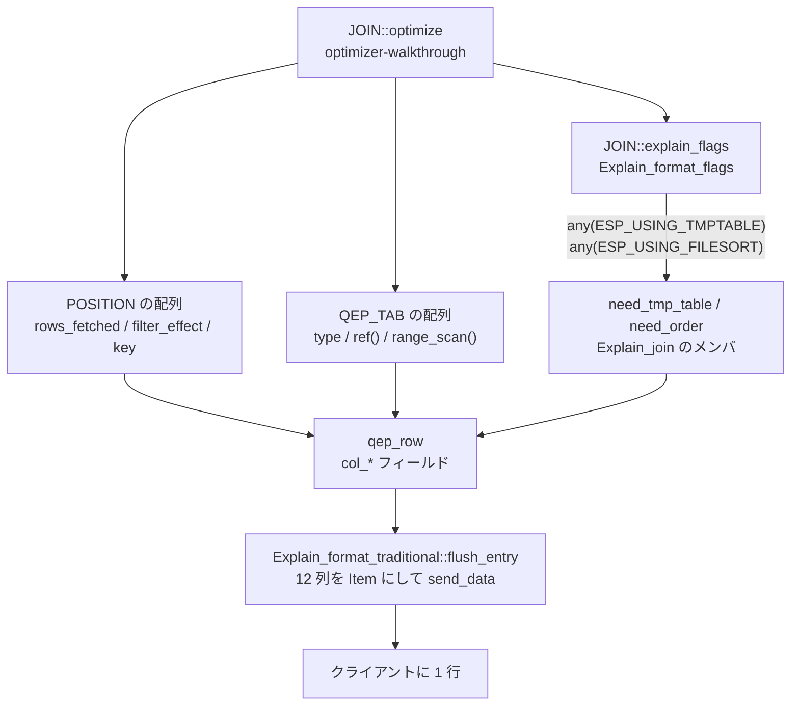

## 何を学んだか

`EXPLAIN` の出力は、オプティマイザが作った構造体を**そのまま横に並べただけ**だ。加工らしい加工はほとんどしていない。

出力の実体は [`qep_row` (`sql/opt_explain_format.h#L150`)](https://github.com/mysql/mysql-server/blob/mysql-8.4.11/sql/opt_explain_format.h#L150) という 1 個のバッファで、`col_id` / `col_select_type` / `col_table_name` … と、出力される列と 1 対 1 に対応するフィールドが並んでいる。TRADITIONAL フォーマットではこれが**行ごとに使い回される**。1 行ぶん埋めて `flush_entry()` でクライアントに送り、`Buffer_cleanup` のデストラクタで全部クリアして次の行に進む。

埋めるのは [`Explain::prepare_columns()` (`sql/opt_explain.cc#L743`)](https://github.com/mysql/mysql-server/blob/mysql-8.4.11/sql/opt_explain.cc#L743) だ。11 個の virtual を `||` で連結しているだけで、この並びが列の意味の定義になっている。

```cpp title="sql/opt_explain.cc"
bool Explain::prepare_columns() {
  return explain_id() || explain_select_type() || explain_table_name() ||
         explain_partitions() || explain_join_type() ||
         explain_possible_keys() || explain_key_and_len() || explain_ref() ||
         explain_modify_flags() || explain_rows_and_filtered() ||
         explain_extra();
}
```

だから「`rows` が実際と違う」「`filtered` が 100.00 のまま」といった疑問は、**どの構造体のどのフィールドを読んでいるか**まで降りればほぼ答えが出る。この章の他のページはその構造体をそれぞれ扱っているので、このページは対応表を置いて橋渡しにする。



## ソースコードのどこか

### 列の名前と型

列そのものの定義は [`THD::send_explain_fields` (`sql/sql_class.cc#L1936`)](https://github.com/mysql/mysql-server/blob/mysql-8.4.11/sql/sql_class.cc#L1936) にある。12 個の `Item` を作って `send_result_set_metadata` に渡すだけで、ここが `EXPLAIN` の結果セットのスキーマだ。

```cpp title="sql/sql_class.cc"
field_list.push_back(new Item_return_int("id", 3, MYSQL_TYPE_LONGLONG));
field_list.push_back(new Item_empty_string("select_type", 19, cs));
field_list.push_back(item =
                         new Item_empty_string("table", NAME_CHAR_LEN, cs));
```

`table` から下は全部 `set_nullable(true)` が付く。`EXPLAIN` で `NULL` が出る列があるのはこのためで、`id` と `select_type` だけは常に値が入る。

### 送信順を決める shim

[`Explain_format_traditional::flush_entry` (`sql/opt_explain_traditional.cc#L217`)](https://github.com/mysql/mysql-server/blob/mysql-8.4.11/sql/opt_explain_traditional.cc#L217) が `qep_row` のフィールドを列の順に `Item` へ変換する。`col_*` は空なら `Item_null` になる。

```cpp title="sql/opt_explain_traditional.cc"
  if (push(&items, column_buffer.col_id, nil) || push_select_type(&items) ||
      push(&items, column_buffer.col_table_name, nil) ||
      push(&items, column_buffer.col_partitions, nil) ||
      push(&items, column_buffer.col_join_type, nil) ||
      push(&items, column_buffer.col_possible_keys, nil) ||
      push(&items, column_buffer.col_key, nil) ||
      push(&items, column_buffer.col_key_len, nil) ||
      push(&items, column_buffer.col_ref, nil) ||
      push(&items, column_buffer.col_rows, nil) ||
      push(&items, column_buffer.col_filtered, nil))
    return true;
```

`opt_explain_traditional.cc` は 277 行しかない。列順の並べ替えと `Extra` の文字列連結だけを持つ薄い層で、値を決める仕事は全部 `opt_explain.cc` 側にある。

### 全 12 列の対応表

`Explain_join` (通常の SELECT) を基準にした対応だ。単一テーブルの UPDATE / DELETE は `Explain_table` が担当し、一部の列の出所が変わる (後述)。

| 列              | `qep_row` のフィールド                                           | 埋める関数                                                                                                                                                                                                                               | 値の出所                                                                                                                                                                                                                                                                                                                                    | 関連ページ                                             |
| --------------- | ---------------------------------------------------------------- | ---------------------------------------------------------------------------------------------------------------------------------------------------------------------------------------------------------------------------------------- | ------------------------------------------------------------------------------------------------------------------------------------------------------------------------------------------------------------------------------------------------------------------------------------------------------------------------------------------- | ------------------------------------------------------ |
| `id`            | `col_id`                                                         | [`Explain::explain_id` (L777)](https://github.com/mysql/mysql-server/blob/mysql-8.4.11/sql/opt_explain.cc#L777) / [`Explain_join::explain_id` (L1491)](https://github.com/mysql/mysql-server/blob/mysql-8.4.11/sql/opt_explain.cc#L1491) | `Query_block::select_number`。semijoin の materialize 戦略なら `QEP_TAB::sjm_query_block_id()` に差し替わる                                                                                                                                                                                                                                 | [サブクエリ](./subquery-transformations/)              |
| `select_type`   | `col_select_type` + `is_dependent` / `is_cacheable` / `mod_type` | [`explain_select_type` (L782)](https://github.com/mysql/mysql-server/blob/mysql-8.4.11/sql/opt_explain.cc#L782)                                                                                                                          | [`Query_block::type()` (`sql/sql_lex.cc#L4477`)](https://github.com/mysql/mysql-server/blob/mysql-8.4.11/sql/sql_lex.cc#L4477) が返す `enum_explain_type` (13 種)。`DEPENDENT ` / `UNCACHEABLE ` の前置は [`push_select_type` (L179)](https://github.com/mysql/mysql-server/blob/mysql-8.4.11/sql/opt_explain_traditional.cc#L179) が付ける | [パーサとリゾルバ](./parser-walkthrough/)              |
| `table`         | `col_table_name`                                                 | [`Explain_join::explain_table_name` (L1476)](https://github.com/mysql/mysql-server/blob/mysql-8.4.11/sql/opt_explain.cc#L1476) → `store_table_name`                                                                                      | `Table_ref::alias`。view / derived で階層フォーマットでないときだけ `<derivedN>` を合成する                                                                                                                                                                                                                                                 | [データディクショナリ](./data-dictionary/)             |
| `partitions`    | `col_partitions`                                                 | [`Explain_table_base::explain_partitions` (L935)](https://github.com/mysql/mysql-server/blob/mysql-8.4.11/sql/opt_explain.cc#L935)                                                                                                       | `TABLE::part_info` を [`make_used_partitions_str` (`sql/sql_partition.cc#L5298`)](https://github.com/mysql/mysql-server/blob/mysql-8.4.11/sql/sql_partition.cc#L5298) に通す。`part_info` が `nullptr` なら列は `NULL`                                                                                                                      | [パーティショニング](./partitioning/)                  |
| `type`          | `col_join_type`                                                  | [`Explain_join::explain_join_type` (L1499)](https://github.com/mysql/mysql-server/blob/mysql-8.4.11/sql/opt_explain.cc#L1499)                                                                                                            | `QEP_TAB::type()` の `join_type` を [`join_type_str[]` (L118)](https://github.com/mysql/mysql-server/blob/mysql-8.4.11/sql/opt_explain.cc#L118) で文字列化。元をたどると `best_access_path` の勝敗                                                                                                                                          | [アクセスパスの選択](./access-path-selection/)         |
| `possible_keys` | `col_possible_keys`                                              | [`explain_possible_keys` (L942)](https://github.com/mysql/mysql-server/blob/mysql-8.4.11/sql/opt_explain.cc#L942)                                                                                                                        | `QEP_TAB::keys()` に `TABLE::possible_quick_keys` を `merge` したビットマップ → `KEY::name`                                                                                                                                                                                                                                                 | [range 分析](./range-optimizer/)                       |
| `key`           | `col_key`                                                        | [`Explain_join::explain_key_and_len` (L1518)](https://github.com/mysql/mysql-server/blob/mysql-8.4.11/sql/opt_explain.cc#L1518)                                                                                                          | ref なら `KEY::name`、range / index_merge なら `AccessPath` から `add_keys_and_lengths` が組み立てた文字列                                                                                                                                                                                                                                  | [アクセスパスの選択](./access-path-selection/)         |
| `key_len`       | `col_key_len`                                                    | 同上 → [`explain_key_and_len_index` (L983)](https://github.com/mysql/mysql-server/blob/mysql-8.4.11/sql/opt_explain.cc#L983) / [`_quick` (L964)](https://github.com/mysql/mysql-server/blob/mysql-8.4.11/sql/opt_explain.cc#L964)        | ref は `TABLE_REF::key_length`、index scan は `KEY::key_length`。どちらも `KEY_PART_INFO::store_length` の総和                                                                                                                                                                                                                              | [セカンダリインデックス](./secondary-index/)           |
| `ref`           | `col_ref`                                                        | [`Explain_join::explain_ref` (L1531)](https://github.com/mysql/mysql-server/blob/mysql-8.4.11/sql/opt_explain.cc#L1531) → [`explain_ref_key` (L620)](https://github.com/mysql/mysql-server/blob/mysql-8.4.11/sql/opt_explain.cc#L620)    | `TABLE_REF::key_copy[]` の各 `store_key::name()`。`nullptr` のスロットは `"const"`                                                                                                                                                                                                                                                          | [名前解決と Item ツリー](./name-resolution-and-items/) |
| `rows`          | `col_rows`                                                       | [`Explain_join::explain_rows_and_filtered` (L1536)](https://github.com/mysql/mysql-server/blob/mysql-8.4.11/sql/opt_explain.cc#L1536)                                                                                                    | `POSITION::rows_fetched`。ref なら `rec_per_key` 由来の fanout、range なら `records_in_range` 由来の `num_output_rows()`                                                                                                                                                                                                                    | [統計とコストモデル](./statistics-and-cost-model/)     |
| `filtered`      | `col_filtered`                                                   | 同上                                                                                                                                                                                                                                     | `POSITION::filter_effect × 100`。値は [`calculate_condition_filter` (`sql/sql_planner.cc#L1246`)](https://github.com/mysql/mysql-server/blob/mysql-8.4.11/sql/sql_planner.cc#L1246) が計算する                                                                                                                                              | [統計とコストモデル](./statistics-and-cost-model/)     |
| `Extra`         | `col_extra` (`List<extra>`) / `col_message`                      | [`Explain_join::explain_extra` (L1575)](https://github.com/mysql/mysql-server/blob/mysql-8.4.11/sql/opt_explain.cc#L1575) + `explain_extra_common` (L996)                                                                                | `Extra_tag` の enum 値と付随文字列。プランが立たなかった行では `col_message` が `Extra` の位置に入る                                                                                                                                                                                                                                        | このページの後半                                       |

`Explain::prepare_columns()` の並びに `explain_modify_flags()` が混じっているのに、出力列がないのに気づく。これは `mod_type` (`MT_INSERT` / `MT_UPDATE` / `MT_DELETE` / `MT_REPLACE`) を立てるだけの関数で、`push_select_type` が `select_type` を `UPDATE` / `DELETE` に**差し替える**ために使う。`EXPLAIN UPDATE ...` の `select_type` が `UPDATE` になるのはこの経路だ。

### `rows` と `filtered` は `POSITION` の写し

[`Explain_join::explain_rows_and_filtered` (L1536)](https://github.com/mysql/mysql-server/blob/mysql-8.4.11/sql/opt_explain.cc#L1536) の中身はほとんど代入だ。

```cpp title="sql/opt_explain.cc"
    fmt->entry()->col_rows.set(static_cast<ulonglong>(pos->rows_fetched));
    fmt->entry()->col_filtered.set(
        pos->rows_fetched
            ? static_cast<float>(100.0 * tab->position()->filter_effect)
            : 0.0f);
```

`POSITION` に書き込むのは [`Optimize_table_order::best_access_path` (`sql/sql_planner.cc#L983`)](https://github.com/mysql/mysql-server/blob/mysql-8.4.11/sql/sql_planner.cc#L983) の末尾だ。

```cpp title="sql/sql_planner.cc"
  if (best_ref)
    filter_effect = calculate_condition_filter(
        tab, best_ref, ~remaining_tables & ~excluded_tables, rows_fetched,
        false, false, trace_access_scan);

  best_read_cost += derived_mat_cost;
  pos->filter_effect = filter_effect;
  pos->rows_fetched = rows_fetched;
```

つまり `rows` は「このテーブルに 1 回入ったとき、アクセスメソッドが返す行数の見積り」であって、クエリ全体で読む行数ではない。全体の見積りは `col_prefix_rows` (JSON の `prefix_rows`) のほうで、TRADITIONAL には出ない。

`filtered` を計算する [`calculate_condition_filter` (L1246)](https://github.com/mysql/mysql-server/blob/mysql-8.4.11/sql/sql_planner.cc#L1246) は、先頭で 7 つの条件をすべて調べて 1 つも当たらなければ `COND_FILTER_ALLPASS` (= 1.0、つまり 100.00) を返して即座に抜ける。条件の 1 つ目は `optimizer_switch` の `condition_fanout_filter` で、6 つ目は「文が `EXPLAIN` であること」だ。**`EXPLAIN` のときは必ず計算される**が、`EXPLAIN FOR CONNECTION` で他のセッションを覗くと最後のテーブルは 100.00 になりやすい、とコメントに明記してある。

### `Extra` の 35 個のタグ

`Extra` の値は自由文字列ではなく [`Extra_tag` (`sql/opt_explain_format.h#L62`)](https://github.com/mysql/mysql-server/blob/mysql-8.4.11/sql/opt_explain_format.h#L62) という enum で、`ET_none` から `ET_REMATERIALIZE` まで 35 個ある。表示文字列は [`traditional_extra_tags[]` (`sql/opt_explain_traditional.cc#L47`)](https://github.com/mysql/mysql-server/blob/mysql-8.4.11/sql/opt_explain_traditional.cc#L47) の並行配列で、enum の順と 1 対 1 に対応させることがヘッダのコメントで要求されている。

```cpp title="sql/opt_explain_traditional.cc"
static const char *traditional_extra_tags[ET_total] = {
    nullptr,                            // ET_none
    "Using temporary",                  // ET_USING_TEMPORARY
    "Using filesort",                   // ET_USING_FILESORT
    "Using index condition",            // ET_USING_INDEX_CONDITION
    "Using",                            // ET_USING
```

`qep_row::extra` はタグと `const char *data` の組で、`data` があると `"タグ data"` と空白区切りで連結される。ただし `ET_RANGE_CHECKED_FOR_EACH_RECORD` / `ET_USING_INDEX_FOR_GROUP_BY` / `ET_USING_JOIN_BUFFER` / `ET_FIRST_MATCH` / `ET_REMATERIALIZE` の 5 つだけは `data` を丸括弧で囲む。`Using join buffer (hash join)` の括弧はここで付いている ([`flush_entry` L217](https://github.com/mysql/mysql-server/blob/mysql-8.4.11/sql/opt_explain_traditional.cc#L217) 内の `brackets` 分岐)。最後に `"; "` で連結し、末尾の 2 文字を削る。

主なタグと、その仕組みを扱っているページの対応を挙げる。

| `Extra` の文字列                                                 | `Extra_tag`                                             | 判定している場所                                                 | 関連ページ                                                   |
| ---------------------------------------------------------------- | ------------------------------------------------------- | ---------------------------------------------------------------- | ------------------------------------------------------------ |
| `Using where`                                                    | `ET_USING_WHERE`                                        | `QEP_TAB::condition_optim()` が残っている                        | [iterator executor](./executor-walkthrough/)                 |
| `Using index`                                                    | `ET_USING_INDEX`                                        | `TABLE::covering_keys` / `key_read` / `keyread_optim`            | [セカンダリインデックス](./secondary-index/)                 |
| `Using index condition`                                          | `ET_USING_INDEX_CONDITION`                              | `handler::pushed_idx_cond_keyno` が現在のキーと一致              | [アクセスパスの選択](./access-path-selection/)               |
| `Using MRR`                                                      | `ET_USING_MRR`                                          | `QEP_TAB` の MRR フラグ                                          | [アクセスパスの選択](./access-path-selection/)               |
| `Using index for group-by` / `for skip scan`                     | `ET_USING_INDEX_FOR_GROUP_BY` / `_SKIP_SCAN`            | `range_scan_type` が `GROUP_INDEX_SKIP_SCAN` / `INDEX_SKIP_SCAN` | [range 分析](./range-optimizer/)                             |
| `Using join buffer`                                              | `ET_USING_JOIN_BUFFER`                                  | `POSITION::use_join_buffer` と `setup_join_buffering` の結論     | [join の実行](./join-iterators/)                             |
| `Using temporary`                                                | `ET_USING_TEMPORARY`                                    | **クエリブロック全体**の `explain_flags` (下記)                  | [内部一時表](./materialization-and-temptable/)               |
| `Using filesort`                                                 | `ET_USING_FILESORT`                                     | **クエリブロック全体**の `explain_flags` (下記)                  | [filesort](./filesort/)                                      |
| `LooseScan` / `FirstMatch` / `Start temporary` / `End temporary` | `ET_LOOSESCAN` ほか                                     | `QEP_TAB` の semijoin 戦略フラグ                                 | [サブクエリ](./subquery-transformations/)                    |
| `Backward index scan`                                            | `ET_BACKWARD_SCAN`                                      | `QEP_TAB::reversed_access()`                                     | [ORDER BY / GROUP BY](./sort-avoidance-and-ordering/)        |
| `Index dive skipped due to FORCE`                                | `ET_SKIP_RECORDS_IN_RANGE`                              | `QEP_TAB::skip_records_in_range()`                               | [ヒントと optimizer_switch](./optimizer-hints-and-switches/) |
| `Impossible ON condition` / `const row not found`                | `ET_IMPOSSIBLE_ON_CONDITION` / `ET_CONST_ROW_NOT_FOUND` | 定数テーブルの評価結果が 0 行                                    | [JOIN::optimize](./optimizer-walkthrough/)                   |

### `Using temporary` と `Using filesort` だけが別経路

この 2 つは他のタグと出所が違う。他のタグは `QEP_TAB` や `AccessPath` を見て**そのテーブルの行で**決めるが、この 2 つは [`explain_query_specification` (L2080-2087)](https://github.com/mysql/mysql-server/blob/mysql-8.4.11/sql/opt_explain.cc#L2080) で**クエリブロック全体のビットマスクから bool 2 個に潰され**、`Explain_join` のコンストラクタ引数として渡される。

```cpp title="sql/opt_explain.cc"
      const Explain_format_flags *flags = &join->explain_flags;
      const bool need_tmp_table = flags->any(ESP_USING_TMPTABLE);
      const bool need_order = flags->any(ESP_USING_FILESORT);
      const bool distinct = flags->get(ESC_DISTINCT, ESP_EXISTS);

      if (query_term->term_type() == QT_QUERY_BLOCK)
        ret = Explain_join(explain_thd, query_thd, query_block, need_tmp_table,
                           need_order, distinct)
                  .send();
```

受け取り側の宣言も、コメントごと素直だ ([`sql/opt_explain.cc#L443`](https://github.com/mysql/mysql-server/blob/mysql-8.4.11/sql/opt_explain.cc#L443))。

```cpp title="sql/opt_explain.cc"
  bool need_tmp_table;  ///< add "Using temporary" to "extra" if true
  bool need_order;      ///< add "Using filesort"" to "extra" if true
```

`Explain_format_flags` は [`uint8 sorts[ESC_MAX]`](https://github.com/mysql/mysql-server/blob/mysql-8.4.11/sql/opt_explain_format.h#L451) だけを持つ小さな箱で、`ORDER BY` / `GROUP BY` / `DISTINCT` / `BUFFER_RESULT` / `WINDOWING` の 5 つの句それぞれについて「一時表を使ったか」「filesort を使ったか」のビットを立てる。ビットを立てるのは実行計画を組み立てるほうで、たとえば filesort は [`sql/sql_select.cc#L5067`](https://github.com/mysql/mysql-server/blob/mysql-8.4.11/sql/sql_select.cc#L5067) の 1 行だ。

```cpp title="sql/sql_select.cc"
  explain_flags.set(sort_order->src, ESP_USING_FILESORT);
```

そして出力する [`explain_tmptable_and_filesort` (L1179)](https://github.com/mysql/mysql-server/blob/mysql-8.4.11/sql/opt_explain.cc#L1179) は、階層フォーマットでは**何も出さずに帰る**。

```cpp title="sql/opt_explain.cc"
bool Explain_table_base::explain_tmptable_and_filesort(bool need_tmp_table_arg,
                                                       bool need_sort_arg) {
  /*
    For hierarchical EXPLAIN we output "Using temporary" and
    "Using filesort" with related ORDER BY, GROUP BY or DISTINCT
  */
  if (fmt->is_hierarchical()) return false;
```

`Explain_join::explain_extra` は 1 回出したあと [`need_tmp_table = need_order = false;` (L1620)](https://github.com/mysql/mysql-server/blob/mysql-8.4.11/sql/opt_explain.cc#L1620) と自分でフラグを落とす。だから複数テーブルの JOIN でも `Using filesort` は 1 行にしか付かず、**どの行に付いたかにテーブル固有の意味はない**。

## なぜそうなっているか

### 1 個のバッファを使い回す

`qep_row` はテーブル 1 枚ぶんの値を貯めるだけの箱で、`Explain_format_traditional` はこれを**メンバとして 1 個だけ**持つ (`column_buffer`)。行を送るたびに `Buffer_cleanup` のデストラクタが `cleanup()` を呼んですべての `col_*` を空に戻す。

EXPLAIN の出力は最大でも数十行だから、性能上の理由でこうする必要はない。理由は形式の抽象化のほうだ。同じ `qep_row` が階層フォーマット (`FORMAT=JSON` の version 1) では**中間ツリーのノード 1 個ぶんのプロパティ集合**として使われる。ヘッダのコメントがそう書いている。

> For traditional EXPLAIN this structure contains cached data for a single output row.
> For hierarchical EXPLAIN this structure contains property values for a single CTX_TABLE/CTX_QEP_TAB context node of the intermediate tree.

値を集める `Explain_*` クラス群と、値を出力する `Explain_format_*` クラス群のあいだのデータ形式が `qep_row` だ。TRADITIONAL は貯めた瞬間に flush し、JSON は木に積む。この分離のために、TRADITIONAL では意味のないフィールド (`col_read_cost` / `col_prefix_cost` / `col_data_size_query` / `col_used_columns`) も同じ構造体に同居している。

### `Using temporary` / `Using filesort` が特別扱いな理由

一時表と filesort は、**テーブル 1 枚に紐づく操作ではない**。`ORDER BY` のためのソートはすべてのテーブルを読み終わったあとに 1 回起きるもので、どのテーブルの行に書くのが正しいかという問いに答えがない。

階層フォーマットではこの問題が消える。`ORDER BY` のコンテキストというノードが木の中にあるので、そこに「filesort を使った」と書けばいい。`explain_tmptable_and_filesort` が `is_hierarchical()` で即 return するのはそのためだ。TRADITIONAL は木を平らにした表なので、置き場所がなく、仕方なく最初のテーブル行に貼り付けている。

`Explain_format_flags` が「句 × 性質」の 2 次元ビットマスクなのも同じ事情で、`ORDER BY` と `GROUP BY` の両方が一時表を作ることがあるから、階層フォーマットではそれぞれのノードに別々に出せるように情報を残してある。TRADITIONAL に落とすときだけ `any()` で潰される。

### `Explain_table` は `filtered` を計算しない

単一テーブルの `UPDATE` / `DELETE` は `JOIN` を通らないので、`POSITION` が存在しない。[`Explain_table::explain_rows_and_filtered` (L1796)](https://github.com/mysql/mysql-server/blob/mysql-8.4.11/sql/opt_explain.cc#L1796) は `Modification_plan::examined_rows` を `rows` に入れ、`filtered` には定数を入れる。

```cpp title="sql/opt_explain.cc"
  const ha_rows examined_rows =
      query_thd->query_plan.get_modification_plan()->examined_rows;
  fmt->entry()->col_rows.set(static_cast<long long>(examined_rows));

  fmt->entry()->col_filtered.set(100.0);
```

`EXPLAIN UPDATE t SET ... WHERE ...` の `filtered` が常に `100.00` なのはバグではなく、そこに入れる値を持っていないからだ。

### TRADITIONAL は hypergraph に対応しない

`opt_explain.cc` の `Explain_*` クラス群は `QEP_TAB` と `POSITION` を直接読む。この 2 つは旧オプティマイザの出力で、[hypergraph オプティマイザ](./hypergraph-optimizer/)は作らない。だから両立させる方法がなく、[`explain_query` (L2306-2310)](https://github.com/mysql/mysql-server/blob/mysql-8.4.11/sql/opt_explain.cc#L2306) は素直に諦める。

```cpp title="sql/opt_explain.cc"
  if (query_thd->lex->using_hypergraph_optimizer() &&
      !fake_explain_for_secondary_engine) {
    // With hypergraph, JSON is iterator-based. So it must be TRADITIONAL.
    my_error(ER_HYPERGRAPH_NOT_SUPPORTED_YET, MYF(0),
             "EXPLAIN with TRADITIONAL format");
    return true;
  }
```

ただしフォーマットを明示していなければ、パース時点で TREE に化ける。[`PT_explain::make_cmd` (`sql/parse_tree_nodes.cc#L3652`)](https://github.com/mysql/mysql-server/blob/mysql-8.4.11/sql/parse_tree_nodes.cc#L3652) が `m_explicit_format` を見て、hypergraph が有効なら `Explain_format_tree` を作る。`FORMAT=TRADITIONAL` と明示的に書いたときだけエラーになる — そのための `TRADITIONAL_STRICT` という内部の形式値まで用意されている。

## どう活かすか

**`rows` が実際の行数とかけ離れる。** `rows` は `POSITION::rows_fetched`、つまり[統計](./statistics-and-cost-model/)から出た見積りだ。ref アクセスなら `rec_per_key`、range なら `records_in_range` のインデックスダイブが元になる。実際に読んだ行数を知りたいなら [`EXPLAIN ANALYZE`](./explain-analyze-and-tree/) の `actual rows` を見るか、`SHOW SESSION STATUS LIKE 'Handler_read%'` を[前後で差分にとる](./logs-and-status-variables/)。`rows` が桁違いなら `ANALYZE TABLE` で `rec_per_key` を作り直すのが先だ。

**`filtered` が 100.00 のまま動かない。** 3 つの原因がある。(1) `optimizer_switch` の `condition_fanout_filter` が `off`、(2) 単一テーブルの `UPDATE` / `DELETE` (`Explain_table` は 100.0 固定)、(3) `EXPLAIN FOR CONNECTION` で最後のテーブルを見ている。`filtered` は join 順序の見積りに直結するので、100.00 が並ぶプランは「あとで絞れる条件」を織り込めていない。

**`key_len` から使われたキーパート数を逆算する。** `key_len` は `KEY_PART_INFO::store_length` の総和で、`store_length` は列の長さに **NULL 可なら 1 バイト**、可変長なら 2 バイトを足した値だ。`INT NOT NULL` なら 4、`INT NULL` なら 5、`VARCHAR(10)` の utf8mb4 で NOT NULL なら 42。複合インデックスで `key_len` が想定より短ければ、後ろのキーパートが使われていない。JSON フォーマットの `used_key_parts` (`col_key_parts`) を見れば直接分かる。

**`Extra` が空なのに遅い。** `Extra` に出ない情報のほうが多い。`type: ALL` で `Extra` が `NULL` なのは「フルスキャンして WHERE もない」という意味で、いちばん素直に遅い。逆に `Using index` が出ていれば[カバリングインデックス](./secondary-index/)なので、行数が多くてもクラスタードインデックスを引き直していない。

**`possible_keys` に候補があるのに `key` が `NULL`。** `possible_keys` は `QEP_TAB::keys()` と `TABLE::possible_quick_keys` の和で、「使える可能性があった」というだけだ。選ばれなかった理由は[コスト比較](./access-path-selection/)にあり、`optimizer_trace` を取れば `best_access_path` の各候補のコストが読める ([EXPLAIN ANALYZE / FORMAT=TREE / optimizer trace](./explain-analyze-and-tree/))。

**`select_type: DEPENDENT SUBQUERY` が見えたら外側の行数ぶん実行される。** `DEPENDENT` の前置は `Query_block::is_dependent()` から来る。相関サブクエリが semijoin に変換されなかったということなので、[サブクエリの変換](./subquery-transformations/)のどこで失敗したかを疑う。

**hypergraph を試したら `EXPLAIN` の形が変わった。** `optimizer_switch=hypergraph_optimizer=on` にすると、フォーマット無指定の `EXPLAIN` は黙って `FORMAT=TREE` になる。8.4 の release ビルドではそもそも hypergraph を有効にできない (`ER_HYPERGRAPH_NOT_SUPPORTED_YET`) ので、これに遭遇するのは debug ビルドを触っているときだけだ。
