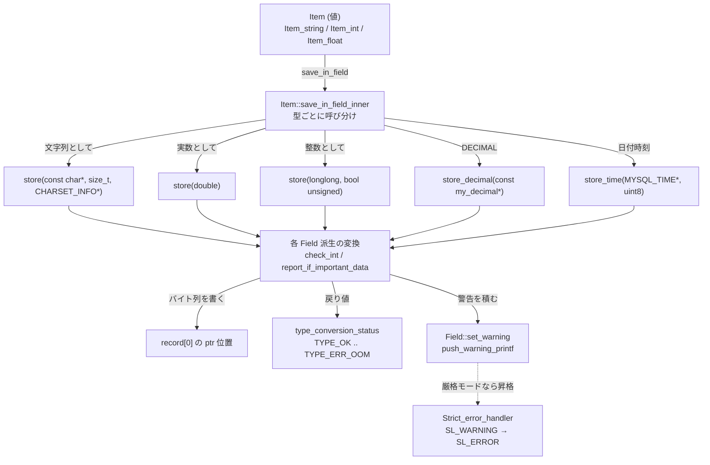

> **前提**: [handler](./handler-walkthrough/) / [行フォーマット変換](./row-format-conversion/)

## 何を学んだか

`CREATE TABLE t (i INT, s VARCHAR(255))` と書いたとき、MySQL の中に生まれるのは `Field_long` 1 個と `Field_varstring` 1 個だ。この 2 つは **`TABLE` に紐付いて 1 回だけ作られ、行を 1 億件走査しても作り直されない**。

理由は、`Field` が値を持っていないからだ。持っているのは「レコードバッファのどこに、何バイトで置かれるか」だけになる。

```cpp title="sql/field.h"
 protected:
  /// Holds the position to the field in record
  uchar *ptr;
```

[`sql/field.h#L639`](https://github.com/mysql/mysql-server/blob/mysql-8.4.11/sql/field.h#L639)。1 行進むというのは、この `ptr` の指す先のバイト列が書き換わることを指す ([行フォーマット変換](./row-format-conversion/))。

ここから、型について知っておくべきことがほぼ全部出てくる。

- **型変換の入口は `store()` の 3 本しかない。** 文字列・`double`・`longlong` の 3 つで、`SET i = '1'` と `SET i = 1` は別の関数を通る
- **`store()` の戻り値 `type_conversion_status` は 9 段階あり、深刻さの昇順に並んでいる。** 値の大小に意味があるので `max` で畳み込める
- **その戻り値は、それ自体では文を失敗させない。** `Field` の側は警告を積むだけで、エラーに化けるかどうかは別の層が決める ([sql_mode と厳格モード](./sql-mode-and-strict/))
- **`field_length` はバイト数であって文字数ではない。** `VARCHAR(255)` を utf8mb4 で作ると `field_length` は 1020 になる
- **行長の上限は 2 段ある。** Server 側の 65535 と InnoDB 側の 8126 は別の場所の別の検査で、エラーメッセージも違う



## なぜそうなっているか

**`Field` が値を持たないのは、行ごとにオブジェクトを作らないためだ。** テーブルスキャンは 1 行につき `handler::rnd_next()` を 1 回呼び、その結果は `record[0]` というバイト配列に上書きされる。`Field` はその配列への「窓」なので、行が変わっても何も作り直す必要がない。`Field` を値オブジェクトにしていたら、1 行 10 列のスキャンで毎行 10 個の割り当てが要る。

**`store()` が 3 本なのは、SQL の値領域が 3 つしかないからだ。** どんな式も最後は文字列・実数・整数のどれかとして評価できる (`my_decimal` と `MYSQL_TIME` は精度を落とさないための追加口)。「型 A から型 B へ」の変換器を N×N 本用意する代わりに、N 個の `Field` が 3 本ずつ受け口を持てば済む。

**戻り値を深刻さの昇順にしたのは、複数列の結果を 1 個に畳み込めるようにするためだ。** ヘッダのコメントが明言している。

```cpp title="sql/field.h"
/**
  Status when storing a value in a field or converting from one
  datatype to another. The values should be listed in order of
  increasing seriousness so that if two type_conversion_status
  variables are compared, the bigger one is most serious.
*/
```

[`sql/field.h#L197`](https://github.com/mysql/mysql-server/blob/mysql-8.4.11/sql/field.h#L197)。1 行 10 列を詰めた結果のうち「一番まずかったもの」が知りたいとき、比較演算子 1 つで済む。

**`Field` が警告しか積まないのは、厳しさがセッションの設定だからだ。** 同じ `'abc' → INT` という変換が、あるセッションでは警告、別のセッションではエラーになる。`Field::store` の中で `sql_mode` を見て `my_error` を呼ぶ設計にすると、40 種類の `Field` すべてに同じ分岐が要る。実際にはそうせず、警告を積む側と、それをエラーに昇格させる側を分けた。

**`field_length` をバイトにしたのは、レコードバッファのオフセット計算に使うからだ。** `record[0]` の中で列 N の位置を決めるには、それより前の列が何バイト占めるかが要る。文字数では計算できない。「宣言した文字数」のほうは、必要になったときに割り算で戻す。

```cpp title="sql/field.h"
  /* The max. number of characters */
  virtual uint32 char_length() const {
    return field_length / charset()->mbmaxlen;
  }
```

[`sql/field.h#L1677`](https://github.com/mysql/mysql-server/blob/mysql-8.4.11/sql/field.h#L1677)。`mbmaxlen` は文字セットの「1 文字の最大バイト数」で、utf8mb4 なら 4 ([文字セットと照合順序](./charset-and-collation/))。

## ソースコードのどこか

### 40 個の派生 — `sql/field.h` の冒頭コメント

階層はヘッダの先頭に図で置かれている。

```cpp title="sql/field.h"
Field (abstract)
|
+--Field_bit
|  +--Field_bit_as_char
|
+--Field_num (abstract)
|  |  +--Field_real (abstract)
|  |     +--Field_decimal
|  |     +--Field_float
|  |     +--Field_double
|  |
|  +--Field_new_decimal
|  +--Field_short
|  +--Field_medium
|  +--Field_long
|  +--Field_longlong
|  +--Field_tiny
|     +--Field_year
|
+--Field_str (abstract)
|  +--Field_longstr
|  |  +--Field_string
|  |  +--Field_varstring
|  |  +--Field_blob
|  |     +--Field_geom
|  |     +--Field_json
|  |        +--Field_typed_array
|  |
|  +--Field_null
|  +--Field_enum
|     +--Field_set
|
+--Field_temporal (abstract)
   +--Field_time_common (abstract)
   |  +--Field_time
   |  +--Field_timef
   ...
```

[`sql/field.h#L125`](https://github.com/mysql/mysql-server/blob/mysql-8.4.11/sql/field.h#L125)。読むときに効くのは 2 か所だ。

**`Field_decimal` と `Field_new_decimal` は別物で、前者は `Field_real` の子。** 5.0 より前の文字列表現の DECIMAL が `Field_decimal` で、いま `DECIMAL` と書いて作られるのは `Field_new_decimal` (`Field_num` の直下) になる。`field.cc` に両方のコードが残っているので、`Field_decimal::store` を読んで「DECIMAL の実装」と思うと外す。

**`Field_json` は `Field_blob` の子。** JSON は独立した格納方式ではなく BLOB の派生として実装されている ([JSON](./json-storage-and-partial-update/))。`TEXT` / `BLOB` に効く制約はだいたい JSON にも効く。

### 値を入れる口 — 3 本の `store`

```cpp title="sql/field.h"
  virtual type_conversion_status store(const char *to, size_t length,
                                       const CHARSET_INFO *cs) = 0;
  virtual type_conversion_status store(double nr) = 0;
  virtual type_conversion_status store(longlong nr, bool unsigned_val) = 0;
```

[`sql/field.h#L922`](https://github.com/mysql/mysql-server/blob/mysql-8.4.11/sql/field.h#L922)。この 3 本が純粋仮想で、加えて `store_decimal` が純粋仮想、`store_time` と `store_packed` は既定実装つきの仮想になっている。

**文字列版だけが `CHARSET_INFO *` を取る**のが重要で、「どの文字セットのバイト列として渡されたか」は値と一緒に運ばれる。列の文字セットと違えば、この中で変換が起きる。

### 戻り値 — 9 段階の `type_conversion_status`

```cpp title="sql/field.h"
enum type_conversion_status {
  /// Storage/conversion went fine.
  TYPE_OK = 0,
  TYPE_NOTE_TIME_TRUNCATED,
  TYPE_NOTE_TRUNCATED,
  TYPE_WARN_OUT_OF_RANGE,
  TYPE_WARN_TRUNCATED,
  TYPE_WARN_INVALID_STRING,
  /// Trying to store NULL in a NOT NULL field.
  TYPE_ERR_NULL_CONSTRAINT_VIOLATION,
  TYPE_ERR_BAD_VALUE,
  /// Out of memory
  TYPE_ERR_OOM
};
```

[`sql/field.h#L202`](https://github.com/mysql/mysql-server/blob/mysql-8.4.11/sql/field.h#L202)。名前の `NOTE` / `WARN` / `ERR` は、そのまま診断エリアに積まれる深刻度に対応する。`NOTE` と `WARN` の境目はヘッダのコメントで定義されていて、**`VARCHAR(3)` に `"foo "` を入れて末尾の空白だけが落ちるのが NOTE、`VARCHAR(2)` に `"foo"` を入れて `o` が落ちるのが WARN** になる。

### 変換の実際 — `Field_num::check_int`

`INT` の列に文字列を入れる経路がこれだ。

```cpp title="sql/field.cc"
type_conversion_status Field_num::check_int(const CHARSET_INFO *cs,
                                            const char *str, size_t length,
                                            const char *int_end, int error) {
  /* Test if we get an empty string or wrong integer */
  if (str == int_end || error == MY_ERRNO_EDOM) {
    THD *thd = current_thd;
    const ErrConvString err(str, length, cs);
    push_warning_printf(
        thd, Sql_condition::SL_WARNING, ER_TRUNCATED_WRONG_VALUE_FOR_FIELD,
        ER_THD(thd, ER_TRUNCATED_WRONG_VALUE_FOR_FIELD), "integer", err.ptr(),
        field_name, thd->get_stmt_da()->current_row_for_condition());
    return TYPE_ERR_BAD_VALUE;
  }
  /* Test if we have garbage at the end of the given string. */
  if (test_if_important_data(cs, int_end, str + length)) {
    set_warning(Sql_condition::SL_WARNING, WARN_DATA_TRUNCATED, 1);
    return TYPE_WARN_TRUNCATED;
  }
  return TYPE_OK;
}
```

[`sql/field.cc#L1545`](https://github.com/mysql/mysql-server/blob/mysql-8.4.11/sql/field.cc#L1545)。3 分岐が全部ここにある。

- `'abc'` — 1 桁も読めなかったので `TYPE_ERR_BAD_VALUE`、警告は `ER_TRUNCATED_WRONG_VALUE_FOR_FIELD`
- `'12abc'` — 12 は読めたが後ろに意味のあるデータが残った。`TYPE_WARN_TRUNCATED`、警告は `WARN_DATA_TRUNCATED`
- `'12 '` — 後ろが空白だけなら `test_if_important_data` が false になり **`TYPE_OK`**。警告すら出ない

文字列側も同じ形をしていて、切り詰めが起きたときに**厳格モードかどうかでエラーコードだけを差し替える**。

```cpp title="sql/field.cc"
    if (test_if_important_data(field_charset, pstr, end)) {
      // Warning should only be written when check_for_truncated_fields is set
      if (thd->check_for_truncated_fields) {
        if (!thd->lex->is_ignore() && thd->is_strict_mode())
          set_warning(Sql_condition::SL_WARNING, ER_DATA_TOO_LONG, 1);
        else
          set_warning(Sql_condition::SL_WARNING, WARN_DATA_TRUNCATED, 1);
      }
      return TYPE_WARN_TRUNCATED;
    }
```

[`Field_longstr::report_if_important_data` (`sql/field.cc#L6127`)](https://github.com/mysql/mysql-server/blob/mysql-8.4.11/sql/field.cc#L6127)。**どちらの枝も `SL_WARNING` で積んでいる**ことに注意する。`Data too long for column` がエラーとして返るのは、この積んだ警告を後段が昇格させるからで、ここではまだ警告だ ([sql_mode と厳格モード](./sql-mode-and-strict/))。

### 呼び出し側 — `fill_record` は戻り値をほとんど見ない

`INSERT` の値を列に詰める中心はこれになる。

```cpp title="sql/sql_base.cc"
    if (value->save_in_field(rfield, false) < 0) {
      my_error(ER_UNKNOWN_ERROR, MYF(0));
      return true;
    }
    if (thd->is_error()) return true;
```

[`fill_record` (`sql/sql_base.cc#L9696`)](https://github.com/mysql/mysql-server/blob/mysql-8.4.11/sql/sql_base.cc#L9696)。`type_conversion_status` は enum なので `< 0` になることはなく、実質この判定は死んでいる (ソースにも `@todo` として書かれている)。**実際に文を止めているのは次の行の `thd->is_error()`** で、つまり「誰かが `my_error` を呼んだか、積まれた警告がエラーに昇格したか」だけを見ている。

戻り値を素直に使っている数少ない場所が `NOT NULL` の検査だ。

```cpp title="sql/field.cc"
  switch (m_check_for_truncated_fields_saved) {
    case CHECK_FIELD_WARN:
      set_warning(Sql_condition::SL_WARNING, mysql_errno, 1);
      [[fallthrough]];
    case CHECK_FIELD_IGNORE:
      return TYPE_OK;
    case CHECK_FIELD_ERROR_FOR_NULL:
      my_error(ER_BAD_NULL_ERROR, MYF(0), field_name);
      return TYPE_ERR_NULL_CONSTRAINT_VIOLATION;
  }
```

[`Field::check_constraints` (`sql/field.cc#L1716`)](https://github.com/mysql/mysql-server/blob/mysql-8.4.11/sql/field.cc#L1716)。3 値の `enum_check_fields` ([`field.h#L172`](https://github.com/mysql/mysql-server/blob/mysql-8.4.11/sql/field.h#L172)) で、無視・警告・エラーを切り替える。`INSERT` の場合、この値は行数で決まる。

```cpp title="sql/sql_insert.cc"
    thd->check_for_truncated_fields =
        ((insert_many_values.size() == 1 && !lex->is_ignore())
             ? CHECK_FIELD_ERROR_FOR_NULL
             : CHECK_FIELD_WARN);
```

[`sql/sql_insert.cc#L596`](https://github.com/mysql/mysql-server/blob/mysql-8.4.11/sql/sql_insert.cc#L596)。**1 行 `INSERT` は `NOT NULL` 違反でエラー、複数行 `INSERT` は警告**という差がここで作られる。厳格モードならどちらも最終的にエラーになるが、非厳格では挙動が分かれる。

### `pack_length` — 宣言と物理長は一致しない

既定では `field_length` をそのまま返す。

```cpp title="sql/field.h"
  virtual uint32 pack_length() const { return (uint32)field_length; }
```

[`sql/field.h#L1063`](https://github.com/mysql/mysql-server/blob/mysql-8.4.11/sql/field.h#L1063)。ずれるのが `DECIMAL` で、10 進 9 桁を 4 バイトに詰める。

```cpp title="mysys/decimal.cc"
static const int dig2bytes[DIG_PER_DEC1 + 1] = {0, 1, 1, 2, 2, 3, 3, 4, 4, 4};
```

```cpp title="mysys/decimal.cc"
ALWAYS_INLINE static int decimal_bin_size_inline(int precision, int scale) {
  int intg = precision - scale, intg0 = intg / DIG_PER_DEC1,
      frac0 = scale / DIG_PER_DEC1, intg0x = intg - intg0 * DIG_PER_DEC1,
      frac0x = scale - frac0 * DIG_PER_DEC1;
  ...
  return intg0 * sizeof(dec1) + dig2bytes[intg0x] + frac0 * sizeof(dec1) +
         dig2bytes[frac0x];
}
```

[`mysys/decimal.cc#L1617`](https://github.com/mysql/mysql-server/blob/mysql-8.4.11/mysys/decimal.cc#L1617)。整数部と小数部を別々に、9 桁単位で 4 バイト、余りは `dig2bytes` の表で引く。`DIG_PER_DEC1` は 9、`dec1` は 4 バイト。

- `DECIMAL(10,2)` — 整数部 8 桁 → 4 バイト、小数部 2 桁 → 1 バイト。合計 **5 バイト**
- `DECIMAL(11,2)` — 整数部 9 桁 → 4 バイト、小数部 2 桁 → 1 バイト。合計 **5 バイト** (増えない)
- `DECIMAL(12,2)` — 整数部 10 桁 → 4 + 1 バイト。合計 **6 バイト**

### 行長の上限 — Server 側の 65535

```cpp title="sql/sql_table.cc"
  if (reclength > file->max_record_length()) {
    my_error(ER_TOO_BIG_ROWSIZE, MYF(0),
             static_cast<long>(file->max_record_length()));
    return true;
  }
```

[`sql/sql_table.cc#L8598`](https://github.com/mysql/mysql-server/blob/mysql-8.4.11/sql/sql_table.cc#L8598)。`reclength` は NULL ビットのバイト数 + 各列の `pack_length()` の合計で、上限は handler が申告する。

```cpp title="sql/handler.h"
#define HA_MAX_REC_LENGTH 65535U
...
  uint max_record_length() const {
    return std::min(HA_MAX_REC_LENGTH, max_supported_record_length());
  }
```

[`sql/handler.h#L625`](https://github.com/mysql/mysql-server/blob/mysql-8.4.11/sql/handler.h#L625)。**これは `CREATE TABLE` 時に Server が行う検査で、InnoDB の 8126 とは別物**だ。BLOB / TEXT はここでは実データではなくポインタ長で数えられるので、「BLOB を除いて 65535」という言い方になる。

## どう活かすか

### `VARCHAR(255)` の 255 は文字数、格納は 4 倍で見積もる

`field_length` はバイトなので、utf8mb4 の `VARCHAR(255)` は内部では 1020 バイトの列として扱われる。効いてくるのは実データのサイズではなく**上限が絡む計算のほう**だ。

- インデックスのキー長 — `VARCHAR(255)` を utf8mb4 でインデックスすると 1020 バイトを消費する。DYNAMIC 行フォーマットの上限 3072 バイトに対し、3 列で埋まる ([セカンダリインデックス](./secondary-index/))
- 内部一時表 — メモリ上の一時表は可変長を最大長で確保する経路があり、`VARCHAR(1000)` が数本あるだけでディスクに落ちやすくなる ([内部一時表](./materialization-and-temptable/))
- `CREATE TABLE` の 65535 — `VARCHAR` の合計が効く。utf8mb4 なら `VARCHAR(16000)` 1 本で上限に届く

「余裕を持って `VARCHAR(255)`」という既定は、文字セットが latin1 だった時代の感覚だと考えておく。

### `DECIMAL` は桁を 1 増やしても伸びない区間がある

`decimal_bin_size` は 9 桁単位の階段なので、`DECIMAL(10,2)` と `DECIMAL(11,2)` は同じ 5 バイトになる。金額列で「桁が足りなくなりそうだから 1 桁増やす」は、**多くの場合バイト数を増やさない**。`ALTER` のコストが気になって桁を切り詰めているなら、階段の位置を見てから決めるほうがいい。

逆に `DECIMAL(19,4)` (整数部 15 桁 → 4+4+3 = 11 バイト、小数部 4 桁 → 2 バイト、計 13 バイト) のように、境界をまたぐと一気に伸びる。

### `'12 '` が通って `'12x'` が警告になる理由

`check_int` の `test_if_important_data` は「後ろに残ったのが空白だけか」を見る。だからアプリが `" 12 "` のような値を送っても既定では無警告で通る。**入力の前後の空白がサイレントに落ちる**ということなので、「空白のみの文字列」と「未入力」を区別したい列では、アプリ側で正規化してから送らないと区別が消える。

`'12abc'` は警告どまり、`'abc'` は `TYPE_ERR_BAD_VALUE` と、同じ「数値でない文字列」でも扱いが違う点にも注意する。

### 1 行 `INSERT` と複数行 `INSERT` で `NOT NULL` の挙動が変わる

非厳格モードでは、1 行 `INSERT` の `NOT NULL` 違反はエラー、複数行 `INSERT` は警告 + 既定値の挿入になる。ORM がバルクインサートに切り替えた途端に「エラーになるはずのデータが入る」のは、`check_for_truncated_fields` のこの分岐が理由になる。

厳格モードなら両方エラーになるので、この差を気にせずに済む。8.0 以降の既定は `STRICT_TRANS_TABLES` を含むので通常は問題にならないが、`sql_mode` を空にする運用をしているなら、行数で挙動が変わることを覚えておく。

### 一般化して持ち帰るもの

**「値を持たないオブジェクトに、バッファへの窓だけを持たせる」**というのが `Field` の設計で、これは行指向のデータ処理で繰り返し出てくる形だ。1 行ごとにオブジェクトを作らないためのパターンで、代償として `Field` はスレッド安全でなく、`TABLE` ごとに複製が要る (`Field(const Field &) = default` がヘッダに残っているのはこのため)。

もう 1 つは**「警告を出す層と、それをエラーにする層を分ける」**という判断だ。40 種類の `Field` すべてに `sql_mode` の分岐を書く代わりに、深刻度の昇格を 1 か所に集めた。同じ変換コードが、厳格モードでも非厳格モードでも、`IGNORE` 付きでも動く。次のページでその昇格側を読む。
