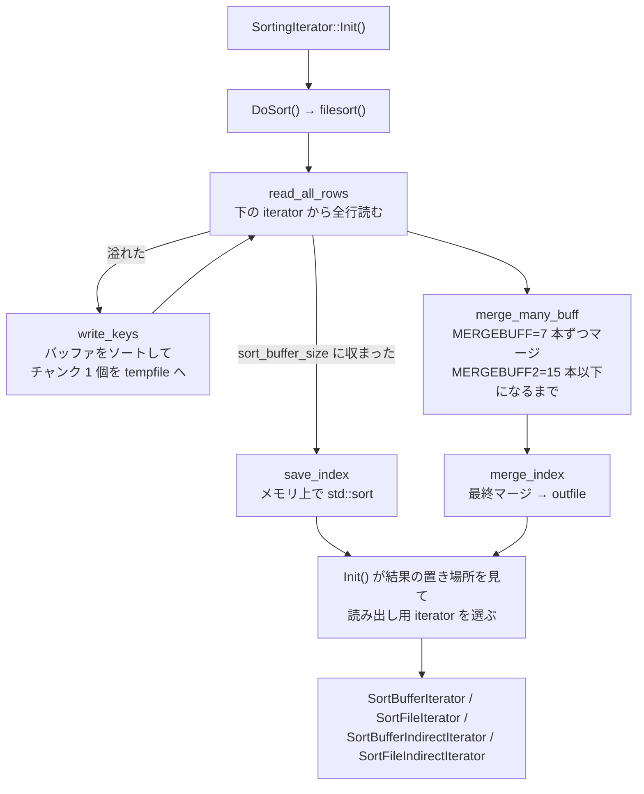

## 何を学んだか

`ORDER BY` をインデックスで満たせなかったとき、オプティマイザは `AccessPath::SORT` を置き、実行器は `SortingIterator` を作る ([ORDER BY / GROUP BY のページ](./sort-avoidance-and-ordering/))。EXPLAIN の `Using filesort` ([`opt_explain_traditional.cc#L50`](https://github.com/mysql/mysql-server/blob/mysql-8.4.11/sql/opt_explain_traditional.cc#L50)) がこれだ。

覚えておくべきことは 4 つある。

1. **`filesort` はファイルを使うとは限らない。** `sort_buffer_size` に全部収まれば一時ファイルは開かれない。名前が誤解を招くのは 20 年来の既知の問題だ
2. **溢れたら「7 本ずつマージして 15 本以下にする」。** `MERGEBUFF = 7` と `MERGEBUFF2 = 15` という 2 つの定数がその閾値で、実装は `sql/merge_many_buff.h` という header-only の template 1 つに収まっている
3. **`Sort_merge_passes` はマージ 1 回ぶんを数える。** 「ソートが何回ディスクを使ったか」ではない
4. **行全体を運ぶか行 ID だけ運ぶかの分岐 (addon fields / rowid sort) は残っているが、それを制御していた `max_length_for_sort_data` は 8.4 では無効だ**

## ソースコードのどこか

### 全体の形



`SortingIterator` は **stop-and-go** だ。[`SortingIterator::Init` (`sorting_iterator.cc#L438`)](https://github.com/mysql/mysql-server/blob/mysql-8.4.11/sql/iterators/sorting_iterator.cc#L438) の冒頭でソートを完了させてしまう。

```cpp title="sql/iterators/sorting_iterator.cc"
bool SortingIterator::Init() {
  ReleaseBuffers();

  // Both empty result and error count as errors. (TODO: Why? This is a legacy
  // choice that doesn't always seem right to me, although it should nearly
  // never happen in practice.)
  if (DoSort() != 0) return true;

  // Prepare the result iterator for actually reading the data. Read()
  // will proxy to it.
```

`Read()` は選ばれた結果 iterator に丸投げするだけだ。**この構造のせいで、`SortingIterator` より上にある `LimitOffsetIterator` は早期終了の恩恵を受けられない** ([行の返送のページ](./sending-rows-and-limit/))。

### 読み出し用 iterator は 4 種類

`Init()` の後半が結果の置き場所 (`io_cache` かメモリか) と addon fields の有無で 4 分岐する。

| 置き場所     | addon fields あり                | addon fields なし (rowid)    |
| ------------ | -------------------------------- | ---------------------------- |
| 一時ファイル | `SortFileIterator<true/false>`   | `SortFileIndirectIterator`   |
| メモリ       | `SortBufferIterator<true/false>` | `SortBufferIndirectIterator` |

宣言は [`basic_row_iterators.h#L182-293`](https://github.com/mysql/mysql-server/blob/mysql-8.4.11/sql/iterators/basic_row_iterators.h#L182)。template 引数の `bool` は packed addon fields かどうかで、`SortFileIterator<true>` が可変長のパック形式を読む。

**`Indirect` が付くほうが rowid sort だ。** 名前のとおり、ソート結果には行 ID しか入っていないので、1 行返すたびに `handler` を呼んでテーブルから行を取り直す。ソート済みの行 ID はテーブル上ばらばらの位置を指すので、ここでランダム I/O が発生する。

### addon fields と rowid の分岐

[`Sort_param::decide_addon_fields` (`filesort.cc#L162`)](https://github.com/mysql/mysql-server/blob/mysql-8.4.11/sql/filesort.cc#L162)。

```cpp title="sql/filesort.cc"
  // Generally, prefer using addon fields (ie., sorting rows instead of just
  // row IDs) if we can.
  //
  // NOTE: If the table is already in memory (e.g. the MEMORY engine; see the
  // HA_FAST_KEY_READ flag), it would normally be beneficial to sort row IDs
  // over rows to get smaller sort chunks. However, eliding the temporary table
  // entirely is even better than using row IDs, and only possible if we sort
  // rows.
```

**既定は「できるなら addon fields」で、コストによる切り替えはもうない。** rowid になるのは 2 つの場合だけだ。

```cpp title="sql/filesort.cc"
  for (TABLE *table : tables) {
    if (table->pos_in_table_list &&
        table->pos_in_table_list->is_fulltext_searched()) {
      // See comment in SortWillBeOnRowId().
      m_addon_fields_status = Addon_fields_status::fulltext_searched;
      return;
    }
  }

  if (force_sort_rowids) {
    m_addon_fields_status = Addon_fields_status::keep_rowid;
  } else {
```

全文検索が絡む場合と、上位が行 ID を要求する場合 (weedout など、[join のページ](./join-iterators/)) だけ。`Addon_fields_status` の値は optimizer trace の `filesort_summary.sort_mode` に `<fixed_sort_key, additional_fields>` のような形で出る。

### `max_length_for_sort_data` は無効

かつてこの変数が「addon fields の合計長がこれを超えたら rowid sort に切り替える」閾値だった。8.4 のツリーには変数の宣言だけが残っている。

```cpp title="sql/sys_vars.cc"
static Sys_var_ulong Sys_max_length_for_sort_data(
    "max_length_for_sort_data",
    "This variable is deprecated and will be removed in a future release.",
    HINT_UPDATEABLE SESSION_VAR(max_length_for_sort_data),
    CMD_LINE(REQUIRED_ARG), VALID_RANGE(4, 8192 * 1024L), DEFAULT(4096),
    BLOCK_SIZE(1), NO_MUTEX_GUARD, NOT_IN_BINLOG, ON_CHECK(nullptr),
    ON_UPDATE(nullptr), DEPRECATED_VAR(""));
```

[`sys_vars.cc#L2906`](https://github.com/mysql/mysql-server/blob/mysql-8.4.11/sql/sys_vars.cc#L2906)。格納先の宣言はもっと率直だ。

```cpp title="sql/system_variables.h"
  ulong max_length_for_sort_data;  ///< Unused.
```

[`system_variables.h#L244`](https://github.com/mysql/mysql-server/blob/mysql-8.4.11/sql/system_variables.h#L244)。**`SET` は成功するが何も起きない。** 8.0 以前のチューニング記事でこの変数を触れと書いてあったら、8.4 では読み飛ばしてよい。

### 溢れる瞬間

[`read_all_rows` (`filesort.cc#L923`)](https://github.com/mysql/mysql-server/blob/mysql-8.4.11/sql/filesort.cc#L923) が下の iterator を回しながらソートキーを作る。バッファが尽きたところがこれだ。

```cpp title="sql/filesort.cc"
      if (out_of_mem_or_error) {
        if (thd->is_error()) {
          return HA_POS_ERROR;
        }
        // Out of room, so flush chunk to disk (if there's anything to flush).
        if (num_records_this_chunk > 0) {
          if (write_keys(param, fs_info, num_records_this_chunk, chunk_file,
                         tempfile)) {
            return HA_POS_ERROR;
          }
          num_records_this_chunk = 0;
          num_written_chunks++;
          fs_info->reset();

          // Now we should have room for a new row.
          out_of_mem_or_error = alloc_and_make_sortkey(
              param, fs_info, tables, &key_length, &longest_addon_so_far);
        }

        // If we're still out of memory after flushing to disk, give up.
        if (out_of_mem_or_error) {
          ...
          my_error(ER_OUT_OF_SORTMEMORY, ME_FATALERROR);
```

**1 行すら入らないほどバッファが小さいと `ER_OUT_OF_SORTMEMORY` で落ちる。** `sort_buffer_size` の下限 (`MIN_SORT_MEMORY`) があるのはこのため。

[`write_keys` (L1088)](https://github.com/mysql/mysql-server/blob/mysql-8.4.11/sql/filesort.cc#L1088) はバッファをソートしてから 1 チャンクとして書き出し、その位置と行数を `Merge_chunk` として別ファイル (`chunk_file`) に記録する。

```cpp title="sql/filesort.cc"
  count = fs_info->sort_buffer(param, count, param->max_rows);
  ...
  merge_chunk.set_file_position(my_b_tell(tempfile));
  merge_chunk.set_rowcount(static_cast<ha_rows>(count));
```

**つまり一時ファイルは 2 本開く。** 行を入れる `tempfile` と、チャンクの目次を入れる `chunk_file` だ。`Created_tmp_files` にはこれらも数えられる。

### マージ — 7 と 15

`sql/sql_sort.h` の 2 行がすべてを決めている。

```cpp title="sql/sql_sort.h"
constexpr size_t MERGEBUFF = 7;
constexpr size_t MERGEBUFF2 = 15;
```

[L40-41](https://github.com/mysql/mysql-server/blob/mysql-8.4.11/sql/sql_sort.h#L40)。使うのは [`sql/merge_many_buff.h`](https://github.com/mysql/mysql-server/blob/mysql-8.4.11/sql/merge_many_buff.h#L51) の template 関数 1 つだけ。**このファイルは header-only で、`.cc` は存在しない。**

```cpp title="sql/merge_many_buff.h"
template <typename Merge_param>
bool merge_many_buff(THD *thd, Merge_param *param, Sort_buffer sort_buffer,
                     Merge_chunk_array chunk_array, size_t *p_num_chunks,
                     IO_CACHE *t_file) {
  IO_CACHE t_file2;
  DBUG_TRACE;

  size_t num_chunks = chunk_array.size();
  *p_num_chunks = num_chunks;

  if (num_chunks <= MERGEBUFF2) return false; /* purecov: inspected */
```

**チャンクが 15 本以下なら何もしない。** そのまま最終マージに渡す。16 本以上なら 7 本ずつ束ねてマージし、本数が 15 以下になるまで繰り返す。

```cpp title="sql/merge_many_buff.h"
  while (num_chunks > MERGEBUFF2) {
    ...
    Merge_chunk *last_chunk = chunk_array.begin();
    uint i;
    for (i = 0; i < num_chunks - MERGEBUFF * 3U / 2U; i += MERGEBUFF) {
      if (merge_buffers(thd, param, from_file, to_file, sort_buffer,
                        last_chunk++,
                        Merge_chunk_array(&chunk_array[i], MERGEBUFF),
                        /*include_keys=*/true))
        goto cleanup;
    }
    if (merge_buffers(thd, param, from_file, to_file, sort_buffer, last_chunk++,
                      Merge_chunk_array(&chunk_array[i], num_chunks - i),
                      /*include_keys=*/true))
      break;
```

ループの終端が `num_chunks - MERGEBUFF * 3 / 2` (= `num_chunks - 10`) なのは、最後の束が極端に小さくならないようにする調整だ。残りは 1 回の `merge_buffers` でまとめて処理する。

`merge_buffers` ([`filesort.cc#L1911`](https://github.com/mysql/mysql-server/blob/mysql-8.4.11/sql/filesort.cc#L1911)) の 10 行目にカウンタがある。

```cpp title="sql/filesort.cc"
  thd->inc_status_sort_merge_passes();
```

[L1921](https://github.com/mysql/mysql-server/blob/mysql-8.4.11/sql/filesort.cc#L1921)。**`Sort_merge_passes` ([`mysqld.cc#L11571`](https://github.com/mysql/mysql-server/blob/mysql-8.4.11/sql/mysqld.cc#L11571)) が数えているのは `merge_buffers` の呼び出し回数**であって、ソートの回数でもラウンドの回数でもない。最終マージ (`merge_index` → `merge_buffers`) も 1 回として数えられるので、**一度でも溢れたソートは必ず 1 以上を足す**。

### `LIMIT` があるときは優先度キュー

`ORDER BY ... LIMIT n` では、全行をソートせず上位 n 件だけをヒープで保持する経路がある ([`filesort.cc#L447` 付近](https://github.com/mysql/mysql-server/blob/mysql-8.4.11/sql/filesort.cc#L447))。

```cpp title="sql/filesort.cc"
  if (check_if_pq_applicable(trace, param, fs_info, num_rows_estimate,
                             memory_available)) {
    DBUG_PRINT("info", ("filesort PQ is applicable"));
    ...
    filesort->using_pq = true;
    param->using_pq = true;
    param->m_addon_fields_status = Addon_fields_status::using_priority_queue;
```

この経路では**チャンクを書かない**ので `Sort_merge_passes` は増えない。優先度キューが使えなかった場合だけ、通常のマージソートに落ちる。

```cpp title="sql/filesort.cc"
    /*
      When sorting using priority queue, we cannot use packed addons.
      Without PQ, we can try.
    */
    param->try_to_pack_addons();
```

packed addon fields (可変長の詰め込み) は PQ と併用できない。トレードオフがここに現れている。

## なぜそうなっているか

**7 と 15 という数字は、ファイルディスクリプタと読み込みバッファの折衷だ。** N 本同時にマージすると、各チャンクの先読みバッファをソートバッファの 1/N ずつしか取れない。N を大きくすればラウンド数は減るが 1 本あたりの読み込みが細切れになる。7 という小さい数はディスクがシークに弱かった時代の選択で、その後も定数のまま残っている。`MERGEBUFF2 = 15` は「最終マージは 15 本までなら 1 回で済ませる」という許容幅だ。

**`merge_many_buff` が template なのは、filesort 以外からも使うためだ。** `Merge_param` に `Sort_param` 以外を渡せる。`sql/uniques` 系のコードが同じマージを使い回す。header-only なのはそのためで、テンプレートの実体化を各利用側に任せている。

**addon fields をコストで切り替えるのをやめたのは、rowid sort のランダム I/O が現代のワークロードでほぼ常に負けるからだ。** バッファプールに載っていれば行 ID 経由の再取得は安いが、載っていなければ 1 行ごとにランダム読みになる。行そのものをソートバッファに入れるほうがバッファは太るが、シーケンシャルに扱える。この判断が固定されたので `max_length_for_sort_data` の存在意義がなくなった。

**`SortingIterator::Init()` でソートを完了させるのは、pull 型の中に「全行を見ないと 1 行目が決まらない」演算を埋め込む唯一の方法だからだ。** `Read()` の契約は 1 行ずつ返すことなので、ソートは `Init()` 側に押し込むしかない。同じ構造を `MaterializeIterator` も取っている ([内部一時表のページ](./materialization-and-temptable/))。

**優先度キューが「全部読んでから n 件取る」より速いのは、バッファが n 件ぶんで足りるからだ。** 100 万行から上位 10 件を取るのに、10 件ぶんのヒープしか持たない。`sort_buffer_size` に収まりやすいので、一時ファイルを開かずに済む。ただし `LIMIT` が大きいと PQ 自体がバッファに入らず、`check_if_pq_applicable` が false を返して通常経路に落ちる。

## どう活かすか

**`Sort_merge_passes` が増えていたら、そのソートは必ず一時ファイルを使っている。** 0 のままなら、`Using filesort` が出ていてもメモリだけで完結している。**`Using filesort` を見て慌てるのではなく、`Sort_merge_passes` の増分を見る**のが正しい順序だ。セッション単位で見るなら、クエリの前後で `SHOW SESSION STATUS LIKE 'Sort_%'` を取る。

**`Sort_merge_passes` が 1 増えただけなら、それは「溢れたが 1 回のマージで終わった」という意味だ。** 大きく増えているなら、チャンク数が 16 本を超えて多段マージに入っている。`sort_buffer_size` を上げれば減るが、**セッションごとに確保される**ので、同時接続数を掛けた量を見積もる。グローバルに大きくするより、重いクエリのセッションだけ上げるほうが安全だ。

**`ORDER BY ... LIMIT` のページネーションは、OFFSET が大きいと優先度キューの利点が消える。** `LIMIT 1000000, 20` は「上位 1000020 件」を保持することになるので、ヒープが `sort_buffer_size` に収まらず通常のマージソートに落ちる。キーセットページネーション (`WHERE id > ?`) に書き換えると、そもそも `Using filesort` が消えることが多い ([ORDER BY / GROUP BY のページ](./sort-avoidance-and-ordering/))。

**`SELECT *` はソートバッファを太らせる。** addon fields は選択された列を丸ごとソートバッファに入れる。使わない `TEXT` 列を落とすだけで、チャンク数が減って `Sort_merge_passes` が 0 になることがある。

**`Created_tmp_files` は filesort の一時ファイルも数えている。** 内部一時表 ([内部一時表のページ](./materialization-and-temptable/)) と区別が付かないので、切り分けには `Sort_merge_passes` と `Created_tmp_disk_tables` を併せて見る。

**`max_length_for_sort_data` を触る手順書は捨てる。** 8.4 では宣言が残っているだけで動作に影響しない。同様に、8.0 で導入された「常に addon fields を優先する」挙動が前提なので、rowid sort が選ばれるのは全文検索と weedout の絡む限られたケースだけだ。
