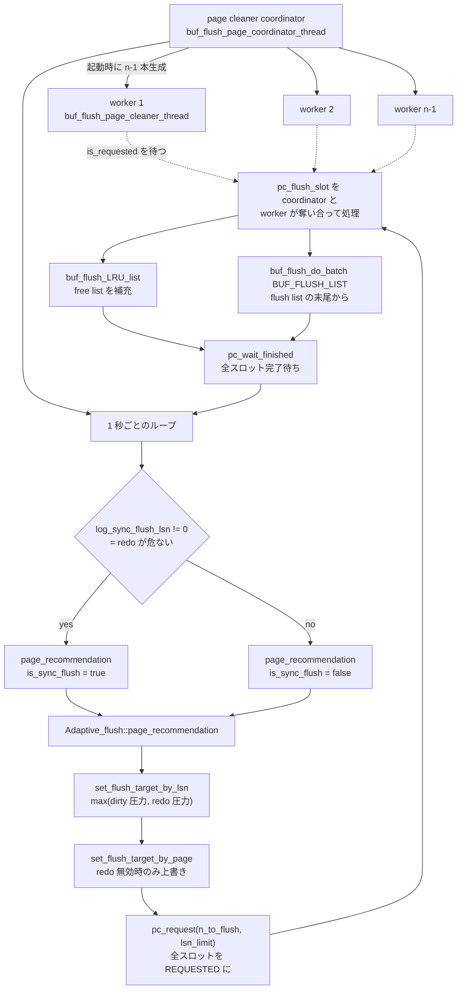

## 何を学んだか

`UPDATE` がページを書き換えたとき、ディスクに書かれるのは redo ログだけだ。**ページ本体はメモリ上で dirty のまま残り、いつ書かれるかは誰も約束していない**。この非同期性が InnoDB の書き込み性能の土台になっている。

dirty なページは `flush_list` という 1 本のリストに繋がれる。並び順は `oldest_modification` — **そのページが「前回書き出されてから最初に変更されたときの LSN」** だ。したがって**リストの末尾が、プール全体で最も古い変更**を持つ。この末尾の LSN が、チェックポイントの上限を決める材料になる ([チェックポイントのページ](./checkpoint/))。

ただしこの順序は**厳密ではない**。ソースは自ら `We have a relaxed order in flush list` と書いていて、保証されているのは「先に追加されたページの `oldest_modification` は、全 dirty ページの最小値より、`recent_closed` のスロット数を超えては大きくならない」という緩い形だ。理由と、その緩さをチェックポイント側がどう吸収しているかは後述する。

書き出すのは専任の **page cleaner** スレッド群だ。1 本の coordinator と `innodb_page_cleaners - 1` 本の worker からなり、バッファプールインスタンス 1 つに 1 スロットを割り当てて並列に流す。

毎秒の書き出し枚数の決め方が **adaptive flushing** で、8.4 での実体は `Adaptive_flush` 名前空間の `set_flush_target_by_lsn` だ。**`page_cleaner_flush_pages_recommendation` という関数は 8.4 には存在しない**。8.0 時代のブログ記事や書籍がこの名前で説明していることがあるが、コードは `Adaptive_flush::page_recommendation` → `set_flush_target_by_lsn` + `set_flush_target_by_page` に再編されている。

決め方は 2 つの圧力の `max` を取る。

- **dirty 比率の圧力** (`get_pct_for_dirty`) — dirty ページの割合が `innodb_max_dirty_pages_pct_lwm` を超えたら比例して上げる
- **redo の圧力** (`get_pct_for_lsn`) — チェックポイント年齢 (`age`) が redo 容量に対して深くなるほど、3/2 乗で急激に上げる

そして「1 回に出せる上限」が **`innodb_io_capacity_max × 2`** で、ここに `srv_max_io_capacity` そのものによる別のキャップも重なる。

書き出し先が LRU か flush list かで意味が違うのも押さえておく。

- **LRU flush** — LRU の末尾から dirty ページを書いて free list を補充する。**目的は空きブロックの確保**
- **flush list flush** — flush list の末尾から古い順に書く。**目的はチェックポイントを進めること**

page cleaner は毎周期この 2 つを両方やる。

## ソースコードのどこか

### flush list への登録

[`buf_flush_insert_into_flush_list` (`buf0flu.cc#L504`)](https://github.com/mysql/mysql-server/blob/mysql-8.4.11/storage/innobase/buf/buf0flu.cc#L504) が呼ばれるのは、mtr がコミットしてページを dirty にした瞬間だけだ。

```cpp title="storage/innobase/buf/buf0flu.cc"
  ut_ad(UT_LIST_GET_FIRST(buf_pool->flush_list) == nullptr ||
        buf_flush_list_order_validate(
            UT_LIST_GET_FIRST(buf_pool->flush_list)->get_oldest_lsn(), lsn));

  block->page.set_oldest_lsn(lsn);

  UT_LIST_ADD_FIRST(buf_pool->flush_list, &block->page);
```

**常に先頭に追加する**。LSN はおおむね単調増加するので、これだけで「先頭が新しく、末尾が古い」並びがだいたい保たれる。ソートも二分探索もいらない。

「だいたい」なのは、mtr が redo をログバッファに置く段と dirty page を flush list に載せる段が別だからだ。LSN を先に取った mtr が flush list への登録で追い越されることがある。そのずれ幅の上限が `recent_closed` の容量で、`buf_flush_validate_skip` 系の assert はこの緩い順序を前提に書かれている ([mini-transaction のページ](./mini-transaction/))。手前の `ut_ad(!block->page.in_flush_list)` が、**すでに dirty なページは二度登録されない**ことを保証している。つまり `oldest_modification` は「最初の変更の LSN」であり、その後何度書き換えても更新されない。

例外はリカバリ中だけで、`flush_rbt` (赤黒木) がある場合は `buf_flush_insert_sorted_into_flush_list` に回る。redo を適用する順序は LSN 順とは限らないからだ ([クラッシュリカバリ](./crash-recovery/))。

### 2 つの圧力

**dirty 比率** — [`get_pct_for_dirty` (L2424)](https://github.com/mysql/mysql-server/blob/mysql-8.4.11/storage/innobase/buf/buf0flu.cc#L2424)。

```cpp title="storage/innobase/buf/buf0flu.cc"
ulint get_pct_for_dirty() {
  double dirty_pct = buf_get_modified_ratio_pct();

  if (dirty_pct == 0.0) {
    /* No pages modified */
    return (0);
  }

  ut_a(srv_max_dirty_pages_pct_lwm <= srv_max_buf_pool_modified_pct);

  if (srv_max_dirty_pages_pct_lwm == 0) {
    /* The user has not set the option to preflush dirty
    pages as we approach the high water mark. */
    if (dirty_pct >= srv_max_buf_pool_modified_pct) {
      /* We have crossed the high water mark of dirty
      pages In this case we start flushing at 100% of
      innodb_io_capacity. */
      return (100);
    }
  } else if (dirty_pct >= srv_max_dirty_pages_pct_lwm) {
    /* We should start flushing pages gradually. */
    return (static_cast<ulint>((dirty_pct * 100) /
                               (srv_max_buf_pool_modified_pct + 1)));
  }

  return (0);
}
```

`srv_max_buf_pool_modified_pct` が `innodb_max_dirty_pages_pct` (既定 90.0)、`srv_max_dirty_pages_pct_lwm` が `innodb_max_dirty_pages_pct_lwm` (既定 10) だ ([`ha_innodb.cc#L22382`](https://github.com/mysql/mysql-server/blob/mysql-8.4.11/storage/innobase/handler/ha_innodb.cc#L22382))。**lwm を 0 にすると、90% に達するまで完全に何もしない**という段差のある挙動になる。既定の 10 では、10% を超えた時点から `dirty_pct / 91` の割合で滑らかに立ち上がる。

**redo の圧力** — [`get_pct_for_lsn` (L2454)](https://github.com/mysql/mysql-server/blob/mysql-8.4.11/storage/innobase/buf/buf0flu.cc#L2454)。

```cpp title="storage/innobase/buf/buf0flu.cc"
  double lsn_age_factor;
  lsn_t af_lwm = (srv_adaptive_flushing_lwm * limit_for_free_check) / 100;

  if (age < af_lwm) {
    /* No adaptive flushing. */
    return (0);
  }

  if (age < limit_for_dirty_page_age && !srv_adaptive_flushing) {
    /* We have still not reached the max_async point and
    the user has disabled adaptive flushing. */
    return (0);
  }
...
  lsn_age_factor = (age * 100.0) / limit_for_dirty_page_age;

  ut_ad(srv_max_io_capacity >= srv_io_capacity);

  return (static_cast<ulint>(((srv_max_io_capacity / srv_io_capacity) *
                              (lsn_age_factor * sqrt(lsn_age_factor))) /
                             7.5));
```

`lsn_age_factor * sqrt(lsn_age_factor)` は **年齢の 3/2 乗**だ。年齢が 2 倍になると圧力は 2.83 倍になる。**redo が埋まりかけたときに一気に踏み込む**ための非線形性で、`srv_max_io_capacity / srv_io_capacity` の比がスケール係数として掛かる。だから `innodb_io_capacity_max` を上げると「余裕があるときの控えめさ」はそのままに「緊急時の踏み込み」だけが強くなる。

`srv_adaptive_flushing_lwm` は `innodb_adaptive_flushing_lwm` (既定 10)、`srv_adaptive_flushing` は `innodb_adaptive_flushing` (既定 ON)。**`innodb_adaptive_flushing = OFF` にしても、redo の危険水域 (`limit_for_dirty_page_age`) を超えたら結局この式が効く**。無効化できるのは「余裕があるときの先回り」だけだ。

### `set_flush_target_by_lsn` — 目標枚数の決定

[`buf0flu.cc#L2497`](https://github.com/mysql/mysql-server/blob/mysql-8.4.11/storage/innobase/buf/buf0flu.cc#L2497)。冒頭で 2 つの圧力を取る。

```cpp title="storage/innobase/buf/buf0flu.cc"
  ulint pct_for_dirty = get_pct_for_dirty();
  ulint pct_for_lsn = get_pct_for_lsn(age);
  ulint pct_total = std::max(pct_for_dirty, pct_for_lsn);
```

**足すのではなく `max`** を取る。2 つは別々の理由で「どれだけ急ぐか」を表しているので、厳しいほうに従えばよい。

次に「目標 LSN までに何ページあるか」を数える。ここで上限が 2 か所出てくる。

```cpp title="storage/innobase/buf/buf0flu.cc"
  /* Cap the maximum IO capacity that we are going to use by
  max_io_capacity. Limit the value to avoid too quick increase */
  const ulint sum_pages_max = srv_max_io_capacity * 2;

  /* Limit individual BP scan based on overall capacity. */
  const ulint pages_for_lsn_max =
      (sum_pages_max / srv_buf_pool_instances) * scan_factor * 2;
```

**`srv_max_io_capacity * 2` が 1 回のラウンドで数える上限**で、それをインスタンス数で割ったものが 1 インスタンスあたりの走査上限になる。走査は flush list の末尾から前へ、`oldest_modification` が目標 LSN を超えるまで。

```cpp title="storage/innobase/buf/buf0flu.cc"
    buf_flush_list_mutex_enter(buf_pool);
    for (buf_page_t *b = UT_LIST_GET_LAST(buf_pool->flush_list); b != nullptr;
         b = UT_LIST_GET_PREV(list, b)) {
      if (b->get_oldest_lsn() > target_lsn) {
        break;
      }
      ++pages_for_lsn;
      if (pages_for_lsn >= pages_for_lsn_max) {
        break;
      }
    }
    buf_flush_list_mutex_exit(buf_pool);
```

flush list が LSN 順に並んでいるからこそ、**`break` で打ち切れる**。ソートされていなければ全走査が必要になる。

目標 LSN は sync flush でなければ「今の最古 LSN + 直近の LSN 生成レート × 3」だ。

```cpp title="storage/innobase/buf/buf0flu.cc"
    target_lsn = oldest_lsn + lsn_avg_rate * buf_flush_lsn_scan_factor;
    scan_factor = buf_flush_lsn_scan_factor;
```

`buf_flush_lsn_scan_factor = 3` ([L86](https://github.com/mysql/mysql-server/blob/mysql-8.4.11/storage/innobase/buf/buf0flu.cc#L86))。**3 秒先に必要になる分を今数えて、その 1/3 を今回出す**、という先読みになっている。

最終的な枚数は 3 つの平均だ。

```cpp title="storage/innobase/buf/buf0flu.cc"
    n_pages = (PCT_IO(pct_total) + page_avg_rate + pages_for_lsn) / 3;
    if (n_pages > srv_max_io_capacity) {
      n_pages = srv_max_io_capacity;
    }
```

- `PCT_IO(pct_total)` — 2 つの圧力から出した「io_capacity の何 %」
- `page_avg_rate` — 直近の実測書き出しレート
- `pages_for_lsn` — LSN 目標から数えた枚数

**過去の実測を混ぜているのが効いていて**、圧力が急に上がっても 1 周期では 1/3 しか反映されない。これが「too quick increase」を避けるという意図だ。最後に `srv_max_io_capacity` でクリップする。

sync flush (redo が本当に危ないとき) だけは平均を取らず、`pages_for_lsn` をそのまま使ったうえで `srv_io_capacity` を下限にする。

### page cleaner の構成



coordinator は自分自身をスロット処理の 1 人として数えるので、worker の生成は `i = 1` から始まる ([L3146](https://github.com/mysql/mysql-server/blob/mysql-8.4.11/storage/innobase/buf/buf0flu.cc#L3146))。

```cpp title="storage/innobase/buf/buf0flu.cc"
  /* We start from 1 because the coordinator thread is part of the
  same set */
  for (size_t i = 1; i < srv_threads.m_page_cleaner_workers_n; ++i) {
    srv_threads.m_page_cleaner_workers[i] = os_thread_create(
        page_flush_thread_key, i, buf_flush_page_cleaner_thread);
```

これらのスレッドが `srv0start.cc` ではなく `buf0flu.cc` 側で作られることは[スレッドモデルのページ](./thread-model/)で触れたとおりだ。

### スロットの配り方

[`pc_request` (L2830)](https://github.com/mysql/mysql-server/blob/mysql-8.4.11/storage/innobase/buf/buf0flu.cc#L2830) がインスタンス数分のスロットを全部 `REQUESTED` にする。

```cpp title="storage/innobase/buf/buf0flu.cc"
    /* slot->n_pages_requested was already set by
    Adaptive_flush::page_recommendation() */

    slot->state = PAGE_CLEANER_STATE_REQUESTED;
  }

  page_cleaner->n_slots_requested = page_cleaner->n_slots;
```

スロットごとの枚数は `set_flush_target_by_lsn` の末尾ですでに配分済みだ。ここが面白い。

```cpp title="storage/innobase/buf/buf0flu.cc"
  for (ulint i = 0; i < srv_buf_pool_instances; i++) {
    /* if REDO has enough of free space,
    don't care about age distribution of pages */
    page_cleaner->slots[i].n_pages_requested =
        pct_for_lsn > 30 ? page_cleaner->slots[i].n_pages_requested * n_pages /
                                   sum_pages_for_lsn +
                               1
                         : n_pages / srv_buf_pool_instances + 1;
  }
```

**`pct_for_lsn > 30` のときだけ、インスタンスごとの「古いページの多さ」に比例して配る**。redo に余裕があるときは単純に均等割りする。古いページが偏って溜まっているインスタンスを優先的に掃除するのは、チェックポイントが本当に詰まりかけたときだけでよい、という判断だ。

[`pc_flush_slot` (L2877)](https://github.com/mysql/mysql-server/blob/mysql-8.4.11/storage/innobase/buf/buf0flu.cc#L2877) は `REQUESTED` なスロットを 1 つ見つけて奪い、LRU flush → flush list flush の順に処理する。

```cpp title="storage/innobase/buf/buf0flu.cc"
      /* Flush pages from end of LRU if required */
      slot->n_flushed_lru = buf_flush_LRU_list(buf_pool);
...
        if (page_cleaner->requested) {
...
          slot->succeeded_list = buf_flush_do_batch(
              buf_pool, BUF_FLUSH_LIST, slot->n_pages_requested,
              page_cleaner->lsn_limit, &slot->n_flushed_list);
```

**LRU flush は `page_cleaner->requested` に関係なく毎回走る**。目標枚数がゼロでも、free list の補充だけは常に行うということだ。

worker のループは驚くほど短い ([L3548](https://github.com/mysql/mysql-server/blob/mysql-8.4.11/storage/innobase/buf/buf0flu.cc#L3548))。

```cpp title="storage/innobase/buf/buf0flu.cc"
  for (;;) {
    os_event_wait(page_cleaner->is_requested);

    ut_d(buf_flush_page_cleaner_disabled_loop());

    if (!page_cleaner->is_running) {
      break;
    }

    pc_flush_slot();
  }
```

**worker は何も判断しない。** 目標の計算も配分も coordinator が済ませてあり、worker はスロットを拾って処理するだけだ。

### 2 種類のバッチ

**LRU バッチ** — [`buf_flush_LRU_list_batch` (L1751)](https://github.com/mysql/mysql-server/blob/mysql-8.4.11/storage/innobase/buf/buf0flu.cc#L1751)。

```cpp title="storage/innobase/buf/buf0flu.cc"
  for (bpage = UT_LIST_GET_LAST(buf_pool->LRU);
       bpage != nullptr && count + evict_count < max &&
       free_len < srv_LRU_scan_depth + withdraw_depth &&
       lru_len > BUF_LRU_MIN_LEN;
       ++scanned, bpage = buf_pool->lru_hp.get()) {
```

止まる条件が 3 つある。目標枚数に達した、**free list が `innodb_lru_scan_depth` まで溜まった**、LRU が最低長を切った。**「LRU を掃除する」のが目的ではなく「free list を `lru_scan_depth` 本分保つ」のが目的**だとこの条件から読める。ループ内では clean なページは即 evict し、dirty なページだけ書き出す。

**flush list バッチ** — [`buf_do_flush_list_batch` (L1870)](https://github.com/mysql/mysql-server/blob/mysql-8.4.11/storage/innobase/buf/buf0flu.cc#L1870)。

```cpp title="storage/innobase/buf/buf0flu.cc"
  /* In order not to degenerate this scan to O(n*n) we attempt
  to preserve pointer of previous block in the flush list. To do
  so we declare it a hazard pointer. Any thread working on the
  flush list must check the hazard pointer and if it is removing
  the same block then it must reset it. */
  for (buf_page_t *bpage = UT_LIST_GET_LAST(buf_pool->flush_list);
       count < min_n && bpage != nullptr && len > 0 &&
       bpage->get_oldest_lsn() < lsn_limit;
       bpage = buf_pool->flush_hp.get(), ++scanned) {
```

**hazard pointer** は、走査中に flush list から要素が外れても位置を失わないための仕掛けだ。`buf_flush_remove` 側 ([L792](https://github.com/mysql/mysql-server/blob/mysql-8.4.11/storage/innobase/buf/buf0flu.cc#L792)) が、外そうとしている要素が hazard pointer と一致していたら 1 つ前にずらす。**mutex を持ったまま長時間走査するのを避けつつ、O(n²) にもしない**ための構造で、LRU 側の `lru_hp` も同じ仕組みだ。

### 設定値

| 変数                             | 既定                                 | 範囲                          | 定義                                                                                                                                                                                                                          |
| -------------------------------- | ------------------------------------ | ----------------------------- | ----------------------------------------------------------------------------------------------------------------------------------------------------------------------------------------------------------------------------- |
| `innodb_io_capacity`             | 10000                                | 100–SRV_MAX_IO_CAPACITY_LIMIT | [`ha_innodb.cc#L22236`](https://github.com/mysql/mysql-server/blob/mysql-8.4.11/storage/innobase/handler/ha_innodb.cc#L22236)                                                                                                 |
| `innodb_io_capacity_max`         | `clamp(2 × io_capacity, 100, LIMIT)` | 100–LIMIT                     | [L22241](https://github.com/mysql/mysql-server/blob/mysql-8.4.11/storage/innobase/handler/ha_innodb.cc#L22241) / [L4843](https://github.com/mysql/mysql-server/blob/mysql-8.4.11/storage/innobase/handler/ha_innodb.cc#L4843) |
| `innodb_max_dirty_pages_pct`     | 90.0                                 | 0–99.999                      | [L22382](https://github.com/mysql/mysql-server/blob/mysql-8.4.11/storage/innobase/handler/ha_innodb.cc#L22382)                                                                                                                |
| `innodb_max_dirty_pages_pct_lwm` | 10                                   | 0–99.999                      | [L22388](https://github.com/mysql/mysql-server/blob/mysql-8.4.11/storage/innobase/handler/ha_innodb.cc#L22388)                                                                                                                |
| `innodb_adaptive_flushing`       | ON                                   | —                             | [L22398](https://github.com/mysql/mysql-server/blob/mysql-8.4.11/storage/innobase/handler/ha_innodb.cc#L22398)                                                                                                                |
| `innodb_adaptive_flushing_lwm`   | 10                                   | 0–70                          | [L22393](https://github.com/mysql/mysql-server/blob/mysql-8.4.11/storage/innobase/handler/ha_innodb.cc#L22393)                                                                                                                |
| `innodb_page_cleaners`           | インスタンス数                       | 1–64                          | [L22376](https://github.com/mysql/mysql-server/blob/mysql-8.4.11/storage/innobase/handler/ha_innodb.cc#L22376)                                                                                                                |
| `innodb_flush_neighbors`         | 0                                    | 0–2                           | [L22690](https://github.com/mysql/mysql-server/blob/mysql-8.4.11/storage/innobase/handler/ha_innodb.cc#L22690)                                                                                                                |

**`innodb_io_capacity` の既定は 8.4 では 10000** だ。8.0 の 200 を前提にしたチューニング記事はそのまま当てはまらない。`innodb_page_cleaners` は宣言上の既定が 1 だが、起動時に `srv_buf_pool_instances` に合わせられ、インスタンス数を超える設定は切り詰められる ([`ha_innodb.cc#L5039`](https://github.com/mysql/mysql-server/blob/mysql-8.4.11/storage/innobase/handler/ha_innodb.cc#L5039))。

## なぜそうなっているか

**flush list をだいたい `oldest_modification` 順に保つのは、チェックポイントのためだ。** チェックポイント LSN は「この LSN より前の変更は全部ディスクに載っている」という保証で、その候補は flush list の末尾の `oldest_modification` から取る。**リストが LSN 順なら、末尾を見るだけで済む**。ソートされていなければ全走査が必要で、それを毎秒やることになる。追加が常に先頭で済むのは LSN がおおむね単調増加するからで、「順序付きリストを O(1) で維持する」という都合のよい性質がここで効いている。

**そして順序を厳密にしなかったのは、厳密にする代償が大きすぎるからだ。** LSN の割り当てと flush list への登録を不可分にするには、mtr のコミット全体を 1 本の latch で直列化するしかない。InnoDB はそれを避けて、代わりに「ずれ幅の上限は `recent_closed` の容量」という弱い保証で妥協した。そのぶんチェックポイント側が `buf_pool_get_oldest_modification_lwm` で **lag を引いた低位側の値**を使う。順序の緩さのコストは、チェックポイントがわずかに保守的になることだけで済んでいる ([チェックポイントのページ](./checkpoint/))。

**目標を「圧力の max」で決めるのは、2 つの制約が独立だからだ。** dirty ページが多すぎると `buf_LRU_get_free_block` が空きを見つけられなくなり、ユーザスレッドが止まる。redo が埋まると、そもそも新しい mtr がログを書けなくなって全書き込みが止まる。**どちらか一方でも危なければ書き出しを急ぐ必要がある**ので、和ではなく max になる。

**redo の圧力を 3/2 乗にしたのは、線形では間に合わないからだ。** redo が満杯になると、`log_free_check` がユーザスレッドを同期的にブロックする。これは可視の停止 (フリーズ) になる。線形に上げていくと「余裕があるうちは控えめ、危なくなってから急上昇」というカーブが作れず、平時から書きすぎるか、危険時に踏み込みが足りないかのどちらかになる。**3/2 乗は「平時はほぼゼロ、危険域で一気に立つ」という形を作るための指数**で、`/ 7.5` がその立ち上がり位置の調整になっている。

**1 回の上限を `io_capacity_max × 2` にしているのは、走査コストの上限を決めるためだ。** `sum_pages_max` は「実際に書く枚数」の上限ではなく、まず **flush list を何ページ分数えるか**の上限として使われる。flush list の走査は `flush_list_mutex` を持って行うので、無制限に長くすると他のスレッドの dirty 化がブロックされる。`× 2` は「max_io_capacity 分は確実に見つけたいが、その 2 倍以上は見ない」という妥協点だ。

**page cleaner をインスタンス数だけのスロットに分けたのは、mutex を分けた意味を活かすためだ。** インスタンスごとに `flush_list_mutex` が別なので、別々のスレッドが別々のインスタンスを掃除すれば競合しない。coordinator が目標だけ決めて worker は判断しない設計 (`pc_flush_slot` を全員で奪い合う) は、**「どの worker がどのインスタンスを担当するか」を固定しない**ので、遅いインスタンスがあっても他の worker が先に進める。

**LRU flush を毎回無条件で走らせるのは、free list の枯渇がユーザスレッドを直接止めるからだ。** flush list flush が遅れてもチェックポイントが遅れるだけだが、free list が空になると `buf_LRU_get_free_block` の中でユーザスレッドが LRU を走査し始める ([LRU のページ](./lru-and-midpoint/))。この 2 つは緊急度が違う。

**`innodb_flush_neighbors` の既定が 0 になったのは、SSD が前提になったからだ。** 隣接ページをまとめて書くのは、HDD でシークを減らすための最適化だった。SSD では単に余計な書き込みが増えるだけで、書き込み増幅も悪化する。

## どう活かすか

**チェックポイントが追いつかない症状は、`SHOW ENGINE INNODB STATUS` の LOG セクションで見る。** `Log sequence number` と `Last checkpoint at` の差が「チェックポイント年齢」で、これが redo 容量 (`innodb_redo_log_capacity`) に対して大きいほど `get_pct_for_lsn` の圧力が高い。**この差が縮まらないまま張り付いていたら、page cleaner が書き出しレートで負けている**。

**`Page cleaner took NNNNms to flush X and evict Y pages` がエラーログに出る。** [L3250](https://github.com/mysql/mysql-server/blob/mysql-8.4.11/storage/innobase/buf/buf0flu.cc#L3250) で、1 周に 4 秒以上かかったときだけ出る。

```cpp title="storage/innobase/buf/buf0flu.cc"
      if (curr_time > loop_start_time + std::chrono::seconds{4}) {
        if (warn_count == 0) {
...
          ib::info(ER_IB_MSG_128)
              << "Page cleaner took " << diff_ms.count() << "ms to flush "
              << n_flushed_last << " and evict " << n_evicted << " pages";
```

**このメッセージは「1 秒で終わるはずの周期が 4 秒かかった」という意味**で、ほぼ確実にディスクの書き込み待ちだ。警告間隔は倍々で伸びるので、出る頻度が下がったからといって解消したとは限らない。

**`innodb_io_capacity` を上げる前に、実際にどれだけ書けているかを見る。** `SHOW ENGINE INNODB STATUS` の BUFFER POOL AND MEMORY にある `%.2f writes/s` が実測レートだ。これが `innodb_io_capacity` にまったく届いていないなら、設定値ではなくディスクが上限になっている。8.4 の既定 10000 はすでに NVMe を想定した値なので、**上げる方向のチューニングが効くケースは 8.0 のときより減っている**。

**`innodb_max_dirty_pages_pct_lwm = 0` は避ける。** 0 にすると 90% を超えるまで dirty 圧力がゼロのままで、超えた瞬間に 100% になる。この段差はレイテンシのスパイクとして観測される。既定の 10 のままにして、滑らかに立ち上げさせるほうがよい。

**`Innodb_buffer_pool_pages_dirty` / `Innodb_buffer_pool_pages_total` の比を監視する。** これが `innodb_max_dirty_pages_pct` に張り付いているなら、書き込みワークロードに対して書き出しが追いついていない。`Innodb_data_pending_writes` と `Innodb_os_log_pending_fsyncs` を並べて、詰まっているのがデータファイルか redo かを分ける。

**`innodb_page_cleaners` を増やすのは、インスタンス数を増やしたときだけ。** インスタンス数を超える設定は起動時に切り詰められるので、`innodb_buffer_pool_instances = 1` の環境で `innodb_page_cleaners = 8` と書いても 1 になる。**プールが 1GB 未満だとインスタンスが強制的に 1 になる**ので、開発環境では page cleaner も 1 本だ ([バッファプールのページ](./buffer-pool-walkthrough/))。

**`Difficult to find free blocks` (LRU 側の警告) と `Page cleaner took NNNNms` (flush 側) は、同じ根の別症状であることが多い。** 前者は free list の枯渇、後者は書き出しの遅延で、書き出しが遅れれば dirty ページが evict できず free list も枯れる。**両方出ているならディスクを疑い、前者だけなら `innodb_lru_scan_depth` を、後者だけなら redo 容量を見る**。

**8.0 のチューニング記事を読むときは名前を確認する。** `page_cleaner_flush_pages_recommendation` は 8.4 に存在しない。同様に、`innodb_io_capacity` の既定 200、`innodb_flush_neighbors` の既定 1、`innodb_page_cleaners` の既定 4 は全部 8.4 では違う。**現象の説明としては今も正しいが、確認するコードと値は変わっている**。
