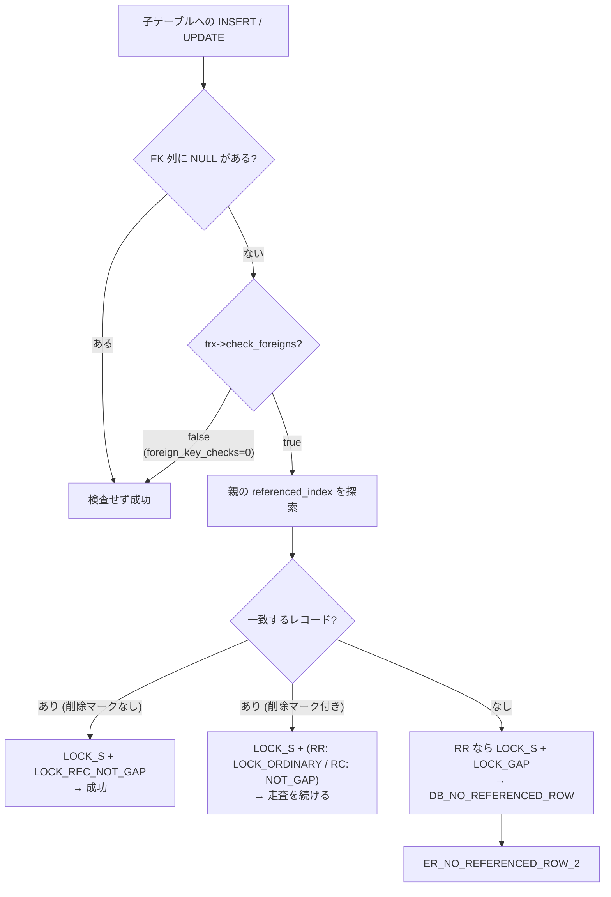

> **前提**: [ロックの種類](./lock-modes-and-types/) / [RR と RC の違い](./locking-in-rr-vs-rc/) / [データディクショナリ](./data-dictionary/)

## 何を学んだか

外部キーは「`INSERT` のときに親を `SELECT` して確認する」機能ではない。**検査は InnoDB の中で行われ、確認した親行にロックが載る。**

```cpp title="storage/innobase/row/row0ins.cc"
      } else {
        /* Found a matching record. Lock only
        a record because we can allow inserts
        into gaps */

        err = row_ins_set_rec_lock(LOCK_S, LOCK_REC_NOT_GAP, block, rec,
                                   check_index, offsets, thr);
```

[`storage/innobase/row/row0ins.cc#L1648`](https://github.com/mysql/mysql-server/blob/mysql-8.4.11/storage/innobase/row/row0ins.cc#L1648)。子テーブルに 1 行入れるだけで、親テーブルの 1 行に共有ロックが取られる。

分かることを並べる。

- **子への `INSERT` は親行に `LOCK_S` を載せる。** その親行を `UPDATE` しようとする別トランザクションは待たされる
- **親が見つかったときはギャップを取らない。** RR でも `LOCK_REC_NOT_GAP` になる
- **親が見つからないときは `LOCK_GAP` を取ってからエラーを返す。** 「いない」という判断を commit まで守るため
- **RC では検査自体がギャップを飛ばす。** 分離レベルが FK の検査の粒度も変える
- **`CASCADE` は InnoDB の中で完結する。** 最大 15 段、循環する `UPDATE` は拒否される
- **FK 列が `NULL` なら検査ごと飛ばす**



## なぜそうなっているか

**親行にロックを取るのは、検査結果を commit まで守るためだ。** 「親が存在することを確認した」直後に別トランザクションがその親を消せば、commit した時点で制約が壊れている。共有ロックを取れば、親の削除・更新はこのトランザクションが終わるまで待つ。これは 2 相ロックの素直な適用になる ([コミットとロールバックの内部](./commit-and-rollback-internals/))。

**一致したときにギャップを取らないのは、隣のギャップが制約に関係ないからだ。** 親 `id = 5` が存在することさえ守れればよく、`id = 4` と `id = 5` の間に誰かが `id = 4.5` を入れても制約は壊れない。ソースのコメントが `we can allow inserts into gaps` と書いているのはこの意味だ。

**一致しなかったときにギャップを取るのは、「いない」を守るためだ。** 存在しないことを根拠にエラーを返すなら、その隙間に親が入ってこないことを保証しなければ、同じトランザクション内で判断が揺れる。**存在の否定はギャップロックでしか守れない**という、ファントム防止の一般則がそのまま出ている。

**`CASCADE` を InnoDB 内で完結させたのは、ロック文脈を持ち回るためだ。** 親を削除しながら子を削除するには、親の削除に使っているカーソルとロックを保ったまま別テーブルを更新する必要がある。SQL 層に戻ると `handler` の呼び出し境界をまたぐことになり、この文脈を渡せない ([handler](./handler-walkthrough/))。代償として、**カスケードされた変更は SQL 層を通らない**。

**深さ制限があるのは、再帰がスタックを食うからだ。** ヘッダのコメントが理由をそのまま書いている。

## ソースコードのどこか

### 検査の入口 — `row_ins_check_foreign_constraint`

```cpp title="storage/innobase/row/row0ins.cc"
  /* GAP locks are not needed on DD tables because serializability between
  different DDL statements is achieved using metadata locks. So no concurrent
  changes to DD tables when MDL is taken. */
  skip_gap_lock = (trx->isolation_level <= TRX_ISO_READ_COMMITTED) ||
                  table->skip_gap_locks();
  ...
  if (trx->check_foreigns == false) {
    /* The user has suppressed foreign key checks currently for
    this session */
    goto exit_func;
  }

  /* If any of the foreign key fields in entry is SQL NULL, we
  suppress the foreign key check: this is compatible with Oracle,
  for example */
  for (ulint i = 0; i < foreign->n_fields; i++) {
    if (dfield_is_null(dtuple_get_nth_field(entry, i))) {
      goto exit_func;
    }
  }
```

[`storage/innobase/row/row0ins.cc#L1415`](https://github.com/mysql/mysql-server/blob/mysql-8.4.11/storage/innobase/row/row0ins.cc#L1415)。関数の冒頭で 3 つの早期脱出が決まる。

**`skip_gap_lock` が分離レベルを見ている**のがここでの要点になる。RC 以下ならギャップロックを取らない。[RR と RC の違い](./locking-in-rr-vs-rc/)のページで挙げた 4 述語とは別に、FK 検査は自前でこの判定を持っている。

**`NULL` を含む行は検査を素通りする。** 複合外部キーで 1 列でも `NULL` なら通る (MATCH SIMPLE の意味論)。「親がいないのに子が入っている」という状態は、この経路で正当に作られる。

### ロックの 4 分岐

走査中の各レコードで、状況に応じて 4 通りのロックが取られる。

```cpp title="storage/innobase/row/row0ins.cc"
    if (page_rec_is_supremum(rec)) {
      if (skip_gap_lock) {
        continue;
      }

      err = row_ins_set_rec_lock(LOCK_S, LOCK_ORDINARY, block, rec, check_index,
                                 offsets, thr);
```

[`row0ins.cc#L1615`](https://github.com/mysql/mysql-server/blob/mysql-8.4.11/storage/innobase/row/row0ins.cc#L1615)。ページ末尾の番人レコードまで来たら、その先のギャップを next-key で押さえる ([ページの構造](./page-layout/))。

```cpp title="storage/innobase/row/row0ins.cc"
    if (cmp == 0) {
      ulint lock_type;

      lock_type = skip_gap_lock ? LOCK_REC_NOT_GAP : LOCK_ORDINARY;

      if (rec_get_deleted_flag(rec, rec_offs_comp(offsets))) {
        err = row_ins_set_rec_lock(LOCK_S, lock_type, block, rec, check_index,
                                   offsets, thr);
```

[`row0ins.cc#L1626`](https://github.com/mysql/mysql-server/blob/mysql-8.4.11/storage/innobase/row/row0ins.cc#L1626)。**削除マークの付いた親レコードに当たったときだけ、RR では next-key を取る。** purge がまだ消していない削除済みレコードは「もう存在しない」ので、そのギャップを押さえないと後から入り込まれる ([purge](./purge/))。

一致して生きていれば `LOCK_REC_NOT_GAP`、一致しなければ `LOCK_GAP` になる。

```cpp title="storage/innobase/row/row0ins.cc"
      if (!skip_gap_lock) {
        err = row_ins_set_rec_lock(LOCK_S, LOCK_GAP, block, rec, check_index,
                                   offsets, thr);
      }

      switch (err) {
        ...
          if (check_ref) {
            err = DB_NO_REFERENCED_ROW;
```

[`row0ins.cc#L1708`](https://github.com/mysql/mysql-server/blob/mysql-8.4.11/storage/innobase/row/row0ins.cc#L1708)。**ロックを取ってからエラーを返している**点に注意する。エラーになった `INSERT` も、ギャップロックを 1 本残す。

### カスケードの上限

```cpp title="storage/innobase/include/dict0mem.h"
/** Similarly, when tables are chained together with foreign key constraints
with on cascading delete/update clause, delete from parent table could
result in recursive cascading calls. This defines the maximum number of
such cascading deletes/updates allowed. When exceeded, the delete from
parent table will fail, and user has to drop excessive foreign constraint
before proceeds. */
constexpr uint32_t FK_MAX_CASCADE_DEL = 15;
```

[`storage/innobase/include/dict0mem.h#L318`](https://github.com/mysql/mysql-server/blob/mysql-8.4.11/storage/innobase/include/dict0mem.h#L318)。超えると `ER_FK_DEPTH_EXCEEDED` になる ([`ha_innodb.cc#L2093`](https://github.com/mysql/mysql-server/blob/mysql-8.4.11/storage/innobase/handler/ha_innodb.cc#L2093))。

同じヘッダに、テーブルを開くときの再帰読み込み上限も並んでいる。

```cpp title="storage/innobase/include/dict0mem.h"
constexpr uint32_t DICT_FK_MAX_RECURSIVE_LOAD = 20;
```

[`dict0mem.h#L310`](https://github.com/mysql/mysql-server/blob/mysql-8.4.11/storage/innobase/include/dict0mem.h#L310)。**親テーブルを開くと、その子孫が芋づる式に開かれる。** 20 段で打ち切られ、打ち切られた子は FK 検査が必要になった時点で読み込まれる。FK で密に繋がったスキーマでは、1 テーブルを触るだけで辞書に大量のテーブルが載る。

循環する `UPDATE` は明示的に拒否される。

```cpp title="storage/innobase/row/row0ins.cc"
  /* We do not allow cyclic cascaded updating (DELETE is allowed,
  but not UPDATE) of the same table, as this can lead to an infinite
  cycle. ... */

  if (!cascade->is_delete &&
      row_ins_cascade_ancestor_updates_table(cascade, table)) {
```

[`row_ins_foreign_check_on_constraint` (`row0ins.cc#L1010`)](https://github.com/mysql/mysql-server/blob/mysql-8.4.11/storage/innobase/row/row0ins.cc#L1010)。**`ON DELETE CASCADE` の循環は許され、`ON UPDATE CASCADE` の循環は許されない**という非対称がここにある。

### 定義の置き場所 — DD と InnoDB の辞書

SQL 層から見た定義は DD にある ([`sql/dd/types/foreign_key.h#L47`](https://github.com/mysql/mysql-server/blob/mysql-8.4.11/sql/dd/types/foreign_key.h#L47))。InnoDB は別に自分の構造体を持つ。

```cpp title="storage/innobase/include/dict0mem.h"
struct dict_foreign_t {
  ...
  dict_index_t *foreign_index;       /*!< foreign index; we require that
                                     both tables contain explicitly defined
                                     indexes for the constraint: InnoDB
                                     does not generate new indexes
                                     implicitly */
  dict_index_t *referenced_index;    /*!< referenced index */
```

[`storage/innobase/include/dict0mem.h#L1666`](https://github.com/mysql/mysql-server/blob/mysql-8.4.11/storage/innobase/include/dict0mem.h#L1666)。**InnoDB は索引を勝手に作らない**とコメントが宣言している。では子側に索引がないとき誰が作るのかというと、SQL 層だ。

```cpp title="sql/sql_table.cc"
    if (supporting_key == nullptr) {
      /*
        Since we always add generated supporting key when adding new
        foreign key the failure to find key above is likely to mean
        that generated key was auto-converted to spatial key or it is
        some other corner case.
      */
      my_error(ER_FK_NO_INDEX_CHILD, MYF(0), fk_info->name, table_name);
```

[`prepare_foreign_key` (`sql/sql_table.cc#L6759`)](https://github.com/mysql/mysql-server/blob/mysql-8.4.11/sql/sql_table.cc#L6759)。`we always add generated supporting key` — **外部キーを足すと子側に索引が自動で作られる**。名前を付けずに `FOREIGN KEY (user_id) REFERENCES users(id)` と書くと、`user_id` の索引が黙って増える。

### `foreign_key_checks` は binlog に載る

```cpp title="sql/sys_vars.cc"
static Sys_var_bit Sys_foreign_key_checks(
    "foreign_key_checks", "foreign_key_checks",
    HINT_UPDATEABLE SESSION_VAR(option_bits), NO_CMD_LINE,
    REVERSE(OPTION_NO_FOREIGN_KEY_CHECKS), DEFAULT(true), NO_MUTEX_GUARD,
    IN_BINLOG);
```

[`sql/sys_vars.cc#L5370`](https://github.com/mysql/mysql-server/blob/mysql-8.4.11/sql/sys_vars.cc#L5370)。`IN_BINLOG` が付いているので、**この変数の値はイベントと一緒にレプリカへ伝わる**。`SET foreign_key_checks = 0` して流した変更は、レプリカでも検査なしで適用される。そうでなければ、ソースで通った投入がレプリカで失敗してレプリケーションが止まる。

`REVERSE(OPTION_NO_FOREIGN_KEY_CHECKS)` とあるように、内部では「検査しない」フラグとして持たれている。InnoDB 側で読み替えるのがここだ ([`ha_innodb.cc#L2749`](https://github.com/mysql/mysql-server/blob/mysql-8.4.11/storage/innobase/handler/ha_innodb.cc#L2749))。

```cpp title="storage/innobase/handler/ha_innodb.cc"
  trx->check_foreigns = !thd_test_options(thd, OPTION_NO_FOREIGN_KEY_CHECKS);
```

## どう活かすか

### 親行の更新が、子への `INSERT` で止まる

`orders` に行を入れると `users` の該当行に共有ロックが載る。同じユーザの行を `UPDATE users SET last_login = NOW() WHERE id = 5` で更新するトランザクションは、この共有ロックと衝突して待つ。

**「参照されているだけの親テーブルが、書き込みのホットスポットになる」**という現象がこれだ。ユーザ単位で注文が並列に入る設計では、注文を入れるたびに同じユーザ行に S ロックが集まる。X ロックを取る更新が 1 本混ざると、そこで直列化する。

対策は 2 通りある。

- **親行の更新頻度を下げる。** `last_login` のような頻繁に更新する列を親テーブルから分離する
- **外部キーを張らない。** 参照整合性をアプリ側で保証する

後者は一般に勧められる話ではないが、**外部キーのコストが「制約の検査」ではなく「親行へのロック」であることを理解した上での判断**なら成立する。

### `S` ロックと `X` ロックが混ざるとデッドロックしやすい

子への `INSERT` は親に S、親への `UPDATE` は親に X を取る。2 つのトランザクションが逆順に触ると典型的なデッドロックになる。

```
trx1: INSERT INTO orders (user_id) VALUES (5)   -- users(5) に S
trx2: UPDATE users SET ... WHERE id = 5          -- users(5) に X を待つ
trx1: UPDATE users SET ... WHERE id = 5          -- 自分の S を X に上げようとして待つ → デッドロック
```

`SHOW ENGINE INNODB STATUS` の `LATEST DETECTED DEADLOCK` で、片方が `lock mode S` で `orders` ではなく `users` を待っているように見えたら、外部キー検査のロックを疑う ([デッドロック検出](./deadlock-detection/))。

### `CASCADE` はトリガも監査ログも通らない

カスケードされた削除・更新は InnoDB の中で完結する。SQL 層に戻らないということは、

- **子テーブルの `BEFORE DELETE` / `AFTER DELETE` トリガが起動しない** ([トリガとストアドプログラム](./triggers-and-stored-programs/))
- **子テーブルの変更が `handler::delete_row` を通らない**

ということになる。トリガで監査ログを取っている設計では、`ON DELETE CASCADE` で消えた行が記録から漏れる。子を明示的に `DELETE` してから親を消す形にすれば通る。

### `INSERT IGNORE` は外部キー違反も黙らせる

[sql_mode と厳格モード](./sql-mode-and-strict/)で見たとおり、`Ignore_error_handler` の対象に `ER_NO_REFERENCED_ROW_2` と `ER_ROW_IS_REFERENCED_2` が入っている。`INSERT IGNORE` で流し込むと、**親のいない行が黙ってスキップされる**。件数が合わないのに成功して見えるのはこの経路だ。

### `foreign_key_checks = 0` で入れたデータは検証されない

一括ロードのために検査を切るのは定石だが、切っている間に入った不整合は**後から自動では検出されない**。`foreign_key_checks` を戻しても既存行は再検査されない。整合性を確認するには `LEFT JOIN ... WHERE parent.id IS NULL` のようなクエリを自分で流す必要がある。

### 一般化して持ち帰るもの

**「存在の確認」には対象へのロックが要り、「不在の確認」には範囲へのロックが要る**というのが、この検査の 4 分岐から読み取れる一般則だ。値が 1 個あることを守るのは record lock で足りるが、値が 1 個もないことを守るには、入ってくる余地のある範囲全体を押さえるしかない。自前で「なければ作る」を実装するときにも同じ非対称が出る。

もう 1 つは、**層をまたがないことの代償**だ。カスケードを InnoDB 内で完結させたおかげでロック文脈は保てたが、その代わりに SQL 層の機能 (トリガ、行イベントの生成) が全部飛ぶ。性能のために層を貫通させると、その層が提供していた横断的な機能が静かに失われる。
