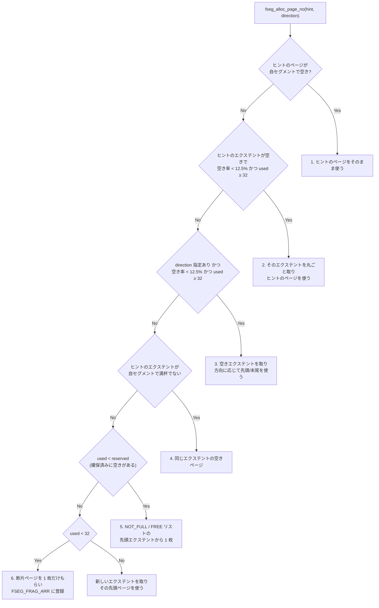

> **前提**: [物理構造 — テーブルスペース → エクステント → ページ → レコード](./innodb-physical-walkthrough/) / [ページの構造](./page-layout/)

## 何を学んだか

`.ibd` は「必要になったページを 1 枚ずつ足していくファイル」ではない。**割り当ての単位が 3 段ある。**

| 単位                      | 大きさ (16KB ページ)           | 誰が持つか                             |
| ------------------------- | ------------------------------ | -------------------------------------- |
| 断片ページ (fragment)     | 1 ページ                       | テーブルスペース共通のフラグメント領域 |
| エクステント (extent)     | 64 ページ = 1MB                | セグメント、またはフラグメントリスト   |
| セグメント (file segment) | エクステントと断片ページの集合 | B+tree の葉、B+tree の非葉、undo など  |

そして**この 3 段を切り替える境界は定数 1 つで決まる**。

```cpp title="storage/innobase/include/fsp0fsp.h (L218, L248)"
#define FSEG_FRAG_ARR_N_SLOTS (FSP_EXTENT_SIZE / 2)
...
#define FSEG_FRAG_LIMIT FSEG_FRAG_ARR_N_SLOTS
```

16KB ページなら `FSP_EXTENT_SIZE` は 64 なので、**`FSEG_FRAG_LIMIT` は 32** だ。つまり、

- セグメントが使っているページが 32 枚未満のうちは、**1 ページずつ**テーブルスペースの断片領域からもらう
- 32 枚に達したら、以降は**エクステント (1MB) 単位**で借りる

ここから実務で見る現象がそのまま出てくる。**小さいテーブルの `.ibd` は数十 KB〜100KB 台で止まり、育ったテーブルは 1MB (やがて 4MB) 刻みで太る。** 行を 100 行足しただけでファイルが 1MB 増えるのは、バグでも設定ミスでもなくこの設計だ。

もう 1 つ、テーブル 1 つに対してセグメントは 1 本ではない。**インデックス 1 本につき 2 本**ある。

```cpp title="storage/innobase/btr/btr0btr.cc (L893, L915)"
    block = fseg_create(space, 0, PAGE_HEADER + PAGE_BTR_SEG_TOP, mtr);
...
    if (!fseg_create(space, page_no, PAGE_HEADER + PAGE_BTR_SEG_LEAF, mtr)) {
```

葉ページ用 (`PAGE_BTR_SEG_LEAF`) と非葉ページ用 (`PAGE_BTR_SEG_TOP`) が別セグメントになっている。**セカンダリインデックスが 3 本あるテーブルなら、クラスタードインデックスと合わせて 8 本のセグメントが 1 つの `.ibd` に同居する。**

```
.ibd の先頭 (16KB ページ、page 0 から)

  page 0   FSP_HDR    テーブルスペースヘッダ + 最初の 256 エクステント分の XDES
  page 1   IBUF_BITMAP change buffer 用のビットマップ
  page 2   INODE      セグメント記述子 (fseg inode) の置き場
  page 3.. INDEX      B+tree のルート、葉、...

  以降 16384 ページ (256MB) ごとに XDES ページと IBUF_BITMAP ページが再び現れる
```

```cpp title="storage/innobase/include/fsp0types.h (L154-160)"
/** extent descriptor */
constexpr uint32_t FSP_XDES_OFFSET = 0;
/** insert buffer bitmap; The ibuf bitmap pages are the ones whose page number
is the number above plus a multiple of XDES_DESCRIBED_PER_PAGE */
constexpr uint32_t FSP_IBUF_BITMAP_OFFSET = 1;
/** in every tablespace */
constexpr uint32_t FSP_FIRST_INODE_PAGE_NO = 2;
```

## なぜそうなっているか

### なぜ最初の 32 ページだけ 1 枚ずつなのか

エクステント単位だけで割り当てると、**1 行しか入っていないテーブルが 1MB を占める**。MySQL は「テーブルが数千個ある」スキーマが普通に存在する世界なので、それは通らない。

かといって最後まで 1 枚ずつ配ると、B+tree の葉が `.ibd` 全体に散らばる。全表スキャンや範囲スキャンは葉を論理順に辿るので、散らばると 1 ページごとにランダム I/O になる。**エクステント単位の割り当ては「連続した 64 ページ」を保証するための仕組み**であって、単なる管理の粗さではない。

32 という数は `FSP_EXTENT_SIZE / 2`、つまり**エクステント半分**だ。「半分埋まるまで様子を見て、それを超えたら本気で伸びるテーブルとみなす」という賭けになっている。この 32 という上限が、そのままセグメント記述子の中の断片ページ配列のスロット数でもある。

```cpp title="storage/innobase/include/fsp0fsp.h (L214-218)"
/** array of individual pages belonging to this segment in fsp fragment extent
 lists */
constexpr uint32_t FSEG_FRAG_ARR = 16 + 3 * FLST_BASE_NODE_SIZE;
/* number of slots in the array for the fragment pages */
#define FSEG_FRAG_ARR_N_SLOTS (FSP_EXTENT_SIZE / 2)
```

**配列が 32 個しかないから 32 枚までしか断片ページを持てない**、という実装の都合と、「小さいテーブルは小さく」という設計意図が同じ数で表現されている。

### なぜ葉と非葉でセグメントを分けるのか

範囲スキャンが触るのは葉だけだ。非葉 (内部ノード) は探索のときにしか読まない。両者を同じセグメントに混ぜると、**葉の連続性が非葉ページによって分断される**。分けておけば、葉セグメントのエクステントの中は葉だけが並ぶ。

### なぜ空きがあるのに「予約」するのか

B+tree の悲観挿入 ([B+tree の操作](./btree-operations/)) は、途中でページ分割が起きたときに**新しいページを必ず取れないと木が壊れる**。取れなかったから戻る、では済まない。そこで InnoDB は、操作を始める前にエクステントを予約する。

```cpp title="storage/innobase/fsp/fsp0fsp.cc (L3219-3229)"
  switch (alloc_type) {
    case FSP_NORMAL:
      /* We reserve 1 extent + 0.5 % of the space size to undo logs
      and 1 extent + 0.5 % to cleaning operations; NOTE: this source
      code is duplicated in the function below! */

      reserve = 2 + ((size / FSP_EXTENT_SIZE) * 2) / 200;

      if (n_free <= reserve + n_ext) {
        goto try_to_extend;
      }
```

通常の DML (`FSP_NORMAL`) は、**2 エクステント + テーブルスペースの 1%** を undo と purge のために空けたまま扱う。空きがそこまで減ったらファイルを拡張する。`FSP_UNDO` は 1 エクステント + 0.5%、purge (`FSP_CLEANING`) と BLOB 書き込み (`FSP_BLOB`) は予約なしで最後の空きまで使える。

**purge が最後の空きを使えるのは重要だ。** ディスクが逼迫したときに purge まで止まると、undo が減らず永久に回復しなくなる。

### なぜセグメントは 12.5% の空きを持ちたがるのか

割り当ての分岐に、こういう条件が 2 か所出てくる。

```cpp title="storage/innobase/fsp/fsp0fsp.cc (L2801-2803)"
  if (xdes_get_state(descr, mtr) == XDES_FREE &&
      reserved - used < reserved * (fseg_reserve_pct / 100) &&
      used >= FSEG_FRAG_LIMIT) {
```

`fseg_reserve_pct` の既定は 12.50 で、`innodb_segment_reserve_factor` で変えられる (最小 0.03、最大 40.00)。

```cpp title="storage/innobase/include/fsp0fsp.h (L244-246)"
constexpr double FSEG_RESERVE_PCT_DFLT = 12.50;
constexpr double FSEG_RESERVE_PCT_MIN = 0.03;
constexpr double FSEG_RESERVE_PCT_MAX = 40.00;
```

意味は「**このセグメントが確保済みのページのうち、空きが 12.5% を切ったら新しいエクステントを取る**」だ。使い切ってから足すのではなく、切れる前に足す。ページ分割のたびにエクステント確保 (= テーブルスペースヘッダの排他ラッチ) が走ると、書き込みが集中したときに詰まるからだ。

裏返すと、**育っているテーブルは常に 12.5% 前後の未使用ページを内側に抱えている**。`SHOW TABLE STATUS` の `Data_length` にはこの未使用ページも含まれる。

## ソースコードのどこか

### テーブルスペースヘッダ (page 0)

```
FSP_HDR ページ (page 0) の 38 バイト目から

 + 0  FSP_SPACE_ID          4  テーブルスペース ID
 + 4  FSP_NOT_USED          4  (未使用)
 + 8  FSP_SIZE              4  現在のページ数
 +12  FSP_FREE_LIMIT        4  この番号以上のページは「まだ初期化していない = 空き」
 +16  FSP_SPACE_FLAGS       4  ページサイズ、行フォーマット、暗号化などのフラグ
 +20  FSP_FRAG_N_USED       4  FSP_FREE_FRAG リストで使用中のページ数
 +24  FSP_FREE             16  完全に空きのエクステントのリスト
 +40  FSP_FREE_FRAG        16  一部だけ使われている断片エクステントのリスト
 +56  FSP_FULL_FRAG        16  埋まった断片エクステントのリスト
 +72  FSP_SEG_ID            8  次に配るセグメント ID
 +80  FSP_SEG_INODES_FULL  16  INODE スロットが埋まったページのリスト
 +96  FSP_SEG_INODES_FREE  16  INODE スロットに空きがあるページのリスト
                             --
                            112 = FSP_HEADER_SIZE
```

[`fsp0fsp.h#L135-L172`](https://github.com/mysql/mysql-server/blob/mysql-8.4.11/storage/innobase/include/fsp0fsp.h#L135)。リストのベースノードが 16 バイト (`FLST_BASE_NODE_SIZE`)、リストノードが 12 バイト (`FLST_NODE_SIZE`) なのは [`fut0lst.h#L50`](https://github.com/mysql/mysql-server/blob/mysql-8.4.11/storage/innobase/include/fut0lst.h#L50) から。

`FSP_FREE_LIMIT` が肝で、**ファイルを伸ばした直後の領域は XDES にすら登録されていない**。「`FSP_FREE_LIMIT` 以上のページは定義により空き」という約束にして、初期化を遅らせている。

### エクステント記述子 (XDES)

```cpp title="storage/innobase/include/fsp0fsp.h (L267-279)"
/** The identifier of the segment to which this extent belongs */
constexpr uint32_t XDES_ID = 0;
/** The list node data structure for the descriptors */
constexpr uint32_t XDES_FLST_NODE = 8;
/** contains state information of the extent */
constexpr uint32_t XDES_STATE = FLST_NODE_SIZE + 8;
/** Descriptor bitmap of the pages in the extent */
constexpr uint32_t XDES_BITMAP = FLST_NODE_SIZE + 12;
...
/** How many bits are there per page */
constexpr uint32_t XDES_BITS_PER_PAGE = 2;
```

1 エクステント = 8 (ID) + 12 (リストノード) + 4 (状態) + 16 (64 ページ × 2 ビット) = **40 バイト**。ビットは 2 本あるが、実際に使われているのは `XDES_FREE_BIT` だけで、`XDES_CLEAN_BIT` は「currently not used!」とコメントされている。

状態は 6 種類。

| 状態              | 意味                                     |
| ----------------- | ---------------------------------------- |
| `XDES_NOT_INITED` | 未初期化                                 |
| `XDES_FREE`       | テーブルスペースの `FSP_FREE` にいる     |
| `XDES_FREE_FRAG`  | 断片ページを配る途中 (`FSP_FREE_FRAG`)   |
| `XDES_FULL_FRAG`  | 断片ページを配りきった (`FSP_FULL_FRAG`) |
| `XDES_FSEG`       | あるセグメントが丸ごと所有している       |
| `XDES_FSEG_FRAG`  | セグメントに貸し出された断片エクステント |

1 枚の XDES ページが記述するのは 16384 ページ分 = 256 エクステント (16KB ページの場合) で、40 バイト × 256 = 10240 バイトに収まる。だから **256MB ごとに XDES ページが 1 枚**現れる。

### セグメント記述子 (INODE)

```cpp title="storage/innobase/include/fsp0fsp.h (L202-227)"
/* 8 bytes of segment id: if this is 0,  it means that the header is unused */
constexpr uint32_t FSEG_ID = 0;
/** number of used segment pages in the FSEG_NOT_FULL list */
constexpr uint32_t FSEG_NOT_FULL_N_USED = 8;
/** list of free extents of this segment */
constexpr uint32_t FSEG_FREE = 12;
/** list of partially free extents */
constexpr uint32_t FSEG_NOT_FULL = 12 + FLST_BASE_NODE_SIZE;
/** list of full extents */
constexpr uint32_t FSEG_FULL = 12 + 2 * FLST_BASE_NODE_SIZE;
...
static inline uint32_t FSP_SEG_INODES_PER_PAGE(page_size_t page_size) {
  return (page_size.physical() - FSEG_ARR_OFFSET - 10) / FSEG_INODE_SIZE;
}
```

1 つの inode は 16 + 3 × 16 + 32 × 4 = **192 バイト**。16KB ページなら 1 枚の INODE ページに (16384 − 50 − 10) / 192 = **85 個**入る。インデックス 1 本で 2 個使うので、**インデックスが 42 本を超えると 2 枚目の INODE ページが要る**という計算になる。

セグメントは自分のエクステントを 3 本のリストで持つ。全部空き (`FSEG_FREE`)、一部使用中 (`FSEG_NOT_FULL`)、満杯 (`FSEG_FULL`)。ページを 1 枚使うたびにビットを落とし、エクステントがリスト間を移動する。

### 1 ページ取るときの 7 分岐

`fseg_alloc_page_no` ([`fsp0fsp.cc#L2743`](https://github.com/mysql/mysql-server/blob/mysql-8.4.11/storage/innobase/fsp/fsp0fsp.cc#L2743)) が、この章のほぼ全部を 1 つの if-else に詰め込んでいる。呼び出し側は「この番号の近くが欲しい」というヒント (直前のページ番号) を渡す。



分岐 6 と 7 の境目が `FSEG_FRAG_LIMIT` だ。

```cpp title="storage/innobase/fsp/fsp0fsp.cc (L2877-2895)"
    } else if (used < FSEG_FRAG_LIMIT) {
      /* 6. We allocate an individual page from the space
      ===================================================*/
      ret_page = fsp_alloc_page_no(space_id, page_size, hint, mtr);
...
      if (ret_page != FIL_NULL) {
        /* Put the page in the fragment page array of the
        segment */
        n = fseg_find_free_frag_page_slot(seg_inode, mtr);
        ut_a(n != ULINT_UNDEFINED);

        fseg_set_nth_frag_page_no(seg_inode, n, ret_page, mtr);
      }

      return ret_page;
      /*-----------------------------------------------------------*/
    } else {
      /* 7. We allocate a new extent and take its first page
      ======================================================*/
```

### ファイルが伸びる幅

エクステントも断片ページも尽きたら、ファイルそのものを伸ばす。増分は 2 段階だ。

```cpp title="storage/innobase/fsp/fsp0fsp.cc (L1415-1429)"
  extent_size = fsp_get_extent_size_in_pages(page_size);

  /* The threshold is set at 32MiB except when the physical page
  size is small enough that it must be done sooner. */
  threshold =
      std::min(32 * extent_size, static_cast<page_no_t>(page_size.physical()));

  if (size < threshold) {
    size_increase = extent_size;
  } else {
    /* Below in fsp_fill_free_list() we assume
    that we add at most FSP_FREE_ADD extents at
    a time */
    size_increase = FSP_FREE_ADD * extent_size;
  }
```

**32MB までは 1MB ずつ、それを超えたら 4MB ずつ。** `CREATE TABLE ... AUTOEXTEND_SIZE = 64M` を指定した場合はこの計算を使わず、指定値の倍数になるように伸ばす ([`fsp0fsp.cc#L1336-1349`](https://github.com/mysql/mysql-server/blob/mysql-8.4.11/storage/innobase/fsp/fsp0fsp.cc#L1336))。上限は `FSP_MAX_AUTOEXTEND_SIZE` = 4GB。

## どう活かすか

### `Data_free` は「セグメントの外の空き」しか数えていない

`SHOW TABLE STATUS` の `Data_free` は、`ha_innobase` から `fsp_get_available_space_in_free_extents` を呼んだ値だ。

```cpp title="storage/innobase/fsp/fsp0fsp.cc (L3335-3343)"
  ulint reserve = 2 + ((size_in_header / FSP_EXTENT_SIZE) * 2) / 200;
  ulint n_free = space->free_len + n_free_up;

  if (reserve > n_free) {
    return (0);
  }

  return (static_cast<uintmax_t>(n_free - reserve) * FSP_EXTENT_SIZE *
          (page_size.physical() / 1024));
```

数えているのは**テーブルスペースのフリーリストにあるエクステント + `FSP_FREE_LIMIT` より上の未初期化領域 − 予約分**だけだ。ここから 3 つ言える。

1. **`DELETE` で空いた葉ページは `Data_free` に出てこない。** ページはセグメントが握ったままで、フリーリストには戻らない。「大量削除したのに `Data_free` がほとんど増えない」は正常な挙動
2. **`.ibd` が 1MB 未満のテーブルは常に `Data_free = 0`。** `size_in_header < FSP_EXTENT_SIZE` で早期 return している
3. 予約 (2 エクステント + 1%) を引いた後なので、**小さいテーブルでは実際の空きより 2MB ほど少なく見える**

削除で空いたページを本当に返したいなら、テーブルを rebuild する (`OPTIMIZE TABLE` は InnoDB では実質 `ALTER TABLE ... FORCE`) しかない ([ALTER のアルゴリズム選択](./alter-algorithm-selection/))。

### テーブル数が多いスキーマでは 32 ページの境界を意識する

行数が数十行のマスタテーブルを 1000 個持つスキーマは、テーブルあたり数ページ〜十数ページで済む。ここでファイルあたり 1MB を切り上げてしまうと 1GB になるが、実際には断片ページ割り当てのおかげでずっと小さい。

逆に、**「そこそこ育つテーブル」が 32 ページ (512KB) を超えた瞬間から、割り当ての粒度が 64 倍になる**。開発環境の小さいデータでファイルサイズを見積もると、本番で大きく外れるのはこの段差のせいだ。

### `AUTOEXTEND_SIZE` を使うのは大きなテーブル

既定の伸ばし方 (32MB 超で 4MB ずつ) は、**数百 GB のテーブルに対しては細かすぎる**。ファイルシステム側で断片化しやすく、拡張のたびに `fil_space_extend` が走る。

```sql
ALTER TABLE events AUTOEXTEND_SIZE = 64M;
```

これで 64MB 単位の拡張になる。効くのは「継続的に大量投入されるテーブル」だけで、小さいテーブルに付けると**最低 64MB を確保してしまう** ([`fsp0fsp.cc#L3158-3166`](https://github.com/mysql/mysql-server/blob/mysql-8.4.11/storage/innobase/fsp/fsp0fsp.cc#L3158) が、autoextend_size より小さいファイルはまず拡張する)。

### `innodb_segment_reserve_factor` はほぼ触らない

12.5% を下げれば未使用ページは減るが、エクステント確保が頻繁になりページ分割のたびにテーブルスペースヘッダのラッチを取りに行く。上げれば逆に空きページが増える。**「INSERT が集中するテーブルでファイルの膨らみを抑えたい」という明確な計測がない限り触る理由がない**変数で、公式にも調整対象としてはほとんど登場しない。

### 空き容量エラーの読み分け

- **`Table is full`** — テーブルスペースを拡張できなかった。共有テーブルスペースで `autoextend` が付いていない、または `innodb_data_file_path` の上限に当たった
- **`The table is full` が `.ibd` なのにディスクは空いている** — `FSP_NORMAL` の予約 (2 エクステント + 1%) に引っかかってから拡張に失敗している。ファイルシステムのクォータやコンテナの制限を疑う
- **ディスクが本当に埋まったとき** — purge (`FSP_CLEANING`) と BLOB 書き込みだけは予約を無視して最後まで使える。だから「DML は失敗するが purge は進む」状態がありうる
