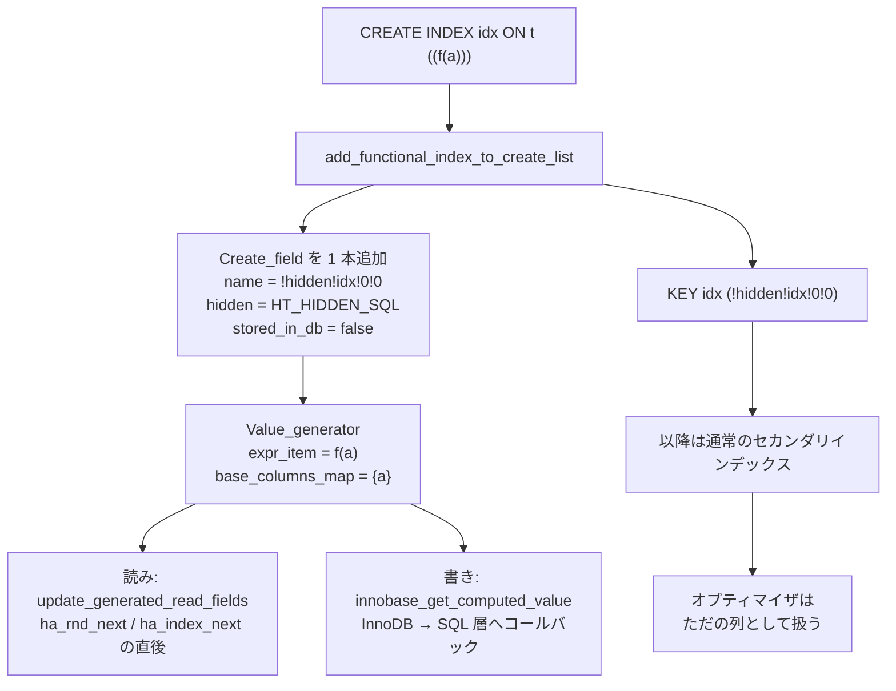

> **前提**: [型と Field クラス](./field-and-types/) / [handler](./handler-walkthrough/) / [アクセスパスの選択](./access-path-selection/)

## 何を学んだか

`CREATE INDEX idx ON t ((JSON_EXTRACT(doc, '$.name')))` と書いたとき、MySQL は関数インデックス専用の仕組みを一切使わない。**列を 1 本、隠して足す。**

```cpp title="sql/sql_table.cc"
  cr->field_name = field_name;
  cr->field = nullptr;
  cr->hidden = dd::Column::enum_hidden_type::HT_HIDDEN_SQL;
  cr->stored_in_db = false;

  Value_generator *gcol_info = new (thd->mem_root) Value_generator();
  gcol_info->expr_item = kp->get_expression();
  gcol_info->set_field_stored(false);
  gcol_info->set_field_type(cr->sql_type);
  cr->gcol_info = gcol_info;
```

[`sql/sql_table.cc#L8102`](https://github.com/mysql/mysql-server/blob/mysql-8.4.11/sql/sql_table.cc#L8102)。`HT_HIDDEN_SQL` で隠され、`stored_in_db = false` の仮想生成カラムになり、インデックスはその列に張られる。

- **関数インデックスは糖衣構文だ。** 脱糖後は「仮想生成カラムへのインデックス」でしかなく、オプティマイザ以降は区別しない
- **隠し列の名前は `!hidden!` で始まる。** ユーザが `!` から始まる識別子を書けないので衝突しない (それでも衝突検査ループがある)
- **生成カラムの本体は `Value_generator`。** 式の `Item` ツリーと、依存する基底列のビットマップを持つ
- **VIRTUAL の値は読むたびに計算される。** ただしカバリングインデックスで足りるときは計算を飛ばす
- **書き込み時の計算は InnoDB が SQL 層にコールバックして行う。** インデックスの保守に値が要るため
- **CHECK 制約も同じ `Value_generator` を使う。** ただし評価は SQL 層で、更新に関係しなければ飛ばされる



## なぜそうなっているか

**関数インデックスを脱糖にしたのは、生成カラムへのインデックスが既にあったからだ。** 5.7 で「生成カラムを作ってインデックスを張る」という 2 段構えの回避策が広く使われていた。8.0 はその手順を構文にしただけで、下の層は 1 行も変えていない。`AccessPath` も `handler` も InnoDB も、関数インデックスを知らないまま関数インデックスを使える。

**隠し列にしたのは、`SELECT *` に出さないためだ。** 見えてしまうと、`INSERT INTO t VALUES (...)` の列数が合わなくなり、既存のアプリケーションが壊れる。`HT_HIDDEN_SQL` は DD の可視性の 1 種で、SQL 層からは存在しないように振る舞う。

**名前に `!` を使ったのは、ユーザの名前空間と衝突させないためだ。** それでも生成関数は衝突検査のループを回している。理由がコメントに書いてある — レプリケーションで別バージョンのサーバが作った名前や、ユーザが同じ命名規則を真似た列がありうるからだ。

**VIRTUAL の値を読むたびに計算するのは、ストレージを使わない代わりに CPU を使う取引だ。** 逆に STORED は行に実体を持つので読みは速いが、行が太り、`ALTER` で式を変えるとテーブルの再構築が要る。

**書き込み時に InnoDB が SQL 層を呼び返すのは、式を評価できるのが SQL 層だけだからだ。** インデックスの葉には計算後の値が入るので、行を書くたびに値が要る。InnoDB は `Item` ツリーを解釈できないので、コールバックするしかない。

## ソースコードのどこか

### `Value_generator` — 式と依存列

```cpp title="sql/field.h"
class Value_generator {
 public:
  /**
    Item representing the generation expression.
    This is non-NULL for every Field of a TABLE, if that field is a generated
    column.
    ...
  */
  Item *expr_item{nullptr};
  ...
  /// Bitmap records base columns which a generated column depends on.
  MY_BITMAP base_columns_map;
```

[`sql/field.h#L483`](https://github.com/mysql/mysql-server/blob/mysql-8.4.11/sql/field.h#L483)。**`base_columns_map` が効率の要**になる。「この生成カラムはどの列に依存しているか」が分かれば、依存列が更新されていないときに再計算を飛ばせる。

`TABLE_SHARE` 側の `Field` は `expr_item` を持たず、テキスト (`expr_str`) だけを持つ。`Item` ツリーは共有できないので、`TABLE` を開くたびにテキストからパースし直す。**生成カラムのあるテーブルは、テーブルを開くコストが上がる**ということでもある。

判定関数も並んでいる。

```cpp title="sql/field.h"
  bool is_gcol() const { return gcol_info; }
  bool is_virtual_gcol() const { return gcol_info && !stored_in_db; }
```

[`sql/field.h#L825`](https://github.com/mysql/mysql-server/blob/mysql-8.4.11/sql/field.h#L825)。

### 関数インデックスの脱糖

隠し列の名前を作るのがこれだ。

```cpp title="sql/sql_table.cc"
static const char *make_functional_index_column_name(
    std::string_view key_name, unsigned key_part_number,
    const List<Create_field> &fields, MEM_ROOT *mem_root) {
  // Loop until we have found a unique name. We'll usually find one in the first
  // iteration, but if there are user-defined columns using the same naming
  // scheme, we might need to increment the counter to avoid collisions. ...
  for (unsigned count = 0;; ++count) {
    ...
    string name("!hidden!");
    name += key_name;

    string suffix("!");
    suffix += to_string(key_part_number);
    suffix += '!';
    suffix += to_string(count);
```

[`sql/sql_table.cc#L7929`](https://github.com/mysql/mysql-server/blob/mysql-8.4.11/sql/sql_table.cc#L7929)。`!hidden!<インデックス名>!<キーパート番号>!<連番>` になる。**インデックス名が長いと切り詰められる**が、切り詰めるのは名前の側だけで、連番は必ず残す (でないと衝突回避のループが終わらない)。

制約もこの関数の周りで課される。

```cpp title="sql/sql_table.cc"
  if (is_blob(cr->sql_type)) {
    my_error(ER_FUNCTIONAL_INDEX_ON_LOB, MYF(0));
    return nullptr;
  }
```

[`sql/sql_table.cc#L8090`](https://github.com/mysql/mysql-server/blob/mysql-8.4.11/sql/sql_table.cc#L8090)。**式の結果型が BLOB / TEXT になると作れない**。`JSON_EXTRACT` の結果をそのままインデックスできず `CAST(... AS CHAR(N))` が要るのはこれによる。生成される列の型は式から `generate_create_field` が導くので、**式を書いた時点で列の型が決まる**。

エラーメッセージの読み替えも用意されている。

```cpp title="sql/error_handler.cc"
  if (field->is_field_for_functional_index()) {
    m_thd->push_internal_handler(this);
    m_pop_error_handler = true;

    // Get the name of the functional index
```

[`Functional_index_error_handler` (`sql/error_handler.cc#L230`)](https://github.com/mysql/mysql-server/blob/mysql-8.4.11/sql/error_handler.cc#L230)。[sql_mode のページ](./sql-mode-and-strict/)で見たのと同じ内部エラーハンドラの仕組みで、`!hidden!idx!0!0` という内部名が出るのを防いでインデックス名に差し替える。厳格モードの昇格リストに `ER_WARN_DATA_OUT_OF_RANGE_FUNCTIONAL_INDEX` のような専用コードが並んでいたのはこのためだ。

### 読むときの計算 — `handler` が面倒を見る

```cpp title="sql/handler.cc"
  // Set status for the need to update generated fields
  m_update_generated_read_fields = table->has_gcol();

  MYSQL_TABLE_IO_WAIT(PSI_TABLE_FETCH_ROW, MAX_KEY, result,
                      { result = rnd_next(buf); })
  if (!result && m_update_generated_read_fields) {
    result = update_generated_read_fields(buf, table);
    m_update_generated_read_fields = false;
  }
```

[`handler::ha_rnd_next` (`sql/handler.cc#L2996`)](https://github.com/mysql/mysql-server/blob/mysql-8.4.11/sql/handler.cc#L2996)。**エンジンから 1 行返ってくるたびに、生成カラムを計算し直している。** `ha_index_next` などの索引走査側にも同じ形が入っている。

計算を飛ばす条件が 1 つある。

```cpp title="sql/table.cc"
  if (active_index != MAX_KEY && table->key_read) {
    /*
      The covering index is providing all necessary columns, including
      generated ones.
      ...
    */
    return false;
  }
```

[`update_generated_read_fields` (`sql/table.cc#L7287`)](https://github.com/mysql/mysql-server/blob/mysql-8.4.11/sql/table.cc#L7287)。**カバリングインデックスで読めているなら、生成カラムの値もインデックスから来ているので計算しない。** 生成カラムのインデックスが効くと、式の評価そのものが消えるということだ。

同じコメントに、まだ実装されていない最適化への言及もある。基底列 A のインデックスがあり B が A から導かれるとき、A のインデックスだけを読んで B を計算する索引のみ走査は選ばれない — オプティマイザが A と B を独立とみなすからだ。

### 書くときの計算 — InnoDB からのコールバック

```cpp title="storage/innobase/row/row0ins.cc"
    const dfield_t *const vfield = innobase_get_computed_value(
        update->old_vrow, col, table, &v_heap, update->heap, thd, nullptr);

    if (vfield == nullptr) {
      *err = DB_COMPUTE_VALUE_FAILED;
      goto func_exit;
    }
```

[`storage/innobase/row/row0ins.cc#L958`](https://github.com/mysql/mysql-server/blob/mysql-8.4.11/storage/innobase/row/row0ins.cc#L958)。**これは外部キーのカスケード処理の中**だ ([外部キー](./foreign-keys/))。カスケードで子行を更新するとき、その子テーブルに仮想列のインデックスがあれば、値を計算し直してインデックスを保守しなければならない。InnoDB の中で完結する処理なのに、式の評価のためだけに SQL 層へ戻る。

同じコールバックは `row0upd.cc` と `row0sel.cc` からも呼ばれている。

### CHECK 制約 — 同じ `Value_generator`、違う評価点

```cpp title="sql/sql_base.cc"
bool invoke_table_check_constraints(THD *thd, const TABLE *table) {
  if (table->table_check_constraint_list != nullptr) {
    for (auto &table_cc : *table->table_check_constraint_list) {
      if (table_cc.is_enforced()) {
        /*
          Invoke check constraints only if column(s) used by check constraint is
          updated.
        */
        if ((thd->lex->sql_command == SQLCOM_UPDATE ||
             thd->lex->sql_command == SQLCOM_UPDATE_MULTI) &&
            !bitmap_is_overlapping(
                &table_cc.value_generator()->base_columns_map,
                table->write_set)) {
          ...
          continue;
        }
```

[`sql/sql_base.cc#L9842`](https://github.com/mysql/mysql-server/blob/mysql-8.4.11/sql/sql_base.cc#L9842)。CHECK 制約も `Value_generator` として持たれ、`base_columns_map` で「関係ない `UPDATE` では評価しない」判定をしている。

**評価は SQL 層で行われる**ので、外部キーのカスケードと違い、InnoDB 内で完結する変更には効かない。呼び出し元は `sql_insert.cc` / `sql_update.cc` の 5 か所ほどしかない。

## どう活かすか

### 関数インデックスが使われるのは「式が一致したとき」だけ

脱糖の結果は普通の列へのインデックスなので、オプティマイザは `WHERE` の式が生成カラムの式と一致するかを見る。**書き方が少しでも違えば使われない**。

- `WHERE JSON_EXTRACT(doc, '$.name') = 'x'` — インデックスの式と同じなら使える
- `WHERE doc->>'$.name' = 'x'` — `JSON_UNQUOTE(JSON_EXTRACT(...))` に展開されるので、インデックスが `JSON_EXTRACT` だけなら使えない
- `WHERE LOWER(email) = 'x'` に対して `((email))` のインデックス — 当然使えない

`EXPLAIN` で `key` が `NULL` なら、まず式の形を疑う。`SHOW CREATE TABLE` には `((...))` の形で式が出るので、文字列として比べられる。

### 式の結果型に注意する — `CAST` が必要な理由

生成される隠し列の型は式から自動で決まり、BLOB / TEXT になると作成が失敗する。JSON から文字列を取り出してインデックスしたいなら `CAST(... AS CHAR(64))` のように長さを与える。**この長さがインデックスのキー長になる**ので、長すぎると 3072 バイトの上限にぶつかる ([文字セットと照合順序](./charset-and-collation/))。

同時に、`CAST` の照合順序も決まる。既定の照合順序が式に付くので、比較する側と食い違えばインデックスが落ちる ([名前解決と Item ツリー](./name-resolution-and-items/))。

### VIRTUAL にインデックスを張ると、書き込みコストが上がる

VIRTUAL は行に値を持たないので「ストレージを食わない」と説明されるが、**インデックスを張った時点で値はインデックスの葉に実体化される**。`INSERT` / `UPDATE` のたびに式が評価され、セカンダリインデックスが更新される。

- インデックスなしの VIRTUAL — 書きは無料、読みで毎回計算
- インデックスありの VIRTUAL — 書きで式評価 + インデックス更新、読みはカバリングなら計算なし
- STORED — 書きで式評価、行が太る、`ALTER` で式を変えると再構築

**読み取りが多いなら VIRTUAL + インデックス、が既定の選択**になる。STORED を選ぶ理由は、式が非常に重くて全表スキャンでも計算したくない場合くらいしかない。

### 生成カラムのある `UPDATE` は、触っていない列でも計算されうる

`base_columns_map` があるので、依存列を触っていない `UPDATE` では再計算が飛ぶ — ただしこれは CHECK 制約の話だ。生成カラムのほうは、書き込み経路で `update_generated_write_fields` が `write_set` に載った生成カラムを計算する。どの生成カラムが `write_set` に載るかは、依存列が更新対象かどうかで決まる。

**式に `NOW()` のような非決定的な関数は書けない**ので、この判定は安全に働く。書けたとしたら「依存列は変わっていないが値は変わる」ことになり、インデックスと行が食い違う。

### 一般化して持ち帰るもの

**新しい構文を、既存の機構への脱糖として実装する**というのが関数インデックスの設計だ。オプティマイザにもエグゼキュータにもストレージエンジンにも手を入れず、`CREATE TABLE` の前処理だけで機能が 1 つ増えている。代償は 2 つあって、隠し列がユーザに漏れないようにする作業 (`HT_HIDDEN_SQL`、名前の衝突回避、エラーメッセージの読み替え) と、**下の層が「これは関数インデックスだ」と知らないために出せない最適化**がある。カバリングインデックスのコメントに残っている未実装の最適化が後者の例になる。

もう 1 つは、**依存関係をビットマップで持っておくと、後から効率化の余地が生まれる**という点だ。`base_columns_map` は制約評価の枝刈りにも生成カラムの再計算判定にも使える。式を持つ機能を作るなら、式そのものと一緒に「何に依存しているか」を必ず保存しておく。
