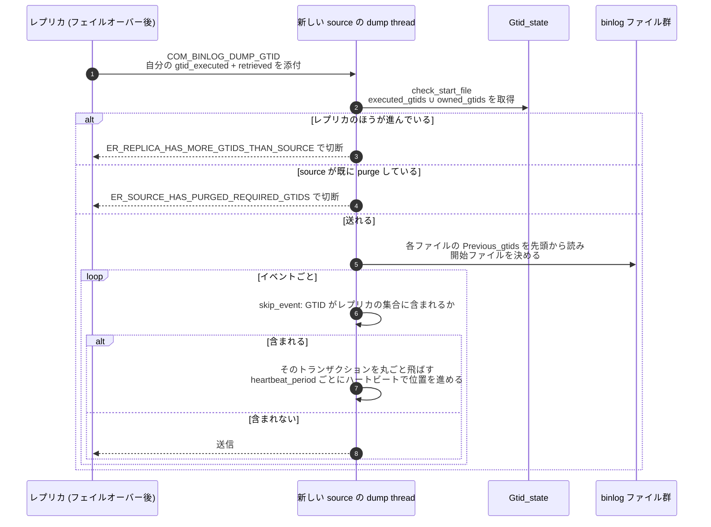

> **前提**: [binlog イベント](./binlog-events/) / [2PC とグループコミット](./two-phase-commit-and-group-commit/)

## 何を学んだか

レプリケーションの位置を「ファイル名 + オフセット」で表すと、source が切り替わった瞬間に意味を失う。別のサーバの binlog では同じ位置に別のトランザクションがある。GTID はこれを **トランザクション自身に付いた名前**に置き換える。

8.4 の GTID は 2 段構成だ。

- **TSID** = UUID + Tag。`Tsid` ([`libs/mysql/gtid/tsid.h#L47`](https://github.com/mysql/mysql-server/blob/mysql-8.4.11/libs/mysql/gtid/tsid.h#L47)) が `Uuid m_uuid` と `Tag m_tag` を持つ
- **GTID** = TSID + GNO (1 から始まる 64bit 整数)

タグが空なら従来どおり `UUID:GNO`、タグがあれば `UUID:TAG:GNO` と表示される。**この tagged GTID が 8.4 の新機能で、そのために `Sid_map` が `Tsid_map` に改名された** ([`sql/rpl_gtid.h#L749`](https://github.com/mysql/mysql-server/blob/mysql-8.4.11/sql/rpl_gtid.h#L749))。8.0 の記事で `Sid_map` を探しても見つからない。イベント種別も `GTID_TAGGED_LOG_EVENT = 42` が追加された。

もう 1 つの要点は**採番のタイミング**だ。GNO は文の実行中でもトランザクション開始時でもなく、**グループコミットの flush ステージで、キューの順序どおりに**割り当てられる。だから GNO の順序 = binlog に現れる順序になる。

## なぜそうなっているか

**GNO の採番を flush ステージまで遅らせているのは、番号の順序と binlog の順序を一致させるためだ。** トランザクション開始時に採番すると、長いトランザクションが小さい番号を持ったまま後からコミットして、binlog 上の順序と GNO の順序がずれる。ずれると `gtid_executed` に穴が空き、`Gtid_set` の区間が分裂する。**flush ステージのキュー順に採番すれば、`executed_gtids` は「1 本の区間が伸びていくだけ」で済む。**

**ロールバックで GNO を返却するのも同じ理由だ。** AUTO_INCREMENT は飛んでも実害がないが、GNO が飛ぶと区間が 2 本に割れる。`next_free_gno` を下げ直すコードは、この 1 点のためだけに存在している。

**`mysql.gtid_executed` が必要なのは、binlog を purge しても `gtid_executed` を復元できるようにするためだ。** 起動時に `executed_gtids` を組み立てる材料は「残っている binlog ファイルの `Previous_gtids` + 最後のファイルのイベント」だが、これでは purge 済みのぶんが失われる。**テーブルに書いておけば、binlog を全部消してもサーバは自分が何を実行したかを覚えている。**

**binlog 有効時にローテート単位でしか書かないのは、コミットパスに DML を挟みたくないからだ。** トランザクションごとに `mysql.gtid_executed` へ 1 行書くと、それ自体が InnoDB のトランザクションになり、コミットのコストが倍近くなる。binlog があれば「まだテーブルに書いていないぶん」は binlog から復元できるので、書くのを遅らせられる。

**`Previous_gtids_log_event` は「ファイル単位のインデックス」だ。** binlog ファイルには目次がないので ([binlog イベント](./binlog-events/))、「この GTID がどのファイルにあるか」を知るにはファイルを全部舐めるしかない。先頭に「ここまでの累積」を置いておけば、**ファイルを開いて 1 イベント読むだけで二分探索的に絞り込める**。

**auto-position のスキップを source 側でやるのは、レプリカ側に判断材料を持たせないためだ。** レプリカが受け取ってから捨てる方式にすると、ネットワークに無駄が乗るうえ、レプリカが「捨ててよいか」を判断するために source の状態を知る必要が出る。source は自分の binlog とレプリカが送ってきた集合の両方を持っているので、**判断できる唯一の場所が source だ**。

## ソースコードのどこか

### `Gtid_state` — サーバが持つ 4 つの集合

[`sql/rpl_gtid.h#L2871`](https://github.com/mysql/mysql-server/blob/mysql-8.4.11/sql/rpl_gtid.h#L2871)。グローバルに 1 個あり、次の `Gtid_set` を持つ。

| メンバ                | 対応する変数             | 意味                                             |
| --------------------- | ------------------------ | ------------------------------------------------ |
| `executed_gtids`      | `@@GLOBAL.gtid_executed` | このサーバで実行済みの全 GTID                    |
| `lost_gtids`          | `@@GLOBAL.gtid_purged`   | binlog から消えた (purge された) GTID            |
| `owned_gtids`         | `@@GLOBAL.gtid_owned`    | 今どこかのスレッドが所有中の GTID                |
| `gtids_only_in_table` | —                        | `mysql.gtid_executed` にはあるが binlog にはない |

`Gtid_set` は「SIDNO ごとの区間リスト」で表現される。**区間が 1 本で済んでいるかどうかが性能に直結する**ので、サーバは執拗に順序を守る (後述)。

### 採番 — flush ステージのリーダーがやる

[`assign_automatic_gtids_to_flush_group` (`binlog.cc#L1627`)](https://github.com/mysql/mysql-server/blob/mysql-8.4.11/sql/binlog.cc#L1627) が、flush ステージで切り取ったキューを 2 周する。1 周目で SIDNO を決めて必要な sidno lock を集め、2 周目で GNO を振る。

```cpp title="sql/binlog.cc"
  locked_sidno_set.lock();
  for (THD *head = first_seen; head; head = head->next_to_commit) {
    assert(head->variables.gtid_next.type != UNDEFINED_GTID);

    /* Generate GTID */
    if (Gtid_specification::is_automatic(head->variables.gtid_next.type)) {
      auto [ctx_sidno, ctx_gno] = head->get_transaction()
                                      ->get_rpl_transaction_ctx()
                                      ->get_gtid_components();

      if (gtid_state->generate_automatic_gtid(head, ctx_sidno, ctx_gno) !=
          RETURN_STATUS_OK) {
        head->commit_error = THD::CE_FLUSH_GNO_EXHAUSTED_ERROR;
```

実際に空き番号を探すのは [`get_automatic_gno` (`rpl_gtid_state.cc#L416`)](https://github.com/mysql/mysql-server/blob/mysql-8.4.11/sql/rpl_gtid_state.cc#L416)。`executed_gtids` の区間の隙間を走査して、`owned_gtids` にも入っていない最小の番号を返す。ただし毎回 1 から探すのではなく `next_free_gno_map` にヒントを持っている。理由がコメントに書いてある。

```cpp title="sql/rpl_gtid_state.cc"
    This is useful mostly on systems having many transactions committing in
    group asking for automatic GTIDs. When a GNO is assigned to be owned by a
    transaction, it is not removed from the free intervals, but will be added
    to the owned_gtids set. In this way, picking up the actual first free GNO
    would often lead to getting a GNO already owned by other thread.
```

**ロールバックすると GNO は返却される。** [`update_gtids_impl_own_gtid` (L850)](https://github.com/mysql/mysql-server/blob/mysql-8.4.11/sql/rpl_gtid_state.cc#L850) の `else` 側で `next_free_gno` を下げ直している。だから GNO は AUTO_INCREMENT と違って**ロールバックで飛ばない**。

### `gtid_executed` への反映 — commit ステージでまとめて

[`Gtid_state::update_commit_group` (`rpl_gtid_state.cc#L158`)](https://github.com/mysql/mysql-server/blob/mysql-8.4.11/sql/rpl_gtid_state.cc#L158) が commit ステージのリーダーから呼ばれる。

```cpp title="sql/rpl_gtid_state.cc"
void Gtid_state::update_commit_group(THD *first_thd) {
  DBUG_TRACE;
  mysql_mutex_assert_owner(mysql_bin_log.get_commit_lock());
```

**`LOCK_commit` を持っていることをアサートしている。** キューの順序で追加されるので、`executed_gtids` に一時的な穴が空かない。1 本のトランザクションずつバラバラに追加すると、`Gtid_set` の区間が分裂して mutex 付きの区間操作が必要になる ([2PC とグループコミット](./two-phase-commit-and-group-commit/))。

追加そのものは [L880 付近](https://github.com/mysql/mysql-server/blob/mysql-8.4.11/sql/rpl_gtid_state.cc#L880)。

```cpp title="sql/rpl_gtid_state.cc"
    CONDITIONAL_SYNC_POINT_FOR_TIMESTAMP("before_gtid_externalization");
    executed_gtids._add_gtid(thd->owned_gtid);
    thd->rpl_thd_ctx.session_gtids_ctx().notify_after_gtid_executed_update(thd);
```

2 行目が `session_track_gtids` のフックだ。

### `mysql.gtid_executed` — いつ書かれるか

永続化は [`sql/rpl_gtid_persist.cc`](https://github.com/mysql/mysql-server/blob/mysql-8.4.11/sql/rpl_gtid_persist.cc) の `Gtid_table_persistor`。書かれるタイミングが 2 通りある。

**binlog が有効なとき** — トランザクションごとには書かない。binlog がローテートするときに [`save_gtids_of_last_binlog_into_table` (`rpl_gtid_state.cc#L695`)](https://github.com/mysql/mysql-server/blob/mysql-8.4.11/sql/rpl_gtid_state.cc#L695) が「今閉じるファイルに入っていた GTID」だけをまとめて書く。

```cpp title="sql/rpl_gtid_state.cc"
    logged_gtids_last_binlog= executed_gtids - previous_gtids_logged -
                              gtids_only_in_table
```

**binlog が無効なとき** — レプリカで `log_replica_updates=OFF` にしている場合など。この場合はトランザクションごとに 1 行書くしかなく、行が溜まるので `gtid_executed_compression_period` が効いてくる。**8.0.23 以降この既定は 0 (無効)** で ([`sys_vars.cc#L6579`](https://github.com/mysql/mysql-server/blob/mysql-8.4.11/sql/sys_vars.cc#L6579))、その理由もヘルプ文に書かれている。

```cpp title="sql/sys_vars.cc"
    "MySQL 8.0.23, the default is zero, which "
    "disables this compression method. This is because in releases from "
    "MySQL 8.0.17, InnoDB transactions are written to the "
    "mysql.gtid_executed table by a separate process to non-InnoDB "
    "transactions."
```

`compress_gtid_table` という専用スレッドが `rpl_gtid_persist.cc` の中で起動される (`SYSTEM_THREAD_COMPRESS_GTID_TABLE`)。

### `Previous_gtids_log_event` — ファイルの先頭に置く「ここまでの全部」

[`sql/log_event.h#L4187`](https://github.com/mysql/mysql-server/blob/mysql-8.4.11/sql/log_event.h#L4187)。各 binlog ファイルの FDE の直後に 1 個だけ置かれ、**そのファイルより前の全ファイルに入っていた GTID の集合**を持つ。

これがあるおかげで、dump thread は「レプリカが要求している GTID がどのファイルから始まるか」を、ファイルを開いて先頭を読むだけで判定できる。全ファイルを走査せずに済む。

### auto-position — 送る側でスキップする

レプリカは `COM_BINLOG_DUMP_GTID` で自分の `gtid_executed` (+ retrieved) をエンコードして送る ([`rpl_source.cc#L1009`](https://github.com/mysql/mysql-server/blob/mysql-8.4.11/sql/rpl_source.cc#L1009))。

```cpp title="sql/rpl_source.cc"
  if (slave_gtid_executed.add_gtid_encoding(packet_position, data_size) !=
      RETURN_STATUS_OK)
    return true;
```

source 側はまず [`Binlog_sender::check_start_file` (L864)](https://github.com/mysql/mysql-server/blob/mysql-8.4.11/sql/rpl_binlog_sender.cc#L864) で 2 つの健全性チェックをする。

- **レプリカが source より進んでいないか** — source の UUID について、レプリカの集合が source の `executed_gtids ∪ owned_gtids` の部分集合でなければ `ER_REPLICA_HAS_MORE_GTIDS_THAN_SOURCE` で切る
- **source が既に purge した GTID をレプリカが要求していないか** — `ER_SOURCE_HAS_PURGED_REQUIRED_GTIDS`



`Previous_gtids` を頼りに開始ファイルを決めて送り始めたあとの、送信中のスキップが [`skip_event` (L749)](https://github.com/mysql/mysql-server/blob/mysql-8.4.11/sql/rpl_binlog_sender.cc#L749) だ。

```cpp title="sql/rpl_binlog_sender.cc"
    case mysql::binlog::event::GTID_LOG_EVENT:
    case mysql::binlog::event::GTID_TAGGED_LOG_EVENT: {
      ...
      return m_exclude_gtid->contains_gtid(gtid);
    }
    case mysql::binlog::event::ROTATE_EVENT:
      return false;
  }
  return in_exclude_group;
```

**GTID イベントを見て「レプリカが既に持っている」と分かったら、そのトランザクションの残りのイベントを全部飛ばす。** `in_exclude_group` がその状態を持ち回る。スキップが続く間も、`heartbeat_period` ごとにハートビートを送ってレプリカの位置を進めてやる ([`send_events` L572](https://github.com/mysql/mysql-server/blob/mysql-8.4.11/sql/rpl_binlog_sender.cc#L572))。フェイルオーバーで新しい source に繋いだとき、レプリカが自分の位置を計算しなくてよいのはこの仕組みのおかげだ。

### `GTID_NEXT` と `WAIT_FOR_EXECUTED_GTID_SET`

`GTID_NEXT` の処理は [`sql/rpl_gtid_execution.cc`](https://github.com/mysql/mysql-server/blob/mysql-8.4.11/sql/rpl_gtid_execution.cc)。`AUTOMATIC` / `ASSIGNED_GTID` (`'uuid:n'` を明示) / `ANONYMOUS` があり、8.4 では `AUTOMATIC:tag` でタグを指定できる ([`rpl_gtid.h#L4016`](https://github.com/mysql/mysql-server/blob/mysql-8.4.11/sql/rpl_gtid.h#L4016))。

`WAIT_FOR_EXECUTED_GTID_SET()` は [`Item_wait_for_executed_gtid_set` (`sql/item_gtid_func.h#L42`)](https://github.com/mysql/mysql-server/blob/mysql-8.4.11/sql/item_gtid_func.h#L42) で、[`Gtid_state::wait_for_gtid_set` (`rpl_gtid_state.cc#L305`)](https://github.com/mysql/mysql-server/blob/mysql-8.4.11/sql/rpl_gtid_state.cc#L305) を呼ぶ。SIDNO ごとの条件変数で待ち、GTID が `executed_gtids` に入るたびに `broadcast_sidno` で起こされる。

`session_track_gtids` ([`sys_vars.cc#L1614`](https://github.com/mysql/mysql-server/blob/mysql-8.4.11/sql/sys_vars.cc#L1614)、既定 `OFF`) を `OWN_GTID` にすると、**OK パケットに「今コミットしたトランザクションの GTID」が乗って返ってくる**。クライアントはそれを保持して、次にレプリカへ読みに行くときに `WAIT_FOR_EXECUTED_GTID_SET` に渡せる。

## どう活かすか

**read-your-writes を作る手順は 3 段だ。** ① source で `session_track_gtids=OWN_GTID` を有効にして、書き込み後の OK パケットから GTID を取り出す ② その GTID をセッション (アプリ側の変数、Cookie、キューのメッセージ) に持ち回す ③ レプリカで `SELECT WAIT_FOR_EXECUTED_GTID_SET('<gtid>', <timeout>)` を先に打ってから読む。**`Seconds_Behind_Source` を見て「0 だから読んでよい」と判断するのは誤り**で、その理由は[レプリカ遅延の正体](./replication-lag/)にある。

**`WAIT_FOR_EXECUTED_GTID_SET` はタイムアウトを必ず付ける。** 引数を省くと無期限に待つ。戻り値は 0 (到達) か 1 (タイムアウト) で、1 が返ったときにアプリがどうするか (source にフォールバックするか、エラーにするか) を決めておく。

**フェイルオーバーで `SOURCE_AUTO_POSITION=1` を使うなら `gtid_purged` の管理が要る。** 新しい source が古い binlog を purge していると、レプリカの要求が `ER_SOURCE_HAS_PURGED_REQUIRED_GTIDS` で弾かれる。`binlog_expire_logs_seconds` の既定は 2592000 (30 日、[`sys_vars.cc#L2156`](https://github.com/mysql/mysql-server/blob/mysql-8.4.11/sql/sys_vars.cc#L2156)) だが、書き込み量が多いと `max_binlog_size` によるローテートと `binlog_expire_logs_auto_purge` で早く消える。**レプリカを長時間止めるときは purge を止める。**

**バックアップからレプリカを作るときは `gtid_purged` を明示的に設定する。** 物理バックアップの復元後、`mysql.gtid_executed` の内容と実際に持っている binlog が食い違う。`RESET BINARY LOGS AND GTIDS` してから `SET GLOBAL gtid_purged = '...'` で「ここまでは実行済みとみなす」を宣言する。この値は `Gtid_state::lost_gtids` に入り、以後 dump thread のチェックに使われる。

**`gtid_executed` が長い区間リストになっていたら、どこかで順序が崩れている。** `SELECT @@GLOBAL.gtid_executed` にカンマ区切りの区間がずらりと並ぶ状態は、`GTID_NEXT` を手で指定して飛び飛びに実行した跡か、複数 source からの取り込みだ。区間が増えるほど `Gtid_set` の操作コストが上がる。`mysql.gtid_executed` 側は `gtid_executed_compression_period` かローテート時の圧縮でまとめられるが、**メモリ上の `executed_gtids` は縮まない**。

**`gtid_mode` の既定は 8.4 でも `OFF`。** `Gtid_mode::DEFAULT = OFF` ([`rpl_gtid.h#L638`](https://github.com/mysql/mysql-server/blob/mysql-8.4.11/sql/rpl_gtid.h#L638))。`OFF` → `OFF_PERMISSIVE` → `ON_PERMISSIVE` → `ON` の段階移行が必要な理由もヘルプ文にそのまま書かれている。無停止で切り替えるつもりなら、各段階で全サーバを揃えてから次に進む。

**8.0 のスクリプトが `Sid_map` や `SHOW SLAVE STATUS` を前提にしていても、GTID の値の形式は変わっていない。** 変わったのは内部の型名と、タグを付けたときの表示 (`UUID:TAG:GNO`) だけだ。タグを使わない限り既存のパーサはそのまま動く。
