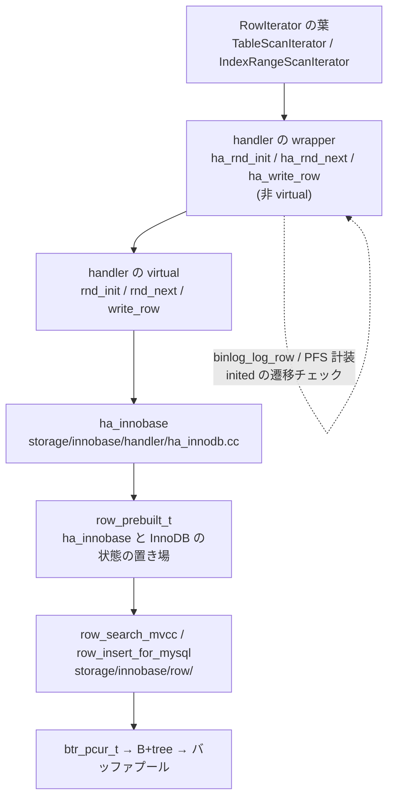
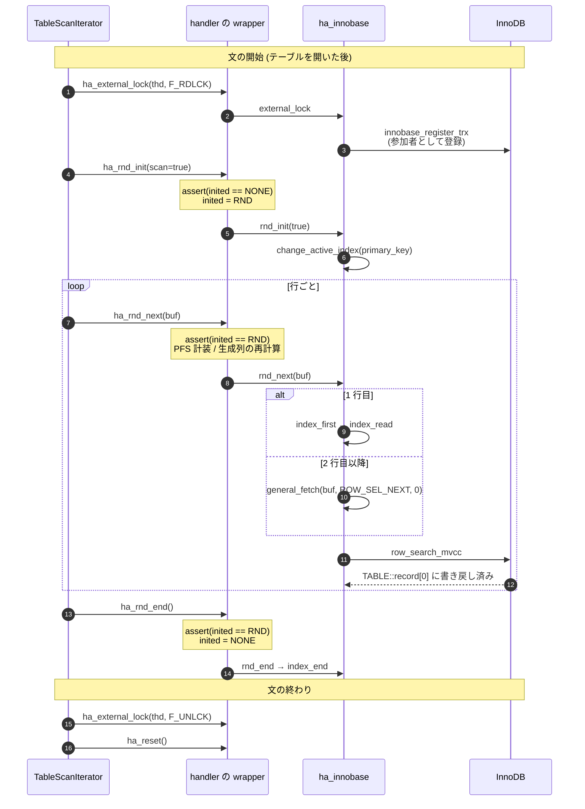

> **前提**: [pluggable storage engine](./pluggable-storage-engine/) / [iterator executor](./executor-walkthrough/)

## この層の責務

[SELECT の一生](./life-of-a-select/)で見たとおり、iterator の葉は最後に `handler` のメソッドを呼ぶ。この層の責務は 1 つに絞られる。

**SQL 層が知っている語彙 (テーブル、インデックス番号、キー値、`TABLE::record[0]` のバイト列) を、ストレージエンジンが知っている語彙 (`dict_index_t`、B+tree のカーソル、InnoDB のレコード) に翻訳する契約を定義すること。**

`sql/` 配下のコードで `dict_table_t` や `btr_pcur_t` を触っているものは 1 つもない。逆に `storage/innobase/` から `Query_block` や `AccessPath` は見えない。この 2 つの世界の間にあるのが `class handler` と `struct handlerton` だけだ。**この境界の粗さが、ICP や MRR のような「述語をエンジンに降ろす」最適化が後付けの API として並んでいる理由**でもある ([アクセスパスの選択](./access-path-selection/))。

この層が持つのは 3 種類の契約だ。

1. **テーブル 1 個に対する操作** — `handler` のインスタンスメソッド。オープン、スキャン、行の読み書き
2. **エンジン全体に対する操作** — `handlerton` の関数ポインタ。コミット、ロールバック、リカバリ
3. **エンジンの能力の申告** — `table_flags()` / `index_flags()` が返すビットマスク。オプティマイザはこれを見て使える最適化を決める

このページは 1 を中心に読む。2 は[トランザクションの調停](./transaction-coordination/)、3 は[pluggable storage engine](./pluggable-storage-engine/)に分けた。

## 主要な型とその関係



### `class handler` — [`sql/handler.h#L4571`](https://github.com/mysql/mysql-server/blob/mysql-8.4.11/sql/handler.h#L4571)

3100 行を超える巨大なクラスだが、クラス定義の直前に置かれた 300 行のコメントが 21 個の「MODULE」に分けて全体を説明している。`MODULE full table scan`、`MODULE index scan`、`MODULE change record` といった単位だ。

```cpp title="sql/handler.h"
  -------------------------------------------------------------------------
  MODULE full table scan
  -------------------------------------------------------------------------
  ...
  It contains one method to start the scan (rnd_init) that can also be
  called multiple times (typical in a nested loop join). Then proceeding
  to the next record (rnd_next) and closing the scan (rnd_end).
```

「nested loop join では `rnd_init` が複数回呼ばれる」という一文が、この API が誰のために設計されたかを示している。

### wrapper と virtual の二重構造

`handler` のメソッドは 2 層になっている。上が `ha_` 接頭辞の**非 virtual** な public メソッド、下が同名の **virtual** な protected / private メソッドだ。ヘッダのコメントが理由をそのまま書いている。

```cpp title="sql/handler.h"
  /**
    These functions represent the public interface to *users* of the
    handler class, hence they are *not* virtual. For the inheritance
    interface, see the (private) functions write_row(), update_row(),
    and delete_row() below.
  */
  int ha_external_lock(THD *thd, int lock_type);
  int ha_write_row(uchar *buf);
```

virtual 側の宣言箇所にも同じ注意書きがある。

```cpp title="sql/handler.h"
  /*
    Low-level primitives for storage engines.  These should be
    overridden by the storage engine class. To call these methods, use
    the corresponding 'ha_*' method above.
  */
  virtual int open(const char *name, int mode, uint test_if_locked,
                   const dd::Table *table_def) = 0;
```

wrapper は [`sql/handler.h#L4887`](https://github.com/mysql/mysql-server/blob/mysql-8.4.11/sql/handler.h#L4887) から 80 行ほど並んでいる。`ha_open` / `ha_close` / `ha_index_init` / `ha_rnd_init` / `ha_rnd_next` / `ha_index_read_map` / `ha_write_row` / `ha_update_row` / `ha_delete_row` / `ha_external_lock` / `ha_extra`。**エグゼキュータが呼ぶのは常にこちら側だ。**

### pure virtual は 12 個

`class handler` (L4571-L7223) の中で純粋仮想関数として宣言されているのは次の 12 個だけだ。

| メソッド      | 行                                                                                  | 何を要求しているか             |
| ------------- | ----------------------------------------------------------------------------------- | ------------------------------ |
| `rnd_next`    | [5693](https://github.com/mysql/mysql-server/blob/mysql-8.4.11/sql/handler.h#L5693) | 全表スキャンで次の行           |
| `rnd_pos`     | [5695](https://github.com/mysql/mysql-server/blob/mysql-8.4.11/sql/handler.h#L5695) | 保存した位置から 1 行          |
| `position`    | [5745](https://github.com/mysql/mysql-server/blob/mysql-8.4.11/sql/handler.h#L5745) | 現在行の位置を `ref` に書く    |
| `info`        | [5774](https://github.com/mysql/mysql-server/blob/mysql-8.4.11/sql/handler.h#L5774) | 統計をオプティマイザに返す     |
| `table_type`  | [5984](https://github.com/mysql/mysql-server/blob/mysql-8.4.11/sql/handler.h#L5984) | エンジン名の文字列             |
| `index_flags` | [5986](https://github.com/mysql/mysql-server/blob/mysql-8.4.11/sql/handler.h#L5986) | そのインデックスで何ができるか |
| `store_lock`  | [6083](https://github.com/mysql/mysql-server/blob/mysql-8.4.11/sql/handler.h#L6083) | THR_LOCK の申告                |
| `open`        | [6661](https://github.com/mysql/mysql-server/blob/mysql-8.4.11/sql/handler.h#L6661) | テーブルを開く                 |
| `close`       | [6663](https://github.com/mysql/mysql-server/blob/mysql-8.4.11/sql/handler.h#L6663) | 閉じる                         |
| `rnd_init`    | [6679](https://github.com/mysql/mysql-server/blob/mysql-8.4.11/sql/handler.h#L6679) | 全表スキャンの開始             |
| `table_flags` | [6728](https://github.com/mysql/mysql-server/blob/mysql-8.4.11/sql/handler.h#L6728) | エンジンの能力                 |
| `create`      | [7052](https://github.com/mysql/mysql-server/blob/mysql-8.4.11/sql/handler.h#L7052) | テーブルを作る                 |

**書き込み系は 1 つも入っていない。** `write_row` / `update_row` / `delete_row` は非 pure で、既定実装が用意されている。

```cpp title="sql/handler.h"
  virtual int write_row(uchar *buf [[maybe_unused]]) {
    return HA_ERR_WRONG_COMMAND;
  }
  ...
  virtual int update_row(const uchar *old_data [[maybe_unused]],
                         uchar *new_data [[maybe_unused]]) {
    return HA_ERR_WRONG_COMMAND;
  }

  virtual int delete_row(const uchar *buf [[maybe_unused]]) {
    return HA_ERR_WRONG_COMMAND;
  }
```

`HA_ERR_WRONG_COMMAND` を返す既定実装は `class handler` の中に 27 箇所ある。`index_next` / `index_prev` / `index_first` / `index_last` / `ft_read` などのインデックス走査も同じ扱いだ。**読み書きの API がほとんど任意なのは、「最低限の read-only エンジン」が成立するようにしてあるから**で、pure なのは「そもそもテーブルという概念を成立させるのに要るもの」だけになっている。

`index_read_map` はさらに一段緩い。既定実装は `index_read` に丸投げする。

```cpp title="sql/handler.h"
  virtual int index_read_map(uchar *buf, const uchar *key,
                             key_part_map keypart_map,
                             enum ha_rkey_function find_flag) {
    const uint key_len = calculate_key_len(table, active_index, keypart_map);
    return index_read(buf, key, key_len, find_flag);
  }
```

`ha_innobase` はこの既定を使い、`index_read` ([`ha_innodb.cc#L10424`](https://github.com/mysql/mysql-server/blob/mysql-8.4.11/storage/innobase/handler/ha_innodb.cc#L10424)) だけを実装している。

### `row_prebuilt_t` — [`storage/innobase/include/row0mysql.h#L515`](https://github.com/mysql/mysql-server/blob/mysql-8.4.11/storage/innobase/include/row0mysql.h#L515)

`ha_innobase` はほとんど状態を持たない。実際の状態は `m_prebuilt` が指す `row_prebuilt_t` にある。ヘッダのコメントが目的をはっきり書いている。

```cpp title="storage/innobase/include/row0mysql.h"
/** A struct for (sometimes lazily) prebuilt structures in an Innobase table
handle used within MySQL; these are used to save CPU time. */

struct row_prebuilt_t {
  ulint magic_n;
  dict_table_t *table;         /*!< Innobase table handle */
  dict_index_t *index;         /*!< current index for a search, if
                               any */
  trx_t *trx;                  /*!< current transaction handle */
  unsigned sql_stat_start : 1; /*!< true when we start processing of
                              an SQL statement: we may have to set
                              an intention lock on the table,
                              create a consistent read view etc. */
```

ここに置かれているものを分類すると、この構造体が何をしているかが分かる。

| 分類                       | 主なフィールド                                                     | 誰が書くか                                  |
| -------------------------- | ------------------------------------------------------------------ | ------------------------------------------- |
| 対象の同定                 | `table`、`index`、`clust_index_was_generated`                      | `ha_innobase::open` / `change_active_index` |
| トランザクション文脈       | `trx`、`sql_stat_start`、`select_lock_type`、`row_read_type`       | `external_lock` / `start_stmt`              |
| 行フォーマット変換の設計図 | `mysql_template`、`n_template`、`null_bitmap_len`、`mysql_row_len` | `build_template`                            |
| 検索の入力                 | `search_tuple`、`m_stop_tuple`                                     | `index_read`                                |
| 行のバッファ               | `default_rec`、`ins_upd_rec_buff`、`fetch_cache[8]`                | `row_search_mvcc` ほか                      |

`ha_innobase::open` が [`row_create_prebuilt` (`ha_innodb.cc#L7643`)](https://github.com/mysql/mysql-server/blob/mysql-8.4.11/storage/innobase/handler/ha_innodb.cc#L7643) でこれを作り、`TABLE` へのポインタも埋める。

```cpp title="storage/innobase/handler/ha_innodb.cc"
  m_prebuilt = row_create_prebuilt(ib_table, table->s->reclength);

  m_prebuilt->default_rec = table->s->default_values;
  ut_ad(m_prebuilt->default_rec);

  m_prebuilt->m_mysql_table = table;
  m_prebuilt->m_mysql_handler = this;
```

**`row_prebuilt_t` は `handler` インスタンスと 1 対 1 で、`handler` インスタンスは「そのセッションがそのテーブルを開いた 1 個の口」と 1 対 1 だ。** だから `row_prebuilt_t` の中身は排他制御なしに触れる。逆に `dict_table_t` は全セッションで共有されるので、こちらは `dict_sys` の mutex で守られる。

`mysql_template` が変換の設計図であることは[行フォーマット変換のページ](./row-format-conversion/)で詳しく見る。

## 処理の流れ

### 1 回の全表スキャン

`SELECT * FROM t` (インデックスを使わない) を実行したときに呼ばれるメソッドの順序はこうなる。



**「全表スキャン」も InnoDB ではクラスタードインデックスの走査だ。** `ha_innobase::rnd_init` は素直にそう書いている。

```cpp title="storage/innobase/handler/ha_innodb.cc"
int ha_innobase::rnd_init(bool scan) {
  DBUG_TRACE;
  assert(table_share->is_missing_primary_key() ==
         (bool)m_prebuilt->clust_index_was_generated);

  int err = change_active_index(table_share->primary_key);
```

`rnd_next` も 1 行目だけ特別扱いして `index_first` に流す。

```cpp title="storage/innobase/handler/ha_innodb.cc"
  if (m_start_of_scan) {
    error = index_first(buf);

    if (error == HA_ERR_KEY_NOT_FOUND) {
      error = HA_ERR_END_OF_FILE;
    }

    m_start_of_scan = false;
  } else {
    error = general_fetch(buf, ROW_SEL_NEXT, 0);
  }
```

テーブルそのものが PK の B+tree だという[クラスタードインデックス](./clustered-index/)の性質が、ここに顔を出している。

### wrapper が挟んでいるもの

wrapper は「virtual を呼ぶだけ」ではない。[`handler::ha_rnd_next` (`sql/handler.cc#L2996`)](https://github.com/mysql/mysql-server/blob/mysql-8.4.11/sql/handler.cc#L2996) を見る。

```cpp title="sql/handler.cc"
int handler::ha_rnd_next(uchar *buf) {
  int result;
  DBUG_EXECUTE_IF("ha_rnd_next_deadlock", return HA_ERR_LOCK_DEADLOCK;);
  DBUG_TRACE;
  assert(table_share->tmp_table != NO_TMP_TABLE || m_lock_type != F_UNLCK);
  assert(inited == RND);

  // Set status for the need to update generated fields
  m_update_generated_read_fields = table->has_gcol();

  MYSQL_TABLE_IO_WAIT(PSI_TABLE_FETCH_ROW, MAX_KEY, result,
                      { result = rnd_next(buf); })
  if (!result && m_update_generated_read_fields) {
    result = update_generated_read_fields(buf, table);
    m_update_generated_read_fields = false;
  }
  table->set_row_status_from_handler(result);
  return result;
}
```

4 つの仕事が入っている。**状態遷移のアサーション**、**PFS の計装点** (`MYSQL_TABLE_IO_WAIT`)、**生成列の再計算**、**`TABLE` の行ステータス更新**。エンジンはこのどれも書かなくてよい。`performance_schema.table_io_waits_summary_by_table` が全エンジンで一様に取れるのは、計装が wrapper 側に 1 箇所ずつあるからだ ([performance_schema のページ](./performance-schema-internals/))。

書き込み側の [`handler::ha_write_row` (L8081)](https://github.com/mysql/mysql-server/blob/mysql-8.4.11/sql/handler.cc#L8081) はさらに重い。

```cpp title="sql/handler.cc"
int handler::ha_write_row(uchar *buf) {
  int error;
  Log_func *log_func = Write_rows_log_event::binlog_row_logging_function;
  assert(table_share->tmp_table != NO_TMP_TABLE || m_lock_type == F_WRLCK);
  ...
  mark_trx_read_write();
  ...
  MYSQL_TABLE_IO_WAIT(PSI_TABLE_WRITE_ROW, MAX_KEY, error,
                      { error = write_row(buf); })

  if (unlikely(error)) return error;

  if (unlikely((error = binlog_log_row(table, nullptr, buf, log_func))))
    return error; /* purecov: inspected */
```

**行ベース binlog のイベント生成は wrapper の中にある。** エンジンは自分が binlog に載ることを知らない。`ha_update_row` は `Update_rows_log_event`、`ha_delete_row` は `Delete_rows_log_event` を同じ形で呼ぶ ([binlog イベントのページ](./binlog-events/))。

もう 1 つが `mark_trx_read_write()` ([L4753](https://github.com/mysql/mysql-server/blob/mysql-8.4.11/sql/handler.cc#L4753))。

```cpp title="sql/handler.cc"
void handler::mark_trx_read_write() {
  Ha_trx_info *ha_info = &ha_thd()->get_ha_data(ht->slot)->ha_info[0];
  ...
  if (ha_info->is_started()) {
    assert(has_transactions());
    ...
      ha_info->set_trx_read_write();
```

**「このエンジンは書いた」という印はここで立つ。** この印を数えたものが `rw_ha_count` で、2 相コミットに入るかどうかを決める ([トランザクションの調停](./transaction-coordination/))。読むだけのエンジンは 2PC の参加者にならない。

### エンジンへ入るときの絞り

`ha_innobase` の側では、InnoDB の中に入る直前に [`innobase_srv_conc_enter_innodb` (`ha_innodb.cc#L1837`)](https://github.com/mysql/mysql-server/blob/mysql-8.4.11/storage/innobase/handler/ha_innodb.cc#L1837) を通る。呼び出し箇所は `write_row` / `update_row` / `delete_row` / `index_read` / `general_fetch` など 7 箇所ある。

```cpp title="storage/innobase/handler/ha_innodb.cc"
static inline dberr_t innobase_srv_conc_enter_innodb(row_prebuilt_t *prebuilt) {
  /* We rely on server to do external_lock(F_UNLCK) to reset the
  srv_conc.n_active counter. */
  if (prebuilt->skip_concurrency_ticket()) {
    return DB_SUCCESS;
  }

  dberr_t err = DB_SUCCESS;
  trx_t *trx = prebuilt->trx;

  if (srv_thread_concurrency) {
    if (trx->n_tickets_to_enter_innodb > 0) {
      /* If trx has 'free tickets' to enter the engine left,
      then use one such ticket */

      --trx->n_tickets_to_enter_innodb;
```

`innodb_thread_concurrency` が 0 (既定) なら丸ごと素通りする。0 でないときだけ、トランザクションに「チケット」(`innodb_concurrency_tickets`、既定 5000) を配って、使い切ったら入場待ちの列に並ばせる。**この関数がある位置が重要で、「InnoDB に入る」の単位は文でもトランザクションでもなく `handler` メソッド 1 回**だ。

## 守られている不変条件

**`inited` は `NONE → INDEX → NONE` か `NONE → RND → NONE` しか通らない。** [`sql/handler.h#L4657`](https://github.com/mysql/mysql-server/blob/mysql-8.4.11/sql/handler.h#L4657) の `enum { NONE = 0, INDEX, RND, SAMPLING } inited;` は wrapper だけが書き換える。`ha_index_init` は `assert(inited == NONE)`、`ha_rnd_next` は `assert(inited == RND)`、`ha_reset` は `assert(inited == NONE)` を持つ。**インデックス走査と全表スキャンを同じ `handler` で同時に走らせることはできない。** nested loop join の内側テーブルを 2 通りの方法で読みたい場合、エグゼキュータは `handler::clone()` で別インスタンスを作る。

例外は `rnd_init` だけで、ヘッダに明示されている。

```cpp title="sql/handler.h"
  /**
    rnd_init() can be called two times without rnd_end() in between
    (it only makes sense if scan=1).
    then the second call should prepare for the new table scan (e.g
    if rnd_init allocates the cursor, second call should position it
    to the start of the table, no need to deallocate and allocate it again
  */
  virtual int rnd_init(bool scan) = 0;
```

対応するアサーションも `assert(inited == NONE || (inited == RND && scan));` と緩めてある。nested loop join の内側で毎回スキャンをやり直すため、閉じずに開き直せる。

**行の受け渡し場所は `TABLE::record[0]` で固定されている。** `ha_update_row` はそれを assert で確かめている。

```cpp title="sql/handler.cc"
  /*
    Some storage engines require that the new record is in record[0]
    (and the old record is in record[1]).
   */
  assert(new_data == table->record[0]);
  assert(old_data == table->record[1]);
```

**書き込み系メソッドの前には必ず `ha_external_lock(F_WRLCK)` が来ている。** `ha_write_row` の `assert(table_share->tmp_table != NO_TMP_TABLE || m_lock_type == F_WRLCK)` がそれを保証する。`m_lock_type` を更新するのは [`handler::ha_external_lock` (L8010)](https://github.com/mysql/mysql-server/blob/mysql-8.4.11/sql/handler.cc#L8010) だけだ。

```cpp title="sql/handler.cc"
  if (error == 0) {
    /*
      The lock type is needed by MRR when creating a clone of this handler
      object.
    */
    m_lock_type = lock_type;
    cached_table_flags = table_flags();
  }
```

**`table_flags()` は `ha_open` と `ha_external_lock` の直後にしかキャッシュされない。** `ha_table_flags()` はキャッシュを返すだけの非 virtual メソッドで、コメントに `The cached_table_flags is set at ha_open and ha_external_lock` と書いてある。文の途中でエンジンの能力が変わることはない、という前提がここにある。

**`external_lock(F_UNLCK)` は必ず来る。** ヘッダの `external_lock` のコメントが「来なかったらそれは MySQL のバグだ」とまで書いている。InnoDB はこれに寄りかかっていて、`innobase_srv_conc_enter_innodb` のコメントが `We rely on server to do external_lock(F_UNLCK) to reset the srv_conc.n_active counter.` と明言している。

## つまずきどころ

**スタックトレースで `handler::` と `ha_innobase::` を混同しない。** `handler::ha_write_row` はサーバ側の共通処理、`ha_innobase::write_row` は InnoDB の実装だ。gdb で `ha_write_row` にブレークを張ると全エンジン共通の入口が取れるが、そこから `write_row` に入るまでに binlog イベント生成の準備と PFS 計装を通る。プロファイルで `binlog_log_row` が重い場合、原因は「行を書くこと」ではなく「行ベースレプリケーションのイベントを作ること」だ ([binlog イベントのページ](./binlog-events/))。

**`ha_innobase::info()` は思ったより高い。** pure virtual の 1 つで、オプティマイザが行数やインデックスの選択度を欲しがるたびに呼ばれる。InnoDB の実装は [`info_low` (`ha_innodb.cc#L17446`)](https://github.com/mysql/mysql-server/blob/mysql-8.4.11/storage/innobase/handler/ha_innodb.cc#L17446) で、`HA_STATUS_CONST` が立っていればインデックスごとの `rec_per_key` を読み直す。`innodb_stats_on_metadata` が既定 OFF なのはこのコストを避けるためだ ([統計とコストモデル](./statistics-and-cost-model/))。

**`innodb_thread_concurrency` を安易に設定しない。** `innobase_srv_conc_enter_innodb` が効きはじめるのは 0 以外にしたときだけで、効かせると `handler` メソッド 1 回ごとに入場判定が入る。行数の多いスキャンでは判定回数がそのまま行数に比例する。**チケットを使い切った時点で列に並ぶので、長いスキャンの途中で待たされることがある。**

**`HA_ERR_WRONG_COMMAND` は「そのエンジンにその機能がない」を意味する。** クライアントには `ER_ILLEGAL_HA` (`Storage engine ... doesn't have this option`) として見える。既定実装がそのまま呼ばれた、というだけの話なので、エンジンの実装漏れとメッセージの区別がつかない。

**`handler` インスタンスは接続とテーブルの組ごとに存在する。** つまり `table_open_cache` の消費単位はテーブルではなく (接続 × テーブル) だ。同じテーブルを 100 接続が開けば `handler` と `row_prebuilt_t` が 100 個ある。**`TABLE_SHARE` は共有されるが `TABLE` と `handler` は共有されない**というのがキャッシュの構造で、`Table_open_cache_overflows` が伸びる原因もここにある ([データディクショナリのページ](./data-dictionary/))。
