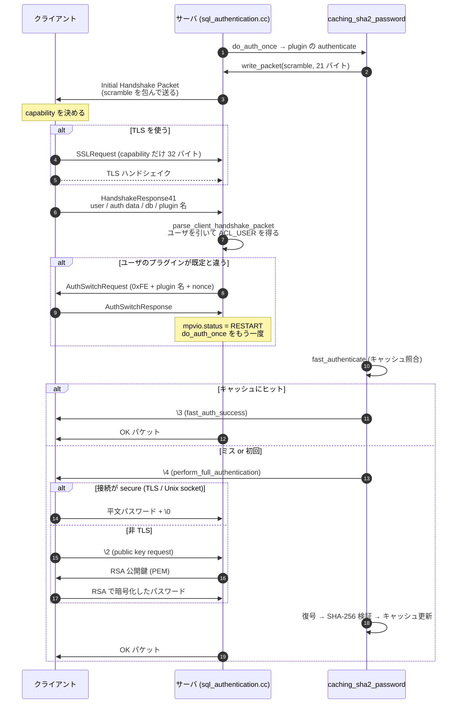

## 何を学んだか

MySQL の握手には 4 つの性質がある。

1. **サーバから話しかける。** TCP が繋がると、クライアントが何も送らないうちにサーバが Initial Handshake Packet を送る。ここに capability flag、20 バイトの nonce、既定の認証プラグイン名が入る
2. **TLS を張るなら、クライアントは握手応答を 2 回送る。** 1 回目は capability flag だけ (SSLRequest)、そこで TLS を張ってから、同じ内容をもう一度暗号化して送る
3. **認証プラグインの交渉はやり直しになる。** サーバはユーザ名を知る前に「既定のプラグイン」で握手を始めるので、そのユーザの実際のプラグインが違えば AuthSwitchRequest を送って**認証を最初からやり直す**
4. **`caching_sha2_password` は 2 経路ある。** サーバ側にハッシュのキャッシュがあれば `\3` (fast auth success) を 1 バイト返して終わり。なければ `\4` (perform full authentication) を返し、平文パスワードを安全に運ぶ経路に入る

このうち 4 の分岐が、**「同じユーザで繋いでいるのに、サーバを再起動した直後だけ接続が遅い」**という現象の正体になる。



## ソースコードのどこか

### Initial Handshake Packet の組み立て

[`send_server_handshake_packet` (`sql/auth/sql_authentication.cc#L1739`)](https://github.com/mysql/mysql-server/blob/mysql-8.4.11/sql/auth/sql_authentication.cc#L1739)。バイト配置はこの関数を上から読むとそのまま出てくる。

```
+--------+--------------------------------------------------------+
| offset | 内容                                                    |
+--------+--------------------------------------------------------+
|      0 | protocol_version (10)                                   |
|      1 | server_version, NUL 終端 ("8.4.11" など)                |
|    +0  | thread_id (4 バイト, int4store)                         |
|    +4  | auth-plugin-data-part-1 (8 バイト = AUTH_PLUGIN_DATA_PART_1_LENGTH) |
|   +12  | filler 0x00 (1 バイト)                                  |
|   +13  | capability flags 下位 16 ビット                          |
|   +15  | character_set (default_charset_info->number)            |
|   +16  | status flags (2 バイト)                                 |
|   +18  | capability flags 上位 16 ビット                          |
|   +20  | auth_plugin_data_len (1 バイト)                         |
|   +21  | reserved 0x00 x 10                                      |
|   +31  | auth-plugin-data-part-2 (len - 8 バイト)                |
|    ..  | auth_plugin_name, NUL 終端                              |
+--------+--------------------------------------------------------+
```

コードで対応するのはこの塊だ。

```cpp title="sql/auth/sql_authentication.cc"
  int2store(end, static_cast<uint16>(protocol->get_client_capabilities()));
  /* write server characteristics: up to 16 bytes allowed */
  end[2] = (char)default_charset_info->number;
  int2store(end + 3, mpvio->server_status[0]);
  int2store(end + 5, protocol->get_client_capabilities() >> 16);
  end[7] = data_len;
  DBUG_EXECUTE_IF("poison_srv_handshake_scramble_len", end[7] = -100;);
  memset(end + 8, 0, 10);
  end += 18;
  /* write scramble tail */
  end = (char *)memcpy(end, data + AUTH_PLUGIN_DATA_PART_1_LENGTH,
                       data_len - AUTH_PLUGIN_DATA_PART_1_LENGTH);
```

**capability flag が 16 ビットずつ離れた位置に置かれている**のは、4.0 のクライアントが上位 16 ビットを知らずにパケット末尾を無視できるようにするためだ。scramble を 8 + 12 に割るのも同じ理由で、コメントにこう書いてある。

```cpp title="sql/auth/sql_authentication.cc"
  /*
    Old clients does not understand long scrambles, but can ignore packet
    tail: that's why first part of the scramble is placed here, and second
    part at the end of packet.
  */
```

`data_len` は既定プラグインが渡してきたデータの長さだ。`caching_sha2_password` は 21 バイト (20 バイトの nonce + NUL) を書くので、`auth_plugin_data_len` バイトには 21 が入る。プラグインが何も渡さなかった場合は、サーバが勝手に 20 バイトを生成して埋める。この分岐にも理由が書かれている。

```cpp title="sql/auth/sql_authentication.cc"
      /*
        if the default plugin does not provide the data for the scramble at
        all, we generate a scramble internally anyway, just in case the
        user account (that will be known only later) uses a
        mysql_native_password plugin (which needs a scramble). If we don't send
        a scramble now - wasting 20 bytes in the packet - mysql_native_password
        plugin will have to send it in a separate packet, adding one more round
        trip.
      */
```

**往復を 1 回減らすために 20 バイトを常に無駄打ちする**、という判断がそのまま書いてある。

### プラグインとサーバの境界 — `MYSQL_PLUGIN_VIO`

認証プラグインはソケットを直接触らない。`write_packet` / `read_packet` の 2 つのコールバックだけを使う。サーバ側の実装は [`server_mpvio_write_packet` (L3377)](https://github.com/mysql/mysql-server/blob/mysql-8.4.11/sql/auth/sql_authentication.cc#L3377) で、**「何回目の write か」でパケットの形を変える**。

```cpp title="sql/auth/sql_authentication.cc"
  /* for the 1st packet we wrap plugin data into the handshake packet */
  if (mpvio->packets_written == 0)
    res = send_server_handshake_packet(
        mpvio, pointer_cast<const char *>(packet), packet_len);
  else if (mpvio->status == MPVIO_EXT::RESTART) {
    ...
    res = send_plugin_request_packet(mpvio, packet, packet_len);
  } else if (mpvio->status == MPVIO_EXT::START_MFA) {
    res = send_auth_next_factor_packet(mpvio, packet, packet_len);
    ...
  } else
    res = wrap_plguin_data_into_proper_command(protocol->get_net(), packet,
                                               packet_len);
```

プラグインから見れば「20 バイト書いた」だけなのに、1 回目は Initial Handshake Packet に包まれ、RESTART 中なら AuthSwitchRequest (先頭 0xFE) に包まれ、それ以外は AuthMoreData (先頭 0x01) に包まれる。**プロトコルのフレーミングを全部サーバ側に寄せることで、プラグインは「バイト列をやりとりする状態機械」だけを書けばよくなっている。**

読む側 ([`server_mpvio_read_packet` (L3435)](https://github.com/mysql/mysql-server/blob/mysql-8.4.11/sql/auth/sql_authentication.cc#L3435)) も対称で、1 回目の read だけ `parse_client_handshake_packet` を通す。

```cpp title="sql/auth/sql_authentication.cc"
  if (mpvio->packets_read == 1) {
    pkt_len = parse_client_handshake_packet(current_thd, mpvio, buf, pkt_len);
    if (pkt_len == packet_error) goto err;
  } else
    *buf = protocol->get_net()->read_pos;
```

### TLS のために握手応答を 2 回読む

[`parse_client_handshake_packet` (L2957)](https://github.com/mysql/mysql-server/blob/mysql-8.4.11/sql/auth/sql_authentication.cc#L2957) は、最初の 2 バイトだけ先読みして capability を見る。`CLIENT_SSL` が立っていたら、**そこで解析を止めて TLS を張り、パケットをもう一度読む**。

```cpp title="sql/auth/sql_authentication.cc"
  /*
    If client requested SSL then we must stop parsing, try to switch to SSL,
    and wait for the client to send a new handshake packet.
    The client isn't expected to send any more bytes until SSL is initialized.
  */
  if (protocol->has_client_capability(CLIENT_SSL)) {
    ...
    if (sslaccept(*(context.get()), protocol->get_vio(),
                  protocol->get_net()->read_timeout, &errptr)) {
      DBUG_PRINT("error", ("Failed to accept new SSL connection"));
      return packet_error;
    }

    DBUG_PRINT("info", ("Reading user information over SSL layer"));
    const int rc = protocol->read_packet();
```

2 回目のパケットはヘッダを再解析せず、長さと charset だけを検算している。

```cpp title="sql/auth/sql_authentication.cc"
    /*
      After the SSL handshake is performed the client resends the handshake
      packet but because of legacy reasons we chose not to parse the packet
      fields a second time and instead only assert the length of the packet.
    */
```

`charset_code != ssl_charset_code` なら `packet_error` にする。**TLS の前後で申告した charset が食い違うクライアントは拒否される**、という薄い整合性チェックだけがある。

`sslaccept` に渡している timeout が `protocol->get_net()->read_timeout` である点に注意。この時点では[接続層のページ](./connection-layer/)で見たとおり `connect_timeout` が張られているので、**TLS ハンドシェイク全体が `connect_timeout` の下にある**。

### プラグインの交渉 — RESTART

サーバは接続を受けた時点ではユーザ名を知らないので、`default_authentication_plugin` 相当の既定プラグイン (8.4 では `caching_sha2_password`) で始める。ユーザ名が分かった後で実際のプラグインが違うと分かったら、`mpvio.status` に `RESTART` を立てて認証をやり直す。

```cpp title="sql/auth/sql_authentication.cc"
  /*
   retry the authentication, if - after receiving the user name -
   we found that we need to switch to a non-default plugin
  */
  if (mpvio.status == MPVIO_EXT::RESTART) {
    assert(mpvio.acl_user);
    ...
    auth_plugin_name = mpvio.acl_user->plugin;
    res = do_auth_once(thd, auth_plugin_name, &mpvio);
  }
```

[`acl_authenticate` (L3981)](https://github.com/mysql/mysql-server/blob/mysql-8.4.11/sql/auth/sql_authentication.cc#L3981) の中。ここで往復が 1 回増える。

ただし逃げ道がある。クライアントが HandshakeResponse でプラグイン名を申告していて、それがサーバの求めるものと一致していたら、**キャッシュしておいた応答をそのまま使って往復を省く**。

```cpp title="sql/auth/sql_authentication.cc"
    /*
      If the data cached from the last server_mpvio_read_packet
      and a client has used the correct plugin, then we can return the
      cached data straight away and avoid one round trip.
    */
```

つまり「クライアントが先読みして正しいプラグインでハッシュを送っていれば往復は増えない」。mysql2 が `--default-auth` 相当のオプションを持つのも、この最適化を踏むためだ。

### `caching_sha2_password` の 1 バイト

プラグイン本体は [`sql/auth/sha2_password.cc`](https://github.com/mysql/mysql-server/blob/mysql-8.4.11/sql/auth/sha2_password.cc)。判定に使う 3 つの定数は 3 行で並んでいる。

```cpp title="sql/auth/sha2_password.cc"
static char request_public_key = '\2';
static char fast_auth_success = '\3';
static char perform_full_authentication = '\4';
```

[L777](https://github.com/mysql/mysql-server/blob/mysql-8.4.11/sql/auth/sha2_password.cc#L777)。プラグインは `vio->write_packet(vio, &fast_auth_success, 1)` と 1 バイト書くだけで、AuthMoreData のタグはサーバ側が付ける。

```cpp title="sql/auth/sql_authentication.cc"
static inline int wrap_plguin_data_into_proper_command(NET *net,
                                                       const uchar *packet,
                                                       int packet_len) {
  return net_write_command(net, 1, pointer_cast<const uchar *>(""), 0, packet,
                           packet_len);
}
```

[L3352](https://github.com/mysql/mysql-server/blob/mysql-8.4.11/sql/auth/sql_authentication.cc#L3352)。`net_write_command` の第 2 引数 `1` が AuthMoreData のタグ 0x01 だ ([パケットのページ](./packet-framing/))。ネットワーク上は 4 バイトヘッダ + `01 03` の計 6 バイト。**プロトコル全体で最も短い意味のあるパケットが、認証の分岐点になっている。**

分岐は [`caching_sha2_password_authenticate` (L924)](https://github.com/mysql/mysql-server/blob/mysql-8.4.11/sql/auth/sha2_password.cc#L924) の中。

```cpp title="sql/auth/sha2_password.cc"
  std::pair<bool, bool> fast_auth_result =
      g_caching_sha2_password->fast_authenticate(
          authorization_id, reinterpret_cast<unsigned char *>(scramble),
          SCRAMBLE_LENGTH, pkt,
          info->additional_auth_string_length ? true : false);

  if (fast_auth_result.first) {
    /*
      We either failed to authenticate or did not find entry in the cache.
      In either case, move to full authentication and ask the password
    */
    if (vio->write_packet(vio, (uchar *)&perform_full_authentication, 1))
      return CR_AUTH_HANDSHAKE;
  } else {
    /* Send fast_auth_success packet followed by CR_OK */
    if (vio->write_packet(vio, (uchar *)&fast_auth_success, 1))
      return CR_AUTH_HANDSHAKE;
```

キャッシュは `authorization_id` (ユーザ名 `\0` ホスト名 `\0`) をキーにした**プロセス内のメモリ上のマップ**だ。永続化されないので、**サーバを再起動すると全ユーザが full authentication からやり直しになる**。

### full authentication と RSA

full 経路では、まず「安全な transport か」を見る。

```cpp title="sql/auth/sha2_password.cc"
  if (!my_vio_is_secure(vio)) {
    /*
      Since a password is being used it must be encrypted by RSA since no
      other encryption is being active.
    */
    private_key = g_caching_sha2_rsa_keys->get_private_key();
    public_key = g_caching_sha2_rsa_keys->get_public_key();
    ...
    /*
      Client sent a "public key request"-packet ?
      If the first packet is 1 then the client will require a public key before
      encrypting the password.
    */
    if (pkt_len == 1 && *pkt == request_public_key) {
      const uint pem_length = static_cast<uint>(
          strlen(g_caching_sha2_rsa_keys->get_public_key_as_pem()));
      if (vio->write_packet(
              vio,
              pointer_cast<const uchar *>(
                  g_caching_sha2_rsa_keys->get_public_key_as_pem()),
              pem_length))
        return CR_ERROR;
      /* Get the encrypted response from the client */
      if ((pkt_len = vio->read_packet(vio, &pkt)) <= 0) return CR_ERROR;
    }
```

[L1025 付近](https://github.com/mysql/mysql-server/blob/mysql-8.4.11/sql/auth/sha2_password.cc#L1025)。TLS か Unix ドメインソケットなら平文をそのまま送ってよい。それ以外なら RSA で暗号化する。復号後には nonce との XOR を剥がす。

```cpp title="sql/auth/sha2_password.cc"
    plain_text[cipher_length] = '\0';  // safety
    xor_string((char *)plain_text, cipher_length, (char *)scramble,
               SCRAMBLE_LENGTH);
```

**この XOR は暗号強度のためではなく、リプレイ防止だ。** 同じパスワードでも接続ごとに nonce が変わるので、暗号文をそのまま再送しても通らない。

クライアント側 ([`sql-common/client_authentication.cc#L620`](https://github.com/mysql/mysql-server/blob/mysql-8.4.11/sql-common/client_authentication.cc#L620) の `caching_sha2_password_auth_client`) は、公開鍵をファイルで持っていない場合だけ `\2` を送る。

```cpp title="sql-common/client_authentication.cc"
    /* If connection isn't secure attempt to get the RSA public key file */
    if (!connection_is_secure) {
      public_key = rsa_init(mysql);

      if (public_key == nullptr && mysql->options.extension &&
          mysql->options.extension->get_server_public_key) {
        // If no public key; request one from the server.
        if (vio->write_packet(vio, (const unsigned char *)&request_public_key,
                              1))
          return CR_ERROR;
```

**`get_server_public_key` が false だとここに入れない。** `--get-server-public-key` を付けていない `mysql` クライアントが、非 TLS で `Access denied` ではなく `Authentication plugin ... reported error` になるのはこの分岐が原因だ。

### mysql2 の対比

node-mysql2 の同じプラグインは 4 状態の状態機械 1 個で書かれている。

```js title="lib/auth_plugins/caching_sha2_password.js"
const REQUEST_SERVER_KEY_PACKET = Buffer.from([2]);
const FAST_AUTH_SUCCESS_PACKET = Buffer.from([3]);
const PERFORM_FULL_AUTHENTICATION_PACKET = Buffer.from([4]);

const STATE_INITIAL = 0;
const STATE_TOKEN_SENT = 1;
const STATE_WAIT_SERVER_KEY = 2;
const STATE_FINAL = -1;
```

[`caching_sha2_password.js#L9`](https://github.com/sidorares/node-mysql2/blob/d8932925b237f07b6410263770379998df973502/lib/auth_plugins/caching_sha2_password.js#L9)。C の側と同じ 3 つのマジックナンバーが、そのまま Buffer になっている。

「secure かどうか」の判定が面白い。

```js title="lib/auth_plugins/caching_sha2_password.js"
const isSecureConnection =
  typeof pluginOptions.overrideIsSecure === "undefined"
    ? connection.config.ssl || connection.config.socketPath
    : pluginOptions.overrideIsSecure;
```

`ssl` オプションが設定されているか、`socketPath` (Unix ドメインソケット) かで判断している。サーバ側の `my_vio_is_secure` と同じ基準だ。そして 1 往復を省く逃げ道もコメント付きで用意されている。

```js title="lib/auth_plugins/caching_sha2_password.js"
// if client provides key we can save one extra roundrip on first connection
if (pluginOptions.serverPublicKey) {
  return authWithKey(pluginOptions.serverPublicKey);
}
```

`onServerPublicKey` コールバックで受け取った鍵を保存しておき、次回以降 `serverPublicKey` に渡す、というのが mysql2 の推奨パターンになっている。

## なぜそうなっているか

**サーバから話し始めるのは、nonce をサーバが決める必要があるからだ。** チャレンジ・レスポンス方式である以上、チャレンジはサーバが出す。ついでにここで server_version と capability flag を送っておけば、クライアントは 1 回の往復で「相手が何をサポートしているか」を知って自分の応答の形を決められる。TLS を後から張れるのも、最初の 1 パケットで capability を交換してあるからだ。

**プラグインの交渉が「やり直し」になるのは、ユーザ名がパスワードより後に来るという順序問題を解いていないからだ。** 握手の 1 パケット目でユーザ名を先に貰えれば、正しいプラグインで nonce を出せる。だが 1 パケット目はサーバが送るので、その時点ではユーザ名がない。クライアントの HandshakeResponse に「ユーザ名 + 既定プラグインで作ったハッシュ」を詰めさせ、ハズレならやり直す、という設計はプロトコルの往復を最短にしようとした結果で、キャッシュ (`cached_client_reply`) で当たりの場合だけ救っている。

**`caching_sha2_password` のキャッシュは「SHA-256 の反復回数を毎回払わないため」にある。** ディスクに置くハッシュは意図的に遅く、`DEFAULT_STORED_DIGEST_ROUNDS` は `ROUNDS_DEFAULT` = 5000 回だ ([`i_sha2_password.h#L71`](https://github.com/mysql/mysql-server/blob/mysql-8.4.11/sql/auth/i_sha2_password.h#L71)、[`crypt_genhash_impl.h#L30`](https://github.com/mysql/mysql-server/blob/mysql-8.4.11/include/crypt_genhash_impl.h#L30))。対してキャッシュに載る fast 用のダイジェストは **`DEFAULT_FAST_DIGEST_ROUNDS = 2`** ([L48](https://github.com/mysql/mysql-server/blob/mysql-8.4.11/sql/auth/i_sha2_password.h#L48))。5000 対 2 という比が、fast auth の速さの正体だ。**永続化しないのは、fast 用のダイジェストが漏れるとそれだけで認証を通せてしまうからで、**「メモリにしか置かない」という制約とセットで初めて成立する。再起動でキャッシュが飛ぶのは、この設計のコストとして受け入れられている。

**平文パスワードを full authentication で要求するのは、キャッシュを作るために元のパスワードが要るからだ。** `mysql_native_password` は「パスワードの SHA1 の SHA1」をサーバに置いておけばチャレンジ・レスポンスが成立する。`caching_sha2_password` は salt 付きの遅いハッシュなので、チャレンジ・レスポンスだけでは検証できない。だから初回は平文が要り、それを守るために TLS か RSA が要る。**「安全でない経路のときだけ RSA を挟む」という条件分岐が入るのは、この必要性から来ている。**

## どう活かすか

**サーバを再起動した直後の接続だけ遅いのは、キャッシュが空だからだ。** `caching_sha2_password` のキャッシュはプロセスメモリなので、再起動・フェイルオーバー後の最初のラッシュで全接続が full authentication を通る。非 TLS なら RSA の往復が 2 回増え、`caching_sha2_password_digest_rounds` 回の SHA-256 が接続ごとに回る。`Threads_connected` が張り付いたまま、CPU が認証で溶ける状態になりうる。TLS を張っておけば RSA の往復は消える (平文を TLS 上でそのまま送る経路になる)。

**`Authentication plugin 'caching_sha2_password' reported error: Authentication requires secure connection` は、TLS でも Unix socket でもなく、かつ RSA 鍵がない状態だ。** サーバ側の分岐はこう。

```cpp title="sql/auth/sha2_password.cc"
    /* Without the keys encryption isn't possible. */
    if (private_key == nullptr || public_key == nullptr) {
      if (caching_sha2_auth_plugin_ref)
        LogPluginErr(ERROR_LEVEL, ER_SHA_PWD_AUTH_REQUIRES_RSA_OR_SSL);
      return CR_ERROR;
    }
```

`caching_sha2_password_auto_generate_rsa_keys` が有効なら初回起動時に自動生成されるので、通常は鍵の不在ではなくクライアント側の `--get-server-public-key` 不足のほうが原因になる。

**接続が遅いとき、どの往復が増えているかを数える。** 最短ケース (TLS なし、キャッシュヒット、プラグイン一致) は 3 往復。

| 条件                                              | 増える往復                               |
| ------------------------------------------------- | ---------------------------------------- |
| TLS を使う                                        | +1 (SSLRequest) + TLS ハンドシェイク本体 |
| クライアントがプラグイン名を申告していない / 違う | +1 (AuthSwitchRequest / Response)        |
| full authentication かつ非 TLS かつ公開鍵未保持   | +2 (public key request / PEM 応答)       |

コネクションプールを持たないアプリで接続あたりのレイテンシが問題になるなら、この表のどこを踏んでいるかを潰す。プールを持つなら、そもそも接続の張り直しを減らすほうが効く ([接続層のページ](./connection-layer/))。

**`--skip-name-resolve` と認証は別物だ。** 逆引きは `check_connection` の中、`acl_authenticate` の前に走る ([接続層のページ](./connection-layer/))。認証が遅いのか逆引きが遅いのかは、`performance_schema.host_cache` の行数と `Connection_errors_*` で切り分ける。

**ユーザのプラグインを変えると往復数が変わる。** `ALTER USER ... IDENTIFIED WITH mysql_native_password` のように既定と違うプラグインにすると、プラグイン名を申告しないクライアントは毎回 AuthSwitchRequest を踏む。しかも 8.4 では `mysql_native_password` の宣言に `PLUGIN_OPT_DEFAULT_OFF` が付いていて ([`sql/auth/mysql_native_password.cc#L327`](https://github.com/mysql/mysql-server/blob/mysql-8.4.11/sql/auth/mysql_native_password.cc#L327))、明示的に有効化しない限りロードすらされない。握手を始めるプラグインは `initial_auth_plugin_name` (`authentication_policy` の第 1 因子から来る) があればそれ、なければ [`default_auth_plugin_name` (`sql_authentication.cc#L1168`)](https://github.com/mysql/mysql-server/blob/mysql-8.4.11/sql/auth/sql_authentication.cc#L1168) の `caching_sha2_password` だ。8.0 の `default_authentication_plugin` は 8.4 には存在せず、[`authentication_policy` (`sys_vars.cc#L7381`)](https://github.com/mysql/mysql-server/blob/mysql-8.4.11/sql/sys_vars.cc#L7381) (既定 `"*,,"`) に置き換わっている。

**RSA 公開鍵を先に配るとレイテンシが減る。** サーバの `caching_sha2_password_public_key_path` の PEM をクライアント側に置いて `--server-public-key-path` (mysql2 なら `serverPublicKey` プラグインオプション) を指定すれば、full authentication でも公開鍵の往復は消える。TLS を張らずに RTT の大きい経路で繋ぐ場合に効く。
