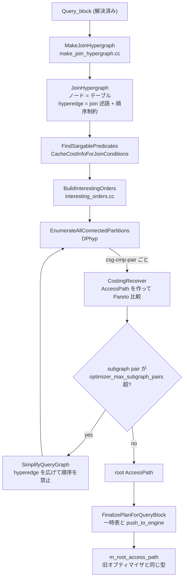

> **前提**: [AccessPath](./access-path-tree/) / [join 順序](./join-order-search/)

## 何を学んだか

hypergraph オプティマイザは 8.4 のツリーに完全な形で入っているが、**release ビルドでは有効化できない**。まずこの事実を確定させておく。

有効化の可否はコンパイル時に決まる。

```cmake title="CMakeLists.txt (L2234-2243)"
# The hypergraph optimizer is default on only for debug builds.
IF(CMAKE_BUILD_TYPE_UPPER STREQUAL "DEBUG" OR WITH_DEBUG)
  SET(WITH_HYPERGRAPH_OPTIMIZER_DEFAULT ON)
ELSE()
  SET(WITH_HYPERGRAPH_OPTIMIZER_DEFAULT OFF)
ENDIF()
OPTION(WITH_HYPERGRAPH_OPTIMIZER
  "Allow use of the hypergraph join optimizer"
  ${WITH_HYPERGRAPH_OPTIMIZER_DEFAULT}
  )
```

`WITH_HYPERGRAPH_OPTIMIZER` が OFF のビルドで `optimizer_switch` を立てようとすると、変数の検証フックが弾く ([`check_optimizer_switch` (`sql/sys_vars.cc#L3233`)](https://github.com/mysql/mysql-server/blob/mysql-8.4.11/sql/sys_vars.cc#L3233))。

```cpp title="sql/sys_vars.cc (L3247-3257)"
  } else if (!current_hypergraph_optimizer && want_hypergraph_optimizer) {
#ifdef WITH_HYPERGRAPH_OPTIMIZER
    // Allow, with a warning.
    push_warning(thd, Sql_condition::SL_WARNING, ER_WARN_DEPRECATED_SYNTAX,
                 ER_THD(thd, ER_WARN_HYPERGRAPH_EXPERIMENTAL));
    return false;
#else
    // Disallow; the hypergraph optimizer is not ready for production yet.
    my_error(ER_HYPERGRAPH_NOT_SUPPORTED_YET, MYF(0),
             "use in non-debug builds");
    return true;
#endif
  }
```

つまり**公式バイナリでも、自分で release ビルドしても、`SET optimizer_switch='hypergraph_optimizer=on'` はエラーになる**。debug ビルド (`-DWITH_DEBUG=1`) を自分で作るか、`mtr --hypergraph` でテストを回すかしか触る手段がない。

それでも読む価値があるのは、**出力が同じ `AccessPath` の木**だからだ ([AccessPath のページ](./access-path-tree/))。差し替わるのは探索の部分だけで、エグゼキュータも `EXPLAIN FORMAT=TREE` もそのまま動く。



## なぜそうなっているか

**制約を hyperedge に埋め込んだのは、探索アルゴリズムを制約から独立させるためだ。** 旧オプティマイザでは、探索ループの中で `check_interleaving_with_nj` を呼び、失敗したら `backout_nj_state` で状態を巻き戻す、という手続き的な管理が要った。制約をグラフの形にしてしまえば、DPhyp は「連結な部分グラフを列挙する」という純粋な仕事だけをすればよい。**outer join、antijoin、LATERAL、さらにハイパー述語 (`t1.a + t2.b = t3.c`) まで、すべて「辺の形」として統一的に表せる**のがこの表現の力だ。

**動的計画法にしたのは、部分問題の重複を潰すためだ。** 貪欲探索は「同じテーブルの集合に到達する経路」を何度も評価する。DP なら部分集合ごとに最良のパスを 1 つ (正確には Pareto フロンティア) 覚えておけばよい。代わりにメモリを食い、部分集合の数が指数的に増えるので、上限と簡約が必要になる。

**簡約が「グラフを複雑にして探索空間を狭める」という逆説的な形なのは、DPhyp の枠組みを再利用したいからだ。** グラフ簡約の doc comment が明言している — 「別の大規模クエリ用プランナとコストモデルを実装せずに、既存の機構をほぼ全部再利用できる」。40 テーブル以上では LinDP++ のほうが良い結果を出すと知りつつ、実装コストとのトレードオフでこちらを選んでいる。

**const table を畳み込まないのは、最適化フェーズを純粋にしたかったからだろう。** 旧オプティマイザは最適化中に const table を読み、MIN/MAX を評価し、サブクエリを実行することがある。これは EXPLAIN がロックを取ったり I/O を起こしたりする原因になり、プランのキャッシュも難しくする。hypergraph はそれをやめた。代わりに「1 行しかないテーブル」の恩恵は受けられないので、コストモデルで拾う必要がある。

**8.4 で production 化されていないのは、コスト品質の問題が残っているからだ。** 構文カバレッジは `CheckSupportedQuery` が空同然になったことで解決している。グラフ簡約の doc comment が言う「アクセスパスの枝刈りが欠けている」や、コストモデルの調整が積み残しになっている。`ER_WARN_HYPERGRAPH_EXPERIMENTAL` という警告が debug ビルドでも出るのは、その表明だ。

## ソースコードのどこか

### ファイル構成

`sql/join_optimizer/` は 45 ファイルあり、うち hypergraph 専用のものはこれだ。

| ファイル                  | 行数      | 役割                                                       |
| ------------------------- | --------- | ---------------------------------------------------------- |
| `join_optimizer.cc`       | 8273      | `CostingReceiver` と `FindBestQueryPlan`。本体             |
| `make_join_hypergraph.cc` | 3875      | `Query_block` → ハイパーグラフの変換                       |
| `interesting_orders.cc`   | 2321      | 「役に立つ並び」の追跡 (functional dependency も)          |
| `access_path.cc`          | 1633      | `CreateIteratorFromAccessPath`。**旧オプティマイザと共有** |
| `graph_simplification.cc` | 1049      | 探索空間が広すぎるときの縮約                               |
| `cost_model.cc`           | 1023      | hypergraph 用のコスト計算                                  |
| `subgraph_enumeration.h`  | 695       | DPhyp。**ヘッダのみの template**                           |
| `hypergraph.cc` / `.h`    | 140 / 118 | グラフのデータ構造                                         |

`access_path.h` / `access_path.cc` が同じディレクトリにあるのは歴史的経緯で、**AccessPath は hypergraph のために導入された型が旧オプティマイザに逆輸入されたもの**だからだ。

### ハイパーグラフとは何か

`hypergraph.h` の冒頭が定義そのものだ。

```cpp title="sql/join_optimizer/hypergraph.h"
  Definition of an undirected (join) hypergraph. A hypergraph in this context
  is an undirected graph consisting of nodes and hyperedges, where hyperedges
  are edges that can have more than one node in each side of the edge.
  For instance, in a graph with nodes {A, B, C, D}, a regular undirected edge
  could be e.g. (A,B), while in a hypergraph, an edge such as ({A,C},B) would
  also be allowed. Note that this definition of hypergraphs differs from that
  on Wikipedia.
```

ノードがテーブル、辺が join 述語だ。**辺の片側が複数ノードになれるのが hyperedge** で、これが outer join や antijoin の順序制約を表現する。

```cpp title="sql/join_optimizer/hypergraph.h"
struct Hyperedge {
  // The endpoints (hypernodes) of this hyperedge. See the comment about
  // duplicated edges in Node.
  //
  // left and right may not overlap, and both must have at least one bit set.
  NodeMap left;
  NodeMap right;
};
```

`NodeMap` は 64bit のビットマップで、テーブル 1 枚が 1 ビット。`({A,C}, B)` という辺は「B を join する前に A と C の両方が揃っていなければならない」を意味する。

**旧オプティマイザで `check_interleaving_with_nj` が動的にやっていた「括弧を跨げない」判定が、グラフの構造として静的に表現されている** ([join 順序のページ](./join-order-search/))。これが最大の設計差だ。制約が辺に埋まっているので、探索アルゴリズムは制約を知らなくてよくなる。

`Node` は 64 バイトにパディングされている。

```cpp title="sql/join_optimizer/hypergraph.h"
 private:
  // Speeds up BM_HyperStar17_ManyHyperedges by 5–10%.
  // (MSVC with debug STL will get a dummy byte here, since the struct is
  // already more than 64 bytes.)
  static constexpr int Size =
      sizeof(std::vector<unsigned>) * 2 + sizeof(NodeMap);
  char padding[std::max<int>(1, 64 - Size)];
};
static_assert(sizeof(Node) >= 64);
```

キャッシュラインに合わせるためのパディングと、その効果 (5〜10%) をベンチマーク名付きで書いてある。**プランニングの速度が問題になる領域だ**という認識が滲んでいる。

辺を双方向に複製しているのも同じ理由で、分岐予測ミスを 30% 減らせるとコメントにある。

### DPhyp

探索アルゴリズムは [`subgraph_enumeration.h`](https://github.com/mysql/mysql-server/blob/mysql-8.4.11/sql/join_optimizer/subgraph_enumeration.h) の DPhyp で、695 行の header-only template だ。冒頭に出典と手順がある。

```cpp title="sql/join_optimizer/subgraph_enumeration.h"
  The algorithm is described in the paper “Dynamic Programming Strikes
  Back” by Neumann and Moerkotte. There is a somewhat extended version
  of the paper (that also contains a few corrections) in Moerkotte's
  treatise “Building Query Compilers”. Some critical details are still
  missing, which we've had to fill in ourselves.
  ...
    1. Pick a seed node of the graph.
    2. Grow that seed along hyperedges, taking care never to make an
       unconnected graph or seeing the same subgraph twice.
    3. For each connected subgraph (csg): Repeat steps 1–2 independently
       to create a separate connected subgraph (the so-called complement,
       cmp), and try to connect the subgraph and its complement to create
       a larger graph (a so-called csg-cmp-pair).
    4. When such a csg-cmp-pair is found, call the receiver back with the
       csg and cmp. This is a valid subjoin that can be costed.
```

**「csg-cmp-pair を全部列挙する」**のが仕事で、その 1 つ 1 つが「この部分集合とこの部分集合を join する」という候補になる。テンプレートになっているのは、数を数えるだけのモードと実際にコストを付けるモードを同じコードで回すためだ。

```cpp title="sql/join_optimizer/subgraph_enumeration.h"
  For complex joins, we may have to run DPhyp multiple times in a mode
  where we just count the number of partitions over various constrained
  graphs, and this will be a critical part of query planning time.
  Thus, it is coded as a template over a receiver type that gets callbacks
  for each partition.
```

旧オプティマイザとの違いを整理するとこうなる。

|                        | 旧オプティマイザ                          | hypergraph                                              |
| ---------------------- | ----------------------------------------- | ------------------------------------------------------- |
| 探索                   | 貪欲 + 深さ制限つき全探索                 | DPhyp (動的計画法)                                      |
| 順序制約               | `check_interleaving_with_nj` が動的に判定 | hyperedge としてグラフに埋め込み                        |
| join の形              | 左深 (left-deep) のみ                     | bushy plan も作れる                                     |
| const table            | 最適化中に読んで畳み込む                  | **やらない** (`OPTION_NO_CONST_TABLES`)                 |
| サブクエリ             | 最適化中に評価することがある              | **やらない** (`OPTION_NO_SUBQUERY_DURING_OPTIMIZATION`) |
| 並び                   | `test_if_skip_sort_order` が事後に判定    | `interesting_orders.cc` が探索中に追跡                  |
| 探索空間が広すぎるとき | `optimizer_search_depth` で打ち切り       | グラフを簡約して再実行                                  |

const table とサブクエリの扱いは `JOIN::optimize` の分岐で明示される。

```cpp title="sql/sql_optimizer.cc (L459-462)"
    // The hypergraph optimizer does not do const tables,
    // nor does it evaluate subqueries during optimization.
    query_block->add_active_options(OPTION_NO_CONST_TABLES |
                                    OPTION_NO_SUBQUERY_DURING_OPTIMIZATION);
```

**最適化フェーズで I/O を起こさない**という点で、hypergraph のほうが素直な設計になっている ([JOIN::optimize のページ](./optimizer-walkthrough/))。

### 探索空間が爆発したとき

DPhyp は csg-cmp-pair の数だけ仕事をするので、テーブルが増えると爆発する。上限は `optimizer_max_subgraph_pairs` (既定 100000、[`sys_vars.cc#L3146`](https://github.com/mysql/mysql-server/blob/mysql-8.4.11/sql/sys_vars.cc#L3146)) で、超えたら**グラフを簡約してやり直す**。

```cpp title="sql/join_optimizer/join_optimizer.cc (L7831-7838)"
  } else if (EnumerateAllConnectedPartitions(graph.graph, &receiver) &&
             !thd->is_error() && join->zero_result_cause == nullptr) {
    GraphSimplifier simplifier(thd, &graph);
    do {
      *subgraph_pair_limit = receiver.subgraph_pair_limit();
      SetNumberOfSimplifications(0, &simplifier);
      SimplifyQueryGraph(thd, *subgraph_pair_limit, &graph, &simplifier);
```

簡約の中身は [`graph_simplification.h`](https://github.com/mysql/mysql-server/blob/mysql-8.4.11/sql/join_optimizer/graph_simplification.h) の冒頭に書いてある。

```cpp title="sql/join_optimizer/graph_simplification.h"
  The algorithm works by evaluating pairs of neighboring joins
  (largely, those that touch some of the same tables), finding obviously _bad_
  pairwise orderings and then disallowing them. I.e., if join A must
  very likely happen before join B (as measured by cost heuristics),
  we disallow the B-before-A join by extending the hyperedge of
  B to include A's nodes. This makes the graph more visually complicated
  (thus making “simplification” a bit of a misnomer), but reduces the search
  space, so that the query generally is faster to plan.
```

**「join B の hyperedge を広げて A のノードを含める」ことで、B を A より先に置く順序を禁止する。** グラフは見た目には複雑になるが、探索空間は狭まる。「simplification は誤称だ」と自分で書いている。

正直な留保も付いている。

```cpp title="sql/join_optimizer/graph_simplification.h"
  Obviously, as the algorithm is greedy, it will sometimes make mistakes
  and make for a more expensive (or at least higher-cost) query.
  This isn't necessarily an optimal or even particularly good algorithm;
  e.g. LinDP++ [Rad19] claims significantly better results, especially
  on joins that are 40 tables or more.
  ...
  Also note that graph simplification only addresses the problem of subgraph
  pair explosion. If each subgraph pair generates large amounts of candidate
  access paths (e.g. through parameterized paths), each subgraph pair will in
  itself be expensive, and graph simplification does not concern itself with
  this at all. Thus, to get a complete solution, we must _also_ have heuristic
  pruning of access paths within a subgraph, which we're currently missing.
```

**「完全な解にはアクセスパスの枝刈りも要るが、それは今欠けている」**と書かれている。8.4 時点で production 化されていない理由の一端がここにある。

### 全体の再試行

さらに外側にもう 1 段のループがある ([`FindBestQueryPlan` (L8260)](https://github.com/mysql/mysql-server/blob/mysql-8.4.11/sql/join_optimizer/join_optimizer.cc#L8260))。

```cpp title="sql/join_optimizer/join_optimizer.cc"
AccessPath *FindBestQueryPlan(THD *thd, Query_block *query_block) {
  assert(thd->variables.optimizer_max_subgraph_pairs <
         ulong{std::numeric_limits<int>::max()});
  int next_retry_subgraph_pairs =
      static_cast<int>(thd->variables.optimizer_max_subgraph_pairs);
  bool retry = false;
  AccessPath *root_path = FindBestQueryPlanInner(thd, query_block, &retry,
                                                 &next_retry_subgraph_pairs);
  if (retry) {
    root_path = FindBestQueryPlanInner(thd, query_block, &retry,
                                       &next_retry_subgraph_pairs);
  }
  return root_path;
}
```

得られたプランの品質が悪すぎると判断されたら、上限を変えてもう 1 回だけ全体を回す。**再試行は高々 1 回**である。

### サポート外のクエリ

[`CheckSupportedQuery` (L5748)](https://github.com/mysql/mysql-server/blob/mysql-8.4.11/sql/join_optimizer/join_optimizer.cc#L5748) は、8.4 時点ではセカンダリエンジンのケースしか見ない。

```cpp title="sql/join_optimizer/join_optimizer.cc"
bool CheckSupportedQuery(THD *thd) {
  if (thd->lex->m_sql_cmd != nullptr &&
      thd->lex->m_sql_cmd->using_secondary_storage_engine() &&
      !Overlaps(EngineFlags(thd),
                MakeSecondaryEngineFlags(
                    SecondaryEngineFlag::SUPPORTS_HASH_JOIN,
                    SecondaryEngineFlag::SUPPORTS_NESTED_LOOP_JOIN))) {
    my_error(ER_HYPERGRAPH_NOT_SUPPORTED_YET, MYF(0),
             "the secondary engine in use");
    return true;
  }
  return false;
}
```

初期の hypergraph は「対応していない構文」が大量にあり、この関数が長かった。8.4 ではほぼ空になっていて、**構文カバレッジの問題はもう解決している**ことが分かる。残っているのはコスト品質と性能の問題だ。

### EXPLAIN の制約

hypergraph を有効にすると、`EXPLAIN` の伝統的な表形式が使えなくなる。エラーは 2 箇所から出る。

```cpp title="sql/opt_explain.cc (L2305-2310)"
  if (query_thd->lex->using_hypergraph_optimizer() &&
      !fake_explain_for_secondary_engine) {
    // With hypergraph, JSON is iterator-based. So it must be TRADITIONAL.
    my_error(ER_HYPERGRAPH_NOT_SUPPORTED_YET, MYF(0),
             "EXPLAIN with TRADITIONAL format");
    return true;
  }
```

もう 1 箇所は単一テーブル更新用の [L1921](https://github.com/mysql/mysql-server/blob/mysql-8.4.11/sql/opt_explain.cc#L1921)。**hypergraph では `EXPLAIN FORMAT=TREE` (または iterator ベースの JSON) しか使えない。**

理由は構造的だ。伝統的な表形式は `QEP_TAB` の配列を 1 行ずつ印字する形で書かれているが、hypergraph は `QEP_TAB` を作らない。木しか無いので、木を印字する形式しか出せない。

## どう活かすか

### 8.4 の運用では触れない

まずこれを確定させる。**`optimizer_switch='hypergraph_optimizer=on'` は release ビルドでエラーになる。** 「試しに on にしてみる」ことはできない。ドキュメントや記事で hypergraph の話を読んで期待しても、8.4 LTS では選択肢に入らない。

`SHOW VARIABLES LIKE 'optimizer_switch'` の出力には `hypergraph_optimizer=off` が並んでいるので、「on にできるはず」と誤解しやすい。フラグの存在と使用可否は別である ([ヒントと optimizer_switch](./optimizer-hints-and-switches/))。

### `optimizer_max_subgraph_pairs` は既定で意味を持たない

`optimizer_max_subgraph_pairs` (既定 100000) は `HINT_UPDATEABLE` なセッション変数で `SET_VAR` から変えられるが、**hypergraph が動かない環境では完全に無視される**。help 文にも `Ignored by the old (non-hypergraph) join optimizer` と書いてある。旧オプティマイザで探索を制御したいなら `optimizer_search_depth` と `optimizer_prune_level` のほうだ ([join 順序のページ](./join-order-search/))。

### 触りたいなら debug ビルド

検証したい場合の手順はこうなる。

```sh
cmake .. -DWITH_DEBUG=1 -DWITH_HYPERGRAPH_OPTIMIZER=ON
```

その上で `SET optimizer_switch='hypergraph_optimizer=on'` を打つと、`ER_WARN_HYPERGRAPH_EXPERIMENTAL` の警告付きで有効になる。ただし debug ビルドは `ut_ad` などの assert が生きた**別のプログラム**で、性能も挙動も production とは違う。プラン品質の比較には使えるが、実行時間の比較には使えない。

MTR には `--hypergraph` オプションがあり、テストスイート全体を hypergraph で回せる。`SET optimizer_switch = DEFAULT` で hypergraph が off にならないという例外は、このテスト実行を途中で壊さないための配慮だった。

### 旧オプティマイザの弱点を知る手がかりとして読む

hypergraph が解こうとしている問題は、そのまま**旧オプティマイザの弱点の一覧**になっている。

| hypergraph の改善点       | 旧オプティマイザで踏む問題                                                                    |
| ------------------------- | --------------------------------------------------------------------------------------------- |
| bushy plan                | 左深にしかできないので、大きな中間結果を避けられないことがある                                |
| hyperedge による制約表現  | `LEFT JOIN` を挟むと探索空間が極端に狭くなる                                                  |
| interesting orders の追跡 | ソート回避が先頭テーブルの事後判定でしかできない ([ORDER BY](./sort-avoidance-and-ordering/)) |
| DP による部分問題の共有   | 同じ部分集合を何度も評価し、O(N!) になる                                                      |
| 最適化中に I/O をしない   | EXPLAIN が MDL 待ちや index dive で止まる                                                     |

これらは 8.4 では「そういうものだ」として受け入れて回避するしかない。`STRAIGHT_JOIN` で順序を固定する、派生表に切り出して探索空間を分割する、`NO_ORDER_INDEX` でソート用インデックスの乗り換えを止める、といった手当てが必要になる理由が、hypergraph 側の設計を読むとはっきりする。

### 変わらないものを確認しておく

hypergraph に移っても変わらないものも多い。

- **`AccessPath` の木**。出力は同じ型で、iterator への変換コードも共有 ([AccessPath のページ](./access-path-tree/))
- **`records_in_range` と `rec_per_key`**。統計は handler 経由で同じものを使う ([統計とコストモデル](./statistics-and-cost-model/))
- **range 分析**。`test_quick_select` は hypergraph からも呼ばれる ([range 分析](./range-optimizer/))
- **コスト定数**。`Server_cost_constants` は `Optimizer::kHypergraph` の分岐を持つが、8.4 では値が同一
- **エグゼキュータ**。iterator は 1 つも変わらない ([エグゼキュータのページ](./executor-walkthrough/))

差し替わるのは「join 順序と join アルゴリズムの探索」だけだ。**インデックスが使われない、統計が古い、といった問題は hypergraph でも同じように起きる。**
