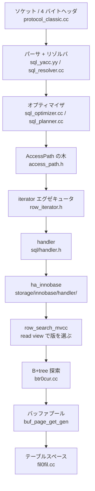

`SELECT * FROM t WHERE id = 1` と打ってから 1 行が返るまでに、MySQL は 10 を超える層を通る。ソケットから 4 バイトのヘッダを読み、Bison の生成した LALR パーサに通し、コストを見積もって走査方法を選び、iterator の木を組み立て、`handler` という抽象を通して InnoDB を呼び、B+tree を根から葉まで降り、バッファプールにページを載せ、レコードのバイト列を MySQL の行フォーマットに詰め替えて、また 4 バイトのヘッダを付けて返す。

この章はその縦の道を、上から順に下る。

## なぜ層で読むのか

MySQL の運用でぶつかる問題は、ほぼ全部「どの層の話なのか」を取り違えると解けない。

「インデックスがあるのに使われない」は、統計 (`rec_per_key`) の層かもしれないし、暗黙の型変換で `Item` ツリーが変わった層かもしれないし、range 分析が区間を作れなかった層かもしれない。「ALTER が固まる」は MDL の層の話で、InnoDB のロックとは別の機構だ。「レプリカが遅れる」の `Seconds_Behind_Source` は receiver と applier のどちらの遅れも同じ数字に潰してしまう。

だから各ページは、まずその層の中で閉じた説明をして、最後の「どう活かすか」で現象に接続する。逆に現象から引きたいときのために、最終ページに[症状索引](./symptom-index/)を置いた。

## 2 種類のページ

- **walkthrough** (13 枚) — 層ごとの配線と制御フローを固定する。`この層の責務 / 主要な型とその関係 / 処理の流れ / 守られている不変条件 / つまずきどころ` の形
- **lesson** — 設計理由を 1 つずつ切り出す。`何を学んだか / ソースコードのどこか / なぜそうなっているか / どう活かすか` の形
- **reference** — 通読ではなく引くためのページ。[用語集](./glossary/)と[症状索引](./symptom-index/)の 2 枚

先に walkthrough で経路を通し、そこから lesson に降りる読み方を想定している。

## 分離レベルの基準

InnoDB の説明はすべて **REPEATABLE READ (InnoDB 既定) を基準**に書く。READ COMMITTED で挙動が変わる箇所は、該当ページごとに注記する。RC で運用している読者は、その注記だけを拾えば差分が分かるようにしてある。

## この OSS について

MySQL Server は 30 年近く継ぎ足されてきたコードベースで、**同じ問題への解が世代ごとに層をなして残っている**のが読みどころになる。8.4 LTS の時点でも、Bison 由来の 18000 行の文法ファイルと、2020 年代に入ってから書かれた hypergraph オプティマイザが同じツリーに同居している。

読んでいて特に面白いのは次のあたりだ。

- **`handler` という 20 年前の抽象が今も境界であること。** SQL 層は行を `TABLE::record[0]` というバイト列で受け取り、InnoDB はそこに詰め替える。この境界のせいで ICP や MRR のような「述語をエンジンに降ろす」最適化が、後付けの API として並んでいる
- **オプティマイザの出力が実行の入力として型で表現し直されたこと。** 旧オプティマイザも hypergraph も、最後は同じ `AccessPath` の木を出す。`EXPLAIN FORMAT=TREE` が読みやすいのはこの構造のおかげだ
- **InnoDB のロックが「ページ単位の bitmap」であること。** `lock_t` は行 1 件ではなくページ 1 枚に対応し、その中のヒープ番号にビットが立つ。next-key lock がフラグ 0 (`LOCK_ORDINARY`) で表されるのも、この表現から来ている
- **耐久性の実装が lock-free に寄せられたこと。** redo ログバッファへの書き込みは `Link_buf` という リングで調停され、log writer / flusher / notifier の 4 スレッドが並行に進む
- **8.4 で消えたもの、既定が変わったもの。** change buffer は既定 OFF になり、`I_S.INNODB_LOCKS` は消え、レプリカの依存追跡は WRITESET 固定になった。8.0 時代の記事がそのまま当てはまらない箇所が増えている

## まず読む 13 ページ

103 ページある。全部読む必要はない。**縦の道が 1 本通ればあとは辞書として引ける**ので、最初はこの 13 ページだけを順に読むことを勧める。

1. [用語集](./glossary/) — 通読しなくていい。知らない語に当たったら戻ってくる
1. [ソースの読み方](./reading-mysql-source/) — `ut_ad` が消えること、`true` がエラーであること。これは通読する
1. [SELECT の一生](./life-of-a-select/) — 1 行が返るまでの全経路を 1 ページで
1. [UPDATE の一生](./life-of-an-update/) — 書き込み側の全経路
1. [パーサとリゾルバ](./parser-walkthrough/) — 文字列が `Query_block` になるまで
1. [JOIN::optimize](./optimizer-walkthrough/) — 最適化の段階の順番
1. [AccessPath](./access-path-tree/) — この章で一番効く型
1. [iterator executor](./executor-walkthrough/) — `Read()` のループ
1. [handler](./handler-walkthrough/) — Server と InnoDB の境界
1. [バッファプール](./buffer-pool-walkthrough/) — InnoDB の全読み書きの入口
1. [read view と可視性](./read-view-and-visibility/) — MVCC の実体
1. [ロックの種類](./lock-modes-and-types/) — next-key lock まで
1. [redo ログ](./redo-log-walkthrough/) — 耐久性の本体

現象のほうが先にあるなら、この 13 ページの代わりに[症状索引](./symptom-index/)から引いてもいい。各行が「その症状はどの層の話か」に答えるので、そこから該当ページに降りられる。

以下は層の順に並べた全ページの目次で、上から順に読めるようになっている。各ページの冒頭には前提になるページへのリンクを置いたので、途中から入っても遡れる。

## 読む順番

前提 — 用語と DB の基礎:

- [用語集 — THD・latch・mtr が指すもの](./glossary/)
- [ソースの読み方 — 1 つのツリーに 2 つの方言がある](./reading-mysql-source/)
- [ページとバッファ — ディスクはブロック単位でしか読めない](./page-and-buffer/)
- [B+tree — 点検索と範囲検索を 1 つの構造で](./btree-basics/)
- [WAL — ページを書く前にログを書く](./wal-and-recovery-basics/)
- [MVCC — 読む人を待たせない](./mvcc-basics/)
- [分離レベルとアノマリ — SQL 標準と InnoDB の RR](./isolation-levels-and-anomalies/)
- [ロックの種類 — 共有・排他・意図・範囲、そしてメタデータ](./lock-kinds/)
- [pluggable storage engine — Server と InnoDB の分割線](./pluggable-storage-engine/)

全体像:

- [プロセスとスレッド — 接続ごとに 1 本、背景に十数本](./thread-model/)
- [ディレクトリ地図 — `sql/` と `storage/innobase/`](./directory-map/)
- [SELECT の一生 — 1 行が返るまで](./life-of-a-select/)
- [UPDATE の一生 — ロック、undo、redo、binlog、commit](./life-of-an-update/)

接続とプロトコル:

- [接続層 — acceptor から THD の生成と再利用まで](./connection-layer/)
- [ハンドシェイクと認証 — caching_sha2_password の fast/full](./handshake-and-auth/)
- [パケット — 4 バイトヘッダ、16MB 分割、圧縮](./packet-framing/)
- [テキストプロトコル — COM_QUERY と結果セット、OK/ERR/EOF](./text-protocol-and-resultset/)
- [prepared statement — バイナリプロトコルと再準備](./binary-protocol-prepared-statements/)
- [クライアント側 — store か use か、非同期 API](./client-library-and-streaming/)
- [X Protocol — protobuf と 5 バイトフレーム](./x-protocol-messages/)
- [X Plugin — SQL も CRUD も classic と同じ経路に合流する](./x-plugin-session-and-sql/)
- [X Plugin のスレッドとパイプライン — イベントループと notice](./x-plugin-threading-and-pipelining/)

パーサとリゾルバ:

- [パーサとリゾルバ — 文字列から Query_block まで](./parser-walkthrough/)
- [2 パス — 文脈自由な PT ツリーと contextualize](./parse-tree-and-contextualize/)
- [名前解決と Item ツリー — fix_fields と照合の集約](./name-resolution-and-items/)
- [ダイジェスト — 正規化したクエリの指紋](./statement-digest/)

オプティマイザ:

- [JOIN::optimize — 段階の順番](./optimizer-walkthrough/)
- [統計とコストモデル — rec_per_key と server_cost](./statistics-and-cost-model/)
- [range 分析 — WHERE を区間に変える](./range-optimizer/)
- [アクセスパスの選択 — ref / range / scan、ICP と MRR](./access-path-selection/)
- [join 順序 — greedy search と枝刈り](./join-order-search/)
- [サブクエリ — semijoin 化、materialize、derived の merge](./subquery-transformations/)
- [ORDER BY / GROUP BY — インデックスで並びを得られるか](./sort-avoidance-and-ordering/)
- [ヒントと optimizer_switch](./optimizer-hints-and-switches/)
- [AccessPath — 最適化の出力は実行の入力](./access-path-tree/)
- [hypergraph オプティマイザ — 何が変わるか](./hypergraph-optimizer/)

エグゼキュータ:

- [iterator executor — AccessPath から Read() のループへ](./executor-walkthrough/)
- [join の実行 — nested loop、hash join、BKA](./join-iterators/)
- [内部一時表 — TempTable エンジンとディスク溢れ](./materialization-and-temptable/)
- [filesort — ソートバッファとマージ](./filesort/)
- [集約・ウィンドウ・集合演算](./aggregation-window-and-set-ops/)
- [行の返送 — LIMIT の早期終了、ストリーミング、SQL_BUFFER_RESULT](./sending-rows-and-limit/)

handler・データディクショナリ・パーティショニング:

- [handler — SQL 層が InnoDB を呼ぶ唯一の口](./handler-walkthrough/)
- [行フォーマット変換 — MySQL の行と InnoDB の行は別物](./row-format-conversion/)
- [データディクショナリ — mysql.ibd とトランザクショナル DD](./data-dictionary/)
- [トランザクションの調停 — trans_begin から ha_commit_trans](./transaction-coordination/)
- [パーティショニング — pruning と InnoDB 側の分割](./partitioning/)

InnoDB — 物理構造:

- [物理構造 — テーブルスペース → エクステント → ページ → レコード](./innodb-physical-walkthrough/)
- [ページの構造 — 38 バイトヘッダ、8 バイトトレイラ、ディレクトリ](./page-layout/)
- [レコードの構造 — 5 バイトヘッダ、NULL ビットマップ、可変長ヘッダ](./record-format/)
- [クラスタードインデックス — テーブルは PK の B+tree である](./clustered-index/)
- [セカンダリインデックス — 葉には PK が入っている](./secondary-index/)
- [B+tree の操作 — 検索、楽観/悲観挿入、分割、併合](./btree-operations/)
- [LOB — TEXT / BLOB / JSON はどこに置かれるか](./lob-storage/)

InnoDB — バッファプール:

- [バッファプール — buf_page_get_gen が全読み書きの入口](./buffer-pool-walkthrough/)
- [LRU と midpoint 挿入 — 全表スキャンでキャッシュを吹き飛ばさない](./lru-and-midpoint/)
- [flush list と page cleaner — dirty page はいつ書かれるか](./flush-list-and-page-cleaner/)
- [読み込みと I/O — read-ahead、AIO、O_DIRECT](./read-ahead-and-io/)

InnoDB — トランザクション・MVCC・ロック:

- [トランザクション — trx_t の一生](./transaction-walkthrough/)
- [undo ログ — 巻き戻しと古い版の両方に使う](./undo-log/)
- [read view と可視性 — スナップショットの正体](./read-view-and-visibility/)
- [セカンダリインデックスと MVCC — 葉に版がない](./secondary-index-visibility/)
- [ロックの種類 — record / gap / next-key / insert intention、暗黙ロック](./lock-modes-and-types/)
- [RR と RC の違い — ギャップロックが消える場所](./locking-in-rr-vs-rc/)
- [INSERT のロック — insert intention、重複検査、AUTO_INCREMENT](./insert-and-duplicate-check/)
- [デッドロック検出 — 背景スレッドが wait-for graph を見る](./deadlock-detection/)
- [lock_sys — 512 シャードと latching](./lock-sys-sharding/)
- [コミットとロールバックの内部 — InnoDB 側で何が確定するか](./commit-and-rollback-internals/)

InnoDB — 耐久性:

- [redo ログ — mtr から #ib_redo ファイルまで](./redo-log-walkthrough/)
- [mini-transaction — ページ変更と redo レコードの原子単位](./mini-transaction/)
- [log writer / flusher — lock-free なログバッファと 4 スレッド](./log-writer-threads/)
- [チェックポイント — 「ここまでは書けている」LSN](./checkpoint/)
- [doublewrite — torn page への保険](./doublewrite/)
- [クラッシュリカバリ — redo を当てて undo で巻き戻す](./crash-recovery/)

InnoDB — 背景スレッド:

- [InnoDB のスレッド一覧 — 誰が何をいつ動かすか](./innodb-threads-walkthrough/)
- [purge — 誰にも見えなくなった版を消す](./purge/)
- [change buffer — 8.4 で既定 OFF になった機構](./change-buffer/)
- [adaptive hash index — B+tree 探索を省くハッシュ](./adaptive-hash-index/)
- [統計と INNODB_METRICS — persistent stats と I_S](./innodb-stats-and-metrics/)

DDL:

- [ALTER TABLE — MDL 取得から commit_inplace_alter_table まで](./ddl-walkthrough/)
- [MDL — ALTER が「固まる」正体](./metadata-locking/)
- [ALGORITHM と LOCK の決定 — INSTANT / INPLACE / COPY](./alter-algorithm-selection/)
- [INSTANT の実体 — 行にバージョン番号を持たせる](./instant-ddl-row-versions/)
- [INPLACE と row log — インデックスを作りながら DML を受ける](./online-index-build-row-log/)
- [アトミック DDL — DD トランザクションと innodb_ddl_log](./atomic-ddl-and-ddl-log/)

binlog とレプリケーション:

- [binlog — キャッシュ → ordered_commit → ファイル](./binlog-walkthrough/)
- [binlog イベント — 19 バイトヘッダ、Table_map と Rows、FDE](./binlog-events/)
- [2PC とグループコミット — InnoDB と binlog をどう揃えるか](./two-phase-commit-and-group-commit/)
- [GTID — トランザクションに世界で一意な名前を](./gtid/)
- [dump thread と receiver — binlog がレプリカに届くまで](./dump-thread-and-receiver/)
- [applier と並列適用 — LOGICAL_CLOCK と writeset](./applier-and-mta/)
- [半同期レプリケーション — AFTER_SYNC が保証するもの](./semi-sync/)
- [レプリカ遅延の正体 — Seconds_Behind_Source の計算式](./replication-lag/)
- [クラッシュセーフとフィルタ — relay_log_info をテーブルに持つ理由](./crash-safe-replication-and-until/)

観測手段:

- [EXPLAIN の列 — どの構造体から来ているか](./explain-columns/)
- [EXPLAIN ANALYZE / FORMAT=TREE / optimizer trace](./explain-analyze-and-tree/)
- [performance_schema — 計装点とメモリ上のテーブル](./performance-schema-internals/)
- [data_locks と sys スキーマ — ロック待ちを見る](./data-locks-and-sys-schema/)
- [SHOW ENGINE INNODB STATUS — 各セクションがどの構造体を印字しているか](./innodb-status-sections/)
- [ログとステータス変数 — slow log と SHOW STATUS](./logs-and-status-variables/)

横断:

- [Aurora MySQL は InnoDB のどこを差し替えたか](./aurora-what-changed/)
- [ビルドとデバッガで追う — WITH_DEBUG、DBUG、gdb/lldb](./build-and-debug/)
- [MTR とユニットテストの読み方](./mtr-and-unit-tests/)
- [現象から引く索引 — 症状 → 仕組み → ページ → 確認するビュー](./symptom-index/)

## 扱わないこと

- **Group Replication / InnoDB Cluster / MySQL Router** — `plugin/group_replication/`、`router/`。単体サーバとソース→レプリカのレプリケーションだけを読む
- **コンポーネント基盤とプラグイン API 一般** — `components/`。X Plugin と semisync だけを個別に読む
- **ストアドプロシージャ / 関数 / トリガ / イベントスケジューラ**
- **権限・認証の ACL** — `sql/auth/` は握手の部分だけ。文字セットと照合順序も、オプティマイザに影響する集約規則に触れるだけ
- **全文検索 / 空間インデックス / ページ圧縮 / 暗号化 / keyring / クローン**
- **X DevAPI のドキュメントストア** — CRUD メッセージが SQL に変換されるところまでで止める
- **MyISAM・MEMORY・NDB などの他エンジン** — TempTable は内部一時表として読む
- **JSON 型・生成列・CTE・ウィンドウ関数の機能単位の解説** — エグゼキュータのページで触れるだけ
- **hypergraph オプティマイザの内部** — 対比 1 ページのみ。8.4 では release ビルドで有効化できない
