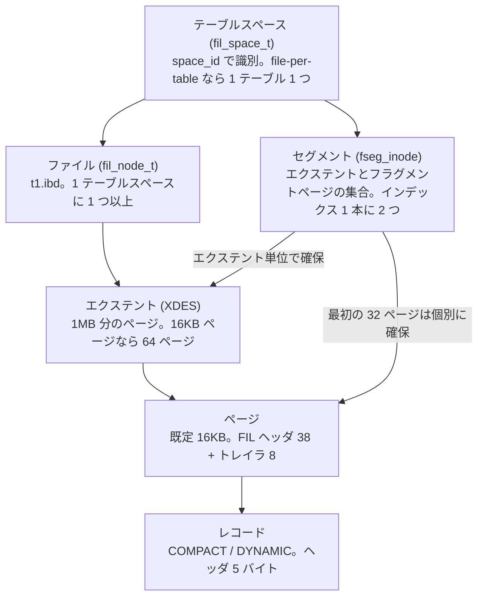
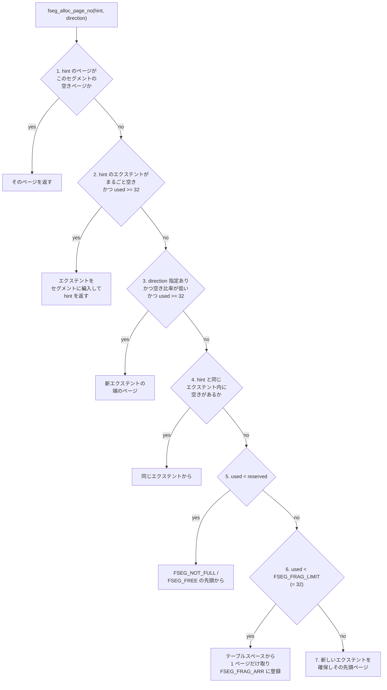

> **前提**: [ページとバッファ](./page-and-buffer/) / [ディレクトリ地図](./directory-map/)

## この層の責務

この層の仕事は 1 行で書ける。**`(space_id, page_no)` という 2 つの数を、ファイルの中のバイト列に変換する**。

上から来る要求は [`buf_page_get_gen`](./buffer-pool-walkthrough/) だけだ。バッファプールに載っていないページを読むとき、あるいは dirty なページを書き戻すとき、最後に呼ばれるのが `fil_io` で、そこで初めて「どのファイルの何バイト目か」が決まる。B+tree も undo ログも redo 以外のすべてが、この抽象の上に乗っている。

同時にこの層は**空き領域の管理**も持つ。ページが足りなくなったとき、どのページを次に使うかを決めるのは B+tree ではなく `fsp0fsp.cc` の側だ。「B+tree のページが物理的に連続しているか」「テーブルを DELETE してもファイルが縮まないのはなぜか」という問いの答えは全部ここにある。

入れ子はこうなっている。



セグメントだけが横から入ってくることに注意する。**セグメントはファイル上の連続領域ではない**。「このインデックスの葉ページ用に確保したエクステントとページの一覧」という論理的な束であり、実体は 1 つの inode レコードだ。

## 主要な型とその関係

### `fil_space_t` と `fil_node_t`

[`storage/innobase/include/fil0fil.h#L262`](https://github.com/mysql/mysql-server/blob/mysql-8.4.11/storage/innobase/include/fil0fil.h#L262) の `fil_space_t` が 1 テーブルスペースを表す。中に `Files`(= `std::vector<fil_node_t>`) を持ち、[`fil_node_t` (L179)](https://github.com/mysql/mysql-server/blob/mysql-8.4.11/storage/innobase/include/fil0fil.h#L179) が 1 ファイルに対応する。

file-per-table なら「1 テーブル = 1 テーブルスペース = 1 ファイル (`t1.ibd`)」で、この 3 つが一対一に潰れる。システムテーブルスペース (`ibdata1`) だけは `innodb_data_file_path` で複数ファイルに分けられるので、`Files` が複数要素になる。ファイル名の規則は[ディレクトリ地図](./directory-map/)にまとめた。

`fil_space_t` の集合を持つ `Fil_system` は**シャードに分かれている**。

```cpp title="storage/innobase/fil/fil0fil.cc"
/** Maximum number of shards supported. */
static const size_t MAX_SHARDS = 68;

/** Number of undo shards to reserve. */
static const size_t UNDO_SHARDS = 4;

/** The UNDO logs have their own shards (4). */
static const size_t UNDO_SHARDS_START = MAX_SHARDS - UNDO_SHARDS;
```

[L333-339](https://github.com/mysql/mysql-server/blob/mysql-8.4.11/storage/innobase/fil/fil0fil.cc#L333)。振り分けは [`shard_by_id` (L1641)](https://github.com/mysql/mysql-server/blob/mysql-8.4.11/storage/innobase/fil/fil0fil.cc#L1641) が `space_id % 64`、undo テーブルスペースだけ `64 + (space_id % 4)` で行う。undo を切り離してあるのは、undo の割当・truncate が他のテーブルの open/close と mutex を取り合わないようにするためだ。

読み書きの入口は [`fil_io` (`fil0fil.h#L1805`)](https://github.com/mysql/mysql-server/blob/mysql-8.4.11/storage/innobase/include/fil0fil.h#L1805)。

```cpp title="storage/innobase/include/fil0fil.h"
[[nodiscard]] dberr_t fil_io(const IORequest &type, bool sync,
                             const page_id_t &page_id,
                             const page_size_t &page_size, ulint byte_offset,
                             ulint len, void *buf, void *message);
```

`page_id_t` が `(space_id, page_no)` で、`page_size_t` がページサイズを持つ。**ファイル内オフセットは `page_no × page_size` でしかない**。ページ番号がそのままファイル内の位置になるので、ページを別の場所に「引っ越す」ことはできない。これが後で効いてくる ([root ページが動かない](#root-ページ番号は決して動かない))。

### テーブルスペースの低位ページ

どのテーブルスペースでも、先頭数ページの用途は固定されている。

```
page 0  FSP_HDR   テーブルスペースヘッダ + 先頭 256MB 分のエクステント記述子 (XDES)
page 1  IBUF_BITMAP  change buffer 用ビットマップ
page 2  INODE     セグメント inode の配列
                  ---- ここから下はシステムテーブルスペース (space 0) だけ ----
page 3  ibuf header
page 4  ibuf tree root
page 5  trx sys header
page 6  first rollback segment
page 7  data dictionary header (5.7 以前の SYS_* 用。8.0 以降はほぼ空)
                  ---- undo テーブルスペースでは ----
page 3  RSEG_ARRAY  rollback segment ディレクトリ
```

定数は [`fsp0types.h#L155-174`](https://github.com/mysql/mysql-server/blob/mysql-8.4.11/storage/innobase/include/fsp0types.h#L155) にある。**page 0 と page 1 は 256MB (= 16384 ページ) ごとに繰り返される**。エクステント記述子は 1 ページに収まる分しか置けないからだ。だから 10GB の `.ibd` の中には、40 個の XDES ページが等間隔で並んでいる。

`FSP_HDR` ページの中身は [`fsp0fsp.h#L135-172`](https://github.com/mysql/mysql-server/blob/mysql-8.4.11/storage/innobase/include/fsp0fsp.h#L135)。

```
FSP_HEADER_OFFSET = 38 (= FIL_PAGE_DATA)
  +0   FSP_SPACE_ID          4  space id
  +8   FSP_SIZE              4  現在のファイルサイズ (ページ数)
  +12  FSP_FREE_LIMIT        4  ここまでは XDES を初期化済み
  +16  FSP_SPACE_FLAGS       4  ページサイズ・行フォーマット・暗号化など
  +20  FSP_FRAG_N_USED       4  FSP_FREE_FRAG 内で使用中のページ数
  +24  FSP_FREE             16  完全に空きのエクステントのリスト
  +40  FSP_FREE_FRAG        16  一部だけ使われているエクステントのリスト
  +56  FSP_FULL_FRAG        16  埋まったフラグメントエクステントのリスト
  +72  FSP_SEG_ID            8  次に払い出すセグメント ID
  +80  FSP_SEG_INODES_FULL  16  埋まった INODE ページのリスト
  +96  FSP_SEG_INODES_FREE  16  空きのある INODE ページのリスト
                          ---- FSP_HEADER_SIZE = 112 ----
XDES_ARR_OFFSET = 150 から 40 バイトのエクステント記述子が並ぶ
```

`FSP_SIZE` と `FSP_FREE_LIMIT` が別なのがポイントだ。ファイルは先に伸ばしておき (`FSP_SIZE`)、エクステント記述子の初期化は後追いする (`FSP_FREE_LIMIT`)。

### エクステント — 「64 ページ」ではない

計画にも運用記事にもよく「1 エクステント = 64 ページ」と書かれるが、定義はページ数ではない。

```cpp title="storage/innobase/include/fsp0types.h"
/** File space extent size in pages
page size | file space extent size
----------+-----------------------
   4 KiB  | 256 pages = 1 MiB
   8 KiB  | 128 pages = 1 MiB
  16 KiB  |  64 pages = 1 MiB
  32 KiB  |  64 pages = 2 MiB
  64 KiB  |  64 pages = 4 MiB
*/
#define FSP_EXTENT_SIZE                                                 \
  static_cast<page_no_t>(                                               \
      ((UNIV_PAGE_SIZE <= (16384)                                       \
            ? (1048576 / UNIV_PAGE_SIZE)                                \
            : ((UNIV_PAGE_SIZE <= (32768)) ? (2097152 / UNIV_PAGE_SIZE) \
                                           : (4194304 / UNIV_PAGE_SIZE)))))
```

[`fsp0types.h#L64`](https://github.com/mysql/mysql-server/blob/mysql-8.4.11/storage/innobase/include/fsp0types.h#L64)。**16KB 以下では「1MB 分のページ数」、それより大きいページサイズでは 64 ページ固定**。`innodb_page_size` を 4KB にすると 1 エクステントは 256 ページになるし、64KB にすると 1 エクステントは 4MB になる。`innodb_page_size` を既定 (`UNIV_PAGE_SIZE_DEF = 16384`、[`univ.i#L325`](https://github.com/mysql/mysql-server/blob/mysql-8.4.11/storage/innobase/include/univ.i#L325)) から動かしている環境で「64 ページ」を前提にした計算をすると全部ずれる。

エクステント記述子 (XDES) は [`fsp0fsp.h#L268-324`](https://github.com/mysql/mysql-server/blob/mysql-8.4.11/storage/innobase/include/fsp0fsp.h#L268)。1 エントリ 40 バイト (16KB ページの場合) で、内訳は所属セグメント ID 8 + リストノード 12 + 状態 4 + ビットマップ 16。ビットマップは 1 ページにつき 2 ビット (`XDES_FREE_BIT` と `XDES_CLEAN_BIT`) だ。

状態 (`XDES_STATE`) は 6 種類しかない。

| 状態              | 意味                                                       |
| ----------------- | ---------------------------------------------------------- |
| `XDES_FREE`       | 空き。テーブルスペースの `FSP_FREE` リストに繋がっている   |
| `XDES_FREE_FRAG`  | 複数セグメントのフラグメントページに使われ、まだ空きがある |
| `XDES_FULL_FRAG`  | 同上で埋まった                                             |
| `XDES_FSEG`       | 1 つのセグメントが丸ごと所有している                       |
| `XDES_FSEG_FRAG`  | セグメントが所有するが、フラグメント的に使う               |
| `XDES_NOT_INITED` | 未初期化                                                   |

### セグメント — インデックス 1 本に 2 つ

セグメント inode は [`fsp0fsp.h#L204-225`](https://github.com/mysql/mysql-server/blob/mysql-8.4.11/storage/innobase/include/fsp0fsp.h#L204) にあり、3 つのエクステントリスト (`FSEG_FREE` / `FSEG_NOT_FULL` / `FSEG_FULL`) と、**個別ページの配列**を持つ。

```cpp title="storage/innobase/include/fsp0fsp.h"
/** array of individual pages belonging to this segment in fsp fragment extent
 lists */
constexpr uint32_t FSEG_FRAG_ARR = 16 + 3 * FLST_BASE_NODE_SIZE;
/* number of slots in the array for the fragment pages */
#define FSEG_FRAG_ARR_N_SLOTS (FSP_EXTENT_SIZE / 2)
```

`FSEG_FRAG_ARR_N_SLOTS` = `FSP_EXTENT_SIZE / 2` なので、16KB ページなら 32。そして [L248](https://github.com/mysql/mysql-server/blob/mysql-8.4.11/storage/innobase/include/fsp0fsp.h#L248) で `FSEG_FRAG_LIMIT` がこれと同値に定義される。**セグメントは最初の 32 ページを 1 ページずつ拾い、33 ページ目からエクステント単位に切り替わる**。

これが「小さいテーブルの `.ibd` が 16KB 刻みで少しずつ伸びていたのに、ある行数を境に 1MB 刻みになる」現象の正体だ。エクステント単位の確保に切り替わった瞬間に段が変わる。

インデックスを作るとセグメントは 2 つできる。

```cpp title="storage/innobase/btr/btr0btr.cc"
  } else {
    block = fseg_create(space, 0, PAGE_HEADER + PAGE_BTR_SEG_TOP, mtr);
  }
  ...
    if (!fseg_create(space, page_no, PAGE_HEADER + PAGE_BTR_SEG_LEAF, mtr)) {
```

[`btr_create` (`btr0btr.cc#L858`)](https://github.com/mysql/mysql-server/blob/mysql-8.4.11/storage/innobase/btr/btr0btr.cc#L858)。非葉ページ用 (`PAGE_BTR_SEG_TOP`) と葉ページ用 (`PAGE_BTR_SEG_LEAF`) の 2 本で、**どちらのセグメントヘッダも root ページの中に書かれる**。1 つ目の `fseg_create` が返してきたページがそのまま root ページになり、2 つ目はそのページの別オフセットにヘッダを置く。

葉と非葉を分けてあるのは、範囲スキャンで葉を順に読むときに非葉ページが間に挟まらないようにするためだ。

## 処理の流れ

### 1 ページ確保する

`btr_page_alloc` → `fseg_alloc_free_page_general` ([`fsp0fsp.cc#L3005`](https://github.com/mysql/mysql-server/blob/mysql-8.4.11/storage/innobase/fsp/fsp0fsp.cc#L3005)) → `fseg_alloc_page_no` ([L2743](https://github.com/mysql/mysql-server/blob/mysql-8.4.11/storage/innobase/fsp/fsp0fsp.cc#L2743)) と降りる。`fseg_alloc_page_no` はソース中でケース 1〜7 と番号が振られた巨大な if-else で、上から順に試す。



ケース 6 が「最初の 32 ページ」の実装だ。

```cpp title="storage/innobase/fsp/fsp0fsp.cc"
    } else if (used < FSEG_FRAG_LIMIT) {
      /* 6. We allocate an individual page from the space
      ===================================================*/
      ret_page = fsp_alloc_page_no(space_id, page_size, hint, mtr);
      ...
      if (ret_page != FIL_NULL) {
        /* Put the page in the fragment page array of the
        segment */
        n = fseg_find_free_frag_page_slot(seg_inode, mtr);
        ut_a(n != ULINT_UNDEFINED);

        fseg_set_nth_frag_page_no(seg_inode, n, ret_page, mtr);
      }

      return ret_page;
```

ケース 2 と 3 の条件に出てくる `reserved - used < reserved * (fseg_reserve_pct / 100)` が**先読み確保**の条件で、`fseg_reserve_pct` の既定は 12.5%。セグメント内の空きページが 12.5% を切ったら新しいエクステントを先に取る。

`hint` と `direction` は上から降りてくる。B+tree のページ分割は `hint_page_no = page_no + 1`、`direction = FSP_UP` を渡す ([B+tree の操作](./btree-operations/))。「新しいページを今のページの隣に置いてくれ」という要求で、ケース 1 か 4 で叶えばページは物理的に連続する。

### ページを読む

`buf_page_get_gen` がバッファプールに無いと判断すると `buf_read_page_low` → `fil_io` に落ちる。`fil_io` は `shard_by_id` でシャードを引き、`fil_space_t` からファイルを探し、必要ならファイルを open し、`page_no × page_size` の位置に pread する。ここは[バッファプールの walkthrough](./buffer-pool-walkthrough/) と [I/O のページ](./read-ahead-and-io/) で詳しく扱う。

### DDL でテーブルスペースを作る

`CREATE TABLE` は `ha_innobase::create` → `dict_build_table_def` でテーブルスペースを作り、インデックスごとに `btr_create` を呼んで root ページを確保する。`.ibd` の初期サイズは page 0/1/2 + 各インデックスの root ページ + セグメント inode の分だけになる。

## 守られている不変条件

### `(space_id, page_no)` はページの永続的な住所である

ページ番号はファイル内オフセットそのものなので、**確保されたページは移動しない**。B+tree の node pointer レコードはページ番号を 4 バイトで持ち ([クラスタードインデックス](./clustered-index/))、LOB 参照もページ番号を持つ ([LOB のページ](./lob-storage/))。これらが更新されずに済むのは、ページが動かないという前提があるからだ。

### root ページ番号は決して動かない

インデックスの root ページ番号は data dictionary に記録されている (`dict_index_t::page`)。木が深くなるとき、普通の実装なら新しい root を作って親を差し替えたくなるが、それをやると dictionary の更新が必要になる。InnoDB は逆をやる。

```cpp title="storage/innobase/btr/btr0btr.cc"
  /* Allocate a new page to the tree. Root splitting is done by first
  moving the root records to the new page, emptying the root, putting
  a node pointer to the new page, and then splitting the new page. */
```

[`btr_root_raise_and_insert` (`btr0btr.cc#L1482`)](https://github.com/mysql/mysql-server/blob/mysql-8.4.11/storage/innobase/btr/btr0btr.cc#L1482)。**root の中身を新しいページに引っ越し、root を空にして子へのポインタ 1 本だけを書く**。root ページ番号は据え置きで、木の高さが 1 上がる。セグメントヘッダ (`PAGE_BTR_SEG_LEAF` / `PAGE_BTR_SEG_TOP`) が root ページに置かれているのも、root が動かないからこそ成り立つ。

### 1 ページの書き込みは mtr の中で redo される

この層のページ更新はすべて mini-transaction (`mtr_t`) の中で行われ、`mlog_write_ulint` などが redo レコードを積む。`FSP_FREE_LIMIT` を書き換えるのも、XDES のビットを落とすのも、すべて redo に載る。詳細は [mini-transaction のページ](./mini-transaction/)。

### エクステント記述子は「そのエクステントを含むページ群の先頭ページ」にある

XDES ページは 256MB (16KB ページの場合) ごとに繰り返される。`xdes_get_descriptor` はページ番号から所属 XDES ページを計算するだけで済み、テーブルスペース全体を走査しない。

## つまずきどころ

### 「エクステント = 64 ページ」は 16KB ページのときだけ

前述のとおり定義は「1MB 分」だ。`innodb_page_size=8k` なら 128 ページ、`4k` なら 256 ページ。エクステント数からデータ量を推定するときにここを間違えると 4 倍ずれる。

### `DELETE` してもファイルは縮まない

削除で空になったページはセグメントに返り、エクステントが完全に空になれば `FSP_FREE` に戻るが、**`FSP_SIZE` は減らない**。ファイルを縮めるには `OPTIMIZE TABLE` (= `ALTER TABLE ... FORCE`) でテーブルスペースを作り直す必要がある。空き領域はそのテーブルスペース内で再利用されるだけで、OS には返らない。

`INFORMATION_SCHEMA.TABLES` の `DATA_FREE` がこの「返ってきたが OS には返していない」量を表す。

### 小さいテーブルが 1MB 刻みで太る

`FSEG_FRAG_LIMIT = 32` を超えた瞬間、確保単位が 1 ページから 1 エクステントに変わる。テーブルが 32 ページ (16KB ページで 512KB) を超えたところで、`.ibd` の伸び方が階段状になる。数万件のテーブルが「思ったよりファイルが大きい」のはたいていこれだ。

### `innodb_file_per_table` を切ってもセグメントの構造は同じ

システムテーブルスペースに同居させても、インデックスごとに 2 セグメントできる構造は変わらない。変わるのは「エクステントの取り合いが全テーブル間で起きる」ことと、「テーブルを DROP しても領域が他テーブルに再利用されるだけでファイルが縮まない」ことだ。

### undo テーブルスペースだけシャードが別

`Fil_shard` の 68 個のうち 4 個が undo 専用だと述べた。`INNODB_METRICS` や `SHOW ENGINE INNODB STATUS` で fil 系の待ちが見えるとき、undo とデータで別のシャードを見ていることを忘れると原因を取り違える。

### page 0 と page 1 は「テーブルのデータ」ではない

`.ibd` の先頭 3 ページにはユーザデータが 1 バイトも入っていない。加えてインデックスごとに root ページと SDI 用の領域が要る。1 行も入っていないテーブルでも `.ibd` が十数ページ分あるのはこのためで、`innodb_page_size` を上げるとこの固定費もページサイズに比例して増える。

---

ここから下の層は、ページの中身に入る。次は[ページの構造](./page-layout/)で 16KB の内訳を見て、[レコードの構造](./record-format/)でその中の 1 行のバイト配置に降りる。
