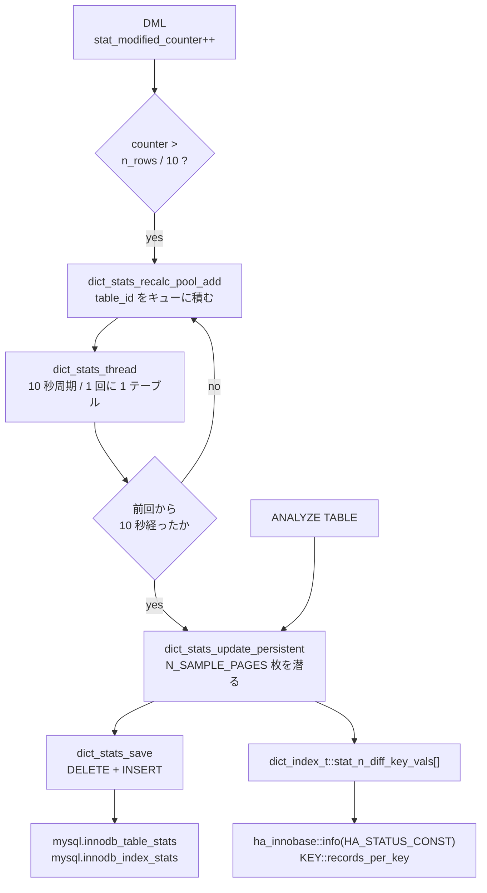

> **前提**: [統計とコストモデル](./statistics-and-cost-model/) / [InnoDB のスレッド一覧](./innodb-threads-walkthrough/)

## 何を学んだか

[統計とコストモデルのページ](./statistics-and-cost-model/)では、SQL 層はほとんど統計を持っておらず、カーディナリティの実体は InnoDB 側の `rec_per_key` と `records_in_range` だ、というところまで見た。このページはその「InnoDB 側」を開く。

分かるのは 3 つだ。

1. **統計の保存先は普通の InnoDB テーブルで、書き込みは SQL の `INSERT` で行われる。** `mysql.innodb_table_stats` と `mysql.innodb_index_stats` は、内部パーサ経由の `DELETE` + `INSERT` で更新される。だから `SELECT` で読めるし、**手で `UPDATE` して `FLUSH TABLE` すれば実行計画を動かせる**
2. **サンプリングは「何行読むか」ではなく「B+tree のどの階層を全走査するか」で決まる。** 既定 20 ページ (`innodb_stats_persistent_sample_pages`) は葉ページの数であって、行数ではない
3. **自動再計算は「10% 変わったら」の後に、10 秒間隔で 1 テーブルずつしか進まない。** テーブルが多い系では、キューに積まれてから実際に再計算されるまで分単位でかかる

そして観測側では、**`INFORMATION_SCHEMA.INNODB_LOCKS` と `INNODB_LOCK_WAITS` はもう存在しない**。`handler/i_s.cc` が定義する I_S テーブルは 26 個で、その中にロック関係は 1 つも無い。ロック待ちを見るのは `performance_schema.data_locks` / `data_lock_waits` の役目になった ([data_locks のページ](./data-locks-and-sys-schema/))。



## なぜそうなっているか

**統計を普通の InnoDB テーブルに置いたのは、再起動をまたいで統計を保つためだ。** 5.6 以前は統計をディスクに持たず、テーブルを開くたびに 8 ページ (`innodb_stats_transient_sample_pages`) をランダムサンプリングしていた。結果として**再起動やテーブルの追い出しのたびに実行計画が変わった**。「昨日と同じクエリが今日は遅い」の古典的な原因がこれで、persistent stats はその再現性の問題への回答だった。

トランザクショナルなテーブルにしたことで、統計の更新はクラッシュしても中途半端にならない。代償として、統計の更新自体が redo・undo・purge の対象になり、統計テーブルの行も MVCC の版を持つ。**統計を頻繁に取り直す設計にはできない**、という制約がここから来る。10 秒の下限も 10% の閾値も、この制約の表現だ。

**サンプリングを「階層を選んで潜る」形にしたのは、行数に対して線形にしないためだ。** 1 億行のテーブルでも、根から数階層降りて葉を 20 枚読むだけなら定数時間で終わる。精度は「LA 階層での異なり率が葉でも同じ」という仮定に乗っている。**この仮定は分布が偏っているときに大きく外れる**が、外れても「全部読む」という選択肢は現実的でない。

**背景スレッドを 1 本にして 1 テーブルずつ処理するのは、統計計算が B+tree の rw-lock を取るからだ。** 並列に走らせれば、複数のインデックスの `dict_index_t::lock` を同時に S で握ることになり、DDL や大きな構造変更と競合する。`dict_stats_index_long_waiters` が「待っている人がいたら降参する」という設計になっているのも同じ理由で、**統計は正確さより「他を止めないこと」が優先される**。

**`INNODB_METRICS` の大半が既定 OFF なのは、計測自体のコストがゼロではないからだ。** `MONITOR_INC` はホットパスに置かれたインクリメントで、有効化するとキャッシュラインの共有が起きる。特に `MONITOR_LATCHES` は latch 取得のたびに計測するので、有効にすると測定対象そのものが遅くなる。**必要なモジュールだけ、必要な期間だけ有効にする**のが正しい使い方になる。

## ソースコードのどこか

### 保存先は 2 つのテーブル

[`dict0stats.cc#L122`](https://github.com/mysql/mysql-server/blob/mysql-8.4.11/storage/innobase/dict/dict0stats.cc#L122)。

```cpp title="storage/innobase/dict/dict0stats.cc"
/* names of the tables from the persistent statistics storage */
#define TABLE_STATS_NAME "mysql/innodb_table_stats"
#define TABLE_STATS_NAME_PRINT "mysql.innodb_table_stats"
#define INDEX_STATS_NAME "mysql/innodb_index_stats"
#define INDEX_STATS_NAME_PRINT "mysql.innodb_index_stats"
```

書き込みは [`dict_stats_save` (L2199)](https://github.com/mysql/mysql-server/blob/mysql-8.4.11/storage/innobase/dict/dict0stats.cc#L2199) が、InnoDB の内部 SQL パーサに文字列を渡す形で行う。

```cpp title="storage/innobase/dict/dict0stats.cc"
  ret = dict_stats_exec_sql(pinfo,
                            "PROCEDURE TABLE_STATS_SAVE () IS\n"
                            "BEGIN\n"

                            "DELETE FROM \"" TABLE_STATS_NAME
                            "\"\n"
                            "WHERE\n"
                            "database_name = :database_name AND\n"
                            "table_name = :table_name;\n"

                            "INSERT INTO \"" TABLE_STATS_NAME
                            "\"\n"
                            "VALUES\n"
                            "(\n"
                            ":database_name,\n"
                            ":table_name,\n"
                            ":last_update,\n"
                            ":n_rows,\n"
                            ":clustered_index_size,\n"
                            ":sum_of_other_index_sizes\n"
                            ");\n"
                            "END;",
                            trx);
```

**統計の保存はトランザクショナルな DML そのもの**だ。ここから 2 つの帰結が出る。1 つは、統計の更新も redo を書き、undo を作り、purge の対象になること。もう 1 つは、**統計テーブルが普通に `SELECT` できること**だ。

```sql
SELECT * FROM mysql.innodb_table_stats
 WHERE database_name = 'app' AND table_name = 'orders';

SELECT index_name, stat_name, stat_value, sample_size, stat_description
  FROM mysql.innodb_index_stats
 WHERE database_name = 'app' AND table_name = 'orders'
 ORDER BY index_name, stat_name;
```

`innodb_index_stats` の行は `n_diff_pfx01` / `n_diff_pfx02` … という形で、**インデックスの前置ごとの異なり数**を保存する ([L2344 付近](https://github.com/mysql/mysql-server/blob/mysql-8.4.11/storage/innobase/dict/dict0stats.cc#L2344))。`n_leaf_pages` と `size` も同じテーブルに入る。`stat_description` に「どの列までの前置か」が人間向けに入っているので、複合インデックスの選択性を人間が読める唯一の場所になっている。

`sample_size` 列を見れば、**その値が何ページ分から外挿されたか**が分かる。20 なら既定のままだ。

### サンプリングは階層を選んで潜る

[`dict0stats.cc#L134`](https://github.com/mysql/mysql-server/blob/mysql-8.4.11/storage/innobase/dict/dict0stats.cc#L134)。

```cpp title="storage/innobase/dict/dict0stats.cc"
/* Gets the number of leaf pages to sample in persistent stats estimation */
#define N_SAMPLE_PAGES(index)                                    \
  static_cast<uint64_t>((index)->table->stats_sample_pages != 0  \
                            ? (index)->table->stats_sample_pages \
                            : srv_stats_persistent_sample_pages)

/* number of distinct records on a given level that are required to stop
descending to lower levels and fetch N_SAMPLE_PAGES(index) records
from that level */
#define N_DIFF_REQUIRED(index) (N_SAMPLE_PAGES(index) * 10)
```

テーブルオプション `STATS_SAMPLE_PAGES` があればそれ、無ければグローバルの `innodb_stats_persistent_sample_pages` (既定 20) を使う。

アルゴリズムの説明が [L57](https://github.com/mysql/mysql-server/blob/mysql-8.4.11/storage/innobase/dict/dict0stats.cc#L57) から 70 行のコメントで書かれている。要点だけ抜くとこうだ。

```text
For each n-prefix: start from the root level and full scan subsequent lower
levels until a level that contains at least A*10 distinct records is found.
Lets call this level LA.
...
After finding the appropriate level LA with >A*10 distinct records ...
divide it into groups of equal records and pick A such groups. Then pick the
last record from each group.
```

つまり、

1. 根から下に降りながら**各階層を全走査**して、異なる値が `A × 10` 個以上ある階層 LA を探す
2. LA を「同じ値のグループ」に分け、A 個のグループを選ぶ
3. 各グループの最後のレコードの下に潜って、葉ページ A 枚を読む
4. 葉での平均異なり数と、LA での異なり率から、葉全体の異なり数を外挿する

**「A 枚読む」の A は葉ページの数**で、複合インデックスの列数 n だけこれを繰り返すので、実際には `A × n` 枚読む。コメントもそう書いている。

`innodb_stats_persistent_sample_pages` を増やしたときに `ANALYZE TABLE` が急に遅くなるのは、この掛け算のせいだ。100 に上げた 5 列インデックスなら、1 インデックスあたり 500 枚の葉ページと、階層の全走査が入る。

### 長い待ちが出たら諦めて、サンプル数を減らして再試行する

[`dict_stats_index_long_waiters` (`dict0stats.cc#L759`)](https://github.com/mysql/mysql-server/blob/mysql-8.4.11/storage/innobase/dict/dict0stats.cc#L759)。

```cpp title="storage/innobase/dict/dict0stats.cc"
  if (rw_lock_get_waiters(dict_index_get_lock(index))) {
    const auto diff = std::chrono::steady_clock::now() - wait_start_time;

    return diff > get_srv_fatal_semaphore_wait_threshold() / 2;
  } else {
```

**`innodb_fatal_semaphore_wait_threshold` の半分**が閾値になっている。既定 600 秒なら 300 秒だ。この判定は 100 レコードごとに呼ばれ、true なら走査を中断する。

中断されると、上位の [`dict_stats_analyze_index` (L1997)](https://github.com/mysql/mysql-server/blob/mysql-8.4.11/storage/innobase/dict/dict0stats.cc#L1997) がサンプル数を減らして再試行する。

```cpp title="storage/innobase/dict/dict0stats.cc"
  uint64_t n_sample_pages = N_SAMPLE_PAGES(index);
  while (n_sample_pages > 0 &&
         !dict_stats_analyze_index_low(n_sample_pages, index)) {
    /* aborted. retrying. */
    ib::warn(ER_IB_MSG_STATS_SAMPLING_TOO_LARGE)
        << "Detected too long lock waiting around " << index->table->name << "."
        << index->name
        << " stats_sample_pages. Retrying with the smaller value "
        << n_sample_pages << ".";

    /* Certain delay is needed for waiters to lock the index next. */
    std::this_thread::sleep_for(std::chrono::milliseconds(100));
  }
```

**エラーログに `Detected too long lock waiting around <table>.<index> stats_sample_pages` が出たら、統計が意図した精度で取れていない。** 保存された `sample_size` が設定値より小さくなる。`innodb_stats_persistent_sample_pages` を上げたのに `sample_size` が上がっていないときは、これを疑う。

### 自動再計算 — 10% と 10 秒

しきい値の 10% は DML 側にある。詳細は[統計とコストモデルのページ](./statistics-and-cost-model/)で見たとおりで、`stat_modified_counter` が行数の 10% を超えると `dict_stats_recalc_pool_add` でキューに積まれる。

積まれた後を処理するのが dict stats スレッドだ ([`dict0stats_bg.cc#L382`](https://github.com/mysql/mysql-server/blob/mysql-8.4.11/storage/innobase/dict/dict0stats_bg.cc#L382))。

```cpp title="storage/innobase/dict/dict0stats_bg.cc"
  while (!SHUTTING_DOWN()) {
    /* Wake up periodically even if not signaled. This is
    because we may lose an event - if the below call to
    dict_stats_process_entry_from_recalc_pool() puts the entry back
    in the list, the os_event_set() will be lost by the subsequent
    os_event_reset(). */
    os_event_wait_time(dict_stats_event, MIN_RECALC_INTERVAL);
    ...
    dict_stats_process_entry_from_recalc_pool(thd);

    os_event_reset(dict_stats_event);
  }
```

**1 周につき 1 テーブルしか処理しない。** `MIN_RECALC_INTERVAL` は 10 秒 ([L52](https://github.com/mysql/mysql-server/blob/mysql-8.4.11/storage/innobase/dict/dict0stats_bg.cc#L52))。イベントで起こされれば 10 秒待たずに回るが、処理の中でもう一度同じ間隔が効く ([L314](https://github.com/mysql/mysql-server/blob/mysql-8.4.11/storage/innobase/dict/dict0stats_bg.cc#L314))。

```cpp title="storage/innobase/dict/dict0stats_bg.cc"
  if (std::chrono::steady_clock::now() - table->stats_last_recalc <
      MIN_RECALC_INTERVAL) {
    /* Stats were (re)calculated not long ago. To avoid
    too frequent stats updates we put back the table on
    the auto recalc list and do nothing. */

    dict_stats_recalc_pool_add(table);
```

**同じテーブルが 10 秒以内に再計算されようとしたら、キューの末尾に戻される。** 更新の激しいテーブルが 1 つあると、そのテーブルがキューを何周も回り、他のテーブルの再計算が後回しになる。

このスレッドは処理のたびに `dd_table_open_on_id` で MDL を取る。**背景の統計計算が DDL を待たせる (あるいは DDL に待たされる)** 経路がここにある ([MDL のページ](./metadata-locking/))。

### `ANALYZE TABLE` が通る道

[`ha_innobase::analyze` (`ha_innodb.cc#L18344`)](https://github.com/mysql/mysql-server/blob/mysql-8.4.11/storage/innobase/handler/ha_innodb.cc#L18344) は 10 行しかない。

```cpp title="storage/innobase/handler/ha_innodb.cc"
int ha_innobase::analyze(THD *,          /*!< in: connection thread handle */
                         HA_CHECK_OPT *) /*!< in: currently ignored */
{
  /* Simply call info_low() with all the flags
  and request recalculation of the statistics */
  int ret = info_low(HA_STATUS_TIME | HA_STATUS_CONST | HA_STATUS_VARIABLE,
                     true /* this is ANALYZE */);
```

そこから [`dict_stats_update` (`dict0stats.cc#L2832`)](https://github.com/mysql/mysql-server/blob/mysql-8.4.11/storage/innobase/dict/dict0stats.cc#L2832) に入る。分岐の頭に、この経路の入口が全部書いてある。

```cpp title="storage/innobase/dict/dict0stats.cc"
    case DICT_STATS_RECALC_PERSISTENT:

      if (srv_read_only_mode) {
        break;
      }

      /* wakes the last purge batch for exact recalculation */
      if (trx_sys->rseg_history_len.load() > 0) {
        srv_wake_purge_thread_if_not_active();
      }

      /* Persistent recalculation requested, called from
      1) ANALYZE TABLE, or
      2) the auto recalculation background thread, or
      3) open table if stats do not exist on disk and auto recalc
         is enabled */
```

**`ANALYZE TABLE` は purge を起こす。** delete-mark されただけの行を数に入れないためだ (`innodb_stats_include_delete_marked` は既定 false)。起こすだけで待たないので、purge が追いついていない状態では**削除済みの行が数に含まれたまま**統計が取られる ([purge のページ](./purge/))。

3 番目の入口も見落としやすい。**統計テーブルに行が無いテーブルは、最初に開いたときに再計算される。** リストアやインポート直後の最初のクエリが遅いのは、これが走っているからのことがある。

### `INNODB_METRICS` — 常時 ON ではない計器

カウンタの定義は 2 か所に分かれている。ID の enum が [`srv0mon.h#L133`](https://github.com/mysql/mysql-server/blob/mysql-8.4.11/storage/innobase/include/srv0mon.h#L133) の `monitor_id_t`、説明とフラグが [`srv0mon.cc#L100`](https://github.com/mysql/mysql-server/blob/mysql-8.4.11/storage/innobase/srv/srv0mon.cc#L100) の `innodb_counter_info[]` だ。両者は**添字で対応している**ので、片方だけ足すと壊れる。

`MONITOR_MODULE_*` は 22 個あり (`METADATA`、`LOCK`、`BUFFER`、`PURGE`、`ADAPTIVE_HASH`、`IBUF_SYSTEM` …)、それぞれの下に合計 300 個超のカウンタがぶら下がる。SQL 側から見える `SUBSYSTEM` 列の値はモジュール名とは別の文字列で、`module_adaptive_hash` の subsystem は `adaptive_hash_index`、`module_ibuf_system` の subsystem は `change_buffer` になる。フラグの意味は [`srv0mon.h#L92`](https://github.com/mysql/mysql-server/blob/mysql-8.4.11/storage/innobase/include/srv0mon.h#L92) の `monitor_type_t` にある。

```cpp title="storage/innobase/include/srv0mon.h"
  MONITOR_EXISTING = 2,        /*!< The monitor carries information from
                               an existing system status variable */
  MONITOR_NO_AVERAGE = 4,      /*!< Set this status if we don't want to
                               calculate the average value for the counter */
  MONITOR_DISPLAY_CURRENT = 8, /*!< Display current value of the
                               counter, rather than incremental value
                               over the period. Mostly for counters
                               displaying current resource usage */
  MONITOR_GROUP_MODULE = 16,   /*!< Monitor can be turned on/off
                               only as a module, but not individually */
  MONITOR_DEFAULT_ON = 32,     /*!< Monitor will be turned on by default at
                               server start up */
```

重要なのは **`MONITOR_DEFAULT_ON` が付いているものだけが既定で有効**という点だ。付いていないカウンタは `COUNT` 列が 0 のまま `STATUS` 列が `disabled` になる。**「0 だから起きていない」ではなく「計っていないから 0」**である。

有効化は `innodb_monitor_enable` ([`ha_innodb.cc#L23257`](https://github.com/mysql/mysql-server/blob/mysql-8.4.11/storage/innobase/handler/ha_innodb.cc#L23257))。

```sql
-- モジュール単位
SET GLOBAL innodb_monitor_enable = 'module_purge';
-- ワイルドカード
SET GLOBAL innodb_monitor_enable = 'ibuf%';
-- 全部
SET GLOBAL innodb_monitor_enable = 'all';

SELECT name, subsystem, count, status
  FROM information_schema.INNODB_METRICS
 WHERE status = 'enabled';
```

対になる `innodb_monitor_disable` / `innodb_monitor_reset` / `innodb_monitor_reset_all` があり、`_reset` は `COUNT_RESET` 系の列だけを 0 に戻す。I_S 側は `COUNT` (有効化以来の累計) と `COUNT_RESET` (最後のリセット以来) を別の列で持つ ([`i_s.cc#L1742`](https://github.com/mysql/mysql-server/blob/mysql-8.4.11/storage/innobase/handler/i_s.cc#L1742))。

有効化に副作用があるものもある。`MONITOR_LATCHES` を有効にすると `mutex_monitor->enable()` が呼ばれ、**全 latch の取得にカウントが乗る** ([`ha_innodb.cc#L21051`](https://github.com/mysql/mysql-server/blob/mysql-8.4.11/storage/innobase/handler/ha_innodb.cc#L21051))。`innodb_monitor_enable = 'all'` を本番で打つのはここが理由で避ける。

### I_S テーブルは 26 個

`handler/i_s.cc` が `st_mysql_plugin` として登録している I_S テーブルを数えると 26 個ある。

`INNODB_TRX` / `INNODB_CMP` (+`_RESET`) / `INNODB_CMP_PER_INDEX` (+`_RESET`) / `INNODB_CMPMEM` (+`_RESET`) / `INNODB_METRICS` / `INNODB_FT_*` (6 個) / `INNODB_TEMP_TABLE_INFO` / `INNODB_BUFFER_POOL_STATS` / `INNODB_BUFFER_PAGE` / `INNODB_BUFFER_PAGE_LRU` / `INNODB_TABLES` / `INNODB_TABLESTATS` / `INNODB_INDEXES` / `INNODB_COLUMNS` / `INNODB_VIRTUAL` / `INNODB_TABLESPACES` / `INNODB_CACHED_INDEXES` / `INNODB_SESSION_TEMP_TABLESPACES`。

**この中に `INNODB_LOCKS` と `INNODB_LOCK_WAITS` は無い。** 5.7 までのロック調査手順はそのままでは動かない。

```sql
-- 5.7 まで (8.0 以降は存在しない)
-- SELECT * FROM information_schema.INNODB_LOCK_WAITS;

-- 8.4 での等価物
SELECT * FROM performance_schema.data_lock_waits;
SELECT * FROM sys.innodb_lock_waits;
```

`sys.innodb_lock_waits` は名前に `innodb` が入っているが**中身は `performance_schema` ベースのビュー**だ ([data_locks のページ](./data-locks-and-sys-schema/))。

## どう活かすか

### 症状 — 「ANALYZE TABLE すると実行計画が変わる」

これは統計が実態からずれていた、という証拠になる。ずれる原因は決まっている。

| 原因                                        | 確認方法                                                            | 手当て                                      |
| ------------------------------------------- | ------------------------------------------------------------------- | ------------------------------------------- |
| 10% の閾値に届かない偏った更新              | `mysql.innodb_table_stats.last_update` が古い                       | 定期的な `ANALYZE TABLE`                    |
| dict stats スレッドのキューが詰まっている   | 更新の激しいテーブルが多数ある                                      | 同上                                        |
| サンプル 20 ページでは分布を捉えられない    | `innodb_index_stats.sample_size` = 20、`n_diff_pfx*` が実態とずれる | `STATS_SAMPLE_PAGES` をテーブル単位で上げる |
| サンプリングが中断されていた                | エラーログの `stats_sample_pages` 警告、`sample_size` が設定値未満  | 負荷の低い時間に `ANALYZE`                  |
| purge が遅れていて delete-mark 行が数に入る | `History list length` が大きい                                      | [purge](./purge/) 側を先に直す              |
| `stat_n_rows` がロールバックで戻っていない  | 大量 DML の直後                                                     | `ANALYZE TABLE`                             |

**まず `mysql.innodb_table_stats` を見る**のが早い。`last_update` と `n_rows` を実際の `COUNT(*)` と比べれば、ずれの大きさと古さが同時に分かる。

```sql
SELECT database_name, table_name, last_update, n_rows,
       clustered_index_size, sum_of_other_index_sizes
  FROM mysql.innodb_table_stats
 WHERE database_name = 'app'
 ORDER BY last_update;
```

### テーブル単位で設定を変える

グローバルの `innodb_stats_persistent_sample_pages` を上げるのは、**全テーブルの `ANALYZE` を重くする**ので割に合わないことが多い。分布が偏った特定のテーブルだけ上げる。

```sql
ALTER TABLE orders STATS_SAMPLE_PAGES = 200;
ALTER TABLE audit_log STATS_AUTO_RECALC = 0;   -- 追記専用で分布が変わらない
ALTER TABLE tmp_import STATS_PERSISTENT = 0;   -- 短命なテーブル
```

`STATS_PERSISTENT = 0` にすると transient stats (既定 8 ページのランダムサンプリング) に戻る。**再現性を捨てて軽さを取る**選択で、短命な作業テーブルには合理的だ。

### 統計を固定する

`mysql.innodb_index_stats` は普通のテーブルなので、値を書き換えられる。

```sql
UPDATE mysql.innodb_index_stats
   SET stat_value = 1000000
 WHERE database_name = 'app' AND table_name = 'orders'
   AND index_name = 'idx_status' AND stat_name = 'n_diff_pfx01';

FLUSH TABLE app.orders;
```

`FLUSH TABLE` でキャッシュを落とさないと、メモリ上の `dict_index_t` が古い値のままになる。**`STATS_AUTO_RECALC = 0` を併用しないと、背景スレッドに上書きされる。** 最後の手段であって、常用するものではない。オプティマイザを動かす手段としては[ヒント](./optimizer-hints-and-switches/)のほうが先だ。

### 症状 — 「INNODB_METRICS の値が全部 0」

`STATUS` 列を確認する。`disabled` なら計測していないだけだ。

```sql
SELECT name, subsystem, status, count
  FROM information_schema.INNODB_METRICS
 WHERE subsystem IN ('purge', 'change_buffer', 'adaptive_hash_index');
```

`purge` モジュールは既定 OFF なので、purge の詳細を追うには先に有効化が要る。一方 `change_buffer` の `ibuf_*` は `MONITOR_DEFAULT_ON` なので既定で数えている ([change buffer のページ](./change-buffer/))。**モジュールごとに既定が違う**ので、値を読む前に必ず `STATUS` を見る。

調査が終わったら戻す。

```sql
SET GLOBAL innodb_monitor_disable = 'module_purge';
```

### どこから何が取れるかの整理

| 知りたいこと                               | 見る場所                                                                        |
| ------------------------------------------ | ------------------------------------------------------------------------------- |
| インデックスのカーディナリティ             | `SHOW INDEX FROM t`、`mysql.innodb_index_stats`                                 |
| 統計がいつ取られたか                       | `mysql.innodb_table_stats.last_update`                                          |
| 何ページからサンプルしたか                 | `mysql.innodb_index_stats.sample_size`                                          |
| purge / change buffer / AHI の内部カウンタ | `INNODB_METRICS` (要有効化のものあり)                                           |
| バッファプールの中身                       | `INNODB_BUFFER_PAGE_LRU`、`INNODB_CACHED_INDEXES`                               |
| ロック待ち                                 | `performance_schema.data_lock_waits` (I_S ではない)                             |
| 実行中のトランザクション                   | `INFORMATION_SCHEMA.INNODB_TRX`                                                 |
| セクション単位のスナップショット           | `SHOW ENGINE INNODB STATUS` ([各セクションの読み方](./innodb-status-sections/)) |
