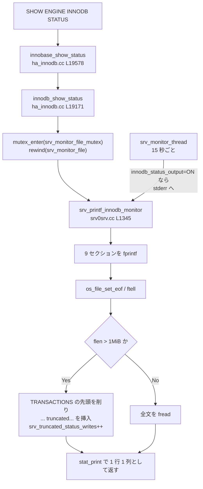

## 何を学んだか

`SHOW ENGINE INNODB STATUS` は、他の `SHOW` と違って**結果セットを組み立てない**。InnoDB は `FILE *` に向かって `fprintf` を並べるだけで、サーバはそれを読み戻して 1 個の巨大な文字列として 1 行 1 列で返す。書き先は起動時に開いておいた `srv_monitor_file` だ。

だから出力の構造は「どの関数が `fputs` でセクション見出しを書いて、どの印字関数を呼ぶか」で決まっている。全体は [`srv_printf_innodb_monitor` (`storage/innobase/srv/srv0srv.cc#L1345`)](https://github.com/mysql/mysql-server/blob/mysql-8.4.11/storage/innobase/srv/srv0srv.cc#L1345) の 200 行を上から読めば尽きる。



同じ `srv_printf_innodb_monitor` を背景スレッドも呼ぶ。`innodb_status_output=ON` にすると、[`srv_monitor_thread` (L1775)](https://github.com/mysql/mysql-server/blob/mysql-8.4.11/storage/innobase/srv/srv0srv.cc#L1775) が 15 秒ごとに同じ内容をエラーログ (`stderr`) に吐く。

## ソースコードのどこか

### ファイルに書いて読み戻す

[`innodb_show_status` (`storage/innobase/handler/ha_innodb.cc#L19171`)](https://github.com/mysql/mysql-server/blob/mysql-8.4.11/storage/innobase/handler/ha_innodb.cc#L19171) の骨格だ。

```cpp title="storage/innobase/handler/ha_innodb.cc"
  mutex_enter(&srv_monitor_file_mutex);
  rewind(srv_monitor_file);

  srv_printf_innodb_monitor(srv_monitor_file, false, &trx_list_start,
                            &trx_list_end);

  os_file_set_eof(srv_monitor_file);

  if ((flen = ftell(srv_monitor_file)) < 0) {
    flen = 0;
  }
```

`srv_monitor_file` は起動時に [`srv0start.cc#L1719`](https://github.com/mysql/mysql-server/blob/mysql-8.4.11/storage/innobase/srv/srv0start.cc#L1719) で作られる。`--innodb-status-file` を指定すると `<datadir>/innodb_status.<pid>` という実ファイル、指定しなければ `os_file_create_tmpfile()` の匿名一時ファイルになる。どちらにせよ `srv_monitor_file_mutex` で直列化されるので、**複数セッションが同時に `SHOW ENGINE INNODB STATUS` を打つと待ち合う**。

上限は 1MiB で、越えたときの削り方が凝っている。

```cpp title="storage/innobase/handler/ha_innodb.cc"
  static const char truncated_msg[] = "... truncated...\n";
  const long MAX_STATUS_SIZE = 1048576;
  ...
  if (flen > MAX_STATUS_SIZE) {
    usable_len = MAX_STATUS_SIZE;
    srv_truncated_status_writes++;
  }
  ...
  } else if (trx_list_end < (ulint)flen && trx_list_start < trx_list_end &&
             trx_list_start + (flen - trx_list_end) <
                 MAX_STATUS_SIZE - sizeof truncated_msg - 1) {
    /* Omit the beginning of the list of active transactions. */
    ssize_t len = fread(str, 1, trx_list_start, srv_monitor_file);

    memcpy(str + len, truncated_msg, sizeof truncated_msg - 1);
```

`srv_printf_innodb_monitor` の第 3・第 4 引数は `TRANSACTIONS` セクションの開始・終了オフセットを返すためのもので、削るときは**そこだけを削る**。だから `... truncated...` が出ていても、その下の `FILE I/O` 以降は無事だ。削った回数は `Innodb_truncated_status_writes` ([`ha_innodb.cc#L1288`](https://github.com/mysql/mysql-server/blob/mysql-8.4.11/storage/innobase/handler/ha_innodb.cc#L1288)) で数えられる。

### 9 つのセクションの対応表

すべて [`srv_printf_innodb_monitor` (L1345)](https://github.com/mysql/mysql-server/blob/mysql-8.4.11/storage/innobase/srv/srv0srv.cc#L1345) の中で順に出力される。

| セクション                                                        | 印字する関数                                                                                                                                                                                                                                                                                              | 読んでいる構造体                                                                                                  | 関連ページ                                                                            |
| ----------------------------------------------------------------- | --------------------------------------------------------------------------------------------------------------------------------------------------------------------------------------------------------------------------------------------------------------------------------------------------------- | ----------------------------------------------------------------------------------------------------------------- | ------------------------------------------------------------------------------------- |
| ヘッダ (`Per second averages calculated from the last N seconds`) | `srv_printf_innodb_monitor` 本体 (L1352-1372)                                                                                                                                                                                                                                                             | `srv_monitor_stats_refreshed_at` からの経過秒 (グローバル)                                                        | —                                                                                     |
| `BACKGROUND THREAD`                                               | [`srv_print_master_thread_info` (L865)](https://github.com/mysql/mysql-server/blob/mysql-8.4.11/storage/innobase/srv/srv0srv.cc#L865)                                                                                                                                                                     | `srv_main_*_loops` / `srv_main_thread_op_info`                                                                    | [InnoDB のスレッド一覧](./innodb-threads-walkthrough/)                                |
| `SEMAPHORES` (L1383)                                              | [`sync_print` (`sync/sync0sync.cc#L206`)](https://github.com/mysql/mysql-server/blob/mysql-8.4.11/storage/innobase/sync/sync0sync.cc#L206)                                                                                                                                                                | `sync_array` の待ちセル。spin/OS wait の数値は**ゼロ固定** (下記)                                                 | [lock_sys](./lock-sys-sharding/)                                                      |
| `LATEST FOREIGN KEY ERROR` (L1399)                                | `ut_copy_file(file, dict_foreign_err_file)`                                                                                                                                                                                                                                                               | `dict_foreign_err_file` という一時ファイル                                                                        | [データディクショナリ](./data-dictionary/)                                            |
| `LATEST DETECTED DEADLOCK`                                        | [`lock_print_info_summary` (`lock/lock0lock.cc#L4463`)](https://github.com/mysql/mysql-server/blob/mysql-8.4.11/storage/innobase/lock/lock0lock.cc#L4463) → `ut_copy_file(file, lock_latest_err_file)`                                                                                                    | `lock_latest_err_file` (一時ファイル、**直近 1 件だけ**)                                                          | [デッドロック検出](./deadlock-detection/)                                             |
| `TRANSACTIONS`                                                    | 同じ `lock_print_info_summary` の後半 + [`lock_print_info_all_transactions` (L4794)](https://github.com/mysql/mysql-server/blob/mysql-8.4.11/storage/innobase/lock/lock0lock.cc#L4794)                                                                                                                    | `trx_sys` の全 `trx_t`、`purge_sys->iter`、`trx_sys->rseg_history_len`                                            | [トランザクション](./transaction-walkthrough/) / [purge](./purge/)                    |
| `FILE I/O` (L1436)                                                | [`os_aio_print` (`os/os0file.cc#L7610`)](https://github.com/mysql/mysql-server/blob/mysql-8.4.11/storage/innobase/os/os0file.cc#L7610)                                                                                                                                                                    | AIO の配列 (`AIO::print`)、`os_n_file_reads` / `os_n_file_writes` / `os_n_fsyncs`                                 | [読み込みと I/O](./read-ahead-and-io/)                                                |
| `INSERT BUFFER AND ADAPTIVE HASH INDEX` (L1443)                   | [`ibuf_print` (`ibuf/ibuf0ibuf.cc#L4378`)](https://github.com/mysql/mysql-server/blob/mysql-8.4.11/storage/innobase/ibuf/ibuf0ibuf.cc#L4378) + `btr_ahi_parts` 個ぶんの [`ha_print_info` (`ha/ha0ha.cc#L326`)](https://github.com/mysql/mysql-server/blob/mysql-8.4.11/storage/innobase/ha/ha0ha.cc#L326) | `ibuf` の構造体、`btr_search_sys->parts[i].hash_table`、`btr_cur_n_sea` / `btr_cur_n_non_sea`                     | [change buffer](./change-buffer/) / [adaptive hash index](./adaptive-hash-index/)     |
| `LOG` (L1463)                                                     | [`log_print` (`log/log0log.cc#L1133`)](https://github.com/mysql/mysql-server/blob/mysql-8.4.11/storage/innobase/log/log0log.cc#L1133)                                                                                                                                                                     | `log_t` の各種 LSN (`write_lsn` / `flushed_to_disk_lsn` / `last_checkpoint_lsn` / `available_for_checkpoint_lsn`) | [redo ログ](./redo-log-walkthrough/) / [チェックポイント](./checkpoint/)              |
| `BUFFER POOL AND MEMORY` (L1470)                                  | [`buf_print_io` (`buf/buf0buf.cc#L6841`)](https://github.com/mysql/mysql-server/blob/mysql-8.4.11/storage/innobase/buf/buf0buf.cc#L6841) → `buf_print_io_instance` (L6766)                                                                                                                                | `buf_pool_info_t` (全インスタンス集計 + 個別)、`os_total_large_mem_allocated`、`dict_sys->size`                   | [バッファプール](./buffer-pool-walkthrough/) / [LRU と midpoint](./lru-and-midpoint/) |
| `ROW OPERATIONS` (L1483)                                          | `srv_printf_innodb_monitor` 本体                                                                                                                                                                                                                                                                          | `srv_conc_get_active_threads()`、`trx_sys->mvcc->size()`、`srv_stats.n_rows_{inserted,updated,deleted,read}`      | [handler](./handler-walkthrough/) / [read view と可視性](./read-view-and-visibility/) |

`INDIVIDUAL BUFFER POOL INFO` は `innodb_buffer_pool_instances > 1` のときだけ追加で出る ([`buf0buf.cc#L6889`](https://github.com/mysql/mysql-server/blob/mysql-8.4.11/storage/innobase/buf/buf0buf.cc#L6889))。`LOG` セクションも 8.0.30 で書式が変わっていて、8.4 では `Log capacity` / `Log capacity used` / `Log sequence number` / `Log buffer assigned up to` / `Log buffer completed up to` / `Log written up to` / `Log flushed up to` / `Added dirty pages up to` / `Pages flushed up to` / `Last checkpoint at` / `Log minimum file id` / `Log maximum file id` の 12 行になっている。8.0 以前の `Log sequence number` / `Log flushed up to` / `Last checkpoint at` の 3 行だけを前提にしたスクリプトはそのままでも動くが、`Log capacity used` を見ないと redo の残量が分からない。

### `SEMAPHORES` の数値は 8.4 では 0 固定

これは知らないと必ず誤読する。[`sync_print_wait_info` (`sync/sync0sync.cc#L193`)](https://github.com/mysql/mysql-server/blob/mysql-8.4.11/storage/innobase/sync/sync0sync.cc#L193) がこうなっている。

```cpp title="storage/innobase/sync/sync0sync.cc"
/**
Prints wait info of the sync system.
Note: The instrumental counters are deprecated
      and prints all 0 for compatibility.
@param file - where to print */
static void sync_print_wait_info(FILE *file) {
  fprintf(file,
          "RW-shared spins 0, rounds 0, OS waits 0\n"
          "RW-excl spins 0, rounds 0, OS waits 0\n"
          "RW-sx spins 0, rounds 0, OS waits 0\n");

  fprintf(file,
          "Spin rounds per wait: 0.00 RW-shared,"
          " 0.00 RW-excl, 0.00 RW-sx\n");
}
```

**互換のために書式だけ残した定数**だ。この行を見て「latch 競合がない」と判断してはいけない。latch 競合を見たいなら [performance_schema](./performance-schema-internals/) の `events_waits_summary_by_instance` を使う。

一方、同じセクションの `sync_array_print` は生きている。長く待っているスレッドがあれば `--Thread N has waited at ... for M seconds the semaphore:` の形で出る。ハングの調査で意味があるのはこちらだ。

### `TRANSACTIONS` はグローバル排他 latch の下で作られる

[`srv_printf_locks_and_transactions` (L1330)](https://github.com/mysql/mysql-server/blob/mysql-8.4.11/storage/innobase/srv/srv0srv.cc#L1330) は `locksys::owns_exclusive_global_latch()` を assert する。呼び出し側の分岐はこうだ。

```cpp title="storage/innobase/srv/srv0srv.cc"
  ret = true;
  if (nowait) {
    locksys::Global_exclusive_try_latch guard{UT_LOCATION_HERE};
    if (guard.owns_lock()) {
      srv_printf_locks_and_transactions(file, trx_start_pos);
    } else {
      fputs("FAIL TO OBTAIN LOCK MUTEX, SKIP LOCK INFO PRINTING\n", file);
      ret = false;
    }
  } else {
    locksys::Global_exclusive_latch_guard guard{UT_LOCATION_HERE};
    srv_printf_locks_and_transactions(file, trx_start_pos);
  }
```

`SHOW ENGINE INNODB STATUS` は `nowait = false` で呼ぶので、**512 シャードすべてを排他で取り、その間 InnoDB の行ロックの取得と解放が完全に止まる** ([lock_sys](./lock-sys-sharding/))。背景の `srv_monitor_thread` は `MUTEX_NOWAIT` で try latch を使い、20 回連続で失敗するまでは諦める。`FAIL TO OBTAIN LOCK MUTEX, SKIP LOCK INFO PRINTING` がエラーログに出るのはこちらの経路だ。

これが [performance_schema.data_locks](./data-locks-and-sys-schema/) との決定的な違いになる。`data_locks` は一貫性を捨ててシャードを 1 個ずつ latch し、`SHOW ENGINE INNODB STATUS` は一貫性を取ってサーバを止める。

`TRANSACTIONS` の冒頭には purge の状態が並ぶ。

```cpp title="storage/innobase/lock/lock0lock.cc"
  fprintf(file, "Trx id counter " TRX_ID_FMT "\n",
          trx_sys_get_next_trx_id_or_no());

  fprintf(file,
          "Purge done for trx's n:o < " TRX_ID_FMT " undo n:o < " TRX_ID_FMT
          " state: ",
          purge_sys->iter.trx_no, purge_sys->iter.undo_no);
```

その少し下 ([L4525](https://github.com/mysql/mysql-server/blob/mysql-8.4.11/storage/innobase/lock/lock0lock.cc#L4525)) に `History list length` が出る。これが[purge](./purge/)の遅れの主要指標だ。

### `BUFFER POOL AND MEMORY` の各行

[`buf_print_io_instance` (`buf/buf0buf.cc#L6766`)](https://github.com/mysql/mysql-server/blob/mysql-8.4.11/storage/innobase/buf/buf0buf.cc#L6766) が出す。

```cpp title="storage/innobase/buf/buf0buf.cc"
  if (pool_info->n_page_get_delta) {
    fprintf(file,
            "Buffer pool hit rate %lu / 1000,"
            " young-making rate %lu / 1000 not %lu / 1000\n",
            (ulong)(1000 - (1000 * pool_info->page_read_delta /
                            pool_info->n_page_get_delta)),
            (ulong)(1000 * pool_info->young_making_delta /
                    pool_info->n_page_get_delta),
            (ulong)(1000 * pool_info->not_young_making_delta /
                    pool_info->n_page_get_delta));
  } else {
    fputs("No buffer pool page gets since the last printout\n", file);
  }
```

`_delta` が付いていることに注意する。**前回の印字からの差分**であって、起動からの累計ではない。`No buffer pool page gets since the last printout` が出るのは、直前に誰かが印字してから 1 回もページ取得がなかったときだ。

`Database pages` / `Old database pages` / `Modified db pages` はそれぞれ LRU リスト長、その old 部分の長さ、flush リスト長で、[LRU の midpoint 挿入](./lru-and-midpoint/)と[flush list](./flush-list-and-page-cleaner/)の状態がそのまま見える。

### レートの分母は共有されている

ヘッダの `Per second averages calculated from the last N seconds` の `N` は、グローバルな `srv_monitor_stats_refreshed_at` からの経過秒だ。

```cpp title="storage/innobase/srv/srv0srv.cc"
  const auto time_elapsed = std::chrono::duration_cast<std::chrono::seconds>(
                                current_time - srv_monitor_stats_refreshed_at)
                                .count() +
                            0.001;

  srv_monitor_stats_refreshed_at = current_time;
```

`+ 0.001` はゼロ除算避けで、コメントに「2 人が同時に打ったときのため」と書いてある。**印字するたびに窓がリセットされる**ので、`SHOW ENGINE INNODB STATUS` を続けて 2 回打つと 2 回目の `N` はほぼ 0 になり、`reads/s` のような数値が跳ねる。背景の `srv_monitor_thread` も、窓が 60 秒を超えないように[`srv_refresh_innodb_monitor_stats` (L1296)](https://github.com/mysql/mysql-server/blob/mysql-8.4.11/storage/innobase/srv/srv0srv.cc#L1296) を呼んで定期的にリセットしている。

## なぜそうなっているか

### なぜ `FILE *` なのか

印字関数群 (`sync_print` / `os_aio_print` / `ibuf_print` / `log_print` / `buf_print_io`) は全部 `FILE *` を引数に取る。これは `SHOW ENGINE INNODB STATUS` が SQL から呼べるようになるより前から、エラーログ (`stderr`) に吐くための関数だったからだ。

`srv_monitor_thread` が `srv_printf_innodb_monitor(stderr, ...)` を呼ぶ行が今も残っていることがその証拠になる。SQL から返すには文字列が要るので、`stderr` の代わりに一時ファイルに書き、`fread` で読み戻すという回り道をしている。InnoDB 側は「`FILE *` に書く」という契約のまま変えずに済んだ。

### なぜ 1MiB で切るのか

`TRANSACTIONS` セクションは**アクティブなトランザクション 1 本につき数行**を出す。数千の接続がそれぞれトランザクションを持っていれば、それだけで数 MB になる。1 個の `Item_string` としてクライアントに送るので、上限がなければ `max_allowed_packet` を越えて接続が切れる ([パケット](./packet-framing/))。

削るのがリストの**先頭**なのは、古いトランザクションほど新しいものより情報量が少ないから… ではない。単に `trx_start_pos` / `trx_list_end` の 2 つのオフセットで「前・トランザクション一覧・後」に 3 分割し、真ん中の先頭を捨てるのがいちばん簡単だからだ。結果として**いちばん古い、つまりいちばん問題になりやすいトランザクションが最初に消える**。

### なぜ 8.4 で SEMAPHORES の数値が消えたか

InnoDB の内部同期プリミティブは 8.0 の途中から徐々に自前実装から標準的なものへ移り、spin 回数のような自前カウンタを維持する場所がなくなった。同じ情報は performance_schema の待ちイベントから取れる。出力の書式を変えると既存のパーサが壊れるので、行だけ残して値を 0 にした。

`SHOW ENGINE INNODB STATUS` の出力全体がこの性格を持っている。人間が読むためのテキストであると同時に、**20 年ぶんの監視スクリプトが正規表現で引っかけている契約**でもある。

## どう活かすか

**`SHOW ENGINE INNODB STATUS` を本番で連打しない。** `TRANSACTIONS` セクションを作るあいだ `lock_sys` のグローバル排他 latch を保持する。ロック待ちが多い状況で叩くと、調べたい問題を悪化させる。ロックだけ見たいなら [`performance_schema.data_locks`](./data-locks-and-sys-schema/) のほうが安全だ。

**`... truncated...` が出たら接続数を疑う。** `Innodb_truncated_status_writes` が増えているなら、アクティブトランザクションが多すぎて 1MiB に収まっていない。`SHOW ENGINE INNODB STATUS` から見えなくなった古いトランザクションこそが、[undo が膨らむ原因](./undo-log/)だったりする。`information_schema.innodb_trx` を `trx_started` で並べて見るほうが確実だ。

**`History list length` が伸び続ける。** `TRANSACTIONS` セクションのこの行は `trx_sys->rseg_history_len`、つまり[purge](./purge/) がまだ消せていない undo レコードの数だ。伸び続けるのは、古い read view を握ったままの長いトランザクションがいるから。同じセクションの `---TRANSACTION ... ACTIVE 3600 sec` を探す。

**`Buffer pool hit rate` の分母は前回の印字からの差分。** `1000 / 1000` が出ても、それは「前回の印字以降に読んだページは全部キャッシュにあった」という意味でしかない。継続的に監視するなら `Innodb_buffer_pool_read_requests` と `Innodb_buffer_pool_reads` を[ステータス変数](./logs-and-status-variables/)として取り、自分で差分を出す。

**`SEMAPHORES` の spin 数を見て latch 競合を判断しない。** 8.4 では常に 0 だ。長い待ちがあるかどうかは `--Thread ... has waited` の行があるかで見る。それが出ていれば `innodb_fatal_semaphore_wait_threshold` に近づいているサインで、放置するとサーバが自殺する ([InnoDB のスレッド一覧](./innodb-threads-walkthrough/))。

**`LATEST DETECTED DEADLOCK` は 1 件しか残らない。** `lock_latest_err_file` は 1 つの一時ファイルで、新しいデッドロックが上書きする。再起動でも消える。過去のデッドロックを追いたいなら `innodb_print_all_deadlocks=ON` にしてエラーログに全部残す ([デッドロック検出](./deadlock-detection/))。

**エラーログに定期的に残したい。** `innodb_status_output=ON` にすると `srv_monitor_thread` が 15 秒ごとにエラーログへ吐く。こちらは try latch なので本番への影響が小さいが、ログ量が一気に増える。ロック情報まで欲しければ `innodb_status_output_locks=ON` も要る。

**`Log sequence number` と `Last checkpoint at` の差を見る。** `LOG` セクションのこの 2 つの差が redo capacity に迫ると、同期フラッシュが始まってサーバが止まったように見える ([チェックポイント](./checkpoint/))。`innodb_redo_log_capacity` と比べる。
