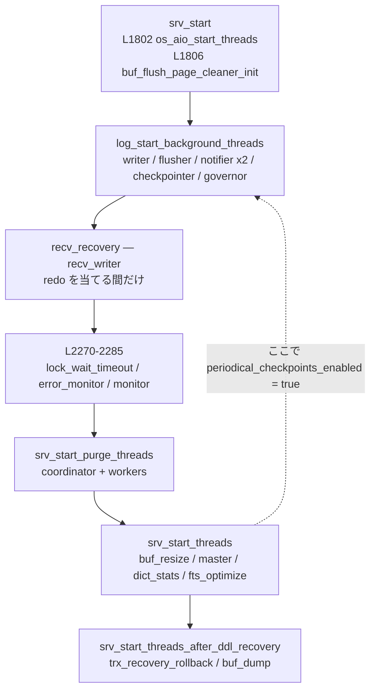
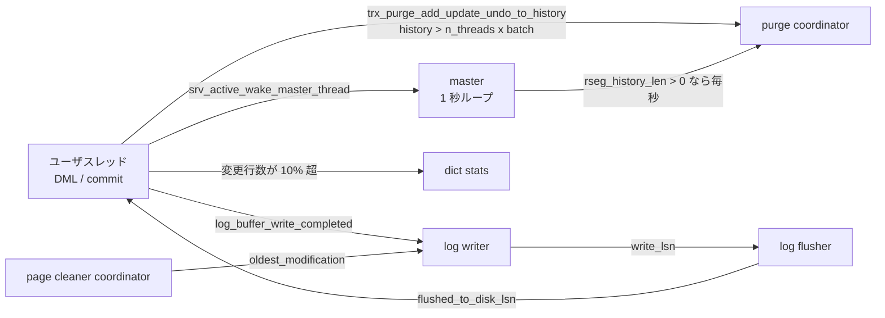

> **前提**: [プロセスとスレッド](./thread-model/)

## この層の責務

InnoDB の背景スレッドは、**ユーザスレッドの critical path から追い出した仕事**の集合である。行を 1 行更新するユーザスレッドは、ロックを取り、undo を書き、ページを変え、redo バッファに詰めるところまでしかやらない。ページをディスクに落とすのも、redo を `write(2)` するのも、消えた版を回収するのも、統計を取り直すのも、全部別のスレッドがやる。

この分割があるおかげで「1 回の DML が遅い」と「サーバ全体が詰まる」が別の現象になる。裏を返すと、**遅さの原因が背景スレッド側にあるとき、ユーザスレッドのスタックを見ても何も分からない**。だからまず、誰がいて、何をきっかけに起き、どの設定変数がその挙動を変えるのかを一覧にしておく必要がある。

[全体像のスレッドモデルのページ](./thread-model/)では「接続スレッド / InnoDB 背景スレッド / サーバ層背景スレッド」の 3 分類を置いた。このページはその 2 番目を開いて、1 本ずつ名前と起床条件を与える。

起こし方は 3 種類しかない。

1. **周期** — `std::this_thread::sleep_for` か `os_event_wait_time` でタイムアウト付きに待つ。master (1 秒)、error monitor (1 秒)、monitor (15 秒)、dict stats (10 秒)
2. **イベント** — 誰かが `os_event_set` を叩くまで寝る。page cleaner、log writer/flusher、buf dump
3. **活動カウンタ** — `srv_inc_activity_count()` でグローバルなカウンタが進み、それを見て master が「active か idle か」を決める

## 主要な型とその関係

### `Srv_threads` — スレッドの future を全部持つ構造体

[`storage/innobase/include/srv0srv.h#L165`](https://github.com/mysql/mysql-server/blob/mysql-8.4.11/storage/innobase/include/srv0srv.h#L165) の `struct Srv_threads` が、InnoDB のほぼ全スレッドのハンドルを 1 か所に集めている。グローバル変数 `srv_threads` ([L291](https://github.com/mysql/mysql-server/blob/mysql-8.4.11/storage/innobase/include/srv0srv.h#L291)) が唯一のインスタンスだ。

型名は `Srv_threads` であって `srv_threads_t` ではない。8.4 のツリーに `srv_threads_t` という識別子は存在しないので、grep するときは注意する。

メンバはほとんどが `IB_thread` 1 個だが、purge と page cleaner だけは「coordinator 1 本 + workers の配列」という形をしている。

```cpp title="storage/innobase/include/srv0srv.h"
  /** Purge coordinator (also being a worker) */
  IB_thread m_purge_coordinator;

  /** Number of purge workers and size of array below. */
  size_t m_purge_workers_n;

  /** Purge workers. Note that the m_purge_workers[0] is the same shared
  state as m_purge_coordinator. */
  IB_thread *m_purge_workers;
```

**`m_purge_workers[0]` は coordinator と同じ実体を指す。** page cleaner も同じ構造で、`m_page_cleaner_workers[0] == m_page_cleaner_coordinator` だ。つまり `innodb_purge_threads = 4` は「coordinator 1 + worker 3」であって、coordinator の他に 4 本が立つわけではない。

### `os_thread_create` — 生成は 1 個のマクロに集約されている

InnoDB は `std::thread` を直接は使わない。[`storage/innobase/include/os0thread-create.h#L318`](https://github.com/mysql/mysql-server/blob/mysql-8.4.11/storage/innobase/include/os0thread-create.h#L318) のマクロを通す。

```cpp title="storage/innobase/include/os0thread-create.h"
#ifdef UNIV_PFS_THREAD
#define os_thread_create(...) create_detached_thread(__VA_ARGS__)
#else
#define os_thread_create(k, s, ...) create_detached_thread(0, 0, __VA_ARGS__)
#endif /* UNIV_PFS_THREAD */
```

PFS が無効なビルドでは**最初の 2 引数 (PFS key と seqnum) を捨てる**ためのマクロで、実体は [`create_detached_thread` (L300)](https://github.com/mysql/mysql-server/blob/mysql-8.4.11/storage/innobase/include/os0thread-create.h#L300) というテンプレート関数だ。

```cpp title="storage/innobase/include/os0thread-create.h"
template <typename F, typename... Args>
IB_thread create_detached_thread(mysql_pfs_key_t pfs_key,
                                 PSI_thread_seqnum pfs_seqnum, F &&f,
                                 Args &&...args) {
  Detached_thread detached_thread{pfs_key, pfs_seqnum};
  auto thread = detached_thread.thread();

  std::thread t(std::move(detached_thread), f, args...);
  t.detach();
```

**生成と開始が分かれている**のがポイントだ。`os_thread_create` は返ってきた時点でスレッドを走らせず、呼び出し側が `.start()` を呼ぶまで `NOT_STARTED` 状態でスピンして待つ。だから `srv0start.cc` の各所は「まず全部作ってから、まとめて start する」という書き方ができる。

第 2 引数の `pfs_seqnum` は、**同じ役割のスレッドが複数本あるときの通し番号**だ。AIO スレッドの生成 ([`os0file.cc#L6194`](https://github.com/mysql/mysql-server/blob/mysql-8.4.11/storage/innobase/os/os0file.cc#L6194)) を見ると使い道がはっきりする。

```cpp title="storage/innobase/os/os0file.cc"
void AIO::start_threads() {
  ulint segment = 0;
  const auto start = [&](mysql_pfs_key_t key, PSI_thread_seqnum seqnum) {
    os_thread_create(key, seqnum, io_handler_thread, segment++).start();
  };
  ...
  /* Numbering for ib_io_rd-NN starts with N=1. */
  for (PSI_thread_seqnum i = 1; i <= s_reads->get_n_segments(); ++i) {
    start(io_read_thread_key, i);
  }
```

seqnum が OS スレッド名の末尾の `-NN` になる。`top -H` に出る `ib_io_rd-1`、`ib_io_rd-2` の数字はここから来ている。

### PFS の instrument 名と OS スレッド名は別物

InnoDB のスレッド用 PFS キーは [`ha_innodb.cc#L814`](https://github.com/mysql/mysql-server/blob/mysql-8.4.11/storage/innobase/handler/ha_innodb.cc#L814) の `all_innodb_threads[]` に 1 か所でまとまっている。

```cpp title="storage/innobase/handler/ha_innodb.cc"
static PSI_thread_info all_innodb_threads[] = {
    ...
    PSI_THREAD_KEY(srv_master_thread, "ib_src_main", PSI_FLAG_SINGLETON, 0,
                   PSI_DOCUMENT_ME),
    PSI_THREAD_KEY(srv_monitor_thread, "ib_srv_mon", PSI_FLAG_SINGLETON, 0,
                   PSI_DOCUMENT_ME),
    PSI_THREAD_KEY(srv_purge_thread, "ib_srv_purge", PSI_FLAG_SINGLETON, 0,
                   PSI_DOCUMENT_ME),
    PSI_THREAD_KEY(srv_worker_thread, "ib_srv_wkr", 0, 0, PSI_DOCUMENT_ME),
```

マクロは [L647](https://github.com/mysql/mysql-server/blob/mysql-8.4.11/storage/innobase/handler/ha_innodb.cc#L647) にある。

```cpp title="storage/innobase/handler/ha_innodb.cc"
#define PSI_THREAD_KEY(n, osn, flag, volatility, doc) \
  { &(n##_key.m_value), #n, osn, flag, volatility, doc }
```

第 1 引数がそのまま instrument 名の末尾になり、[L5605](https://github.com/mysql/mysql-server/blob/mysql-8.4.11/storage/innobase/handler/ha_innodb.cc#L5605) の `mysql_thread_register("innodb", all_innodb_threads, count)` が `thread/innodb/` を前置する。第 2 引数 (`osn`) は別枠で、OS に渡す短い名前だ。

つまり master thread は、`performance_schema.threads.NAME` では `thread/innodb/srv_master_thread`、`ps` や `top -H` では `ib_src_main` として見える。**`ib_src_main` は `ib_srv_main` の打ち間違いがそのまま残ったもの**で、綴りが揃っていないのはこれ 1 本だけだ。OS 名で grep して見つからないときはこれを疑う。

### スレッド一覧

read-only モード (`innodb_read_only=ON`) では master・purge・monitor・error monitor・lock wait timeout・dict stats などが作られない。下表は通常起動のものを並べている。

| スレッド                    | PFS の instrument 名 (OS 名)                                     | 生成場所                                                                                                                  | 何をきっかけに起きるか                                                      | 関係する設定変数                                                                                           | 詳しいページ                                                 |
| --------------------------- | ---------------------------------------------------------------- | ------------------------------------------------------------------------------------------------------------------------- | --------------------------------------------------------------------------- | ---------------------------------------------------------------------------------------------------------- | ------------------------------------------------------------ |
| master                      | `thread/innodb/srv_master_thread` (`ib_src_main`)                | [`srv0start.cc#L2505`](https://github.com/mysql/mysql-server/blob/mysql-8.4.11/storage/innobase/srv/srv0start.cc#L2505)   | 1 秒周期。停止中は `srv_wake_master_thread`                                 | — (仕事の中身が他の変数に依存)                                                                             | このページ                                                   |
| purge coordinator           | `thread/innodb/srv_purge_thread` (`ib_srv_purge`)                | [`srv0start.cc#L2448`](https://github.com/mysql/mysql-server/blob/mysql-8.4.11/storage/innobase/srv/srv0start.cc#L2448)   | history list に undo が積まれたときの `srv_wake_purge_thread_if_not_active` | `innodb_purge_threads`、`innodb_purge_batch_size`、`innodb_max_purge_lag`                                  | [purge](./purge/)                                            |
| purge worker × (n-1)        | `thread/innodb/srv_worker_thread` (`ib_srv_wkr`)                 | [`srv0start.cc#L2455`](https://github.com/mysql/mysql-server/blob/mysql-8.4.11/storage/innobase/srv/srv0start.cc#L2455)   | coordinator がタスクを積む                                                  | `innodb_purge_threads`                                                                                     | [purge](./purge/)                                            |
| page cleaner coordinator    | `thread/innodb/page_flush_coordinator_thread` (`ib_pg_flush_co`) | [`buf0flu.cc#L2792`](https://github.com/mysql/mysql-server/blob/mysql-8.4.11/storage/innobase/buf/buf0flu.cc#L2792)       | 1 秒周期 + `buf_flush_event`                                                | `innodb_page_cleaners`、`innodb_io_capacity(_max)`、`innodb_max_dirty_pages_pct`                           | [flush list と page cleaner](./flush-list-and-page-cleaner/) |
| page cleaner worker × (n-1) | `thread/innodb/page_flush_thread` (`ib_pg_flush`)                | [`buf0flu.cc#L3149`](https://github.com/mysql/mysql-server/blob/mysql-8.4.11/storage/innobase/buf/buf0flu.cc#L3149)       | coordinator がスロットを配る                                                | `innodb_page_cleaners`                                                                                     | [flush list と page cleaner](./flush-list-and-page-cleaner/) |
| log writer                  | `thread/innodb/log_writer_thread` (`ib_log_writer`)              | [`log0log.cc#L934`](https://github.com/mysql/mysql-server/blob/mysql-8.4.11/storage/innobase/log/log0log.cc#L934)         | `recent_written` が進む                                                     | `innodb_log_writer_threads`                                                                                | [log writer / flusher](./log-writer-threads/)                |
| log flusher                 | `thread/innodb/log_flusher_thread` (`ib_log_flush`)              | [`log0log.cc#L928`](https://github.com/mysql/mysql-server/blob/mysql-8.4.11/storage/innobase/log/log0log.cc#L928)         | `write_lsn` が進む                                                          | `innodb_flush_log_at_trx_commit`                                                                           | [log writer / flusher](./log-writer-threads/)                |
| log write notifier          | `thread/innodb/log_write_notifier_thread` (`ib_log_wr_notif`)    | [`log0log.cc#L930`](https://github.com/mysql/mysql-server/blob/mysql-8.4.11/storage/innobase/log/log0log.cc#L930)         | `write_lsn` が進む                                                          | `innodb_log_writer_threads`                                                                                | [log writer / flusher](./log-writer-threads/)                |
| log flush notifier          | `thread/innodb/log_flush_notifier_thread` (`ib_log_fl_notif`)    | [`log0log.cc#L924`](https://github.com/mysql/mysql-server/blob/mysql-8.4.11/storage/innobase/log/log0log.cc#L924)         | `flushed_to_disk_lsn` が進む                                                | `innodb_log_writer_threads`                                                                                | [log writer / flusher](./log-writer-threads/)                |
| log checkpointer            | `thread/innodb/log_checkpointer_thread` (`ib_log_checkpt`)       | [`log0log.cc#L922`](https://github.com/mysql/mysql-server/blob/mysql-8.4.11/storage/innobase/log/log0log.cc#L922)         | 周期 + checkpoint 要求                                                      | `innodb_log_checkpoint_every`                                                                              | [チェックポイント](./checkpoint/)                            |
| log files governor          | `thread/innodb/log_files_governor_thread` (`ib_log_files_g`)     | [`log0log.cc#L936`](https://github.com/mysql/mysql-server/blob/mysql-8.4.11/storage/innobase/log/log0log.cc#L936)         | 容量の変化                                                                  | `innodb_redo_log_capacity`                                                                                 | [redo ログ](./redo-log-walkthrough/)                         |
| lock wait timeout           | `thread/innodb/srv_lock_timeout_thread` (`ib_srv_lock_to`)       | [`srv0start.cc#L2270`](https://github.com/mysql/mysql-server/blob/mysql-8.4.11/storage/innobase/srv/srv0start.cc#L2270)   | 周期 + ロック待ち発生                                                       | `innodb_lock_wait_timeout`、`innodb_deadlock_detect`                                                       | [デッドロック検出](./deadlock-detection/)                    |
| error monitor               | `thread/innodb/srv_error_monitor_thread` (`ib_srv_err_mon`)      | [`srv0start.cc#L2276`](https://github.com/mysql/mysql-server/blob/mysql-8.4.11/storage/innobase/srv/srv0start.cc#L2276)   | 1 秒周期                                                                    | `innodb_fatal_semaphore_wait_threshold`                                                                    | このページ                                                   |
| monitor                     | `thread/innodb/srv_monitor_thread` (`ib_srv_mon`)                | [`srv0start.cc#L2282`](https://github.com/mysql/mysql-server/blob/mysql-8.4.11/storage/innobase/srv/srv0start.cc#L2282)   | 15 秒周期                                                                   | `innodb_status_output`、`innodb_status_file`                                                               | [INNODB STATUS](./innodb-status-sections/)                   |
| buf dump / load             | `thread/innodb/buf_dump_thread` (`ib_buf_dump`)                  | [`srv0start.cc#L2548`](https://github.com/mysql/mysql-server/blob/mysql-8.4.11/storage/innobase/srv/srv0start.cc#L2548)   | `srv_buf_dump_event`                                                        | `innodb_buffer_pool_dump_at_shutdown`、`innodb_buffer_pool_load_at_startup`、`innodb_buffer_pool_dump_pct` | [バッファプール](./buffer-pool-walkthrough/)                 |
| buf resize                  | `thread/innodb/buf_resize_thread` (`ib_buf_resize`)              | [`srv0start.cc#L2493`](https://github.com/mysql/mysql-server/blob/mysql-8.4.11/storage/innobase/srv/srv0start.cc#L2493)   | `innodb_buffer_pool_size` の変更                                            | `innodb_buffer_pool_size`                                                                                  | [バッファプール](./buffer-pool-walkthrough/)                 |
| dict stats                  | `thread/innodb/dict_stats_thread` (`ib_dict_stats`)              | [`srv0start.cc#L2520`](https://github.com/mysql/mysql-server/blob/mysql-8.4.11/storage/innobase/srv/srv0start.cc#L2520)   | 10 秒周期 + recalc pool への追加                                            | `innodb_stats_auto_recalc`、`innodb_stats_persistent_sample_pages`                                         | [統計と INNODB_METRICS](./innodb-stats-and-metrics/)         |
| AIO ibuf                    | `thread/innodb/io_ibuf_thread` (`ib_io_ibuf`)                    | [`os0file.cc#L6194`](https://github.com/mysql/mysql-server/blob/mysql-8.4.11/storage/innobase/os/os0file.cc#L6194)        | AIO の完了                                                                  | —                                                                                                          | [読み込みと I/O](./read-ahead-and-io/)                       |
| AIO read × n                | `thread/innodb/io_read_thread` (`ib_io_rd-NN`)                   | [`os0file.cc#L6194`](https://github.com/mysql/mysql-server/blob/mysql-8.4.11/storage/innobase/os/os0file.cc#L6194)        | AIO の完了                                                                  | `innodb_read_io_threads`                                                                                   | [読み込みと I/O](./read-ahead-and-io/)                       |
| AIO write × n               | `thread/innodb/io_write_thread` (`ib_io_wr-NN`)                  | [`os0file.cc#L6194`](https://github.com/mysql/mysql-server/blob/mysql-8.4.11/storage/innobase/os/os0file.cc#L6194)        | AIO の完了                                                                  | `innodb_write_io_threads`                                                                                  | [読み込みと I/O](./read-ahead-and-io/)                       |
| recv writer                 | `thread/innodb/recv_writer_thread` (`ib_recv_write`)             | [`log0recv.cc#L3829`](https://github.com/mysql/mysql-server/blob/mysql-8.4.11/storage/innobase/log/log0recv.cc#L3829)     | リカバリ中のみ                                                              | `innodb_force_recovery`                                                                                    | [クラッシュリカバリ](./crash-recovery/)                      |
| trx recovery rollback       | `thread/innodb/trx_recovery_rollback_thread` (`ib_tx_recov`)     | [`srv0start.cc#L2537`](https://github.com/mysql/mysql-server/blob/mysql-8.4.11/storage/innobase/srv/srv0start.cc#L2537)   | 起動時に 1 回だけ                                                           | `innodb_force_recovery`                                                                                    | [クラッシュリカバリ](./crash-recovery/)                      |
| GTID persister              | `thread/innodb/clone_gtid_thread` (`ib_clone_gtid`)              | [`clone0repl.cc#L731`](https://github.com/mysql/mysql-server/blob/mysql-8.4.11/storage/innobase/clone/clone0repl.cc#L731) | コミットで GTID が溜まる                                                    | `gtid_mode`                                                                                                | [GTID](./gtid/)                                              |
| FTS optimize                | `thread/innodb/fts_optimize_thread` (`ib_fts_opt`)               | [`fts0opt.cc#L3017`](https://github.com/mysql/mysql-server/blob/mysql-8.4.11/storage/innobase/fts/fts0opt.cc#L3017)       | work queue への投入                                                         | `innodb_ft_*`                                                                                              | (この章の対象外)                                             |

**page cleaner と log 系だけ生成場所が `srv0start.cc` にない**、というのは実務上わりと重要で、「どこでスレッドが作られているか」を追うときに `srv0start.cc` だけ grep すると 6 本以上取りこぼす。ただし page cleaner は初期化関数 `buf_flush_page_cleaner_init()` が [`srv0start.cc#L1806`](https://github.com/mysql/mysql-server/blob/mysql-8.4.11/storage/innobase/srv/srv0start.cc#L1806) から呼ばれているので、呼び出しの起点自体は `srv_start` の中にある。

## 処理の流れ

### 起動 — 3 段に分かれている

`srv_start` ([`srv0start.cc#L1544`](https://github.com/mysql/mysql-server/blob/mysql-8.4.11/storage/innobase/srv/srv0start.cc#L1544)) はスレッドを一度に立てない。データディクショナリが開けているかどうかで、立てられるものが違うからだ。



最後の段が DD リカバリの後になっているのは、buffer pool dump のロードがテーブルスペースを触るからだ。コメントにそう書いてある。

```cpp title="storage/innobase/srv/srv0start.cc (L2546)"
  /* Start the buffer pool dump/load thread, which will access spaces thus
        must wait for DDL recovery */
```

`srv_start_threads` ([L2470](https://github.com/mysql/mysql-server/blob/mysql-8.4.11/storage/innobase/srv/srv0start.cc#L2470)) の冒頭には、8.0 での役割分担の変更がそのままコメントで残っている。

```cpp title="storage/innobase/srv/srv0start.cc"
    /* Before 8.0, it was master thread that was doing periodical
    checkpoints (every 7s). Since 8.0, it is the log checkpointer
    thread, which is owned by log_sys, that is responsible for
    periodical checkpoints (every innodb_log_checkpoint_every ms).
```

log checkpointer は**もっと前に起動済みだが、周期チェックポイントだけ禁止されていた**。起動シーケンスを決定的にしてテストを書きやすくするため、と書かれている。ここで初めて解禁される。

### master thread の 1 秒ループ — active と idle

[`srv_master_thread` (`srv0srv.cc#L2736`)](https://github.com/mysql/mysql-server/blob/mysql-8.4.11/storage/innobase/srv/srv0srv.cc#L2736) は「スロットを予約 → メインループ → シャットダウン用のループ 2 本」という構造をしている。メインループ ([L2666](https://github.com/mysql/mysql-server/blob/mysql-8.4.11/storage/innobase/srv/srv0srv.cc#L2666)) が本体だ。

```cpp title="storage/innobase/srv/srv0srv.cc"
  while (srv_shutdown_state.load() <
         SRV_SHUTDOWN_PRE_DD_AND_SYSTEM_TRANSACTIONS) {
    srv_master_sleep();

    MONITOR_INC(MONITOR_MASTER_THREAD_SLEEP);

    /* Just in case - if there is not much free space in redo,
    try to avoid asking for troubles because of extra work
    performed in such background thread. */
    srv_main_thread_op_info = "checking free log space";
    log_free_check();

    if (srv_check_activity(old_activity_count)) {
      old_activity_count = srv_get_activity_count();
      srv_master_do_active_tasks();
    } else {
      srv_master_do_idle_tasks();
    }

    /* Purge any deleted tablespace pages. */
    fil_purge();
  }
```

`srv_master_sleep` は素朴に 1 秒寝るだけ ([L2644](https://github.com/mysql/mysql-server/blob/mysql-8.4.11/storage/innobase/srv/srv0srv.cc#L2644))。**周期は 1 秒固定で、設定変数はない。**

分岐の 2 つは [`srv_master_do_active_tasks` (L2297)](https://github.com/mysql/mysql-server/blob/mysql-8.4.11/storage/innobase/srv/srv0srv.cc#L2297) と [`srv_master_do_idle_tasks` (L2371)](https://github.com/mysql/mysql-server/blob/mysql-8.4.11/storage/innobase/srv/srv0srv.cc#L2371) で、やることはほぼ同じだが加減が違う。

| やること                   | active                                                 | idle                                                    |
| -------------------------- | ------------------------------------------------------ | ------------------------------------------------------- |
| 背景 drop table の消化     | 毎回                                                   | 毎回                                                    |
| change buffer の merge     | `ibuf_merge_in_background(false)` = I/O capacity の 5% | `ibuf_merge_in_background(true)` = I/O capacity の 100% |
| ログバッファの同期書き出し | `log_buffer_sync_in_background()`                      | (なし)                                                  |
| purge を起こす             | history list が空でなければ                            | history list が空でなければ                             |
| dict cache の LRU 追い出し | 47 秒に 1 回、50 テーブルまで                          | 毎回、100 テーブルまで                                  |

**「暇なときに重いことをする」という古典的な設計**がそのまま残っている。change buffer の merge が idle 時に 20 倍のペースで回るのはその代表例で、[change buffer が既定 OFF になった 8.4](./change-buffer/) ではこの経路がほぼ空振りする。

`srv_check_activity` が見ている `activity_count` は、ロールバック ([`row0undo.cc#L416`](https://github.com/mysql/mysql-server/blob/mysql-8.4.11/storage/innobase/row/row0undo.cc#L416)) や bulk load、そして [`srv_active_wake_master_thread_low` (`srv0srv.cc#L1924`)](https://github.com/mysql/mysql-server/blob/mysql-8.4.11/storage/innobase/srv/srv0srv.cc#L1924) から進む。**カウンタが 1 秒間に 1 も進まなければ idle 扱い**であって、CPU 使用率や QPS は見ていない。

### 誰が誰を起こすか



purge を起こす口が 2 つある (コミット時と master の毎秒) のは、**イベントを取りこぼしても最悪 1 秒で回復する**ための冗長化だ。`srv_wake_purge_thread_if_not_active` のコメントは、`srv_sys` の mutex を取らずに読んでいるので取りこぼす可能性がある、と正直に書いている。

### 停止

シャットダウンは、状態機械 `srv_shutdown_state` を進めながら「その状態までに終わっているべきスレッド」を待つ。対応表は [`srv0start.cc#L1345`](https://github.com/mysql/mysql-server/blob/mysql-8.4.11/storage/innobase/srv/srv0start.cc#L1345) の `threads_to_stop[]` にある。

```cpp title="storage/innobase/srv/srv0start.cc"
static const Thread_to_stop threads_to_stop[]{
    {"lock_wait_timeout", srv_threads.m_lock_wait_timeout,
     lock_set_timeout_event, SRV_SHUTDOWN_CLEANUP},
    ...
    {"master", srv_threads.m_master, srv_wake_master_thread,
     SRV_SHUTDOWN_MASTER_STOP}};
```

各エントリが「名前 / future / 起こす関数 / どの状態までに止まるべきか」を持っている。`srv_shutdown_exit_threads` はこれをループで回して起こし続ける。そこにある大文字のコメントが、この層の運用ルールそのものだ。

```cpp title="storage/innobase/srv/srv0start.cc"
    /* NOTE: IF YOU CREATE THREADS IN INNODB, YOU MUST EXIT THEM
    HERE OR EARLIER */
```

## 守られている不変条件

**すべての背景スレッドは `Srv_threads` のどこかに future として置かれる。** 生成場所は 6 ファイルに散っているが、置き場は 1 つだ。`srv_thread_is_active()` / `srv_thread_is_stopped()` はこの future を見るだけで状態を判定できる。

**coordinator は workers[0] と同じ実体。** purge も page cleaner も、`m_*_workers[0] = m_*_coordinator` を明示的に代入してから配列を回して `.start()` する。この不変条件があるので「worker を n-1 本作る」ループが `i = 1` から始まる。

**`os_thread_create` の返り値は必ず `.start()` されるか、破棄される。** 生成直後のスレッドは `NOT_STARTED` 状態でビジーウェイトしており、`start()` を呼ばれるまで進まない。`ut_a(thread.state() == IB_thread::State::NOT_STARTED)` がそれを assert している。

**シャットダウンで起こし損ねたスレッドは無い、ということを `srv0start.cc` の末尾が assert で確認する。** `ut_a(!srv_thread_is_active(srv_threads.m_master))` のような検査が並んでいて、新しいスレッドを足したのに停止経路を書き忘れると debug ビルドで落ちる。

**read-only モードでは書く側のスレッドが 1 本も作られない。** `if (!srv_read_only_mode)` が各生成箇所を囲っており、purge は `purge_sys->state = PURGE_STATE_DISABLED` にされる。`SHOW ENGINE INNODB STATUS` の purge 行が `disabled` と出るのはこれだ。

## つまずきどころ

**`innodb_purge_threads` と `innodb_page_cleaners` は `PLUGIN_VAR_READONLY` で、再起動しないと変わらない。** 一方 `innodb_io_capacity` や `innodb_max_purge_lag` は動的だ。「スレッドの本数」と「1 本あたりのペース」で可変性が違う、と覚えておくと調べる手間が減る。ちなみに `innodb_purge_threads` の既定値は固定値ではなく、**CPU が 16 以下なら 1、それより多ければ 4** という式になっている ([`ha_innodb.cc#L22313`](https://github.com/mysql/mysql-server/blob/mysql-8.4.11/storage/innobase/handler/ha_innodb.cc#L22313))。

**`innodb_fatal_semaphore_wait_threshold` (既定 600 秒) は「クラッシュするまでの時間」だけではない。** その半分の時間を閾値にして、**別のコードが自主的に処理を諦める**副作用がある。バッファプール縮小のブロック回収ループ ([`buf0buf.cc#L1999`](https://github.com/mysql/mysql-server/blob/mysql-8.4.11/storage/innobase/buf/buf0buf.cc#L1999)) は、

```cpp title="storage/innobase/buf/buf0buf.cc"
      if ((remove_loop_count++) % 1000 == 0) {
        const auto timeout = get_srv_fatal_semaphore_wait_threshold() / 2;
        const auto time_diff =
            std::chrono::steady_clock::now() - loop_start_time;
        if (time_diff > timeout) {
          /* avoids crash at srv_fatal_semaphore_wait_threshold */
          break;
        }
      }
```

「クラッシュを避けるために」ループを抜ける。統計サンプリング ([`dict0stats.cc#L765`](https://github.com/mysql/mysql-server/blob/mysql-8.4.11/storage/innobase/dict/dict0stats.cc#L765)) も同じ「半分」を長時間待ちの判定に使い、全文検索の同期 ([`fts0fts.cc#L4100`](https://github.com/mysql/mysql-server/blob/mysql-8.4.11/storage/innobase/fts/fts0fts.cc#L4100)) はこちらだけ `* 0.98` という別の係数を使う。**この変数を下げると、クラッシュしにくくなる代わりに、統計もバッファプールのリサイズも途中で降参しやすくなる。**

**警告が出る閾値と fatal になる閾値は別。** 長い semaphore 待ちの警告は [`sync0arr.cc#L807`](https://github.com/mysql/mysql-server/blob/mysql-8.4.11/storage/innobase/sync/sync0arr.cc#L807) のハードコードされた 4 分で出る。

```cpp title="storage/innobase/sync/sync0arr.cc"
  constexpr std::chrono::minutes timeout{4};
```

fatal になるのは、error monitor が**同じ待ち手・同じセマフォを 10 回連続で観測したとき**だ ([`srv0srv.cc#L1878`](https://github.com/mysql/mysql-server/blob/mysql-8.4.11/storage/innobase/srv/srv0srv.cc#L1878))。ポーリング間隔が 1 秒なので、実質「閾値超過が 10 秒以上続いたら」になる。

**error monitor は名前に反して LRU の統計も更新している。** コメントが理由を白状している。

```cpp title="storage/innobase/srv/srv0srv.cc"
  /* Update the statistics collected for deciding LRU eviction policy.
  NOTE: While this doesn't relate to error monitoring, it's here for historical
  reasons, as it depends on being called ~1Hz. It is lock-free, so can't cause a
  deadlock itself. */
  buf_LRU_stat_update();
```

「1 秒に 1 回呼ばれるスレッドが他になかった」という理由で相乗りしている。**`innodb_fatal_semaphore_wait_threshold` を触ってもこの部分の周期は変わらない**が、error monitor が何らかの理由で止まると LRU の young/old 判定の統計まで止まる。

**`SHOW ENGINE INNODB STATUS` の `srv_master_thread log flush and writes` と `srv_main_thread_op_info` は master 専用の計器。** `srv_master_wait` の中に「この文字列を変えるな、マニュアルが参照している」というコメントがある。

```cpp title="storage/innobase/srv/srv0srv.cc"
  /* DO NOT CHANGE THIS STRING.
  InnoDB manual also mentions this string in several places. */
  srv_main_thread_op_info = "waiting for server activity";
```

**`performance_schema.threads` に出ない InnoDB スレッドがある。** PFS の instrument はビルド時のマクロ `UNIV_PFS_THREAD` に依存し、さらに `setup_instruments` で無効化もできる。逆に OS 側の名前 (`ib_pg_flush`、`ib_srv_purge` など) は `top -H` や `perf` で常に見える。**「PFS に出ない = 走っていない」ではない。**
