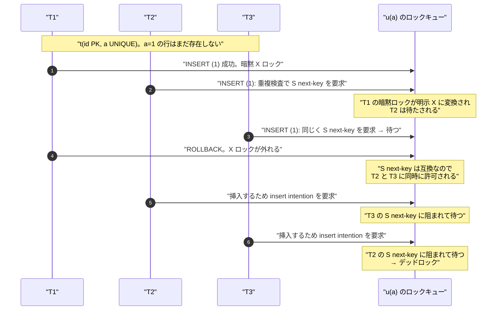

> **前提**: [ロックの種類 (InnoDB)](./lock-modes-and-types/) / [RR と RC の違い](./locking-in-rr-vs-rc/)

## 何を学んだか

INSERT は「行を書くだけ」なのでロックとは縁が薄そうに見える。実際、**UNIQUE 制約がなければ INSERT はロック構造体をほとんど作らない**。

- 挿入した行の `DB_TRX_ID` が自分の ID になるので、それが**暗黙ロック**として働く ([ロックのページ](./lock-modes-and-types/))
- 挿入位置の隙間に他人のギャップロックがなければ、**insert intention lock すら作られない**

ところが **UNIQUE インデックスがあると重複検査が入り、そこで next-key lock を取る**。しかもこの検査は分離レベルを見ない。READ COMMITTED にしてもギャップロックは消えない。

- クラスタードインデックス (= PK) の重複検査 → `LOCK_REC_NOT_GAP`
- ユニークなセカンダリインデックスの重複検査 → **`LOCK_ORDINARY` (next-key)**
- モードは、素の `INSERT` なら `LOCK_S`、`REPLACE` / `INSERT ... ON DUPLICATE KEY UPDATE` なら `LOCK_X`

「同時 INSERT で `Deadlock found when trying to get lock` が出る」の大半は、この next-key lock と insert intention の組み合わせから生まれる。

AUTO_INCREMENT のほうは別の話で、8.4 既定の `innodb_autoinc_lock_mode=2` は**テーブル単位の AUTO-INC ロックを取らない**。並行性と引き換えに、採番の連続性を捨てている。

## なぜそうなっているか

**ユニークなセカンダリの重複検査が分離レベルを無視するのは、UNIQUE 制約が分離レベルより強い保証だからだ。** 「重複がない」はどの分離レベルでも守られなければならない。もし RC でギャップを外したら、2 つのトランザクションが「重複なし」を確認してから両方が挿入できてしまう。**制約の正しさのためにギャップロックが必要**なので、`trx->skip_gap_locks()` ではなく `table->skip_gap_locks()` (DD テーブル例外だけ) を見ている。DD テーブルが例外なのは、DDL が MDL で直列化されているぶん InnoDB のロックに頼らなくてよいからだ。

**クラスタードの重複検査がギャップを取らないのは、PK が B+tree のキーだからだ。** キーが等しいレコードは高々 1 本しかありえず、「等しい値の集合」を守るための隙間が存在しない。だから `LOCK_REC_NOT_GAP` で足りる。**PK 衝突より UNIQUE 衝突のほうがデッドロックを起こしやすい**のはこの差から来ている。

**insert intention を「待つときだけ作る」のは、INSERT の常道を軽くするためだ。** 大半の INSERT は誰とも競合しない。そこで毎回ロック構造体を作るのは無駄なので、「次のレコードにロックが 1 つもない」を最初に確かめて即座に抜ける。挿入した行自体の保護は `DB_TRX_ID` (暗黙ロック) が担う。

**誰も insert intention を待たないようにしたのは、不要なデッドロックを消すためだ。** ソースのコメントがそう書いている——「next-key lock が insert intention を待ち、その insert intention が許可されたときに、待っていた next-key lock でデッドロックした」という実際の障害への対処だと読める。insert intention は「挿入したい」という意思表示にすぎず、それ自体は何も守っていない。

**`innodb_autoinc_lock_mode` の既定が 2 になったのは、STATEMENT ベースの binlog が主流でなくなったからだ。** モード 0 が AUTO-INC ロックを文の終わりまで保持していたのは、「1 つの文が採番した値が連続する」ことを保証するためで、それは STATEMENT ベースのレプリケーションで同じ結果を再現するのに必要だった。ROW ベースが既定になった今、その保証は要らない。ヘルプ文が `2 => No AUTOINC locking (unsafe for SBR)` と明記している。

**`PLUGIN_VAR_READONLY` にしてあるのは、稼働中に切り替えると採番の性質が途中で変わるからだ。** 同じテーブルに対して「連続を保証するモード」と「しないモード」の文が混ざると、レプリケーションの安全性を静的に判断できなくなる。

## ソースコードのどこか

### INSERT の骨格

クラスタードインデックスへの挿入は [`row_ins_clust_index_entry_low` (`row0ins.cc#L2396`)](https://github.com/mysql/mysql-server/blob/mysql-8.4.11/storage/innobase/row/row0ins.cc#L2396)、セカンダリは [`row_ins_sec_index_entry` (L3200)](https://github.com/mysql/mysql-server/blob/mysql-8.4.11/storage/innobase/row/row0ins.cc#L3200)。クラスタード側で重複検査が呼ばれるのは [L2527](https://github.com/mysql/mysql-server/blob/mysql-8.4.11/storage/innobase/row/row0ins.cc#L2527) だ。

### クラスタードの重複検査 — record-not-gap

```cpp title="storage/innobase/row/row0ins.cc"
        /* If the SQL-query will update or replace
        duplicate key we will take X-lock for
        duplicates ( REPLACE, LOAD DATAFILE REPLACE,
        INSERT ON DUPLICATE KEY UPDATE). */

        err = row_ins_set_rec_lock(row_allow_duplicates(thr) ? LOCK_X : LOCK_S,
                                   LOCK_REC_NOT_GAP, btr_cur_get_block(cursor),
                                   rec, cursor->index, offsets, thr);
```

[`row_ins_duplicate_error_in_clust` (L2178)](https://github.com/mysql/mysql-server/blob/mysql-8.4.11/storage/innobase/row/row0ins.cc#L2178) の中。カーソルの `low_match` 側と `up_match` 側で同じことを 2 回やる。**PK の重複検査は `LOCK_REC_NOT_GAP` なのでギャップを押さえない。** PK は B+tree のキーそのものなので、「等しい値のレコードは高々 1 本」であり、隙間を守る必要がない。

[`row_allow_duplicates` (L1913)](https://github.com/mysql/mysql-server/blob/mysql-8.4.11/storage/innobase/row/row0ins.cc#L1913) は `prebuilt->allow_duplicates()` を見るだけで、`REPLACE` / `INSERT ... ON DUPLICATE KEY UPDATE` / `LOAD DATA ... REPLACE` で true になる。

### ユニークなセカンダリの重複検査 — next-key

こちらが問題の関数だ。

```cpp title="storage/innobase/row/row0ins.cc"
  const bool skip_gap_locks = index->table->skip_gap_locks();
  /* Scan index records and check if there is a duplicate */

  do {
    ...
    ulint lock_type = skip_gap_locks ? LOCK_REC_NOT_GAP : LOCK_ORDINARY;
```

[`row_ins_scan_sec_index_for_duplicate` (`row0ins.cc#L1921`)](https://github.com/mysql/mysql-server/blob/mysql-8.4.11/storage/innobase/row/row0ins.cc#L1921)、フラグは [L1967](https://github.com/mysql/mysql-server/blob/mysql-8.4.11/storage/innobase/row/row0ins.cc#L1967)。**ここで見ているのは `dict_table_t::skip_gap_locks()`、つまり DD / SDI テーブルかどうかだけ**であって、`trx_t::skip_gap_locks()` ではない ([RR と RC のページ](./locking-in-rr-vs-rc/))。ローカル変数の名前がメンバ関数と同じなので読み間違えやすいが、**ユーザテーブルではこれは常に false** で、`lock_type` は `LOCK_ORDINARY` に固定される。

ロックの種類はレコードの位置で調整される。

```cpp title="storage/innobase/row/row0ins.cc"
      } else if (is_supremum) {
        /* We use next key lock to possibly combine the locks in bitmap.
        Equivalent to LOCK_GAP. */
        lock_type = LOCK_ORDINARY;
      } else if (is_next) {
        /* Only gap lock is required on next record. */
        lock_type = LOCK_GAP;
      } else {
        /* Next key lock for all equal keys. */
        lock_type = LOCK_ORDINARY;
      }
```

[L2027-L2037](https://github.com/mysql/mysql-server/blob/mysql-8.4.11/storage/innobase/row/row0ins.cc#L2027)。**値が等しいレコードすべてに next-key lock、その次の (等しくない) レコードにはギャップロックだけ。** 直後のコメントが目的を書いている——「重複が起こりうる場所、つまり等しい行と、それらの間の隙間と、両側の隙間だけをロックすればよい」。

モードは素の INSERT なら `LOCK_S` ([L2046](https://github.com/mysql/mysql-server/blob/mysql-8.4.11/storage/innobase/row/row0ins.cc#L2046))、`REPLACE` / IODKU なら `LOCK_X` ([L2014](https://github.com/mysql/mysql-server/blob/mysql-8.4.11/storage/innobase/row/row0ins.cc#L2014))。

### insert intention は待つときだけ作られる

```cpp title="storage/innobase/lock/lock0lock.cc"
    if (!lock_rec_has_any(lock_sys->rec_hash, block->get_page_id(), heap_no)) {
      *inherit = false;
    } else {
      *inherit = true;
      ...
      const ulint type_mode = LOCK_X | LOCK_GAP | LOCK_INSERT_INTENTION;

      const auto conflicting =
          lock_rec_other_has_conflicting(type_mode, block, heap_no, trx);
      ...
      if (conflicting.wait_for != nullptr) {
        RecLock rec_lock(thr, index, block, heap_no, type_mode);

        trx_mutex_enter(trx);

        err = rec_lock.add_to_waitq(conflicting.wait_for);
```

[`lock_rec_insert_check_and_lock` (`lock0lock.cc#L5139`)](https://github.com/mysql/mysql-server/blob/mysql-8.4.11/storage/innobase/lock/lock0lock.cc#L5139)。3 段の短絡がある。

1. **挿入位置の次のレコードに誰のロックもなければ、何もしない**
2. ロックはあるが競合しなければ、やはり `lock_t` を作らない
3. 競合するときだけ `LOCK_X | LOCK_GAP | LOCK_INSERT_INTENTION` の待ちロックを作る

つまり **`performance_schema.data_locks` に insert intention が見えるのは、その INSERT が待たされているときだけ**だ。順調に流れている INSERT は痕跡を残さない。この関数には `isolation_level` の分岐がない。**insert intention は RC でも取る。**

### INSERT 同士のデッドロック

[ロックのページの互換表](./lock-modes-and-types/)の最下行が、この節の答えになっている。**insert intention は S / X どちらのギャップロック・next-key lock にも待たされる。** そして next-key lock 同士は S なら共存する。この 2 つを組み合わせると、`UNIQUE` キーへの同時 INSERT でデッドロックが構成できる。



**要点は「S next-key lock は互いに互換なので同時に許可される」が「その後の insert intention は互いのギャップロックに阻まれる」という非対称性**だ。ロック取得の 2 段階 (重複検査 → 実挿入) の間に他人が同じ状態に到達すると、必ず循環する。

`REPLACE` / `INSERT ... ON DUPLICATE KEY UPDATE` は重複検査で `LOCK_X` を取るので、上の図のステップ 2-3 で並んで待つことはない (X 同士は非互換)。代わりに**ロック昇格のデッドロック**が起きる。MTR テストのコメントがその形をそのまま説明している。

```
# There are various scenarious in which a transaction already holds "half"
# of a record lock (for example, a lock on the record but not on the gap)
# and wishes to "upgrade it" to a full lock (i.e. on both gap and record).
# This is often a cause for a deadlock, if there is another transaction
# which is already waiting for the lock being blocked by us:
# 1. our granted lock for one half
# 2. her waiting lock for the same half
# 3. our waiting lock for the whole
```

`mysql-test/suite/innodb/t/deadlock_on_lock_upgrade.test`。テストが再現しているのは「3 つのセッションがユニークキーで同じ行を DELETE する」ケースで、`LOCK_REC_NOT_GAP` を持っているセッションが「隙間も塞ぐ」ために next-key へ昇格しようとして循環する。**「半分持っていて残り半分を取りに行く」形は必ずデッドロックの候補になる**、と読める。

### AUTO_INCREMENT

採番の入口は [`ha_innobase::get_auto_increment` (`ha_innodb.cc#L19919`)](https://github.com/mysql/mysql-server/blob/mysql-8.4.11/storage/innobase/handler/ha_innodb.cc#L19919) → `innobase_get_autoinc` → [`innobase_lock_autoinc` (L8930)](https://github.com/mysql/mysql-server/blob/mysql-8.4.11/storage/innobase/handler/ha_innodb.cc#L8930)。ロックモードで 3 分岐する。

```cpp title="storage/innobase/handler/ha_innodb.cc"
  switch (lock_mode) {
    case AUTOINC_NO_LOCKING:
      /* Acquire only the AUTOINC mutex. */
      dict_table_autoinc_lock(m_prebuilt->table);
      break;

    case AUTOINC_NEW_STYLE_LOCKING:
      /* For simple (single/multi) row INSERTs, we fallback to the
      old style only if another transaction has already acquired
      the AUTOINC lock on behalf of a LOAD FILE or INSERT ... SELECT
      etc. type of statement. */
      if (thd_sql_command(m_user_thd) == SQLCOM_INSERT ||
          thd_sql_command(m_user_thd) == SQLCOM_REPLACE) {
        ...
        if (ib_table->count_by_mode[LOCK_AUTO_INC]) {
          /* Release the mutex to avoid deadlocks. */
          dict_table_autoinc_unlock(ib_table);
        } else {
          break;
        }
      }
      [[fallthrough]];

    case AUTOINC_OLD_STYLE_LOCKING:
      ...
      error = row_lock_table_autoinc_for_mysql(m_prebuilt);
```

`AUTOINC_*` の定数は [L310-L312](https://github.com/mysql/mysql-server/blob/mysql-8.4.11/storage/innobase/handler/ha_innodb.cc#L310)。

- `0` (`AUTOINC_OLD_STYLE_LOCKING`) — `LOCK_AUTO_INC` というテーブルレベルのロックを取り、**文の終わりまで保持する**
- `1` (`AUTOINC_NEW_STYLE_LOCKING`) — 単純な `INSERT` / `REPLACE` なら短い mutex だけ。行数が事前に分からない文 (`INSERT ... SELECT` など) は old style に落ちる
- `2` (`AUTOINC_NO_LOCKING`) — 常に短い mutex だけ

**8.4 の既定は `2`** ([L23147 の sysvar 定義](https://github.com/mysql/mysql-server/blob/mysql-8.4.11/storage/innobase/handler/ha_innodb.cc#L23147))。`PLUGIN_VAR_READONLY` なので**サーバ起動時にしか変えられない**。

`LOCK_AUTO_INC` はテーブルロックの一種で、互換表 ([`lock0priv.h#L593`](https://github.com/mysql/mysql-server/blob/mysql-8.4.11/storage/innobase/include/lock0priv.h#L593)) を見ると `IS` / `IX` とは互換だが `AI` 同士は非互換だ。つまり**同じテーブルへの AUTO-INC 採番は 1 本ずつしか通らない**。これがモード 0 / 1 の並行性の上限になる。

解放は文の終わりで行われる。

```cpp title="storage/innobase/handler/ha_innodb.cc"
    /* If we had reserved the auto-inc lock for some
    table in this SQL statement we release it now */

    if (!read_only) {
      lock_unlock_table_autoinc(trx);
    }
```

[`innobase_commit` の中 (L6144)](https://github.com/mysql/mysql-server/blob/mysql-8.4.11/storage/innobase/handler/ha_innodb.cc#L6144)。行ロックと違って**コミットまで持たない**。ロールバック側 ([L6197](https://github.com/mysql/mysql-server/blob/mysql-8.4.11/storage/innobase/handler/ha_innodb.cc#L6197)) にも同じ呼び出しがあり、コメントが「長くなりうるロールバックの前に解放する」と書いている。

採番値そのものは `dict_table_autoinc_update_if_greater` で単調最大更新され ([L20037](https://github.com/mysql/mysql-server/blob/mysql-8.4.11/storage/innobase/handler/ha_innodb.cc#L20037))、テーブルの `autoinc_persisted` として永続化される ([`ha_innobase::open` の L7805 付近](https://github.com/mysql/mysql-server/blob/mysql-8.4.11/storage/innobase/handler/ha_innodb.cc#L7805))。8.0 以降はこの永続化のおかげで**再起動しても採番が巻き戻らない**。

## どう活かすか

**`Deadlock found when trying to get lock` が同時 INSERT で出るなら、まず UNIQUE インデックスを疑う。** PK だけのテーブルへの INSERT は基本的にデッドロックしない。ユニークなセカンダリインデックスがあり、**同じ値を複数セッションが同時に挿入しようとしている**のが典型パターンだ。上の図のとおり、片方がロールバックした瞬間に対称的な循環ができる。

**`INSERT ... ON DUPLICATE KEY UPDATE` を「upsert の安全な書き方」と思わない。** 重複検査で X next-key lock を取るので、素の INSERT より広くロックする。同じキーへの同時実行が多いなら、**アプリ側で先に SELECT して分岐する**より、`INSERT ... ON DUPLICATE KEY UPDATE` をリトライ前提で使うほうが正しいが、リトライは必須になる ([デッドロック検出のページ](./deadlock-detection/))。

**挿入順序を揃えるとデッドロックが減る。** 複数行を 1 文で挿入するとき、値の順序が異なるセッション同士は逆順にロックを取り合う。アプリ側でキーをソートしてから渡すのは、ロック取得順序を揃えるという意味で有効な対策だ。

**AUTO_INCREMENT の値が飛ぶのは正常。** `innodb_autoinc_lock_mode=2` では、採番した後にロールバックしても値は戻らない。`dict_table_autoinc_update_if_greater` が単調最大更新しかしないからだ。**「連番だから件数が分かる」「連番だから欠番がない」という前提でアプリを組んではいけない。** 8.0 以降は再起動でも巻き戻らないので、5.7 時代の「再起動で採番が巻き戻る」問題は解消している。

**`INSERT ... SELECT` が AUTO-INC ロックを取る条件を理解しておく。** `innodb_autoinc_lock_mode=2` なら取らないが、**0 や 1 にしている環境では `INSERT ... SELECT` が `LOCK_AUTO_INC` をテーブル全体に文の終わりまで掛ける**。長い `INSERT ... SELECT` が同じテーブルへの他の INSERT を全部止める、という症状はこれだ。`SHOW ENGINE INNODB STATUS` の TRANSACTIONS セクションに `lock mode AUTO-INC` の待ちが並ぶ。

**AUTO-INC ロックはコミットではなく文の終わりで外れる。** 長いトランザクションの中に短い `INSERT` が入っていても、AUTO-INC ロックはその文の終わりで解放される。**行ロックと解放タイミングが違う**ことは、ロック待ちの原因を切り分けるときに効く。
