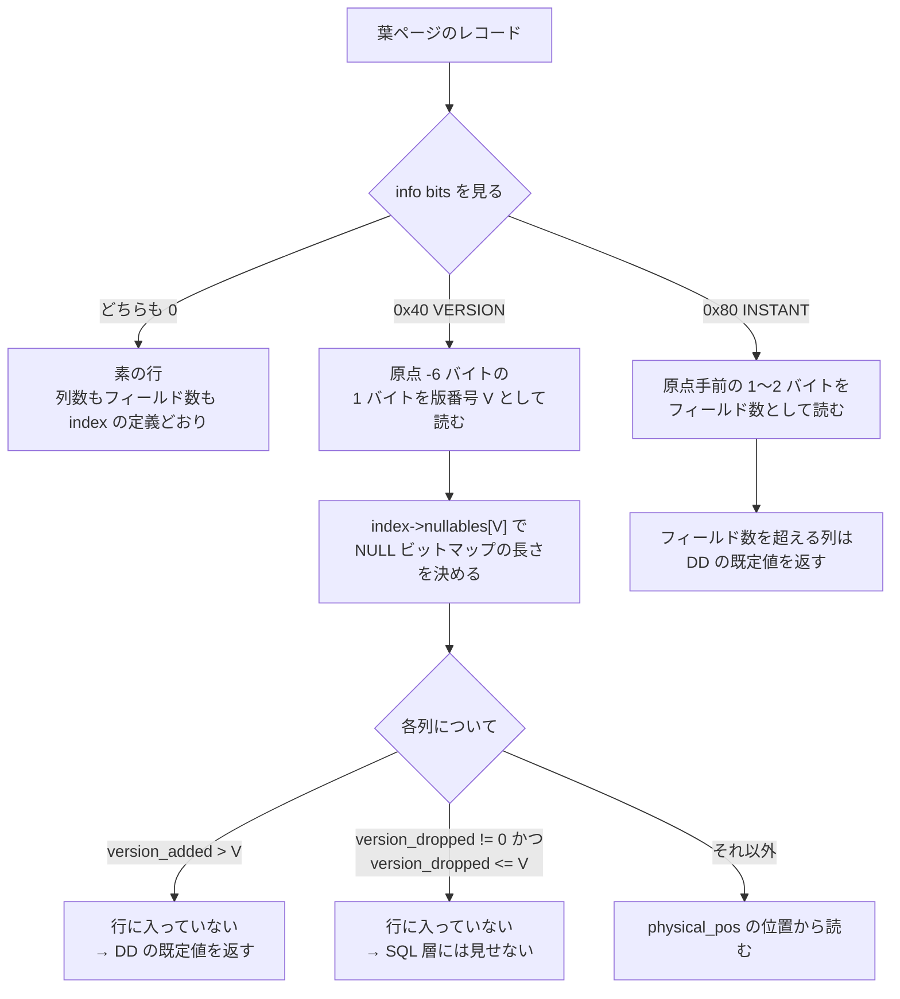

## 何を学んだか

`ALTER TABLE t ADD COLUMN c INT DEFAULT 0, ALGORITHM=INSTANT` が 1 億行のテーブルでも数ミリ秒で終わる理由は、**既存の行を 1 バイトも触らないから**だ。それは分かるとして、では既存の行を読んだときに `c` の値はどこから来るのか。

答えは 2 段構えになっている。

1. **行の側**: 新しく書かれる行だけがレコードヘッダの直前に **1 バイトの版番号**を持つ。既存の行には何も足さない
2. **辞書の側**: 各列が「どの版で追加されたか」「どの版で削除されたか」「物理的に何番目にあるか」を `dd::Column::se_private_data` に持つ

読むときは、行の版番号 V と列の `version_added` / `version_dropped` を突き合わせる。V が `version_added` より前なら、その列は行に**入っていない**ので既定値を返す。

そして **8.4.11 の InnoDB には instant DDL の機構が 2 つ同居している。**

|                        | 8.0.13 の instant cols         | 8.0.29 の row versions                                               |
| ---------------------- | ------------------------------ | -------------------------------------------------------------------- |
| できること             | ADD COLUMN (末尾のみ)          | ADD / DROP COLUMN (位置は自由)                                       |
| レコードの info bit    | `REC_INFO_INSTANT_FLAG` (0x80) | `REC_INFO_VERSION_FLAG` (0x40)                                       |
| レコードが持つ追加情報 | フィールド数 (1〜2 バイト)     | 版番号 (1 バイト)                                                    |
| `dict_table_t` の目印  | `n_instant_cols < n_cols`      | `current_row_version > 0`                                            |
| DD 側のキー            | `dd::Table` の `instant_col`   | `dd::Column` の `version_added` / `version_dropped` / `physical_pos` |

**同じテーブルで両方が立つことはない**、というのがコード上の不変条件になっている。新しく作ったテーブルは常に row versions を使い、instant cols は 8.0.29 より前に作られたテーブルをアップグレードしたときにだけ残る。

1 件のレコードを読むときの分岐はこうなる。



## ソースコードのどこか

### レコード側 — 2 つの info bit

InnoDB のレコードヘッダの info bits は 4 ビット使われている ([`storage/innobase/rem/rec.h#L144`](https://github.com/mysql/mysql-server/blob/mysql-8.4.11/storage/innobase/rem/rec.h#L144))。

```cpp title="storage/innobase/rem/rec.h"
constexpr uint32_t REC_INFO_MIN_REC_FLAG = 0x10UL;
/** The deleted flag in info bits; when bit is set to 1, it means the record has
 been delete marked */
constexpr uint32_t REC_INFO_DELETED_FLAG = 0x20UL;
/* Use this bit to indicate record has version */
constexpr uint32_t REC_INFO_VERSION_FLAG = 0x40UL;
/** The instant ADD COLUMN flag. When it is set to 1, it means this record
was inserted/updated after an instant ADD COLUMN. */
constexpr uint32_t REC_INFO_INSTANT_FLAG = 0x80UL;
```

レコードの物理構造は [レコードの構造のページ](./record-format/) で見たとおり、ヘッダはデータの**前方**に伸びる。版番号が入るのは 5 バイトの extra header のすぐ外側、つまり**通常なら NULL ビットマップの先頭が来る位置**だ。版を持つ行では NULL ビットマップと可変長ヘッダが 1 バイトずつ外へ押し出される (`rec_init_null_and_len_comp` が版を読んだあと `*nulls -= 1` している)。

```cpp title="storage/innobase/include/rem0rec.ic"
/** Get the row version on a new style leaf page record.
This is only needed for table after instant ADD/DROP COLUMN.
@param[in]      rec             leaf page record
@return row version */
static inline uint8_t rec_get_instant_row_version_new(const rec_t *rec) {
  uint8_t row_version = 0;
  const byte *ptr = rec - (REC_N_NEW_EXTRA_BYTES + 1);
  row_version = *ptr;
  /* For upgraded table, we store version 0 */
  ut_ad(is_valid_row_version(row_version));

  return row_version;
}
```

`REC_N_NEW_EXTRA_BYTES` は 5 なので、レコード原点から 6 バイト手前の 1 バイトが版番号だ。**版を持たない行ではこのバイトが存在しない**ので、レイアウトそのものが行ごとに違う。だから読むときは必ず info bits を先に見る。

REDUNDANT 形式にも同じ仕組みがあり、そちらは `REC_N_OLD_EXTRA_BYTES` (6) が基準になる。

### 2 つの機構が排他であることの保証

`rec_convert_dtuple_to_rec_new` の末尾に `ut_a` が置いてある (`ut_ad` ではなく、リリースビルドでも消えない)。

```cpp title="storage/innobase/rem/rem0rec.cc"
  switch (rec_state) {
    case Rec_instant_state::REC_IS_SIMPLE:
      rec_new_reset_instant_version(rec);
      break;
    case Rec_instant_state::REC_IS_VERSIONED:
      ut_a(index->has_instant_cols_or_row_versions());
      rec_new_set_versioned(rec);
      break;
    case Rec_instant_state::REC_IS_INSTANT:
      ut_a(index->has_instant_cols_or_row_versions());
      ut_a(index->table->has_instant_cols());
      rec_new_set_instant(rec);
      break;
    default:
      ut_error;
  }

  /* Only one of the bit (INSTANT or VERSION) could be set */
  ut_a(!(rec_get_instant_flag_new(rec) && rec_new_is_versioned(rec)));
```

[`storage/innobase/rem/rem0rec.cc#L1094`](https://github.com/mysql/mysql-server/blob/mysql-8.4.11/storage/innobase/rem/rem0rec.cc#L1094)。同じ判定が `row0upd.cc` の更新経路にもある。テーブル単位でも同じ不変条件が assert されている。

```cpp title="storage/innobase/include/dict0mem.h"
  /** check if either instant or versioned.
  @return true if table has row versions or instant cols, otherwise false */
  bool has_instant_cols_or_row_versions() const {
    if (!is_clustered()) {
      ut_ad(!has_row_versions() && !has_instant_cols());
      return false;
    }

    return (has_row_versions() || has_instant_cols());
  }
```

[`dict0mem.h#L1352`](https://github.com/mysql/mysql-server/blob/mysql-8.4.11/storage/innobase/include/dict0mem.h#L1352)。**セカンダリインデックスは instant にも versioned にもならない。** INSTANT ADD/DROP されるのはクラスタードインデックスの列だけで、セカンダリインデックスに影響する変更 (`ADD INDEX` など) が混ざった時点で INSTANT ではなくなる ([ALGORITHM と LOCK の決定](./alter-algorithm-selection/))。

### 辞書側 — `dict_table_t` の 4 つのカウンタ

```cpp title="storage/innobase/include/dict0mem.h"
  /** Current row version in case columns are added/dropped INSTANTly */
  uint32_t current_row_version{0};

  /** Initial non-virtual column count */
  uint32_t initial_col_count{0};

  /** Current non-virtual column count */
  uint32_t current_col_count{0};

  /** Total non-virtual column count */
  uint32_t total_col_count{0};
```

[`dict0mem.h#L2141`](https://github.com/mysql/mysql-server/blob/mysql-8.4.11/storage/innobase/include/dict0mem.h#L2141)。3 つの列数の差が意味を持つ。

```cpp title="storage/innobase/include/dict0mem.h"
  /** Get number of columns added instantly */
  uint32_t get_n_instant_add_cols() const {
    ut_ad(total_col_count >= initial_col_count);
    return total_col_count - initial_col_count;
  }

  /** Get number of columns dropped instantly */
  uint32_t get_n_instant_drop_cols() const {
    ut_ad(total_col_count >= current_col_count);
    return total_col_count - current_col_count;
  }
```

**`total_col_count` は削除済みの列も数えている。** INSTANT DROP した列は辞書から消えず、「もう見えないが物理的には過去の行に残っている列」として残り続ける。だから `get_total_cols()` はこう書かれる。

```cpp title="storage/innobase/include/dict0mem.h"
  ulint get_total_cols() const {
    if (!has_row_versions()) {
      return n_cols;
    }

    ut_ad((total_col_count + get_n_sys_cols()) ==
          (n_cols + get_n_instant_drop_cols()));
    return n_cols + get_n_instant_drop_cols();
  }
```

### 列側 — DD に持つ 3 つの値

InnoDB は `dd::Column::se_private_data` に自分用のキーを詰める。文字列は [`storage/innobase/include/dict0dd.h#L241`](https://github.com/mysql/mysql-server/blob/mysql-8.4.11/storage/innobase/include/dict0dd.h#L241) に並んでいる。

```cpp title="storage/innobase/include/dict0dd.h"
/** InnoDB private key strings for dd::Column, @see dd_column_keys */
const char *const dd_column_key_strings[DD_COLUMN__LAST] = {
    "default", "default_null", "version_added", "version_dropped",
    "physical_pos"};
```

対応する enum のコメントが役割を説明している。

```cpp title="storage/innobase/include/dict0dd.h"
enum dd_column_keys {
  /** Default value when it was added instantly */
  DD_INSTANT_COLUMN_DEFAULT,
  /** Default value is null or not */
  DD_INSTANT_COLUMN_DEFAULT_NULL,
  /** Row version when this column was added instantly */
  DD_INSTANT_VERSION_ADDED,
  /** Row version when this column was dropped instantly */
  DD_INSTANT_VERSION_DROPPED,
  /** Column physical position on row when it was created */
  DD_INSTANT_PHYSICAL_POS,
  /** Sentinel */
  DD_COLUMN__LAST
};
```

**`physical_pos` があるのが本質的だ。** 列を途中に `ADD COLUMN ... AFTER x` で入れても、物理的には行の末尾に付く。論理的な列順 (SQL 層が見る順) と物理的な列順 (行のバイト列の順) が分離されているから、途中への追加も INSTANT にできる。

メモリ上の `dict_col_t` にも同じ 3 つがある ([`dict0mem.h#L585`](https://github.com/mysql/mysql-server/blob/mysql-8.4.11/storage/innobase/include/dict0mem.h#L585) 付近)。

```cpp title="storage/innobase/include/dict0mem.h"
  bool is_instant_added() const {
    if (version_added != UINT8_UNDEFINED && version_added > 0) {
      return true;
    }
    return false;
  }
  ...
  bool is_instant_dropped() const {
    if (version_dropped != UINT8_UNDEFINED && version_dropped > 0) {
      return true;
    }
    return false;
  }
```

### NULL ビットマップの長さが版ごとに違う

いちばん厄介なのがここだ。COMPACT / DYNAMIC のレコードは、NULL 許容列 1 つにつき 1 ビットの NULL ビットマップを持つ。**その長さは「そのテーブルに NULL 許容列がいくつあるか」で決まる。** INSTANT ADD/DROP で NULL 許容列の数が変わると、版によって NULL ビットマップの長さが変わってしまう。

そこで `dict_index_t` に版ごとの表を持たせている。

```cpp title="storage/innobase/include/dict0mem.h"
  uint32_t nullables[MAX_ROW_VERSION + 1] = {0};
```

[`dict0mem.h#L1162`](https://github.com/mysql/mysql-server/blob/mysql-8.4.11/storage/innobase/include/dict0mem.h#L1162)。65 要素の配列で、`create_nullables(current_row_version)` が埋める。読むときは版番号で引く。

```cpp title="storage/innobase/rem/rem0rec.cc"
  if (index->has_row_versions()) {
    /* Table has version. New records will be stored in latest format. */
    ut_ad(is_valid_version);
    nullable_fields = index->get_nullable_in_version(rec_version);
  } else if (index->has_instant_cols()) {
    /* Table has no version. New records will be written as of old way. */
    nullable_fields =
        index->get_n_nullable_before(static_cast<uint32_t>(n_fields));
  } else {
    /* Table has no version no instant. All the fields will be there. */
    nullable_fields = index->n_nullable;
  }
```

[`rem0rec.cc#L281`](https://github.com/mysql/mysql-server/blob/mysql-8.4.11/storage/innobase/rem/rem0rec.cc#L281)。**3 分岐が 3 つの機構 (row versions / instant cols / 素の行) にそのまま対応している。**

### 上限は 64

```cpp title="storage/innobase/include/dict0mem.h"
/** Maximum number of rows version allowed when columns are added/dropped
INSTANTly. After this limit is reached, any attempt to do ADD/DROP INSTANT
column will result in error. */
const uint8_t MAX_ROW_VERSION = 64;
```

[`dict0mem.h#L323`](https://github.com/mysql/mysql-server/blob/mysql-8.4.11/storage/innobase/include/dict0mem.h#L323)。上限に触れたときの判定は `check_if_supported_inplace_alter` の中にある。

```cpp title="storage/innobase/handler/handler0alter.cc"
        } else if (!is_valid_row_version(
                       m_prebuilt->table->current_row_version + 1)) {
          ut_ad(is_valid_row_version(m_prebuilt->table->current_row_version));
          if (is_instant_requested) {
            my_error(ER_INNODB_MAX_ROW_VERSION, MYF(0),
                     m_prebuilt->table->name.m_name);
            return HA_ALTER_ERROR;
          }

          /* INSTANT can't be done any more. Fall back to INPLACE. */
          break;
        }
```

**`ALGORITHM=INSTANT` を明示していなければエラーにならず、黙って INPLACE (= 表の再構築) に落ちる。** 65 回目の `ADD COLUMN` が突然何時間もかかるようになる、という形で顕在化する。

### INSTANT がやっている「唯一の実作業」

commit フェーズの本体は [`storage/innobase/dict/dict0inst.cc#L198`](https://github.com/mysql/mysql-server/blob/mysql-8.4.11/storage/innobase/dict/dict0inst.cc#L198) の `commit_instant_ddl()` だ。

```cpp title="storage/innobase/dict/dict0inst.cc"
    case Instant_Type::INSTANT_ADD_DROP_COLUMN:
      trx_start_if_not_started(m_trx, true, UT_LOCATION_HERE);
      dd_copy_private(*m_new_dd_tab, *m_old_dd_tab);

      /* Fetch the columns which are to be added or dropped */
      populate_to_be_instant_columns();

      ut_ad(!m_cols_to_add.empty() || !m_cols_to_drop.empty());

      if (!m_cols_to_drop.empty()) {
        /* INSTANT DROP */
        if (commit_instant_drop_col()) return true;
      }

      if (!m_cols_to_add.empty()) {
        /* INSTANT ADD */
        if (commit_instant_add_col()) return true;
      }

      /* Update the current row version in dictionary cache */
      m_dict_table->current_row_version++;
```

**`current_row_version++` が INSTANT DDL の実体だ。** その前後は DD のオブジェクトに `version_added` / `version_dropped` / `default` を書き込むだけで、テーブルスペースには 1 ページも触らない。最後に `innobase_discard_table` で辞書キャッシュから追い出し、次に開いたときに新しいメタデータを読ませる。

`inplace_alter_table` フェーズ (本来なら行を触る場所) は即座に return する。

```cpp title="storage/innobase/handler/handler0alter.cc"
  if (!(ha_alter_info->handler_flags & INNOBASE_ALTER_DATA) ||
      is_instant(ha_alter_info)) {
    return all_ok();
  }
```

[`handler0alter.cc#L6166`](https://github.com/mysql/mysql-server/blob/mysql-8.4.11/storage/innobase/handler/handler0alter.cc#L6166)。

## なぜそうなっているか

**「行に版番号を持たせる」のは、既存の行を書き換えないための最小の追加情報だからだ。** 代替案は 2 つ考えられる。1 つは「新しい列の既定値をテーブル単位で持ち、フィールド数が足りない行には既定値を補う」という方式で、これが 8.0.13 の instant cols だった。だが**この方式では列を末尾にしか足せず、削除もできない**。フィールド数だけでは「どの列が欠けているか」を特定できないからだ。

もう 1 つは「行のフォーマットを版ごとにテーブル外に持つ」で、これは実質同じことを言っている。1 バイトを行に足すコストは、**新しく書く行にだけ**かかる。既存の行はそのままなので、ALTER の時点でのコストはゼロになる。

**64 という上限は、`nullables[MAX_ROW_VERSION + 1]` の配列サイズと、削除済み列が辞書に残り続けることのコストから来ている。** 版が増えるほど `dict_index_t` のメモリが増え、`get_nullable_in_version` の表も伸びる。1 バイトの版番号は 255 まで表現できるので、64 は物理的な限界ではなく**運用上の妥当な線として選ばれた値**だ。コメントも「この上限に達したらエラーになる」としか書いていない。

**論理列順と物理列順を分離したのが 8.0.29 の最大の設計変更だ。** `physical_pos` を導入したことで、`ADD COLUMN ... AFTER x` も `DROP COLUMN` も「物理的には末尾に足すか、物理的にはそのまま残す」で表現できるようになった。表示上の列順は DD が持ち、行のバイト列は追加順のままになる。**`SELECT *` の列順が正しく見えていても、ディスク上の並びはそれとは違う。**

**INSTANT DROP した列が消えないのは、古い行を書き換えないという前提の直接の帰結だ。** version 3 で列を落としても、version 0〜2 の行にはその列のバイトが残っている。読むときに読み飛ばすには、その列の型と長さを知っていなければならない。だから辞書に残す。**この「見えないが残っている列」の掃除は、表の再構築でしかできない。**

## どう活かすか

### 現在の状態を見る

```sql
SELECT NAME, N_COLS, INSTANT_COLS, TOTAL_ROW_VERSIONS
  FROM information_schema.INNODB_TABLES
 WHERE NAME LIKE 'mydb/%'
   AND TOTAL_ROW_VERSIONS > 0
 ORDER BY TOTAL_ROW_VERSIONS DESC;
```

`TOTAL_ROW_VERSIONS` は `dict_table_t::current_row_version` をそのまま出している ([`storage/innobase/handler/i_s.cc#L5358`](https://github.com/mysql/mysql-server/blob/mysql-8.4.11/storage/innobase/handler/i_s.cc#L5358))。`INSTANT_COLS` は 8.0.13 方式のときだけ非ゼロになる (`table->is_upgraded_instant()` が真のとき)。

**同じビューの `INITIAL_COLUMN_COUNTS` / `CURRENT_COLUMN_COUNTS` / `TOTAL_COLUMN_COUNTS` は `#ifdef UNIV_DEBUG` の中にある**ので、通常のリリースビルドには存在しない。デバッグビルド前提の記事を読むときは注意が必要だ。

列ごとの版も `INNODB_COLUMNS` に定義はある。ただし**`VERSION_ADDED` / `VERSION_DROPPED` / `PHYSICAL_POS` の 3 列はまるごと `#ifdef UNIV_DEBUG` の中**なので ([`i_s.cc#L6127-6148`](https://github.com/mysql/mysql-server/blob/mysql-8.4.11/storage/innobase/handler/i_s.cc#L6129))、リリースビルドでは次のクエリは `Unknown column` になる。

```sql
-- デバッグビルドでのみ動く
SELECT c.NAME, c.POS, c.PHYSICAL_POS, c.VERSION_ADDED, c.VERSION_DROPPED
  FROM information_schema.INNODB_COLUMNS c
  JOIN information_schema.INNODB_TABLES t USING (TABLE_ID)
 WHERE t.NAME = 'mydb/users'
 ORDER BY c.PHYSICAL_POS;
```

デバッグビルドで見れば、**`POS` (論理位置) と `PHYSICAL_POS` (行の中の実際の位置) がずれていれば、そのテーブルは INSTANT ADD/DROP を経験している**ことが分かる。`VERSION_DROPPED` が非ゼロの行が「見えないが残っている列」だ。追加も削除もされていない列は `VERSION_ADDED` / `VERSION_DROPPED` が 0 になる。**通常のサーバで列単位の情報を SQL から取る手段はない**ので、運用で見るのは上の `TOTAL_ROW_VERSIONS` だけになる。

### 監視するなら `TOTAL_ROW_VERSIONS`

**「64 に近づいたら再構築」を運用に組み込む。** 40 を超えたあたりでアラートを出しておけば、突然 `ALTER TABLE` が数時間かかる事故を防げる。

```sql
ALTER TABLE users FORCE, ALGORITHM=INPLACE, LOCK=NONE;
```

`FORCE` は `RECREATE_TABLE` フラグを立てるので `INNOBASE_ALTER_REBUILD` に入り、INPLACE で表を再構築する。**これで `current_row_version` が 0 に戻り、INSTANT DROP された列も物理的に消える。** ただし表全体の書き直しなので、時間もディスクも `OPTIMIZE TABLE` と同等にかかる。

### 症状から引く

**`ERROR 4092 (HY000): Maximum row versions reached for table 'db/t'. No more columns can be added or dropped instantly. Please use COPY/INPLACE.`** — 版が 64 に到達。`ALGORITHM=INSTANT` を明示していたときだけこのエラーになる。明示していなければ INPLACE に落ちて、単に遅くなる。

**「以前は一瞬で終わっていた `ADD COLUMN` が急に遅くなった」** — まず `TOTAL_ROW_VERSIONS` を見る。64 に達していれば原因はこれ。達していなければ [ALGORITHM と LOCK の決定](./alter-algorithm-selection/) の早見表で別の理由を探す。

**「INSTANT DROP したのにディスク使用量が減らない」** — 想定どおりの挙動だ。既存の行から列のバイトは消えていない。減らしたいなら `ALTER TABLE ... FORCE`。

**「INSTANT なのに他のセッションが止まった」** — INSTANT でも commit の直前に排他 MDL を取る ([ALTER の walkthrough](./ddl-walkthrough/))。長いトランザクションが 1 本あればそこで待たされ、待っている間は後続の全クエリが並ぶ ([MDL のページ](./metadata-locking/))。**「INSTANT = ノーロック」ではない。速いのは InnoDB 側の作業であって、MDL の要求は他の DDL と変わらない。**

**「行が急に大きくなった気がする」** — INSTANT ADD/DROP を 1 回でも実行したテーブルでは、それ以降に書かれる行が 1 バイト (版番号) 増える。加えて NULL ビットマップの長さも変わりうる。数億行のテーブルなら無視できない差になる。

**圧縮テーブルでは INSTANT が一切使えない。** `support_instant_add_drop()` が `!DICT_TF_GET_ZIP_SSIZE(flags)` を要求している。`ROW_FORMAT=COMPRESSED` を使っている表は、列の追加のたびに INPLACE の再構築が走る。
