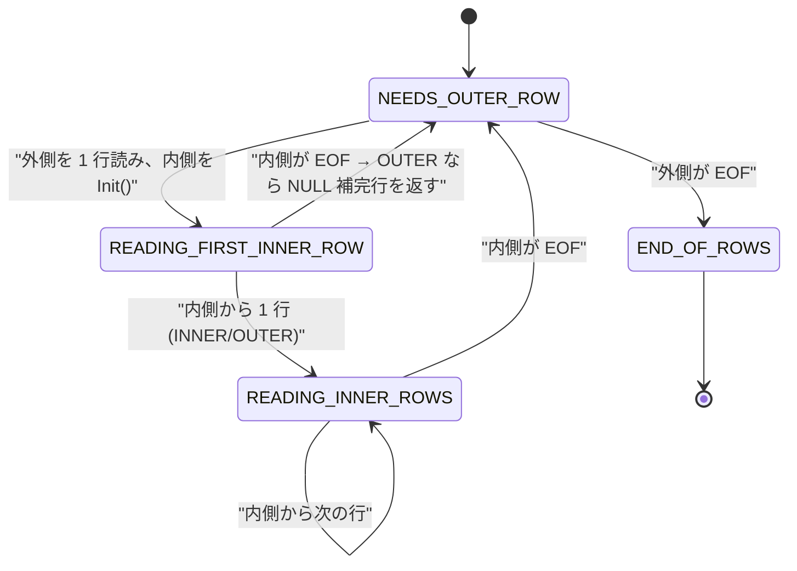
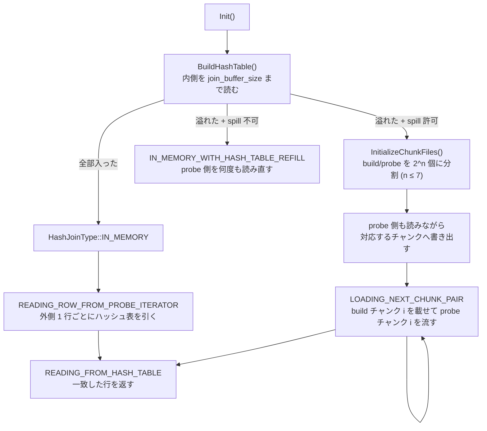

> **前提**: [iterator executor](./executor-walkthrough/) / [join 順序](./join-order-search/)

## 何を学んだか

`AccessPath::Type` の「Joins」区画には 4 つしかない ([`access_path.h#L229`](https://github.com/mysql/mysql-server/blob/mysql-8.4.11/sql/join_optimizer/access_path.h#L229))。

```cpp title="sql/join_optimizer/access_path.h"
    // Joins.
    NESTED_LOOP_JOIN,
    NESTED_LOOP_SEMIJOIN_WITH_DUPLICATE_REMOVAL,
    BKA_JOIN,
    HASH_JOIN,
```

**8.0 時代の「BNL (block nested loop)」に対応する iterator はない。** `NestedLoopIterator` のクラスコメントは "It is currently the only form of join we have." と書いているが、これは書かれた当時の名残で、実際には hash join と BKA が並んでいる。BNL の座は 8.0.20 以降 hash join が全部引き取り、EXPLAIN の表示だけが `Using join buffer (hash join)` という形で残った。

押さえるべきは 3 点だ。

1. **nested loop は「内側を外側 1 行ごとに `Init()` し直す」ことで実現されている。** join 専用の機構ではなく、`RowIterator` の巻き戻し契約をそのまま使っている ([エグゼキュータのページ](./executor-walkthrough/))
2. **hash join は build 側 (内側) を `join_buffer_size` ぶんメモリに載せ、溢れたら最大 128 個のチャンクファイルに分割する。** 溢れた瞬間に、それまで保たれていた「probe 側の順序」が失われる
3. **BKA は既定では使われない。** `optimizer_switch` の `batched_key_access` が既定 off なので、`OPTIMIZER_SWITCH_DEFAULT` に入っていない

## なぜそうなっているか

**BNL を捨てて hash join にしたのは、「バッファに溜める」以外に何もしていなかったからだ。** 旧 BNL は外側の行を join buffer に溜め、内側を 1 回スキャンする間に溜めた全行と突き合わせる。内側のスキャン回数は減るが、比較の総数は変わらない。hash join は同じバッファを使って**ハッシュ表**を作るので、比較が O(1) になる。同じ `join_buffer_size` を消費して結果が良くなるのだから、置き換えない理由がない。EXPLAIN の文字列だけ残ったのは互換性のためで、コメントもそう明言している。

**build 側を内側に固定したのは、旧オプティマイザのコスト情報が不完全だからだ。** `CreateIteratorFromAccessPath` の HASH_JOIN ケースには、build と probe のどちらを先に読むかを選ぶロジックがあるが、hypergraph でしか有効にならない。

```cpp title="sql/join_optimizer/access_path.cc"
        // (We only do this for Hypergraph, as the cost data for the
        // traditional optimizer are incomplete, and since we are reluctant to
        // change existing behavior.) Note that we always try the probe input
        // first for left join and antijoin.
```

旧オプティマイザでは「join 順序で後ろに来たテーブルが build 側」でしかない。だから **JOIN の順序が hash join のメモリ使用量を直接決める**。大きいテーブルが内側に来ると、そのまま溢れる。

**spill の上限を 128 に固定したのはファイルディスクリプタの都合だ。** build 側と probe 側で同数のファイルを開くので、最悪 256 個のファイルが 1 つの hash join で開く。同時実行するセッション数を掛けると、`open_files_limit` に届きうる。動的に決めればよさそうに見えるが、コードは単純な定数を選んだ。

**in-memory hash join だけ順序が保たれる、と明記されている。**

```cpp title="sql/iterators/hash_join_iterator.h"
/// If we are able to execute the hash join in memory (classic hash join),
/// the output will be sorted the same as the left (probe) input. If we start
/// spilling to disk, we lose any reasonable ordering properties.
```

これは `ORDER BY` のないクエリの結果順が「データ量によって変わる」ことを意味する。順序を保証しないという SQL の建前どおりだが、テストが `ORDER BY` なしで結果を比較していると、データが増えた日に落ちる。

## ソースコードのどこか

### nested loop — 4 状態の状態機械

[`composite_iterators.h#L325`](https://github.com/mysql/mysql-server/blob/mysql-8.4.11/sql/iterators/composite_iterators.h#L325)。状態は 4 つだけだ。

```cpp title="sql/iterators/composite_iterators.h"
  enum {
    NEEDS_OUTER_ROW,
    READING_FIRST_INNER_ROW,
    READING_INNER_ROWS,
    END_OF_ROWS
  } m_state;
```



[`NestedLoopIterator::Read` (`composite_iterators.cc#L481`)](https://github.com/mysql/mysql-server/blob/mysql-8.4.11/sql/iterators/composite_iterators.cc#L481) の中心はここだ。

```cpp title="sql/iterators/composite_iterators.cc"
    if (m_state == NEEDS_OUTER_ROW) {
      int err = m_source_outer->Read();
      ...
      // Init() could read the NULL row flags (e.g., when building a hash
      // map), so unset them before instead of after.
      m_source_inner->SetNullRowFlag(false);

      if (m_source_inner->Init()) {
        return 1;
      }
      m_state = READING_FIRST_INNER_ROW;
    }
```

**外側 1 行ごとに `m_source_inner->Init()` が呼ばれる。** これが nested loop の全部だ。内側が `RefIterator` なら `Init()` がインデックス探索をやり直し、内側が hash join なら (条件によっては) ハッシュ表を作り直す。

INNER / OUTER / SEMI / ANTI の 4 種はこの 1 クラスが `m_join_type` で分岐して処理する。

```cpp title="sql/iterators/composite_iterators.cc"
    if (m_join_type == JoinType::ANTI) {
      // Anti-joins should stop scanning the inner side as soon as we see
      // a row, without returning that row.
      m_state = NEEDS_OUTER_ROW;
      continue;
    }

    // We have a new row. Semijoins should stop after the first row;
    // regular joins (inner and outer) should go on to scan the rest.
    if (m_join_type == JoinType::SEMI) {
      m_state = NEEDS_OUTER_ROW;
    } else {
      m_state = READING_INNER_ROWS;
    }
```

semijoin が「1 行見つけたら内側を打ち切る」のはここ。`EXISTS` が速いのはこの 3 行の効果だ ([サブクエリのページ](./subquery-transformations/))。

### hash join — build / probe と spill

[`hash_join_iterator.h#L263`](https://github.com/mysql/mysql-server/blob/mysql-8.4.11/sql/iterators/hash_join_iterator.h#L263)。ファイル冒頭のコメントがアルゴリズムを段階ごとに説明している。

```cpp title="sql/iterators/hash_join_iterator.h"
/// The size of the in-memory hash table is controlled by the system variable
/// join_buffer_size. If we run out of memory during step 2, we degrade into a
/// hybrid hash join. The data already in memory is processed using regular hash
/// join, and the remainder is processed using on-disk hash join.
```

build 側は**内側**だ。`CreateIteratorFromAccessPath` の HASH_JOIN ケースで、`job.children[1]` (inner) が build、`job.children[0]` (outer) が probe として渡される ([`access_path.cc#L867`](https://github.com/mysql/mysql-server/blob/mysql-8.4.11/sql/join_optimizer/access_path.cc#L867))。



チャンク数の決定は [`InitializeChunkFiles` (`hash_join_iterator.cc#L442`)](https://github.com/mysql/mysql-server/blob/mysql-8.4.11/sql/iterators/hash_join_iterator.cc#L442)。

```cpp title="sql/iterators/hash_join_iterator.cc"
  const size_t chunks_needed = std::max<size_t>(
      1, std::ceil(remaining_rows / reduced_rows_in_hash_table));
  const size_t num_chunks = std::min(max_chunk_files, chunks_needed);

  // Ensure that the number of chunks is always a power of two. This allows
  // us to do some optimizations when calculating which chunk a row should
  // be placed in.
  const size_t num_chunks_pow_2 = std::bit_ceil(num_chunks);
```

`max_chunk_files` に渡されるのが [`kMaxChunks` (`hash_join_iterator.h#L579`)](https://github.com/mysql/mysql-server/blob/mysql-8.4.11/sql/iterators/hash_join_iterator.h#L579) だ。

```cpp title="sql/iterators/hash_join_iterator.h"
  // The maximum number of HashJoinChunks that is allocated for each of the
  // inputs in case we spill to disk. We might very well end up with an amount
  // less than this number, but we keep an upper limit so we don't risk running
  // out of file descriptors. We always use a power of two number of files,
  // which allows us to do some optimizations when calculating which chunk a row
  // should be placed in.
  static constexpr size_t kMaxChunks = 128;
```

**理由はファイルディスクリプタの枯渇防止であって、性能上の最適値ではない。** 上限に当たると 1 チャンクがメモリに収まらなくなり、コメントが言うとおり「そのチャンクに対して probe 側を何度も読み直す」という劣化が起きる。

チャンク分割用のハッシュには、表を引くのとは別のシードが使われる。

```cpp title="sql/iterators/hash_join_iterator.h"
  // The seed that is by xxHash64 when calculating the hash from a join
  // key. We use xxHash64 when calculating the hash that is used for
  // determining which chunk file a row should be placed in (in case of
  // on-disk hash join); if we used the same hash function (and seed) for
  // both operation, we would get a really bad hash table when loading
  // a chunk file to the hash table.
  static constexpr uint32_t kChunkPartitioningHashSeed{899339};
```

同じハッシュ関数を使うと、チャンク内の行が全部同じバケットに落ちる。当たり前だが踏みやすい罠で、定数にコメントで理由が書いてある。

`Read()` は状態で分岐するだけの薄い関数だ ([`hash_join_iterator.cc#L1124`](https://github.com/mysql/mysql-server/blob/mysql-8.4.11/sql/iterators/hash_join_iterator.cc#L1124))。7 状態の enum は [L495](https://github.com/mysql/mysql-server/blob/mysql-8.4.11/sql/iterators/hash_join_iterator.h#L495) にある。

### 等価条件がない JOIN

hash join は等価条件がなくても作られる。等価でない条件は **extra condition** として iterator に添付される。

```cpp title="sql/iterators/hash_join_iterator.h"
/// In this query, the optimizer has set up the condition (1 = (t.c = t1.col1))
/// as the semijoin condition. We cannot use this as a join condition, since
/// hash join only supports equi-join conditions. However, we cannot attach this
/// as a filter after the join, as that would cause wrong results.
```

旧オプティマイザの場合、等価でない条件は `join_conditions` にまとめられ、`GetExtraHashJoinConditions` ([`access_path.cc#L450`](https://github.com/mysql/mysql-server/blob/mysql-8.4.11/sql/join_optimizer/access_path.cc#L450)) がそれをそのまま返す。

```cpp title="sql/join_optimizer/access_path.cc"
  if (!using_hypergraph_optimizer) {
    // The old optimizer has already collected the necessary conditions in
    // other_conditions or in a filter on top of the hash join.
    return &other_conditions;
  }
```

つまり `ON a.x < b.y` のような JOIN は、**等価条件 0 個のハッシュ表** (全行が同じキーに入る) を作り、probe 1 行ごとに全 build 行と extra condition を評価する。実質的に総当たりで、`join_buffer_size` を超えれば 128 チャンクへの分割まで走る。EXPLAIN では `Using join buffer (hash join)` としか出ないので、この形になっていることは `EXPLAIN FORMAT=TREE` で `Inner hash join (no condition)` を見ないと分からない。

### `Using join buffer (hash join)` が出る条件

EXPLAIN の文字列は 2 か所を合成している。タグ名は [`opt_explain_traditional.cc#L71`](https://github.com/mysql/mysql-server/blob/mysql-8.4.11/sql/opt_explain_traditional.cc#L71) の `"Using join buffer"`、括弧の中身は [`opt_explain.cc#L1673`](https://github.com/mysql/mysql-server/blob/mysql-8.4.11/sql/opt_explain.cc#L1673) だ。

```cpp title="sql/opt_explain.cc"
      if (tab->op_type == QEP_TAB::OT_BNL) {
        // BNL does not exist in the iterator executor, but is nearly
        // always rewritten to hash join, so use that in traditional EXPLAIN.
        buff.append("hash join");
      } else if (tab->op_type == QEP_TAB::OT_BKA)
        buff.append("Batched Key Access");
```

`OT_BNL` が立つ条件を遡ると [`setup_join_buffering` (`sql_optimizer.cc#L3495`)](https://github.com/mysql/mysql-server/blob/mysql-8.4.11/sql/sql_optimizer.cc#L3495) の switch に行き着く。

```cpp title="sql/sql_optimizer.cc"
  switch (tab->type()) {
    case JT_ALL:
    case JT_INDEX_SCAN:
    case JT_RANGE:
    case JT_INDEX_MERGE:
      if (!bnl_on) {
        assert(tab->use_join_cache() == JOIN_CACHE::ALG_NONE);
        goto no_join_cache;
      }

      if (!join->select_count) tab->set_use_join_cache(JOIN_CACHE::ALG_BNL);
      return false;
    case JT_SYSTEM:
    case JT_CONST:
    case JT_REF:
    case JT_EQ_REF:
      if (!bka_on) {
```

**読み方は 1 行だ。「内側テーブルの `type` が `ALL` / `index` / `range` / `index_merge` なら hash join、`ref` / `eq_ref` なら BKA の候補」。** つまり `Using join buffer (hash join)` は「JOIN 条件に使えるインデックスが内側にない」ことの言い換えでしかない。`bnl_on` は `optimizer_switch` の `block_nested_loop` (既定 on) とテーブル単位のヒントで決まる。

### BKA — 既定では動かない

[`bka_iterator.h#L82`](https://github.com/mysql/mysql-server/blob/mysql-8.4.11/sql/iterators/bka_iterator.h#L82) の `BKAIterator` は、外側の行を `join_buffer_size` ぶん溜めてから、内側に**キーの範囲をまとめて渡す**。渡す先が [`MultiRangeRowIterator` (L264)](https://github.com/mysql/mysql-server/blob/mysql-8.4.11/sql/iterators/bka_iterator.h#L264) で、handler の MRR API を叩く。2 クラスに分けた理由がヘッダに書いてある。

```cpp title="sql/iterators/bka_iterator.h"
  The reason for this split is twofold. First, it allows us to accurately time
  (for EXPLAIN ANALYZE) the actual table read. Second, and more importantly,
  we can have other iterators between the BKAIterator and MultiRangeRowIterator,
  in particular FilterIterator.
```

ただし、この経路は既定では現れない。`OPTIMIZER_SWITCH_DEFAULT` ([`sys_vars.cc#L201`](https://github.com/mysql/mysql-server/blob/mysql-8.4.11/sql/sys_vars.cc#L201)) に `OPTIMIZER_SWITCH_BATCHED_KEY_ACCESS` が入っていない。

```cpp title="sql/sys_vars.cc"
// Including the switch in this set, makes its default 'on'
static constexpr const unsigned long long OPTIMIZER_SWITCH_DEFAULT{
    OPTIMIZER_SWITCH_INDEX_MERGE | OPTIMIZER_SWITCH_INDEX_MERGE_UNION |
    ...
    OPTIMIZER_SWITCH_ENGINE_CONDITION_PUSHDOWN |
    OPTIMIZER_SWITCH_INDEX_CONDITION_PUSHDOWN | OPTIMIZER_SWITCH_MRR |
    OPTIMIZER_SWITCH_MRR_COST_BASED | OPTIMIZER_SWITCH_BNL |
```

`mrr` と `mrr_cost_based` は on だが `batched_key_access` はない ([ヒントと optimizer_switch のページ](./optimizer-hints-and-switches/))。

### semijoin の重複除去 — 2 つの iterator

`IN (subquery)` を JOIN に潰したあと、重複行をどこで落とすかで 2 つの実装がある。

| iterator                                                                                                                                             | 位置      | 方式                                                 |
| ---------------------------------------------------------------------------------------------------------------------------------------------------- | --------- | ---------------------------------------------------- |
| [`NestedLoopSemiJoinWithDuplicateRemovalIterator`](https://github.com/mysql/mysql-server/blob/mysql-8.4.11/sql/iterators/composite_iterators.h#L786) | join の中 | 外側のキーが前回と同じなら内側をスキップ (LooseScan) |
| [`WeedoutIterator`](https://github.com/mysql/mysql-server/blob/mysql-8.4.11/sql/iterators/composite_iterators.h#L662)                                | join の上 | 行 ID を一時表に入れて重複を弾く (duplicate weedout) |

`WeedoutIterator::Read` ([`composite_iterators.cc#L4143`](https://github.com/mysql/mysql-server/blob/mysql-8.4.11/sql/iterators/composite_iterators.cc#L4143)) は下から読んだ行について `table->file->position()` を呼び、`do_sj_dups_weedout` に渡す。

```cpp title="sql/iterators/composite_iterators.cc"
    for (SJ_TMP_TABLE_TAB *tab = m_sj->tabs; tab != m_sj->tabs_end; ++tab) {
      TABLE *table = tab->qep_tab->table();
      if ((m_tables_to_get_rowid_for & table->pos_in_table_list->map()) &&
          can_call_position(table)) {
        table->file->position(table->record[0]);
      }
    }
```

**行 ID を取るために `position()` を呼ぶ必要がある**ので、weedout が計画に入ると下位の iterator にも「行 ID を用意しろ」というフラグ (`store_rowids` / `tables_to_get_rowid_for`) が伝播する。hash join が build 側の行をパックするときに行 ID まで含めるかどうかも、これで決まる。EXPLAIN の `Start temporary` / `End temporary` がこの区間を表している。

## どう活かすか

**`Using join buffer (hash join)` は「内側にインデックスがない」と読む。** `setup_join_buffering` の switch がそのまま条件だ。JOIN 条件の列にインデックスを足せば `type` が `ref` になり、この Extra は消えて nested loop + `RefIterator` になる。逆に、内側が小さくて外側が大きいなら hash join のほうが速いこともある。判断材料は EXPLAIN の `rows` と、内側テーブルの実サイズ。

**hash join が遅いときに最初に見るのは `join_buffer_size` ではなく、build 側が何かだ。** `EXPLAIN FORMAT=TREE` の `Hash join` ノードの下、インデントが深いほう (2 番目に出るほう) が build 側になる。ここに大きいテーブルが来ていたら、`STRAIGHT_JOIN` や `JOIN_ORDER` ヒントで順序を変えるほうが、バッファを増やすより効く ([join 順序のページ](./join-order-search/))。

**`join_buffer_size` は接続ごと・join ごとに確保される。** 1 クエリに hash join が 3 つあれば 3 倍取る。グローバルに大きくすると、同時接続数を掛けた量が一気に確保されうる。セッション変数なので、必要なクエリの前だけ `SET SESSION` するか `SET_VAR` ヒントで指定するのが安全だ。

**溢れているかどうかは `EXPLAIN ANALYZE` と一時ファイルで見る。** hash join の spill 専用のステータス変数はない。チャンクファイルは `tmpdir` に作られるので、クエリ実行中に `tmpdir` のファイル数・サイズが跳ねるかで判断できる。`InitializeChunkFiles` が失敗すると `ER_TEMP_FILE_WRITE_FAILURE` になるので、`tmpdir` が溢れているときはこのエラーが出る。

**`ON a.x < b.y` のような非等価 JOIN を書いたら、そこはほぼ総当たりだと考える。** hash join の形にはなるが、キーが 1 種類しかないので絞り込みが効かない。範囲条件で結合したいなら、片側を先に絞って行数を減らすか、区間を離散化してキーを作る (日付なら日単位の列を持つ) といった書き換えが要る。

**BKA を試すときは `optimizer_switch` を 2 つ変える。** `batched_key_access=on` に加えて `mrr_cost_based=off` が要る場合が多い。既定 off である以上、8.4 で BKA が効いた事例は本番では稀だと考えたほうがよい。`Using join buffer (Batched Key Access)` が EXPLAIN に出て初めて効いている。

**`ORDER BY` を書いていないクエリの順序に依存しない。** in-memory hash join なら probe 側の順序が保たれるが、データが増えて spill した瞬間に崩れる。「昨日まで同じ順で返っていた」は保証ではない。
