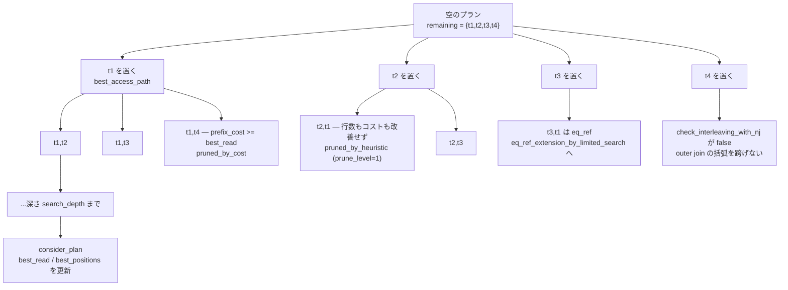

## 何を学んだか

join 順序探索の入口は [`Optimize_table_order::choose_table_order` (`sql/sql_planner.cc#L1953`)](https://github.com/mysql/mysql-server/blob/mysql-8.4.11/sql/sql_planner.cc#L1953) で、選択肢は 2 つしかない。

```cpp title="sql/sql_planner.cc (L2028)"
  if (straight_join)
    optimize_straight_join(join_tables);
  else {
    if (greedy_search(join_tables)) return true;
  }
```

`STRAIGHT_JOIN` なら順序を固定して 1 回舐めるだけ。そうでなければ [`greedy_search` (L2330)](https://github.com/mysql/mysql-server/blob/mysql-8.4.11/sql/sql_planner.cc#L2330) が回る。

greedy_search のアルゴリズムはこうだ。

1. 残りテーブルに対して、**深さ `search_depth` までの全探索**を [`best_extension_by_limited_search` (L2729)](https://github.com/mysql/mysql-server/blob/mysql-8.4.11/sql/sql_planner.cc#L2729) で行う
2. そこで見つかった最良プランの**先頭 1 個だけ**を確定する
3. 残りテーブルからそれを除いて 1 に戻る

`search_depth` が残りテーブル数以上なら 1 周で全探索が終わる。**既定値は 62 (`MAX_TABLES + 1`) なので、普通のクエリでは 1 周で完了し、貪欲法ではなく全探索になっている。** ただし全探索といっても 2 種類の枝刈りが入るので、本当に n! 通りを見るわけではない。



## ソースコードのどこか

### 探索前の並べ替え

探索に入る前に `best_ref` を並べ替える。ここで既に順序の当たりを付けている ([`choose_table_order` L1994 付近](https://github.com/mysql/mysql-server/blob/mysql-8.4.11/sql/sql_planner.cc#L1994))。

```cpp title="sql/sql_planner.cc"
    if (straight_join)
      merge_sort(join->best_ref + join->const_tables,
                 join->best_ref + join->tables, Join_tab_compare_straight());
    else
      merge_sort(join->best_ref + join->const_tables,
                 join->best_ref + join->tables, Join_tab_compare_default());
```

`Join_tab_compare_default` の比較順が、MySQL の join 順序の「勘」そのものだ ([L1860 付近](https://github.com/mysql/mysql-server/blob/mysql-8.4.11/sql/sql_planner.cc#L1860))。

```cpp title="sql/sql_planner.cc"
  if (jt1->dependent & jt2->table_ref->map()) return false;
  if (jt2->dependent & jt1->table_ref->map()) return true;

  const bool jt1_keydep_jt2 = jt1->key_dependent & jt2->table_ref->map();
  const bool jt2_keydep_jt1 = jt2->key_dependent & jt1->table_ref->map();

  if (jt1_keydep_jt2 && !jt2_keydep_jt1) return false;
  if (jt2_keydep_jt1 && !jt1_keydep_jt2) return true;

  if (jt1->found_records > jt2->found_records) return false;
  if (jt1->found_records < jt2->found_records) return true;

  return jt1 < jt2;
```

優先順位は **依存 → キー依存 → 行数の少ない順 → ポインタ値**。最後の `jt1 < jt2` はポインタ比較で、順序を安定にするためだけにある。枝刈りは「今まで見つかった最良より悪い枝を切る」形なので、**最初に良いプランを引き当てるほど枝刈りが効く**。この並べ替えはそのための下ごしらえだ。

### 探索深さの決め方

[`determine_search_depth` (L2080)](https://github.com/mysql/mysql-server/blob/mysql-8.4.11/sql/sql_planner.cc#L2080) は、`optimizer_search_depth = 0` のときだけ使われる。

```cpp title="sql/sql_planner.cc"
uint Optimize_table_order::determine_search_depth(uint search_depth,
                                                  uint table_count) {
  if (search_depth > 0) return search_depth;
  /* TODO: this value should be determined dynamically, based on statistics: */
  const uint max_tables_for_exhaustive_opt = 7;

  if (table_count <= max_tables_for_exhaustive_opt)
    search_depth =
        table_count + 1;  // use exhaustive for small number of tables
  else
    ...
    search_depth = max_tables_for_exhaustive_opt;  // use greedy search
```

既定は 0 ではなく `MAX_TABLES + 1 = 62` ([`sys_vars.cc#L3135`](https://github.com/mysql/mysql-server/blob/mysql-8.4.11/sql/sys_vars.cc#L3135)) なので、この関数は普段は素通りする。`0` に設定したときだけ「7 テーブルまでは全探索、それ以上は深さ 7 の貪欲法」というルールが効く。

doc comment は自嘲気味だ。

```cpp title="sql/sql_planner.cc"
  @note
    This is an extremely simplistic implementation that serves as a stub for a
    more advanced analysis of the join. Ideally the search depth should be
    determined by learning from previous query optimizations, because it will
    depend on the CPU power (and other factors).
```

計算量も明記されている。

```cpp title="sql/sql_planner.cc (L2639-2642)"
    The pseudocode below describes the algorithm of
    'best_extension_by_limited_search'. The worst-case complexity of this
    algorithm is O(N*N^search_depth/search_depth). When serch_depth >= N, then
    the complexity of greedy_search is O(N!).
```

**`search_depth >= N` なら O(N!)**。既定 62 は「実質いつも全探索」を意味する。20 テーブルの join でオプティマイザが固まるのはこれが理由だ。

### 2 種類の枝刈り

`best_extension_by_limited_search` のループの中にある。1 つ目はコストによる無条件の枝刈り ([L2828 付近](https://github.com/mysql/mysql-server/blob/mysql-8.4.11/sql/sql_planner.cc#L2828))。

```cpp title="sql/sql_planner.cc"
      if (position->prefix_cost >= join->best_read &&
          found_plan_with_allowed_sj) {
        ...
        trace_one_table.add("pruned_by_cost", true);
        backout_nj_state(remaining_tables, s);
        continue;
      }
```

途中までのコストが既に最良プラン全体のコストを超えたら、その先は見ない。コストは単調増加するので、この枝刈りは**正しさを壊さない**。

2 つ目が `optimizer_prune_level` で制御されるヒューリスティックだ ([L2843](https://github.com/mysql/mysql-server/blob/mysql-8.4.11/sql/sql_planner.cc#L2843))。

```cpp title="sql/sql_planner.cc"
      /*
        Prune some less promising partial plans. This heuristic may miss
        the optimal QEPs, thus it results in a non-exhaustive search.
      */
      if (prune_level == 1) {
        if (best_rowcount > position->prefix_rowcount ||
            best_cost > position->prefix_cost ||
            (idx == join->const_tables &&  // 's' is the first table in the QEP
             s->table() == join->sort_by_table)) {
          if (best_rowcount >= position->prefix_rowcount &&
              best_cost >= position->prefix_cost &&
              /* TODO: What is the reasoning behind this condition? */
              (!(s->key_dependent & remaining_tables) ||
               position->rows_fetched < 2.0)) {
            best_rowcount = position->prefix_rowcount;
            best_cost = position->prefix_cost;
          }
        } else if (found_plan_with_allowed_sj) {
          ...
          trace_one_table.add("pruned_by_heuristic", true);
```

**「同じ深さの他の候補と比べて、行数もコストも改善しない枝は捨てる」**。コメントが `This heuristic may miss the optimal QEPs` と認めているとおり、これは正しさを壊す枝刈りだ。内側の条件には `TODO: What is the reasoning behind this condition?` という自問まで残っている。

`optimizer_prune_level` は 0 か 1 だけで、既定 1 ([`sys_vars.cc#L3126`](https://github.com/mysql/mysql-server/blob/mysql-8.4.11/sql/sys_vars.cc#L3126))。

### eq_ref の特別扱い

3 つ目の枝刈りに近い最適化が [`eq_ref_extension_by_limited_search` (L3076)](https://github.com/mysql/mysql-server/blob/mysql-8.4.11/sql/sql_planner.cc#L3076) だ。条件は 3 つ ([L2880 付近](https://github.com/mysql/mysql-server/blob/mysql-8.4.11/sql/sql_planner.cc#L2880))。

```cpp title="sql/sql_planner.cc"
        if (prune_level == 1 &&             // 1)
            position->key != nullptr &&     // 2)
            position->rows_fetched <= 1.0)  // 3)
```

つまり「今置いたテーブルが eq_ref (先行行ごとに高々 1 行) なら」、そこから先は eq_ref で繋がるテーブルだけを一直線に伸ばす。**eq_ref は fanout が 1 なので、どんな順序で並べても行数が増えない。順序を探索する意味がない**という理屈だ。伸ばせるだけ伸ばしたら `eq_ref_extended` に集合が返り、それらは以後スキップされる (`pruned_by_eq_ref_heuristic`)。

マスタテーブルへの主キー join がたくさんある星型スキーマで、探索が現実的な時間で終わるのはこの最適化のおかげである。

### outer join の順序制約

[`check_interleaving_with_nj` (L3600)](https://github.com/mysql/mysql-server/blob/mysql-8.4.11/sql/sql_planner.cc#L3600) が、join nest の「括弧」を跨いだ順序を禁止する。doc comment の図が意図を示している。

```
                              +---- current position
                              |
             ... last_tab ))) | ( tab )  )..) | ...
                                X     Y   Z   |
                                              +- need to move to this
                                                 position.
```

join 順序を「テーブルを左から右へ書き並べ、適切な位置に `LEFT JOIN` と括弧を入れる」操作と見なす。`check_interleaving_with_nj(tab)` は「次に `tab` を書けるか」の判定だ。

```cpp title="sql/sql_planner.cc"
bool Optimize_table_order::check_interleaving_with_nj(JOIN_TAB *tab) {
  if (cur_embedding_map & ~tab->embedding_map) {
    /*
      tab is outside of the "pair of brackets" we're currently in.
      Cannot add it.
    */
    return true;
  }
```

**開いた括弧を閉じないうちに、外のテーブルへ飛べない。** `t1 LEFT JOIN (t2 JOIN t3) ON ...` があると、`t2` を置いてから `t3` を置かずに他のテーブルへ行くことはできない。`cur_embedding_map` が「開いている括弧」のビットマップ、`nj_counter` が「その nest の子を何個書いたか」で、探索が戻るときは `backout_nj_state` が両方を巻き戻す。

これは枝刈りではなく**意味の制約**で、`prune_level = 0` にしても消えない。

### `optimize_straight_join`

`STRAIGHT_JOIN` の場合は [L2120](https://github.com/mysql/mysql-server/blob/mysql-8.4.11/sql/sql_planner.cc#L2120) で、`best_ref` の順に `best_access_path` を 1 回ずつ呼んで累積コストを積むだけだ。順序の探索は無い。**ただしテーブルごとのアクセス方法 (ref / range / scan) は依然としてコストベースで選ばれる。**

doc comment に「任意の QEP のコストを計算するのにも使える」とあり、実際 semijoin materialization nest のコスト計算にも使われている。

## なぜそうなっているか

**貪欲法の枠組みなのに既定が全探索なのは、歴史的経緯と後方互換の産物だ。** `optimizer_search_depth` の既定は 8.0 以前から `MAX_TABLES + 1` で、これは「深さ制限を実質かけない」という意味になる。`determine_search_depth` に書かれた「7 テーブルまで全探索、それ以上は深さ 7」というルールは、`0` を明示的に設定したときにしか使われない。つまり **MySQL のオプティマイザは、既定では貪欲法ではなく (枝刈り付きの) 全探索をしている**。テーブル数が少ないクエリではこれで問題なく、多いクエリでは計画時間が爆発する。

**枝刈りをコストベースとヒューリスティックの 2 段にしたのは、コストだけでは足りなかったからだ。** コストによる枝刈りは「既に最良を超えた枝」しか切れない。だが同じ深さの候補が僅差で並ぶと、どれも切れずに全部展開される。`prune_level = 1` の「行数もコストも改善しないなら切る」は、この横方向の膨張を止めるためのもので、最適解を落としうることを承知で入っている。

**eq_ref を一直線に伸ばすのは、fanout 1 の join には順序の自由度が実質無いからだ。** 「先行行ごとに高々 1 行」なら、どこに置いても中間結果の行数は変わらない。コストの差はアクセスコストの合計だけになり、順序を変えても和は変わらない。だから探索木を横に広げる価値がない。この判断が `prune_level == 1` に紐づいているのは、厳密には「コストが完全に同じとは限らない」からだろう。

**`check_interleaving_with_nj` が必要なのは、outer join が可換でないからだ。** inner join なら任意の順序が同じ結果を出すが、`LEFT JOIN` は NULL 補完のタイミングで結果が変わる。join nest の括弧構造を保つことが、結果の同一性を保証する条件になっている。だから **`LEFT JOIN` を多用したクエリは、そもそも探索空間が狭い**。順序が思うようにならないときは、これが理由のことがある。

## どう活かすか

### テーブル数が増えたときの計画時間

`O(N!)` は 10 テーブルあたりから体感できる。症状はこうだ。

- `EXPLAIN` 自体に数秒かかる
- `SHOW PROCESSLIST` の `State` が `statistics` や `preparing` で止まる
- 同じクエリを何度実行しても、実行時間の下限が下がらない

対処は 3 通りある。

| 手                                         | 効果                                    | 副作用                                                                       |
| ------------------------------------------ | --------------------------------------- | ---------------------------------------------------------------------------- |
| `optimizer_search_depth` を下げる (例: 5)  | 探索が深さ 5 で打ち切られ、貪欲法になる | 最適でないプランを選びうる                                                   |
| `STRAIGHT_JOIN` / `/*+ JOIN_ORDER(...) */` | 探索そのものを飛ばす                    | 順序を人間が保証する必要がある                                               |
| 派生表に切り出す                           | 各 `Query_block` が独立に最適化される   | マージされると意味がない ([サブクエリのページ](./subquery-transformations/)) |

`optimizer_search_depth` はセッション変数で `HINT_UPDATEABLE` なので、`/*+ SET_VAR(optimizer_search_depth=5) */` で 1 文だけ変えられる ([ヒントと optimizer_switch](./optimizer-hints-and-switches/))。ただし [JOIN::optimize のページ](./optimizer-walkthrough/) で見たとおり `Optimize_table_order` のコンストラクタで固定されるので、文の実行中に変えても効かない。

### `STRAIGHT_JOIN` を使うとき

`STRAIGHT_JOIN` には 2 つの書き方があり、意味が違う。

- **`SELECT STRAIGHT_JOIN ...`** — クエリブロック全体。`SELECT_STRAIGHT_JOIN` が立ち、`optimize_straight_join` が使われる
- **`t1 STRAIGHT_JOIN t2`** — その 2 つの間だけ。`t2` が `t1` に依存するとマークされ、探索は行われるが順序が制約される

前者を使うと **semijoin flattening が無効になる** (`Join_tab_compare_straight` の assert が示すとおり、STRAIGHT_JOIN と semijoin は共存しない)。`IN (subquery)` を含むクエリで `STRAIGHT_JOIN` を付けると、意図せずサブクエリの扱いまで変わることに注意する。

### `optimizer_prune_level = 0` は最後の手段

「最適なプランを見逃している」と疑ったときに `SET optimizer_prune_level = 0` で確かめるのは有効だ。プランが変わるなら、ヒューリスティック枝刈りが原因と確定する。

ただし**本番で 0 のままにしてはいけない**。この枝刈りは横方向の膨張を止めているので、外すと計画時間が桁で増えうる。確認したら、`STRAIGHT_JOIN` や `JOIN_ORDER` ヒントで見つかった順序を固定するほうを選ぶ。

### 探索の様子は optimizer trace に全部出る

`considered_execution_plans` 配列が探索木そのものだ。読み方は次のとおり。

- 各要素が「あるテーブルをある位置に置いた」1 手。`plan_prefix` が現在のプレフィクス
- `condition_filtering_pct` / `rows_for_plan` / `cost_for_plan` が累積値
- `pruned_by_cost: true` — コスト枝刈り。正しい枝刈り
- `pruned_by_heuristic: true` — `prune_level=1` の枝刈り。**最適解を落としているかもしれない**
- `pruned_by_eq_ref_heuristic: true` — eq_ref 一直線の副作用
- `rest_of_plan` — 再帰の 1 段深いところ

`pruned_by_heuristic` が最良候補の近くに大量に出ているなら、探索が早く打ち切られている疑いがある。`optimizer_trace_max_mem_size` を超えると trace は**切り詰められる** (破棄ではない) ので、大きな join では出力の末尾が欠けることがある ([EXPLAIN ANALYZE のページ](./explain-analyze-and-tree/))。
