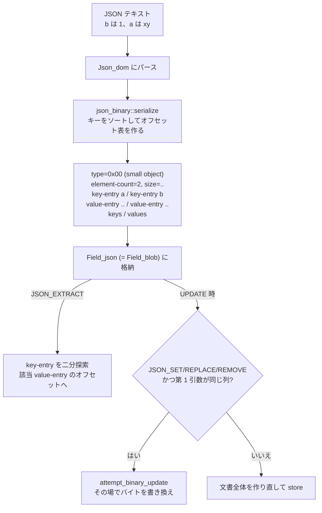

> **前提**: [LOB](./lob-storage/) / [型と Field クラス](./field-and-types/)

## 何を学んだか

`JSON` 列に入るのは、入力した JSON テキストではない。

```
doc ::= type value

object ::= element-count size key-entry* value-entry* key* value*
array  ::= element-count size value-entry* value*
```

[`sql-common/json_binary.h#L60`](https://github.com/mysql/mysql-server/blob/mysql-8.4.11/sql-common/json_binary.h#L60)。先頭 1 バイトが型で、オブジェクトと配列は**要素数と全体サイズ、それから各要素へのオフセット表**が本体より先に並ぶ。

- **`Field_json` は `Field_blob` の派生。** 格納の仕組み自体は BLOB と同じで、大きければページ外に出る
- **オフセット表があるので、パースせずに要素を引ける。** `JSON_EXTRACT(doc, '$.a')` は文書全体を読まない
- **キーはソートされて格納される。** ただし辞書順ではなく**長さが先**で、同じ長さなら辞書順
- **小さい値はオフセットの位置に直接埋め込まれる。** リテラルと小さい整数はポインタを介さない
- **条件が揃えば `UPDATE` はバイト列を直接書き換える。** 文書全体の再構築も、redo への全体の書き出しも起きない
- **その条件は狭い。** 関数が `JSON_SET` / `JSON_REPLACE` / `JSON_REMOVE` で、第 1 引数が更新対象の列そのものであること



## なぜそうなっているか

**テキストではなくオフセット表を持つ形式にしたのは、部分アクセスを O(log n) にするためだ。** `$.name` を取り出すのにテキストをパースすると、文書サイズに比例した時間がかかる。オフセット表があれば、キー表を二分探索してポインタをたどるだけで済む。JSON 列に対する `WHERE` や生成カラムの式は、この操作を毎行やることになる。

**キーをソートして持つのは、二分探索の前提を作るためだ。** 順序の定義が独特で、辞書順ではなく長さを先に見る。

```cpp title="sql-common/json_dom.h"
/**
  A comparator that is used for ordering keys in a Json_object. It
  orders the keys on length, and lexicographically if the keys have
  the same length. The ordering is ascending. This ordering was chosen
  for speed of look-up. See usage in Json_object_map.
*/
struct Json_key_comparator {
```

[`sql-common/json_dom.h#L339`](https://github.com/mysql/mysql-server/blob/mysql-8.4.11/sql-common/json_dom.h#L339)。長さで先に振り分ければ、探索対象のキーと長さが違う候補は 1 回の整数比較で捨てられる。文字列比較より安い。副作用として、`SELECT` で返ってくる JSON はキー順が入力と変わる。`{"bb":1,"a":2}` は `{"a": 2, "bb": 1}` になり、`{"b":1,"aa":2}` も `{"b": 1, "aa": 2}` と長さ順に並ぶ。

**小さい値を埋め込むのは、ポインタのオーバーヘッドを避けるためだ。** `true` や `1` を格納するのに、オフセット 4 バイト + 値 1 バイトを使うのは無駄になる。value-entry の「オフセット」の位置に値そのものを置いて、1 段の間接参照を消している。

**部分更新の条件が狭いのは、書き換え先が一意に決まる必要があるからだ。** `JSON_SET(doc, '$.a', 1)` は `doc` の中の 1 か所を差し替えるが、`JSON_MERGE_PATCH(doc, other)` は文書全体が変わりうる。前者だけを特別扱いする。第 1 引数が同じ列であることを要求するのは、**元の文書のバイト列を「その場で」書き換えるから**で、別の列や式の結果に対しては意味がない。

**部分更新には空きが要る。** 新しい値が古い値より長ければ、その場では書けない。`Json_wrapper::get_free_space` があるのはこのためで、文書内に空き領域があればそこを使い、なければ全体の書き直しに落ちる。

## ソースコードのどこか

### バイナリ形式 — 型 1 バイトとオフセット表

型の一覧はこうなっている。

```cpp title="sql-common/json_binary.cc"
constexpr char JSONB_TYPE_SMALL_OBJECT = 0x0;
constexpr char JSONB_TYPE_LARGE_OBJECT = 0x1;
constexpr char JSONB_TYPE_SMALL_ARRAY = 0x2;
constexpr char JSONB_TYPE_LARGE_ARRAY = 0x3;
constexpr char JSONB_TYPE_LITERAL = 0x4;
constexpr char JSONB_TYPE_INT16 = 0x5;
...
constexpr char JSONB_TYPE_STRING = 0xC;
constexpr char JSONB_TYPE_OPAQUE = 0xF;
```

[`sql-common/json_binary.cc#L62`](https://github.com/mysql/mysql-server/blob/mysql-8.4.11/sql-common/json_binary.cc#L62)。**small と large が分かれている**のが形式上の要点になる。

```
  // number of members in object or number of elements in array
  element-count ::=
      uint16 |  // if used in small JSON object/array
      uint32    // if used in large JSON object/array
```

[`sql-common/json_binary.h#L91`](https://github.com/mysql/mysql-server/blob/mysql-8.4.11/sql-common/json_binary.h#L91)。64KB を超える文書では、要素数もサイズもオフセットも 2 バイトから 4 バイトに変わる。**同じ内容でもサイズの境界をまたぐと表現が変わる**ので、境界付近の文書は更新でサイズが跳ねることがある。

`JSONB_TYPE_OPAQUE` (0x0F) は JSON にない MySQL の型を包む口だ。

```
  custom-data ::= custom-type data-length binary-data

  custom-type ::= uint8   // type identifier that matches the
                          // internal enum_field_types enum
```

[`sql-common/json_binary.h#L130`](https://github.com/mysql/mysql-server/blob/mysql-8.4.11/sql-common/json_binary.h#L130)。`CAST(NOW() AS JSON)` のような値は、`enum_field_types` の番号を付けてバイナリで埋め込まれる。JSON テキストに戻すときは `"2026-09-04 12:00:00.000000"` のような文字列になるが、**内部では日付時刻として保持されているので比較の意味が違う**。

### 部分更新の入口 — `attempt_binary_update`

```cpp title="sql-common/json_dom.cc"
bool Json_wrapper::attempt_binary_update(const Field_json *field,
                                         const Json_seekable_path &path,
                                         Json_wrapper *new_value, bool replace,
                                         String *result,
                                         bool *partially_updated,
                                         bool *replaced_path) {
  using namespace json_binary;

  // Can only do partial update if the input value is binary.
  assert(!is_dom());

  /*
    If we are replacing the top-level document, there's no need for
    partial update. The full document is rewritten anyway.
  */
  if (path.leg_count() == 0) {
    *partially_updated = false;
    *replaced_path = false;
    return false;
  }

  // Find the parent of the value we want to modify.
```

[`sql-common/json_dom.cc#L3406`](https://github.com/mysql/mysql-server/blob/mysql-8.4.11/sql-common/json_dom.cc#L3406)。`assert(!is_dom())` が示すとおり、**バイナリ表現のまま操作するのが前提**になる。一度 `Json_dom` (パース済みのツリー) に展開してしまうと、部分更新の道は閉じる。

`$` そのものを置き換える更新は最初に弾かれる。全体が変わるなら部分更新の意味がない。

### 採否の判定 — `supports_partial_update`

```cpp title="sql/item_json_func.cc"
bool Item_json_func::supports_partial_update(const Field_json *field) const {
  if (!can_use_in_partial_update()) return false;

  /*
    This JSON_SET, JSON_REPLACE or JSON_REMOVE expression might be used for
    partial update if the first argument is a JSON column which is the same as
    the target column of the update operation, or if the first argument is
    another JSON_SET, JSON_REPLACE or JSON_REMOVE expression which has the
    target column as its first argument.
  */

  Item *arg0 = args[0];
  ...
  if (arg0->type() == FIELD_ITEM)
    return down_cast<const Item_field *>(arg0)->field == field;

  return arg0->supports_partial_update(field);
}
```

[`sql/item_json_func.cc#L2139`](https://github.com/mysql/mysql-server/blob/mysql-8.4.11/sql/item_json_func.cc#L2139)。**入れ子は許される**。`JSON_SET(JSON_REMOVE(doc, '$.x'), '$.y', 1)` のように、いちばん内側が対象列であれば再帰的に true になる。

判定は `UPDATE` の準備段階で行われ、落ちた理由が記録される。

```cpp title="sql/sql_update.cc"
    if ((field->table->file->ha_table_flags() & HA_BLOB_PARTIAL_UPDATE) == 0) {
      reject_column("Storage engine does not support partial update");
      continue;
    }

    if (!value_item->supports_partial_update(field)) {
      reject_column(
          "Updated using a function that does not support partial "
          "update, or source and target column differ");
```

[`sql/sql_update.cc#L1394`](https://github.com/mysql/mysql-server/blob/mysql-8.4.11/sql/sql_update.cc#L1394)。`reject_column` は `Opt_trace_object` に書き込むラムダなので、**`optimizer_trace` を有効にすれば、なぜ部分更新にならなかったかが列ごとに読める**。

有効になったかどうかは実行時にビットマップで持たれる。

```cpp title="sql/table.cc"
bool TABLE::is_binary_diff_enabled(const Field *field) const {
  return m_partial_update_info != nullptr &&
         bitmap_is_set(&m_partial_update_info->m_enabled_binary_diff_columns,
                       field->field_index());
}
```

[`sql/table.cc#L7916`](https://github.com/mysql/mysql-server/blob/mysql-8.4.11/sql/table.cc#L7916)。「構文上の条件を満たす (marked)」と「実際に部分更新できた (enabled)」が別々に管理されている。空きが足りずに全体の書き直しに落ちれば、marked のまま enabled が下りる。

### binlog 側の部分更新

```cpp title="sql/sys_vars.cc"
static Sys_var_set Sys_binlog_row_value_options(
    "binlog_row_value_options",
    "When set to PARTIAL_JSON, this option enables a space-efficient "
    "row-based binary log format for UPDATE statements that modify a "
    "JSON value using only the functions JSON_SET, JSON_REPLACE, and "
    "JSON_REMOVE. ...",
    SESSION_VAR(binlog_row_value_options), CMD_LINE(REQUIRED_ARG),
    binlog_row_value_options_names, DEFAULT(0), ...
```

[`sql/sys_vars.cc#L6895`](https://github.com/mysql/mysql-server/blob/mysql-8.4.11/sql/sys_vars.cc#L6895)。**既定は 0 (無効)**。有効にすると、行イベントに JSON 列の新しい値全体ではなく差分が載る。

条件はストレージ側の部分更新と同じ関数群で判定されるが、**別のビット (logical diff) として管理される**。ストレージ側では空きが足りずに全体書き直しになっても、binlog には論理的な差分を載せられるからだ。

## どう活かすか

### キーの順序は保存されない、重複キーは残らない

バイナリ形式がキーを長さ順・辞書順で持つので、`{"b":1,"a":2}` を入れて読むと `{"a": 2, "b": 1}` が返る。**JSON 文書を「入力したテキストのまま」保存したいなら `JSON` 型を使ってはいけない**。`TEXT` に入れる必要がある。

同じ理由で、重複キーは 1 つに潰れる。空白やインデントも消える。署名の検証など、バイト列の同一性が要る用途では致命的になる。

### 大きい JSON の一部を更新するなら、書き方で桁が変わる

同じ「1 フィールドの更新」でも、

- `SET doc = JSON_SET(doc, '$.a', 1)` — 部分更新の条件を満たす
- `SET doc = JSON_SET(other_doc, '$.a', 1)` — 第 1 引数が別の列なので全体書き直し
- `SET doc = JSON_MERGE_PATCH(doc, '{"a":1}')` — 対象関数でないので全体書き直し

全体書き直しになると、**1MB の文書の 1 バイトを変えるために 1MB を書き、redo にも undo にも 1MB が流れる** ([redo ログ](./redo-log-walkthrough/) / [undo ログ](./undo-log/))。大きい JSON を頻繁に更新するテーブルでは、この差が I/O の大半を占めることがある。

判定の結果は `optimizer_trace` に理由つきで出るので、`SET optimizer_trace='enabled=on'` してから `UPDATE` を流し、`I_S.OPTIMIZER_TRACE` を見れば確認できる ([EXPLAIN ANALYZE](./explain-analyze-and-tree/))。

### 部分更新が効いても、空きがなければ落ちる

新しい値が古い値より長い場合、文書内に空きがなければ全体書き直しになる。**同じ `UPDATE` 文が、値の長さによって速かったり遅かったりする**ということだ。`"status": "ok"` を `"status": "processing"` に変えるのは伸びる更新なので、条件を満たしていても落ちうる。

安定させたいなら、更新頻度の高いフィールドは JSON から出して通常の列にする。これは関数インデックスを張るかどうかの判断とも重なる ([生成カラムと関数インデックス](./generated-columns-and-functional-indexes/))。

### 大きい JSON は行の外に出る

`Field_json` は `Field_blob` の派生なので、[LOB](./lob-storage/) の規則がそのまま適用される。レコードが 8126 バイトを超えると外部ページに追い出され、読むたびに追加の I/O が要る。**JSON 列を `SELECT *` で常に引いているクエリは、必要なフィールドだけを `->` で取り出す形に変えると I/O が減る**ことがある — ただしこれは外部格納されている場合の話で、小さい JSON なら差は出ない。

### 一般化して持ち帰るもの

**「読み取りの形をあらかじめ決めて、それに合わせた表現を選ぶ」**というのが JSON バイナリ形式の設計だ。テキストは書きやすく汎用だが、部分読み取りに向かない。オフセット表を先頭に置くと、書くときに全体サイズが確定するまで書き出せなくなる代わりに、読むときの計算量が変わる。自前でシリアライズ形式を決めるときも、この取引をどちらに倒すかが最初の判断になる。

もう 1 つは、**最適化の適用条件を実行計画に説明として残す**という設計だ。`reject_column` が理由の文字列を optimizer trace に書き込むおかげで、「なぜ速くならないのか」をソースを読まずに答えられる。効くかどうかが条件に依存する最適化を実装するなら、効かなかった理由を出す口も一緒に作る。
