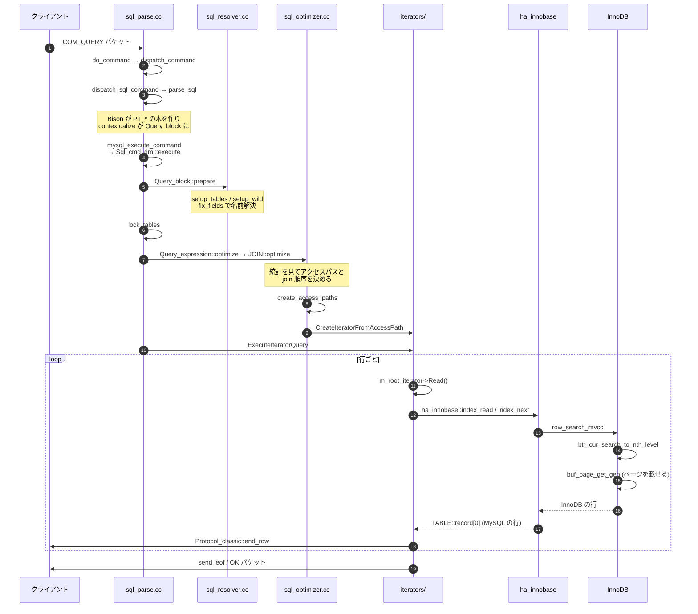

> **前提**: [pluggable storage engine](./pluggable-storage-engine/) / [用語集](./glossary/)

## 何を学んだか

1 本の SELECT は、大きく 6 つの段を通る。

1. **受信** — `do_command` がソケットから 1 パケット読み、コマンド種別で分岐する
2. **パースと解決** — Bison パーサが `PT_*` の木を作り、`contextualize` が `Query_block` に変換し、`Query_block::prepare` が名前を解決する
3. **最適化** — `JOIN::optimize` が走査方法と join 順序を決め、`AccessPath` の木を出力する
4. **iterator 化** — `CreateIteratorFromAccessPath` が `AccessPath` から `RowIterator` の木を組む
5. **実行** — `ExecuteIteratorQuery` が根の `Read()` をループで呼び、その中で `handler` → InnoDB → B+tree → バッファプールと降りる
6. **返送** — 行ごとに `Protocol_classic` がパケットを組み立て、`end_row` でネットワークバッファに書く

重要なのは、**3 と 4 が分かれていること**だ。最適化の出力は実行のコードではなく `AccessPath` というデータ構造で、これを iterator の木に変換するのは別の関数がやる。旧オプティマイザと hypergraph オプティマイザが共存できるのも、`EXPLAIN FORMAT=TREE` が実行計画をきれいに印字できるのも、この分離のおかげだ ([AccessPath のページ](./access-path-tree/))。



## なぜそうなっているか

**最適化の出力をデータ構造にしたのは、実行器を差し替え可能にするためだ。** 8.0 の途中まで、MySQL の実行は `JOIN::exec` を頂点とする巨大な手続きで、「今どのテーブルを読んでいるか」は `JOIN_TAB` の配列上のインデックスで表現されていた。この形だと新しい実行方式 (hash join、ウィンドウ関数のバッファリング) を足すたびに `JOIN::exec` に分岐が増える。`AccessPath` → `RowIterator` に分けたことで、新しい実行方式は「新しい `AccessPath::Type` と対応する `RowIterator` を足す」だけになった。同時に、**プランを印字する場所が 1 つに定まった**のが `EXPLAIN FORMAT=TREE` だ。

**`lock_tables` が prepare と optimize の間にあるのは、pruning とロック範囲のトレードオフの結果だ。** 先にロックすれば prepare 段階でもデータを見られるが、使わないパーティションまでロックしてしまう。後にロックすれば pruning が効くが、prepare はメタデータだけで完結しなければならない。MySQL は後者を選び、その制約をコメントに書き残した。

**実行ループが `Read()` の 1 本しかないのは、pull 型 (Volcano モデル) を選んだからだ。** 各 iterator は「1 行くれ」と言われたら 1 行返す。`LIMIT 10` は根の近くの `LimitOffsetIterator` が 10 行読んだ時点で `-1` を返せばよく、下位の iterator は自分が打ち切られたことすら知らなくてよい ([行の返送のページ](./sending-rows-and-limit/))。逆に、この形は 1 行あたりの関数呼び出しが深くなるので、ベクトル化とは相性が悪い。

## ソースコードのどこか

ここからは上の 6 段を実際の関数名で辿る。**個々の関数の中身を読む節ではなく、「誰が誰を呼ぶか」だけを頭に入れる節**だ。各関数の内部は層ごとの walkthrough に譲るので、ここでは経路の形と、8.0 時代の名前との対応だけを拾えばいい。

### 1. 受信 — `do_command`

[`sql/sql_parse.cc#L1321`](https://github.com/mysql/mysql-server/blob/mysql-8.4.11/sql/sql_parse.cc#L1321)。**入口で classic protocol であることを assert している**のが目を引く。

```cpp title="sql/sql_parse.cc"
bool do_command(THD *thd) {
  ...
  DBUG_TRACE;
  assert(thd->is_classic_protocol());
```

X Protocol はここを通らない。X Plugin は自前でメッセージをデコードしてから `dispatch_command` に合流する ([X Plugin のページ](./x-plugin-session-and-sql/))。

`do_command` は毎コマンドごとに socket の read timeout を張り直す。**`wait_timeout` はタイマースレッドで管理されているのではなく、この read timeout として実装されている** ([接続層のページ](./connection-layer/))。

### 2. ディスパッチとパース

[`dispatch_command` (L1741)](https://github.com/mysql/mysql-server/blob/mysql-8.4.11/sql/sql_parse.cc#L1741) が `COM_*` で分岐し、`COM_QUERY` なら [`dispatch_sql_command` (L5275)](https://github.com/mysql/mysql-server/blob/mysql-8.4.11/sql/sql_parse.cc#L5275) を呼ぶ。**8.0 系までこの関数は `mysql_parse` という名前だった。**

```cpp title="sql/sql_parse.cc"
void dispatch_sql_command(THD *thd, Parser_state *parser_state) {
  ...
  mysql_reset_thd_for_next_command(thd);
  thd->reset_rewritten_query();
  lex_start(thd);
  ...
  // we produce digest if it's not explicitly turned off
  // by setting maximum digest length to zero
  if (get_max_digest_length() != 0)
    parser_state->m_input.m_compute_digest = true;
  ...
  if (!err) {
    err = parse_sql(thd, parser_state, nullptr);
```

ダイジェスト ([ダイジェストのページ](./statement-digest/)) はここでフラグを立てるだけで、実際の計算はレキサの中で行われる。

[`parse_sql` (L7118)](https://github.com/mysql/mysql-server/blob/mysql-8.4.11/sql/sql_parse.cc#L7118) が Bison パーサを起動する。パーサ用に `Diagnostics_area` を一時的に差し替えるのがここで、**構文エラーがセッション状態を汚さない**という不変条件はこの差し替えと、Bison アクションが `THD` に触らないことの組み合わせで守られている ([2 パスのページ](./parse-tree-and-contextualize/))。

### 3. 実行コマンドへの分岐

[`mysql_execute_command` (L2909)](https://github.com/mysql/mysql-server/blob/mysql-8.4.11/sql/sql_parse.cc#L2909) が `lex->sql_command` で分岐し、DML なら `lex->m_sql_cmd->execute(thd)` を呼ぶ。SELECT / INSERT / UPDATE / DELETE はすべて [`Sql_cmd_dml::execute` (`sql/sql_select.cc#L676`)](https://github.com/mysql/mysql-server/blob/mysql-8.4.11/sql/sql_select.cc#L676) に集まる。

この関数の順序が重要だ。

```cpp title="sql/sql_select.cc"
  assert(!lex->is_query_tables_locked());
  /*
    Locking of tables is done after preparation but before optimization.
    This allows to do better partition pruning and avoid locking unused
    partitions. As a consequence, in such a case, prepare stage can rely only
    on metadata about tables used and not data from them.
  */
  if (!is_empty_query()) {
    if (lock_tables(thd, lex->query_tables, lex->table_count, 0)) goto err;
  }

  // Perform statement-specific execution
  if (execute_inner(thd)) goto err;
```

**prepare → lock_tables → optimize の順**で、コメントが理由をそのまま書いている。パーティション pruning を先に効かせて、使わないパーティションをロックしないためだ ([パーティショニングのページ](./partitioning/))。その代償として、prepare 段階では「テーブルのメタデータ」しか使えず、データを見た判断はできない。

### 4. 最適化と iterator 化

[`Sql_cmd_dml::execute_inner` (L1036)](https://github.com/mysql/mysql-server/blob/mysql-8.4.11/sql/sql_select.cc#L1036) は驚くほど短い。

```cpp title="sql/sql_select.cc"
bool Sql_cmd_dml::execute_inner(THD *thd) {
  Query_expression *unit = lex->unit;

  if (unit->optimize(thd, /*materialize_destination=*/nullptr,
                     /*create_iterators=*/true, /*finalize_access_paths=*/true))
    return true;
  ...
  if (lex->is_explain()) {
    ...
    if (explain_query(thd, thd, unit)) return true;
  } else {
    if (unit->execute(thd)) return true;
```

`create_iterators=true` という引数が示すとおり、**iterator の生成は最適化の一部として `Query_expression::optimize` の中で行われる**。EXPLAIN もここまでは同じ経路を通り、実行の直前で分岐する。だから `EXPLAIN` はプランを本当に作っている。

`Query_expression::optimize` は [`sql/sql_union.cc#L1004`](https://github.com/mysql/mysql-server/blob/mysql-8.4.11/sql/sql_union.cc#L1004)。各 `Query_block` の [`JOIN::optimize` (`sql/sql_optimizer.cc#L362`)](https://github.com/mysql/mysql-server/blob/mysql-8.4.11/sql/sql_optimizer.cc#L362) を呼び、[`JOIN::create_access_paths` (`sql/sql_executor.cc#L3043`)](https://github.com/mysql/mysql-server/blob/mysql-8.4.11/sql/sql_executor.cc#L3043) で `AccessPath` の木を作り、最後に [`CreateIteratorFromAccessPath` (`sql/join_optimizer/access_path.cc#L488`)](https://github.com/mysql/mysql-server/blob/mysql-8.4.11/sql/join_optimizer/access_path.cc#L488) で `RowIterator` の木に変換する。

### 5. 実行 — `ExecuteIteratorQuery`

[`sql/sql_union.cc#L1688`](https://github.com/mysql/mysql-server/blob/mysql-8.4.11/sql/sql_union.cc#L1688)。**`JOIN::exec` は 8.4 に存在しない。** 実行の本体はこの関数の `for (;;)` だけだ。

```cpp title="sql/sql_union.cc"
    if (m_root_iterator->Init()) {
      return true;
    }

    PFSBatchMode pfs_batch_mode(m_root_iterator.get());

    for (;;) {
      int error = m_root_iterator->Read();
      ...
      if (error > 0 || thd->is_error())  // Fatal error
        return true;
      else if (error < 0)
        break;
      else if (thd->killed)  // Aborted by user
      {
        thd->send_kill_message();
        return true;
```

`Read()` の戻り値は 3 値で、`0` = 行が取れた、`-1` = もう行がない、`1` = エラー。**ソートも集約も JOIN も、全部この 1 本のループの下に押し込まれている** ([エグゼキュータのページ](./executor-walkthrough/))。

### 6. InnoDB へ降りる

葉の `RowIterator` は `handler` のメソッドを呼ぶ。インデックス走査なら [`ha_innobase::index_read` (`ha_innodb.cc#L10424`)](https://github.com/mysql/mysql-server/blob/mysql-8.4.11/storage/innobase/handler/ha_innodb.cc#L10424) → [`row_search_mvcc` (`row0sel.cc#L4420`)](https://github.com/mysql/mysql-server/blob/mysql-8.4.11/storage/innobase/row/row0sel.cc#L4420) と降りる。2 行目以降は [`ha_innobase::index_next` (L10858)](https://github.com/mysql/mysql-server/blob/mysql-8.4.11/storage/innobase/handler/ha_innodb.cc#L10858) → [`general_fetch` (L10774)](https://github.com/mysql/mysql-server/blob/mysql-8.4.11/storage/innobase/handler/ha_innodb.cc#L10774) を通る。

`row_search_mvcc` の中で 3 つのことが起きる。

- [`btr_cur_search_to_nth_level` (`btr0cur.cc#L620`)](https://github.com/mysql/mysql-server/blob/mysql-8.4.11/storage/innobase/btr/btr0cur.cc#L620) で B+tree を根から葉まで降りる ([B+tree 操作のページ](./btree-operations/))
- そのたびに [`buf_page_get_gen` (`buf0buf.cc#L4456`)](https://github.com/mysql/mysql-server/blob/mysql-8.4.11/storage/innobase/buf/buf0buf.cc#L4456) がページをバッファプールに載せる ([バッファプールのページ](./buffer-pool-walkthrough/))
- 見つけたレコードが**自分の read view から見えるか**を判定し、見えなければ undo を辿って古い版を組み立てる ([read view のページ](./read-view-and-visibility/))

見えた行は `row_sel_store_mysql_rec` で InnoDB のバイト列から MySQL の行フォーマット (`TABLE::record[0]`) に詰め替えられる ([行フォーマット変換のページ](./row-format-conversion/))。

### 7. 返送

木の根が返した行は [`Query_result_send::send_data` (`sql/query_result.cc#L97`)](https://github.com/mysql/mysql-server/blob/mysql-8.4.11/sql/query_result.cc#L97) → [`THD::send_result_set_row` (`sql/sql_class.cc#L2914`)](https://github.com/mysql/mysql-server/blob/mysql-8.4.11/sql/sql_class.cc#L2914) を通り、`Item` ごとに `Protocol::store_*` が呼ばれ、最後に [`Protocol_classic::end_row` (`sql/protocol_classic.cc#L3260`)](https://github.com/mysql/mysql-server/blob/mysql-8.4.11/sql/protocol_classic.cc#L3260) が 1 行分のパケットをネットワークバッファに書く。

全行が終わったら `send_eof`。ただし [L1315](https://github.com/mysql/mysql-server/blob/mysql-8.4.11/sql/protocol_classic.cc#L1315) を見ると、`CLIENT_DEPRECATE_EOF` を交渉したクライアントには**本物の EOF ではなく OK パケットが送られる** ([テキストプロトコルのページ](./text-protocol-and-resultset/))。

## どう活かすか

**遅いクエリがどの段で遅いのかを、この 6 段で切り分ける。**

| 症状                                 | 疑う段     | 見るもの                                                                     |
| ------------------------------------ | ---------- | ---------------------------------------------------------------------------- |
| 同じクエリが速いときと遅いときがある | 5 (実行)   | バッファプールヒット率、ロック待ち                                           |
| `EXPLAIN` の `rows` が実際と桁違い   | 3 (最適化) | 統計、[EXPLAIN ANALYZE](./explain-analyze-and-tree/) の actual rows          |
| インデックスがあるのに `type: ALL`   | 2 または 3 | 暗黙の型変換 ([名前解決のページ](./name-resolution-and-items/))、range 分析  |
| 行数は少ないのに時間がかかる         | 6 (返送)   | クライアントが遅い、`net_write_timeout`                                      |
| プリペアが毎回作り直されている       | 2          | `Com_stmt_reprepare` ([PS のページ](./binary-protocol-prepared-statements/)) |

**`EXPLAIN` は最適化まで本当に走っている。** `Sql_cmd_dml::execute_inner` を見れば分かるとおり、EXPLAIN も `unit->optimize(...)` を通り、iterator まで作ってから実行の直前で分岐する。だから EXPLAIN の実行にもロック取得 (MDL) が伴い、`EXPLAIN` が MDL 待ちで止まることがある。

**関数名を 8.4 のものに更新しておく。** スタックトレースやプロファイルを読むとき、`mysql_parse` や `JOIN::exec` を探しても出てこない。この経路の名前は次のとおり。

```
do_command
  dispatch_command
    dispatch_sql_command      (旧 mysql_parse)
      parse_sql
      mysql_execute_command
        Sql_cmd_dml::execute
          Query_block::prepare
          lock_tables
          Sql_cmd_dml::execute_inner
            Query_expression::optimize
              JOIN::optimize
              JOIN::create_access_paths
              CreateIteratorFromAccessPath
            Query_expression::execute
              Query_expression::ExecuteIteratorQuery    (旧 JOIN::exec)
                RowIterator::Read
                  ha_innobase::index_read / index_next
                    row_search_mvcc
                      btr_cur_search_to_nth_level
                        buf_page_get_gen
                Protocol_classic::end_row
```
