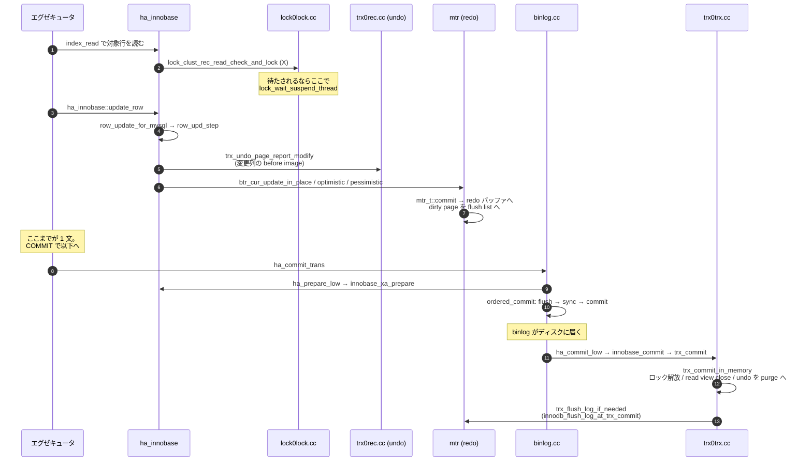

## 何を学んだか

`UPDATE t SET v = 2 WHERE id = 1` が完了するまでに、SELECT にはない 4 つの仕事が加わる。

1. **行ロック** — 読んだ行に排他ロックを取る。読むだけの経路 (`row_search_mvcc`) と同じ関数を通るが、ロック取得の分岐に入る
2. **undo** — 書き換える前の値を undo ログに退避する。**これはロールバック用であると同時に、他のトランザクションが古い版を読むための材料でもある**
3. **redo** — ページの変更を mini-transaction (mtr) 単位で redo ログに書く。mtr がコミットされた瞬間に、そのページは dirty page として flush list に載る
4. **2 相コミット** — binlog と InnoDB の 2 つの参加者があるとき、`ha_commit_trans` が prepare → binlog 書き込み → commit の順に進める

順序の要点は 2 つある。**undo は redo より先に書かれる** (undo ページ自体の変更もまた redo に記録される) ことと、**binlog は InnoDB の commit より先にディスクに届く**ことだ。後者はクラッシュ時に「binlog に出たがレプリカに送られなかった」ではなく「binlog に出たのに source では消えた」を防ぐためで、詳細は[2PC のページ](./two-phase-commit-and-group-commit/)。



## ソースコードのどこか

### 行を読んでロックする

UPDATE も対象行を読むところは SELECT と同じ [`row_search_mvcc`](https://github.com/mysql/mysql-server/blob/mysql-8.4.11/storage/innobase/row/row0sel.cc#L4420) を通る。違うのは、**読んだ行に対して明示ロックを取る分岐に入る**ことだ。クラスタードインデックスなら [`lock_clust_rec_read_check_and_lock` (`lock0lock.cc#L5509`)](https://github.com/mysql/mysql-server/blob/mysql-8.4.11/storage/innobase/lock/lock0lock.cc#L5509)、セカンダリなら [`lock_sec_rec_read_check_and_lock` (L5460)](https://github.com/mysql/mysql-server/blob/mysql-8.4.11/storage/innobase/lock/lock0lock.cc#L5460)。

REPEATABLE READ ではここで **next-key lock** (レコード + 直前のギャップ) を取るのが既定で、READ COMMITTED ではギャップ部分が落ちる。この差がどこで判定されているかは[RR と RC のページ](./locking-in-rr-vs-rc/)、ロックの種類そのものは[ロックのページ](./lock-modes-and-types/)。

ロックが取れなければ [`lock_wait_suspend_thread` (`lock0wait.cc#L206`)](https://github.com/mysql/mysql-server/blob/mysql-8.4.11/storage/innobase/lock/lock0wait.cc#L206) でスレッドが眠る。**この待ちを解くのは、ロックを持っていた側のコミットか、`lock_wait_timeout_thread` による timeout かデッドロック判定**で、待っているスレッド自身は何もしない ([デッドロック検出のページ](./deadlock-detection/))。

### 行を書き換える

SQL 層から見た入口は [`ha_innobase::update_row` (`ha_innodb.cc#L10004`)](https://github.com/mysql/mysql-server/blob/mysql-8.4.11/storage/innobase/handler/ha_innodb.cc#L10004)。ここから [`row_update_for_mysql` (`row0mysql.cc#L2443`)](https://github.com/mysql/mysql-server/blob/mysql-8.4.11/storage/innobase/row/row0mysql.cc#L2443) → `row_upd_step` → [`row_upd_clust_step` (`row0upd.cc#L3008`)](https://github.com/mysql/mysql-server/blob/mysql-8.4.11/storage/innobase/row/row0upd.cc#L3008) と降りる。

`row_upd_clust_step` は関数の頭で `mtr_t mtr;` を宣言する。**ここから mtr のスコープが始まり、この中で触ったページの変更は 1 つの原子単位として redo に記録される** ([mini-transaction のページ](./mini-transaction/))。

### undo に旧値を退避する

[`trx_undo_page_report_modify` (`trx0rec.cc#L1154`)](https://github.com/mysql/mysql-server/blob/mysql-8.4.11/storage/innobase/trx/trx0rec.cc#L1154) が、変更される列の before image を undo ログページに書く。INSERT 用の [`trx_undo_page_report_insert` (L483)](https://github.com/mysql/mysql-server/blob/mysql-8.4.11/storage/innobase/trx/trx0rec.cc#L483) が PK しか書かないのと対照的だ。INSERT のロールバックは「その行を消す」だけで済むが、UPDATE のロールバックには旧値が要る。

そして同じ undo レコードが、**他のトランザクションが古い版を読むための材料**にもなる。[`trx_undo_prev_version_build` (L2447)](https://github.com/mysql/mysql-server/blob/mysql-8.4.11/storage/innobase/trx/trx0rec.cc#L2447) がそれを逆向きに適用する ([undo ログのページ](./undo-log/)、[read view のページ](./read-view-and-visibility/))。

更新後のレコードには、この undo レコードを指す `DB_ROLL_PTR` と、更新したトランザクションの `DB_TRX_ID` が書き込まれる。この 2 つは**すべての行が持っている隠し列**で、合わせて 13 バイトある ([行フォーマット変換のページ](./row-format-conversion/))。

### mtr のコミットで redo とダーティページが確定する

[`mtr_t::commit` (`mtr0mtr.cc#L659`)](https://github.com/mysql/mysql-server/blob/mysql-8.4.11/storage/innobase/mtr/mtr0mtr.cc#L659) → [`Command::execute` (L839)](https://github.com/mysql/mysql-server/blob/mysql-8.4.11/storage/innobase/mtr/mtr0mtr.cc#L839) で、貯めておいた redo レコードがログバッファにコピーされ、触ったページが `oldest_modification` 付きで flush list に繋がれる。

**この時点ではまだ何もディスクに書かれていない。** redo ログバッファはメモリで、ダーティページもメモリだ。ディスクに落ちるのは、redo なら log writer / flusher スレッド ([log writer のページ](./log-writer-threads/))、ページなら page cleaner ([page cleaner のページ](./flush-list-and-page-cleaner/)) の仕事になる。

### COMMIT — 2 相コミット

[`ha_commit_trans` (`sql/handler.cc#L1634`)](https://github.com/mysql/mysql-server/blob/mysql-8.4.11/sql/handler.cc#L1634) が調停する。核心は 1 行だ。

```cpp title="sql/handler.cc"
    if (!trn_ctx->no_2pc(trx_scope) && (trn_ctx->rw_ha_count(trx_scope) > 1))
      error = tc_log->prepare(thd, all);
  }
  ...
  if (error || (error = tc_log->commit(thd, all))) {
    ha_rollback_trans(thd, all);
```

**2 相コミットに入るのは、書き込みを行った参加者が 2 つ以上あるときだけ**だ。binlog が有効なら binlog も参加者に数えられるので、`log_bin=ON` + InnoDB という普通の構成で `rw_ha_count == 2` になり、prepare が走る。逆に **binlog を切ると 2PC が消える**。これが binlog を有効にしたときの書き込みコスト増の大きな部分を占める。

`tc_log` は [`sql/tc_log.h#L144`](https://github.com/mysql/mysql-server/blob/mysql-8.4.11/sql/tc_log.h#L144) のインターフェースで、binlog が有効なら実体は `MYSQL_BIN_LOG`。

- prepare: [`MYSQL_BIN_LOG::prepare` (`binlog.cc#L8083`)](https://github.com/mysql/mysql-server/blob/mysql-8.4.11/sql/binlog.cc#L8083) が [`ha_prepare_low` (`handler.cc#L2321`)](https://github.com/mysql/mysql-server/blob/mysql-8.4.11/sql/handler.cc#L2321) を呼び、InnoDB に XA PREPARE させる
- commit: [`MYSQL_BIN_LOG::commit` (L8136)](https://github.com/mysql/mysql-server/blob/mysql-8.4.11/sql/binlog.cc#L8136) → [`ordered_commit` (L8924)](https://github.com/mysql/mysql-server/blob/mysql-8.4.11/sql/binlog.cc#L8924)

`ordered_commit` はグループコミットの本体で、flush ステージ → sync ステージ → commit ステージのキューを順に処理する。同時にコミットしようとしたセッションが束ねられ、代表 1 本が全員分の `write` と `fsync` をまとめて行う ([binlog walkthrough](./binlog-walkthrough/))。

### InnoDB 側のコミット

commit ステージから [`ha_commit_low` (`handler.cc#L1907`)](https://github.com/mysql/mysql-server/blob/mysql-8.4.11/sql/handler.cc#L1907) → [`innobase_commit` (`ha_innodb.cc#L6013`)](https://github.com/mysql/mysql-server/blob/mysql-8.4.11/storage/innobase/handler/ha_innodb.cc#L6013) → [`trx_commit` (`trx0trx.cc#L2257`)](https://github.com/mysql/mysql-server/blob/mysql-8.4.11/storage/innobase/trx/trx0trx.cc#L2257) と降りる。

[`trx_commit_in_memory` (L1963)](https://github.com/mysql/mysql-server/blob/mysql-8.4.11/storage/innobase/trx/trx0trx.cc#L1963) で、このトランザクションが持っていたものが一斉に解放される。**行ロックが外れるのはここ**で、待っていた他のスレッドが起こされる。read view も閉じられ、undo ログは purge の対象キューに移される ([purge のページ](./purge/))。

redo の `fsync` をどうするかは `innodb_flush_log_at_trx_commit` の switch で決まる。

```cpp title="storage/innobase/trx/trx0trx.cc"
  switch (srv_flush_log_at_trx_commit) {
    case 2:
      /* Write the log but do not flush it to disk */
      flush = false;
      [[fallthrough]];
    case 1:
      /* Write the log and optionally flush it to disk */
      wait_stats = log_write_up_to(*log_sys, lsn, flush);
      ...
      return;
    case 0:
      /* Do nothing */
      return;
  }
```

`=2` は `write(2)` まではするが `fsync` しない。OS が生きていればプロセスが落ちても失われないが、OS ごと落ちれば失う。`=0` はコミット時に何もしない — redo レコード自体は mtr のコミット時点でログバッファに入っているので、それをファイルへ出すのも `fsync` するのも背景スレッドの周期任せになる ([log writer のページ](./log-writer-threads/))。

## なぜそうなっているか

**undo が「ロールバック用」と「MVCC 用」を兼ねているのが、InnoDB の MVCC の性格を決めている。** PostgreSQL は新しい版をテーブル本体に追記して古い版もそこに残すが、InnoDB は**テーブル本体には常に最新版を置き、古い版は undo に退避する**。この選択の帰結が 2 つある。

- 最新版の読み書きが速い。テーブルは PK の B+tree なので、PK でたどれば版鎖を歩かずに最新版に着く
- **長いトランザクションが直接コストになる。** 古い read view が生きている間はその版を作るための undo を消せないので、undo が膨らみ、古い版を読む側は版鎖を長く辿ることになる ([purge のページ](./purge/))

**2 相コミットが「参加者 2 つ以上」で条件付けられているのは、コストが実測できるほど大きいからだ。** prepare を挟むと `fsync` の回数が増え、binlog と InnoDB の書き込み順序に依存関係ができてグループコミットの調停が必要になる。参加者が 1 つなら順序を揃える相手がいないので、丸ごと省略できる。クラッシュリカバリ側も、2PC エンジンが 1 つしかない構成なら XID のスキャンを飛ばす ([binlog recovery](./two-phase-commit-and-group-commit/))。

**行ロックの解放がコミットの最後にまとまっているのは、2 相ロック (2PL) をそのまま実装しているからだ。** 途中で解放するとダーティリードや non-repeatable read の余地が生まれる。裏返すと、**トランザクションを長く開けておくと、最初の 1 文で取ったロックが最後まで解放されない**。

## どう活かすか

**ロック待ちの原因を「取った側」で考える。** ロック待ちの被害者は `SHOW ENGINE INNODB STATUS` や `performance_schema.data_locks` で見えるが ([data_locks のページ](./data-locks-and-sys-schema/))、直すべきは**ロックを持ったまま長く生きているトランザクション**のほうだ。ロックが解放されるのは `trx_commit_in_memory` の中、つまりコミット/ロールバックの瞬間しかない。アプリ側で「トランザクションを開いたまま外部 API を叩く」のが致命的なのはこのためだ。

**`innodb_flush_log_at_trx_commit=2` が失うものを正確に把握する。** 失うのは「OS ごと落ちたときの、直近 1 秒程度のコミット」だ。プロセスクラッシュだけなら失わない。一方で **binlog の `sync_binlog=1` を維持していても、`innodb_flush_log_at_trx_commit=2` ならレプリカと source の状態がクラッシュ後にずれうる**。この 2 つは別のパラメータで、両方を 1 にして初めて完全な耐久性になる。

**binlog を有効にすると書き込みが遅くなる理由が 2 つある。** 2PC の prepare が入ることと、binlog キャッシュの `write` + `fsync` が増えることだ。前者は `rw_ha_count > 1` の条件から来ている構造的なコストで、設定では消せない。後者は `sync_binlog` と `binlog_group_commit_sync_delay` で調整できる。

**大量 DELETE の後にロールバックすると、コミットよりずっと遅い。** コミットは「確定した」と宣言してロックを外すだけだが、ロールバックは undo を 1 レコードずつ逆適用して回る ([コミットとロールバックのページ](./commit-and-rollback-internals/))。巨大な DML は分割して実行するほうが、失敗時の回復も速い。
